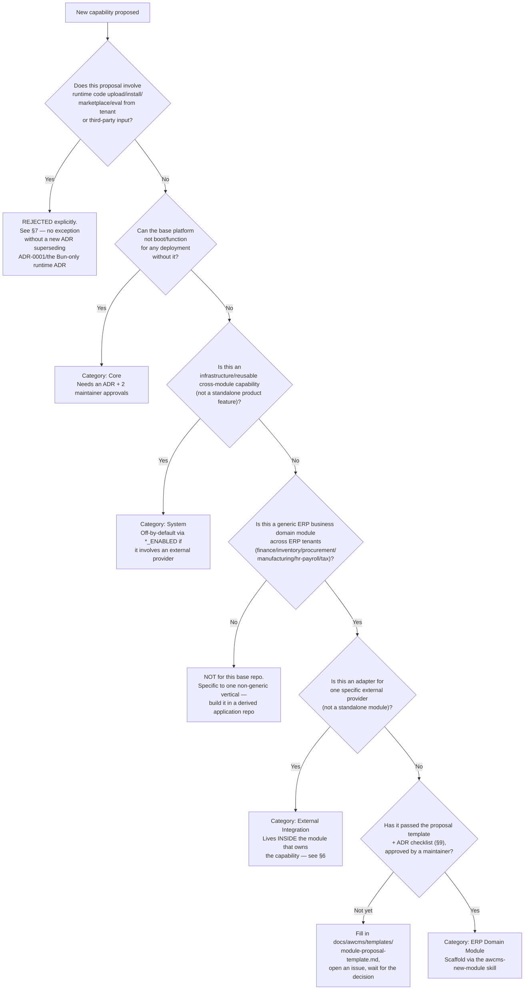

🇬🇧 English (source) · 🇮🇩 [Bahasa Indonesia](21_module_admission_governance.id.md)

# Part 21 — Module Admission, Lifecycle, and Registry Governance

> **Status:** Adapted from `docs/awcms-mini/21_module_admission_governance.md`. The admission mechanism (five module categories, decision tree, trusted static registry policy) is **generic and applies directly** to this `awcms` repo. **What does NOT apply directly**: the concrete module map in the source document (16 registered modules, issues/ADRs specific to the origin repo) — because `awcms` **does not have a single implemented module yet** (see [ADR-0001](../adr/0001-rebuild-on-awcms-foundation-erp-scope.md)). §8 of this document therefore contains an **illustrative target map** for the planned ERP modules (doc 11), not a mapping of modules that already exist in `src/modules/index.ts` — the real registry is still empty.
> **Related:** ADR-0001 (rebuild as an ERP platform). Supporting ADRs for other module governance (Core/System admission, extension layer, registry composition) will be recorded as separate ADRs as soon as they are needed, following the pattern of `docs/adr/0012`–`0014` in the origin repo.

## 1. Context and purpose

This repo is restarted as an **ERP + business integration** platform without a
single domain module implemented. `src/modules/index.ts` does not exist yet
(the `src/` folder has not been created). Before the first module is written,
admission and ownership rules have to be explicit from the start — that is the
purpose of this document, inherited from the standard already proven in the
`awcms-mini` base.

This document defines:

1. The five module categories and the admission decision tree.
2. Admission criteria, lifecycle status, dependency rules, security review,
   ownership, and the deprecation/removal policy per category.
3. Offline/LAN vs full-online-only compatibility expectations.
4. The trusted static registry policy and the explicit ban on
   runtime code upload/install/marketplace.
5. A lightweight proposal template + architecture decision checklist (to be
   created in `docs/awcms/templates/` as soon as the first module is proposed).
6. The target map of planned ERP + business integration modules (§8) — **not**
   a mapping of existing modules, because there is no module in the registry
   yet.

**What is a hard guardrail** (not loosened by this document): the module
registry stays **static, trusted, code-only, reviewed through a normal PR** —
see §7. No marketplace or runtime install infrastructure is built by this
document.

## 2. The five module categories

| Category                           | Definition                                                                                                                                                                                                                                                                                                                                                                                     | Who maintains it                                        | Can it be disabled per tenant?                                                                                                                                                                                            |
| ---------------------------------- | ---------------------------------------------------------------------------------------------------------------------------------------------------------------------------------------------------------------------------------------------------------------------------------------------------------------------------------------------------------------------------------------------- | ------------------------------------------------------- | ------------------------------------------------------------------------------------------------------------------------------------------------------------------------------------------------------------------------- |
| **Core**                           | Mandatory foundation: without it the platform cannot boot/function for any deployment (tenant, identity, base RLS/ABAC). Always active in every deployment profile.                                                                                                                                                                                                                            | Base maintainers (`@ahliweb`, see `.github/CODEOWNERS`) | No — it is never `disabled` globally; per-tenant enable/disable (`awcms_tenant_modules`) has no meaningful effect because other modules depend on it transitively.                                                        |
| **System**                         | Cross-module platform capabilities (observability, sync/offline infra, generic email, generic reporting, generic workflow, module management itself). Infrastructure/reusable in nature, not a standalone end-user product feature. Can be off by default (feature flag) without stopping Core.                                                                                                | Base maintainers                                        | Mostly yes, through a `*_ENABLED` env flag (default off) — not through module status, because these modules themselves must stay registered (status `active`) so that `bun run db:migrate`/registry sync stay consistent. |
| **ERP Domain Module**              | The core business domain modules of this ERP platform itself: finance-accounting, inventory-warehouse, procurement, manufacturing, hr-payroll, tax-coretax. Directly valuable to the business, opt-in per tenant according to the tenant's package/needs. **Different from awcms-mini**: in this repo the ERP domain modules LIVE in this base repo itself, not in a derived application repo. | Platform maintainers                                    | Yes — `awcms_tenant_modules` per tenant (e.g. a tenant that does not need manufacturing can disable it).                                                                                                                  |
| **Derived Application (vertical)** | Modules specific to a non-generic business vertical on top of this ERP platform (e.g. an industry-specific customisation that is not generic across all ERP tenants) — if one day it is needed, it lives in a separate derived application repo/branch, not in this repo.                                                                                                                      | Each derived application team                           | N/A — entirely outside the base registry.                                                                                                                                                                                 |
| **External Integration**           | External provider adapters (payment gateway, marketplace, tax/Coretax upload, logistics, Cloudflare R2, OIDC, etc.) — **not** a separate top-level module by default, but a sub-component inside the System/ERP Domain module that owns it (e.g. `finance-accounting` → payment gateway, `sync-storage` → R2, `tax-coretax` → Coretax XML).                                                    | The module that owns the capability                     | Yes — always opt-in via `*_ENABLED`, default off.                                                                                                                                                                         |

The `ModuleType` field (`src/modules/_shared/module-contract.ts`, to be created
in Sprint 1 — see doc 11) is planned to have five values —
`"base" | "system" | "domain" | "integration" | "derived"` — mapped to the
categories above: `base`→Core, `system`→System, `domain`→ERP Domain Module,
`integration`→External Integration (if it one day needs to become a top-level
module of its own rather than a sub-component), `derived`→Derived Application
(this value will not be used by any module in this `awcms` repo itself — it is
only relevant if one day there is a derived application repo that vendors the
same type).

## 3. Admission decision tree

Use this tree to decide **which repo** and **which category** a new capability
must go into, before writing any code.

`Q5` is deliberately placed **before** `Q1` (not only on one branch) — every
category (Core/System/Derived/External Integration/ERP Domain Module) passes
through this gate first, with no shortcut of any kind.

Textual summary (in case mermaid is not rendered):

1. **Does it involve runtime code upload/install/marketplace/eval from any
   tenant/third-party input?** → **Explicitly rejected**, without exception
   (§7) — this gate applies to ALL the categories below, not only ERP
   Domain Modules.
2. **Mandatory for boot in every deployment profile?** → **Core**.
3. **Not Core, but reusable cross-module infrastructure (not a standalone
   product feature)?** → **System**.
4. **Not infrastructure, but also not a generic ERP business domain across
   tenants (specific to one non-generic vertical)?** → **not for this repo**,
   point it at a derived application.
5. **A generic ERP business domain**, but only an adapter for one external
   provider (payment gateway/marketplace/Coretax/logistics)? → **External
   Integration** inside the module that owns the capability.
6. Everything else (a generic ERP domain module, opt-in, not pure
   infrastructure) → **ERP Domain Module**, through the proposal template +
   ADR checklist (§9) before scaffolding.

## 4. Admission criteria per category

### 4.1 Core

- Must have an ADR explaining why the platform cannot function
  without it.
- Approved by at least two maintainers when available (GOVERNANCE.md §Standards
  changes).
- Must not have a dependency on any System/ERP Domain Module/External
  Integration module (the dependency direction is always from System/Domain →
  Core, never the other way round) — this will be enforced automatically by the
  dependency graph validator once implemented (see doc 11 Sprint 3).
- Must not call any external provider directly on the critical path (it must
  keep working 100% offline/LAN).

Core candidate examples (target, not implemented yet): `tenant_admin`,
`identity_access`, `profile_identity`.

### 4.2 System

- May depend on Core, must not depend on an ERP Domain Module or on another
  System module in a way that creates a cycle (checked automatically by the
  same dependency graph validator).
- If it wraps an external provider (email, sync/R2, DNS): it must be
  off-by-default (`*_ENABLED=false`) and must pass the §6 checklist.
- Must have a `jobs`/`health` descriptor if it operates a scheduled process
  (the `ModuleJobDescriptor`/`ModuleHealthContract` pattern, see doc 10).

System candidate examples (target): `module_management`, `observability_logging`,
`sync_storage`, `email`, `reporting`, `workflow`, `database_connectivity`.

### 4.3 ERP Domain Module

- Must be generic for **all** potential ERP tenants, not specific to one
  non-generic vertical (see the §3 decision tree, node Q3). Finance,
  inventory, procurement, manufacturing, hr-payroll, and tax-coretax pass
  this criterion because they are needed across industries (manufacturing,
  services, trading, etc.), not specific to one vertical.
- Must be disableable per tenant without breaking any Core/System module
  (`awcms_tenant_modules`, checked by the dependency cycle + lifecycle
  validator).
- Must go through the proposal template + ADR checklist (§9) before code
  scaffolding starts.
- Must declare `type: "domain"` in its own `module.ts`.

ERP Domain Module candidate examples (target, see doc 11): `finance-accounting`,
`inventory-warehouse`, `procurement`, `manufacturing`, `hr-payroll`,
`tax-coretax`.

### 4.4 Derived Application (vertical)

- **Never** submitted as a PR to this base repo when it is specific to one
  non-generic vertical (e.g. a retail/manufacturing industry customisation
  that is irrelevant to other ERP tenants).
- If a vertical module turns out to be genuinely generic across many ERP
  tenants and therefore deserves to be promoted to a base ERP Domain Module,
  that is an **explicit maintainer decision** through the §9 process — it is
  not automatic.

### 4.5 External Integration

- It always lives inside the System/ERP Domain Module that owns the capability
  — never a new top-level entry in `src/modules/index.ts` unless an explicit
  proposal changes this (which needs a new ADR).
- Must pass the §6 checklist in full before merge.

External Integration candidate examples (target): payment gateway (inside
`finance-accounting` or a business integration module of its own), marketplace
channel, logistics provider, Coretax XML upload (inside `tax-coretax`).

## 5. Dependency rules — required vs optional

There are **two independent graphs** that will exist in the code once the
module contract is implemented (see doc 10 §Module contract) — this document
only names when each one is "required" vs "optional" explicitly:

1. **Lifecycle dependency** (`ModuleDescriptor.dependencies: string[]`) —
   the per-tenant enable/disable ordering. An entry here is **always
   treated as required**: the owning module must not be enabled before all
   of its dependencies are active, and must not be disabled while another
   module still depends on it. There is no concept of an "optional
   lifecycle dependency" — if a relationship may disappear without breaking
   functionality, it is not a lifecycle dependency, it is a capability
   dependency (point 2).
   Example: `manufacturing` depends on `inventory-warehouse` (lifecycle
   required, because a work order is meaningless without stock movement).
2. **Capability dependency** (`ModuleDescriptor.capabilities.consumes`) —
   a source-level relationship through a port/adapter, separate from the
   enable/disable ordering. Every entry must state `optional: true` or not:
   - **Required capability** (`optional` unset/`false`): the calling
     feature is entirely meaningless without this capability.
   - **Optional capability** (`optional: true`): the calling feature degrades
     safely (documented per call site) when the capability "does not apply"
     for a particular tenant/request — target example: `hr-payroll`
     consumes `finance-accounting` (posting payroll expense) as **optional**
     when the tenant has not enabled the finance module (payroll still runs,
     it just does not post ledger entries automatically).

**Admission rule**: a new System/ERP Domain Module that consumes another
module's capability MUST classify every `consumes` entry as required/optional
explicitly in its `module.ts`, and document in the module README what happens
when that capability is not available (the tenant has not enabled the
providing module, or the external provider is off).

## 6. Offline/LAN vs full-online-only compatibility

AWCMS is **offline-first/LAN-first** by default — full-online-provider
behaviour must always be **explicit opt-in**, never the default. This will be
enforced mechanically by the `profiles` field in the config registry
(`src/lib/config/registry.ts`, to be created) once implemented: every
configuration variable states which deployment profile is relevant.

| Compatibility class                                                         | Definition                                                                                                                                            | Mechanical enforcement (target)                                                                                                            | Example                                                                                                                                                                          |
| --------------------------------------------------------------------------- | ----------------------------------------------------------------------------------------------------------------------------------------------------- | ------------------------------------------------------------------------------------------------------------------------------------------ | -------------------------------------------------------------------------------------------------------------------------------------------------------------------------------- |
| **offline-lan-safe** (mandatory for Core, recommended for System)           | The module/feature works fully with all external providers off, with no internet connection.                                                          | `profiles: ALL_PROFILES` in the config registry; the default value of every `*_ENABLED` flag is `false`/off.                               | `tenant_admin`, `identity_access`, `profile_identity`, `observability_logging`, `sync_storage` (local mode), `finance-accounting` (local ledger posting), `inventory-warehouse`. |
| **full-online-only** (only allowed for System/External Integration, opt-in) | The feature is only meaningful on the `production` profile with internet connectivity — it MUST NOT block/degrade an offline-lan deployment when off. | `profiles: ONLINE_PROFILES` in the config registry; the config validator refuses to boot if a `*_ENABLED=true` flag has empty credentials. | Payment gateway callback, marketplace sync, official Coretax XML upload (if it ever exists), the Cloudflare DNS adapter, Google/SSO login.                                       |

**Mandatory admission criterion**: a new module proposal must state the
compatibility class above for every proposed capability, and if it is
`full-online-only`, it must prove (in the proposal or the PR) that the
`offline-lan` profile stays 100% functional with that flag `false` (a
regression test, not a narrative claim).

## 7. Trusted static registry policy — explicit bans

This is a **hard guardrail that is not loosened** by this document
(inherited from the same policy in the `awcms-mini` base):

1. `src/modules/index.ts` is (will be) the **only** module registry.
   Every entry in it is TypeScript code compiled into the same monolith
   binary, reviewed through the normal PR process (CODEOWNERS, CI, `bun run check`),
   and deployed as a single artifact — **never** loaded
   dynamically from a file/URL/package supplied by a tenant at runtime.
2. `awcms_tenant_modules` (DB) **only** stores the boolean enable/disable
   status for modules WHOSE CODE ALREADY EXISTS in the running binary.
   Activating a row never fetches/executes new code — it only flips a runtime
   branch that is already compiled in.
3. **Explicitly banned, without exception** in this repo: a module
   marketplace, tenant uploads of plugins/themes/scripts, dynamic `import()`
   from a path/URL that comes from tenant/user input, `eval`/`new Function()`
   executing text from outside the committed code, or any mechanism that
   allows third-party code to execute in the application process without going
   through a full PR review + CI. This applies strictly to the
   finance/payroll/tax modules — executing unverified code on financial data
   is an unacceptable risk.
4. The only way a new capability gets in is the admission process in this
   document (§3-§4) ending in a normal PR to this repo (for
   Core/System/ERP Domain Module) or to a derived application repo (for a
   Derived Application) — never through a runtime path.
5. If one day there is a real business need that appears to require loosening
   this (e.g. "the tenant wants to upload their own custom script for a
   custom pricing rule"), that proposal **must** go through a new ADR that
   explicitly supersedes ADR-0001 (rebuild as an ERP platform) and/or the
   Bun-only runtime ADR without a sandbox for foreign code execution — a very
   high bar, and until that ADR exists and is Accepted by the maintainers, a
   proposal of that kind is **rejected at the §3 decision tree stage** (node
   Q5), without any implementation exception whatsoever.

## 8. Target map of ERP modules → category (no module implemented yet)

> **STALE as of 2026-07-25 — the title and table of this §8 are early planning
> artifacts.** The claim "no module implemented yet" / "that registry does not
> exist at all yet" is **no longer true**: `src/modules/index.ts` now has **20
> active modules** (`news_portal` was merged into `blog_content` — [ADR-0044](../adr/0044-merge-news-portal-into-blog-content.md)) and the "Not implemented yet" column below is wrong for
> `tenant_admin`, `identity_access`, `profile_identity`, `module_management`,
> `sync_storage`, `reporting`, and `workflow_approval` — all seven are
> **already alive**. What is still accurate: every **ERP Domain Module** row
> (finance, inventory, procurement, manufacturing, hr-payroll, tax-coretax,
> business-integrations) genuinely does not exist. The source of truth for the
> registry is [`../ARCHITECTURE.md`](../ARCHITECTURE.md) + `src/modules/index.ts`, not
> this table. The §3 decision tree and the §4 admission criteria **still
> apply** — only §8 is stale.

> **An important difference from the source document**: the table below is
> **not** a mapping of modules that already exist in `src/modules/index.ts`
> (when this table was written, that registry did not exist at all). It is a
> **target map** produced by applying the §3 decision tree to the doc 11 sprint
> plan, written early so that the admission category of each module is already
> clear **before** the first scaffold starts — not retrospective like in
> awcms-mini, which analysed a registry that was already running.

| Module (`key`, planned) | Category (this document) | Sprint (doc 11) | Notes                                                                                        |
| ----------------------- | ------------------------ | --------------- | -------------------------------------------------------------------------------------------- |
| `tenant_admin`          | Core                     | S2              | Not implemented yet.                                                                         |
| `identity_access`       | Core                     | S2/S3           | Not implemented yet.                                                                         |
| `profile_identity`      | Core                     | S2              | Not implemented yet; the basis for employee/supplier/customer profiles.                      |
| `module_management`     | System                   | S1              | Not implemented yet.                                                                         |
| `observability_logging` | System                   | S6              | Not implemented yet.                                                                         |
| `database_connectivity` | System                   | S6              | Not implemented yet.                                                                         |
| `sync_storage`          | System                   | S8              | Not implemented yet.                                                                         |
| `reporting`             | System                   | S13             | Not implemented yet.                                                                         |
| `workflow_approval`     | System                   | S14             | Not implemented yet.                                                                         |
| `finance-accounting`    | ERP Domain Module        | S4              | Not implemented yet; general ledger, journals, fiscal period.                                |
| `inventory-warehouse`   | ERP Domain Module        | S5              | Not implemented yet; item, stock, warehouse.                                                 |
| `procurement`           | ERP Domain Module        | S7              | Not implemented yet; PR/PO, goods receipt.                                                   |
| `manufacturing`         | ERP Domain Module        | S9              | Not implemented yet; BOM, work order.                                                        |
| `hr-payroll`            | ERP Domain Module        | S10             | Not implemented yet; employee, attendance, payroll run.                                      |
| `tax-coretax`           | ERP Domain Module        | S11             | Not implemented yet; VAT invoice, Coretax batch.                                             |
| `business-integrations` | ERP Domain Module (host) | S12             | Host for External Integration sub-components (§2) — payment gateway, marketplace, logistics. |

Total target: 3 Core + 6 System + 7 ERP Domain Modules (including the
integration host) = 16 planned modules. This is **not a final commitment** —
the number and the ordering may change through the §3-§4 admission process
once real proposals are submitted; this table is only an initial planning
baseline.

### Early remediation note (recorded as a reminder, not a retrospective finding)

Because the repo starts from zero, the remediation that appeared later in
awcms-mini (the `type`/`isCore`/`maintainers` fields inconsistently filled in)
can be **prevented from the start**: every new module descriptor must fill in
`type` according to the §2 category when the scaffold is first created (rather
than being left `undefined` and fixed through a follow-up issue as in the
origin repo).

## 9. Lightweight proposal template + architecture decision checklist

To be created as soon as the first module is proposed (following the
awcms-mini pattern):

- `docs/awcms/templates/module-proposal-template.md` — filled in in the body of
  a GitHub issue before a new System/ERP Domain Module is scaffolded
  (lightweight, not a long RFC).
- `docs/awcms/templates/module-admission-decision-checklist.md` — the checklist
  used by PR reviewers (human or the `awcms-pr-review` skill, see doc 12) to verify that a new module proposal/PR genuinely passes
  §3-§7 before merge, plus the external-provider/data-governance review
  questions (a superset of §6 of this document, in ready-to-use checklist
  format).

Those two files do **not replace** an ADR (`docs/adr/0000-template.md`) — a
proposal for a new Core-category module or a structural change (e.g. a new
System module that introduces a new external provider) still needs a separate
ADR when the decision binds across documents. The proposal template is the
**initial triage** before writing a full ADR.

## 10. References

- [`docs/adr/0001-rebuild-on-awcms-foundation-erp-scope.md`](../adr/0001-rebuild-on-awcms-foundation-erp-scope.md) —
  the decision to rebuild as an ERP platform on top of the modular monolith standard.
- [`10_template_kode_coding_standard.md`](10_template_kode_coding_standard.md) —
  coding standard, module contract, module descriptor.
- [`11_implementation_blueprint.md`](11_implementation_blueprint.md) —
  the sprint ordering and target modules referenced by §8.
- [`12_generator_prompt.md`](12_generator_prompt.md) — the per-sprint/per-module
  implementation prompt.
- [`19_glossary_terminology.md`](19_glossary_terminology.md) — the extension
  architecture and ERP domain terms referenced by §2/§5.
- Follow-up ADRs about the cross-repo extension layer, the tenant/legal
  entity/organization unit boundaries, and the build-time registry composition
  mechanism will be recorded as separate ADRs as soon as that need becomes
  real (analogous to `docs/adr/0013`/`0014` in the origin repo) — they have not
  been created today because no module needs them yet.
