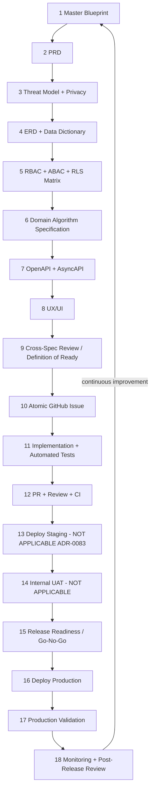

🇬🇧 English (source) · 🇮🇩 [Bahasa Indonesia](alur-pengembangan.id.md)

# AWCMS development flow

> **Canonical process document.** It answers one question: _from intent to
> production, what must exist, in what order, and what enforces it._
>
> It does **not** repeat the content of other documents. Every step points at a
> real artifact in this repo, and when the artifact **does not exist yet**, the
> step says so — a gap that is written down is more useful than a gap that is
> disguised.

- **Replaces** [`alur-pengembangan-mini-first.md`](alur-pengembangan-mini-first.md),
  which was revoked by [ADR-0055](../adr/0055-development-confined-to-awcms-and-awcms-astro.md)
  and is now only a historical record.
- **Complements, does not replace:** [`../../AGENTS.md`](../../AGENTS.md)
  (technical working contract) and [`../../CONTRIBUTING.md`](../../CONTRIBUTING.md)
  (mechanics of steps 10–12).

## The flow

## Two things that must be read before using this diagram

**First: not every change walks all 18 steps.** What decides is not taste, but
the CLASS of the change:

| Class of change                                       | Mandatory steps                                                                                               |
| ----------------------------------------------------- | ------------------------------------------------------------------------------------------------------------- |
| Docs only, chore, dependency bump                     | 10 → 12, then 16–18 at release time                                                                           |
| Bug fix without a contract/schema change              | 10 → 12                                                                                                       |
| Behaviour change in an existing module                | 3, 5 (if it touches access), 7 (if it touches the API), 10 → 12                                               |
| New schema / new column                               | 4, 5, 10 → 12                                                                                                 |
| **New module**                                        | full 1 → 12, plus an admission ADR ([`21_module_admission_governance.md`](21_module_admission_governance.md)) |
| Foundation-layer change (auth, access, sync, tenancy) | full 1 → 12, **ADR mandatory**                                                                                |

**Second: steps 1–9 produce DOCUMENTS, and documents in this repo go stale.**
The rule already in force stays in force: a document that is wrong is more
dangerous than a document that does not exist, because it is trusted. If a step
produces a claim that can go stale (a number, a file list, a status), put that
claim somewhere **generated or gated**, not in prose.

---

## 1. Master Blueprint

**Answers:** what this product is, where its boundary lies, and what is
deliberately NOT part of it.

| Artifact                                                           | Role                                |
| ------------------------------------------------------------------ | ----------------------------------- |
| [`01_canvas_induk.md`](01_canvas_induk.md)                         | product summary & principles        |
| [`11_implementation_blueprint.md`](11_implementation_blueprint.md) | per-sprint implementation blueprint |
| [`../ARCHITECTURE.md`](../ARCHITECTURE.md)                         | current-state architecture (gated)  |
| [`../adr/`](../adr/README.md)                                      | decisions that lock the scope       |

A scope change at this level is **always** an ADR. The blueprint does not change
direction; the ADR changes it, and the blueprint follows.

## 2. PRD

**Answers:** who the users are, what job gets done, and what the acceptance
criteria are.

[`02_prd_detail_per_modul.md`](02_prd_detail_per_modul.md).

## 3. Threat Model + Privacy Analysis

**Answers:** who the attacker is, what they are after, and what personal data is
touched.

| Part                        | Artifact                                                                               | Status             |
| --------------------------- | -------------------------------------------------------------------------------------- | ------------------ |
| Threat model                | [`20_threat_model_security_architecture.md`](20_threat_model_security_architecture.md) | exists             |
| Control map                 | [`standar-performa-dan-keamanan.md`](standar-performa-dan-keamanan.md)                 | exists, **living** |
| Data retention              | [`data-lifecycle.md`](data-lifecycle.md) + the `data-lifecycle:*` gates                | exists, gated      |
| **Privacy analysis / DPIA** | [`privacy-analysis.md`](privacy-analysis.md)                                           | exists             |
| Per feature                 | [`templates/privacy-analysis-template.md`](templates/privacy-analysis-template.md)     | exists             |

Both are mandatory and they answer different things: the threat model answers
"who is the attacker", the privacy analysis answers "whose data is in here".

The privacy analysis deliberately does **not** copy per-table retention numbers —
that copy is stale on the first day someone changes the descriptor, and a stale
number in a privacy document is more dangerous than no number at all. It points
at the gated place instead. It also states what **only the operator can answer**
(legal basis, DPO, cross-jurisdiction transfers) rather than pretending to answer
it.

## 4. ERD + Data Dictionary

**Answers:** which entities, how they relate, and what the columns mean.

[`04_erd_data_dictionary.md`](04_erd_data_dictionary.md), with the real schema in
[`../../sql/`](../../sql/) and its conventions in
[`database-migrations.md`](database-migrations.md).

**What enforces this, rather than merely suggesting it:**

- an applied migration is **immutable** — editing it blocks `db:migrate` on a
  deployment that is already running;
- every `awcms_%` table must `ENABLE` **and** `FORCE ROW LEVEL SECURITY` unless
  it is registered as global with a reason (`security:readiness`);
- every foreign key column must be reachable by an index (`db:fk-index:check`);
- every table must answer the retention question
  (`data-lifecycle:table-coverage:check`).

## 5. RBAC + ABAC + RLS Matrix

**Answers:** who may do what, against which object.

| Artifact                                                       | Role                            |
| -------------------------------------------------------------- | ------------------------------- |
| [`17_default_seed_rbac_abac.md`](17_default_seed_rbac_abac.md) | default role & policy seed      |
| The `permissions` descriptor in `src/modules/*/module.ts`      | the actual permission catalogue |
| RLS policies in `sql/`                                         | the actual tenant boundary      |

**What enforces this:** `access:chokepoint:check` (every handler goes through the
gate), `access:permissions:enforcement:check`, `access:decision-log:coverage:check`,
`access:grant-readers:check`, `identity-access:sod-registry:check`, and
`security:readiness` for RLS against the real database.

The non-negotiable rules: **default-deny**, the structural gate ABOVE permission
retrieval, and every new gate is **deny-only** — not one of them may produce
`allowed: true`.

## 6. Domain Algorithm / Verification Specification

**Answers:** what the business rule is exactly, including its edge cases.

[`03_srs_detail_per_modul.md`](03_srs_detail_per_modul.md).

A rule that has applied since this repo began: **pure logic is separated from
I/O**. Whatever can be written as a pure function is written that way, because
that is what makes edge cases testable without a database — and because that is
what lets a mutation prove a gate actually guards something.

## 7. OpenAPI + AsyncAPI

**Answers:** the contract promised to callers.

Per-module fragments in [`../../openapi/modules/`](../../openapi/modules/), the
patterns and their rationale in [`05_openapi_asyncapi_detail.md`](05_openapi_asyncapi_detail.md)
and [`api-contribution-guide.md`](api-contribution-guide.md).

**What enforces this:** `api:spec:check`, `api:docs:check`,
`api:consumer-contract:check`, and the bundle-freshness gate — a spec that does
not match its route reddens CI rather than waiting to be discovered by a
consumer.

## 8. UX/UI

**Answers:** its shape on screen, and how it fails in front of the user.

[`14_ui_ux_design_system.md`](14_ui_ux_design_system.md) and
[`15_frontend_architecture_integration.md`](15_frontend_architecture_integration.md).

Two constraints that are often only discovered late: **CSP single-owner** (a
script must be imported and then bundled, not inlined) and every admin screen
must go through `loadAdminScreen` (`access:chokepoint:check` counts it).

## 9. Cross-Spec Review / Definition of Ready

**Answers:** whether steps 1–8 agree with each other, before anyone writes code.

| Artifact                                                                                               | Role                               |
| ------------------------------------------------------------------------------------------------------ | ---------------------------------- |
| [`templates/definition-of-ready.md`](templates/definition-of-ready.md)                                 | **general Definition of Ready**    |
| [`13_final_master_index_traceability.md`](13_final_master_index_traceability.md)                       | cross-document traceability matrix |
| [`templates/module-admission-decision-checklist.md`](templates/module-admission-decision-checklist.md) | checklist — new module             |

The Definition of **Done** in `CONTRIBUTING.md` is checked at the end; the list
above is checked at the start, and that is the whole difference.

This repo's experience shows the cost, and the FIRST question in the Definition
of Ready exists because of it: **two consecutive waves** (ADR-0087 and ADR-0088)
wrote plans that assumed cross-tenant reads that FORCE RLS forbids, and both were
only caught during implementation.

## 10. Atomic GitHub Issue

**Answers:** the smallest unit of work that can be reviewed on its own.

The pattern is in [`06_github_issues_detail.md`](06_github_issues_detail.md),
naming/roadmap conventions in [`09_roadmap_repository_commit.md`](09_roadmap_repository_commit.md).

One issue = one branch = one PR. If an issue cannot land without leaving the tree
in a weaker state, it is split until it can.

## 11. Implementation + Automated Tests

**Answers:** the code, and the proof that the code is correct.

Standards in [`10_template_kode_coding_standard.md`](10_template_kode_coding_standard.md)
and [`../../AGENTS.md`](../../AGENTS.md).

Three rules that are peculiar to this repo and appear in no general guide:

1. **Run it, do not read it.** A migration is verified by applying it from
   scratch against a real Postgres, and a constraint is proven to **REJECT** —
   not merely to exist.
2. **A gate must be proven to FAIL.** A check that is green proves nothing until
   a mutation reddens it. Put the original defect back, watch the correct test
   go red, then restore.
3. **Claims of the form "X runs before Y" are tested at SOURCE level**, because a
   behavioural test can be satisfied by the correct arrangement _and_ by the
   mutated one — and a source assertion must be rename-proof, or it passes
   vacuously.

## 12. PR + Review + CI

**Answers:** whether this may enter `main`.

The mechanics are in [`../../CONTRIBUTING.md`](../../CONTRIBUTING.md), the
template in
[`../../.github/PULL_REQUEST_TEMPLATE.md`](../../.github/PULL_REQUEST_TEMPLATE.md),
branch protection in [`branch-protection.md`](branch-protection.md).

The gates: the full `bun run check` chain, the DB-gated suite, Playwright E2E,
CodeQL, GitGuardian, and a mandatory changeset for behaviour changes.

**A trap that has already bitten:** a stacked PR (base is not `main`) runs **ZERO**
gates, while `gh pr checks` still looks green because GitGuardian passes on its
own.

## 13. Deploy Staging — **NOT APPLICABLE to this repo**

> **A decision, not a gap** (13 August 2026).
> [ADR-0083](../adr/0083-this-template-deploys-to-one-environment.md) remains in
> force: this template deploys to **ONE** environment, production.

This step exists in the generic flow and is **deliberately skipped here**. The
repo owner was asked to choose between turning staging on (superseding ADR-0083)
and keeping a single environment, and chose the latter.

**What replaces it, stated so it does not have to be guessed:**

| Staging's role                       | What fills it here                                                             |
| ------------------------------------ | ------------------------------------------------------------------------------ |
| schema applied from scratch          | the ephemeral CI database (step 12)                                            |
| the request path tested end to end   | Playwright E2E + the DB-gated suite (step 12)                                  |
| verification against a real database | `bun run security:readiness` (step 15)                                         |
| readiness before release             | [`production-preflight-runbook.md`](production-preflight-runbook.md) (step 15) |

**And what it does NOT replace, recorded plainly:** human testing against
production-like data, and verification of third-party behaviour (Cloudflare,
Varnish, Traefik) outside the production path. Both are the price of this
decision, not something lost without anyone noticing — and both are legitimate
reasons to revisit ADR-0083 later.

Turning it back on remains an ADR-level decision, not something a process
document can reverse.

## 14. Internal UAT / Human Testing — **NOT APPLICABLE to this repo**

**Answers:** whether what was built actually gets the user's job done.

It depends on step 13, and step 13 is a decision that it does not exist. So this
is not a gap waiting to be filled; it is a consequence that has already been
decided.

The closest thing to its role is production validation (step 17), with a
difference that must be read honestly: **it runs AFTER release, not before.** For
a change that affects a customer-facing path, that means the cost of a mistake is
paid in production — and if that cost feels too expensive for a particular
change, the answer is to revisit ADR-0083 for that change, not to skip step 17.

## 15. Release Readiness / Go–No-Go

**Answers:** whether this is safe to release, and who says yes.

| Artifact                                                             | Role                                   |
| -------------------------------------------------------------------- | -------------------------------------- |
| [`production-readiness.md`](production-readiness.md)                 | production readiness gate              |
| [`production-preflight-runbook.md`](production-preflight-runbook.md) | preflight checklist                    |
| `bun run security:readiness`                                         | verification against the REAL database |
| [`resilience-dr-verification.md`](resilience-dr-verification.md)     | disaster recovery verification         |

`security:readiness` is the only check on this list that runs queries against a
real database — and it is the one that catches the class of failure invisible to
pure gates, e.g. **a Postgres role that turns out to be a superuser, making FORCE
RLS inert**.

## 16. Deploy Production

**Answers:** how the bits reach the server.

[`release-process.md`](release-process.md) (SemVer + Changesets),
[`deploy-coolify.md`](deploy-coolify.md), and `.github/workflows/release.yml`.

## 17. Production Validation

**Answers:** whether what is running there really is the intended version, and
really is healthy.

[`production-preflight-runbook.md`](production-preflight-runbook.md) holds the
post-deploy steps.

**A rule born of experience:** _a 200 on the domain ≠ production is alive._
Verify the version, the applied migrations, and the data path — not just the
status code of the front page.

## 18. Monitoring + Post-Release Review

**Answers:** what happened afterwards, and what was learned.

| Part                      | Artifact                                                            | Status |
| ------------------------- | ------------------------------------------------------------------- | ------ |
| Observability conventions | [`observability-metrics.md`](observability-metrics.md)              | exists |
| Database capacity         | [`database-capacity-runbook.md`](database-capacity-runbook.md)      | exists |
| **Post-release review**   | [`post-release-reviews.md`](post-release-reviews.md) + its template | exists |
| Recommendation rounds     | [`../PROJECT_STATE.md`](../PROJECT_STATE.md) §4                     | exists |

Two registers, and the distinction is deliberate: §4 is tied to **work rounds**
and records decisions; the release register is tied to **releases** and records
what happened when that release met production. Before the second one existed, it
was silently written as the first or not written at all.

**A smooth release still gets an entry** — a register that only holds incidents
erases the baseline that makes a bad release look bad. And one line in its
template carries a special load in this repo: _"what was first seen in production
and was not seen in CI"_ is where the price of the ADR-0083 decision (step 13) is
paid, and collecting it release after release is the only way to know whether the
price is still worth it.

**A rule already in force:** recommendations must be written into §4, including
the ones that were REJECTED along with the reason. Re-deriving a recommendation
list costs a full audit; writing it down costs one paragraph.

---

## Status of each step that was once empty

This list is here so it does not have to be re-derived. Note the last column:
**a gap and a decision are not the same thing**, and mixing them is how work that
has not been done acquires the appearance of a judgement.

| Step | Item                            | Nature                                   |
| ---- | ------------------------------- | ---------------------------------------- |
| 3    | Privacy analysis / DPIA         | **closed** 13 Aug 2026                   |
| 9    | General Definition of Ready     | **closed** 13 Aug 2026                   |
| 13   | Deploy staging                  | **decision** — ADR-0083, one environment |
| 14   | Internal UAT                    | **decision** — a consequence of step 13  |
| 18   | Per-release post-release review | **closed** 13 Aug 2026                   |

The gaps that remain after that are **inside** the documents that closed them,
not in this table — above all the absence of a per-data-subject export/erasure
flow ([`privacy-analysis.md`](privacy-analysis.md) §4). It is recorded there
because that is where the person who needs it will look.
