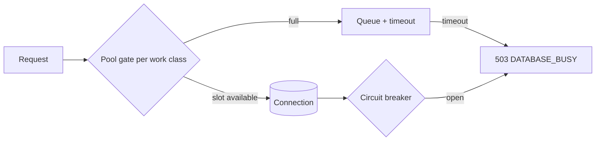

🇬🇧 English (source) · 🇮🇩 [Bahasa Indonesia](database-pooling.id.md)

# Database Connection Pooling and Backpressure

> **Document status (AWCMS).** The three pooling/backpressure layers below
> (`Bun.SQL` pool, work-class concurrency gate, circuit breaker) are inherited
> from the `awcms-mini` technical base (Issue 10.2 in the origin repo) as
> generic mechanisms already verified there. In AWCMS the mechanisms apply
> from the foundation onwards, but the **ERP endpoint/work-class
> classification examples below (journal posting, payroll run, etc.) are
> planned targets** — no ERP domain endpoint actually calls `withTenant` with
> those classifications yet, because the modules are not implemented.

This document records the pooling/backpressure implementation standard for
AWCMS (inherited from the `awcms-mini` base, with the related governance/ADR
docs for RLS/RBAC-ABAC and the threat model).

## Summary



Three independent layers work together:

1. **`Bun.SQL` pool config** (`src/lib/database/client.ts`) — the physical
   connection pool to PostgreSQL.
2. **Work-class concurrency gate** (`src/lib/database/work-class.ts`) — a
   pure application semaphore in front of the pool, limiting concurrency per
   kind of load.
3. **Circuit breaker** (`src/lib/database/circuit-breaker.ts`) — fail-fast
   when database transactions fail consecutively.

Both of them (gate + breaker) are integrated through a single point:
`withTenant` (`src/lib/database/tenant-context.ts`) — every existing endpoint
calls `withTenant`, so this protection applies automatically without changing
every route.

## 1. Bun.SQL pool config

`getDatabaseClient()` configures `Bun.SQL` with:

| Option                         | Source                          | Default |
| ------------------------------ | ------------------------------- | ------- |
| `max`                          | `DATABASE_POOL_MAX`             | `20`    |
| `prepare`                      | `DATABASE_PGBOUNCER !== "true"` | `true`  |
| `connection.statement_timeout` | `DATABASE_STATEMENT_TIMEOUT_MS` | `15000` |

Implementation note: `onconnect` on `Bun.SQL.Options` (see
`node_modules/bun-types/sql.d.ts`) is typed `(err: Error | null) => void` — it
only reports whether a connection attempt succeeded or failed, it does **not**
give access to a client for running SQL (the JSDoc example
`onconnect: (client) => ...` in that same type file is inconsistent with its
actual signature). The type-correct and documented way to apply session GUCs
such as `statement_timeout` on every pooled connection is the `connection`
option ("Postgres client runtime configuration options", see
postgresql.org/docs/current/runtime-config-client.html). `onconnect` is still
used, only to record connection failures to the structured logger.

## 2. Work-class concurrency gate

`src/lib/database/work-class.ts` is an in-memory per-process semaphore (not
cross-instance). Five work classes and their concurrency limits:

| Work class             | Example (ERP target)                                | Priority  | Max |
| ---------------------- | --------------------------------------------------- | --------- | --: |
| `critical_transaction` | Journal/ledger posting, payroll run, stock movement | Highest   |  10 |
| `interactive`          | Admin CRUD, master data search                      | High      |   8 |
| `reporting`            | Financial/inventory reports, dashboard              | Medium    |   4 |
| `background_sync`      | Sync push/pull, outbox, external integration        | Low       |   4 |
| `maintenance`          | Migration, backup                                   | Scheduled |   1 |

These numbers are small and fixed (not env-tunable) on purpose — they are far
below `DATABASE_POOL_MAX` (default 20) so there is still headroom in the
`Bun.SQL` pool itself, and their ordering follows priority:
`critical_transaction` gets the largest allocation because it has the highest
priority; `maintenance` is serialised (`max: 1`) because it is not an
interactive HTTP concern.

When a class is full, the next caller enters a FIFO queue until a slot frees
up or `timeoutMs` runs out. The timeout rejects with `WorkClassTimeoutError`
(not string-matching an error message), so callers can map it to
`503 DATABASE_BUSY` type-safely.

**The queue is bounded** (inherited from the base, `awcms-mini` Issue #743):
the per-work-class queue is NOT unbounded — as soon as the queue reaches
`max concurrency x DATABASE_WORK_CLASS_QUEUE_MULTIPLIER` (default `4`, clamped
to `[1, 20]`), the next caller is rejected IMMEDIATELY with
`WorkClassQueueFullError` (different from `WorkClassTimeoutError` — it never
waits at all), mapped to `503 DATABASE_BUSY` + a `Retry-After` header. This
closes the "cascading timeout chain" risk (the queue grows without bound and
every caller waits the full `timeoutMs` before finally failing) — see
[`database-capacity-runbook.md`](database-capacity-runbook.md) §Graceful
saturation behavior.

`critical_transaction` and `maintenance` already exist in the
types/configuration for the needs of ERP modules (e.g. journal/payroll posting
endpoints) but are **not used by any endpoint yet** because no ERP module is
implemented — once the first finance/HR-payroll module exists, its posting
endpoint is expected to classify itself as `critical_transaction`.

## 3. Circuit breaker

`src/lib/database/circuit-breaker.ts` is a standard 3-state breaker
(`closed → open → half_open → closed`), a pure function of the `now: Date`
injected by the caller (there is no hidden `Date.now()`), so it is fully
unit-testable without waiting on real time.

- **Closed → Open**: after `failureThreshold` (5) consecutive failures.
- **Open → Half-open**: after `openDurationMs` (30 seconds) has elapsed since
  the breaker opened, exactly one attempt is allowed through.
- **Half-open → Closed**: the attempt succeeds.
- **Half-open → Open**: the attempt fails; the `openDurationMs` window
  restarts from the time of that failure.

One breaker instance is shared across the whole application (module-level
singleton `getDatabaseCircuitBreaker()`), not per-request — so failures
accumulated across requests/tenants trigger a single fail-fast decision for
all traffic.

## 4. Integration into `withTenant`

```ts
withTenant(sql, tenantId, fn, {
  workClass: "background_sync", // default: "interactive"
  queueTimeoutMs: 2000 // default: 2000
});
```

The flow:

1. Check `circuitBreaker.canAttempt(now)` — if `false`, go straight to
   `503 DATABASE_BUSY` + `Retry-After: 30` (skipping the queue entirely,
   fail-fast).
2. `acquireWorkClassSlot(workClass, queueTimeoutMs)`:
   - The queue is already full (see §2 above) → reject immediately
     with `WorkClassQueueFullError`; record `database.pool.rejected`
     through the structured logger (`src/lib/logging/logger.ts`),
     then `503 DATABASE_BUSY` + `Retry-After: 2`.
   - Waited and then timed out → `WorkClassTimeoutError`; record
     `database.pool.saturated`, then `503 DATABASE_BUSY` +
     `Retry-After: 2`.
3. Run the transaction as usual (`SET LOCAL app.current_tenant_id`, then
   `fn(tx)`).
4. `finally`: release the work-class slot.
5. Success → `circuitBreaker.recordSuccess()`; the transaction/`fn` throwing
   an exception → `circuitBreaker.recordFailure()` and then the exception is
   rethrown (not `fail()` which returns a Response — an ABAC/validation error
   response from an `fn` that does not throw still counts as a "success" at
   the breaker level, because the breaker measures database
   transaction/connection failures, not business logic).

   Two exceptions in the catch block that do **not** call
   `recordFailure()` even though they throw an exception, because both are
   reasonable business-logic/concurrency outcomes, not database infra
   failures (inherited from the base):
   - `IdempotencyRaceLostError` — a benign race in
     `saveIdempotencyRecord`.
   - `Bun.SQL.PostgresError` with a SQLSTATE of class `23` (integrity
     constraint violation — `23503` foreign_key_violation, `23505`
     unique_violation, `23514` check_violation, etc.). An
     `INSERT`/`UPDATE` that fails because of an FK/unique constraint (e.g.
     the caller sent a `tenantId` that does not exist) does not count as an
     infra failure — preventing a handful of requests with invalid input
     from opening an application-wide breaker.
   - `Bun.SQL.PostgresError` with a SQLSTATE of class `22` (data exception —
     `22P02` invalid_text_representation, `22003` numeric_value_out_of_range,
     etc.) — a generalisation of class `23` above, equally "caller input of
     the wrong shape", not an infra failure (e.g. a non-UUID string compared
     against a `uuid` column). Every caller-supplied identifier must be
     validated with `assertUuid()` before touching SQL; this exception closes
     the structural hole rather than waiting for a particular endpoint to
     reproduce it.

     Other error classes (dropped connection, timeout, syntax error,
     permission denied, etc.) still count as failures as usual.

Endpoints reclassified away from the default `"interactive"` (a planned
target, not implemented in AWCMS yet):

- `background_sync`: sync push/pull/status endpoints, object dispatch,
  conflict resolution (the same pattern as the `awcms-mini` base).
- `reporting`: financial/inventory report and audit log endpoints.

All other endpoints are expected to stay on the default `"interactive"`.

Type note: the `withTenant<T>` signature is generic, but in practice every
real call site uses `T = Response` (every existing endpoint returns the
`withTenant` result straight from its handler). That is why `fail(...)` inside
`withTenant` is cast to `T` — safe in practice even though the generic
signature does not enforce it statically.

## 5. Health endpoint

`GET /api/v1/database/pool/health` (no auth, following the precedent of
`/api/v1/health` which is also public) reports:

```json
{
  "success": true,
  "data": {
    "status": "healthy",
    "databaseReachable": true,
    "circuitBreakerState": "closed",
    "workClasses": [
      {
        "workClass": "critical_transaction",
        "active": 0,
        "max": 10,
        "queued": 0,
        "maxQueueDepth": 40
      },
      {
        "workClass": "interactive",
        "active": 0,
        "max": 8,
        "queued": 0,
        "maxQueueDepth": 32
      },
      {
        "workClass": "reporting",
        "active": 0,
        "max": 4,
        "queued": 0,
        "maxQueueDepth": 16
      },
      {
        "workClass": "background_sync",
        "active": 0,
        "max": 4,
        "queued": 0,
        "maxQueueDepth": 16
      },
      {
        "workClass": "maintenance",
        "active": 0,
        "max": 1,
        "queued": 0,
        "maxQueueDepth": 4
      }
    ],
    "capacity": {
      "processClass": "app",
      "poolMax": 20,
      "approvedConnections": 100,
      "reservedAdminHeadroom": 5
    },
    "generatedAt": "2026-07-14T00:00:00.000Z"
  },
  "meta": {}
}
```

`status` is computed: `unhealthy` if the DB is unreachable or the breaker is
`open`; `degraded` if the breaker is `half_open` or some work class is full
(`active >= max`) with a non-empty queue; otherwise `healthy`. This endpoint
only reports aggregates (counts/booleans), **never** tenant data or query
contents — the DB check is done with a single `SELECT 1` directly using
`getDatabaseClient()` (not `withTenant`, because this endpoint is not
tenant-scoped), wrapped in try/catch so that a DB outage does not make the
health check itself crash.

`maxQueueDepth` and the `capacity` block only report the CONFIGURATION numbers
of this process itself (not a cross-instance aggregate — one process does not
know about other instances) — for cross-instance validation before scale-out,
see
[`database-capacity-runbook.md`](database-capacity-runbook.md) (the
`capacity-config.ts` library is real; the CLI `bun run database:capacity:check`
is still a target — see that runbook's document status).

## 6. Domain event `database.pool.saturated`

Documented in the AsyncAPI file under the "DB Connectivity" category. **There
is no real pub/sub dispatcher yet** for any domain event in this repo — the
concrete producer of this event is the structured log line
`database.pool.saturated` written by `withTenant` through
`src/lib/logging/logger.ts`, the same as every other AsyncAPI event, which at
this foundation stage is only a documented contract.

## 7. PgBouncer (transaction mode) — example configuration

The example PgBouncer configuration lives in one canonical place,
[`../../deploy/pgbouncer/pgbouncer.ini.example`](../../deploy/pgbouncer/pgbouncer.ini.example)
— this section is only a short excerpt; do not duplicate its full contents
here so that there are not two copies that can drift apart over time:

```ini
; pgbouncer.ini.example (excerpt — see the full file at the link above)
[databases]
awcms = host=127.0.0.1 port=5432 dbname=awcms

[pgbouncer]
pool_mode = transaction
default_pool_size = 20 ; aligned with this application's DATABASE_POOL_MAX
```

PgBouncer is **optional** — the default LAN-first topology (one app server +
PostgreSQL, see the root `docker-compose.yml` and
[`deployment-profiles.md`](deployment-profiles.md)) does not need it; the
`pgbouncer` service in compose is gated behind Docker Compose `profiles` so it
is only active when explicitly requested.

Implications when `DATABASE_PGBOUNCER=true`:

- `prepare: false` is set automatically on `Bun.SQL` (see §1) — prepared
  statements are inherently problematic in PgBouncer transaction mode because
  each statement can be executed on a different backend connection between
  transactions.
- The application code is already safe: `withTenant` always uses
  `SET LOCAL app.current_tenant_id` (not a plain session `SET`), whose scope
  is automatically limited to one transaction — compatible with PgBouncer
  transaction mode.

## 8. Deployment-aware capacity

Sections 1-7 above protect ONE process. The approved PostgreSQL/PgBouncer
capacity applies to the ENTIRE fleet of instances — `src/lib/database/
capacity-config.ts` **already exists and is active at runtime** (instance
count per process class, pool budget, PgBouncer capacity, approved connection
budget, admin headroom used by `GET /api/v1/database/pool/health`'s `capacity`
field, and `recordGauge` recording `db_pool_capacity_*` through
`src/lib/observability/metrics-port.ts`). What does **not** exist yet is the
CLI wrapper: `bun run database:capacity:check` and `production:preflight`'s
`database:capacity` stage are not real scripts — those keys are not in
`package.json` (see `scripts/README.md` §Deferred). Capacity validation today
can only be done by calling the `capacity-config.ts` functions directly (e.g.
from a test or a REPL), not through a standalone `bun run` command. Full
detail:
[`database-capacity-runbook.md`](database-capacity-runbook.md) (formulas,
worked examples, the saturation/connection-storm incident SOP, and a more
detailed CLI implementation status).

## Gaps not yet closed

- The circuit breaker is hard to trigger live without a representative way to
  force database connection failures; its primary verification is the unit
  test (`tests/database-pooling.test.ts`), not a live scenario.
- Work-class saturation at the HTTP level is hard to observe deterministically
  because requests tend to finish faster than manual observation.
- Job workers used to be listed here as "not yet runtime-gated through
  `work-class.ts`'s concurrency gate". That is **wrong and was wrong for some
  time**: they open their transactions through `withTenantOrThrow`, which
  acquires a work-class slot exactly as a request does. What was genuinely
  missing — seven scripts passing no class, so their transactions queued as
  `interactive` — is finding D11, now closed and gated. See
  `database-capacity-runbook.md` §Jobs and the concurrency gate.
- There is no real ERP domain endpoint exploiting the work-class
  classification above yet — revalidate the classification once the first
  finance/inventory/payroll module is implemented.
