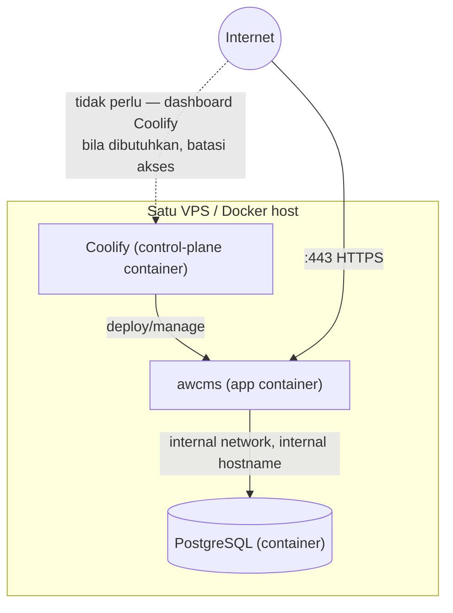
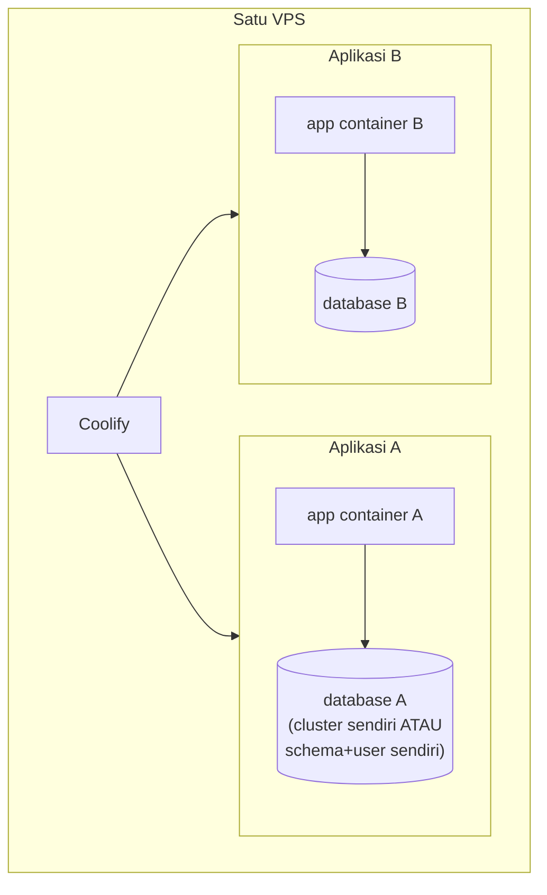

🇮🇩 Bahasa Indonesia · 🇬🇧 [English (source)](deploy-coolify.md)

<!-- i18n-source-hash: sha256:0bfdfcc4d98b7c33658a97b718d005eabfab94aa4248156ce556b26e9a8bff6c -->

# Deploy Coolify

> **Deployment repo ini: SATU environment.** `awcms.ahlikoding.com`,
> `APP_ENV=production`. Tidak ada environment ter-deploy kedua —
> [ADR-0083](../adr/0083-this-template-deploys-to-one-environment.md). Alasannya
> bukan penghematan: repo ini **template**, dan deployment hidupnya ada untuk
> menunjukkan serta memvalidasi template, bukan melayani bisnis. Yang akan
> "di-stage" adalah templatenya sendiri, dan itu divalidasi rantai gerbang CI
> plus suite integrasi ber-Postgres — bukan salinan kedua yang harus dirawat
> (satu set secret lagi, satu database lagi yang butuh backup, satu antrean
> migrasi lagi).
>
> **`staging` bukan lagi profil deployment.** Ia dihapus dari kosakatanya —
> `ModuleDeploymentProfile` di `src/modules/_shared/module-contract.ts` kini
> `development`, `production`, `offline-lan` (tiga, bukan empat; lihat
> [`deployment-profiles.md`](deployment-profiles.md)). Yang **tidak** hilang
> adalah kontrak isolasinya: ia berpindah rumah ke
> [`environments.md`](environments.md) §Kontrak isolasi environment kedua
> (database sendiri, secret sendiri, integrasi keluar mati) dan kini berlaku
> bagi **environment kedua apa pun** yang seseorang dirikan di samping
> produksinya, apa pun namanya. Untuk siapa pun yang menjalankan lebih dari satu
> environment, satu aturan tidak boleh dilanggar: **satu app Coolify per
> environment**, bukan satu app dengan dua domain. Environment yang berbagi app
> berbagi env var, dan itulah cara environment kedua tanpa sengaja menulis ke
> data produksi. Seluruh panduan di dokumen ini (dua pola deploy, topologi, opsi
> PostgreSQL, checklist keamanan) berlaku per environment, berapa pun jumlah
> yang Anda jalankan.
>
> **Verifikasi ke control-plane, bukan ke `curl`.** Per 11 Agustus 2026
> `https://awcms.ahlikoding.com` menjawab 200 sepanjang waktu — sementara baris
> aplikasi produksinya (`got4etcblum9kowdv4mrixqo`) **tidak ada** di tabel
> `applications` Coolify (bukan soft-delete) dan tidak ada database produksi di
> `standalone_postgresqls`. Container `awcms-staging-varnish` memasang rule
> Traefik yang mencocokkan `awcms-staging.ahlikoding.com` **dan**
> `awcms.ahlikoding.com`, jadi domain produksi sedang dilayani deployment lain
> di atas database `awcms_staging`. **200 di domain produksi bukan bukti
> produksi hidup**; yang membuktikan adalah `applications` dan
> `standalone_postgresqls`. Sumber daya bernama `awcms-staging-*` itu sedang
> dibongkar sebagai pekerjaan infrastruktur terpisah — namanya di sini adalah
> nama sumber daya pada 11 Agustus 2026, bukan nama sebuah profil.

> **Status dokumen:** panduan target sebagian. Repo `awcms` belum punya `docker-compose.yml` yang nyata, tapi `Dockerfile.production` SUDAH ada — nyata di root repo (multi-stage, non-root user `bun`, healthcheck) dan sudah dipakai aktif oleh `build` job `.github/workflows/release.yml` untuk build+push image ke `ghcr.io/ahliweb/awcms` setiap rilis (lihat [`release-process.md`](release-process.md) untuk deskripsi status yang akurat). Karena itu, **Pola 1 dan Pola 2 di bawah (build dari `Dockerfile.production`) sudah bisa dipakai hari ini** — dokumen ini mengadaptasi panduan operasional Coolify yang sudah terbukti di basis `awcms-mini` untuk detail khusus Coolify (topologi VPS, opsi PostgreSQL, checklist keamanan) yang masih standar target sampai dipraktikkan sungguhan terhadap deployment nyata.

Panduan operasional untuk deploy AWCMS ke [Coolify](https://coolify.io) memakai `Dockerfile.production` sebagai jalur registry/CI-push, berdampingan dengan `docker-compose.yml` yang tetap menjadi jalur LAN-first/offline yang direkomendasikan (lihat [`deployment-profiles.md`](deployment-profiles.md) §production (online) — image registry). Dokumen ini **tidak menggantikan** dokumen itu — dokumen ini menambahkan detail khusus Coolify: topologi satu VPS, topologi multi aplikasi dalam satu VPS, opsi PostgreSQL, kapasitas praktis, dan checklist keamanan.

## Dua pola deploy di Coolify

### Pola 1 — Build dari repo GitHub

Coolify meng-clone repo dan menjalankan `docker build -f Dockerfile.production` sendiri pada setiap deploy (build di server Coolify atau build server terpisah bila dikonfigurasi).

1. Coolify → **New Resource** → **Application** → **Public/Private Repository** (GitHub) → pilih repo `ahliweb/awcms` (atau fork/repo turunan).
2. **Build Pack**: pilih **Dockerfile**, arahkan ke `Dockerfile.production` (bukan `Dockerfile` default — repo ini tidak punya `Dockerfile` di root, hanya `Dockerfile.production`).
3. **Port**: `4321` (image `EXPOSE 4321`, `ENV PORT=4321`).
4. **Health Check Path**: `/api/v1/health` (lihat §Health check di bawah).
5. Set environment variable (§Environment variable minimal di bawah) sebelum deploy pertama.
6. Jalankan migration one-shot (§Migration one-shot di bawah) **sebelum** deploy pertama container app terhadap database baru.
7. Deploy. Coolify build image, jalankan container, cek health check path.

Cocok untuk: iterasi cepat, tidak perlu registry terpisah, Coolify mengelola build pipeline sepenuhnya.

### Pola 2 — Pull image dari registry

CI (GitHub Actions atau lainnya) yang men-build `docker build -f Dockerfile.production` dan push ke registry (GHCR, Docker Hub, dsb.); Coolify hanya pull + run image jadi.

1. CI: `docker build -f Dockerfile.production -t ghcr.io/<org>/awcms:<tag> . && docker push ghcr.io/<org>/awcms:<tag>`.
2. Coolify → **New Resource** → **Application** → **Docker Image** → isi nama image + tag, kredensial registry bila privat.
3. Langkah **Port**/**Health Check Path**/environment variable/migration sama seperti Pola 1.

Cocok untuk: image immutable per rilis, build sekali dipakai di banyak environment, atau saat build server Coolify ingin dijaga ringan.

Repo ini SUDAH punya workflow CI/CD registry otomatis untuk ini: `.github/workflows/release.yml`'s `build` job men-build `Dockerfile.production` dan push ke `ghcr.io/ahliweb/awcms` pada setiap tag rilis (lihat [`release-process.md`](release-process.md)) — operator memakai image itu langsung di Coolify tanpa perlu menyiapkan pipeline build-push sendiri, kecuali ingin registry/tagging berbeda.

**Tag image tidak berawalan `v`.** Workflow membuang prefiksnya (`VERSION="${GITHUB_REF_NAME#v}"`), jadi tag Git `v7.0.1` menghasilkan `ghcr.io/ahliweb/awcms:7.0.1` — bukan `:v7.0.1`, yang tidak ada dan akan gagal pull. Tersedia juga `:sha-<12 karakter pertama commit>` dan `:latest`; untuk deployment yang bisa dilacak, isi Coolify dengan versi eksplisit, bukan `latest`.

## Topologi single VPS / same Docker host

Pola default yang direkomendasikan untuk satu VPS kecil-menengah: Coolify, aplikasi, dan PostgreSQL berjalan sebagai container Docker pada host yang sama, dalam network internal Docker/Coolify yang sama.



Poin kunci:

- **Database tidak perlu public port** bila hanya diakses oleh app pada host/network Docker yang sama — gunakan hostname internal Coolify, bukan IP publik VPS, di `DATABASE_URL`.
- Public port database (`5432`) hanya dibuka bila benar-benar dibutuhkan (mis. akses admin dari luar untuk keperluan operasional) — dibatasi firewall/IP allowlist/VPN, dan memakai SSL bila koneksinya melewati jaringan publik.
- Dashboard Coolify sendiri sebaiknya dibatasi (firewall/VPN/IP allowlist) jika VPS menghadap internet langsung.
- Single VPS berarti single point of failure — bila host mati, Coolify, semua app, dan database di dalamnya ikut mati. Ini adalah trade-off yang disengaja untuk MVP/demo/production kecil-menengah/klien single-server, bukan rekomendasi untuk beban tinggi atau kebutuhan HA (lihat §Kapan perlu memisahkan ke VPS/managed database lain). Untuk platform ERP produksi (transaksi finansial, payroll), pertimbangkan HA/managed database lebih awal dari klien CMS setara — dampak downtime pada proses bisnis kritikal (posting transaksi, payroll run) umumnya lebih tinggi.

## Topologi multi aplikasi dalam satu VPS

Satu instance Coolify bisa mengelola beberapa aplikasi/proyek pada VPS yang sama — umum untuk operator yang menghosting beberapa klien atau beberapa instance AWCMS (mis. per-klien deployment terisolasi) pada satu server.



Aturan wajib per aplikasi:

- **Domain/subdomain sendiri**, env var/secret sendiri, deployment config sendiri di Coolify (project/app terpisah, bukan satu app dengan banyak domain).
- **Database terpisah per aplikasi**, atau minimal schema + role terpisah dengan privilege terbatas bila berbagi satu cluster PostgreSQL (lihat §Opsi PostgreSQL di bawah). Jangan pernah berbagi satu database/schema antar aplikasi yang berbeda — untuk ERP multi-klien, ini juga berarti data finansial/HR satu klien tidak pernah berbagi database fisik dengan klien lain kecuali kebijakan isolasi eksplisit mengizinkan.
- **Jangan reuse secret** antar aplikasi: `AUTH_IP_HASH_SECRET`, `AWCMS_SYNC_HMAC_SECRET`, `AUTH_MFA_SECRET_ENCRYPTION_KEY`, kredensial integrasi eksternal (payment gateway/marketplace/Coretax/logistik), dan password role database harus unik per aplikasi.
- **Jangan berbagi role superuser/`postgres` default** untuk runtime app manapun — setiap aplikasi tetap memakai model dua-peran (§Model dua-peran di `deployment-profiles.md`): role migrasi privileged terpisah dari role app least-privilege (`awcms_app` atau role app-specific lain per aplikasi).
- **App-to-DB memakai internal network/internal hostname**, bukan URL publik, sama seperti topologi single-app di atas.
- **Backup dan restore per aplikasi/database** — retensi dan jadwal boleh berbeda per aplikasi, tapi setiap aplikasi harus bisa di-restore secara selektif tanpa menyentuh data aplikasi lain (lihat §Backup di bawah).

## Opsi PostgreSQL untuk multi aplikasi

| Opsi                                          | Deskripsi                                                                                                     | Cocok untuk                                                                                                                        | Trade-off                                                                                                                                                                               |
| --------------------------------------------- | ------------------------------------------------------------------------------------------------------------- | ---------------------------------------------------------------------------------------------------------------------------------- | --------------------------------------------------------------------------------------------------------------------------------------------------------------------------------------- |
| **1. Satu cluster, banyak database**          | Satu container/instance PostgreSQL, tiap aplikasi punya `CREATE DATABASE` + role sendiri di cluster yang sama | Beberapa aplikasi kecil-menengah pada VPS dengan resource terbatas                                                                 | Hemat resource (satu proses Postgres); blast radius lebih besar — cluster down/corrupt berdampak ke semua aplikasi; perlu disiplin role/permission per database agar tidak lintas akses |
| **2. Satu container PostgreSQL per aplikasi** | Setiap aplikasi punya container Postgres sendiri, sepenuhnya terisolasi                                       | Klien/data yang perlu dipisah lebih tegas (mis. compliance keuangan per klien), aplikasi dengan beban/skema yang sangat berbeda    | Isolasi terbaik; lebih boros resource (RAM/CPU/disk per instance Postgres, bukan satu shared)                                                                                           |
| **3. PostgreSQL eksternal/managed**           | Database di luar VPS Coolify — managed DB provider atau server Postgres terpisah                              | Production lebih besar, kebutuhan HA/replication/compliance tinggi (umum untuk data finansial/payroll ERP), atau beban query berat | Tidak berbagi resource dengan Coolify/app lain; butuh koneksi jaringan aman (TLS, firewall/VPC) ke luar VPS; biaya operasional managed service                                          |

Aturan yang berlaku di ketiga opsi: role runtime aplikasi selalu least-privilege (bukan superuser/owner cluster), `FORCE ROW LEVEL SECURITY` tetap diterapkan sesuai model dua-peran, dan migrasi selalu dijalankan sebagai langkah terpisah dengan role privileged — lihat [`deployment-profiles.md`](deployment-profiles.md) §Model dua-peran basis data untuk detail lengkap yang berlaku sama persis di Coolify.

## Batas kapasitas praktis (rule-of-thumb, bukan SLA)

| Resource VPS      | Perkiraan kapasitas aman                                                                          |
| ----------------- | ------------------------------------------------------------------------------------------------- |
| 2 CPU / 4 GB RAM  | 1-3 aplikasi ringan + 1 PostgreSQL kecil                                                          |
| 4 CPU / 8 GB RAM  | 3-8 aplikasi ringan/sedang + 1-3 PostgreSQL/database aktif                                        |
| 8 CPU / 16 GB RAM | Beberapa aplikasi lebih serius — tetap wajib monitoring resource dan backup terpisah per aplikasi |

Angka di atas adalah **rule-of-thumb**, bukan jaminan (SLA). Kapasitas nyata bergantung pada beban query, ukuran database, frekuensi build, dan retensi backup/log yang aktif secara bersamaan pada host yang sama. Untuk modul ERP dengan beban laporan/reconciliation berat (mis. laporan keuangan bulanan, rekonsiliasi payroll), rencanakan resource lebih konservatif dibanding estimasi CMS-only.

### Menjalankan lebih dari satu replika aplikasi

Tabel di atas soal CPU/RAM per VPS untuk _beberapa aplikasi berbeda_ pada satu host. Menaikkan **replika/instance dari aplikasi YANG SAMA** (mis. Coolify horizontal scaling, atau beberapa container app di belakang satu load balancer) adalah dimensi berbeda — setiap replika membuka pool koneksinya sendiri ke PostgreSQL/PgBouncer yang sama. Sebelum menaikkan jumlah replika, jalankan (begitu tersedia):

```bash
DATABASE_CAPACITY_APP_INSTANCES_MAX=<jumlah replika target> \
bun run database:capacity:check
```

Read-only, murni aritmatika config — tidak menyentuh Coolify/PostgreSQL apa pun. Detail rumus dan contoh perhitungan: `database-capacity-runbook.md` (menyusul).

## Kapan perlu memisahkan database atau aplikasi ke VPS/managed database lain

Pertimbangkan memisahkan (database eksternal/managed, atau VPS terpisah) bila salah satu dari berikut mulai terjadi:

- Traffic tinggi atau query database yang berat/lambat.
- Database bertumbuh cepat mendekati batas disk VPS.
- Butuh high availability/replication yang tidak praktis dijalankan sebagai container tunggal di satu VPS.
- Kebutuhan retensi backup/compliance/audit yang ketat (umum untuk data finansial/payroll/pajak).
- Resource VPS (CPU/RAM/disk/I/O) mulai penuh secara konsisten.
- Proses build/deploy satu aplikasi mulai mengganggu performa aplikasi lain pada VPS yang sama.
- Butuh isolasi blast radius yang lebih tegas antar klien/aplikasi (mis. kontrak SLA klien mensyaratkan infrastruktur terpisah).

## Environment variable minimal

Nilai berikut wajib disuntikkan lewat Coolify environment variable (bukan dibakar ke image) untuk setiap aplikasi/deployment. Lihat `.env.example` (menyusul) untuk daftar lengkap dan komentar tiap variabel:

| Variabel                                               | Wajib       | Catatan                                                                                                                                                                                                                                                                                |
| ------------------------------------------------------ | ----------- | -------------------------------------------------------------------------------------------------------------------------------------------------------------------------------------------------------------------------------------------------------------------------------------- |
| `DATABASE_URL`                                         | Ya          | Role app least-privilege (`awcms_app` atau setara), **bukan** role migrasi. Hostname internal bila app+DB satu network.                                                                                                                                                                |
| `APP_URL`                                              | Ya          | URL publik aplikasi. Wajib menurut `scripts/validate-env.ts` bersama `APP_ENV` dan `DATABASE_URL` — dan hanya ketiganya.                                                                                                                                                               |
| `AUTH_COOKIE_SECURE`                                   | Ya          | `true` untuk deployment Coolify (selalu di belakang HTTPS).                                                                                                                                                                                                                            |
| `APP_ENV`                                              | Ya          | Deployment repo ini: selalu `production`. Sebuah environment kedua yang berdiri di samping produksi juga memakai `production` — yang memisahkannya adalah database/secret/integrasi keluar, bukan label — dan environment yang berbeda **tidak pernah** berbagi app Coolify yang sama. |
| `AWCMS_SYNC_HMAC_SECRET`, `AWCMS_SYNC_ENABLED`, `R2_*` | Kondisional | Wajib diisi bila sync/R2 dipakai — lihat `bun run config:validate` (`deployment-profiles.md` §Validasi konfigurasi) yang menegakkan aturan kondisional ini saat boot.                                                                                                                  |

`bun run config:validate` menolak dengan pesan jelas bila variabel wajib hilang atau kondisional tidak konsisten — jalankan sendiri sebelum mengandalkan deploy Coolify pertama kali, **dari checkout repo**, bukan dari dalam container app (image runtime tidak mengirim `scripts/` — lihat §Dispatcher terjadwal). Ia juga bisa memeriksa berkas env langsung: `bun scripts/validate-env.ts --file <path>`.

> **`bun run production:preflight` TIDAK ADA di repo ini.** Orkestrator yang dirujuk doc 07 belum diimplementasikan dan terdaftar sebagai target ditunda di [`scripts/README.md`](../../scripts/README.md) §Ditunda — menjadwalkannya akan gagal, bukan memblokir deploy. Yang nyata hari ini: `bun run config:validate` (kontrak env, tanpa DB) dan `bun run security:readiness` (rangkaian check terhadap DB hidup, exit non-zero bila ada `critical` gagal — jumlah checknya tumbuh, jangan hafalkan angkanya; `runSecurityReadinessChecks()` di `scripts/security-readiness.ts` adalah daftar yang berlaku).

## Migration one-shot

Sama seperti dijelaskan di [`deployment-profiles.md`](deployment-profiles.md) §Model dua-peran basis data: `Dockerfile.production` **tidak** menjalankan migrasi — role runtime image (`awcms_app`) tidak punya hak DDL/GRANT.

Terhadap database yang sudah hidup, **§Backup di bawah adalah langkah nol** — backup diambil dan dibuktikan bisa di-restore lebih dulu, karena migrasi di sini forward-only dan repo ini tidak punya environment pendahulu untuk melatihnya ([ADR-0083](../adr/0083-this-template-deploys-to-one-environment.md)).

Di Coolify, jalankan migrasi sebagai langkah terpisah **sebelum** deploy pertama app terhadap database baru:

- **One-off command di Coolify** (bila tersedia untuk resource application/database Anda): jalankan `bun run db:migrate` dengan `DATABASE_URL` privileged (role migrasi/superuser), bukan URL runtime app.
- **Manual dari checkout lokal**: `DATABASE_URL=<url-privileged-migrasi> bun run db:migrate` menunjuk ke hostname/port database Coolify (internal bila dijalankan dari host yang sama, atau public port sementara bila dijalankan dari luar — pastikan port ditutup lagi setelahnya bila dibuka khusus untuk migrasi).
- **CI job terpisah** sebelum trigger deploy Coolify, bila pipeline CI/CD registry sudah disiapkan operator (di luar scope dokumen ini).

Setiap aplikasi/database pada topologi multi-app punya migrasi one-shot sendiri — jangan menjalankan migrasi satu aplikasi terhadap database aplikasi lain.

## Health check — dua endpoint, dua pertanyaan

Endpoint: `GET /api/v1/health` — dipakai sebagai **Health Check Path** di konfigurasi Coolify application (lihat §Dua pola deploy di atas). Coolify memakai endpoint ini untuk menentukan container sehat sebelum menandai deploy sukses/sebelum mengarahkan traffic.

```bash
curl https://awcms.ahlikoding.com/api/v1/health
```

Setiap aplikasi pada topologi multi-app dicek lewat endpoint health-nya masing-masing — tidak ada health check bersama lintas aplikasi. Perhatikan batas buktinya: endpoint ini membuktikan **container yang menjawab domain itu** sehat, bukan container mana yang menjawab. Untuk pertanyaan "apakah deployment X benar-benar hidup", jawabannya ada di `applications`/`standalone_postgresqls` Coolify — lihat catatan verifikasi di kepala dokumen ini.

### Ini LIVENESS, dan ia menjawab 200 sementara database terbakar

`/api/v1/health` sengaja tidak menyentuh satu pun dependensi. Coolify, `HEALTHCHECK` container, dan probe backend Varnish semuanya memakainya, dan ketiganya benar melakukannya: mereka MERESTART atau MENGALIHKAN, dan merestart aplikasi tidak memperbaiki database — probe yang menggilir container sepanjang gangguan database mengubah satu insiden menjadi dua.

Konsekuensinya adalah yang disebut temuan **D10** putaran 17 Agustus 2026: **rilis yang databasenya tak terjangkau ditandai sukses lalu dialihkan.** Tidak ada apa pun di jalur deploy yang menanyakan apakah container baru benar-benar bisa melayani.

### Endpoint readiness, dan di mana kini ia dibaca

`GET /api/v1/database/pool/health` sama-sama tanpa autentikasi dan melaporkan `databaseReachable`, `circuitBreakerState`, saturasi per work class, serta kapasitas pool proses ini.

```bash
curl -s https://awcms.ahlikoding.com/api/v1/database/pool/health
# {"status":"healthy","databaseReachable":true,"circuitBreakerState":"closed", …}
```

- **`ops/synthetic-check.sh` membacanya** (tiap 10 menit, dari luar, memberi alert sekali pada transisi) — itulah pembaca otomatis yang diminta D10, dan ia memanggil manusia alih-alih merestart container.
- **Jalankan sendiri sebagai langkah terakhir deploy**, sebelum deploy dinyatakan selesai. `status` harus `healthy`; `databaseReachable` harus `true`; `circuitBreakerState` tidak boleh `open`. `200` dari domain bukan bukti rilisnya bekerja — container yang menjawabnya bisa jadi yang lama, dan ia menjawab `/api/v1/health` dalam kondisi apa pun.

**JANGAN arahkan Health Check Path Coolify ke endpoint readiness.** Konfigurasi itu tidak ada di repo ini, jadi tidak ada yang bisa menegakkan pilihan tersebut dari sini — justru karena itu ia ditulis: ia menggerakkan restart, dan readiness adalah urusan jalur yang memanggil manusia.

## Backup — wajib, dan wajib SEBELUM migrasi

`deploy/backup/backup-postgres.sh` dan `deploy/backup/restore-postgres.sh` **ada di repo ini** (Bash murni, membungkus `pg_dump`/`pg_restore`; header komentar masing-masing skrip memuat perintah lengkapnya). Keduanya berlaku sama persis di Coolify — untuk jadwal berkala, lewat scheduled task Coolify (bila tersedia) atau cron di VPS.

**Sebelum setiap `bun run db:migrate` terhadap deployment hidup, ambil DAN verifikasi backup.** Ini bukan saran. Repo ini men-deploy ke satu environment ([ADR-0083](../adr/0083-this-template-deploys-to-one-environment.md)): tidak ada environment pendahulu yang menerima `sql/NNN` lebih dulu, sementara migrasi di sini forward-only (tidak ada `down`). ADR-0083 §Konsekuensi mencatat **backup yang sudah diverifikasi bisa di-restore** sebagai yang menggantikan latihan pra-produksi yang hilang itu — mitigasi, bukan pengganti setara, jadi jangan melewatinya.

Database PostgreSQL Coolify tidak mem-publish port, jadi kedua skrip dijalankan sebagai **container one-shot** yang berbagi network namespace container DB (DSN-nya karena itu `127.0.0.1`), memakai image PostgreSQL yang **versinya setara server** — `pg_dump` yang lebih lama menolak server yang lebih baru:

```bash
# 1. ambil backup (format custom + sidecar .sha256, diverifikasi saat itu juga)
docker run --rm --network container:<container-db> \
  -v /var/backups/awcms:/backup \
  -v /opt/awcms/deploy/backup:/scripts:ro \
  -e DATABASE_URL="postgres://<owner>:<pw>@127.0.0.1:5432/<db>" \
  -e BACKUP_DIR=/backup \
  postgres:18.4 bash /scripts/backup-postgres.sh

# 2. buktikan dump itu benar-benar bisa di-restore — drill verify-only:
#    restore ke database sekali pakai, diperiksa, lalu di-DROP.
#    TANPA --target skrip ini tidak pernah menyentuh database live.
docker run --rm --network container:<container-db> \
  -v /var/backups/awcms:/backup \
  -v /opt/awcms/deploy/backup:/scripts:ro \
  -e DATABASE_URL="postgres://<owner>:<pw>@127.0.0.1:5432/<db>" \
  postgres:18.4 bash /scripts/restore-postgres.sh /backup/awcms_<db>_<timestamp>.dump
```

Langkah 2 tidak opsional: `backup-postgres.sh` hanya membuktikan **berkasnya** terbaca, `restore-postgres.sh` yang membuktikan **isinya** kembali menjadi database — termasuk bahwa tabel ber-`FORCE ROW LEVEL SECURITY` selamat melewati round-trip. Isolasi tenant yang hilang saat restore adalah kegagalan senyap: semuanya tampak sehat, tak ada satu pun tenant yang terpisah. Role di `DATABASE_URL` adalah role **owner/privileged** yang sama dengan yang menjalankan migrasi (drill membuat dan men-drop database scratch-nya sendiri), bukan `awcms_app`. Catat nama berkas dump, `sha256`-nya, dan waktu drill di catatan deploy. Prosedur lengkap beserta konteks migrasinya: [`database-migrations.md`](database-migrations.md) §Langkah 0.

Pada topologi multi-app: setiap aplikasi/database punya jadwal backup dan `BACKUP_DIR` sendiri, sehingga restore satu aplikasi tidak pernah menyentuh dump aplikasi lain. Retensi (`BACKUP_RETENTION_DAYS`) boleh berbeda per aplikasi sesuai kebutuhan masing-masing (perhatikan kewajiban retensi legal untuk data finansial/pajak/payroll bila relevan). Lakukan restore drill berkala (`restore-postgres.sh` tanpa `--target` selalu restore ke database disposable, bukan menimpa database live) untuk setiap aplikasi/database yang dianggap penting.

Backup storage/R2 (bila dipakai) mengikuti scope R2 bucket/prefix per aplikasi yang sudah diatur lewat `R2_BUCKET` dan variabel R2 lain di environment variable masing-masing aplikasi — jangan berbagi bucket/prefix antar aplikasi tanpa pemisahan path yang jelas.

## Dispatcher terjadwal

`bun run email:dispatch` dan dispatcher sejenis (sync objects, posting transaksi/integrasi eksternal — lihat [`deployment-profiles.md`](deployment-profiles.md) §Dispatcher terjadwal untuk detail lengkap) adalah CLI, bukan endpoint.

**Bukan `docker exec` ke container app.** `Dockerfile.production` menghasilkan image **runtime saja**: stage `runtime` hanya menyalin `node_modules`, `dist/`, dan `package.json` — `scripts/` tidak ikut. Jadi `docker exec <container-app> bun run email:dispatch` gagal dengan `Module not found "scripts/email-dispatch.ts"`; ia tidak mengirim satu email pun sambil terlihat "terjadwal". Ini bentuk image yang disengaja dan tidak perlu diubah — masalah dan pola yang sama persis dengan migrasi, lihat [`environments.md`](environments.md) §Menjalankan migrasi: container one-shot, bukan `docker exec`.

Jalankan sebagai **container one-shot** dari checkout repo pada **tag rilis yang sedang di-deploy**, berbagi network namespace container DB supaya DSN-nya `127.0.0.1`:

```bash
# Sekali per deploy: siapkan checkout pada tag rilis yang BENAR-BENAR berjalan
# (vX.Y.Z, bukan `main` — job harus cocok dengan skema yang di-deploy).
git clone --depth 1 --branch vX.Y.Z https://github.com/ahliweb/awcms.git /opt/awcms-jobs
cd /opt/awcms-jobs && bun install --frozen-lockfile --production

# Tiap tick (dari runner yang dijadwalkan):
docker run --rm --network container:<container-db> \
  -v /opt/awcms-jobs:/app -w /app \
  --env-file /opt/awcms-jobs/.env.jobs \
  oven/bun:1.3.14-alpine \
  bun run email:dispatch
```

`.env.jobs` memuat env yang sama dengan app untuk fitur bersangkutan — untuk email: `WORKER_DATABASE_URL` (dipakai lebih dulu oleh `getWorkerDatabaseClient`, jatuh ke `DATABASE_URL` bila kosong), `EMAIL_ENABLED`, `EMAIL_PROVIDER`, dan kredensial provider. Pakai role runtime app/worker; **jangan** user owner/migrasi. `bun install` dijalankan sekali saat deploy ke volume yang sama, bukan tiap tick.

Runner itulah yang dijadwalkan lewat **Scheduled Task** Coolify (bila plan/versi mendukung) atau cron di VPS host setiap 1-2 menit — pola yang sama persis dipakai worker purge cache tepi (`environments.md` §Cache tepi (ADR-0042)). Sama seperti backup, pada topologi multi-app setiap aplikasi punya checkout, `.env.jobs`, dan jadwal sendiri — tidak ada dispatcher bersama lintas aplikasi. Bila fitur terkait `false`, perintah ini no-op (exit 0) sehingga aman dijadwalkan meski belum diaktifkan.

Job lain (audit purge, sync objects, dsb.) dijadwalkan dengan pola container one-shot yang sama persis, hanya beda nama command — lihat [`deployment-profiles.md`](deployment-profiles.md) §Job registry untuk daftar lengkap job dan mana yang on-demand (bukan cron berulang).

## Rollback

- **Image registry (Pola 2)**: rollback = deploy ulang tag image sebelumnya di Coolify. Karena `Dockerfile.production` immutable per build, rollback aplikasi murni adalah operasi cepat.
- **Migration caution**: rollback image **tidak** otomatis membatalkan migrasi skema yang sudah diterapkan. Bila deploy baru menyertakan migrasi yang breaking, rollback image ke versi lama bisa membuat app lama berjalan melawan skema baru yang tidak kompatibel. Uji migrasi bersifat backward-compatible (expand-first) sebelum deploy, dan pastikan restore dari backup benar-benar tersedia sebagai jalur rollback skema (§Backup — itulah kenapa drill verify-only-nya wajib, bukan seremonial) — untuk modul finansial/payroll, uji ekstra hati-hati karena rollback yang salah bisa memicu ketidaksesuaian data transaksi.
- **Build-dari-repo (Pola 1)**: rollback = redeploy commit/tag Git sebelumnya di Coolify.

## Keamanan — single VPS dan multi aplikasi

Checklist ini berlaku untuk kedua topologi (single-app dan multi-app); poin bertanda **(multi)** khusus relevan saat beberapa aplikasi berbagi satu VPS/Coolify:

- SSH key-only, root login dibatasi sesuai kebijakan server/provider VPS.
- Firewall: hanya buka port yang perlu — `80`/`443` publik, SSH dibatasi IP/VPN bila memungkinkan, dashboard Coolify dibatasi bila VPS menghadap internet langsung.
- Buat akun admin Coolify segera setelah instalasi — jangan biarkan dashboard tanpa admin account terkonfigurasi.
- Database public port **disabled by default** — buka hanya bila diperlukan, dibatasi firewall/IP/VPN, dan pakai SSL bila lintas jaringan publik.
- App dan database dalam network internal yang sama memakai internal hostname, bukan public URL.
- Scheduled backup PostgreSQL ke S3-compatible storage/R2, plus restore drill berkala.
- Monitor CPU/RAM/disk/I/O — build, Coolify, app, database, backup, dan log semuanya berbagi resource host yang sama; siapkan resource limit/reservation bila salah satu aplikasi/database berisiko menghabiskan resource bersama.
- Log/audit retention aktif (`AUDIT_LOG_RETENTION_DAYS`, `bun run logs:audit:purge`).
- Update Docker/Coolify secara rutin.
- **(multi)** Secret per aplikasi tidak boleh reuse — lihat §Topologi multi aplikasi di atas.
- **(multi)** Isolasi database per aplikasi (database terpisah, atau minimal schema+role terpisah) — lihat §Opsi PostgreSQL.
- **(multi)** Backup/restore per aplikasi/database, bukan backup gabungan lintas aplikasi.

## Lihat juga

- [ADR-0083](../adr/0083-this-template-deploys-to-one-environment.md) — kenapa repo ini men-deploy ke satu environment, kenapa `staging` dihapus dari kosakata profil, dan apa yang dilepas bersamanya.
- [`deployment-profiles.md`](deployment-profiles.md) — ketiga profil deployment (`development`/`production`/`offline-lan`), model dua-peran basis data, dan perbandingan `docker-compose.yml` vs `Dockerfile.production`.
- [`database-migrations.md`](database-migrations.md) §Langkah 0 — prosedur backup + drill restore yang wajib mendahului setiap migrasi.
- `deploy/backup/backup-postgres.sh`, `deploy/backup/restore-postgres.sh` — skrip nyata; header komentar tiap berkas adalah dokumentasinya (env var, mode, batasan yang sengaja tidak diimplementasikan).
- [`database-capacity-runbook.md`](database-capacity-runbook.md) — model kapasitas koneksi lintas-instance, wajib dicek sebelum menaikkan jumlah replika aplikasi.
- `Dockerfile.production` — image production registry-based, nyata di root repo dan dipakai `build` job `release.yml`.
- [Dokumentasi resmi Coolify](https://coolify.io/docs) — instalasi, applications, databases, backups, dan resource monitoring di level platform (di luar scope dokumen ini, yang fokus ke konfigurasi AWCMS spesifik).
