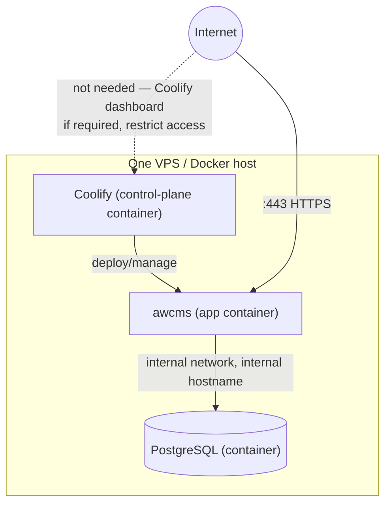
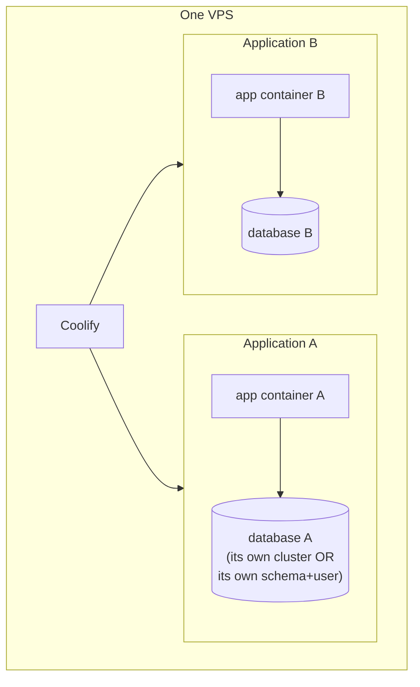

🇬🇧 English (source) · 🇮🇩 [Bahasa Indonesia](deploy-coolify.id.md)

# Deploy Coolify

> **This repo's deployment: ONE environment.** `awcms.ahlikoding.com`,
> `APP_ENV=production`. There is no second deployed environment —
> [ADR-0083](../adr/0083-this-template-deploys-to-one-environment.md). The reason
> is not cost saving: this repo is a **template**, and its live deployment exists
> to demonstrate and validate the template, not to serve a business. What would
> be "staged" is the template itself, and that is validated by the CI gate chain
> plus the Postgres-backed integration suite — not by a second copy that has to
> be maintained (another set of secrets, another database that needs backups,
> another migration queue).
>
> **`staging` is no longer a deployment profile.** It was removed from the
> vocabulary — `ModuleDeploymentProfile` in `src/modules/_shared/module-contract.ts`
> is now `development`, `production`, `offline-lan` (three, not four; see
> [`deployment-profiles.md`](deployment-profiles.md)). What did **not** disappear
> is its isolation contract: it moved house to
> [`environments.md`](environments.md) §Second-environment isolation contract
> (its own database, its own secrets, outbound integrations off) and now applies
> to **any second environment** someone stands up alongside their production one,
> whatever they call it. For anyone running more than one environment, one rule
> must not be broken: **one Coolify app per environment**, not one app with two
> domains. Environments that share an app share env vars, and that is exactly how
> a second environment accidentally writes to production data. Every piece of
> guidance in this document (the two deploy patterns, topologies, PostgreSQL
> options, security checklist) applies per environment, however many you run.
>
> **Verify against the control-plane, not with `curl`.** As of 11 August 2026
> `https://awcms.ahlikoding.com` answers 200 all the time — while its production
> application row (`got4etcblum9kowdv4mrixqo`) **does not exist** in Coolify's
> `applications` table (not a soft-delete) and there is no production database in
> `standalone_postgresqls`. The `awcms-staging-varnish` container installs a
> Traefik rule matching `awcms-staging.ahlikoding.com` **and**
> `awcms.ahlikoding.com`, so the production domain is being served by another
> deployment on top of the `awcms_staging` database. **A 200 on the production
> domain is not proof that production is alive**; what proves it is `applications`
> and `standalone_postgresqls`. Those `awcms-staging-*` resources are being torn
> down as separate infrastructure work — the names here are resource names as of
> 11 August 2026, not the name of a profile.

> **Document status:** partly a target guide. The `awcms` repo does not have a real `docker-compose.yml` yet, but `Dockerfile.production` DOES exist — real, at the repo root (multi-stage, non-root user `bun`, healthcheck) and already used actively by the `build` job in `.github/workflows/release.yml` to build+push the image to `ghcr.io/ahliweb/awcms` on every release (see [`release-process.md`](release-process.md) for an accurate status description). Because of that, **Pattern 1 and Pattern 2 below (build from `Dockerfile.production`) are usable today** — this document adapts the Coolify operational guidance already proven on the `awcms-mini` codebase for the Coolify-specific details (VPS topology, PostgreSQL options, security checklist) that are still a target standard until genuinely practised against a real deployment.

Operational guidance for deploying AWCMS to [Coolify](https://coolify.io) using `Dockerfile.production` as the registry/CI-push path, alongside `docker-compose.yml` which remains the recommended LAN-first/offline path (see [`deployment-profiles.md`](deployment-profiles.md) §production (online) — registry image). This document does **not replace** that one — it adds the Coolify-specific details: single-VPS topology, multi-application-on-one-VPS topology, PostgreSQL options, practical capacity, and a security checklist.

## Two deploy patterns on Coolify

### Pattern 1 — Build from the GitHub repo

Coolify clones the repo and runs `docker build -f Dockerfile.production` itself on every deploy (building on the Coolify server, or on a separate build server if configured).

1. Coolify → **New Resource** → **Application** → **Public/Private Repository** (GitHub) → pick the `ahliweb/awcms` repo (or a fork/derived repo).
2. **Build Pack**: pick **Dockerfile**, point it at `Dockerfile.production` (not the default `Dockerfile` — this repo has no `Dockerfile` at the root, only `Dockerfile.production`).
3. **Port**: `4321` (the image does `EXPOSE 4321`, `ENV PORT=4321`).
4. **Health Check Path**: `/api/v1/health` (see §Health check below).
5. Set the environment variables (§Minimum environment variables below) before the first deploy.
6. Run the one-shot migration (§One-shot migration below) **before** the first app container deploy against a new database.
7. Deploy. Coolify builds the image, runs the container, checks the health check path.

Good for: fast iteration, no separate registry needed, Coolify manages the build pipeline entirely.

### Pattern 2 — Pull the image from a registry

CI (GitHub Actions or otherwise) runs `docker build -f Dockerfile.production` and pushes to a registry (GHCR, Docker Hub, etc.); Coolify only pulls + runs the finished image.

1. CI: `docker build -f Dockerfile.production -t ghcr.io/<org>/awcms:<tag> . && docker push ghcr.io/<org>/awcms:<tag>`.
2. Coolify → **New Resource** → **Application** → **Docker Image** → fill in the image name + tag, plus registry credentials if private.
3. The **Port**/**Health Check Path**/environment variable/migration steps are the same as Pattern 1.

Good for: an immutable image per release, one build used in many environments, or when the Coolify build server should be kept light.

This repo ALREADY has an automatic registry CI/CD workflow for this: the `build` job in `.github/workflows/release.yml` builds `Dockerfile.production` and pushes to `ghcr.io/ahliweb/awcms` on every release tag (see [`release-process.md`](release-process.md)) — operators use that image directly in Coolify without having to set up their own build-push pipeline, unless they want a different registry/tagging.

**Image tags do not carry a `v` prefix.** The workflow strips it (`VERSION="${GITHUB_REF_NAME#v}"`), so the Git tag `v7.0.1` produces `ghcr.io/ahliweb/awcms:7.0.1` — not `:v7.0.1`, which does not exist and will fail to pull. Also available are `:sha-<first 12 characters of the commit>` and `:latest`; for a traceable deployment, fill Coolify in with an explicit version, not `latest`.

## Single VPS / same Docker host topology

The recommended default pattern for one small-to-medium VPS: Coolify, the application, and PostgreSQL run as Docker containers on the same host, inside the same internal Docker/Coolify network.



Key points:

- **The database needs no public port** when it is only reached by the app on the same host/Docker network — use the internal Coolify hostname, not the VPS public IP, in `DATABASE_URL`.
- The database public port (`5432`) is only opened when genuinely needed (e.g. external admin access for operational purposes) — restricted by firewall/IP allowlist/VPN, and using SSL if the connection crosses a public network.
- The Coolify dashboard itself should be restricted (firewall/VPN/IP allowlist) if the VPS faces the internet directly.
- A single VPS means a single point of failure — if the host dies, Coolify, every app, and the database inside it die with it. This is a deliberate trade-off for MVP/demo/small-to-medium production/single-server clients, not a recommendation for high load or HA requirements (see §When to split off to another VPS/managed database). For a production ERP platform (financial transactions, payroll), consider HA/managed database earlier than for an equivalent CMS client — the downtime impact on critical business processes (transaction posting, payroll run) is generally higher.

## Multi-application-on-one-VPS topology

A single Coolify instance can manage several applications/projects on the same VPS — common for operators hosting several clients or several AWCMS instances (e.g. an isolated deployment per client) on one server.



Mandatory rules per application:

- **Its own domain/subdomain**, its own env vars/secrets, its own deployment config in Coolify (separate project/app, not one app with many domains).
- **A separate database per application**, or at minimum a separate schema + role with limited privileges when sharing one PostgreSQL cluster (see §PostgreSQL options below). NEVER share one database/schema between different applications — for a multi-client ERP, this also means one client's financial/HR data never shares a physical database with another client unless an explicit isolation policy allows it.
- **Do not reuse secrets** across applications: `AUTH_IP_HASH_SECRET`, `AWCMS_SYNC_HMAC_SECRET`, `AUTH_MFA_SECRET_ENCRYPTION_KEY`, external integration credentials (payment gateway/marketplace/Coretax/logistics), and database role passwords must be unique per application.
- **Do not share the default superuser/`postgres` role** for any app runtime — every application still uses the two-role model (§Two-role model in `deployment-profiles.md`): a privileged migration role separate from the least-privilege app role (`awcms_app` or another app-specific role per application).
- **App-to-DB uses the internal network/internal hostname**, not a public URL, exactly as in the single-app topology above.
- **Backup and restore per application/database** — retention and schedule may differ per application, but every application must be restorable selectively without touching another application's data (see §Backup below).

## PostgreSQL options for multiple applications

| Option                                          | Description                                                                                                   | Good for                                                                                                                       | Trade-off                                                                                                                                                                             |
| ----------------------------------------------- | ------------------------------------------------------------------------------------------------------------- | ------------------------------------------------------------------------------------------------------------------------------ | ------------------------------------------------------------------------------------------------------------------------------------------------------------------------------------- |
| **1. One cluster, many databases**              | One PostgreSQL container/instance, each application gets its own `CREATE DATABASE` + role in the same cluster | Several small-to-medium applications on a VPS with limited resources                                                           | Resource-efficient (one Postgres process); larger blast radius — a down/corrupt cluster hits every application; needs role/permission discipline per database to prevent cross-access |
| **2. One PostgreSQL container per application** | Every application has its own Postgres container, fully isolated                                              | Clients/data that need harder separation (e.g. per-client financial compliance), applications with very different load/schemas | Best isolation; more resource-hungry (RAM/CPU/disk per Postgres instance, not one shared)                                                                                             |
| **3. External/managed PostgreSQL**              | The database lives outside the Coolify VPS — a managed DB provider or a separate Postgres server              | Larger production, high HA/replication/compliance requirements (common for ERP financial/payroll data), or heavy query load    | Shares no resources with Coolify/other apps; needs a secure network connection (TLS, firewall/VPC) off the VPS; managed-service operating cost                                        |

Rules that hold in all three options: the application runtime role is always least-privilege (not the cluster superuser/owner), `FORCE ROW LEVEL SECURITY` is still applied per the two-role model, and migrations are always run as a separate step with the privileged role — see [`deployment-profiles.md`](deployment-profiles.md) §Two-role database model for the full detail, which applies identically on Coolify.

## Practical capacity limits (rule-of-thumb, not an SLA)

| VPS resource      | Estimated safe capacity                                                                                          |
| ----------------- | ---------------------------------------------------------------------------------------------------------------- |
| 2 CPU / 4 GB RAM  | 1-3 light applications + 1 small PostgreSQL                                                                      |
| 4 CPU / 8 GB RAM  | 3-8 light/medium applications + 1-3 active PostgreSQL/databases                                                  |
| 8 CPU / 16 GB RAM | Several more serious applications — resource monitoring and separate per-application backups are still mandatory |

The numbers above are a **rule-of-thumb**, not a guarantee (SLA). Real capacity depends on query load, database size, build frequency, and the backup/log retention active simultaneously on the same host. For ERP modules with heavy reporting/reconciliation load (e.g. monthly financial reports, payroll reconciliation), plan resources more conservatively than a CMS-only estimate.

### Running more than one application replica

The table above is about CPU/RAM per VPS for _several different applications_ on one host. Raising the **replica/instance count of the SAME application** (e.g. Coolify horizontal scaling, or several app containers behind one load balancer) is a different dimension — every replica opens its own connection pool to the same PostgreSQL/PgBouncer. Before raising the replica count, run (once available):

```bash
DATABASE_CAPACITY_APP_INSTANCES_MAX=<target replica count> \
bun run database:capacity:check
```

Read-only, pure config arithmetic — it touches no Coolify/PostgreSQL at all. Formula details and worked examples: `database-capacity-runbook.md` (to follow).

## When to split the database or an application off to another VPS/managed database

Consider splitting off (external/managed database, or a separate VPS) once any of the following starts happening:

- High traffic or heavy/slow database queries.
- The database grows fast toward the VPS disk limit.
- You need high availability/replication that is impractical to run as a single container on one VPS.
- Strict backup retention/compliance/audit requirements (common for financial/payroll/tax data).
- VPS resources (CPU/RAM/disk/I/O) are consistently filling up.
- One application's build/deploy process starts hurting the performance of other applications on the same VPS.
- You need harder blast-radius isolation between clients/applications (e.g. a client SLA contract requires separate infrastructure).

## Minimum environment variables

The following values must be injected through Coolify environment variables (not baked into the image) for every application/deployment. See `.env.example` (to follow) for the full list and per-variable comments:

| Variable                                               | Required    | Notes                                                                                                                                                                                                                                                                        |
| ------------------------------------------------------ | ----------- | ---------------------------------------------------------------------------------------------------------------------------------------------------------------------------------------------------------------------------------------------------------------------------- |
| `DATABASE_URL`                                         | Yes         | The least-privilege app role (`awcms_app` or equivalent), **not** the migration role. Internal hostname when app+DB are on one network.                                                                                                                                      |
| `APP_URL`                                              | Yes         | The application's public URL. Required by `scripts/validate-env.ts` alongside `APP_ENV` and `DATABASE_URL` — and only those three.                                                                                                                                           |
| `AUTH_COOKIE_SECURE`                                   | Yes         | `true` for a Coolify deployment (always behind HTTPS).                                                                                                                                                                                                                       |
| `APP_ENV`                                              | Yes         | This repo's deployment: always `production`. A second environment standing alongside production also uses `production` — what separates them is the database/secrets/outbound integrations, not the label — and different environments **never** share the same Coolify app. |
| `AWCMS_SYNC_HMAC_SECRET`, `AWCMS_SYNC_ENABLED`, `R2_*` | Conditional | Required when sync/R2 is used — see `bun run config:validate` (`deployment-profiles.md` §Configuration validation), which enforces these conditional rules at boot.                                                                                                          |

`bun run config:validate` refuses with a clear message when a required variable is missing or the conditionals are inconsistent — run it yourself before relying on a first Coolify deploy, **from a repo checkout**, not from inside the app container (the runtime image does not ship `scripts/` — see §Scheduled dispatchers). It can also check an env file directly: `bun scripts/validate-env.ts --file <path>`.

> **`bun run production:preflight` DOES NOT EXIST in this repo.** The orchestrator doc 07 refers to has not been implemented and is listed as a deferred target in [`scripts/README.md`](../../scripts/README.md) §Deferred — scheduling it will fail, not block a deploy. What is real today: `bun run config:validate` (env contract, no DB) and `bun run security:readiness` (a series of checks against a live DB, exiting non-zero when a `critical` one fails — the check count grows, do not memorise the number; `runSecurityReadinessChecks()` in `scripts/security-readiness.ts` is the list that applies).

## One-shot migration

Exactly as described in [`deployment-profiles.md`](deployment-profiles.md) §Two-role database model: `Dockerfile.production` does **not** run migrations — the image's runtime role (`awcms_app`) has no DDL/GRANT rights.

Against an already-live database, **§Backup below is step zero** — the backup is taken and proven restorable first, because migrations here are forward-only and this repo has no preceding environment to rehearse them on ([ADR-0083](../adr/0083-this-template-deploys-to-one-environment.md)).

On Coolify, run the migration as a separate step **before** the app's first deploy against a new database:

- **A one-off command in Coolify** (if available for your application/database resource): run `bun run db:migrate` with a privileged `DATABASE_URL` (the migration/superuser role), not the app runtime URL.
- **Manually from a local checkout**: `DATABASE_URL=<privileged-migration-url> bun run db:migrate` pointing at the Coolify database hostname/port (internal when run from the same host, or a temporary public port when run from outside — make sure the port is closed again afterwards if you opened it just for the migration).
- **A separate CI job** before triggering the Coolify deploy, if the operator has set up a registry CI/CD pipeline (out of scope for this document).

Every application/database in a multi-app topology has its own one-shot migration — do not run one application's migration against another application's database.

## Health check — two endpoints, two questions

Endpoint: `GET /api/v1/health` — used as the **Health Check Path** in the Coolify application configuration (see §Two deploy patterns above). Coolify uses this endpoint to decide the container is healthy before marking the deploy successful/before routing traffic.

```bash
curl https://awcms.ahlikoding.com/api/v1/health
```

Every application in a multi-app topology is checked via its own health endpoint — there is no shared cross-application health check. Note the limit of what it proves: this endpoint proves **the container answering that domain** is healthy, not which container is answering. For the question "is deployment X really alive", the answer is in Coolify's `applications`/`standalone_postgresqls` — see the verification note at the head of this document.

### It is LIVENESS, and it answers 200 with the database on fire

`/api/v1/health` touches no dependency by design. Coolify, the container `HEALTHCHECK` and the Varnish backend probe all use it, and all three are right to: they RESTART or REROUTE, and restarting an app does not repair a database — a probe that cycles containers through a database outage turns one incident into two.

The consequence, and it is the one finding **D10** of the 17 August 2026 round names: **a release whose database is unreachable is marked successful and cut over.** Nothing in the deploy path asks whether the new container can actually serve.

### The readiness endpoint, and where it is now read

`GET /api/v1/database/pool/health` is equally unauthenticated and reports `databaseReachable`, `circuitBreakerState`, per-work-class saturation and this process's pool capacity.

```bash
curl -s https://awcms.ahlikoding.com/api/v1/database/pool/health
# {"status":"healthy","databaseReachable":true,"circuitBreakerState":"closed", …}
```

- **`ops/synthetic-check.sh` reads it** (every 10 minutes, from outside, alerting once on the transition) — that is the automatic reader D10 asked for, and it alerts a human rather than restarting a container.
- **Run it yourself as the last step of a deploy**, before you call the deploy done. `status` must be `healthy`; `databaseReachable` must be `true`; `circuitBreakerState` must not be `open`. A `200` from the domain is not evidence the release works — the container answering it may be the previous one, and it answers `/api/v1/health` either way.

**Do NOT point Coolify's Health Check Path at the readiness endpoint.** That configuration is not in this repo, so nothing here can enforce the choice — which is exactly why it is written down: it drives restart, and readiness belongs on the path that pages a person.

## Backup — mandatory, and mandatory BEFORE a migration

`deploy/backup/backup-postgres.sh` and `deploy/backup/restore-postgres.sh` **exist in this repo** (pure Bash, wrapping `pg_dump`/`pg_restore`; each script's comment header carries its full command). Both apply identically on Coolify — for a periodic schedule, via a Coolify scheduled task (if available) or cron on the VPS.

**Before every `bun run db:migrate` against a live deployment, take AND verify a backup.** This is not advice. This repo deploys to one environment ([ADR-0083](../adr/0083-this-template-deploys-to-one-environment.md)): there is no preceding environment that receives `sql/NNN` first, while migrations here are forward-only (there is no `down`). ADR-0083 §Consequences records **a backup already verified as restorable** as the thing that replaces that missing pre-production rehearsal — a mitigation, not an equivalent replacement, so do not skip it.

The Coolify PostgreSQL database publishes no port, so both scripts are run as a **one-shot container** sharing the DB container's network namespace (which is why the DSN is `127.0.0.1`), using a PostgreSQL image whose **version matches the server** — an older `pg_dump` refuses a newer server:

```bash
# 1. take the backup (custom format + .sha256 sidecar, verified on the spot)
docker run --rm --network container:<container-db> \
  -v /var/backups/awcms:/backup \
  -v /opt/awcms/deploy/backup:/scripts:ro \
  -e DATABASE_URL="postgres://<owner>:<pw>@127.0.0.1:5432/<db>" \
  -e BACKUP_DIR=/backup \
  postgres:18.4 bash /scripts/backup-postgres.sh

# 2. prove the dump really can be restored — a verify-only drill:
#    restore into a throwaway database, inspect it, then DROP it.
#    WITHOUT --target this script never touches the live database.
docker run --rm --network container:<container-db> \
  -v /var/backups/awcms:/backup \
  -v /opt/awcms/deploy/backup:/scripts:ro \
  -e DATABASE_URL="postgres://<owner>:<pw>@127.0.0.1:5432/<db>" \
  postgres:18.4 bash /scripts/restore-postgres.sh /backup/awcms_<db>_<timestamp>.dump
```

Step 2 is not optional: `backup-postgres.sh` only proves **the file** is readable, `restore-postgres.sh` is what proves **its contents** become a database again — including that tables with `FORCE ROW LEVEL SECURITY` survive the round-trip. Tenant isolation lost during a restore is a silent failure: everything looks healthy, and not one tenant is separated. The role in `DATABASE_URL` is the same **owner/privileged** role that runs migrations (the drill creates and drops its own scratch database), not `awcms_app`. Record the dump file name, its `sha256`, and the drill time in the deploy notes. Full procedure with its migration context: [`database-migrations.md`](database-migrations.md) §Step 0.

In a multi-app topology: every application/database has its own backup schedule and `BACKUP_DIR`, so restoring one application never touches another application's dumps. Retention (`BACKUP_RETENTION_DAYS`) may differ per application according to each one's needs (mind the legal retention obligations for financial/tax/payroll data where relevant). Run periodic restore drills (`restore-postgres.sh` without `--target` always restores into a disposable database, it never overwrites the live one) for every application/database considered important.

Backup storage/R2 (when used) follows the per-application R2 bucket/prefix scope already configured through `R2_BUCKET` and the other R2 variables in each application's environment variables — do not share a bucket/prefix between applications without a clear path separation.

## Scheduled dispatchers

`bun run email:dispatch` and similar dispatchers (sync objects, transaction posting/external integrations — see [`deployment-profiles.md`](deployment-profiles.md) §Scheduled dispatchers for the full detail) are CLIs, not endpoints.

**Not `docker exec` into the app container.** `Dockerfile.production` produces a **runtime-only** image: the `runtime` stage copies only `node_modules`, `dist/`, and `package.json` — `scripts/` is not included. So `docker exec <container-app> bun run email:dispatch` fails with `Module not found "scripts/email-dispatch.ts"`; it sends not a single email while looking "scheduled". This image shape is deliberate and does not need changing — it is exactly the same problem and pattern as migrations, see [`environments.md`](environments.md) §Running migrations: a one-shot container, not `docker exec`.

Run it as a **one-shot container** from a repo checkout at the **release tag currently deployed**, sharing the DB container's network namespace so the DSN is `127.0.0.1`:

```bash
# Once per deploy: prepare a checkout at the release tag that is ACTUALLY running
# (vX.Y.Z, not `main` — the job must match the deployed schema).
git clone --depth 1 --branch vX.Y.Z https://github.com/ahliweb/awcms.git /opt/awcms-jobs
cd /opt/awcms-jobs && bun install --frozen-lockfile --production

# Every tick (from the scheduled runner):
docker run --rm --network container:<container-db> \
  -v /opt/awcms-jobs:/app -w /app \
  --env-file /opt/awcms-jobs/.env.jobs \
  oven/bun:1.3.14-alpine \
  bun run email:dispatch
```

`.env.jobs` carries the same env as the app for the feature in question — for email: `WORKER_DATABASE_URL` (used first by `getWorkerDatabaseClient`, falling back to `DATABASE_URL` when empty), `EMAIL_ENABLED`, `EMAIL_PROVIDER`, and the provider credentials. Use the app/worker runtime role; do **not** use the owner/migration user. `bun install` is run once at deploy time into the same volume, not on every tick.

That runner is what gets scheduled through a Coolify **Scheduled Task** (if your plan/version supports it) or cron on the VPS host every 1-2 minutes — exactly the same pattern is used by the edge cache purge worker (`environments.md` §Edge cache (ADR-0042)). Just like backups, in a multi-app topology every application has its own checkout, `.env.jobs`, and schedule — there is no shared cross-application dispatcher. When the related feature is `false`, this command is a no-op (exit 0), so it is safe to schedule even before it is activated.

Other jobs (audit purge, sync objects, etc.) are scheduled with exactly the same one-shot container pattern, only the command name differs — see [`deployment-profiles.md`](deployment-profiles.md) §Job registry for the full job list and which ones are on-demand (not a repeating cron).

## Rollback

- **Registry image (Pattern 2)**: rollback = redeploy the previous image tag in Coolify. Because `Dockerfile.production` is immutable per build, a pure application rollback is a fast operation.
- **Migration caution**: an image rollback does **not** automatically undo schema migrations already applied. If the new deploy included a breaking migration, rolling the image back to the old version can leave the old app running against an incompatible new schema. Test that migrations are backward-compatible (expand-first) before deploying, and make sure a restore from backup really is available as the schema rollback path (§Backup — that is exactly why its verify-only drill is mandatory, not ceremonial) — for financial/payroll modules, test extra carefully, because a botched rollback can trigger transaction data inconsistencies.
- **Build-from-repo (Pattern 1)**: rollback = redeploy the previous Git commit/tag in Coolify.

## Security — single VPS and multiple applications

This checklist applies to both topologies (single-app and multi-app); points marked **(multi)** are specifically relevant when several applications share one VPS/Coolify:

- SSH key-only, root login restricted per the server/VPS provider policy.
- Firewall: only open the ports you need — `80`/`443` public, SSH restricted by IP/VPN where possible, the Coolify dashboard restricted if the VPS faces the internet directly.
- Create the Coolify admin account immediately after installation — do not leave the dashboard without a configured admin account.
- Database public port **disabled by default** — open it only when needed, restricted by firewall/IP/VPN, and use SSL when it crosses a public network.
- App and database on the same internal network use the internal hostname, not a public URL.
- Scheduled PostgreSQL backups to S3-compatible storage/R2, plus periodic restore drills.
- Monitor CPU/RAM/disk/I/O — builds, Coolify, the app, the database, backups, and logs all share the same host resources; set up resource limits/reservations if one application/database risks eating the shared resources.
- Log/audit retention active (`AUDIT_LOG_RETENTION_DAYS`, `bun run logs:audit:purge`).
- Update Docker/Coolify regularly.
- **(multi)** Per-application secrets must not be reused — see §Multi-application topology above.
- **(multi)** Database isolation per application (a separate database, or at minimum a separate schema+role) — see §PostgreSQL options.
- **(multi)** Backup/restore per application/database, not one combined cross-application backup.

## See also

- [ADR-0083](../adr/0083-this-template-deploys-to-one-environment.md) — why this repo deploys to one environment, why `staging` was removed from the profile vocabulary, and what was given up along with it.
- [`deployment-profiles.md`](deployment-profiles.md) — the three deployment profiles (`development`/`production`/`offline-lan`), the two-role database model, and the `docker-compose.yml` vs `Dockerfile.production` comparison.
- [`database-migrations.md`](database-migrations.md) §Step 0 — the backup + restore drill procedure that must precede every migration.
- `deploy/backup/backup-postgres.sh`, `deploy/backup/restore-postgres.sh` — the real scripts; each file's comment header is its documentation (env vars, modes, limits deliberately left unimplemented).
- [`database-capacity-runbook.md`](database-capacity-runbook.md) — the cross-instance connection capacity model, mandatory to check before raising the application replica count.
- `Dockerfile.production` — the registry-based production image, real at the repo root and used by the `build` job in `release.yml`.
- [The official Coolify documentation](https://coolify.io/docs) — installation, applications, databases, backups, and resource monitoring at the platform level (out of scope for this document, which focuses on AWCMS-specific configuration).
