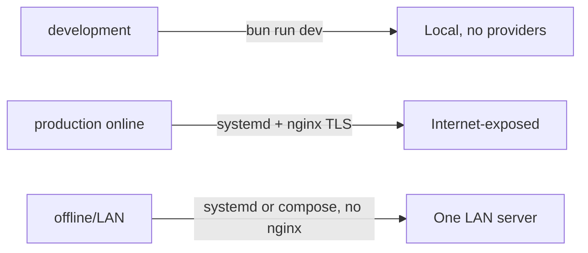

🇬🇧 English (source) · 🇮🇩 [Bahasa Indonesia](deployment-profiles.id.md)

# Deployment Profiles

> **Document status:** operational target/plan, not implementation status. The `awcms` repo currently has neither ERP module code nor real `deploy/*`/`docker-compose.yml` files — this document adapts the deployment standard already proven in the `awcms-mini` base (fully implemented there) into a **target procedure** for the `awcms` ERP platform. The structure/mechanisms (environment profiles, TLS topology, two-role database model, job registry) are kept as a mandatory standard; the `awcms-mini`-specific issue/PR numbers and implementation history are removed because they are not relevant for this repo.
>
> **Correction: part of `deploy/*` ALREADY exists.** `deploy/backup/backup-postgres.sh` + `deploy/backup/restore-postgres.sh` (§Local backup), `deploy/pgbouncer/`, `deploy/cron/`, and `deploy/redis/` are real in the repo; what is still a plan is `deploy/systemd/`, `deploy/nginx/`, `deploy/postgres/`, and `docker-compose*.yml` at the repo root. Treat every file reference below according to that list, not according to the status sentence above.
>
> **Correction: `Dockerfile.production` ALREADY exists.** It is really there at the repo root (multi-stage, non-root user `bun`, healthcheck) and is already actively used by the `build` job in `.github/workflows/release.yml` to build+push the image to `ghcr.io/ahliweb/awcms` on every release — see [`release-process.md`](release-process.md) for an accurate status description. The image-registry path (Coolify pull-image, direct `docker run`) is in this document because it is already usable today; only the LAN-first `docker-compose.yml`/systemd/nginx/pgbouncer path below is still a plan.

This document is the deployment profile standard for AWCMS (see ADR-0001, [`01_canvas_induk.md`](01_canvas_induk.md) §Final stack) — it complements the environment variable reference (`docs/awcms/18_configuration_env_reference.md`, to follow) with a concrete mapping: which file in `deploy/` and `docker-compose.yml` is used on which environment profile, once both are implemented.

## Summary



The three profiles and the `deploy/*` files relevant to each (`deploy/backup/*` and `deploy/pgbouncer/*` are already real; `deploy/systemd/*`, `deploy/nginx/*`, and `docker-compose.yml` are still a plan — see the status correction above):

| Profile                 | Characteristics                                                                                                                    | Relevant `deploy/`/root files (planned)                                                                                                                                                                                   |
| ----------------------- | ---------------------------------------------------------------------------------------------------------------------------------- | ------------------------------------------------------------------------------------------------------------------------------------------------------------------------------------------------------------------------- |
| **development**         | All providers off, local DB, cookies not secure                                                                                    | `bun run dev` directly (no need for `deploy/*` or `docker-compose.yml`); `.env` copied from `.env.example` as-is                                                                                                          |
| **production (online)** | HTTPS, secret manager, tested backup+restore, optional sync (e.g. Coretax/payment gateway/marketplace)                             | `deploy/systemd/awcms.service.example`, `deploy/nginx/awcms.conf.example` (TLS termination), `deploy/backup/*`, optionally `deploy/pgbouncer/*` if there are many short connections                                       |
| **offline/LAN**         | No internet; external sync/integration off or deferred; ERP operations (transactions, warehouse, HR) still run fully; local backup | `deploy/systemd/awcms.service.example` (or `docker-compose.yml`) runs the app directly on port 4321 — **nginx can be skipped entirely**, there is no public exposure; `deploy/backup/*` is still mandatory (local backup) |

**Three, not four.** `staging` used to be the fourth row of this table; it has been **removed from the profile vocabulary** ([ADR-0083](../adr/0083-this-template-deploys-to-one-environment.md), as amended) — not merely "not run here". `ModuleDeploymentProfile` in `src/modules/_shared/module-contract.ts` is therefore `development | production | offline-lan`. A profile nobody has ever drilled is a claim, not a capability: it clings to every module's `deploymentProfiles`, to every document table, and to every `APP_ENV` branch without a single deployment proving it true.

What did **not** disappear with it is its isolation contract — its own database, its own role/password, its own secrets, outbound integrations off, no writes to the production media bucket, DNS provider `manual`, per-environment purge tokens. That contract moved house to [`environments.md`](environments.md) §Second environment isolation contract, and now applies to **any second environment** someone stands up alongside their production, whatever they call it. This repo's own deployment is still just one: production at `awcms.ahlikoding.com` — what will be "staged" here is the template itself, and that is validated by the CI gate chain plus the Postgres-backed integration suite, not by a second running copy. The Coolify guide that derives this rule down to operator level: [`deploy-coolify.md`](deploy-coolify.md).

Selection principle: nginx (`deploy/nginx/`) is only needed when you need TLS termination for clients outside the trusted machine/network, or when fronting several upstream instances — a single-server LAN-first topology can serve the application directly on port 4321 with no reverse proxy at all. PgBouncer (`deploy/pgbouncer/`) is only for high-volume short-connection scenarios (e.g. many external-integration sync workers running concurrently) — not a default need.

## ERP context: offline-first is still mandatory for core operations

The LAN-first/offline-first principle that is the base standard (ADR-0001) applies equally to ERP modules: daily financial transactions, warehouse/inventory recording, HR attendance, and manufacturing processes **must keep running fully without internet** on the offline/LAN topology — only features that are inherently online-dependent (payment gateway, marketplace sync, e-Faktur/Coretax submission, online logistics tracking numbers) may be deferred/off on this profile, and they must be outboxed (ADR — outbox/queue for external integrations, see `AGENTS.md`) rather than synchronised synchronously from the critical transaction path.

## How to run each profile

### development

```bash
cp .env.example .env
bun install
bun run db:migrate
bun run dev
```

### production (online) — bare-metal (systemd)

```bash
bun install && bun run build
sudo cp deploy/systemd/awcms.service.example /etc/systemd/system/awcms.service
sudo cp deploy/nginx/awcms.conf.example /etc/nginx/sites-available/awcms.conf
# ... adapt the placeholders in both files (see the header comments in each) ...
sudo systemctl enable --now awcms
sudo systemctl reload nginx
```

### offline/LAN — bare-metal (systemd, no nginx)

The same as above, minus the nginx step — LAN clients reach the application directly at `http://<lan-server-ip>:4321`.

### production / offline-LAN — container (docker-compose.yml)

The `docker-compose.yml` at the repo root (planned) will run the default LAN-first stack: `app` (image `oven/bun:1.3.14` pinned, not `node`, per the Bun-only standard) and `db` (`postgres:18.4`). PgBouncer is available as an optional `pgbouncer` service, gated by Compose `profiles` so it is never automatically active:

```bash
cp .env.example .env
export APP_UID=$(id -u) APP_GID=$(id -g)   # app runs as the host user, not root
docker compose up --build           # app + db only
docker compose --profile pgbouncer up   # include the optional pgbouncer
curl http://localhost:4321/api/v1/health
```

**Container hardening (a mandatory standard from the start, not a retrofit)**: `db` and `pgbouncer` must not publish host ports by default — only `app`'s `4321:4321` is open (the only real topological need). For local `psql`/GUI client access from the host, copy `docker-compose.override.yml.example` to `docker-compose.override.yml` (auto-loaded, `.gitignore`d) — it binds both ports to `127.0.0.1` only. Every service (`db`/`migrate`/`app`/`pgbouncer`) must run `cap_drop: [ALL]` (plus the minimal `cap_add` for `db`'s own entrypoint), `security_opt: no-new-privileges:true`, a healthcheck, and starting-point `deploy.resources.limits`. PgBouncer's `pgbouncer.ini.example` must use `auth_type = scram-sha-256` (not `md5`).

`export APP_UID/APP_GID` is mandatory — without it, `app` runs as root inside the container and `bun install`/`bun run build` write `node_modules/`/`dist/` files that persist as root-owned in the bind-mounted repo, which then blocks **host**-side `bun install`/`bun run build` on the same checkout.

All secrets/config come in through `env_file: .env` / `environment:` in `docker-compose.yml` — no hardcoded values. `DATABASE_URL` is overridden automatically by `docker-compose.yml` so it points at the `db` service hostname (not `localhost` as `.env.example` defaults to, which is meant for non-container deployments).

Compose also realises the two-role model below without a manual step: the `migrate` service (one-shot, as superuser) runs `db:migrate`, the `app` service waits for `migrate` to finish (`depends_on: … condition: service_completed_successfully`) and then connects as the least-privilege role — so `docker compose up` sequences itself: `db` init creates the roles → `migrate` applies the schema + FORCE RLS + grants → `app` starts.

### production (online) — image registry (`Dockerfile.production` + `docker-compose.prod.yml`, optional)

The `docker-compose.yml` above remains the recommended path for the single-server LAN-first topology (bind-mount + `bun install && bun run build` at container start — practical for an operator who `git pull`s/rebuilds in place). `Dockerfile.production` (used via `docker-compose.prod.yml` or a manual `docker build`/`docker run`) is **another optional** path, for image-registry-based deployment (build once in CI, push the image, pull+run identically in every environment) — used when build-at-startup is undesirable (slower cold start, you want an immutable image) or when the orchestrator (Coolify, k8s, ECS, etc.) expects a ready-made image.

Key differences vs `docker-compose.yml`'s `app` service:

| Aspect      | `docker-compose.yml` (`app`)                                  | `docker-compose.prod.yml` (`app`) / `Dockerfile.production`          |
| ----------- | ------------------------------------------------------------- | -------------------------------------------------------------------- |
| Code source | Bind-mounts the repo directly (`volumes: - .:/app`)           | `COPY` into the image at build — immutable once created              |
| Build       | At container start (`bun install && bun run build`)           | At `docker build` (multi-stage) — container start is instant         |
| User        | Host user (`APP_UID`/`APP_GID`) — needs a writable bind-mount | The `oven/bun:1.3.14` image default user, `bun` (non-root, uid 1000) |
| Filesystem  | Writable (bind mount + install/build inside it)               | `read_only: true` + `tmpfs: [/tmp]`                                  |
| Migration   | A separate `migrate` service in the same compose              | Not included — run `bun run db:migrate` separately                   |
| Suited for  | LAN-first single server, operator `git pull` in place         | Registry/CI-push, container orchestrators (Coolify/k8s/ECS)          |

Two ways to run this image (planned) — pick one:

**1. `docker-compose.prod.yml` (recommended)** — a standalone stack (not an override of `docker-compose.yml`) that builds `app` from `Dockerfile.production` and runs `db` with the same hardening as `docker-compose.yml`'s `db`:

```bash
cp .env.example .env
bun run db:migrate   # or a one-shot docker run, see below — run BEFORE the app starts
docker compose -f docker-compose.prod.yml up -d --build
curl http://localhost:4321/api/v1/health
```

`app` here runs `read_only: true` (`tmpfs: [/tmp]`) — safe because this image does not write to its own filesystem at runtime. To deploy from an image already pushed to a registry (rather than building locally), replace the `build:` block on `app` in `docker-compose.prod.yml` with `image: <registry>/awcms:<tag>` directly.

**2. Manual `docker build`/`docker run`** — for orchestrators that do not use Compose (Coolify, k8s, ECS, etc., see [`deploy-coolify.md`](deploy-coolify.md)):

```bash
docker build -f Dockerfile.production -t awcms:prod .
docker run -d --name awcms \
  -p 4321:4321 \
  --cap-drop=ALL --security-opt=no-new-privileges:true \
  -e DATABASE_URL=postgres://awcms_app:<password>@<db-host>:5432/awcms \
  -e APP_URL=https://<fqdn> \
  -e AUTH_COOKIE_SECURE=true \
  -e APP_ENV=production \
  awcms:prod
curl http://localhost:4321/api/v1/health
```

`--cap-drop=ALL --security-opt=no-new-privileges:true` — a mandatory standard, and the running app needs no extra `--cap-add`.

Secrets (`DATABASE_URL`, `AUTH_IP_HASH_SECRET`, sync HMAC, MFA/SSO encryption keys, external integration credentials, etc.) are **always** injected at `docker run`/via the orchestrator (env var, secret store, or `--env-file`) — **never** baked into the image. `.dockerignore` excludes `.env`/`.env.*` from the build context. For orchestrators that support secret files (Docker Swarm secrets, Kubernetes Secrets as a volume mount, etc.), the `_FILE` suffix pattern is the industry-standard alternative — not yet mandatory to implement in application code; an operator who needs it can bridge at the orchestrator level (an entrypoint script that reads the secret file then `export`s a normal env var before `exec bun ...`).

This image does **not** run migrations — its runtime role (`awcms_app`, least-privilege) does not have the DDL/GRANT rights migrations need (the two-role model below). Run `bun run db:migrate` as a separate step (a CI job, or a one-shot `docker run` with a privileged `DATABASE_URL`) against a new database before this container is first started.

## TLS/trust boundaries

This application **never** terminates TLS itself (there is no HTTPS listener code) — in every topology, TLS (where present) is the responsibility of the layer **in front of** the application:

| Topology                                                                            | Where TLS stops                                                                                                       | Trust boundary                                                                                                                                              |
| ----------------------------------------------------------------------------------- | --------------------------------------------------------------------------------------------------------------------- | ----------------------------------------------------------------------------------------------------------------------------------------------------------- |
| **offline/LAN**                                                                     | No TLS — `http://` straight to port 4321                                                                              | The trust boundary = the LAN itself (trusted physical/WiFi network); no internet exposure, "PostgreSQL is not public" applies the same way to this app port |
| **production (online), bare-metal**                                                 | `deploy/nginx/awcms.conf.example` (reverse proxy TLS termination)                                                     | Public ↔ nginx = the TLS boundary; nginx ↔ app (`localhost:4321`) = plaintext HTTP **inside** the same machine, never crossing the network                  |
| **production (online), container (`docker-compose.yml`/`docker-compose.prod.yml`)** | A reverse proxy **outside** the compose stack (nginx/Caddy/Coolify's built-in proxy) — compose itself provides no TLS | Public ↔ reverse proxy = the TLS boundary **only if** the reverse proxy really is the only way in                                                           |
| **PostgreSQL (`db`)/PgBouncer**                                                     | No TLS by default (`sslmode` is not forced) — Postgres connections inside the internal Docker network                 | The trust boundary = the compose Docker network itself (`db`/`pgbouncer` publish no host ports, so they are not reachable from outside the machine at all)  |

Operational implications:

- **An important difference from `db`/`pgbouncer`**: `app`'s `ports: ["4321:4321"]` **is still bound to all interfaces (`0.0.0.0`) by default** in both compose files. This does **not** mean it is only reachable by the reverse proxy — on a host with a public/LAN IP that is not fully trusted, any client can contact `http://<host>:4321` directly, bypassing the TLS reverse proxy entirely. **Never** expose `app`'s port 4321 straight to the public internet without a TLS reverse proxy in front of it — `AUTH_COOKIE_SECURE=true` (mandatory for the online profile) assumes the browser client really is speaking HTTPS at some point; without TLS termination, secure cookies are sent over a plaintext channel (and the first request body, such as the login password or financial transaction data, is sent in plaintext regardless of the cookie's status). This mitigation is **mandatory** at the host firewall/network level (the operator) — e.g. `ufw`/`iptables` allowing port 4321 only from `localhost`/the reverse proxy IP, not from the general internet. An operator who wants compose itself to enforce this can bind `ports: ["127.0.0.1:4321:4321"]` if the reverse proxy runs on the same machine outside Docker.
- `PUBLIC_TRUST_PROXY`/similar variables (if implemented for online-only features) are ONLY safe to set to `true` on exactly the "production (online)" row topology in this table — a TLS reverse proxy that overwrites (not appends to) `X-Forwarded-*` is a prerequisite, not optional.
- The plaintext-inside-the-Docker-network `app`↔`db`/`pgbouncer` connection is accepted as an adequate trust boundary **because** that network is never reachable from outside the machine (no host ports published by default) — if the operator runs `db` on a machine separate from `app` (a multi-server topology, outside the scope of the bundled `docker-compose.yml`/`docker-compose.prod.yml`), Postgres TLS (`sslmode=require` on `DATABASE_URL` + a Postgres server certificate) becomes the operator's responsibility.

## Secrets via deployment references

This repo's standard convention ("secrets only from the environment"): plain env vars (`${VAR:-default}` substitution in compose, `environment:`/`env_file:` in containers, or shell/systemd `EnvironmentFile=` variables on bare-metal) — **never** hardcoded into a committed file.

For orchestrators that provide their own encrypted secret-at-rest mechanism (Docker Swarm `secrets:`, Kubernetes `Secret` as a volume mount, Coolify's secret manager, HashiCorp Vault, etc.), plain env vars can still be used — in practice these orchestrators inject secrets **as** runtime env vars (not files) into the container. For orchestrators that specifically mandate a **file-based** pattern (e.g. Docker Swarm secrets mounted as files at `/run/secrets/<name>`, not env vars) — an operator on this topology has two options:

1. **Bridge in the entrypoint** (recommended, no image/application code change needed): write a small entrypoint script that reads the secret files from `/run/secrets/*`, `export`s them as plain env vars, then `exec`s the original command.
2. **Plain env vars straight from the orchestrator's secret store** (simplest when the orchestrator supports it).

## Two-role database model (RLS enforcement)

Isolation between tenants/ERP entities uses PostgreSQL Row-Level Security (a mandatory standard — see AGENTS.md "PostgreSQL + RLS mandatory"). `ENABLE ROW LEVEL SECURITY` alone is **not enough**: PostgreSQL bypasses RLS for the table _owner_ (unless `FORCE`) and unconditionally for SUPERUSER/BYPASSRLS roles. A deployment must therefore use two roles:

- **Migration role (privileged owner/superuser)** — runs `bun run db:migrate`. Needs DDL/GRANT rights. This is `POSTGRES_USER` in `docker-compose.yml` / the privileged URL used once for migrations.
- **Application role `awcms_app` (least-privilege)** — the role the application connects as at runtime (`DATABASE_URL` in `.env`). Not the owner, not a superuser, DML grants only; every tenant-scoped/business-entity table (ledger, payroll, inventory, etc.) must have `FORCE ROW LEVEL SECURITY` plus a fail-closed default GUC (`app.current_tenant_id` = the zero UUID → matches no tenant → 0 rows) so that RLS is genuinely enforced for this role.

Running the application as a superuser voids the entire RLS isolation — `bun run security:readiness` (to follow) must block go-live if the `DATABASE_URL` connection role turns out to be superuser/BYPASSRLS, or if any tenant/business-entity table lacks `relforcerowsecurity`. Run readiness with the application role's `DATABASE_URL`, not the migration URL.

Creating the application role:

- **Container:** automatic — `deploy/postgres/10-create-app-role.sh` (a `/docker-entrypoint-initdb.d` hook) creates it from `AWCMS_APP_DB_PASSWORD` at first cluster init, then the related migration grants it + FORCE RLS.
- **Bare-metal/systemd:** once at the start, as superuser — `CREATE ROLE awcms_app LOGIN PASSWORD '…';` — then `bun run db:migrate` (superuser URL). After that the app connects as `awcms_app` (`DATABASE_URL` in `.env`).

Optional additional roles (defense-in-depth), now **real** and following the same pattern — created by `sql/022_awcms_db_worker_setup_roles.sql` (Issue #163): `awcms_worker` (seven cron workers: audit purge, object/email/domain-event/workflow/reporting dispatch, `WORKER_DATABASE_URL`) and `awcms_setup` (only `POST /api/v1/setup/initialize`, `SETUP_DATABASE_URL`), each with GRANTs only for the write paths its code actually uses. Enable them opt-in once (`ALTER ROLE awcms_worker LOGIN PASSWORD '…';` then point the variable at it); both fall back to `DATABASE_URL`/`awcms_app` if unset, so the two-role model above is still the mandatory minimum foundation.

## Configuration validation before boot (`bun run config:validate`)

The mandatory configuration principle: "Configuration is validated at boot; a missing required value stops the start with a clear message." Planned: `scripts/validate-env.ts` (`bun run config:validate`).

**Config registry & deprecated vars (planned)**: `src/lib/config/registry.ts` becomes the structured source of truth for every variable (type/required/owner/sensitivity/profiles/deprecation). `bun run config:docs:check` (part of `bun run check`) keeps this registry, `.env.example`, and the configuration reference in sync.

- Must be non-empty: `APP_ENV`, `APP_URL`, `DATABASE_URL`. This list is bound to `RULES` in `scripts/validate-env.ts` by `tests/env-required-vars-doc.test.ts` — change one without the other and the gate goes red. (`APP_TIMEZONE` and `AUTH_JWT_SECRET` used to be listed here; **neither exists in awcms** — no code reads them — and they have been removed.)
- Conditional: if external sync/integration is on (`AWCMS_SYNC_ENABLED=true`), then `AWCMS_SYNC_HMAC_SECRET` must be filled in and must not be the `.env.example` placeholder (`change-me`).
- Conditional: if external object storage is on (`R2_ENABLED=true`), then the related R2 credentials must be filled in.
- Never prints the real secret values — only the names of missing/invalid variables. Non-zero exit code on any failure.

`bun run production:preflight` (planned) runs `config:validate` as its first stage, before `db:migrate` — the configuration must be valid before there is any connection/migration attempt at all.

## Scheduled dispatchers (external sync/integration, email, etc.)

The scheduled CLI dispatcher pattern (not an HTTP endpoint) is the standard for every job that depends on an external provider (email, object storage sync, payment gateway/marketplace/Coretax/logistics integration) — planned to follow the idempotent `scripts/*.ts` pattern (claim-lease `FOR UPDATE SKIP LOCKED`), safe to run repeatedly, with retry/backoff and a per-provider circuit breaker. It does nothing (exit 0, no effect) when the related feature is switched off in the env — any profile that switches an integration off (e.g. offline/LAN) can safely run the dispatcher with no side effects.

| Profile                              | How to schedule                                                                                                                                                                                                                                                                                                                                                           |
| ------------------------------------ | ------------------------------------------------------------------------------------------------------------------------------------------------------------------------------------------------------------------------------------------------------------------------------------------------------------------------------------------------------------------------- |
| **development**                      | Run manually as needed. External features are usually `false` in the dev `.env` — no need to schedule anything at all.                                                                                                                                                                                                                                                    |
| **offline/LAN**                      | External integrations are usually off or deferred. If enabled (e.g. a local relay), schedule as in the systemd profile below.                                                                                                                                                                                                                                             |
| **production (bare-metal, systemd)** | `cron` or a systemd timer separate from the main service (`awcms.service`).                                                                                                                                                                                                                                                                                               |
| **container (`docker-compose.yml`)** | Run as `docker compose exec app bun run <job>` from host cron, or add a separate scheduled service.                                                                                                                                                                                                                                                                       |
| **Coolify/VPS**                      | A Coolify Scheduled Task (if available) or cron on the VPS running a **one-shot container** from a repo checkout at the release tag currently running — **not** `docker exec` into the app container: `Dockerfile.production` produces a runtime-only image and does not ship `scripts/`. Full commands: [`deploy-coolify.md`](deploy-coolify.md) §Scheduled dispatchers. |

Example crontab (bare-metal/systemd, every 2 minutes — a generic pattern for the email/sync dispatchers):

```cron
*/2 * * * * cd /opt/awcms && /usr/local/bin/bun run email:dispatch >> /var/log/awcms/email-dispatch.log 2>&1
```

Example for the container topology, from host cron:

```cron
*/2 * * * * cd /opt/awcms && docker compose exec -T app bun run email:dispatch >> /var/log/awcms/email-dispatch.log 2>&1
```

Operational notes (a mandatory standard for every dispatcher that gets built):

- **Idempotent/safe to run repeatedly** — the claim-lease pattern (`FOR UPDATE SKIP LOCKED`) makes concurrent or overlapping invocations safe; no row is sent/processed twice (e.g. a double transaction posting, a double Coretax submission).
- **Retry/backoff must not become a spam loop**: a failed entry goes into `retry_wait` with an exponentially backed-off `next_attempt_at` before it can be claimed again.
- **The provider circuit breaker opens**: if an external provider (e.g. a payment gateway) is having an outage, the dispatcher stops claiming anything until the breaker recovers — cron still runs every tick with no effect, adding no load to a provider that is already down.
- **Multi-instance**: schedule it from **one** instance/cron entry per deployment only.

## Job registry

Every module that registers a scheduled operational command (dispatcher, retention
purge, reconciliation) declares it in `ModuleDescriptor.jobs`. **That
is the source of truth, not this document** — each entry carries `purpose`,
`recommendedSchedule`, `environmentNotes`, and `safeInOfflineLan`, and is served
directly to the operator through:

```
GET /api/v1/modules/{moduleKey}/jobs
```

This document deliberately does NOT copy that list. A previous version did, and
that copy aged exactly as predicted: it listed three ERP commands that
never existed (`finance:posting:dispatch`, `payroll:run:dispatch`,
`inventory:sync:dispatch`) while the ten jobs that actually ship went
unmentioned entirely. The only fix that lasted was to stop
copying it.

What the gates guarantee, rather than habit:

- **`modules:jobs:check`** — every script in `JOB_WORK_CLASS_REGISTRY` must have
  a `ModuleJobDescriptor` with a non-empty `recommendedSchedule`, or a
  STRUCTURAL, reasoned exception. A new worker job that forgets its descriptor
  turns CI red in the PR that adds it — it can no longer land and then never
  be scheduled by anyone.
- **`db:work-class:check`** — every script that opens a worker/setup connection must
  have a declared work class; its generator REFUSES to run when the map and disk
  disagree.

One recorded exception today: **`edge-cache:purge`**. There is no
`edge_cache` module to hang its descriptor on — the edge cache is infrastructure
in `src/lib/edge-cache/` (ADR-0043), and `ModuleDescriptor.jobs` is keyed per
module. Its schedule: **every 10–30 seconds**, tight enough that an editor's
publish shows up at the edge promptly. The full reasoning is in
`scripts/module-job-registry-check.ts`.

Every job is a pure database operation except those that explicitly touch an
external provider (when the feature is active) — `safeInOfflineLan` in each descriptor
states this per job, so the offline/LAN profile can be checked through the same
API instead of guessing from the command name.

**On-demand/manual (not recurring cron)** — run by the operator as needed:

- `security:readiness` — before go-live, and periodically (e.g. weekly) against **every** live deployment to detect drift. In this repo that means one deployment (production, [ADR-0083](../adr/0083-this-template-deploys-to-one-environment.md)); an installation running more than one environment runs it in each, with that environment's own `DATABASE_URL` — a result from one environment is never evidence for another.
- `config:validate` — before every deploy.

## Shared worker runner

`src/lib/jobs/` ALREADY exists and is genuinely used — `job-runner.ts`, `batching.ts`,
`retry-classification.ts`, and `advisory-lock.ts` are running
implementations, not a plan.

**Two concurrency models, both legitimate — pick according to the shape of the job, not according to
the migration stage.**

| model                                              | job                                                                                                                                                                                                                                                                                                            | mechanism                                                                                                                               |
| -------------------------------------------------- | -------------------------------------------------------------------------------------------------------------------------------------------------------------------------------------------------------------------------------------------------------------------------------------------------------------- | --------------------------------------------------------------------------------------------------------------------------------------- |
| **`runJob`** — advisory lock per job name          | `domain-events:dispatch`, `workflow:escalations:dispatch`, `logs:audit:purge`, `reporting:projections:refresh`, `reporting:exports:dispatch`, `data-lifecycle:archive-purge`, `analytics:rollup`, `analytics:purge`, `news-media:reconcile`, `blog:publish:scheduled`, `identity-access:business-scope:expiry` | one instance at a time; suits an all-tenant sweep that has no per-row claim                                                             |
| **per-row claim-lease** (`FOR UPDATE SKIP LOCKED`) | `email:dispatch`, `sync:objects:dispatch`, `edge-cache:purge`                                                                                                                                                                                                                                                  | safe to run in parallel — see §Operational notes above; a row-by-row queue needs no job-wide lock                                       |
| **not yet migrated — no cross-instance lock**      | `comments:retention`, `form-drafts:purge`, `site-search:reconcile`, `tenant-domain:dns:sync`                                                                                                                                                                                                                   | schedule from **one** cron entry only; adopting `runJob` for all four is tracked in [#291](https://github.com/ahliweb/awcms/issues/291) |

A previous version of this document stated that all seven dispatchers were "all built on
top of this shared runner". That was untrue for `email:dispatch` and
`sync:objects:dispatch`, and wrong in the misleading direction: the reader would
conclude that an advisory lock already prevents overlap inside the application,
when in fact the guarantee comes from the row claim — a different mechanism with different
operational properties (one of them actually ALLOWS parallel workers).

`runJob` provides:

- **An advisory lock per job name** (`pg_try_advisory_lock`, non-blocking, session-level, on a reserved connection separate from the handler) — prevents two instances of the same job from running overlapped.
- **Bounded batching per tenant/entity** (`iterateTenantsInBatches`/`runBoundedBatches`) with a safety bound (`maxPasses`).
- **Error classification** (`classifyError`): `retryable` vs `not_retryable` vs `unknown` — diagnostic, not automatic retry-with-backoff.
- **Redaction** — every error in `JobResult.error` goes through `sanitizeErrorForLog` before being printed/stored.
- **Cooperative cancellation** (SIGTERM/SIGINT-aware) with a grace period before the lock is released, so that the next tick/instance does not claim a lock that is in fact still held by a handler in the middle of a graceful shutdown.
- **Structured telemetry** (`JobResult` JSON to stdout + optional `--json-output=<path>`).

Adoption guidance for a new job:

1. Use `iterateTenantsInBatches` if the job iterates tenants/entities with bounded passes.
2. Wrap the logic into a single `runJob({ name, description, handler })` — `name` must be stable (it is used as the lock key).
3. Add `--dry-run` if the job has a sensible way to do a read-only preview without mutating (important for financial/payroll jobs — preview before the real posting).
4. Print `printJobTelemetry(result)` + `writeJobTelemetry(...)` + `applyJobExitCode(result)` at the end of `main()`.
5. External provider calls (payment gateway/marketplace/Coretax/logistics/email) STAY outside the database transaction — a handler that calls a provider must do so outside the `withTenant` transaction block, never inside one transaction together with the domain mutations.

## Local backup (all profiles)

`deploy/backup/backup-postgres.sh` and `deploy/backup/restore-postgres.sh` **really exist** in this repo (Bash, wrapping `pg_dump`/`pg_restore`) — a local backup is mandatory on **all** non-development profiles, including offline/LAN. For an ERP platform this is crucial: backup is the only recovery path for financial/inventory/payroll data when something fails.

**A backup that has been verified as restorable is a prerequisite for migration, not a routine chore alongside it.** Migrations in this repo are forward-only (there is no `down`), so the only real rollback is a restore — and a dump that has never been restore-tested is not a rollback path, it is just a file. On a single-environment topology ([ADR-0083](../adr/0083-this-template-deploys-to-one-environment.md)) that burden grows: there is no preceding environment that receives `sql/NNN` first, so this restore drill is what ADR-0083 §Consequences points to as its replacement — a mitigation, not an equivalent substitute. `restore-postgres.sh` **without** `--target` always restores into a throwaway database and then drops it, so the drill never touches the live database; the full procedure is in [`database-migrations.md`](database-migrations.md) §Step 0, and the one-shot container form for Coolify is in [`deploy-coolify.md`](deploy-coolify.md) §Backup. An installation running more than one environment must still do it per environment — one environment's dump is never the recovery path for another.

What those scripts actually ship today: a plain `--format=custom` dump plus a `.sha256` sidecar, and retention trimming (`BACKUP_RETENTION_DAYS`, default 14). All of it runs fully **without internet**, so the offline/LAN profile loses nothing. Encryption at rest and an HMAC-signed manifest (`BACKUP_ENCRYPTION_KEY_FILE`/`BACKUP_HMAC_KEY_FILE`) remain a **target standard** and are mentioned in [`production-preflight-runbook.md`](production-preflight-runbook.md) §Stage 2 — but they are **not implemented yet**, and the script refuses to run (rather than silently ignoring it) as soon as either of those key variables is set, so that nobody thinks the plain dump is encrypted. Until the encrypted variant exists, dumps are protected by filesystem permissions and off-host copies, not by belief. Off-site copies (the 3-2-1 pattern) and a scheduled restore drill have also not shipped as automation — the drill is run manually per [`database-migrations.md`](database-migrations.md) §Step 0.

Planned to follow: `bun run resilience:dr-drill` for controlled failure-injection verification (PostgreSQL disconnect, pool saturation, worker interruption, partial provider outage) — see `resilience-dr-verification.md` (to follow, adapting the same pattern from the base).

## Metrics and operational observability

See [`observability-metrics.md`](observability-metrics.md) for the metrics port architecture, the per-metric cardinality/privacy table (including ERP-specific metrics — transaction throughput, posting latency, sync backlog), the initial SLI/SLOs, and burn-rate guidance.

## See also

- [`deploy-coolify.md`](deploy-coolify.md) — the Coolify-specific deploy guide: single VPS topology, multiple applications on one VPS, PostgreSQL options, and a security checklist.
- [`observability-metrics.md`](observability-metrics.md) — metrics port, initial SLI/SLOs, dependency health endpoint.
- [`performance-suite.md`](performance-suite.md) — a representative performance suite: deterministic synthetic fixtures, load/soak/saturation-and-recovery scenarios, versioned query-plan regression budgets.
- [`release-process.md`](release-process.md) — Changesets, SBOM, signing, provenance for image releases.
- [`repo-inventory.md`](repo-inventory.md) — a module/migration/test/route inventory generated automatically from the repo (to follow, once there is an active module).
- `AGENTS.md` — the mandatory RLS/RBAC-ABAC/idempotency/audit rules underpinning this deployment standard.
