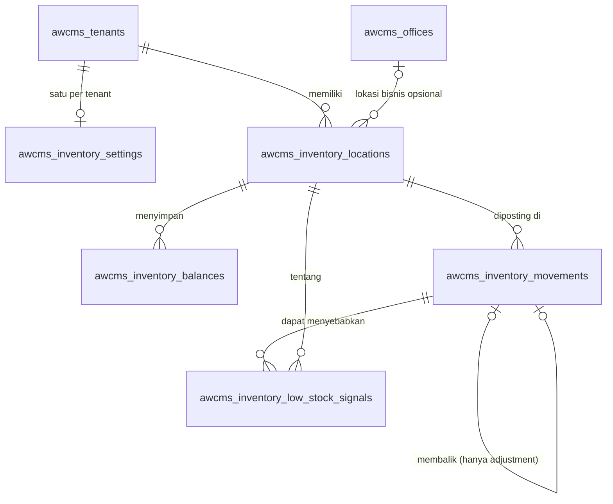

🇮🇩 Bahasa Indonesia · 🇬🇧 [English (source)](inventory-ledger.md)

<!-- i18n-source-hash: sha256:0962a68ec7adb8d4e6974f01e9d4110efce803146b23aea9db6ca6f70e17bd8e -->

# Inventory — buku besar stok multi-lokasi (paket dokumen modul)

> **Status:** diterima lewat [ADR-0126](../adr/0126-generic-multi-location-stock-ledger-module-admission.id.md)
> (Issue #887). Ini adalah PRD-lite, ERD, kamus data, matriks izin/RLS, kontrak
> adapter konsumen, jalur migrasi konsumen, dan rencana rollback modul dalam satu
> tempat. Keputusan dan alternatif yang ditolak ada di ADR; peta kodenya
> [`src/modules/inventory/README.md`](../../src/modules/inventory/README.id.md);
> kontrak HTTP-nya
> [`openapi/modules/inventory.openapi.yaml`](../../openapi/modules/inventory.openapi.yaml)
> dan kontrak event-nya dua channel `awcms.inventory.*` di
> [`asyncapi/awcms-domain-events.asyncapi.yaml`](../../asyncapi/awcms-domain-events.asyncapi.yaml).

## 1. PRD-lite

### Masalah

Modul domain yang menjual barang menyimpan stoknya sendiri sebagai satu counter
pada baris produk atau varian. Counter menyatakan berapa yang ada sekarang; ia
tidak bisa menyatakan di mana, mengapa, siapa yang mengubah, atau apakah masih
jumlah dari apa yang terjadi, dan dua penjualan serentak atas unit terakhir
adalah race baca-ubah-tulis pada satu sel.

### Tujuan

Satu **buku besar stok multi-lokasi** yang generik dan dapat diaudit, yang dapat
dipakai modul domain mana pun sebagai otoritas inventorinya — lewat kontrak
adapter yang terdokumentasi — alih-alih menulis counter.

### Pengguna

| Siapa                            | Kebutuhan                                                                                          |
| -------------------------------- | -------------------------------------------------------------------------------------------------- |
| Modul konsumen (POS, storefront) | Mengurangi/menambah stok secara idempoten, dalam transaksinya sendiri, dan membaca "ada stok?"     |
| Administrator gudang / toko      | Lokasi, transfer, koreksi hitung dengan alasan, ambang stok rendah                                 |
| Auditor                          | Riwayat immutable, siapa melakukan apa, dan bukti bahwa saldo sama dengan jumlah movement          |
| Operator                         | Rekonsiliasi setelah restore atau insiden, dan perbaikan yang memakai buku besar sebagai kebenaran |

### Kriteria penerimaan (dari issue) dan di mana masing-masing dipenuhi

| Kriteria                                                        | Dipenuhi oleh                                                                                     |
| --------------------------------------------------------------- | ------------------------------------------------------------------------------------------------- |
| Lokasi stok dicakup ke tenant dan lokasi bisnis                 | `awcms_inventory_locations` (`tenant_id`, `office_id` opsional, FK komposit)                      |
| Movement final immutable                                        | Trigger baris + `REVOKE` (§3.4); dikoreksi hanya dengan movement kompensasi                       |
| Referensi item lewat adapter konsumen                           | `(item_type, item_ref)` buram, tanpa FK; `InventoryLedgerPort` (§6)                               |
| Semantik kuantitas dan satuan ukur terdokumentasi               | §2                                                                                                |
| Identitas sumber idempoten                                      | Unique `(tenant, source_type, source_id, source_line, operation)`; replay mengembalikan yang asli |
| Saldo dapat dibangun ulang dari movement, dengan rekonsiliasi   | `GET …/balances/reconciliation`, `POST …/balances/rebuild`                                        |
| Kebijakan stok negatif per tenant dan lokasi                    | `awcms_inventory_settings` + `awcms_inventory_locations.negative_stock_policy`                    |
| Ambang stok rendah dan proyeksi di `reporting`                  | `low_stock_threshold`, tabel sinyal, proyeksi `inventory.low_stock`                               |
| Transfer selalu pasangan seimbang                               | `postLegs` + constraint trigger tertunda                                                          |
| Dua percobaan serentak pada unit terakhir tidak keduanya menang | Kunci baris + UPDATE terjaga; uji serentak 12 arah                                                |
| Tak ada saldo yang boleh ditegaskan klien                       | Tak ada endpoint yang menerimanya; validator ketat; `400` yang menyebut field                     |

### Bukan tujuan (dicatat, tidak dilupakan)

Reservasi/hold; konversi satuan; costing dan valuasi; posting atomik multi-baris;
archive-lalu-purge dan partisi; layar admin (tindak lanjut — tidak ada entri
`navigation` karena registri mewajibkan halaman nyata).

## 2. Semantik kuantitas dan keputusan satuan ukur

- Kuantitas adalah `numeric(20,6)` — paling banyak 14 digit bulat dan 6 digit
  pecahan — dan **string desimal** di kabel dan di memori. Tak ada float di jalur
  mana pun; aritmetika yang bukan di SQL memakai `BigInt` sejuta-an. Angka JSON
  diterima saat input hanya bila round-trip ke desimal biasa; `1e-7` ditolak.
  Respons membawa string kanonik (`"12.5"`, tidak pernah `"12.500000"`).
- **Request** membawa `quantity` positif dan **tipe movement yang menentukan
  arah**. Hanya penyesuaian yang membawa `quantityDelta` bertanda.
- **Satuan ukur.** Satu `(item_type, item_ref)` di satu lokasi memiliki tepat satu
  satuan stok, dicatat pada saldo saat movement pertamanya mendarat (default
  `unit`). Movement dengan `unit_code` berbeda ditolak (`409 UNIT_MISMATCH`) —
  buku besar tidak menjumlahkan dan tidak mengonversi. Mengonversi "dus isi 12" ke
  "buah" adalah urusan katalog: posting dalam satuan stok, konversikan sebelum
  memanggil.
- Ambang saja membuat baris saldo nol yang **bukan** movement, sehingga tidak
  mengunci satuan; movement nyata pertama yang mengunci.

### Tipe movement

| Tipe              | Tanda | Endpoint                            | Izin                 | Catatan                                                                                              |
| ----------------- | ----- | ----------------------------------- | -------------------- | ---------------------------------------------------------------------------------------------------- |
| `opening`         | +     | `POST /openings`                    | `movements.adjust`   | Sekali per (lokasi, item), hanya sebagai movement pertama, dan TIDAK dapat diposting dengan `create` |
| `receive`         | +     | `POST /movements`                   | `movements.create`   | Stok diterima dari pemasok                                                                           |
| `sale`            | −     | `POST /movements`                   | `movements.create`   | Tunduk pada kebijakan stok negatif                                                                   |
| `sale_return`     | +     | `POST /movements`                   | `movements.create`   | Lawan alami `sale`                                                                                   |
| `supplier_return` | −     | `POST /movements`                   | `movements.create`   | Lawan alami `receive`                                                                                |
| `transfer_out`    | −     | `POST /transfers`                   | `movements.transfer` | Selalu berpasangan dengan `transfer_in` ber-`transfer_id` sama                                       |
| `transfer_in`     | +     | `POST /transfers`                   | `movements.transfer` | Tidak pernah ditolak karena alasan stok                                                              |
| `adjustment`      | ±     | `POST /adjustments` (+ `/reversal`) | `movements.adjust`   | Butuh `reasonCode`; satu-satunya tipe yang dapat dibalik                                             |

`reservation`/`hold` ("nanti" di issue) **tidak** ada di versi ini dan, bila
ditambahkan, akan menjadi tabel terpisah, bukan status pada movement.

### Kebijakan stok negatif

Diselesaikan sebagai **override lokasi → default tenant → `forbid`**. `forbid`
menolak movement yang akan membawa saldo di bawah nol (`409 INSUFFICIENT_STOCK`,
tak ada yang ditulis); ia tidak pernah menghalangi movement yang hanya
memperbaiki saldo (penerimaan ke saldo yang sudah negatif). `allow`
membolehkannya negatif. Rekonsiliasi melaporkan `negativeUnderForbid` terpisah
dari drift.

## 3. ERD dan kamus data



Setiap referensi adalah foreign key komposit `(tenant_id, id)`. **Tidak ada**
foreign key dari tabel mana pun ke katalog, dan tidak ada dari saldo ke movement
(`last_movement_id` hanyalah penunjuk: kode posting menulis keduanya dalam satu
transaksi, dan FK akan melingkar).

### 3.1 `awcms_inventory_settings` — satu baris per tenant

| Kolom                           | Tipe        | Arti                                                |
| ------------------------------- | ----------- | --------------------------------------------------- |
| `tenant_id` (PK)                | uuid        | Tenant                                              |
| `default_negative_stock_policy` | text        | `forbid` (default) atau `allow`                     |
| `created_at`/`updated_at`       | timestamptz |                                                     |
| `updated_by`                    | uuid        | Tenant user yang terakhir mengubahnya (FK komposit) |

### 3.2 `awcms_inventory_locations`

| Kolom                   | Tipe      | Arti                                                                         |
| ----------------------- | --------- | ---------------------------------------------------------------------------- |
| `id` (PK)               | uuid      |                                                                              |
| `tenant_id`             | uuid      | Kunci RLS; `UNIQUE (tenant_id, id)` adalah target FK komposit                |
| `code`                  | text      | Slug huruf kecil, unik per tenant                                            |
| `name`                  | text      | 1–200 karakter                                                               |
| `office_id`             | uuid null | Lokasi bisnis opsional (`awcms_offices`, FK komposit)                        |
| `status`                | text      | `active` atau `inactive` — tidak pernah dihapus, karena movement menunjuknya |
| `negative_stock_policy` | text null | Override default tenant; `NULL` mewarisi                                     |
| `created_*`/`updated_*` |           | Timestamp dan stempel tenant-user                                            |

### 3.3 `awcms_inventory_balances` — read model turunan

| Kolom                 | Tipe          | Arti                                                                           |
| --------------------- | ------------- | ------------------------------------------------------------------------------ |
| PK                    |               | `(tenant_id, location_id, item_type, item_ref)`                                |
| `unit_code`           | text          | Satu-satunya satuan item di sini, ditetapkan movement pertamanya               |
| `on_hand`             | numeric(20,6) | **Selalu `SUM(quantity_delta)` movement-nya.** Ditulis hanya oleh kode posting |
| `low_stock_threshold` | numeric null  | `NULL` = tanpa ambang                                                          |
| `is_low`              | boolean       | `GENERATED ALWAYS AS (threshold IS NOT NULL AND on_hand <= threshold) STORED`  |
| `movement_count`      | bigint        | Jumlah movement — saksi kedua untuk rekonsiliasi                               |
| `last_movement_id`    | uuid null     | Penunjuk ke movement terakhir (bukan FK)                                       |

`awcms_app` tidak memegang `DELETE` pada tabel ini: baris adalah target kunci
yang membuat unit terakhir aman.

### 3.4 `awcms_inventory_movements` — buku besar (append-only)

| Kolom                   | Tipe          | Arti                                                                                                |
| ----------------------- | ------------- | --------------------------------------------------------------------------------------------------- |
| `id` (PK)               | uuid          | Dibuat aplikasi agar `balances.last_movement_id` bisa diset dalam statement yang sama               |
| `location_id`           | uuid          | FK komposit                                                                                         |
| `item_type`, `item_ref` | text          | Referensi konsumen **buram**; tanpa FK                                                              |
| `unit_code`             | text          |                                                                                                     |
| `movement_type`         | text          | Satu dari delapan tipe; `CHECK` mengikat masing-masing ke tandanya                                  |
| `quantity_delta`        | numeric(20,6) | Bertanda, tidak nol                                                                                 |
| `balance_after`         | numeric(20,6) | Saldo berjalan yang diambil di bawah kunci baris                                                    |
| `source_type/id/line`   | text          | Identitas sumber idempoten; `line` adalah `''` bukan `NULL` agar unique key dapat melihat duplikat  |
| `operation`             | text          | Diturunkan server dari tipe (`reversal` untuk pembalikan)                                           |
| `transfer_id`           | uuid null     | Dibagi kedua leg transfer                                                                           |
| `reverses_movement_id`  | uuid null     | Adjustment yang dikompensasi (paling banyak satu pembalikan per target, lewat partial unique index) |
| `reason_code`, `note`   | text null     | `note` ≤ 500 karakter dan **tidak boleh memuat data pribadi**                                       |
| `request_fingerprint`   | text          | SHA-256 request kanonik — replay dengan fingerprint sama mengembalikan yang asli                    |
| `occurred_at`           | timestamptz   | Waktu bisnis sebagaimana dinyatakan sumber                                                          |
| `created_at`            | timestamptz   | Saat dicatat (awal transaksi)                                                                       |
| `actor_tenant_user_id`  | uuid null     | Siapa yang memposting (FK komposit)                                                                 |
| `correlation_id`        | text null     | Correlation id request                                                                              |

`balance_after` disimpan untuk rekonsiliasi dan **tidak dikembalikan API HTTP** (pemanggil yang memegang `movements.create` atau `movements.read` tidak otomatis boleh membaca stok); port dan payload event membawanya. Trigger database juga menolak baris yang mengklaim `reverses_movement_id` kecuali ia kebalikan persis dari sebuah adjustment di lokasi, item, dan satuan yang sama.

Immutabilitas: trigger baris `BEFORE UPDATE OR DELETE` melempar `55000`, **dan**
`REVOKE UPDATE, DELETE, TRUNCATE … FROM awcms_app`. Constraint trigger transfer
seimbang adalah `DEFERRABLE INITIALLY DEFERRED`.

### 3.5 `awcms_inventory_low_stock_signals` — log transisi append-only

Satu baris setiap kali saldo melewati garis stok rendahnya: `signal_kind` adalah
`below` atau `recovered`, dengan `on_hand`, `threshold`, dan `movement_id` yang
menyebabkannya (`NULL` untuk perubahan ambang atau rebuild). Ini adalah stream
sumber proyeksi `inventory.low_stock`.

## 4. Matriks izin dan RLS

### 4.1 Endpoint

Semua route adalah `defineTenantRoute`, mengotorisasi lewat
`authorizeInTransaction` (ADR-0063), dan default-deny. **Idem.** = `Idempotency-Key`
wajib.

| Metode dan path                                       | Izin                 | Risiko        | Idem.                 | Audit (severity)                   | Work class           |
| ----------------------------------------------------- | -------------------- | ------------- | --------------------- | ---------------------------------- | -------------------- |
| `GET /inventory/locations`, `/{id}`                   | `locations.read`     |               |                       |                                    | interactive          |
| `POST /inventory/locations`                           | `locations.create`   |               | tidak (409 pada code) | info                               | interactive          |
| `PATCH /inventory/locations/{id}`                     | `locations.update`   |               | tidak                 | info (warning saat status berubah) | interactive          |
| `PUT /inventory/locations/{id}/negative-stock-policy` | `policy.configure`   | dampak tinggi | ya                    | warning                            | interactive          |
| `GET /inventory/policy`                               | `policy.read`        |               |                       |                                    | interactive          |
| `PUT /inventory/policy`                               | `policy.configure`   | dampak tinggi | ya                    | warning                            | interactive          |
| `GET /inventory/movements`                            | `movements.read`     |               |                       |                                    | critical_transaction |
| `GET /inventory/movements/{id}`                       | `movements.read`     |               |                       |                                    | interactive          |
| `POST /inventory/movements`                           | `movements.create`   |               | ya                    | info                               | critical_transaction |
| `POST /inventory/openings`                            | `movements.adjust`   |               | ya                    | warning                            | critical_transaction |
| `POST /inventory/adjustments`                         | `movements.adjust`   | **tinggi**    | ya                    | warning                            | critical_transaction |
| `POST /inventory/adjustments/{id}/reversal`           | `movements.adjust`   | **tinggi**    | ya                    | warning                            | critical_transaction |
| `POST /inventory/transfers`                           | `movements.transfer` | **tinggi**    | ya                    | warning                            | critical_transaction |
| `GET /inventory/balances`                             | `balances.read`      |               |                       |                                    | interactive          |
| `PUT /inventory/balances/threshold`                   | `policy.configure`   |               | ya                    | info                               | interactive          |
| `GET /inventory/balances/reconciliation`              | `balances.reconcile` |               |                       |                                    | reporting            |
| `POST /inventory/balances/rebuild`                    | `balances.rebuild`   | **tinggi**    | ya                    | **critical**                       | reporting            |

`adjust` dan `transfer` adalah anggota `AccessAction` baru yang diklasifikasikan
BERISIKO TINGGI (`identity-access/domain/access-control.ts`), yang membuat
pemeriksaan SoD saat-aksi tersedia begitu tenant menyusun aturan. Replay tidak
mengaudit apa pun. `sql/170` men-seed katalog dan **tidak memberi apa pun** ke
role mana pun; tenant yang sudah ada memakai
`bun run identity-access:permissions:backfill`.

### 4.2 Tabel

| Tabel                               | `tenant_id` | RLS `ENABLE`+`FORCE` | `WITH CHECK` | Privilege `awcms_app`                             | FK komposit               |
| ----------------------------------- | ----------- | -------------------- | ------------ | ------------------------------------------------- | ------------------------- |
| `awcms_inventory_settings`          | ya (PK)     | ya                   | ya           | SELECT, INSERT, UPDATE, DELETE                    | `updated_by`              |
| `awcms_inventory_locations`         | ya          | ya                   | ya           | SELECT, INSERT, UPDATE, DELETE                    | office, aktor             |
| `awcms_inventory_balances`          | ya          | ya                   | ya           | SELECT, INSERT, UPDATE (**tanpa DELETE**)         | location                  |
| `awcms_inventory_movements`         | ya          | ya                   | ya           | SELECT, INSERT (**tanpa UPDATE/DELETE/TRUNCATE**) | location, reverses, aktor |
| `awcms_inventory_low_stock_signals` | ya          | ya                   | ya           | SELECT, INSERT (**tanpa UPDATE/DELETE/TRUNCATE**) | location, movement        |

`awcms_worker` memegang tepat satu grant di sini, `SELECT` pada `awcms_inventory_low_stock_signals`: worker inkremental engine reporting membaca sumber proyeksi sebagai role itu. Tak ada job yang menulis modul ini.

## 5. Event

| Event                             | Kapan                                                                             | Urutan                  |
| --------------------------------- | --------------------------------------------------------------------------------- | ----------------------- |
| `awcms.inventory.movement.posted` | Sekali per movement yang diposting (dua untuk transfer), transaksi yang sama      | Per saldo (`order_key`) |
| `awcms.inventory.stock.low`       | Sekali per penyeberangan **ke bawah** ambang, oleh movement atau perubahan ambang | Per saldo               |

Keduanya lewat outbox domain-event dalam transaksi yang sama dengan perubahan;
posting yang ditolak atau di-replay tidak menerbitkan apa-apa. Payload berupa
referensi buram dan string desimal — tidak pernah note, tidak pernah apa pun yang
mengidentifikasi seseorang.

**Pelaporan.** Proyeksi `inventory.low_stock` menghitung tabel sinyal menurut
jenis ke dua counter monotonik, `below_signals` dan `recovered_signals`; selisihnya
adalah jumlah saldo yang sedang rendah. (Satu gauge dengan `+1`/`-1` ditolak
validasi stream engine sendiri dan, lintas dua stream, tidak aman karena engine
menjepit decrement di nol.) Detail otoritatifnya adalah
`GET /inventory/balances?lowStockOnly=true`.

## 6. Kontrak adapter konsumen

Konsumen bergantung pada **`InventoryLedgerPort`**
([`src/modules/_shared/ports/inventory-ledger-port.ts`](../../src/modules/_shared/ports/inventory-ledger-port.ts)),
tidak pernah pada internal `src/modules/inventory/` (ADR-0011). Implementasi
in-process-nya adalah `inventoryLedgerPortAdapter`; konsumen di luar proses
(layanan terpisah, BFF `awcms-astro`) memakai API HTTP dengan semantik yang sama.

### 6.1 Yang dimiliki konsumen

1. **Katalog.** Buku besar diberi `(itemType, itemRef)` buram dan tidak pernah
   mencarinya. Pilih `itemType` ber-namespace (`commerce.variant`) dan `itemRef`
   yang stabil (id varian, SKU); alfabet `A-Za-z0-9_.:-`, paling banyak 200
   karakter. Tidak pernah nama orang atau pengenalnya.
2. **Satuan stok** tiap item — berikan `unitCode` yang sama setiap kali.
3. **Membersihkan** `itemRef` yang produknya sudah dihapus: buku besar tidak bisa
   tahu.
4. **Tanpa counter kedua yang bisa ditulis.** Counter yang dikurangi langsung
   _dan_ diposting di sini adalah dua sumber kebenaran.
5. **Identitas `source` pada setiap panggilan** — dokumen bisnis di balik
   movement: `{ type: "pos_order", id: "<id pesanan>", line: "<id baris>" }`.
   Identitas yang sama diposting dua kali mengembalikan yang **asli**, sehingga
   panggilan yang timeout boleh dicoba ulang tanpa pengurangan ganda. Satu baris
   pesanan = satu identitas; retur parsial butuh identitasnya sendiri
   (`type: "pos_return", id: "<id retur>"`).

6. **Memverifikasi sumber.** Buku besar **mempercayai** identitas `source` yang
   diberikan: ia dapat membuktikan identitas itu tidak diposting dua kali, tidak
   pernah bahwa pesanan, penerimaan, atau retur itu ada, milik tenant ini, atau
   cocok dengan kuantitasnya. `movements.create` diatestasi pemanggil justru
   karena itu. Memeriksa dokumen adalah kewajiban konsumen dan tidak diulang di sini.
7. **Otorisasi dan audit sebelum memanggil port.** Adapter tidak melakukan
   pemeriksaan akses dan tidak menulis baris audit. Composition root konsumen
   harus mengotorisasi aktor terhadap izinnya sendiri, mengaudit aksi bisnis, dan
   meneruskan `correlationId` request pada request agar baris buku besar dan baris
   audit konsumen dapat digabungkan.
8. **`occurredAt` dibatasi.** Tidak di masa depan melebihi beberapa menit, dan
   tidak lebih tua dari `INVENTORY_BACKDATE_WINDOW_DAYS` (default 7) kecuali
   pemanggil juga memegang `movements.adjust`. POS offline yang sinkron lebih jarang
   dari seminggu harus menaikkan jendela atau sinkron dengan kredensial yang
   memegang `adjust`.

### 6.2 Yang diberikan port

```ts
postSale(tx, tenantId, actorTenantUserId, request); // kurangi
postSaleReturn(tx, tenantId, actorTenantUserId, request); // kembalikan
postReceipt(tx, tenantId, actorTenantUserId, request); // stok masuk
getOnHand(tx, tenantId, locationId, item); // baca advisory, "0" bila belum pernah bergerak
```

`tx` adalah transaksi tenant milik **pemanggil**, sehingga "kurangi stok" dan
"catat baris pesanan" commit bersama. Penolakan bisnis kembali sebagai **nilai**
(`insufficient_stock`, `unit_mismatch`, `location_not_found`/`inactive`,
`source_conflict`), bukan error yang dilempar. Dua konsekuensi yang harus
ditangani konsumen:

- Handler yang **mengembalikan** `Response` 4xx setelah penolakan tetap
  **meng-commit** transaksinya. Posting yang ditolak tidak menulis apa pun,
  sehingga buku besar aman — tetapi konsumen yang sudah menulis baris miliknya
  harus **melempar** untuk membatalkannya.
- `getOnHand` bersifat advisory: stok bisa berubah sebelum posting. Posting —
  bukan pembacaan — yang menegakkan kebijakan.

### 6.3 Penjualan multi-baris

Satu penjualan dengan N baris adalah N panggilan hari ini. Masing-masing atomik
dan idempoten, sehingga bila baris 3 ditolak konsumen membatalkan transaksi
pesanannya sendiri (melempar) dan baris buku besar yang sudah diposting untuk
baris 1–2 dikompensasi dengan `postSaleReturn` di bawah identitasnya masing-masing
— atau, lebih baik, konsumen memposting semua baris di dalam transaksi tenant
yang **sama** dan melempar pada penolakan pertama, yang membatalkan setiap tulisan
buku besar bersamanya. Posting atomik multi-baris sebagai satu panggilan adalah
tindak lanjut yang dicatat.

## 7. Jalur migrasi konsumen: expand → backfill → reconcile → contract

Untuk konsumen yang beralih dari field stoknya sendiri (`product.stock_qty` atau
serupa). Setiap langkah dapat di-deploy sendiri dan dapat dibalik sampai yang
terakhir.

1. **Expand.** Buat lokasi stok (satu per tempat yang sudah dibedakan konsumen,
   atau satu default). Mulai **dual-write**: setiap tempat konsumen mengurangi
   counter-nya juga memanggil port. Counter tetap sumber baca konsumen. Tak ada
   yang dilakukan buku besar menyentuh counter.
2. **Backfill.** Untuk setiap item, posting satu movement `opening` per lokasi
   sebesar nilai counter pada satu instan cut-over, dengan identitas sumber
   seperti `{ type: "migration_opening", id: "<konsumen>-2026-10", line: "<itemRef>" }`.
   Identitas membuat backfill **dapat dijalankan ulang**: eksekusi kedua
   me-replay, bukan menggandakan. Lakukan saat tulis dihentikan sementara atau,
   lebih baik, hitung opening dari `counter − movement yang diposting sejak
cut-over`. `opening` ditolak (`OPENING_NOT_FIRST`) untuk item yang sudah
   bergerak, yang menjadi penahan terhadap backfill dua kali.
3. **Reconcile.** Bandingkan, per item, counter konsumen dengan
   `GET /inventory/balances` (atau `getOnHand`). Jalankan terjadwal selama
   keduanya menulis. Setiap selisih adalah jalur kode yang hanya memperbarui satu
   sisi — perbaiki jalurnya, bukan angkanya. Jalankan juga
   `GET /inventory/balances/reconciliation` untuk membuktikan buku besar sepakat
   dengan dirinya. **Gerbang untuk lanjut:** nol selisih sepanjang satu siklus
   bisnis penuh (minimal satu stock-taking dan satu alur retur).
4. **Alihkan pembacaan.** Jadikan buku besar sumber baca untuk "ada stok?" dan
   ketersediaan. Tetap dual-write satu siklus lagi agar bisa beralih balik.
5. **Contract.** Berhenti menulis counter; hapus field pada rilis berikutnya
   (migrasi maju-saja). Sejak ini buku besar menjadi satu-satunya otoritas, dan
   koreksi adalah penyesuaian dengan alasan — tidak pernah suntingan field.

**Rollback pada langkah mana pun sebelum 5:** arahkan pembacaan kembali ke
counter (tidak pernah disentuh) dan berhenti memanggil port. Tabel buku besar
tetap ada, inert.

## 8. Rollback dan operasi

- **Migrasi maju-saja**, seperti setiap migrasi di repo ini. `sql/169` dan
  `sql/170` menambah objek dan tidak mengubah tabel yang ada, sehingga
  me-rollback _deployment_ (kode lama, skema baru) aman: tak ada yang lebih lama
  membacanya.
- **Backup/restore:** movement adalah kebenaran, jadi setelah restore apa pun
  jalankan `GET /inventory/balances/reconciliation`. Restore yang mengembalikan
  saldo dan movement dari titik waktu berbeda muncul sebagai drift, dan
  `POST /inventory/balances/rebuild` memperbaikinya dari buku besar.
- **Membuang data modul** (bukan sekadar berhenti memakai) adalah keputusan
  kelas-restore — buku besar sengaja tidak dapat dihapus oleh role runtime — dan
  butuh sesi berprivilege serta ADR baru; tidak ada migrasi `down`.
- **Menonaktifkan modul** per tenant (`awcms_tenant_modules`) menolak setiap route
  untuk tenant itu; tak ada data yang disentuh.
- **Kapasitas.** Buku besar tumbuh dengan setiap penjualan dan kandidat partisi
  rentang bulanan; tidak ada yang mem-purge-nya (ADR-0126 §7). Rekonsiliasi
  mengagregasi lewat `awcms_inventory_movements_item_idx` (yang meng-INCLUDE
  `quantity_delta` sehingga dapat berjalan index-only) dan dibatasi 500 kunci per
  panggilan.
- **Bukti beban/rencana** (`tests/integration/inventory-ledger.integration.test.ts`,
  24.000 movement dan 4.000 saldo): UPDATE saldo terjaga adalah index scan pada
  primary key, riwayat per item dan daftar terbaru-dulu terbaca dalam urutan
  indeks tanpa `Sort`, dan probe idempotensi adalah index scan pada unique key.
  Uji beban 480 posting oleh 8 worker serentak atas 12 item selesai dalam sekitar
  0,2 dtk dengan persis stok yang tersedia terjual dan buku besar terekonsiliasi.

## 9. Tindak lanjut

Layar admin sudah hadir di Issue #894 (`/admin/inventory`: lokasi, saldo +
daftar stok rendah, riwayat movement, penyesuaian dengan pembalikan lewat panel
alasan, transfer, kebijakan dan ambang, rekonsiliasi baca-saja). Issue #901 menambahkan aksi
**Bangun ulang saldo** yang berkonfirmasi, idempoten, dan diaudit di bawah
`inventory.balances.rebuild` (tanpa kuantitas, hanya lokasi opsional) serta
kontrol ganti nama / tautan kantor per lokasi di atas
`PATCH /inventory/locations/{id}` yang sudah ada (`inventory.locations.update`). Reservasi/hold; posting atomik multi-baris; konversi satuan; costing dan
valuasi; partisi dan archive-lalu-purge; modul procurement/receiving dan bundle
sadar-komponen yang bergantung pada modul ini.
