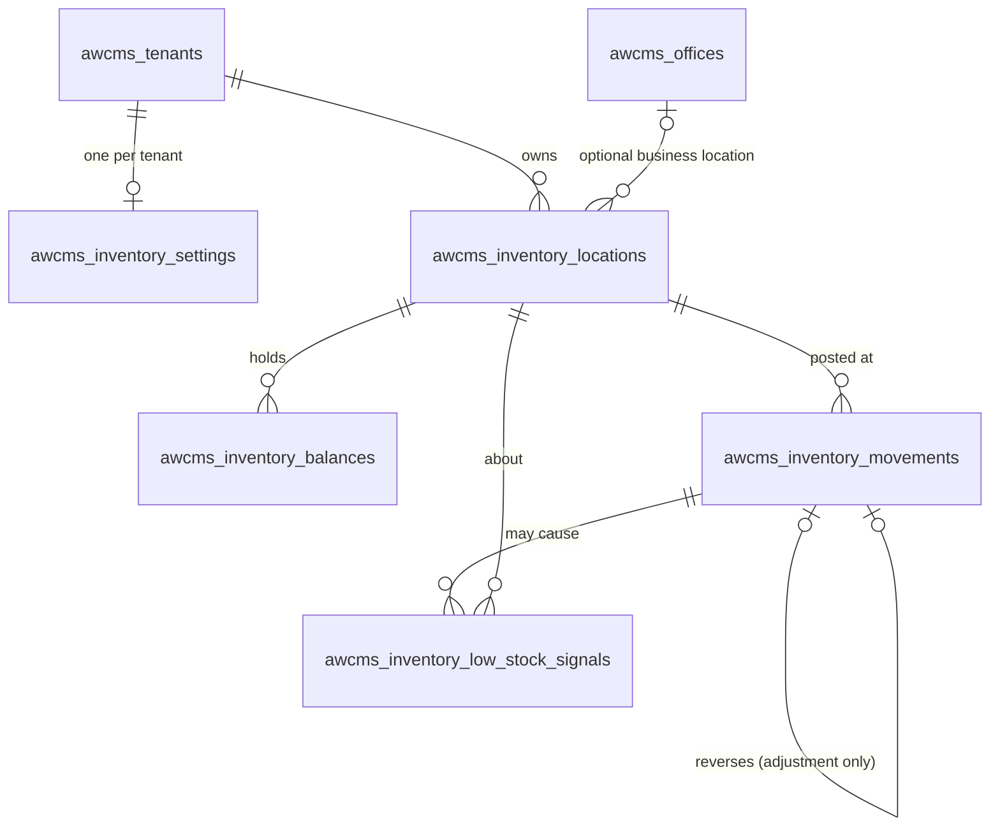

🇬🇧 English (source) · 🇮🇩 [Bahasa Indonesia](inventory-ledger.id.md)

# Inventory — the multi-location stock ledger (module doc pack)

> **Status:** admitted by [ADR-0126](../adr/0126-generic-multi-location-stock-ledger-module-admission.md)
> (Issue #887). This is the module's PRD-lite, ERD, data dictionary,
> permissions/RLS matrix, consumer adapter contract, consumer migration path and
> rollback plan in one place. The decisions and their rejected alternatives are in
> the ADR; the code map is
> [`src/modules/inventory/README.md`](../../src/modules/inventory/README.md); the
> HTTP contract is
> [`openapi/modules/inventory.openapi.yaml`](../../openapi/modules/inventory.openapi.yaml)
> and the event contract is the two `awcms.inventory.*` channels of
> [`asyncapi/awcms-domain-events.asyncapi.yaml`](../../asyncapi/awcms-domain-events.asyncapi.yaml).

## 1. PRD-lite

### Problem

A domain module that sells goods keeps its own stock as one counter on a product
or variant row. A counter says how many there are now; it cannot say where, why,
who changed it, or whether it is still the sum of what happened, and two
concurrent sales of the last unit are a read-modify-write race on one cell.

### Goal

One generic, auditable **multi-location stock ledger** that any domain module can
use as its inventory authority — through a documented adapter contract — instead
of writing a counter.

### Users

| Who                                 | Needs                                                                                     |
| ----------------------------------- | ----------------------------------------------------------------------------------------- |
| A consumer module (POS, storefront) | Decrement/increment stock idempotently, in its own transaction, and read an "in stock?"   |
| A warehouse / store administrator   | Locations, transfers, count corrections with a reason, low-stock thresholds               |
| An auditor                          | An immutable history, who did what, and a proof that balances equal the sum of movements  |
| An operator                         | Reconciliation after a restore or an incident, and a repair that uses the ledger as truth |

### Acceptance criteria (from the issue) and where each is met

| Criterion                                                 | Met by                                                                                         |
| --------------------------------------------------------- | ---------------------------------------------------------------------------------------------- |
| Stock locations scoped to tenant and business location    | `awcms_inventory_locations` (`tenant_id`, optional `office_id` composite FK)                   |
| Immutable finalised movements                             | Row trigger + `REVOKE` (§3.4); corrected by compensating movements only                        |
| Item references through a consumer adapter                | Opaque `(item_type, item_ref)`, no FK; `InventoryLedgerPort` (§6)                              |
| Documented quantity semantics and unit of measure         | §2                                                                                             |
| Idempotent source identity                                | Unique `(tenant, source_type, source_id, source_line, operation)`; replay returns the original |
| A balance rebuildable from movements, with reconciliation | `GET …/balances/reconciliation`, `POST …/balances/rebuild`                                     |
| Negative-stock policy per tenant and location             | `awcms_inventory_settings` + `awcms_inventory_locations.negative_stock_policy`                 |
| Low-stock threshold and a projection on `reporting`       | `low_stock_threshold`, signals table, `inventory.low_stock` projection                         |
| A transfer is always a balanced pair                      | `postLegs` + a deferred constraint trigger                                                     |
| Two concurrent attempts on the last unit cannot both win  | Row lock + guarded UPDATE; 12-way concurrent test                                              |
| No balance a client may assert                            | No endpoint accepts one; strict validators; `400` naming the field                             |

### Non-goals (recorded, not forgotten)

Reservations/holds; unit conversion; costing and valuation; multi-line atomic
posting; archive-then-purge and partitioning; admin screens (a follow-up — no
`navigation` entry exists because the registry requires a real page).

## 2. Quantity semantics and the unit-of-measure decision

- A quantity is `numeric(20,6)` — at most 14 integer and 6 fractional digits —
  and a **decimal string** on the wire and in memory. No float exists anywhere on
  the path; arithmetic that is not in SQL uses `BigInt` millionths. A JSON number
  is accepted on input only when it round-trips to a plain decimal; `1e-7` is
  refused. Responses carry the canonical string (`"12.5"`, never `"12.500000"`).
- The **request** carries a positive `quantity` and the **movement type decides
  direction**. Only an adjustment carries a signed `quantityDelta`.
- **Unit of measure.** One `(item_type, item_ref)` at a location has exactly one
  stock unit, recorded on the balance when its first movement lands (default
  `unit`). A movement with a different `unit_code` is refused
  (`409 UNIT_MISMATCH`) — the ledger neither sums nor converts. Converting "box of
  12" to "each" is a catalogue concern: post in the stock unit, convert before
  calling.
- A threshold alone creates a zero balance row that is **not** a movement, so it
  does not fix the unit; the first real movement does.

### Movement types

| Type              | Sign | Endpoint                            | Permission           | Notes                                                                                 |
| ----------------- | ---- | ----------------------------------- | -------------------- | ------------------------------------------------------------------------------------- |
| `opening`         | +    | `POST /openings`                    | `movements.adjust`   | Once per (location, item), only as the first movement, and NOT postable with `create` |
| `receive`         | +    | `POST /movements`                   | `movements.create`   | Stock received from a supplier                                                        |
| `sale`            | −    | `POST /movements`                   | `movements.create`   | Subject to the negative-stock policy                                                  |
| `sale_return`     | +    | `POST /movements`                   | `movements.create`   | Natural counterpart of `sale`                                                         |
| `supplier_return` | −    | `POST /movements`                   | `movements.create`   | Natural counterpart of `receive`                                                      |
| `transfer_out`    | −    | `POST /transfers`                   | `movements.transfer` | Always paired with a `transfer_in` of the same `transfer_id`                          |
| `transfer_in`     | +    | `POST /transfers`                   | `movements.transfer` | Never refused for stock reasons                                                       |
| `adjustment`      | ±    | `POST /adjustments` (+ `/reversal`) | `movements.adjust`   | Needs a `reasonCode`; the only type that is reversible                                |

`reservation`/`hold` (the issue's "later") are **not** in this version and, when
added, will be a separate table rather than a status on movements.

### Negative-stock policy

Resolved as **location override → tenant default → `forbid`**. `forbid` refuses a
movement that would take a balance below zero (`409 INSUFFICIENT_STOCK`, nothing
written); it never blocks a movement that only improves a balance (a receipt into
an already-negative balance). `allow` lets it go negative. Reconciliation reports
`negativeUnderForbid` separately from drift.

## 3. ERD and data dictionary



Every reference is a composite `(tenant_id, id)` foreign key. There is **no**
foreign key from any table to a catalogue, and none from balances to movements
(`last_movement_id` is a plain pointer: the posting code writes both in one
transaction, and the FK would be circular).

### 3.1 `awcms_inventory_settings` — one row per tenant

| Column                          | Type        | Meaning                                        |
| ------------------------------- | ----------- | ---------------------------------------------- |
| `tenant_id` (PK)                | uuid        | The tenant                                     |
| `default_negative_stock_policy` | text        | `forbid` (default) or `allow`                  |
| `created_at`/`updated_at`       | timestamptz |                                                |
| `updated_by`                    | uuid        | Tenant user who last changed it (composite FK) |

### 3.2 `awcms_inventory_locations`

| Column                  | Type      | Meaning                                                               |
| ----------------------- | --------- | --------------------------------------------------------------------- |
| `id` (PK)               | uuid      |                                                                       |
| `tenant_id`             | uuid      | RLS key; `UNIQUE (tenant_id, id)` is the composite-FK target          |
| `code`                  | text      | Lower-case slug, unique per tenant                                    |
| `name`                  | text      | 1–200 characters                                                      |
| `office_id`             | uuid null | Optional business location (`awcms_offices`, composite FK)            |
| `status`                | text      | `active` or `inactive` — never deleted, because movements point at it |
| `negative_stock_policy` | text null | Override of the tenant default; `NULL` inherits                       |
| `created_*`/`updated_*` |           | Timestamps and tenant-user stamps                                     |

### 3.3 `awcms_inventory_balances` — derived read model

| Column                | Type          | Meaning                                                                             |
| --------------------- | ------------- | ----------------------------------------------------------------------------------- |
| PK                    |               | `(tenant_id, location_id, item_type, item_ref)`                                     |
| `unit_code`           | text          | The item's single unit here, fixed by its first movement                            |
| `on_hand`             | numeric(20,6) | **Always `SUM(quantity_delta)` of its movements.** Written only by the posting code |
| `low_stock_threshold` | numeric null  | `NULL` = none                                                                       |
| `is_low`              | boolean       | `GENERATED ALWAYS AS (threshold IS NOT NULL AND on_hand <= threshold) STORED`       |
| `movement_count`      | bigint        | Number of movements — a second witness for reconciliation                           |
| `last_movement_id`    | uuid null     | Pointer to the latest movement (not an FK)                                          |

`awcms_app` holds no `DELETE` on this table: the row is the lock target that makes
the last unit safe.

### 3.4 `awcms_inventory_movements` — the ledger (append-only)

| Column                  | Type          | Meaning                                                                                     |
| ----------------------- | ------------- | ------------------------------------------------------------------------------------------- |
| `id` (PK)               | uuid          | App-generated so `balances.last_movement_id` can be set in the same statement               |
| `location_id`           | uuid          | Composite FK                                                                                |
| `item_type`, `item_ref` | text          | **Opaque** consumer reference; no FK                                                        |
| `unit_code`             | text          |                                                                                             |
| `movement_type`         | text          | One of the eight types; a `CHECK` ties each to its sign                                     |
| `quantity_delta`        | numeric(20,6) | Signed, non-zero                                                                            |
| `balance_after`         | numeric(20,6) | Running balance taken under the row lock                                                    |
| `source_type/id/line`   | text          | Idempotent source identity; `line` is `''` not `NULL` so the unique key can see a duplicate |
| `operation`             | text          | Server-derived from the type (`reversal` for a reversal)                                    |
| `transfer_id`           | uuid null     | Shared by both legs of a transfer                                                           |
| `reverses_movement_id`  | uuid null     | The adjustment this compensates (at most one reversal per target, by partial unique index)  |
| `reason_code`, `note`   | text null     | `note` ≤ 500 characters and **must not carry personal data**                                |
| `request_fingerprint`   | text          | SHA-256 of the canonical request — replay with the same fingerprint returns the original    |
| `occurred_at`           | timestamptz   | Business time as the source states it                                                       |
| `created_at`            | timestamptz   | When recorded (transaction start)                                                           |
| `actor_tenant_user_id`  | uuid null     | Who posted it (composite FK)                                                                |
| `correlation_id`        | text null     | The request's correlation id                                                                |

`balance_after` is stored for reconciliation and is **not returned by the HTTP API** (a caller holding `movements.create` or `movements.read` is not thereby allowed to read stock); the port and the event payload carry it. A database trigger also refuses a row that claims `reverses_movement_id` unless it is the exact opposite of an adjustment at the same location, item and unit.

Immutability: a `BEFORE UPDATE OR DELETE` row trigger raises `55000`, **and**
`REVOKE UPDATE, DELETE, TRUNCATE … FROM awcms_app`. The balanced-transfer
constraint trigger is `DEFERRABLE INITIALLY DEFERRED`.

### 3.5 `awcms_inventory_low_stock_signals` — append-only transition log

One row each time a balance crosses its low-stock line: `signal_kind` is `below`
or `recovered`, with `on_hand`, `threshold`, and the `movement_id` that caused it
(`NULL` for a threshold change or a rebuild). It is the source stream of the
`inventory.low_stock` projection.

## 4. Permissions and RLS matrix

### 4.1 Endpoints

All routes are `defineTenantRoute`, authorize through `authorizeInTransaction`
(ADR-0063), and are default-deny. **Idem.** = `Idempotency-Key` required.

| Method and path                                       | Permission           | Risk        | Idem.            | Audit (severity)                  | Work class           |
| ----------------------------------------------------- | -------------------- | ----------- | ---------------- | --------------------------------- | -------------------- |
| `GET /inventory/locations`, `/{id}`                   | `locations.read`     |             |                  |                                   | interactive          |
| `POST /inventory/locations`                           | `locations.create`   |             | no (409 on code) | info                              | interactive          |
| `PATCH /inventory/locations/{id}`                     | `locations.update`   |             | no               | info (warning on a status change) | interactive          |
| `PUT /inventory/locations/{id}/negative-stock-policy` | `policy.configure`   | high-impact | yes              | warning                           | interactive          |
| `GET /inventory/policy`                               | `policy.read`        |             |                  |                                   | interactive          |
| `PUT /inventory/policy`                               | `policy.configure`   | high-impact | yes              | warning                           | interactive          |
| `GET /inventory/movements`                            | `movements.read`     |             |                  |                                   | critical_transaction |
| `GET /inventory/movements/{id}`                       | `movements.read`     |             |                  |                                   | interactive          |
| `POST /inventory/movements`                           | `movements.create`   |             | yes              | info                              | critical_transaction |
| `POST /inventory/openings`                            | `movements.adjust`   |             | yes              | warning                           | critical_transaction |
| `POST /inventory/adjustments`                         | `movements.adjust`   | **high**    | yes              | warning                           | critical_transaction |
| `POST /inventory/adjustments/{id}/reversal`           | `movements.adjust`   | **high**    | yes              | warning                           | critical_transaction |
| `POST /inventory/transfers`                           | `movements.transfer` | **high**    | yes              | warning                           | critical_transaction |
| `GET /inventory/balances`                             | `balances.read`      |             |                  |                                   | interactive          |
| `PUT /inventory/balances/threshold`                   | `policy.configure`   |             | yes              | info                              | interactive          |
| `GET /inventory/balances/reconciliation`              | `balances.reconcile` |             |                  |                                   | reporting            |
| `POST /inventory/balances/rebuild`                    | `balances.rebuild`   | **high**    | yes              | **critical**                      | reporting            |

`adjust` and `transfer` are new `AccessAction` members classified HIGH-RISK
(`identity-access/domain/access-control.ts`), which makes the action-time SoD
check available the moment a tenant authors a rule. A replay audits nothing.
`sql/170` seeds the catalog and grants **nothing** to any role; existing tenants
use `bun run identity-access:permissions:backfill`.

### 4.2 Tables

| Table                               | `tenant_id` | RLS `ENABLE`+`FORCE` | `WITH CHECK` | `awcms_app` privileges                         | Composite FKs             |
| ----------------------------------- | ----------- | -------------------- | ------------ | ---------------------------------------------- | ------------------------- |
| `awcms_inventory_settings`          | yes (PK)    | yes                  | yes          | SELECT, INSERT, UPDATE, DELETE                 | `updated_by`              |
| `awcms_inventory_locations`         | yes         | yes                  | yes          | SELECT, INSERT, UPDATE, DELETE                 | office, actors            |
| `awcms_inventory_balances`          | yes         | yes                  | yes          | SELECT, INSERT, UPDATE (**no DELETE**)         | location                  |
| `awcms_inventory_movements`         | yes         | yes                  | yes          | SELECT, INSERT (**no UPDATE/DELETE/TRUNCATE**) | location, reverses, actor |
| `awcms_inventory_low_stock_signals` | yes         | yes                  | yes          | SELECT, INSERT (**no UPDATE/DELETE/TRUNCATE**) | location, movement        |

`awcms_worker` holds exactly one grant here, `SELECT` on `awcms_inventory_low_stock_signals`: the reporting engine's incremental worker reads the projection source as that role. No job writes this module.

## 5. Events

| Event                             | When                                                                          | Ordering                  |
| --------------------------------- | ----------------------------------------------------------------------------- | ------------------------- |
| `awcms.inventory.movement.posted` | Once per posted movement (two for a transfer), same transaction               | Per balance (`order_key`) |
| `awcms.inventory.stock.low`       | Once per **downward** crossing of the threshold, by a movement or a threshold | Per balance               |

Both go through the domain-event outbox in the same transaction as the change; a
refused or replayed posting publishes nothing. Payloads are opaque references and
decimal strings — never the note, never anything identifying a person.

**Reporting.** The `inventory.low_stock` projection counts the signals table by
kind into two monotonic counters, `below_signals` and `recovered_signals`; their
difference is the number of balances currently low. (One gauge with `+1`/`-1` is
rejected by the engine's own stream validation and, across two streams, is unsafe
because the engine clamps a decrement at zero.) The authoritative detail is
`GET /inventory/balances?lowStockOnly=true`.

## 6. Consumer adapter contract

A consumer depends on **`InventoryLedgerPort`**
([`src/modules/_shared/ports/inventory-ledger-port.ts`](../../src/modules/_shared/ports/inventory-ledger-port.ts)),
never on `src/modules/inventory/`'s internals (ADR-0011). Its in-process
implementation is `inventoryLedgerPortAdapter`; an out-of-process consumer (a
separate service, `awcms-astro`'s BFF) uses the HTTP API with the same semantics.

### 6.1 What the consumer owns

1. **The catalogue.** The ledger is handed an opaque `(itemType, itemRef)` and
   never looks it up. Choose a namespaced `itemType` (`commerce.variant`) and a
   stable `itemRef` (a variant id, a SKU); alphabet `A-Za-z0-9_.:-`, at most 200
   characters. Never a person's name or an identifier of one.
2. **The stock unit** of each item — pass the same `unitCode` every time.
3. **Cleaning up** an `itemRef` whose product was deleted: the ledger cannot know.
4. **No second writable counter.** A counter that is decremented directly _and_
   posted here is two sources of truth.
5. **A `source` identity on every call** — the business document behind the
   movement: `{ type: "pos_order", id: "<order id>", line: "<line id>" }`. The
   same identity posted twice returns the **original**, so a timed-out call may be
   retried without a double decrement. One order line = one identity; a partial
   return needs its own (`type: "pos_return", id: "<return id>"`).

6. **Verifying the source.** The ledger **trusts** the `source` identity it is
   given: it can prove the identity was not posted twice, never that the order,
   receipt or return exists, belongs to this tenant, or matches the quantity.
   `movements.create` is caller-attested for exactly that reason. Checking the
   document is the consumer's duty and is not repeated here.
7. **Authorize and audit before calling the port.** The adapter performs no access
   check and writes no audit row. The consumer's composition root must authorize
   the actor against its own permission, audit the business action, and pass the
   request's `correlationId` on the request so the ledger row and the consumer's
   audit row can be joined.
8. **`occurredAt` is bounded.** Not in the future beyond a few minutes, and not
   older than `INVENTORY_BACKDATE_WINDOW_DAYS` (default 7) unless the caller also
   holds `movements.adjust`. An offline POS that syncs less often than weekly must
   raise the window or sync with a credential that holds `adjust`.

### 6.2 What the port gives

```ts
postSale(tx, tenantId, actorTenantUserId, request); // decrement
postSaleReturn(tx, tenantId, actorTenantUserId, request); // put back
postReceipt(tx, tenantId, actorTenantUserId, request); // stock in
getOnHand(tx, tenantId, locationId, item); // advisory read, "0" if never moved
```

`tx` is the **caller's** tenant transaction, so "decrement stock" and "record the
order line" commit together. A business refusal comes back as a **value**
(`insufficient_stock`, `unit_mismatch`, `location_not_found`/`inactive`,
`source_conflict`), not a thrown error. Two consequences the consumer must handle:

- A handler that **returns** a 4xx `Response` after a refusal still **commits**
  its transaction. A refused post writes nothing, so the ledger is safe — but a
  consumer that already wrote its own rows must **throw** to undo them.
- `getOnHand` is advisory: stock can change before the post. The post — not the
  read — enforces the policy.

### 6.3 Multi-line sales

One sale with N lines is N calls today. Each is atomic and idempotent, so if line
3 is refused the consumer rolls back its own order transaction (throw) and the
ledger rows already posted for lines 1–2 are compensated with `postSaleReturn`
under their own identities — or, better, the consumer posts all lines inside the
**same** tenant transaction and throws on the first refusal, which rolls back
every ledger write with it. Multi-line atomic posting as one call is a recorded
follow-up.

## 7. Consumer migration path: expand → backfill → reconcile → contract

For a consumer moving off its own stock field (`product.stock_qty` or similar).
Each step is independently deployable and reversible until the last.

1. **Expand.** Create stock locations (one per place the consumer already
   distinguishes, or one default). Start **dual-writing**: every place the
   consumer decrements its counter also calls the port. The counter stays the
   consumer's read source. Nothing the ledger does touches the counter.
2. **Backfill.** For every item, post one `opening` movement per location equal
   to the counter's value at a single cut-over instant, with a source identity
   such as `{ type: "migration_opening", id: "<consumer>-2026-10", line: "<itemRef>" }`.
   The identity makes the backfill **re-runnable**: a second run replays instead of
   doubling. Do it while writes are quiesced or, better, compute the opening from
   `counter − movements posted since cut-over`. An `opening` is refused
   (`OPENING_NOT_FIRST`) for an item that has already moved, which is the
   backstop against backfilling twice.
3. **Reconcile.** Compare, per item, the consumer's counter with
   `GET /inventory/balances` (or `getOnHand`). Run it on a schedule while both
   write. Every difference is a code path that updated one side only — fix the
   path, not the number. Also run `GET /inventory/balances/reconciliation` to
   prove the ledger agrees with itself. **Gate to proceed:** zero differences
   across a full business cycle (at least one stock-taking and one return flow).
4. **Switch reads.** Make the ledger the read source for "in stock?" and
   availability. Keep dual-writing for one more cycle so you can switch back.
5. **Contract.** Stop writing the counter; remove the field in a later release
   (forward-only migration). From here the ledger is the single authority, and a
   correction is an adjustment with a reason — never an edit of the field.

**Rollback at any step before 5:** point reads back at the counter (it was never
touched) and stop calling the port. The ledger tables stay, inert.

## 8. Rollback and operations

- **Migrations are forward-only**, like every migration in this repo. `sql/169`
  and `sql/170` add objects and change no existing table, so rolling the
  _deployment_ back (older code, newer schema) is safe: nothing older reads them.
- **Backup/restore:** movements are the truth, so after any restore run
  `GET /inventory/balances/reconciliation`. A restore that brought balances and
  movements back from different points in time shows up as drift, and
  `POST /inventory/balances/rebuild` repairs it from the ledger.
- **Dropping the module's data** (not just stopping use) is a restore-class
  decision — the ledger is deliberately not deletable by the runtime role — and
  needs a privileged session and a new ADR; there is no `down` migration.
- **Disabling the module** per tenant (`awcms_tenant_modules`) refuses every
  route for that tenant; no data is touched.
- **Capacity.** The ledger grows with every sale and is a monthly range-partition
  candidate; nothing purges it (ADR-0126 §7). Reconciliation aggregates over
  `awcms_inventory_movements_item_idx` (which INCLUDEs `quantity_delta` so it can
  run index-only) and is bounded to 500 keys per call.
- **Load/plan evidence** (`tests/integration/inventory-ledger.integration.test.ts`,
  24,000 movements and 4,000 balances): the guarded balance UPDATE is an index
  scan on the primary key, per-item history and the newest-first listing read in
  index order with no `Sort`, and the idempotency probe is an index scan on the
  unique key. A load run of 480 postings by 8 concurrent workers over 12 items
  completed in about 0.2 s with exactly the available stock sold and the ledger
  reconciling.

## 9. Follow-ups

Admin screens landed in Issue #894 (`/admin/inventory`: locations, balances +
low-stock list, movement history, adjustments with reversal through the reason
panel, transfers, policy and thresholds, read-only reconciliation). Issue #901 added a
confirmed, idempotent, audited **Rebuild balances** action under
`inventory.balances.rebuild` (it carries no quantity, only an optional location)
and a rename / office-link control per location over the existing
`PATCH /inventory/locations/{id}` (`inventory.locations.update`). Reservations/holds; multi-line atomic posting; unit conversion; costing and
valuation; partitioning and archive-then-purge; the procurement/receiving module
and component-aware bundles that depend on this one.
