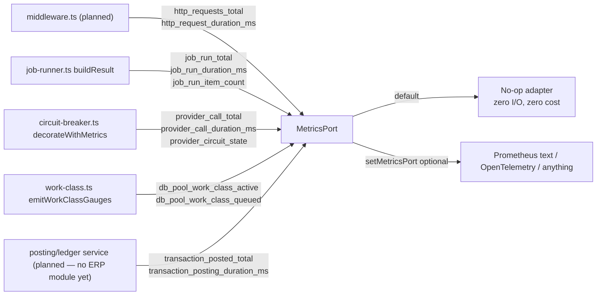

🇬🇧 English (source) · 🇮🇩 [Bahasa Indonesia](observability-metrics.id.md)

# Observability: Metrics, SLOs, Job Health, and Provider Telemetry

> **Document status:** the core implementation is real, part of it is still a target. `src/lib/observability/` ALREADY exists and is in use — `metrics-port.ts`, `in-memory-metrics-port.ts`, and `adapters/prometheus-text-adapter.ts` are all real, and `recordCounter`/`recordGauge`/`recordHistogram` are already wired into `job-runner.ts` (`emitJobRunMetrics`), `work-class.ts` (`emitWorkClassGauges`), `circuit-breaker.ts` (`decorateWithMetrics`), `capacity-config.ts`, as well as into real domain application code (`workflow-approval`'s `workflow-escalation.ts`, `domain-event-runtime`'s `dispatch-domain-events.ts`, and several `src/pages/api/v1/workflows/**` routes). What is **still a target/does not exist yet**: the `http_requests_total`/`http_request_duration_ms` instrumentation in `middleware.ts` (not wired yet), the authorized dependency-health endpoint, the OpenTelemetry adapter, every observability test file referenced in §Testing, and of course the ERP-specific metrics (`transaction_posted_total`, etc.) because no ERP module calls them yet. This document still adapts the metric examples to the business transaction domain (finance, inventory, HR/payroll) as a target for once the ERP module is built.

A companion to [`deployment-profiles.md`](deployment-profiles.md) §Shared worker runner. This document covers the concepts: low-cardinality numeric metrics (counter/histogram/gauge), initial SLI/SLOs, and the authorized dependency-health endpoint.

**Metrics complement, they do not replace, logging or audit.** The structured logger and the audit trail (see `AGENTS.md` "Audit trail with redaction") record discrete, per-event, high-detail facts — e.g. "user X posted journal Y at time Z". Metrics record aggregates — "how many", "how fast", "how saturated" — meant to be scraped/pushed to a time-series backend at a small fixed cost regardless of traffic volume. Neither replaces the other, and metrics are **never** a source of authorization.

## Architecture



- **`src/lib/observability/metrics-port.ts`** (real implementation) — the port contract (`MetricsPort`: `incrementCounter`/`observeHistogram`/`setGauge`), the `METRIC_DEFINITIONS` registry (every metric name, the allowed label keys, the `approxCardinality` estimate, and the `privacyNote`), plus `recordCounter`/`recordHistogram`/`recordGauge` — the ONLY official way application code records a metric. All three functions drop label keys not declared for that metric (defense in depth) and never let an error from a registered adapter leak out.
- **`src/lib/observability/in-memory-metrics-port.ts`** (real implementation) — the test double / real minimal adapter, used by every unit test that asserts "a metric was recorded".
- **`src/lib/observability/adapters/prometheus-text-adapter.ts`** (real implementation) — a dependency-free, Bun-only Prometheus text-exposition adapter. It is not wired in automatically anywhere by default — a derived application adds `setMetricsPort(createPrometheusTextMetricsPort())` itself to use it; the OpenTelemetry adapter (planned, see §Optional Prometheus/OpenTelemetry integration below) follows an identical shape once it is written.
- **The default is always the no-op adapter.** Every offline/LAN deployment that never calls `setMetricsPort` pays zero I/O cost and needs no external collector whatsoever — this is the "offline/LAN operation runs without an external collector" prerequisite, satisfied by construction, not by a runtime check.

## Mandatory instrumentation points — a shared mechanism, not duplication per call site

The mandatory principle: provider/job/pool metrics must flow through the shared mechanism THAT ALREADY EXISTS, not be duplicated at every call site. Three of the five points below are ALREADY really wired; two are still targets:

- **Job run status/backlog (real implementation)** — a single function point (`buildResult` in `job-runner.ts`) that every `runJob` return path (lock acquire failed, skip-on-contention, success/partial, timeout/terminated, error) already passes through. `emitJobRunMetrics` is called once there — every job (audit purge, sync dispatcher, posting batch, payroll run) gets `job_run_total`/`job_run_duration_ms`/`job_run_item_count` for free.
- **Provider outcome/latency/circuit state (real implementation)** — a single function `getProviderCircuitBreaker()` that every provider call site (email, object storage, payment gateway, marketplace, Coretax, logistics, SSO) must go through — no call site calls `createCircuitBreaker` directly. The `decorateWithMetrics` wrapper in between is the single source of these metrics.
- **DB pool saturation (real implementation)** — a single place (`work-class.ts`'s `gates`) where `active`/`queue.length` ever changes (acquire, hand-off on release, decrement on release, timeout eviction). `emitWorkClassGauges(workClass)` is called at each of those points. `capacity-config.ts` also already calls `recordGauge` directly for the capacity metrics (`db_pool_capacity_*`).
- **HTTP request outcome/latency (planned — not wired yet)** — a single function (`middleware.ts`'s `onRequest`) that every request passes through, PLANNED to call `recordHttpRequestMetrics` at every response-producing branch, using Astro's static `routePattern` (e.g. `"/api/v1/finance/journals/[journalId]"` — a literal bracketed placeholder, not a concrete path containing a real id). `middleware.ts` today does not import anything from `src/lib/observability/` — the `recordHttpRequestMetrics` function itself has not been written.
- **ERP transaction posting/domain event (planned — new for this platform)** — a single chokepoint in the application/domain layer for every financial transaction posting, stock adjustment, or payroll run execution, following the same pattern: `transaction_posted_total`/`transaction_posting_duration_ms`, recorded from ONE wrapper/service, not scattered across every handler — waiting on the first finance/inventory/HR-payroll module. The same instrumentation pattern is ALREADY used outside ERP by existing domain code: `workflow-approval`'s `workflow-escalation.ts` (`workflow_escalation_total`), `domain-event-runtime`'s `dispatch-domain-events.ts` (`domain_event_dispatch_total`/`domain_event_delivery_backlog`), and several `src/pages/api/v1/workflows/**` routes (`workflow_recovery_action_total`).

## Cardinality and privacy (mandatory criteria)

Every metric the application emits must be declared in `METRIC_DEFINITIONS` with its complete label set, an `approxCardinality` estimate, and a `privacyNote`. A summary example of what is planned (the generic metric names are kept from the base; the ERP-specific rows are added as an illustration):

| Metric                            | Type      | Labels                                                                | Approx. cardinality                     | Why it is bounded/private                                                                                           |
| --------------------------------- | --------- | --------------------------------------------------------------------- | --------------------------------------- | ------------------------------------------------------------------------------------------------------------------- |
| `http_requests_total`             | counter   | `method`, `routePattern`, `statusCode`                                | low thousands worst case                | `routePattern` is Astro's static route pattern (not a concrete id); `statusCode`/`method` are fixed enums.          |
| `http_request_duration_ms`        | histogram | `method`, `routePattern`                                              | ~1000 bound                             | Same as above.                                                                                                      |
| `db_pool_work_class_active`       | gauge     | `workClass`                                                           | fixed at 5                              | The `WorkClass` enum is fixed.                                                                                      |
| `db_pool_work_class_queued`       | gauge     | `workClass`                                                           | fixed at 5                              | The `WorkClass` enum is fixed.                                                                                      |
| `job_run_total`                   | counter   | `jobName`, `status`                                                   | bounded                                 | `jobName` is a job-name literal hardcoded by the script; `status` is a fixed enum.                                  |
| `job_run_duration_ms`             | histogram | `jobName`                                                             | bounded                                 | Same.                                                                                                               |
| `provider_call_total`             | counter   | `provider`, `outcome`                                                 | bounded                                 | `provider` is a bounded family prefix (see below), not the raw tenant-scoped registry key.                          |
| `provider_circuit_state`          | gauge     | `provider`                                                            | bounded                                 | Same. Encoded `0=closed, 1=half_open, 2=open`.                                                                      |
| `transaction_posted_total`        | counter   | `module` (`finance`/`inventory`/`hr_payroll`), `outcome`              | bounded (module count x fixed outcomes) | `module` is a fixed literal enum, not a transaction/tenant id; never a journal number/amount.                       |
| `transaction_posting_duration_ms` | histogram | `module`                                                              | bounded                                 | Same.                                                                                                               |
| `sync_backlog_size`               | gauge     | `integration` (`payment_gateway`/`marketplace`/`coretax`/`logistics`) | bounded                                 | A fixed external-integration enum — the count of undelivered outbox items per integration, not the payload content. |

**Labels that need a dedicated bounding mechanism**: a provider circuit-breaker registry key can be tenant-scoped (e.g. `sso-oidc-discovery:<tenantId>:<providerKey>`, or for ERP: `payment-gateway:<tenantId>:<providerKey>`). Putting that raw string in a metric label would BE BOTH — a tenant-id leak and unbounded cardinality. The bounding function (`deriveProviderFamilyLabel`, kept from the base) keeps only the literal, code-hardcoded prefix before the first `:` — every provider call site in this repo follows the same "literal-category-prefix, optional dynamic `:`-suffix" convention, so one generic split rule is enough.

**No tenant id, unbounded id-bearing route, email/IP, object key, token, account/NPWP number, transaction amount, or conversation content may appear in any label** — every value must be a member of a fixed enum or a code literal string, never data originating from a request body, a tenant record, or financial/personal data.

## Initial SLI/SLOs and burn-rate guidance

These are INITIAL targets for a derived application/operations team to tune, not a contractual commitment. Every SLI is computable directly from the metrics above; a real alerting backend (Prometheus recording rules/alertmanager, or an OpenTelemetry equivalent) is where the actual burn-rate maths runs — this base does not ship it (avoiding coupling to one particular SaaS).

| SLO                                         | SLI (derived from)                                                       | Initial target                                                                |
| ------------------------------------------- | ------------------------------------------------------------------------ | ----------------------------------------------------------------------------- |
| HTTP availability                           | `1 - (http_requests_total{statusCode=~"5.."} / http_requests_total)`     | 99.9% over rolling 28 days                                                    |
| HTTP latency                                | p95 `http_request_duration_ms` per `routePattern`                        | < 500ms for `interactive`-class routes                                        |
| DB pool headroom                            | `db_pool_work_class_active / max` per `workClass`                        | < 0.8 for 99% of 5-minute windows, `critical_transaction`/`interactive`       |
| Job success rate                            | `job_run_total{status="success"} / job_run_total` per `jobName`          | ≥ 99% over rolling 7 days                                                     |
| Provider circuit availability               | the fraction of time `provider_circuit_state != 2 (open)` per `provider` | ≥ 99.5% over rolling 7 days                                                   |
| **On-time transaction posting (ERP)**       | p95 `transaction_posting_duration_ms` per `module`                       | < 2 seconds for synchronous `finance`/`inventory` posting                     |
| **External integration sync backlog (ERP)** | `sync_backlog_size` per `integration`                                    | < 100 pending items within a 15-minute window for `payment_gateway`/`coretax` |

**Burn-rate guidance** (multi-window, multi-burn-rate — the same shape as the Google SRE workbook approach, adapter-agnostic):

- **Fast burn** (page immediately): the error budget is consumed at >14.4x the sustainable rate over a 5-minute AND a 1-hour window at once.
- **Slow burn** (ticket, not a page): the error budget is consumed at >1x up to >6x the sustainable rate over a 6-hour AND a 3-day window.
- Apply the same two-window pattern to EVERY SLO above, including the new ERP SLOs (e.g. "posting latency slow-burn" catches a gradual regression before the 7-day average crosses the threshold).

## Dashboard/runbook example (no SaaS coupling)

A minimal dashboard needs five panel groups (four generic + one ERP), one per connected source above:

1. **HTTP** — request rate per `statusCode` class, p50/p95/p99 latency per `routePattern`.
2. **Database pool** — the `db_pool_work_class_active`/`max` ratio and `db_pool_work_class_queued` per `workClass`, plus `provider_circuit_state{provider="database"}`.
3. **Jobs** — `job_run_total` per `status` per `jobName` (stacked bar), p95 `job_run_duration_ms` per `jobName`.
4. **Providers** — `provider_circuit_state` per `provider`, `provider_call_total` per `outcome`, p95 `provider_call_duration_ms`.
5. **ERP transactions** — `transaction_posted_total` per `module`+`outcome`, p95 `transaction_posting_duration_ms` per `module`, `sync_backlog_size` per `integration` as a backlog trend.

**Runbook — action steps per signal:**

| Signal appears                                                            | First check                                                                                                        | Likely fix                                                                                                                                      |
| ------------------------------------------------------------------------- | ------------------------------------------------------------------------------------------------------------------ | ----------------------------------------------------------------------------------------------------------------------------------------------- |
| `http_requests_total{statusCode=~"5.."}` spikes                           | Correlate `routePattern` + the time window against the structured log (`correlationId`)                            | Roll back the deploy that caused it, or fix the specific handler.                                                                               |
| `db_pool_work_class_*` saturated for `critical_transaction`/`interactive` | Check `provider_circuit_state{provider="database"}` — is the DB itself degraded, or is it a slow-query regression? | Scale `DATABASE_POOL_MAX`, or find/fix the slow query.                                                                                          |
| `job_run_total{status="failed"}` spikes for one `jobName`                 | Pull that job's structured logs for the sanitised `error`/`retryClassification`                                    | Fix the cause; a `retryable` classification means the next scheduled tick self-heals.                                                           |
| `provider_circuit_state{provider=X}` at `open` (2)                        | Check that provider's health-check endpoint if it has one, and its outage status page                              | Wait for the breaker's half-open trial, or escalate to the provider if the outage is externally confirmed.                                      |
| `sync_backlog_size{integration="coretax"}` keeps rising                   | Check `provider_circuit_state{provider="coretax"}` and the related dispatcher logs                                 | Wait for the breaker to recover, or investigate Coretax credentials/quota; do not raise dispatcher concurrency without checking the root cause. |

## Authorized dependency health endpoint (planned)

`GET /api/v1/logs/observability/dependency-health` — the AUTHORIZED counterpart of `/api/v1/health` (public liveness) and `/api/v1/database/pool/health` (local aggregate without authentication). Requires a valid session and the `logging.observability.read` permission. Response shape:

```json
{
  "data": {
    "generatedAt": "2026-07-14T04:00:00.000Z",
    "localDependencies": [
      {
        "name": "database",
        "status": "healthy",
        "circuitBreakerState": "closed",
        "workClasses": [
          {
            "workClass": "critical_transaction",
            "active": 0,
            "max": 10,
            "queued": 0
          }
        ]
      }
    ],
    "optionalProviders": [
      { "family": "email", "circuitBreakerState": "closed" },
      { "family": "payment-gateway", "circuitBreakerState": "open" }
    ]
  }
}
```

`optionalProviders` never exposes the raw circuit-breaker registry key — only the bounded `family` label (the same bounding function the metrics layer uses). A provider that has never been called simply has no entry. If more than one registered breaker maps to the same family (e.g. two tenants' payment-gateway breakers), the WORST state is reported for that family — one aggregate signal, never a per-tenant breakdown.

## Optional Prometheus/OpenTelemetry integration (not coupled to the core runtime)

```ts
// The derived application's own bootstrap — NOT part of this base's default
// runtime path.
import { setMetricsPort } from "src/lib/observability/metrics-port";
import { createPrometheusTextMetricsPort } from "src/lib/observability/adapters/prometheus-text-adapter";

const prometheus = createPrometheusTextMetricsPort();
setMetricsPort(prometheus);

// Expose it to the Prometheus scraper through a NEW route the derived
// application adds itself — deliberately not shipped here, because the
// scrape-endpoint exposure policy (network-restricted? admin-only? a separate
// port?) is a deployment decision, not something this base decides on the
// derived application's behalf:
// return new Response(prometheus.renderPrometheusText(), {
//   headers: { "content-type": "text/plain; version=0.0.4" }
// });
```

The OpenTelemetry adapter follows an identical shape: implement the three `MetricsPort` methods against `@opentelemetry/api`'s Counter/Histogram/Gauge instruments, rather than the in-memory map the Prometheus adapter uses. It is not included as real code in this base to avoid an unused dependency — `prometheus-text-adapter.ts` is the pattern to copy.

## Testing (planned)

- `tests/unit/observability-metrics-port.test.ts` — the default no-op never throws, label filtering (dropping undeclared keys), adapter error containment.
- `tests/unit/observability-in-memory-metrics-port.test.ts` — the in-memory adapter's counter/histogram/gauge accumulation semantics.
- `tests/unit/observability-prometheus-adapter.test.ts` — representative exposition-format rendering of the Prometheus adapter.
- `tests/unit/job-runner-metrics.test.ts`, `tests/unit/circuit-breaker-metrics.test.ts`, `tests/unit/work-class-metrics.test.ts` — each hook point, including the reduction of a tenant-scoped key to a bounded family label.
- `tests/unit/observability-metrics-performance.test.ts` — load/smoke evidence: tens of thousands of `recordCounter`/`recordHistogram`/`recordGauge` calls finish well under 1 second, both for the default no-op and for a real adapter — proving the label-filtering + error-containment wrapper adds no material per-request overhead.
- `tests/integration/observability-dependency-health.integration.test.ts` — the authorized endpoint against a real PostgreSQL: the tenant/auth requirements, the database dependency with a healthy closed circuit, and an open provider circuit reported under its bounded family label with the raw tenant-scoped key/tenant id proven absent from the response body.

## Related: performance suite

[`performance-suite.md`](performance-suite.md)'s `saturation-and-recovery` scenario reads back the REAL `db_pool_work_class_active`/`db_pool_work_class_queued`/`db_pool_work_class_rejected_total` signals this document describes (via `getWorkClassSaturation()` — with no second accounting mechanism) as its recovery evidence, and its report artifact also captures process CPU/memory plus connection/lock signals derived from `pg_stat_activity`/`pg_locks` — read-only samples, not new metrics-port entries.
