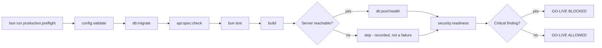

🇬🇧 English (source) · 🇮🇩 [Bahasa Indonesia](production-readiness.id.md)

# Production Security Readiness

> **Document status (AWCMS, foundation-rebuild stage).** This document
> adapts the `security:readiness`/`production:preflight` standard
> inherited from the `awcms-mini` base. In AWCMS, three of the four core
> scripts are **ALREADY implemented and real**: `config:validate`
> (`scripts/validate-env.ts`, 255 lines — validates env vars against the
> configuration registry, `tests/validate-env.test.ts`), `db:pool:health`
> (`scripts/db-pool-health.ts`, 104 lines — aggregate pool/work-class/
> circuit-breaker check) and `security:readiness` (`scripts/security-readiness.ts`,
> 1560 lines — genuine RLS/RBAC-ABAC/secret/fail-closed inspection,
> verified by `tests/security-readiness-*.test.ts`). What is **not yet
> implemented** is `production:preflight` — the orchestrator that will
> run all three as one gated go/no-go sequence plus the
> `database:capacity`/`db:connectivity`/`migration:plan` stages (see
> [`production-preflight-runbook.md`](production-preflight-runbook.md)
> for status detail). The entire "Implementation status" table below
> still needs to be read carefully: rows that refer to `production:preflight`
> or to stages it alone owns describe **a target mechanism that has not
> been built**, whereas rows that refer to the three scripts above
> describe a mechanism that runs today.

This document records the production security readiness standard for AWCMS
(inherited from the `awcms-mini` base, aligned with the governance docs, the
AWCMS RLS/RBAC-ABAC/soft-delete ADRs, and the threat model still to be written).

## Summary



`config:validate` runs **first of all** in the target flow below — config
must be valid before any stage tries to connect to the database or run a
migration. This ordering is the contract that
`scripts/production-preflight.ts` (does not exist yet) will enforce once that
orchestrator is built; today `config:validate` can already be run on its own
at any time.

Four core scripts — three ALREADY real, one (the orchestrator) still a target:

| Command                        | Script                            | Status                  | Function                                                                   |
| ------------------------------ | --------------------------------- | ----------------------- | -------------------------------------------------------------------------- |
| `bun run config:validate`      | `scripts/validate-env.ts`         | **Real implementation** | Validates env vars against the configuration registry                      |
| `bun run db:pool:health`       | `scripts/db-pool-health.ts`       | **Real implementation** | CLI wrapper around `GET /api/v1/database/pool/health`                      |
| `bun run security:readiness`   | `scripts/security-readiness.ts`   | **Real implementation** | Runs the automated security checklist, exits non-zero on any critical fail |
| `bun run production:preflight` | `scripts/production-preflight.ts` | **Does not exist yet**  | Orchestrates every preflight stage + the final go/no-go verdict            |

The three real scripts above are pure CLI/script — a change to this standard
does not by itself require an OpenAPI/AsyncAPI change (there is no new
endpoint or event).

## 1. `db:pool:health`

Calls the endpoint `GET /api/v1/database/pool/health`
(`src/pages/api/v1/database/pool/health.ts`, see
[`database-pooling.md`](database-pooling.md)) against a base URL configurable
through the env var `APP_URL` (default `http://localhost:4321`).
Exit code semantics follow that endpoint's 3-tier status:

- `"healthy"` or `"degraded"` → exit `0` (degraded still counts as a pass —
  merely a warning to investigate before go-live).
- `"unhealthy"` → non-zero exit (hard failure).
- Fetch fails outright (server not running, connection refused) → **also** a
  hard failure with a clear error message — never silently looking like a
  pass.

## 2. `security:readiness`

Runs a fixed list of named checks, each producing:

```ts
{
  name: string;
  severity: "critical" | "warning" | "info";
  status: "pass" | "fail";
  evidence: string;
}
```

Exits non-zero if **even a single** `critical` check has status `fail`.

### Mapping the doc 07 checklist → target implementation

| Doc 07 checklist item                               | Target implementation                                                                                                                                                                                                                                                                |
| --------------------------------------------------- | ------------------------------------------------------------------------------------------------------------------------------------------------------------------------------------------------------------------------------------------------------------------------------------ |
| No hardcoded secret                                 | **Automatic** (critical) — grep heuristic over `src/`, `scripts/`, git-tracked config files                                                                                                                                                                                          |
| `.env` not committed                                | **Automatic** (critical) — `git ls-files` must not contain `.env`                                                                                                                                                                                                                    |
| Modern password hash                                | **Automatic** (critical) — calls the real `hashPassword()`, checks for the `$argon2id$` prefix                                                                                                                                                                                       |
| Login lockout                                       | **Automatic** (critical) — calls `evaluateLoginAttempt()` with a 5-failure scenario                                                                                                                                                                                                  |
| RLS active                                          | **Automatic** (critical) — direct `pg_class.relrowsecurity` query per `awcms_%` table                                                                                                                                                                                                |
| ABAC active (default deny)                          | **Automatic** (critical) — calls `evaluateAccess()` with an empty permission set                                                                                                                                                                                                     |
| Audit log active                                    | **Automatic** (critical) — `SELECT to_regclass('awcms_audit_events')`                                                                                                                                                                                                                |
| Soft delete/restore/purge audit active              | **Automatic** (warning) — checks the permission seed + greps `recordAuditEvent` in the profile endpoints                                                                                                                                                                             |
| Sync HMAC when hybrid                               | **Automatic** (warning/info) — checks the env secret is not the `.env.example` placeholder, skipped when sync is off                                                                                                                                                                 |
| Errors do not expose stack traces                   | **Best-effort automatic** (warning/info) — needs a live server; `info` when it cannot be checked                                                                                                                                                                                     |
| Restore/purge authorized and audited                | Covered by the "soft delete/restore/purge audit active" row above (one combined check)                                                                                                                                                                                               |
| Tax data masking                                    | **Becomes in-scope for AWCMS** — unlike the generic `awcms-mini` base, AWCMS does have a tax/Coretax module as part of the product scope (see ADR-0001); this check needs implementing as soon as the tax module exists, not documenting as "out of scope"                           |
| Payroll/HR data masking (NIK, bank account, salary) | **New for AWCMS** — no counterpart in the generic base; must be added as a new check when the HR/payroll module is built                                                                                                                                                             |
| AI read-only                                        | **Scope-dependent** — only relevant if the AI analyst module is enabled in AWCMS; see §Items out of scope                                                                                                                                                                            |
| PostgreSQL not public                               | **Manual** — see §Items out of scope                                                                                                                                                                                                                                                 |
| Least-privilege DB user                             | **Partly automatic** (critical, connection-role coverage) + **manual** for full grant/role provisioning                                                                                                                                                                              |
| Backup active / restore tested                      | **Manual** (SOP + target scripts: `deploy/backup/{backup,restore}-postgres.sh` with encryption + signed manifest + checksum-before-restore + scheduled restore drill — see `deploy/backup/README.md` once ported)                                                                    |
| PostgreSQL version matches target                   | **Manual** — the version is pinned in `docker-compose.yml`, not re-verified from application code                                                                                                                                                                                    |
| Build pass / migration pass / API spec valid        | **Automatic** — via `production:preflight`, stages `build`/`db:migrate`/`api:spec:check`                                                                                                                                                                                             |
| Setup wizard locked                                 | Target: `awcms_setup_state` singleton; no implementation yet                                                                                                                                                                                                                         |
| Default roles available                             | Target: seeded built-in roles (owner/admin/ERP operator); no implementation yet                                                                                                                                                                                                      |
| Logging active                                      | Target: `src/lib/logging/logger.ts`, reinforced by the lint gate `bun run logging:lint:check` (part of `bun run check`) which fails the build if there is a `console.error`/`console.warn` pattern carrying a raw error/`.message`/`.stack` unsanitized on an admin/API/scripts path |
| Primary index / soft-delete partial index           | Verified through per-module migration tests; there is no module to verify yet                                                                                                                                                                                                        |
| Pool healthy / slow query monitoring                | **Automatic** via `db:pool:health` (pool); slow query monitoring remains out of scope (needs `pg_stat_statements`/an external APM)                                                                                                                                                   |
| Security response headers (CSP/HSTS/etc.)           | **Automatic** (warning) — hits the real server, checks `content-security-policy`/`x-content-type-options`/`x-frame-options`/`referrer-policy`/`permissions-policy` in the `GET /login` response                                                                                      |
| Login rate limiting (source+tenant)                 | **Automatic** (warning) — pure `checkRateLimit()`, asserting the 4th attempt is rejected after `maxAttempts=3`                                                                                                                                                                       |
| Email provider config complete when enabled         | **Automatic** (critical) — `checkEmailProviderConfigReady` reuses `checkEmailConfig`; skipped (pass) when `EMAIL_ENABLED` is not `"true"`                                                                                                                                            |

### Items out of scope or needing AWCMS scope adjustment

Printed explicitly in the `security:readiness` report as an "Out of
scope" section — **not** hidden, and not forced into a fake check:

| Item                      | Reason                                                                                                                                                                                            |
| ------------------------- | ------------------------------------------------------------------------------------------------------------------------------------------------------------------------------------------------- |
| AI read-only              | Only relevant if the AI analyst/tool-calling module is enabled — no such module exists in AWCMS at the foundation stage.                                                                          |
| PostgreSQL not public     | A deployment-profile concern — the real network exposure depends on the operator's configuration at deploy time and cannot be verified from application code alone. Manual.                       |
| Least-privilege DB user   | DB roles/grants are provisioned at deploy time. The application's own connection role (not superuser/bypass-RLS) is verified automatically (see the check above); other grants/roles stay manual. |
| Backup/restore tested     | The backup/restore scripts need porting and running for real against a provisioned environment to prove the restore result. Manual.                                                               |
| PostgreSQL version pinned | The version pin lives in `docker-compose.yml`, it is not verified from application code. Manual — confirm the real server version (`SELECT version();`).                                          |

Unlike the generic `awcms-mini` base (where tax masking/CRM opt-out/AI
read-only are derived-application domain concerns explicitly outside the
base's scope), for AWCMS **tax data masking and payroll/HR data masking are
in-scope product concerns** because the tax/Coretax and HR/payroll modules
are part of AWCMS's own scope (ADR-0001) — both need dedicated
`security:readiness` checks as soon as their module is built, not
documentation saying "a derived domain the base does not handle."

## 3. `production:preflight`

Orchestrates the following stages as child processes (`Bun.spawn`), in order,
recording pass/fail per stage, then printing the final verdict:

1. `bun run config:validate` — **first of all**: config must be valid
   before any stage tries to connect to the database or run a migration.
2. `bun run db:migrate`
3. `bun run api:spec:check`
4. `bun test`
5. `bun run build`
6. `bun run db:pool:health` — **only if** the `GET /api/v1/health` probe
   shows a server answering; if not, this stage is recorded as
   `skipped` (not `failed`) with an explicit reason in the report. This is
   a deliberate design decision: `production:preflight` can be run in
   CI/an environment with no running server without blocking the whole
   preflight on the one stage that genuinely needs a live server.
7. `bun run security:readiness`

`bun install` is **deliberately not** run by this script — it is an
environment setup step (fetching dependencies), not a readiness check, and
outside this script's responsibility.

Every stage still runs even when an earlier stage failed (not fail-fast) —
the final report lists **every** failed stage, not just the first, so that
one failure does not hide another problem.

Final verdict: `GO-LIVE ALLOWED` (exit 0) if no stage `fail`s,
`GO-LIVE BLOCKED` (non-zero exit) if any does.

## How to run it before go-live

```bash
bun install
bun run config:validate
bun run db:migrate
bun run api:spec:check
bun test
bun run build
bun run preview &            # or `bun run dev` — a live server is needed for db:pool:health
bun run db:pool:health
bun run security:readiness
bun run production:preflight
```

Or simply `bun run production:preflight` once the (optional) server is
live — this script runs every stage above except `bun install`.

## Tests

Target: `tests/security-readiness.test.ts` covers the pure logic that does not
need a real DB/server connection: the `scanLineForHardcodedSecret` heuristic
(including the negative cases — placeholder, member expression, reading from
`process.env`), `checkAbacDefaultDeny`, `checkLoginLockoutImplemented`, and
`checkSyncHmacSecretNotDefault` (all three branches: sync off, sync on with a
placeholder, sync on with a real secret).

Checks that need a real Postgres (`checkRlsEnabled`,
`checkAuditLogTableReachable`, part of `checkSoftDeletePermissionsSeededAndAudited`)
are **not** unit-tested against a fake DB — that would test the mock, not the
real query. Their proof has to live in live verification once this script is
implemented, including a scenario where RLS is deliberately turned off to
prove the gate really blocks, rather than a script that always prints "pass".

## Gaps not yet closed

- There is no code implementation at all yet for the mechanism in this
  document — this is the main gap at AWCMS's current foundation stage, on
  top of the technical gaps inherited from the base (see the points below,
  which apply once the porting is done).
- Slow query monitoring (`pg_stat_statements`/APM) is not verified
  automatically — it needs external observability tooling outside this base's scope.
- `checkErrorsDontLeakStackTraces` is best-effort: it only exercises one
  request shape against one list of common stack-trace substrings; it is no
  blanket guarantee for every endpoint.
- Deployment items (PostgreSQL not public, full least-privilege user,
  backup/restore, version pinned) remain **manual** verification against a
  provisioned environment.
- Security headers are only checked for **presence** (the header name is in
  the response), not for the CSP content being deeply valid.
- The login rate limiter is in-memory per process, not shared between instances
  on a multi-instance deployment.
- Tax data masking and payroll/HR data masking (new checks for AWCMS,
  not inherited directly from the base) have no reference implementation at
  all — they need designing from scratch when the tax/Coretax and HR/payroll
  modules are built.
