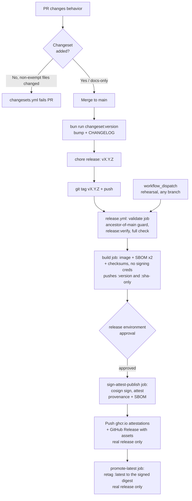

🇮🇩 Bahasa Indonesia · 🇬🇧 [English (source)](release-process.md)

<!-- i18n-source-hash: sha256:f3211aafdb4042100129c7e11c0165ccc3ef1f745dc103753ba6bb93718b4881 -->

# Release Process — Changesets, SBOM, Signing, Provenance

> **Status dokumen:** pipeline **sudah dieksekusi sebagai rilis nyata**. Rilis nyata pertama **`v6.0.0` (2026-07-21)** menjalankan `.github/workflows/release.yml` end-to-end lewat push tag `v6.0.0`: `validate` → `build` (image + dua SBOM) → `sign-attest-publish` semuanya sukses, image `ghcr.io/ahliweb/awcms:6.0.0` (+`:latest`,`:sha-*`) ter-publish dengan attestation terverifikasi (`gh attestation verify oci://ghcr.io/ahliweb/awcms:6.0.0 --owner ahliweb` → OK), dan GitHub Release `v6.0.0` terbit dengan asset SBOM×2 + `CHECKSUMS.txt` + `source.tar.gz`. Versi sebelumnya `5.0.0` adalah lompatan manual melanjutkan lini major legacy `v4.6.0` (lihat [ADR-0024](../adr/0024-semver-numbering-continues-legacy-major-line.md)); `6.0.0` adalah bump changeset normal (MAJOR: breaking ADR-0034). Kedua workflow (`.github/workflows/changesets.yml`, `.github/workflows/release.yml`, `Dockerfile.production`, `scripts/release-verify.ts`) diadaptasi dari basis `awcms-mini`.
>
> **✅ Approval gate kini AKTIF (dikonfigurasi 2026-07-21).** Pada rilis `v6.0.0` job `sign-attest-publish` sempat berjalan **tanpa jeda "Waiting for review"** karena Environment `release` belum punya required reviewers. Gap itu **sudah ditutup**: required reviewer `ahliweb` (id `44542506`) dipasang via `gh api -X PUT .../environments/release` (`prevent_self_review: false`, `can_admins_bypass: true`). **Diverifikasi lewat rehearsal** (`workflow_dispatch`, run 29831369872): `validate`+`build` sukses lalu `sign-attest-publish` berhenti di `status: waiting` dengan pending deployment environment `release` — membuktikan gerbang benar-benar menahan (run rehearsal lalu dibatalkan tanpa publish). Sejak sekarang setiap rilis nyata **dan** rehearsal pause menunggu **Approve and deploy** dari maintainer sebelum sign/attest/publish.
>
> **Prosedur tag (koreksi):** tidak ada script `bun run changeset:tag` — tag rilis `vX.Y.Z` dibuat **manual** (`git tag -a vX.Y.Z -m "vX.Y.Z"` → `RELEASE_VERIFY_TAG=vX.Y.Z bun run release:verify` → `git push origin vX.Y.Z`). Image di-tag **tanpa** prefix `v` (`6.0.0`), sedangkan git tag & GitHub Release memakai `v6.0.0`.

Changesets sudah mengelola version bump dan `CHANGELOG.md` (lihat `.changeset/` dan `CHANGELOG.md` di repo ini serta `docs/awcms/09_roadmap_repository_commit.md` §Versioning dengan Changesets, menyusul) dan `bun run changesets:policy:check` sudah menegakkan kebijakan changeset di setiap PR (`.github/workflows/changesets.yml`). `release.yml` mem-produksi image, dua SBOM, signature, dan provenance yang bisa diverifikasi — desainnya didokumentasikan lengkap di bawah, implementasinya ada di `.github/workflows/release.yml`.

## Pipeline overview



Kedua trigger wajib menjalankan `validate` job yang persis sama — jalur rehearsal bukan jalan pintas melewati quality gate, hanya melewati tag-ancestor guard dan `release:verify` (keduanya `if: github.event_name == 'push'`; `bun run check` sendiri selalu berjalan).

## 0. Model versi: `vX.Y.Z`

Satu nomor versi, tiga tempat, tiga ejaan — dan hanya satu yang memikul `v`:

| Di mana                  | Ejaan    | Contoh                        |
| ------------------------ | -------- | ----------------------------- |
| `package.json`           | `X.Y.Z`  | `9.1.2`                       |
| tag git / GitHub Release | `vX.Y.Z` | `v9.1.2`                      |
| tag image container      | `X.Y.Z`  | `ghcr.io/ahliweb/awcms:9.1.2` |

`release.yml` menurunkan tag image dengan membuang prefiksnya (`VERSION="${GITHUB_REF_NAME#v}"`), sehingga `…:v9.1.2` tidak ada di registry — lihat §Verification untuk `manifest unknown` yang dihasilkan bila `v` ikut ditulis. `scripts/lib/semver.ts` memiliki ketiga ejaan itu; `releaseTagFor()` adalah satu-satunya tempat `v` ditambahkan.

**Hanya versi rilis.** `X.Y.Z` berarti persis tiga field numerik: tanpa sufiks prerelease (`-rc.1`), tanpa build metadata (`+build.5`), tanpa leading zero. Ini lebih ketat daripada yang diizinkan SemVer, dengan sengaja. Trigger tag `release.yml` adalah glob `v*.*.*`, dan sebuah glob tidak bisa menyatakan "tanpa prerelease" — `v1.2.3-rc.1` cocok dengannya dan akan mencapai jalur publish. Pola di `semver.ts` adalah satu-satunya yang menolaknya, dan karena itulah `version:check` menegaskan `release:verify` masih terpasang di `validate`.

**Bump datang dari changesets, tidak pernah manual.** `bun run changeset:version` menulis `package.json` dan section `CHANGELOG.md` bersama-sama. Satu-satunya pengecualian dalam sejarah repo ini adalah lompatan manual `0.2.0` → `5.0.0`, yang secara struktural tidak bisa dilakukan changesets (ia hanya bisa menaikkan) — tercatat di [ADR-0024](../adr/0024-semver-numbering-continues-legacy-major-line.md).

### `bun run version:check` (di rantai `check`)

Model di atas dulu hanya ditegakkan `release:verify`, di dalam job yang berjalan _karena_ sebuah tag di-push. Setiap cara membuatnya salah karena itu tetap hijau di `main` dan baru muncul setelah tag menjadi publik — sementara §Rollback tegas menyatakan tag yang sudah terbit tidak pernah dipotong ulang. `version:check` memindahkan model yang sama ke setiap commit:

| Aturan                                 | Yang ditangkapnya                                                                                            |
| -------------------------------------- | ------------------------------------------------------------------------------------------------------------ |
| `package-version`                      | `package.json` bukan `X.Y.Z` — prerelease, terpotong, leading zero, atau memikul `v`.                        |
| `changelog-headings`                   | Heading `## ` yang bukan versi rilis (satu `## Unreleased` liar mengubah potongan release notes).            |
| `changelog-order`                      | Section tidak urut terbaru-ke-terlama, atau section ganda.                                                   |
| `changelog-newest`                     | Section terbaru tidak sepakat dengan `package.json` — bump yang entri changelog-nya tak pernah ditulis.      |
| `tag-namespace`                        | Tag yang bukan `vX.Y.Z`.                                                                                     |
| `version-behind-tags`                  | `package.json` duduk DI BAWAH tag terbit terbaru, sehingga bump berikutnya menerbitkan ulang nomor terpakai. |
| `release-trigger` / `release-backstop` | Glob `v*.*.*` ditinggalkan tanpa step `release:verify` yang membatasinya.                                    |
| `changeset-frontmatter`                | Changeset pending yang mendeklarasikan bump tak valid atau nama paket asing.                                 |

**Enam tag mendahului model ini** — `2.9.9`, `2.12.0`, `3.0.0`, `3.1.0`, `4.3.1`, `4.5.0` — semuanya dipotong tooling basis kode lama sebelum rebuild (ADR-0024), dan `3.0.0` duduk di commit `b23d3308` berdampingan dengan `v3.0.0`: satu rilis dengan dua nama. Mereka adalah daftar pengecualian bernama-persis yang TERTUTUP di `scripts/version-check.ts`; yang ketujuh tidak bisa muncul tanpa seseorang menyuntingnya. Ke-15 tag yang dipotong sejak `v5.1.0` (16 Juli 2026) semuanya sudah patuh — gerbang ini mengubah rentetan itu menjadi invarian.

> **Aturan tag butuh tag untuk bisa melihat.** `actions/checkout` default itu shallow dan tidak mengambil satu tag pun, sehingga aturan itu akan melapor `UNENFORCED` selamanya — hijau, dan buta. Karena itu job `quality` di `ci.yml` menyetel `fetch-tags: true`, dan `tests/version-check.test.ts` menegaskan baris itu masih ada agar tidak bisa dihapus diam-diam.

## 1. PR-time gate: `changesets.yml`

`scripts/changeset-policy-check.ts` (`bun run changesets:policy:check`) memutuskan apakah sebuah PR butuh changeset baru, memakai riwayat PR yang sudah merge di repo ini sendiri sebagai ground truth untuk apa yang tergolong "docs-only/chore":

- **Exempt** (tidak butuh changeset): `docs/**`, `.claude/**`, `.changeset/**`, berkas `*.md` mana pun.
- **Tidak exempt** (wajib changeset): semua yang lain, termasuk `.github/**` workflow, `scripts/**`, `src/**`, `sql/**`, `openapi/**`, `asyncapi/**`, `package.json`, `Dockerfile*`, `docker-compose*.yml`, dan berkas test.

Bila berkas `.changeset/*.md` baru ditambahkan, frontmatter-nya divalidasi (`"awcms": major|minor|patch` — repo single-package, jadi tidak ada nama package lain yang valid). Sebuah daftar pengecualian path satu-off (`CHANGESET_POLICY_PATH_EXEMPTIONS` di script) tersedia untuk false positive genuine, meniru pola `CONFIG_EXEMPTIONS`/`LOGGING_LINT_EXEMPTIONS` yang sudah dipakai di tempat lain di repo ini bila diadopsi.

Check ini berjalan sebagai workflow sendiri (`changesets.yml`), bukan step tambahan di dalam `ci.yml`'s `quality` job atau `bun run check`, karena secara inheren berbentuk PR-diff (butuh tip `origin/main` untuk dibandingkan) — setiap step lain di `check` bersifat self-contained dan aman dijalankan terhadap satu checkout tanpa dependency network/git-history.

## 2. Tag-time release: `release.yml`

Dua entry point, keduanya konvergen ke job graph yang sama:

| Trigger                           | Efek                                                                                                                                                                                                     |
| --------------------------------- | -------------------------------------------------------------------------------------------------------------------------------------------------------------------------------------------------------- |
| `push` tag yang cocok `v*.*.*`    | **Rilis nyata.** Mempublikasikan image, lalu — hanya setelah gerbang approval dilewati — GitHub Release, dan baru setelah itu memindahkan `:latest`. Ini TIGA peristiwa terpisah, bukan satu (ADR-0117). |
| `workflow_dispatch` (ref apa pun) | **Rehearsal.** Menjalankan pipeline yang identik terhadap image tag `dryrun-<sha>`. Tidak ada GitHub Release dibuat, `:latest` tidak pernah disentuh.                                                    |

### `validate` job (read-only)

1. **Ancestor-of-main guard** (rilis nyata saja) — `git merge-base --is-ancestor HEAD origin/main`. Selama repo ini belum punya branch protection rule di `main`, guard ini adalah pengganti level-workflow untuk "publish hanya dari branch terproteksi": tag yang commit-nya bukan bagian dari riwayat `origin/main` ditolak sebelum apa pun dibangun.
2. **`bun run release:verify`** (rilis nyata saja, `scripts/release-verify.ts`) — memastikan tag yang di-push cocok model `vX.Y.Z` (§0), bahwa versinya cocok dengan `package.json`, bahwa `CHANGELOG.md` punya section `## X.Y.Z` untuknya (`## [X.Y.Z]` juga diterima, untuk section tulisan tangan seperti lompatan ADR-0024), dan tidak ada berkas changeset yang belum terkonsumsi di `.changeset/`. Sebagian besar ini kini juga diperiksa di setiap commit oleh `version:check`; yang tetap eksklusif milik release time adalah perbandingan tag↔`package.json` (belum ada tag sebelum push) dan tuntutan agar `.changeset/` kosong (ia memang sengaja penuh di antara rilis).

   Tag yang diverifikasi datang dari `RELEASE_VERIFY_TAG`, yang diset `release.yml` dari `github.ref_name`. Fallback lokalnya memakai `git tag --points-at HEAD` yang difilter ke `vX.Y.Z`, **bukan** `git describe --exact-match`: commit `b23d3308` memikul `3.0.0` sekaligus `v3.0.0`, dan `describe` memilih di antara keduanya menurut urutan internal git, bukan menurut model — melaporkan kegagalan pola atas tag yang tidak dipilih siapa pun, tanpa satu pun bagian pesannya menyebut tag kedua sebagai sebabnya.

3. **`bun run check`** (terhadap Postgres service nyata yang sudah dimigrasi) — quality gate penuh, diverifikasi ulang saat release time, bukan dipercaya dari hasil CI yang mungkin sudah basi. Ini harus **lebih ketat** daripada `quality` job milik `ci.yml`, bukan identik dengannya — pastikan setiap step yang dijalankan `bun run check` juga dijalankan `ci.yml`'s `quality` job (mis. `i18n:pot:check`, `config:docs:check`, `logging:lint:check`, `api:docs:check`, `repo:inventory:check`) agar drift semacam ini tidak bisa merge ke `main` lewat PR hijau dan baru muncul saat tag-push.

   (Catatan historis: versi lama paragraf ini menyarankan menambahkan `extension:check` — kompatibilitas manifest aplikasi turunan — ke composite `check` dan `ci.yml`. Saran itu **tidak lagi berlaku**: jalur aplikasi-turunan beserta `extension:check` sudah **dicabut oleh [ADR-0034](../adr/0034-awcms-family-direct-use-templates-and-derived-pathway-removal.md)**. Prinsipnya tetap: setiap check baru yang ditambahkan ke `package.json`'s `check` composite harus juga menjadi step eksplisit bernama di `ci.yml`'s `quality` job dalam PR yang sama, agar tidak muncul kelas drift yang sama.)

### `build` job (unprivileged: `contents: read`, `packages: write` saja)

Berjalan identik untuk rilis nyata dan rehearsal. Sengaja tidak memegang credential signing/attestation (`id-token`/`attestations`) — lihat di bawah.

1. Build `Dockerfile.production` dengan Docker Buildx, push ke `ghcr.io/ahliweb/awcms` bertag `<version>` (atau `dryrun-<sha>` untuk rehearsal) dan `sha-<commit>`. **`:latest` TIDAK diproduksi di sini** — job ini berjalan sebelum gerbang approval, jadi apa pun yang ia tag menjadi publik dan tanpa tanda tangan; lihat job `promote-latest` di bawah dan [ADR-0117](../adr/0117-latest-moves-only-after-the-approval-that-signs-it.id.md).
2. **SBOM** — dua SBOM CycloneDX JSON terpisah via [`anchore/sbom-action`](https://github.com/anchore/sbom-action) (Syft di baliknya): satu untuk **source tree** (`bun.lock` + workspace, `sbom-source.cdx.json`) dan satu untuk **image container terbangun** (`sbom-image.cdx.json`) — keduanya bisa berbeda (SBOM image juga mencerminkan paket OS base image, bukan hanya `bun.lock`).
3. **Checksums** — `CHECKSUMS.txt` (SHA-256) mencakup kedua SBOM dan sebuah `git archive` source tarball.
4. Mengunggah semua di atas sebagai workflow artifact berumur pendek (1 hari) untuk diunduh job berikutnya.

### `sign-attest-publish` job (`environment: release`)

Digerbangi di belakang GitHub Environment bernama `release` (lihat §Environment approval di bawah). Dipisah dari `build` menjadi job sendiri karena alasan keamanan: `id-token`/`attestations` permission bersifat JOB-scoped di GitHub Actions, jadi setiap step di job yang memegangnya bisa mencetak OIDC token sendiri — menjaga third-party action `anchore/sbom-action` sepenuhnya di luar job ini berarti hipotesis kompromi supply-chain pada action itu tidak pernah punya credential OIDC/attestation untuk disalahgunakan. Berjalan identik untuk rilis nyata dan rehearsal:

1. **Signing** — `cosign sign --yes` terhadap digest image yang dihasilkan `build` job, **keyless OIDC** (tidak ada signing key yang pernah ada; identitasnya adalah workflow run ini sendiri, didukung OIDC token GitHub Actions dan Sigstore's Fulcio/Rekor).
2. **Attestation/provenance** — `actions/attest-build-provenance` untuk digest image (dipush ke registry juga) dan untuk tiga artefak source (`CHECKSUMS.txt`, `sbom-source.cdx.json`, source tarball); `actions/attest` (dengan `sbom-path`) mengasosiasikan `sbom-image.cdx.json` dengan digest image secara spesifik. Semua adalah attestation store SLSA-compatible milik GitHub sendiri — tidak ada infrastruktur terpisah yang perlu dijalankan/dipelihara.
3. **Publish** (rilis nyata saja) — mengekstrak section versi ini dari `CHANGELOG.md` sebagai body release dan menjalankan `gh release create`, melampirkan `CHECKSUMS.txt` dan kedua SBOM plus source tarball sebagai release asset.

### `promote-latest` job (rilis nyata saja; `packages: write` saja)

Me-retag `:latest` pada `ghcr.io/ahliweb/awcms` dan `ghcr.io/ahliweb/awcms-jobs` ke digest yang baru saja ditandatangani dan di-attest. Ia tidak mendeklarasikan `environment:` sendiri — `needs: [build, sign-attest-publish]` sudah membuatnya tak terjangkau sampai gerbang disetujui, dan prompt approval kedua untuk keputusan yang sama hanyalah friksi tanpa keputusan kedua di belakangnya. Ia dibuat job terpisah alih-alih langkah tambahan di `sign-attest-publish` justru karena alasan job itu sendiri: `id-token`/`attestations` bersifat JOB-scoped, sehingga menjaga `docker/setup-buildx-action` di luar job berprivilese mempertahankan properti pengurungan yang dijelaskan di atas.

Retag adalah operasi REGISTRY, bukan Docker: `GET /v2/<name>/manifests/<digest>` lalu `PUT /v2/<name>/manifests/latest` dengan byte dan `Content-Type` yang sama. Isi identik byte-per-byte menghasilkan hash identik, sehingga `:latest` tak bisa mendarat di mana pun selain digest tertandatangani — image aplikasi diikat dengan `@<digest>`, digest persis yang diserahkan ke `cosign sign`. `docker buildx imagetools create` sempat dipakai dan TIDAK BISA melakukannya: ia selalu memancarkan manifest list baru yang membungkus sumbernya, yang berarti digest berbeda, sementara attestation terikat pada digest. Rilis `v10.0.3` gagal persis di sana; lihat ADR-0117 §Amandemen. Satu langkah terakhir membaca `Docker-Content-Digest` milik registry sendiri untuk `:latest` dan menggagalkan job kecuali cocok.

Ia berjalan **setelah** GitHub Release terbit, bukan sebelum. Kedua urutan sama-sama menjaga `:latest` tertandatangani, tetapi langkah release-notes adalah yang benar-benar pernah gagal di pipeline ini (`v7.0.0`, body 186.449 karakter, setelah image sudah ter-push) — mempromosikan terakhir berarti kegagalan semacam itu meninggalkan `:latest` pada rilis sebelumnya, alih-alih menunjuk versi yang tak punya Release yang menjelaskannya. Lihat [ADR-0117](../adr/0117-latest-moves-only-after-the-approval-that-signs-it.id.md).

## Mengapa `anchore/sbom-action` (Syft) untuk SBOM generation

- Menghasilkan CycloneDX **dan** SPDX (pipeline ini memakai CycloneDX untuk kedua scan — satu format lebih sederhana untuk konsumen di-diff/tooling; keduanya memenuhi kriteria "CycloneDX atau SPDX").
- Composite action self-contained yang membungkus satu binary Go statically-linked (Syft) — tidak memanggil `npm`/`node` terhadap repo ini atau membutuhkan SBOM generator berbasis Node.js (`@cyclonedx/cyclonedx-npm` dan sejenisnya adalah npm-ecosystem-only dan akan bertentangan dengan aturan Bun-only di `AGENTS.md`). Hanya membaca `bun.lock`/filesystem/image terbangun — tidak pernah mengeksekusi kode proyek ini sendiri.
- Satu action mencakup kedua scan target (`path:` untuk source tree, `image:` untuk container terbangun), jadi hanya ada satu third-party action baru untuk di-pin dan diaudit, bukan dua tool berbeda.

## Environment approval (langkah manual maintainer)

`sign-attest-publish` mendeklarasikan `environment: release`. `build` tidak, karena ia tidak memegang credential signing/attestation — menggerbanginya tidak mengurung apa pun yang bisa dilakukan job itu dengan credential tersebut, dan di sanalah third-party `anchore/sbom-action` sengaja dijalankan.

> **Apa yang dicakup dan TIDAK dicakup gerbang ini.** Ia menggerbangi _penandatanganan, attestation, GitHub Release, dan (sejak [ADR-0117](../adr/0117-latest-moves-only-after-the-approval-that-signs-it.id.md)) tag `:latest`_. Ia **tidak** menggerbangi push image itu sendiri: `build` menerbitkan `:<version>` dan `:sha-<commit>` begitu tag di-push, sebelum approval apa pun. Tag-tag itu imutabel dan inert — tak ada yang menunjuk ke sana kecuali konsumen meminta versi persis itu — sehingga rilis yang tak pernah disetujui meninggalkannya dan tidak memindahkan apa pun. Paragraf ini dahulu menyatakan menggerbangi `build` hanya menambah "friksi tanpa manfaat keamanan"; itu benar untuk kredensial dan SALAH untuk penerbitan, karena `build` juga memancarkan `:latest`. Empat rilis (`v8.0.0`, `v9.0.0`, `v9.1.0`, `v9.1.1`) duduk tanpa persetujuan di gerbang ini masing-masing lebih dari sepekan, sementara `:latest` sudah menunjuk image mereka yang tak bertanda tangan. ADR-0117 memindahkan `:latest` ke belakang gerbang; sisa paragraf ini tetap berlaku.

Mereferensikan nama environment di sebuah workflow **auto-create record environment yang tidak terproteksi** pada run pertama bila belum ada — ini **tidak**, dengan sendirinya, mem-pause job untuk approval. Mengonfigurasi **required reviewers** pada environment tersebut adalah perubahan repo-admin/shared-state yang sengaja dibiarkan untuk diterapkan eksplisit oleh maintainer:

**Via GitHub UI:** Settings → Environments → New environment → beri nama tepat `release` → **Required reviewers** → tambahkan minimal satu maintainer → Save protection rules. Setiap run `release.yml`'s publish job (rilis nyata **dan** rehearsal) akan pause di "Waiting for review" sampai reviewer yang disetujui klik **Approve and deploy**.

**Setara `gh api`** (dijalankan oleh repo admin; ganti `<reviewer-user-id>` dengan numeric GitHub user id tiap required reviewer, dari `gh api users/<login> --jq .id`):

```bash
gh api -X PUT repos/ahliweb/awcms/environments/release \
  -f 'reviewers[][type]=User' \
  -F 'reviewers[][id]=<reviewer-user-id>'
```

Sampai ini diterapkan, `release.yml` tetap berjalan end-to-end (kedua entry point) tanpa pause — setiap kontrol lain di dokumen ini (ancestor-of-main guard, `release:verify`, quality gate penuh, least-privilege per-job permissions, pinned-by-SHA actions) independen dari langkah ini.

## Dry-run / rehearsal path

Trigger `release.yml` secara manual — GitHub UI: **Actions → Release → Run workflow** (pilih branch mana pun; `main` adalah default yang masuk akal), atau:

```bash
gh workflow run release.yml --repo ahliweb/awcms --ref main
```

Ini menjalankan pipeline **sepenuhnya** — image build, kedua SBOM, checksums, keyless signing, provenance/SBOM attestation, dan gate approval `release` environment (setelah dikonfigurasi) — terhadap tag `ghcr.io/ahliweb/awcms:dryrun-<short-sha>` yang sekali pakai. Tidak pernah membuat GitHub Release dan tidak pernah memindahkan `:latest`, jadi tidak bisa keliru dianggap (atau tanpa sengaja jadi) rilis produksi. Rehearse ini minimal sekali, dengan reviewer benar-benar menyetujui gate environment, sebelum tag `vX.Y.Z` nyata pertama di-push.

Image rehearsal menumpuk di package `ghcr.io/ahliweb/awcms` di bawah tag `dryrun-*`; maintainer bisa menghapus yang lama secara berkala lewat halaman **Manage versions** package atau `gh api -X DELETE /orgs/ahliweb/packages/container/awcms/versions/<id>` — tidak diotomasi pipeline ini, karena penghapusan otomatis butuh `packages: delete`, permission yang tidak dibutuhkan job mana pun di sini.

## Verifikasi (sisi konsumen — tidak butuh secret repository)

Setiap check di bawah hanya memakai data publik (registry, GitHub public attestation API, Sigstore public transparency log) — tidak ada yang butuh akses ke secret/CI environment repo ini.

> **Tag image TIDAK berawalan `v`.** `release.yml` menghitung `VERSION="${GITHUB_REF_NAME#v}"`, jadi tag Git `v7.0.1` mem-publish `ghcr.io/ahliweb/awcms:7.0.1` (+ `:latest`, `:sha-<12>`). `…:v7.0.1` tidak ada di registry dan setiap perintah di bawah akan gagal dengan "manifest unknown" bila `v`-nya ikut ditulis. Ganti `X.Y.Z` di bawah dengan versi tanpa `v`.

```bash
# 1. Verifikasi attestation SLSA build provenance milik image
gh attestation verify oci://ghcr.io/ahliweb/awcms:X.Y.Z \
  --owner ahliweb

# 2. Verifikasi attestation SBOM milik image
gh attestation verify oci://ghcr.io/ahliweb/awcms:X.Y.Z \
  --owner ahliweb --predicate-type https://cyclonedx.org/bom

# 3. Verifikasi signature keyless cosign langsung (tanpa gh CLI)
cosign verify ghcr.io/ahliweb/awcms:X.Y.Z \
  --certificate-identity-regexp "^https://github.com/ahliweb/awcms/.github/workflows/release.yml@refs/tags/v.*" \
  --certificate-oidc-issuer https://token.actions.githubusercontent.com

# 4. Verifikasi provenance untuk artefak source yang bisa diunduh
gh attestation verify CHECKSUMS.txt --owner ahliweb
gh attestation verify sbom-source.cdx.json --owner ahliweb

# 5. Verifikasi checksum untuk apa pun yang diunduh dari GitHub Release
sha256sum -c CHECKSUMS.txt
```

`gh attestation verify` dan `cosign verify` keduanya bekerja terhadap identitas GitHub/Sigstore publik dan anonim — tidak butuh `GITHUB_TOKEN`, secret repository, atau credential maintainer apa pun untuk kelima command di atas.

## Panduan rollback / yank

Baik Changesets maupun pipeline ini tidak pernah menghapus atau menulis ulang versi yang sudah dipublikasikan — konsisten dengan semangat append-only aturan audit trail di `AGENTS.md` (diterapkan di sini untuk artefak rilis, bukan data domain). Untuk memulihkan dari rilis yang buruk:

1. **Jangan hapus git tag, GitHub Release, atau image/tag `ghcr.io`.** Konsumen mungkin sudah menarik (pull) rilis itu; menghapusnya menghilangkan kemampuan mereka bahkan untuk mendiagnosis apa yang mereka punya.
2. **Tandai GitHub Release sebagai pre-release** (`gh release edit vX.Y.Z --prerelease`) dan tambahkan catatan di atas body-nya yang menunjuk ke versi yang sudah diperbaiki.
3. **Buat rilis patch baru** (`vX.Y.Z+1`) lewat jalur normal (changeset → `changeset:version` → tag → `release.yml`) dengan perbaikannya. Jangan force-push tag yang dikoreksi di atas nomor versi yang sama — digest image dan attestation yang sudah diterbitkan untuk tag lama akan secara diam-diam menunjuk ke byte yang berbeda dari yang diimplikasikan nama tag, yang membatalkan seluruh tujuan rantai checksum/signature/provenance yang dideskripsikan dokumen ini.
4. Bila image sudah dideploy, redeploy dengan pin ke **digest** versi baru (`ghcr.io/ahliweb/awcms@sha256:...`, dari `CHECKSUMS.txt` atau `docker buildx imagetools inspect`), bukan tag mengambang, untuk menjamin byte yang benar-benar tetap yang berjalan.

## Lihat juga

- `docs/awcms/09_roadmap_repository_commit.md` (menyusul) — kebijakan SemVer dan alur Changesets yang diotomasi pipeline ini.
- `branch-protection.md` (menyusul) — required status checks dan status branch protection `main`; ancestor-of-main guard dan environment-approval step dokumen ini mengikuti pola "dokumentasikan langkah admin manual, jangan diterapkan sendiri" yang sama.
- [`performance-suite.md`](performance-suite.md) — sebelum rilis yang menyentuh jalur query kritikal atau sizing koneksi/work-class, jalankan performance lane penuh (`bun run performance:suite -- --full`) terhadap database terisolasi (`APP_ENV=test`, bukan environment hidup mana pun) dan bandingkan laporan JSON-nya dengan rilis sebelumnya, sesuai §Comparing two releases/commits dokumen itu.
- `.github/workflows/changesets.yml` / `.github/workflows/release.yml` — definisi workflow aktual yang dideskripsikan dokumen ini.
- `scripts/changeset-policy-check.ts` / `scripts/release-verify.ts` — pure-function policy check yang melandasi kedua workflow, diuji unit di `tests/`.

## Sesudah rilis: post-release review (langkah 18)

Dalam satu minggu kerja setelah tag di-deploy, tulis satu entri di
[`post-release-reviews.md`](post-release-reviews.md) memakai
[`templates/post-release-review-template.md`](templates/post-release-review-template.md).

Rilis yang berjalan mulus **tetap** mendapat entri, dan boleh empat baris.
Register yang hanya memuat insiden mengajarkan pembacanya bahwa rilis biasanya
bermasalah, dan menghapus satu-satunya garis dasar yang membuat rilis buruk
terlihat buruk.
