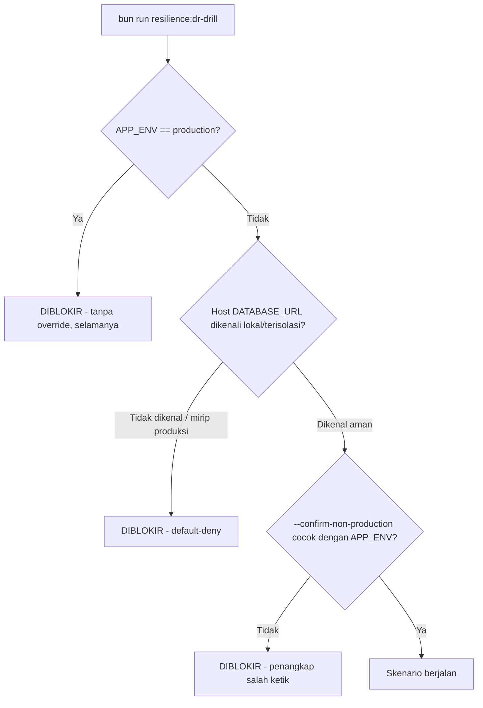

🇮🇩 Bahasa Indonesia · 🇬🇧 [English (source)](resilience-dr-verification.md)

<!-- i18n-source-hash: sha256:827d729f1a4fd9ee93621d6ccf8e37df32e294016dfe18dd00ffba9f1d4ed6a3 -->

# Verifikasi Resiliensi & Pemulihan Bencana

> **Status dokumen (AWCMS, tahap foundation-rebuild).** `bun run
resilience:dr-drill` dan seluruh skenario di bawah adalah mekanisme yang
> pada base `awcms-mini` sudah diimplementasikan penuh dan diverifikasi
> (real signal, real process, real backup/restore). Di AWCMS, **belum ada
> implementasi kode untuk tool ini** — repo baru berisi ADR/governance
> docs. Dokumen ini menjelaskan **target arsitektur dan kontrak** yang
> akan diporting dari base sebagai bagian pembangunan fondasi teknis
> AWCMS; baca klaim "implemented"/"real" di bawah sebagai spesifikasi
> yang harus dipenuhi ulang saat porting, bukan status berjalan saat ini.

Pendamping [`production-preflight-runbook.md`](production-preflight-runbook.md)
dan [`deployment-profiles.md`](deployment-profiles.md) — dokumen ini mencakup
`bun run resilience:dr-drill` (`scripts/dr-drill.ts`), tool injeksi
kegagalan dan verifikasi pemulihan bencana, katalog skenarionya,
dan model keamanannya. Ia memakai ulang pola `authorizeApply` milik
production preflight, skrip latihan backup/restore, dan worker runner
bersama (`src/lib/jobs/job-runner.ts`) ketimbang mengimplementasikannya
ulang.

## Kenapa ini ada

Perilaku pemulihan yang terdokumentasi (backup/restore, penanganan
interupsi worker, isolasi gangguan provider) baru menjadi bukti setelah ia
dilatih di bawah kegagalan terkendali dan menghasilkan hasil yang bisa
direproduksi. Masing-masing mekanisme itu biasanya punya cakupan
pengujiannya sendiri (test integrasi untuk latihan backup-restore, job
runner, dispatch email, …) tetapi tidak ada yang mengikatnya jadi satu
jalan berorientasi DR dengan satu vonis lulus/gagal dan bukti RTO/RPO —
seorang operator yang bersiap untuk go-live (doc 07 §Go-live plan) butuh
satu perintah untuk menjawab "apakah cerita pemulihan yang kita
dokumentasikan itu benar-benar berlaku, sekarang juga, di lingkungan ini?"
Ini persis sama benarnya bagi platform ERP seperti dulu bagi base CMS/POS
tempat mekanisme ini berasal — bisa dibilang lebih lagi, mengingat data
keuangan dan payroll yang dipertaruhkan.

## Interlock keamanan (tidak bisa ditawar)

`authorizeDrDrill` di `src/lib/resilience/target-guard.ts` adalah satu-satunya
gerbang yang dilewati setiap jalan sebelum skenario APA PUN dieksekusi:



Dua properti membuatnya lebih ketat daripada `authorizeApply` milik
`production:preflight`, yang selebihnya ia cermin dalam bentuk (satu fungsi
gerbang murni yang diuji unit; penangkap salah ketik
`--confirm-non-production=<APP_ENV value>` eksplisit yang identik semangatnya
dengan `--acknowledge-target`):

- **`APP_ENV=production` sama sekali TIDAK punya flag override.**
  `authorizeApply` membolehkan operator menerapkan migrasi ke produksi bila
  flag buktinya benar; tool chaos/injeksi-kegagalan tidak punya kasus pakai
  sah yang setara terhadap produksi, jadi penolakan ini tidak bisa
  dilewati oleh kombinasi flag apa pun.
- **Default-deny pada host database.** `isProductionLikeTarget`
  mengenali satu allowlist kecil berisi hostname lokal/terisolasi
  (`localhost`/`127.0.0.1`/`::1`/`postgres`/`db`/`0.0.0.0`) dan satu denylist
  berisi pola hosting produksi yang dikenal (RDS, Azure Database, Neon,
  Supabase, DigitalOcean, apa pun yang mengandung `prod`/`production`) — tetapi
  hostname yang TIDAK DIKENALI _juga_ ditolak, bukan dianggap aman.
  Melebarkan allowlist adalah perubahan kode yang disengaja dan ditinjau
  (`src/lib/resilience/target-guard.ts`), tidak pernah flag runtime.

Target test unit: `tests/unit/resilience-target-guard.test.ts`.
Bukti integrasi bahwa CLI-nya sendiri sungguh menolak (bukan sekadar fungsi
murninya): `tests/integration/dr-drill.integration.test.ts`.

## Katalog skenario

Setiap skenario (`src/lib/resilience/scenarios/*.ts`) adalah
`ScenarioDefinition` dengan fase setup/execute/verify/cleanup
deterministiknya sendiri dan timeout luar yang ditegakkan seragam oleh
`runScenario` di `src/lib/resilience/scenario-runner.ts`. Tiap skenario
dijelaskan di bawah dengan pengungkapan **terimplementasi / disimulasikan /
diverifikasi-silang** yang eksplisit — tidak boleh ada skenario yang mengklaim
melakukan lebih dari yang sebenarnya ia lakukan.

| Skenario                        | Tier | Apa yang sebenarnya ia lakukan                                                                                                                                                                                                                                                                                                                                                             | Pengungkapan                                                                                                                                                                                                                                                                                              |
| ------------------------------- | ---- | ------------------------------------------------------------------------------------------------------------------------------------------------------------------------------------------------------------------------------------------------------------------------------------------------------------------------------------------------------------------------------------------ | --------------------------------------------------------------------------------------------------------------------------------------------------------------------------------------------------------------------------------------------------------------------------------------------------------- |
| `provider-outage-sso-discovery` | safe | Memanggil `discoverOidcConfiguration` SUNGGUHAN terhadap issuer `127.0.0.1:1` yang dijamin tak terjangkau; mengasersi kegagalan yang cepat, terbatas, dan tidak melempar.                                                                                                                                                                                                                  | **Terimplementasi** — fungsi nyata, target jaringan disimulasikan (gangguan sungguhan tidak pernah dipicu terhadap IdP nyata mana pun).                                                                                                                                                                   |
| `pool-saturation`               | safe | Mendorong gerbang `acquireWorkClassSlot`/`getWorkClassSaturation` SUNGGUHAN (lihat [`database-pooling.md`](database-pooling.md)) sampai kapasitas, lalu melewati kapasitas.                                                                                                                                                                                                                | **Terimplementasi** — mekanisme in-process nyata, tanpa perlu DB.                                                                                                                                                                                                                                         |
| `postgres-disconnect`           | safe | Membuka koneksi `Bun.SQL` nyata, menutupnya di sisi klien, memastikan query berikutnya gagal, lalu menyambung ulang dengan klien baru dan mengukur waktu sambung-ulangnya.                                                                                                                                                                                                                 | **Disimulasikan di level klien** — tidak pernah menghentikan/merestart proses Postgres sungguhan (itu tidak aman terhadap container dev bersama). Ia memproksikan "seberapa cepat aplikasi bisa memulihkan koneksi yang berfungsi", bukan "berapa lama Postgres sendiri restart".                         |
| `worker-interruption`           | safe | Menelurkan fixture job panjang SUNGGUHAN sebagai proses OS terpisah di atas `src/lib/jobs/job-runner.ts` SUNGGUHAN, mengirim `SIGTERM` asli, lalu mengulang dengan nama job yang sama untuk membuktikan advisory lock tidak tertinggal macet. Begitu terimplementasi, ini seharusnya melatih job panjang yang representatif ERP (mis. batch payroll atau fixture penyesuaian stok massal). | **Terimplementasi** — sinyal nyata, proses nyata, advisory lock nyata.                                                                                                                                                                                                                                    |
| `provider-outage-email`         | safe | Menjalankan antrean dispatch email SUNGGUHAN ujung-ke-ujung terhadap Postgres nyata, dengan `EmailProvider` palsu yang gagal sekali (mensimulasikan gangguan) lalu berhasil (mensimulasikan pemulihan).                                                                                                                                                                                    | **Terimplementasi** untuk email; **diverifikasi-silang, bukan diimplementasikan ulang, untuk sync R2/objek** — dispatch objek berbagi bentuk outbox + circuit-breaker yang identik dan punya suite integrasi khususnya sendiri; menurunkan ulang bukti yang sama di sini akan berlebihan, bukan menambah. |
| `backup-restore-drill`          | full | Menjalankan `deploy/backup/restore-drill.sh` SUNGGUHAN terhadap pasangan kunci enkripsi/HMAC efemeral khusus-latihan dan database sekali-pakai khusus `awcms_dr_drill`.                                                                                                                                                                                                                    | **Terimplementasi** — backup nyata, restore nyata, verifikasi RLS/migrasi-schema nyata. Hanya tier `full` (butuh `pg_dump`/`pg_restore` yang versinya cocok; dilewati, bukan digagalkan, saat tidak tersedia).                                                                                            |

**Tidak diimplementasikan terpisah sebagai skenario dr-drill:**
independensi login password/lokal dari IdP SSO yang mati, di luar bukti
level-fungsi milik `provider-outage-sso-discovery`. Test login-route
selevel-HTTP penuh akan butuh harness HTTP test integrasi lengkap ketimbang
skrip CLI berdiri sendiri; test integrasi khusus untuk alur MFA
dan SSO-tenant seharusnya melatih rute login secara independen dan
tidak pernah bergantung pada terjangkaunya IdP eksternal untuk jalur non-SSO.

**Juga bukan skenario dr-drill:** siklus verifikasi-checksum-lalu-restore
manifest archive milik modul `data_lifecycle` hipotetis akan menjadi
kepedulian BERBEDA dari `backup-restore-drill` di atas (backup/restore
seluruh-database) — ia adalah artefak archive PER-TABEL, per-deskriptor, yang
independen dari backup database itu sendiri. Lihat
[`data-lifecycle.md`](data-lifecycle.md)
§Archive port dan restore procedure untuk prosedur restore yang menghadap
operator begitu modul itu ada di AWCMS.

## Bukti RTO/RPO

Setiap skenario mencatat setidaknya satu metrik latensi di objek `metrics`-nya
(bagian dari laporan JSON — lihat di bawah); dua metrik kriteria-penerimaannya
adalah:

- **RTO/RPO restore database** — `restoreRtoSeconds` milik
  `backup-restore-drill` (durasi jam-dinding seluruh siklus backup → restore →
  verify) dan `restoreRpoSeconds` (usia backup yang dipakai pada saat
  restore) — proksi identik yang sudah dilaporkan
  `deploy/backup/restore-drill.sh` sendiri.
- **Layanan representatif** — `reconnectRtoMs` milik `postgres-disconnect`
  (pemulihan koneksi DB), `signalToExitMs`/`lockReacquireMs` milik
  `worker-interruption` (pemulihan worker setelah interupsi),
  `failureLatencyMs` milik `provider-outage-sso-discovery` (kegagalan provider
  yang terbatas), `backpressureLatencyMs` milik `pool-saturation` (antrean
  terbatas di bawah beban).

## Bukti retry/idempotensi

`provider-outage-email` adalah bukti konkret bahwa operasi yang di-retry
tidak pernah menduplikasi efek sampingnya: skenario itu mengasersi tepat 2
pemanggilan provider dan tepat 2 percobaan pengiriman tercatat (1 gagal + 1
sukses) sepanjang siklus gagal-lalu-pulih — regresi yang menyebabkan
pengiriman ganda akan menggagalkan asersi ini. Jalan kedua milik
`worker-interruption` (nama job sama, diperoleh ulang segera setelah interupsi
pertama) adalah bukti analog untuk jalur advisory-lock: lock yang macet
akan membuat retry menggantung (deadlock) atau — mode kegagalan yang
sesungguhnya berbahaya — membiarkan dua jalan job yang sama benar-benar
tumpang tindih. Khusus untuk AWCMS, bukti yang sama inilah yang nanti harus
menjamin sebuah jalan payroll atau job posting keuangan tidak pernah
tereksekusi ganda setelah interupsi.

## Keluaran terbaca-mesin

```bash
APP_ENV=test DATABASE_URL=postgres://...@localhost:.../db \
bun run resilience:dr-drill -- --confirm-non-production=test \
  --json-output=/tmp/dr-drill-report.json
```

Menghasilkan laporan berbentuk:

```json
{
  "startedAt": "2026-07-14T00:00:00.000Z",
  "finishedAt": "2026-07-14T00:00:01.500Z",
  "durationMs": 1500,
  "appEnv": "test",
  "tier": "safe",
  "scenarios": [
    {
      "name": "postgres-disconnect",
      "tier": "safe",
      "status": "pass",
      "detail": "...",
      "durationMs": 15,
      "metrics": { "reconnectRtoMs": 3.9 }
    }
  ],
  "overall": "pass"
}
```

`overall` bersifat tiga-keadaan — mencerminkan bentuk laporan milik
`restore-drill.sh` sendiri ketimbang boolean polos:

- **`"pass"`** — setiap skenario benar-benar berjalan dan lulus.
- **`"fail"`** — setidaknya satu skenario gagal.
- **`"incomplete"`** — tidak ada kegagalan, tetapi setidaknya satu skenario
  `"skipped"` (kendala lingkungan, mis. tidak ada `pg_dump` yang versinya
  cocok) — pembaca laporan tidak akan pernah bisa salah mengira pemeriksaan
  yang dilewati sebagai kelulusan terverifikasi.

`dr-drill.ts` keluar dengan kode bukan-nol kecuali `overall === "pass"`.

## Subset aman CI vs. irama latihan penuh

- **CI (setiap PR):** hanya tier **safe** —
  `provider-outage-sso-discovery`, `pool-saturation`,
  `postgres-disconnect`, `worker-interruption`, `provider-outage-email`.
  Kelimanya harus cepat (jauh di bawah satu detik masing-masing), tidak
  melakukan panggilan jaringan nyata, dan tidak pernah menyentuh kompatibilitas
  versi `pg_dump`/`pg_restore`. Jalankan dengan `APP_ENV=test` (jangan pernah
  `production`) dan `--confirm-non-production=test` — interlock keamanan di
  atas membuatnya mustahil secara struktural bagi langkah CI ini untuk
  menyasar apa pun yang mirip produksi.
- **Latihan penuh (`--full`, sesuai permintaan atau terjadwal — TIDAK
  dipasang ke setiap PR):** menambahkan `backup-restore-drill`, pulang-pergi
  backup/restore nyata yang sungguh lebih berat. Irama yang disarankan:
  berdampingan dengan job cron/CI restore-drill terjadwal yang sudah ada
  (doc 07 §Restore SOP ringkas), dan selalu sebagai bagian gladi go-live
  H-7/H-3 (`production-preflight-runbook.md` §Stage 1 — Rehearsal). Jalankan
  secara manual sebelum rilis mayor atau perubahan infrastruktur:
  ```bash
  APP_ENV=test DATABASE_URL=<isolated-url> \
  bun run resilience:dr-drill -- --confirm-non-production=test --full
  ```
  `test` bukan pilihan gaya: `APP_ENV=production` tidak punya flag override
  (§Interlock keamanan), dan `staging` sudah lenyap sepenuhnya dari kosakata
  deployment-profile
  ([ADR-0083](../adr/0083-this-template-deploys-to-one-environment.md),
  sebagaimana diamandemen). Karena itu latihan ini selalu berjalan terhadap
  database terisolasi yang di-restore untuk keperluan itu — tidak pernah
  terhadap lingkungan hidup, apa pun namanya.

## Ketidaksesuaian runbook (tindak lanjut terlacak, warisan dari base)

Baik `production-preflight-runbook.md` maupun doc 07 saat ini tidak
menjelaskan prosedur pemulihan yang menghadap operator untuk worker
systemd/cron (mis. job payroll terjadwal, job purge audit-log) yang dibunuh
di tengah jalan — penanganan SIGTERM/timeout yang mendasarinya
(`src/lib/jobs/job-runner.ts`) adalah kepedulian terpisah dari celah runbook
itu (apa yang sebenarnya harus DILAKUKAN operator kalau ia melihat status
`"terminated"`/`"timeout"` di telemetri sebuah worker?). Bukti milik skenario
`worker-interruption` sendiri (advisory lock dilepas dengan aman, retry itu
aman) persis bukti yang akan dikutip sebuah entri runbook yang menghadap
operator — **dilacak sebagai tindak lanjut**: tambahkan bagian pendek
"Worker interrupted mid-run" ke
`production-preflight-runbook.md` (atau runbook operasional baru) yang
menjelaskan: periksa telemetri JSON job itu sendiri untuk
`status: "terminated"`/`"timeout"`, pastikan tidak perlu alert error
(interupsi yang bersih bukan insiden integritas data), lalu cukup jalankan
ulang job-nya — advisory lock menjamin tidak ada tumpang tindih dengan
instans sebelumnya yang masih berjalan di luar jendela tenggang
`lockReleaseGraceMs` (default 30s) yang terdokumentasi. Celah ini dua kali
lipat relevan bagi AWCMS mengingat job keuangan/payroll yang ada di roadmap.
