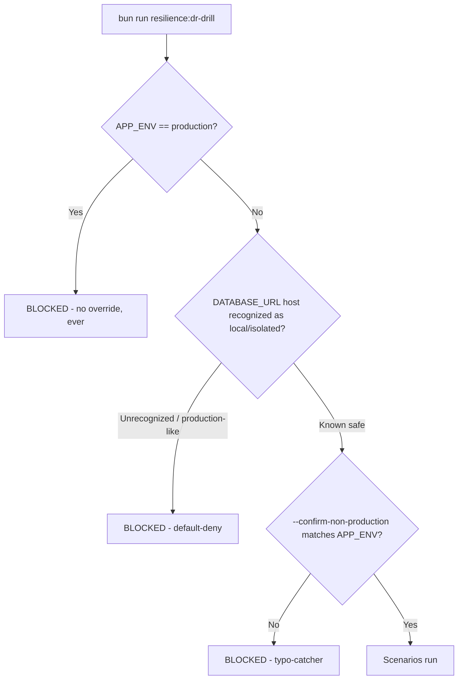

🇬🇧 English (source) · 🇮🇩 [Bahasa Indonesia](resilience-dr-verification.id.md)

# Resilience & Disaster-Recovery Verification

> **Document status (AWCMS, foundation-rebuild phase).** `bun run
resilience:dr-drill` and every scenario below are mechanisms that on the
> `awcms-mini` base are already fully implemented and verified
> (real signal, real process, real backup/restore). In AWCMS, **there is
> no code implementation for this tool yet** — the repo so far contains
> ADR/governance docs. This document describes the **target architecture
> and contract** that will be ported from the base as part of building
> AWCMS's technical foundation; read the "implemented"/"real" claims below
> as a specification that has to be met again during the port, not as the
> current running status.

Companion to [`production-preflight-runbook.md`](production-preflight-runbook.md)
and [`deployment-profiles.md`](deployment-profiles.md) — this doc covers
`bun run resilience:dr-drill` (`scripts/dr-drill.ts`), the failure-
injection and disaster-recovery verification tool, its scenario catalog,
and its safety model. It reuses the production preflight's
`authorizeApply` pattern, the backup/restore drill script, and the shared
worker runner (`src/lib/jobs/job-runner.ts`) rather than reimplementing
them.

## Why this exists

Documented recovery behavior (backup/restore, worker interruption
handling, provider-outage isolation) is only evidence once it has been
exercised under a controlled failure and produced a reproducible result.
Each of those mechanisms typically has its own dedicated test coverage
(integration tests for backup-restore drill, job runner, email dispatch,
…) but nothing ties them together into one DR-oriented run with a single
pass/fail verdict and RTO/RPO evidence — an operator preparing for go-live
(doc 07 §Go-live plan) needs a single command to answer "does our
documented recovery story actually hold, right now, in this environment?"
This is exactly as true for an ERP platform as it was for the CMS/POS base
this mechanism originates from — arguably more so, given the financial and
payroll data at stake.

## Safety interlock (non-negotiable)

`src/lib/resilience/target-guard.ts`'s `authorizeDrDrill` is the single
gate every run passes through before ANY scenario executes:



Two properties make this stricter than `production:preflight`'s own
`authorizeApply`, which it otherwise mirrors in shape (a single pure,
unit-tested gate function; an explicit
`--confirm-non-production=<APP_ENV value>` typo-catcher identical in
spirit to `--acknowledge-target`):

- **`APP_ENV=production` has NO override flag at all.** `authorizeApply`
  lets an operator apply migrations to production given the right
  evidence flags; a chaos/failure-injection tool has no equivalent
  legitimate use case against production, so this refusal cannot be
  bypassed by any combination of flags.
- **Default-deny on the database host.** `isProductionLikeTarget`
  recognizes a small allowlist of local/isolated hostnames
  (`localhost`/`127.0.0.1`/`::1`/`postgres`/`db`/`0.0.0.0`) and a denylist
  of known production-hosting patterns (RDS, Azure Database, Neon,
  Supabase, DigitalOcean, anything containing `prod`/`production`) — but
  an UNRECOGNIZED hostname is _also_ refused, not assumed safe. Widening
  the allowlist is a deliberate, reviewed code change
  (`src/lib/resilience/target-guard.ts`), never a runtime flag.

Unit tests target: `tests/unit/resilience-target-guard.test.ts`.
Integration proof that the CLI itself genuinely refuses (not just the pure
function): `tests/integration/dr-drill.integration.test.ts`.

## Scenario catalog

Every scenario (`src/lib/resilience/scenarios/*.ts`) is a
`ScenarioDefinition` with its own deterministic setup/execute/verify/
cleanup phases and an outer timeout enforced uniformly by
`src/lib/resilience/scenario-runner.ts`'s `runScenario`. Each scenario is
described below with an explicit **implemented / simulated / cross-
verified** disclosure — no scenario should claim to do more than it
actually does.

| Scenario                        | Tier | What it actually does                                                                                                                                                                                                                                                                                                                                 | Disclosure                                                                                                                                                                                                                                                                 |
| ------------------------------- | ---- | ----------------------------------------------------------------------------------------------------------------------------------------------------------------------------------------------------------------------------------------------------------------------------------------------------------------------------------------------------- | -------------------------------------------------------------------------------------------------------------------------------------------------------------------------------------------------------------------------------------------------------------------------- |
| `provider-outage-sso-discovery` | safe | Calls the REAL `discoverOidcConfiguration` against a guaranteed-unreachable `127.0.0.1:1` issuer; asserts a fast, bounded, non-throwing failure.                                                                                                                                                                                                      | **Implemented** — real function, simulated network target (a real outage is never induced against any real IdP).                                                                                                                                                           |
| `pool-saturation`               | safe | Drives the REAL `acquireWorkClassSlot`/`getWorkClassSaturation` gate (see [`database-pooling.md`](database-pooling.md)) to capacity, then over capacity.                                                                                                                                                                                              | **Implemented** — real in-process mechanism, no DB required.                                                                                                                                                                                                               |
| `postgres-disconnect`           | safe | Opens a real `Bun.SQL` connection, closes it client-side, confirms the next query fails, then reconnects with a fresh client and times the reconnect.                                                                                                                                                                                                 | **Simulated at the client level** — never stops/restarts the real Postgres process (that would be unsafe against a shared dev container). Proxies "how fast can the app recover a working connection", not "how long does Postgres itself take to restart".                |
| `worker-interruption`           | safe | Spawns a REAL long-job fixture as a separate OS process on top of the REAL `src/lib/jobs/job-runner.ts`, sends a genuine `SIGTERM`, then repeats with the same job name to prove the advisory lock was not left stuck. Once implemented, this should exercise an ERP-representative long job (e.g. a payroll batch or bulk stock adjustment fixture). | **Implemented** — real signal, real process, real advisory lock.                                                                                                                                                                                                           |
| `provider-outage-email`         | safe | Runs the REAL email dispatch queue end to end against a real Postgres, with a fake `EmailProvider` that fails once (simulating an outage) then succeeds (simulating recovery).                                                                                                                                                                        | **Implemented** for email; **cross-verified, not re-implemented, for R2/object sync** — object dispatch shares the identical outbox + circuit-breaker shape and has its own dedicated integration suite; re-deriving the same proof here would be redundant, not additive. |
| `backup-restore-drill`          | full | Runs the REAL `deploy/backup/restore-drill.sh` against an ephemeral, drill-only encryption/HMAC key pair and a dedicated disposable `awcms_dr_drill` database.                                                                                                                                                                                        | **Implemented** — real backup, real restore, real RLS/schema-migrations verification. `full` tier only (needs a version-matched `pg_dump`/`pg_restore`; skipped, not failed, when unavailable).                                                                            |

**Not separately implemented as a dr-drill scenario:** password/local
login independence from a down SSO IdP, beyond
`provider-outage-sso-discovery`'s function-level proof. A full HTTP-level
login-route test would need the complete integration-test HTTP harness
rather than a standalone CLI script; dedicated integration tests for MFA
and tenant-SSO flows should exercise the login routes independently and
never depend on an external IdP being reachable for the non-SSO paths.

**Also not a dr-drill scenario:** a hypothetical `data_lifecycle` module's
archive manifest checksum-verify-restore cycle would be a DIFFERENT
concern from `backup-restore-drill` above (a full-database backup/
restore) — it is a PER-TABLE, per-descriptor archive artifact independent
of the database backup itself. See [`data-lifecycle.md`](data-lifecycle.md)
§Archive port and restore procedure for the operator-facing restore
procedure once that module exists in AWCMS.

## RTO/RPO evidence

Each scenario records at least one latency metric in its `metrics` object
(part of the JSON report — see below); the two acceptance-criterion
metrics are:

- **Database restore RTO/RPO** — `backup-restore-drill`'s
  `restoreRtoSeconds` (wall-clock duration of the whole backup → restore →
  verify cycle) and `restoreRpoSeconds` (age of the backup used at the
  time of restore) — identical proxies `deploy/backup/restore-drill.sh`
  itself already reports.
- **Representative services** — `postgres-disconnect`'s
  `reconnectRtoMs` (DB connection recovery), `worker-interruption`'s
  `signalToExitMs`/`lockReacquireMs` (worker recovery after interruption),
  `provider-outage-sso-discovery`'s `failureLatencyMs` (bounded provider
  failure), `pool-saturation`'s `backpressureLatencyMs` (bounded queueing
  under load).

## Retry/idempotency evidence

`provider-outage-email` is the concrete proof that a retried operation
never duplicates its side effect: the scenario asserts exactly 2 provider
calls and exactly 2 recorded delivery attempts (1 failure + 1 success)
across a fail-then-recover cycle — a regression that caused a duplicate
send would fail this assertion. `worker-interruption`'s second run (same
job name, re-acquired promptly after the first interruption) is the
analogous proof for the advisory-lock path: a stuck lock would either
hang the retry (deadlock) or — the actually dangerous failure mode — let
two runs of the same job genuinely overlap. For AWCMS specifically, this
same proof is what will need to guarantee a payroll run or a financial
posting job never double-executes after an interruption.

## Machine-readable output

```bash
APP_ENV=test DATABASE_URL=postgres://...@localhost:.../db \
bun run resilience:dr-drill -- --confirm-non-production=test \
  --json-output=/tmp/dr-drill-report.json
```

Produces a report shaped like:

```json
{
  "startedAt": "2026-07-14T00:00:00.000Z",
  "finishedAt": "2026-07-14T00:00:01.500Z",
  "durationMs": 1500,
  "appEnv": "test",
  "tier": "safe",
  "scenarios": [
    {
      "name": "postgres-disconnect",
      "tier": "safe",
      "status": "pass",
      "detail": "...",
      "durationMs": 15,
      "metrics": { "reconnectRtoMs": 3.9 }
    }
  ],
  "overall": "pass"
}
```

`overall` is tri-state — mirroring `restore-drill.sh`'s own report shape
rather than a plain boolean:

- **`"pass"`** — every scenario genuinely ran and passed.
- **`"fail"`** — at least one scenario failed.
- **`"incomplete"`** — no failures, but at least one scenario was
  `"skipped"` (an environment constraint, e.g. no version-matched
  `pg_dump`) — a report reader can never mistake a skipped check for a
  verified pass.

`dr-drill.ts` exits non-zero unless `overall === "pass"`.

## CI safe subset vs. full drill cadence

- **CI (every PR):** the **safe** tier only —
  `provider-outage-sso-discovery`, `pool-saturation`,
  `postgres-disconnect`, `worker-interruption`, `provider-outage-email`.
  All five should be fast (well under a second each), make no real
  network calls, and never touch `pg_dump`/`pg_restore` version
  compatibility. Run with `APP_ENV=test` (never `production`) and
  `--confirm-non-production=test` — the safety interlock above makes it
  structurally impossible for this CI step to ever target anything
  production-like.
- **Full drill (`--full`, on demand or scheduled — NOT wired into every
  PR):** adds `backup-restore-drill`, a genuinely heavier real backup/
  restore round trip. Recommended cadence: alongside the existing
  scheduled restore-drill cron/CI job (doc 07 §Condensed restore SOP), and
  always as part of go-live H-7/H-3 rehearsal
  (`production-preflight-runbook.md` §Stage 1 — Rehearsal). Run it
  manually before a major release or infrastructure change:
  ```bash
  APP_ENV=test DATABASE_URL=<isolated-url> \
  bun run resilience:dr-drill -- --confirm-non-production=test --full
  ```
  `test` is not a stylistic choice: `APP_ENV=production` has no override flag
  (§Safety interlock), and `staging` is gone from the deployment-profile
  vocabulary entirely
  ([ADR-0083](../adr/0083-this-template-deploys-to-one-environment.md), as
  amended). The drill therefore always runs against an isolated database
  restored for the purpose — never against a live environment, whatever it is
  called.

## Runbook discrepancy (tracked follow-up, inherited from base)

Neither `production-preflight-runbook.md` nor doc 07 currently describes
an operator-facing recovery procedure for a systemd/cron worker (e.g. a
scheduled payroll job, an audit-log purge job) killed mid-run — the
underlying SIGTERM/timeout handling (`src/lib/jobs/job-runner.ts`) is a
separate concern from the runbook gap (what should an operator actually
DO if they see a `"terminated"`/`"timeout"` status in a worker's
telemetry?). The `worker-interruption` scenario's own proof (the advisory
lock is safely released, a retry is safe) is exactly the evidence an
operator-facing runbook entry would cite — **tracked as a follow-up**: add
a short "Worker interrupted mid-run" section to
`production-preflight-runbook.md` (or a new operational runbook)
describing: check the job's own JSON telemetry for
`status: "terminated"`/`"timeout"`, confirm no error alert needed (a
clean interruption is not a data-integrity incident), and simply re-run
the job — the advisory lock guarantees no overlap with any prior
still-running instance beyond the documented `lockReleaseGraceMs` (30s
default) grace window. This gap is doubly relevant for AWCMS given the
financial/payroll jobs on the roadmap.
</content>
