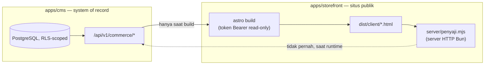

🇮🇩 Bahasa Indonesia · 🇬🇧 [English (source)](arsitektur.md)

<!-- i18n-source-hash: sha256:fc323a7cbc58947799ca88651d75eaa8d8db70e91499a75d7863f7b2fec2bfb5 -->

# Arsitektur

Apa yang benar-benar di-deploy oleh repositori ini hari ini, dan batasan yang menjaga kedua bagiannya agar tidak diam-diam saling menyusup. Dokumen ini mendeskripsikan increment 1 — fondasi plus satu irisan vertikal yang sudah ditulis (listing katalog dan detail produk), tanpa basis data hidup — sebagaimana ia ada di tree yang sudah digabung, bukan sebagaimana ia direncanakan. Lihat [`README.md`](../README.md) dan [`AGENTS.md`](../AGENTS.md) untuk tata letak workspace dan aturan kerja yang diasumsikan dokumen ini.

## Dua deployable, satu arah aliran data

| | `apps/cms` | `apps/storefront` |
| --- | --- | --- |
| Apa itu | `ahliweb/awcms` v10.3.0, di-embed utuh lewat `git subtree` (lihat [ADR-0001](adr/0001-git-subtree-with-full-history-for-apps-cms.md)) | Aplikasi Astro, `output: "static"` |
| Peran | System of record — PostgreSQL di bawah row-level security, API komersial | Situs katalog publik + detail produk |
| Berbicara ke | Basis data PostgreSQL-nya sendiri, saat request | API publik `apps/cms`, hanya saat **build** (lihat [ADR-0002](adr/0002-static-output-with-build-time-fetch-for-the-storefront.md)) |
| Kredensial runtime | Connection string basis data untuk `awcms_app`/`awcms_worker`/`awcms_setup` (lihat `apps/cms/.env.example`) | Tidak ada — `apps/storefront/server/penyaji.mjs` hanya membaca `PORT`/`HOST` |
| Dilayani oleh | Runtime Bun/Astro milik `apps/cms` sendiri | `apps/storefront/server/penyaji.mjs`, server HTTP Bun yang ditulis tangan, membungkus adapter `standalone` milik `@astrojs/node` |

**Storefront mengambil katalog saat build, dengan token Bearer read-only (`AWCMS_API_TOKEN`), dan tidak pernah menjangkau `apps/cms` atau basis datanya saat runtime.** `astro build` memanggil `GET /api/v1/commerce/{products,categories}` sekali, menyusuri setiap halaman hasil keyset-paginated, lalu memanggang hasilnya menjadi berkas HTML statis di bawah `dist/client/`. Begitu build itu selesai, container yang berjalan (`bun dist/server/penyaji.mjs`) hanya melayani berkas-berkas itu — ia tidak memegang token API, tidak membuka koneksi ke `apps/cms`, dan tidak punya jalur kode yang bisa menjangkau basis data sekalipun ia mau. Kompromi pada container storefront karena itu tidak menjangkau data pelanggan apa pun, karena memang tidak ada yang bisa dijangkau dari dalamnya.

**Trade-off dinyatakan terus terang:** harga dan stok hanya sesegar build terakhir. Untuk increment ini — listing katalog dan detail produk, tanpa keranjang, tanpa checkout — itu adalah trade-off yang tepat: tidak ada apa pun di halaman yang bisa bertindak atas harga basi. Pembacaan saat runtime menjadi perlu begitu checkout ada (untuk menghindari kelebihan jual stok atau salah kutip harga yang berubah setelah build terakhir), dan membuat perubahan itu harus menjadi keputusan yang disengaja dan diargumentasikan terpisah — dicatat sebagai ADR-nya sendiri saat itu terjadi — bukan sesuatu yang dimulai sebagai "cuma satu panggilan live" lalu diam-diam mengikis batas yang dideskripsikan dokumen ini. Lihat [ADR-0002](adr/0002-static-output-with-build-time-fetch-for-the-storefront.md) untuk penalaran lengkap dan tabel trade-off-nya.

## Arah impor: satu arah, `storefront → kontrak → cms`

`apps/storefront` tidak pernah mengimpor dari `apps/cms` secara langsung. `packages/kontrak` duduk di antara keduanya, meng-ekspor ulang `ProductType`/`ProductStatus` dari `apps/cms/src/modules/commerce/domain/*.ts` — lapisan murni tanpa I/O yang dijaga bersih oleh konvensi `apps/cms` sendiri — sebagai `export type` saja, tanpa nilai runtime. Arah ini dipaksakan secara mekanis: [`tests/kontrak-arah-impor.test.mjs`](../tests/kontrak-arah-impor.test.mjs) memindai setiap berkas `.ts`/`.tsx`/`.astro` di bawah `apps/cms/src/` dan gagal jika ada yang mengimpor dari `apps/storefront`, `packages/kontrak`, atau paket `@awcms-one/*`. Lihat [ADR-0004](adr/0004-a-type-only-contract-package-with-an-import-direction-gate.md) untuk alasan mengapa arah ini penting justru karena `apps/cms` adalah kode vendored, dan untuk bentuk-bentuk baris DTO (`CommerceProduct`/`CommerceCategory`) yang sengaja **tidak** diekspor-ulang oleh paket ini.

## Embed subtree, singkatnya

`apps/cms` adalah tree milik `ahliweb/awcms` sendiri, dibawa ke sini lengkap dengan riwayat commit lewat `git subtree`, bukan digantungkan sebagai paket — infrastruktur bersama yang dibutuhkan `commerce` (`withTenant`, `authorizeInTransaction`, `appendDomainEvent`, `recordAuditEvent`, kontrak modul, migration runner) tidak punya paket mandiri untuk digantungkan sebagai gantinya. Sinkronisasi dilakukan lewat `git subtree pull --prefix=apps/cms awcms main`, dan **PR yang menjalankannya harus digabung dengan merge commit — tidak pernah di-squash, tidak pernah di-rebase** — men-squash menghancurkan merge base yang dibutuhkan sinkronisasi berikutnya, secara tak kasatmata, sampai sinkronisasi berikutnya gagal jauh dari commit yang merusaknya. Lihat [ADR-0001](adr/0001-git-subtree-with-full-history-for-apps-cms.md) untuk perbandingan lengkap dengan `--squash` dan salinan vendored, serta [`AGENTS.md`](../AGENTS.md#the-subtree-embed) untuk mekanisme sinkronisasinya.

**Mengadopsi modul `commerce` saja menyentuh 29 berkas di luar direktori modulnya sendiri** — masing-masing adalah registry yang harus diikuti modul baru (`apps/cms/src/modules/index.ts`, registry tipe-event domain, menu sidebar, buku ledger cakupan layar admin, fragmen sumber OpenAPI/AsyncAPI) atau inventori yang dihasilkan ulang dari sumber (dokumen OpenAPI yang di-bundle, `apps/cms/docs/awcms/api-reference.md`, `repo-inventory.md`, inventori komposisi modul, katalog i18n) atau kenaikan kecil jumlah-modul dalam dokumentasi prosa. **Setelah setiap sinkronisasi subtree, perbaikannya adalah menjalankan ulang generator yang disebutkan `bun run check` di dalam `apps/cms` — jangan pernah menggabung berkas hasil-generate dengan tangan.** Apakah `commerce` sebaiknya di-upstream-kan ke `ahliweb/awcms` sendiri, sehingga pengadopsian modul di masa depan tiba di sini lewat sinkronisasi biasa alih-alih sebagai perubahan lokal 29-berkas, adalah keputusan tingkat keluarga-platform yang belum diambil; lihat bagian Consequences [ADR-0001](adr/0001-git-subtree-with-full-history-for-apps-cms.md) untuk daftar berkas lengkapnya.

## Apa irisan ini, dan apa yang bukan

Increment 1 adalah inti katalog saja: kategori hierarkis dan produk (`physical`/`digital`/`service`/`subscription`), diporting dari kolom inti `commerce_bj_mart`. **Belum dibangun di irisan ini**, disebutkan di sini karena pembaca yang menyusun gambaran utuh akan mengira sebaliknya: iklan, manajemen logo, gambar produk/media, halaman listing kategori, dan permukaan komersial yang lebih luas — keranjang, checkout, pembayaran, pesanan, pengiriman, varian, flash sale, tautan afiliasi, tiered pricing. Setiap satu di antaranya dirinci, lengkap dengan kolom atau tabel persisnya, di [`docs/kamus-data.md`](kamus-data.md) dan [`docs/cms.md`](cms.md).

Penyediaan PostgreSQL untuk increment 2 — memigrasikan dan men-seed basis data hidup — **belum dilakukan**: server produksi borneojek menjalankan MySQL, jadi instans PostgreSQL harus didirikan lebih dulu sebelum migrasi itu bisa dimulai. Lihat [`docs/deployment.md`](deployment.md).

## Bacaan lanjutan

- [`docs/adr/`](adr/README.md) — enam keputusan yang menjadi dasar arsitektur ini, masing-masing dengan tabel trade-off-nya sendiri.
- [`docs/skema-basis-data.md`](skema-basis-data.md), [`docs/kamus-data.md`](kamus-data.md) — skema dan pemetaan kolom-legacy-nya.
- [`docs/api.md`](api.md), [`docs/cms.md`](cms.md) — API komersial dan alur kerja authoring/publikasi di baliknya.
- [`docs/routing.md`](routing.md) — bagaimana URL storefront diturunkan.
- [`knowledge/curated/monorepo-map.md`](../knowledge/curated/monorepo-map.md) — tata letak workspace, secara struktural, sengaja dipisah dari dokumen ini karena berkas itu menamai STRUKTUR dan dokumen ini menamai KEPUTUSAN di baliknya.
