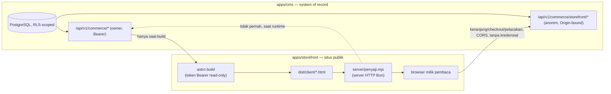
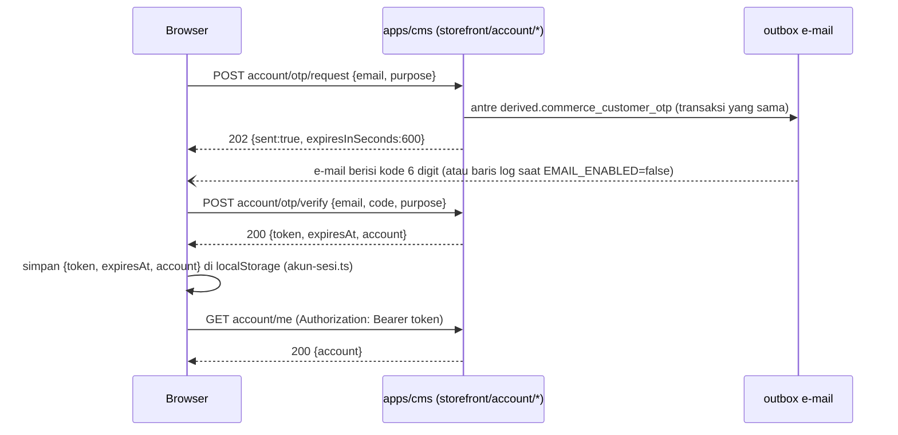
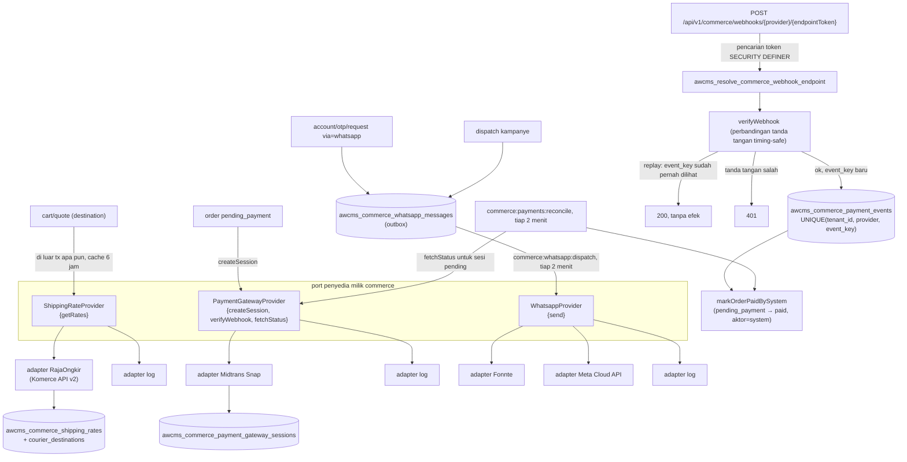

🇮🇩 Bahasa Indonesia · 🇬🇧 [English (source)](arsitektur.md)

<!-- i18n-source-hash: sha256:b27273145b23eaf6e82fd8cebf85a1f0a6ac686b21ae4d7c76271192669996bc -->

# Arsitektur

Apa yang benar-benar di-deploy oleh repositori ini hari ini, dan batasan yang menjaga kedua bagiannya agar tidak diam-diam saling menyusup. Dokumen ini mendeskripsikan increment 5 — paritas BjekMart/portal-berita milik increment 2, paritas fungsional dengan seputarborneo.com v2.4.0 yang ditambahkan epic [#46](https://github.com/ahliweb/awcms-one/issues/46) (media sungguhan, chrome berita, pemutar baca-nyaring, pengalihan lawas berbasis aturan, analitik first-party, lambang lembaga), epic akun-pelanggan/afiliasi [#32](https://github.com/ahliweb/awcms-one/issues/32) ([ADR-0016](adr/0016-customer-accounts-are-otp-verified-commerce-accounts-with-bearer-sessions.id.md)), dan epic fitur BjekMart khusus admin plus integrasi penyedia eksternal [#33](https://github.com/ahliweb/awcms-one/issues/33) ([ADR-0017](adr/0017-external-providers-are-commerce-owned-ports-with-env-credentials-and-token-addressed-webhooks.id.md) — ongkos kurir RajaOngkir, outbox WhatsApp, payment gateway Midtrans dengan intake webhook, POS, laporan penjualan, inbox, dan kampanye), tetap tanpa basis data produksi yang hidup — sebagaimana adanya di tree yang sudah digabung, bukan sebagaimana direncanakan. Lihat [`README.md`](../README.id.md) dan [`AGENTS.md`](../AGENTS.id.md) untuk tata letak workspace dan aturan kerja yang diasumsikan dokumen ini.

## Dua deployable, satu aliran data saat-build, satu seam runtime anonim

| | `apps/cms` | `apps/storefront` |
| --- | --- | --- |
| Apa itu | `ahliweb/awcms` v10.3.0, di-embed utuh lewat `git subtree` (lihat [ADR-0001](adr/0001-git-subtree-with-full-history-for-apps-cms.id.md)) | Aplikasi Astro, `output: "static"`, tidak ada rute `prerender = false` di mana pun (lihat [ADR-0002](adr/0002-static-output-with-build-time-fetch-for-the-storefront.id.md), diamendemen oleh [ADR-0007](adr/0007-cart-and-checkout-stay-static-the-browser-calls-anonymous-commerce-endpoints.id.md)) |
| Peran | System of record — PostgreSQL di bawah row-level security, API commerce yang menghadap owner, dan API commerce kedua yang anonim untuk pembeli tamu | Situs katalog publik, berita, dan belanja |
| Berbicara ke | Basis data PostgreSQL-nya sendiri, saat request | API owner `apps/cms` hanya saat **build** (server-side, token read-only); API storefront anonim `apps/cms` saat **runtime**, tapi hanya dari **browser milik pembaca sendiri** — tidak pernah dari container yang berjalan |
| Kredensial runtime | Connection string basis data untuk `awcms_app`/`awcms_worker`/`awcms_setup` (lihat `apps/cms/.env.example`) | Tidak ada — `apps/storefront/server/penyaji.mjs` hanya membaca `PORT`/`HOST`; panggilan browser ke `apps/cms` tidak membawa cookie maupun bearer token (`mode: "cors"`, `credentials: "omit"`) |
| Dilayani oleh | Runtime Bun/Astro milik `apps/cms` sendiri | `apps/storefront/server/penyaji.mjs`, server HTTP Bun yang ditulis tangan, membungkus adapter `standalone` milik `@astrojs/node` |

**Container yang menjalankan `apps/storefront` tidak pernah berbicara ke `apps/cms`.** `astro build` memanggil API owner `apps/cms` sekali, dengan token Bearer read-only (`AWCMS_API_TOKEN`), untuk memanggang katalog, berita, permukaan pemasaran, dan halaman statis menjadi HTML datar di bawah `dist/client/`. Begitu build itu selesai, `bun dist/server/penyaji.mjs` hanya melayani berkas-berkas itu dan tidak lebih — ia tidak memegang token API, tidak membuka koneksi ke `apps/cms`, dan tidak punya jalur kode yang bisa menjangkau basis data sekalipun ia mau. **Yang berubah di increment 2 adalah hubungan *browser* itu sendiri dengan `apps/cms`**, bukan hubungan container: keranjang, checkout, dan pelacakan pesanan adalah halaman statis yang JavaScript sisi-kliennya memanggil `https://<cms>/api/v1/commerce/storefront/*` langsung, lintas-origin, memakai `PUBLIC_AWCMS_ORIGIN` — nilai yang dipanggang saat build, sengaja dibuat publik (sebuah origin bukan rahasia; setiap URL media sudah mengungkapkannya). Inilah keseluruhan argumen [ADR-0007](adr/0007-cart-and-checkout-stay-static-the-browser-calls-anonymous-commerce-endpoints.id.md): kredensial runtime di dalam *container* ditolak karena kredensial mesin `apps/cms` memang read-only secara konstruksi (kredensial itu tidak pernah bisa membuat pesanan); keluarga endpoint anonim dan Origin-bound yang sudah dibangun `apps/cms` untuk permukaan newsletter/site-search/comments-nya adalah pola yang dipakai ulang di sini. Kompromi pada container storefront tetap tidak menjangkau data pelanggan apa pun, karena memang tidak ada yang bisa dijangkau dari dalamnya — pesanan, nomor telepon, instruksi pembayaran semuanya berjalan browser ↔ CMS langsung dan tidak pernah dicatat log atau disimpan oleh storefront.

**Trade-off dari ADR-0002 tidak berubah untuk semua hal kecuali harga dan stok pada saat menambahkan ke keranjang:** setiap halaman katalog dan berita tetap hanya sesegar build terakhir. Halaman keranjang meng-quote ulang setiap baris terhadap `apps/cms` secara live sebelum checkout (`POST .../storefront/cart/quote`), sehingga harga statis yang basi ditampilkan dan ditandai, tidak pernah dikenakan secara diam-diam.

## Tingkat kepercayaan ketiga: anonim → pelanggan terautentikasi, tetap tanpa cookie

Increment 2 memberi browser satu cara anonim dan Origin-bound untuk berbicara ke `apps/cms` (ADR-0007). Increment 4 menambahkan tingkat kedua di atasnya, tidak pernah menggantikannya: pembeli yang memverifikasi OTP e-mail mendapat satu baris `customer` (`awcms_commerce_customer_accounts`, 1:1 dengan `awcms_commerce_customers`) dan sesi bearer opak — tidak pernah tertaut ke `awcms_principals`, tabel kredensial staf, dan tidak pernah cookie ([ADR-0016](adr/0016-customer-accounts-are-otp-verified-commerce-accounts-with-bearer-sessions.id.md) D1/D3). Ketiga tingkat itu, secara konkret:

| Tingkat | Kredensial | Penyimpanan | Berbicara ke |
| --- | --- | --- | --- |
| Owner saat build | `AWCMS_API_TOKEN`, Bearer | Tidak dikirim ke browser | `/api/v1/commerce/*` dan setiap permukaan owner-only lain yang dipanggang `apps/storefront` ke HTML |
| Pembeli anonim | Tidak ada | Tidak ada yang persisten — hanya keranjang/wishlist `localStorage` | `/api/v1/commerce/storefront/*`, Origin-bound, sama sekali tanpa kredensial |
| Pelanggan terautentikasi | Token bearer opak berawalan `cs_`, di-hash `sha256:` saat disimpan di `awcms_commerce_customer_sessions` | `localStorage` (`awcms-one:akun:v1`), TTL bergeser 30 hari | Keluarga `/api/v1/commerce/storefront/account/*` yang sama, plus bearer OPSIONAL pada `POST orders`/`POST reviews` |

Bearer dikirim sebagai `Authorization: Bearer …`; CORS mendapat `authorization` di daftar header yang diizinkan untuk rute-rute ini tapi **tidak pernah** `Access-Control-Allow-Credentials` — token itu tidak pernah menjadi otoritas ambien, sehingga tidak ada permukaan CSRF baru untuk dipertahankan, sejalan dengan sikap tingkat anonim sendiri. `apps/storefront/src/lib/akun-sesi.ts` memiliki bentuk `{token, expiresAt, account}` yang tersimpan dan memicu event `akun:berubah` saat berubah; `apps/storefront/src/lib/akun-klien.ts` melampirkan header itu dan membersihkan sesi saat melihat `401 UNAUTHENTICATED` apa pun, sehingga token yang basi atau dicabut tidak pernah bertahan di sisi klien. Tabel akun itu sendiri — `awcms_commerce_customer_accounts`, `awcms_commerce_customer_otps`, `awcms_commerce_customer_sessions` — adalah tabel tenant-scoped, `FORCE ROW LEVEL SECURITY`, dimiliki sepenuhnya oleh `commerce` (`sql/917`); lihat [`docs/skema-basis-data.md`](skema-basis-data.id.md) untuk kolom-kolomnya.

Login/registrasi adalah OTP 6 digit yang dikirim lewat outbox milik modul `email` yang sudah ada, di bawah kategori template turunan `derived.commerce_customer_otp` yang di-seed migrasi `sql/919` (satu salinan EN+ID per tenant); ketika `EMAIL_ENABLED` bukan `"true"` (atau `EMAIL_PROVIDER=log`), kodenya pergi ke adapter `log` sebagai gantinya sehingga CI dan pengembangan lokal bisa menjalankan seluruh alurnya tanpa kredensial e-mail — lihat [`docs/cms.md`](cms.id.md) dan [`docs/deployment.md`](deployment.id.md) untuk alasan kedua env var itu load-bearing untuk login itu sendiri, bukan sekadar untuk e-mail keluar secara umum.

Tamu tidak kehilangan apa pun karena tidak mendaftar: setiap jalur anonim yang dikirim ADR-0007/ADR-0009 tidak berubah, `POST orders`/`POST reviews` tetap berfungsi tanpa header `Authorization` sama sekali, dan kedua endpoint OTP itu sendiri anonim (belum ada sesi untuk diperiksa). Lihat [`docs/api.md`](api.id.md) untuk tabel endpoint lengkap dan [`docs/routing.md`](routing.id.md) untuk halaman `/masuk`/`/daftar`/`/akun*` tempat UI tingkat ini hidup.

## CSP diturunkan dari konten, bukan dikonfigurasi

Foto produk, gambar slider/testimoni, dan — sejak increment 2 — origin CMS itu sendiri semuanya adalah hal yang baru diketahui build lewat fetch konten; CSP yang dikelola manual akan drift sejak saat merchandiser mengunggah gambar baru. Sebagai gantinya:

1. `apps/storefront/src/pages/csp.json.ts` — halaman yang selalu di-prerender setiap build tanpa syarat — mengumpulkan setiap origin gambar yang benar-benar dirujuk build (`img-src`) dari fetch ter-memoized yang sama yang dipakai me-render halaman, dan memanggil `requireAwcmsOrigin()` (`apps/storefront/src/lib/awcms/toko-origin.ts`) untuk menambahkan tepat satu origin `connect-src`: `PUBLIC_AWCMS_ORIGIN`. Nilai yang tidak diset atau malformed **menggagalkan build**, menyebut nama variabelnya — bukan kejutan saat runtime.
2. Hasilnya ditulis ke `dist/client/csp.json` (`{ version: 1, imgSrc: [...], connectSrc: [...] }`).
3. `apps/storefront/server/penyaji.mjs` membaca berkas itu **sekali, saat server startup** (bukan per-request), dan memvalidasi ulang setiap origin secara independen dari build yang menghasilkannya — menolak apa pun yang punya path, query, kredensial, wildcard, atau karakter separator, hanya menyisakan origin `http(s)` polos. Artefak yang hilang, malformed, atau versi tak dikenal jatuh kembali ke kebijakan baseline (`img-src 'self'`, `connect-src 'self'`): gambar dan API storefront berhenti bekerja, secara terlihat, alih-alih kebijakan diam-diam melebar melampaui apa yang benar-benar diminta build mana pun.

Ini mekanisme yang sama untuk kedua directive — entri `PUBLIC_AWCMS_ORIGIN` milik `connect-src` (issue #30) memakai ulang derivasi `img-src` yang dibangun issue #27, alih-alih menambah permukaan konfigurasi kedua.

Increment 3 memperluas penurunan yang sama alih-alih menggantinya ([ADR-0011](adr/0011-storefront-media-resolves-through-the-media-objects-endpoint.md)): `img-src` kini juga membawa origin setiap URL media yang benar-benar **ter-resolve** build lewat `GET /api/v1/media/objects` — sehingga baris yang masih menunjuk host media sebelumnya tetap tampil alih-alih diblokir — ditambah `https://i.ytimg.com`, dan `frame-src https://www.youtube-nocookie.com`, tetapi hanya ketika build itu memang memuat pos video. Origin milik GA4 sendiri (`script-src`/`connect-src`/`img-src`) muncul hanya ketika `PUBLIC_GA_ID` diisi; build bawaan sama sekali tidak punya origin pihak ketiga di kebijakannya ([ADR-0012](adr/0012-first-party-visitor-analytics-with-an-opt-in-ga4-switch.md)).

## Arah impor: satu jalur, `storefront → kontrak → cms`

`apps/storefront` tidak pernah mengimpor dari `apps/cms` secara langsung. `packages/kontrak` duduk di antara keduanya, mengekspor-ulang union type-only (`ProductType`, `ProductStatus`, `SizeChartType`, `SubscriptionPeriod`, `ServiceFormFieldType`, `ProductSort`, dan union pemasaran/order yang ditambahkan issue #26/#29) dari `apps/cms/src/modules/commerce/domain/*.ts` — lapisan murni bebas-I/O yang dijaga bersih oleh konvensi `apps/cms` sendiri — sebagai `export type` saja, tanpa nilai runtime. Arahnya ditegakkan secara mekanis: [`tests/kontrak-arah-impor.test.mjs`](../tests/kontrak-arah-impor.test.mjs) memindai setiap berkas `.ts`/`.tsx`/`.astro` di bawah `apps/cms/src/` dan gagal jika ada satu pun yang mengimpor dari `apps/storefront`, `packages/kontrak`, atau paket `@awcms-one/*`. Lihat [ADR-0004](adr/0004-a-type-only-contract-package-with-an-import-direction-gate.id.md) untuk alasan mengapa arah ini penting khususnya karena `apps/cms` adalah kode vendored.

## Embed subtree, secara singkat

`apps/cms` adalah tree milik `ahliweb/awcms` sendiri, dibawa ke sini dengan riwayat commit lengkap lewat `git subtree`, bukan digantungkan sebagai paket — infrastruktur bersama yang dibutuhkan `commerce` (`withTenant`, `authorizeInTransaction`, `appendDomainEvent`, `recordAuditEvent`, kontrak modul, migration runner) tidak punya paket standalone untuk digantungkan sebagai gantinya. Sinkronisasi dilakukan lewat `git subtree pull --prefix=apps/cms awcms main`, dan **PR yang menjalankannya harus digabung dengan merge commit — tidak pernah di-squash, tidak pernah di-rebase** — men-squash menghancurkan merge base yang dibutuhkan sinkronisasi berikutnya, secara tak kasatmata, sampai sinkronisasi berikutnya gagal jauh dari commit yang merusaknya. Lihat [ADR-0001](adr/0001-git-subtree-with-full-history-for-apps-cms.id.md) untuk perbandingan lengkap terhadap `--squash` dan salinan vendored, serta [`AGENTS.md`](../AGENTS.id.md#penyematan-subtree) untuk mekanisme sinkronisasinya.

**Mengadmisi modul `commerce` menyentuh 29 berkas di luar direktori modulnya sendiri** — masing-masing adalah registry yang harus diikuti modul baru, atau inventaris yang dihasilkan yang diturunkan ulang dari sumber, atau kenaikan kecil jumlah-modul dalam dokumentasi prosa. Increment 2 menjaga jumlah modul tetap satu, bukan tiga, khususnya untuk menghindari membayar biaya 29-berkas itu berulang kali — lihat [ADR-0008](adr/0008-one-commerce-module-carries-the-whole-store-not-three.md). **Setelah setiap sinkronisasi subtree, perbaikannya adalah menjalankan ulang generator yang disebutkan `bun run check` di dalam `apps/cms` — jangan pernah menggabung berkas hasil-generate dengan tangan.**

## Modul `commerce`: satu modul, tiga area, satu dependensi pada `media_library`

Per [ADR-0008](adr/0008-one-commerce-module-carries-the-whole-store-not-three.md), semua tabel, rute, izin, event, job, dan layar admin commerce hidup di bawah satu kunci modul `commerce`, dikelompokkan secara internal berdasarkan area (`domain/{catalog,marketing,orders}/…` adalah konvensi direktori, bukan batas modul):

- **Catalog** (issue #23) — kategori, produk (gambar, varian, harga bertingkat, size chart, form layanan, banner promo).
- **Marketing** (issue #26) — flash sale, voucher, slider, testimoni, popup, pengaturan toko yang di-versioning.
- **Orders** (issue #29) — pelanggan, alamat, quote keranjang, pesanan, konfirmasi pembayaran, ulasan, wishlist, dan permukaan `/api/v1/commerce/storefront/*` yang anonim.
- **Akun pelanggan dan afiliasi** (issue #32) — akun terverifikasi OTP, sesi bearer, dan program afiliasi ([ADR-0016](adr/0016-customer-accounts-are-otp-verified-commerce-accounts-with-bearer-sessions.id.md)).
- **Penyedia eksternal, POS, laporan, inbox, kampanye, dan sakelar fitur** (issue #33, [ADR-0017](adr/0017-external-providers-are-commerce-owned-ports-with-env-credentials-and-token-addressed-webhooks.id.md)) — ongkos kurir RajaOngkir, outbox WhatsApp dan kanal OTP, payment gateway Midtrans dengan intake webhook publik dan rekonsiliasi, penjualan POS di toko (`orders.channel`, `payment_method = cash`), laporan penjualan berbasis proyeksi `reporting`, inbox pelanggan, kampanye marketing yang di-gate consent, dan sakelar fitur per tenant plus harga bertingkat saat quote — lihat "Penyedia eksternal" di bawah.

`dependencies` milik `module.ts` adalah `tenant_admin`, `identity_access`, `domain_event_runtime`, `media_library` (gambar produk/slider/testimoni/popup di-resolve lewat `MediaLibraryPort`), dan `module_management` (pengecekan fail-closed milik tenant-resolver storefront anonim). Lihat [`docs/skema-basis-data.md`](skema-basis-data.id.md), [`docs/kamus-data.md`](kamus-data.id.md), [`docs/api.md`](api.id.md), dan [`docs/cms.md`](cms.id.md) untuk isi modul ini secara mendalam, dan [`apps/cms/src/modules/commerce/README.md`](../apps/cms/src/modules/commerce/README.id.md) untuk dokumentasinya sendiri yang berdekatan-kode.

## Penyedia eksternal: port dan outbox di dalam `commerce`, tidak pernah panggilan sinkron di jalur pesanan

Increment 5 (epic [#33](https://github.com/ahliweb/awcms-one/issues/33)) menambahkan integrasi HTTP eksternal pertama milik `commerce` — agregator ongkos kurir (RajaOngkir), pengirim WhatsApp (Fonnte/Meta Cloud API), dan payment gateway (Midtrans Snap). [ADR-0017](adr/0017-external-providers-are-commerce-owned-ports-with-env-credentials-and-token-addressed-webhooks.id.md) (D1) menetapkan bentuknya sekali, dan ketiganya mengikutinya: interface port kecil, satu atau lebih adapter yang dipilih lewat env var, adapter `log` untuk dev/CI, `withTimeout` plus `getProviderCircuitBreaker`, dan — untuk apa pun yang bergantung padanya jalur pesanan — tabel outbox sehingga panggilan penyedia tidak pernah terjadi di dalam transaksi basis data yang mengubah status pesanan (disiplin yang sama yang sudah ditetapkan [ADR-0010](adr/0010-manual-payment-and-alternative-courier-first-gateways-via-outbox.id.md) untuk konfirmasi pembayaran dan catatan kurir).

| Port penyedia | Adapter (env `COMMERCE_*_PROVIDER`) | Tabel outbox / cache | Job dispatcher / purge |
| --- | --- | --- | --- |
| `ShippingRateProvider` (issue #107) | `rajaongkir`, `log` | `awcms_commerce_shipping_rates` (TTL 6 jam, per tenant/origin/destination/weight-bucket/kurir), `awcms_commerce_courier_destinations` | `commerce:shipping-rates:purge` (tiap jam) |
| `WhatsappProvider` (issue #108) | `fonnte`, `meta`, `log` | `awcms_commerce_whatsapp_messages` (+ `awcms_commerce_whatsapp_delivery_attempts`) | `commerce:whatsapp:dispatch` (tiap 2 menit), `commerce:whatsapp:purge` (tiap 15 menit) |
| `PaymentGatewayProvider` (issue #110/#113) | `midtrans`, `log` | `awcms_commerce_payment_gateway_sessions`, `awcms_commerce_payment_events` (buku besar anti-replay), `awcms_commerce_webhook_endpoints` (token di-hash) | `commerce:payments:reconcile` (tiap 2 menit) |

**Webhook masuk tidak pernah mempercayai payload untuk identitas tenant.** `POST /api/v1/commerce/webhooks/{provider}/{endpointToken}` publik me-resolve `(tenant, provider)` dari token per-tenant yang opak dan di-hash lewat fungsi bootstrap `SECURITY DEFINER` yang meniru `awcms_resolve_tenant_domain_lookup` — body webhook yang mengklaim `tenant_id` akan menjadi oracle yang tidak terverifikasi, sesuai tabel alternatif-yang-ditolak milik ADR-0017 D2 sendiri. Perlindungan replay adalah constraint `UNIQUE (tenant_id, provider, event_key)` pada `awcms_commerce_payment_events`, sehingga pengiriman at-least-once milik penyedia menjadi idempoten: event yang di-replay tetap menjawab `200`, hanya tanpa efek samping kedua. Ketidakcocokan jumlah antara `gross_amount` webhook dan total pesanan sendiri dicatat (`outcome = 'amount_mismatch'`) tapi tidak pernah menandai pesanan lunas — `sql/934` menambahkan guard itu setelah #110 dikirim, menutup celah yang ditandai #113. Karena webhook bisa hilang dalam perjalanan, `commerce:payments:reconcile` mem-poll `fetchStatus` setiap sesi gateway yang masih `pending`/`created` pada jadwalnya sendiri — jalur `markOrderPaidBySystem` yang sama yang dipakai handler webhook, sehingga webhook yang hilang menyembuhkan dirinya sendiri dalam interval job itu alih-alih membuat pesanan terdampar selamanya di `pending_payment`.

## Satu hal lagi yang dilakukan server: memperbaiki halaman yang terbayangi

`apps/storefront/server/penyaji.mjs` tetap server berkas statis tanpa token API, tetapi kini melakukan satu penulisan ulang internal di luar dua lapisan pengalihan: di bawah `build.format: "file"`, halaman landing yang juga punya anak dipancarkan sebagai berkas **di samping** direktori bernama sama (`berita.html` di sebelah `berita/`), dan static handler `@astrojs/node` menulis ulang permintaan berbentuk direktori menjadi `index.html` yang tidak pernah ditulis build ini — sehingga `/berita`, `/video`, dan setiap `/rubrik/{slug}` menjawab 404 di situs yang disajikan padahal semua gerbang build hijau ([issue #75](https://github.com/ahliweb/awcms-one/issues/75)). Server menemukan halaman terbayangi itu sekali saat startup dan menulis ulang `req.url` menjadi `{path}.html` sebagai langkah **terakhir** sebelum adapter, setelah `/healthz`, redirect `/products`, dan kedua lapisan pengalihan lawas, sehingga tidak ada yang dilakukannya bisa membayangi sebuah pengalihan. Lihat [`docs/routing.id.md`](routing.id.md) dan [ADR-0013](adr/0013-rule-based-legacy-redirects-beside-the-row-based-map.md).

## Apa yang masih belum ada di sini

Yang ditangguhkan D6 [ADR-0016](adr/0016-customer-accounts-are-otp-verified-commerce-accounts-with-bearer-sessions.id.md) dan tidak diambil increment 5: ubah e-mail/telepon pada akun yang sudah ada, dan verifikasi telepon. Yang dicatat [ADR-0017](adr/0017-external-providers-are-commerce-owned-ports-with-env-credentials-and-token-addressed-webhooks.id.md) sebagai follow-up eksplisit di belakang port yang sudah dibangunnya: adapter Xendit di belakang port `PaymentGatewayProvider` yang sama, dan pelacakan kurir (tarif sudah selesai; melacak paket yang sudah dikirim belum). Upload berbasis-R2 yang nyata untuk gambar produk, media slider, dan gambar bukti konfirmasi-pembayaran (skrip seed memakai SVG placeholder yang dibuat sendiri dan endpoint upload bukti-pembayaran anonim menjawab `503 MEDIA_UNAVAILABLE` — lihat [`docs/deployment.md`](deployment.id.md) dan [`docs/cms.md`](cms.id.md)); deployment PostgreSQL produksi (`postgres:18.4` milik `compose.yaml` hanya kemudahan lokal/CI — lihat [`docs/deployment.md`](deployment.id.md)); layar admin backup basis data (secara eksplisit dikeluarkan dari cakupan issue #33 sebagai urusan operasi — lihat [`docs/deployment.md`](deployment.id.md)); notifikasi push pelanggan (kampanye saat ini hanya menjangkau e-mail dan WhatsApp — subscription push masih per-staf hari ini, bukan per-pelanggan).

## Bacaan lanjutan

- [`docs/adr/`](adr/README.id.md) — tujuh belas keputusan yang menjadi landasan arsitektur ini, masing-masing dengan tabel trade-off-nya sendiri.
- [`docs/skema-basis-data.md`](skema-basis-data.id.md), [`docs/kamus-data.md`](kamus-data.id.md) — skema dan pemetaan kolom legacy-nya.
- [`docs/api.md`](api.id.md), [`docs/cms.md`](cms.id.md) — API commerce (owner dan anonim) dan alur kerja authoring/publishing di baliknya.
- [`docs/routing.md`](routing.id.md) — peta URL publik lengkap.
- [`knowledge/curated/monorepo-map.md`](../knowledge/curated/monorepo-map.md) — tata letak workspace, secara struktural, dijaga terpisah dari dokumen ini karena berkas itu menamai STRUKTUR dan dokumen ini menamai KEPUTUSAN di baliknya.
