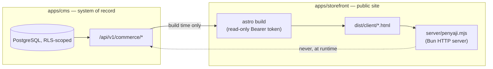

🇬🇧 English (source) · 🇮🇩 [Bahasa Indonesia](arsitektur.id.md)

# Architecture

What this repository actually deploys today, and the boundaries that keep its two halves from quietly growing into each other. This document describes increment 1 — foundation plus one authored vertical slice (catalog listing and product detail), no live database — as it exists in the merged tree, not as it was planned. See [`README.md`](../README.md) and [`AGENTS.md`](../AGENTS.md) for the workspace layout and working rules this document assumes.

## Two deployables, one direction of data flow

| | `apps/cms` | `apps/storefront` |
| --- | --- | --- |
| What it is | `ahliweb/awcms` v10.3.0, embedded whole via `git subtree` (see [ADR-0001](adr/0001-git-subtree-with-full-history-for-apps-cms.md)) | An Astro app, `output: "static"` |
| Role | The system of record — PostgreSQL under row-level security, the commerce API | The public catalog + product detail site |
| Talks to | Its own PostgreSQL database, at request time | `apps/cms`'s public API, at **build** time only (see [ADR-0002](adr/0002-static-output-with-build-time-fetch-for-the-storefront.md)) |
| Runtime credential | Database connection strings for `awcms_app`/`awcms_worker`/`awcms_setup` (see `apps/cms/.env.example`) | None — `apps/storefront/server/penyaji.mjs` reads only `PORT`/`HOST` |
| Served by | `apps/cms`'s own Bun/Astro runtime | `apps/storefront/server/penyaji.mjs`, a hand-written Bun HTTP server wrapping `@astrojs/node`'s `standalone` adapter |

**The storefront fetches the catalog at build time, with a read-only Bearer token (`AWCMS_API_TOKEN`), and never reaches `apps/cms` or its database at runtime.** `astro build` calls `GET /api/v1/commerce/{products,categories}` once, walks every page of the keyset-paginated result, and bakes the outcome into flat HTML files under `dist/client/`. Once that build finishes, the running container (`bun dist/server/penyaji.mjs`) serves those files and nothing else — it holds no API token, opens no connection to `apps/cms`, and has no code path that could reach the database even if it wanted to. A compromise of the storefront container therefore reaches no customer data, because there is none to reach from inside it.

**The trade-off is stated plainly:** price and stock are only ever as fresh as the last build. For this increment — catalog listing and product detail, no cart, no checkout — that is the right trade: nothing on the page can yet act on a stale price. A runtime read becomes necessary the moment checkout exists (to avoid overselling stock or misquoting a price that changed after the last build), and making that change must be a deliberate, separately argued decision — recorded as its own ADR when it happens — not something that starts as "just one live call" and quietly erodes the boundary this document describes. See [ADR-0002](adr/0002-static-output-with-build-time-fetch-for-the-storefront.md) for the full reasoning and the trade-off table.

## Import direction: one way, `storefront → kontrak → cms`

`apps/storefront` never imports from `apps/cms` directly. `packages/kontrak` sits between them, re-exporting `ProductType`/`ProductStatus` from `apps/cms/src/modules/commerce/domain/*.ts` — the pure, I/O-free layer `apps/cms`'s own convention keeps clean — as `export type` only, no runtime value. The direction is mechanically enforced: [`tests/kontrak-arah-impor.test.mjs`](../tests/kontrak-arah-impor.test.mjs) scans every `.ts`/`.tsx`/`.astro` file under `apps/cms/src/` and fails if any of them imports from `apps/storefront`, `packages/kontrak`, or an `@awcms-one/*` package. See [ADR-0004](adr/0004-a-type-only-contract-package-with-an-import-direction-gate.md) for why this direction matters specifically because `apps/cms` is vendored code, and for the DTO row shapes (`CommerceProduct`/`CommerceCategory`) this package deliberately does **not** re-export.

## The subtree embed, in brief

`apps/cms` is `ahliweb/awcms`'s own tree, carried here with full commit history via `git subtree` rather than depended on as a package — the shared infrastructure `commerce` needs (`withTenant`, `authorizeInTransaction`, `appendDomainEvent`, `recordAuditEvent`, the module contract, the migration runner) has no standalone package to depend on instead. Sync is `git subtree pull --prefix=apps/cms awcms main`, and **a PR that runs it must be merged with a merge commit — never squashed, never rebased** — squashing destroys the merge base the next sync needs, invisibly, until the next sync fails far from the commit that broke it. See [ADR-0001](adr/0001-git-subtree-with-full-history-for-apps-cms.md) for the full comparison against `--squash` and a vendored copy, and [`AGENTS.md`](../AGENTS.md#the-subtree-embed) for the sync mechanics.

**Admitting the `commerce` module alone touched 29 files outside its own module directory** — every one of them a registry a new module must join (`apps/cms/src/modules/index.ts`, the domain-event-type registry, the sidebar menu, the admin-screen coverage ledger, the OpenAPI/AsyncAPI source fragments) or a generated inventory that re-derives from source (the bundled OpenAPI document, `apps/cms/docs/awcms/api-reference.md`, `repo-inventory.md`, the module-composition inventory, i18n catalogs) or a small module-count bump in prose documentation. **After every subtree sync, the fix is to re-run the generators `bun run check` inside `apps/cms` names — never to hand-merge a generated file.** Whether `commerce` should instead be upstreamed into `ahliweb/awcms` itself, so a future module admission arrives here via ordinary sync rather than as a 29-file local change, is a family-platform decision that has not been taken; see [ADR-0001](adr/0001-git-subtree-with-full-history-for-apps-cms.md)'s Consequences for the full file list.

## What this slice is, and what it is not

Increment 1 is the catalog core only: hierarchical categories and products (`physical`/`digital`/`service`/`subscription`), ported from `commerce_bj_mart`'s core columns. **Not built in this slice**, named here because a reader assembling the whole picture would otherwise assume it exists somewhere: advertising, logo management, product/media images, category listing pages, and the wider commerce surface — cart, checkout, payment, orders, shipping, variants, flash sales, affiliate links, tiered pricing. Every one of these is detailed, with the exact column or table it would need, in [`docs/kamus-data.md`](kamus-data.md) and [`docs/cms.md`](cms.md).

PostgreSQL provisioning for increment 2 — migrating and seeding a live database — is **not done**: borneojek's production server runs MySQL, so a PostgreSQL instance has to be stood up before that migration can even begin. See [`docs/deployment.md`](deployment.md).

## Further reading

- [`docs/adr/`](adr/README.md) — the six decisions this architecture rests on, each with its own trade-off table.
- [`docs/skema-basis-data.md`](skema-basis-data.md), [`docs/kamus-data.md`](kamus-data.md) — the schema and the legacy-column mapping.
- [`docs/api.md`](api.md), [`docs/cms.md`](cms.md) — the commerce API and the authoring/publishing workflow behind it.
- [`docs/routing.md`](routing.md) — how the storefront's URLs are derived.
- [`knowledge/curated/monorepo-map.md`](../knowledge/curated/monorepo-map.md) — the workspace layout, structurally, kept separate from this document because that file names the STRUCTURE and this one names the DECISIONS behind it.
