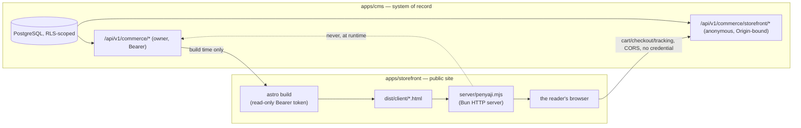

🇬🇧 English (source) · 🇮🇩 [Bahasa Indonesia](arsitektur.id.md)

# Architecture

What this repository actually deploys today, and the boundaries that keep its two halves from quietly growing into each other. This document describes increment 3 — increment 2's BjekMart/news-portal parity plus the functional parity with seputarborneo.com v2.4.0 that epic [#46](https://github.com/ahliweb/awcms-one/issues/46) added (real media, the news chrome, the read-aloud player, rule-based legacy redirects, first-party analytics, the institution emblem), still with no live production database — as it exists in the merged tree, not as it was planned. See [`README.md`](../README.md) and [`AGENTS.md`](../AGENTS.md) for the workspace layout and working rules this document assumes.

## Two deployables, one build-time data flow, one anonymous runtime seam

| | `apps/cms` | `apps/storefront` |
| --- | --- | --- |
| What it is | `ahliweb/awcms` v10.3.0, embedded whole via `git subtree` (see [ADR-0001](adr/0001-git-subtree-with-full-history-for-apps-cms.md)) | An Astro app, `output: "static"`, no `prerender = false` route anywhere (see [ADR-0002](adr/0002-static-output-with-build-time-fetch-for-the-storefront.md), amended by [ADR-0007](adr/0007-cart-and-checkout-stay-static-the-browser-calls-anonymous-commerce-endpoints.md)) |
| Role | The system of record — PostgreSQL under row-level security, the owner-facing commerce API, and a second, anonymous commerce API for guest shoppers | The public catalog, news, and shopping site |
| Talks to | Its own PostgreSQL database, at request time | `apps/cms`'s owner API at **build** time only (server-side, read-only token); `apps/cms`'s anonymous storefront API at **runtime**, but only from the **reader's own browser** — never from the running container |
| Runtime credential | Database connection strings for `awcms_app`/`awcms_worker`/`awcms_setup` (see `apps/cms/.env.example`) | None — `apps/storefront/server/penyaji.mjs` reads only `PORT`/`HOST`; the browser's calls to `apps/cms` carry no cookie and no bearer token (`mode: "cors"`, `credentials: "omit"`) |
| Served by | `apps/cms`'s own Bun/Astro runtime | `apps/storefront/server/penyaji.mjs`, a hand-written Bun HTTP server wrapping `@astrojs/node`'s `standalone` adapter |

**The container running `apps/storefront` never talks to `apps/cms`.** `astro build` calls `apps/cms`'s owner API once, with a read-only Bearer token (`AWCMS_API_TOKEN`), to bake the catalog, news, marketing surfaces and static pages into flat HTML under `dist/client/`. Once that build finishes, `bun dist/server/penyaji.mjs` serves those files and nothing else — it holds no API token, opens no connection to `apps/cms`, and has no code path that could reach the database even if it wanted to. **What changed in increment 2 is the *browser*'s own relationship to `apps/cms`**, not the container's: cart, checkout, and order tracking are static pages whose client-side JavaScript calls `https://<cms>/api/v1/commerce/storefront/*` directly, cross-origin, using `PUBLIC_AWCMS_ORIGIN` — a build-time-baked, deliberately public value (an origin is not a secret; every media URL already reveals it). This is the whole of [ADR-0007](adr/0007-cart-and-checkout-stay-static-the-browser-calls-anonymous-commerce-endpoints.md)'s argument: a runtime credential in the *container* was rejected because `apps/cms`'s machine credentials are read-only by construction anyway (they could never create an order); the anonymous, Origin-bound endpoint family `apps/cms` already built for its newsletter/site-search/comments surfaces is the pattern reused here instead. A compromise of the storefront container still reaches no customer data, because there is none to reach from inside it — an order, a phone number, a payment instruction all travel browser ↔ CMS directly and are never logged or stored by the storefront.

**The trade-off from ADR-0002 is unchanged for everything except price and stock at the moment of adding to cart:** every catalog and news page is still only as fresh as the last build. The cart page re-quotes every line against `apps/cms` live before checkout (`POST .../storefront/cart/quote`), so a stale static price is shown and flagged, never silently charged.

## The CSP is derived from content, not configured

Product photos, slider/testimonial images, and — since increment 2 — the CMS origin itself are all things a build only learns about by fetching content; a hand-maintained CSP would drift from the moment a merchandiser uploads a new image. Instead:

1. `apps/storefront/src/pages/csp.json.ts` — a page every build unconditionally prerenders — collects every image origin the build actually referenced (`img-src`) from the same memoized fetches the pages rendered from, and calls `requireAwcmsOrigin()` (`apps/storefront/src/lib/awcms/toko-origin.ts`) to add exactly one `connect-src` origin: `PUBLIC_AWCMS_ORIGIN`. An unset or malformed value **fails the build**, naming the variable — not a runtime surprise.
2. The result is written to `dist/client/csp.json` (`{ version: 1, imgSrc: [...], connectSrc: [...] }`).
3. `apps/storefront/server/penyaji.mjs` reads that file **once, at server startup** (not per-request), and re-validates every origin independently of the build that produced it — rejecting anything with a path, query, credential, wildcard, or separator character, keeping only a bare `http(s)` origin. A missing, malformed, or unknown-version artifact falls back to the baseline policy (`img-src 'self'`, `connect-src 'self'`): images and the storefront API stop working, visibly, rather than the policy silently widening past what any build actually asked for.

This is the same mechanism for every directive — `connect-src`'s `PUBLIC_AWCMS_ORIGIN` entry (issue #30) reuses the `img-src` derivation issue #27 built, rather than adding a second configuration surface.

Increment 3 extended the same derivation rather than replacing it ([ADR-0011](adr/0011-storefront-media-resolves-through-the-media-objects-endpoint.md)): `img-src` now also carries the origin of every media URL the build actually **resolved** through `GET /api/v1/media/objects` — so a row still pointing at a previous media host renders instead of being blocked — plus `https://i.ytimg.com`, and `frame-src https://www.youtube-nocookie.com`, but only when the build really contains a video post. GA4's own origins (`script-src`/`connect-src`/`img-src`) appear only when `PUBLIC_GA_ID` is set; a default build has no third-party origin in its policy at all ([ADR-0012](adr/0012-first-party-visitor-analytics-with-an-opt-in-ga4-switch.md)).

## Import direction: one way, `storefront → kontrak → cms`

`apps/storefront` never imports from `apps/cms` directly. `packages/kontrak` sits between them, re-exporting type-only unions (`ProductType`, `ProductStatus`, `SizeChartType`, `SubscriptionPeriod`, `ServiceFormFieldType`, `ProductSort`, and the marketing/order unions issues #26/#29 added) from `apps/cms/src/modules/commerce/domain/*.ts` — the pure, I/O-free layer `apps/cms`'s own convention keeps clean — as `export type` only, no runtime value. The direction is mechanically enforced: [`tests/kontrak-arah-impor.test.mjs`](../tests/kontrak-arah-impor.test.mjs) scans every `.ts`/`.tsx`/`.astro` file under `apps/cms/src/` and fails if any of them imports from `apps/storefront`, `packages/kontrak`, or an `@awcms-one/*` package. See [ADR-0004](adr/0004-a-type-only-contract-package-with-an-import-direction-gate.md) for why this direction matters specifically because `apps/cms` is vendored code.

## The subtree embed, in brief

`apps/cms` is `ahliweb/awcms`'s own tree, carried here with full commit history via `git subtree` rather than depended on as a package — the shared infrastructure `commerce` needs (`withTenant`, `authorizeInTransaction`, `appendDomainEvent`, `recordAuditEvent`, the module contract, the migration runner) has no standalone package to depend on instead. Sync is `git subtree pull --prefix=apps/cms awcms main`, and **a PR that runs it must be merged with a merge commit — never squashed, never rebased** — squashing destroys the merge base the next sync needs, invisibly, until the next sync fails far from the commit that broke it. See [ADR-0001](adr/0001-git-subtree-with-full-history-for-apps-cms.md) for the full comparison against `--squash` and a vendored copy, and [`AGENTS.md`](../AGENTS.md#the-subtree-embed) for the sync mechanics.

**Admitting the `commerce` module touched 29 files outside its own module directory** — every one of them a registry a new module must join, or a generated inventory that re-derives from source, or a small module-count bump in prose documentation. Increment 2 kept the module count at one rather than three specifically to avoid paying that 29-file cost repeatedly — see [ADR-0008](adr/0008-one-commerce-module-carries-the-whole-store-not-three.md). **After every subtree sync, the fix is to re-run the generators `bun run check` inside `apps/cms` names — never to hand-merge a generated file.**

## The `commerce` module: one module, three areas, a dependency on `media_library`

Per [ADR-0008](adr/0008-one-commerce-module-carries-the-whole-store-not-three.md), all commerce tables, routes, permissions, events, jobs and admin screens live under the single module key `commerce`, grouped internally by area (`domain/{catalog,marketing,orders}/…` is a directory convention, not a module boundary):

- **Catalog** (issue #23) — categories, products (images, variants, tiered pricing, size charts, service forms, promo banners).
- **Marketing** (issue #26) — flash sales, vouchers, sliders, testimonials, a popup, versioned store settings.
- **Orders** (issue #29) — customers, addresses, cart quoting, orders, payment confirmations, reviews, wishlists, and the anonymous `/api/v1/commerce/storefront/*` surface.

`module.ts`'s `dependencies` are `tenant_admin`, `identity_access`, `domain_event_runtime`, `media_library` (product/slider/testimonial/popup images resolve through `MediaLibraryPort`), and `module_management` (the anonymous storefront tenant-resolver's fail-closed check). See [`docs/skema-basis-data.md`](skema-basis-data.md), [`docs/kamus-data.md`](kamus-data.md), [`docs/api.md`](api.md), and [`docs/cms.md`](cms.md) for the module's contents in depth, and [`apps/cms/src/modules/commerce/README.md`](../apps/cms/src/modules/commerce/README.md) for its own, code-adjacent documentation.

## One more thing the server does: it repairs a shadowed page

`apps/storefront/server/penyaji.mjs` is still a static file server with no API token, but it now performs one internal rewrite beyond the two redirect layers: under `build.format: "file"` a landing page that also has children is emitted as a file **beside** a directory of the same name (`berita.html` next to `berita/`), and `@astrojs/node`'s static handler rewrites the directory-shaped request to an `index.html` this build never writes — so `/berita`, `/video` and every `/rubrik/{slug}` answered 404 on the served site while every build gate was green ([issue #75](https://github.com/ahliweb/awcms-one/issues/75)). The server discovers those shadowed pages once at startup and rewrites `req.url` to `{path}.html` as the **last** step before the adapter, after `/healthz`, the `/products` redirect and both legacy-redirect layers, so nothing it does can shadow a redirect. See [`docs/routing.md`](routing.md) and [ADR-0013](adr/0013-rule-based-legacy-redirects-beside-the-row-based-map.md).

## What is still not here

Customer accounts (login, synced wishlist/addresses/reviews, the affiliate program — [issue #32](https://github.com/ahliweb/awcms-one/issues/32)); a live RajaOngkir courier-rate integration and a payment gateway (both must be called through `apps/cms`'s outbox, never synchronously on the order path, per [ADR-0010](adr/0010-manual-payment-and-alternative-courier-first-gateways-via-outbox.md) — [issue #33](https://github.com/ahliweb/awcms-one/issues/33)); POS and management reporting (issue #33); a real R2-backed upload for product images, slider media, and payment-confirmation proof images (the seed script uses self-generated placeholder SVGs and the anonymous payment-proof upload endpoint answers `503 MEDIA_UNAVAILABLE` — see [`docs/deployment.md`](deployment.md) and [`docs/cms.md`](cms.md)); a production PostgreSQL deployment (`compose.yaml`'s `postgres:18.4` is a local/CI convenience only — see [`docs/deployment.md`](deployment.md)).

## Further reading

- [`docs/adr/`](adr/README.md) — ten decisions this architecture rests on, each with its own trade-off table.
- [`docs/skema-basis-data.md`](skema-basis-data.md), [`docs/kamus-data.md`](kamus-data.md) — the schema and the legacy-column mapping.
- [`docs/api.md`](api.md), [`docs/cms.md`](cms.md) — the commerce API (owner and anonymous) and the authoring/publishing workflow behind it.
- [`docs/routing.md`](routing.md) — the full public URL map.
- [`knowledge/curated/monorepo-map.md`](../knowledge/curated/monorepo-map.md) — the workspace layout, structurally, kept separate from this document because that file names the STRUCTURE and this one names the DECISIONS behind it.
