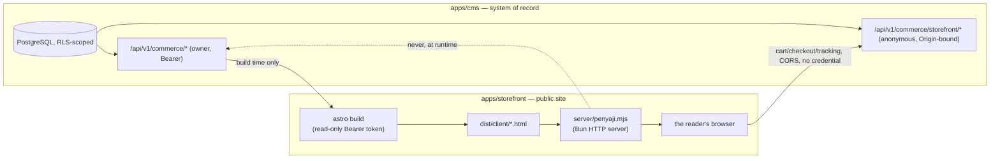
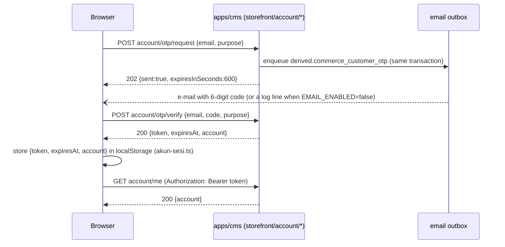
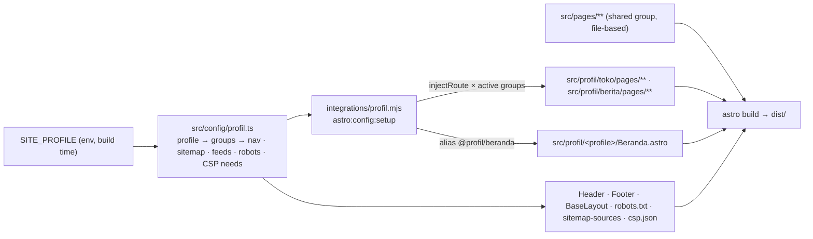
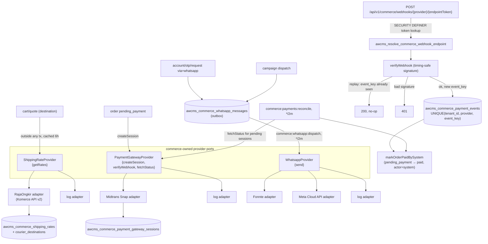

🇬🇧 English (source) · 🇮🇩 [Bahasa Indonesia](arsitektur.id.md)

# Architecture

What this repository actually deploys today, and the boundaries that keep its two halves from quietly growing into each other — as it exists in the merged tree, not as it was planned. See [`docs/status.md`](status.md) for the current-state summary this document's own detail backs up, and [`README.md`](../README.md) and [`AGENTS.md`](../AGENTS.md) for the workspace layout and working rules this document assumes.

## Two deployables, one build-time data flow, one anonymous runtime seam

```mermaid
flowchart LR
  subgraph "apps/cms — system of record"
    DB[(PostgreSQL, RLS-scoped)]
    OwnerAPI["/api/v1/commerce/* (owner, Bearer)"]
    PublicAPI["/api/v1/commerce/storefront/* (anonymous, Origin-bound)"]
    DB --> OwnerAPI
    DB --> PublicAPI
  end

  subgraph "apps/storefront — public site"
    Build["astro build\n(read-only Bearer token)"]
    Files["dist/client/*.html"]
    Penyaji["server/penyaji.mjs\n(Bun HTTP server)"]
    Browser["the reader's browser"]
    Build --> Files --> Penyaji --> Browser
  end

  OwnerAPI -- "build time only" --> Build
  Penyaji -. "never, at runtime" .-> OwnerAPI
  Browser -- "cart/checkout/tracking, CORS, no credential" --> PublicAPI
```

| | `apps/cms` | `apps/storefront` |
| --- | --- | --- |
| What it is | `ahliweb/awcms` v10.3.0, embedded whole via `git subtree` (see [ADR-0001](adr/0001-git-subtree-with-full-history-for-apps-cms.md)) | An Astro app, `output: "static"`, no `prerender = false` route anywhere (see [ADR-0002](adr/0002-static-output-with-build-time-fetch-for-the-storefront.md), amended by [ADR-0007](adr/0007-cart-and-checkout-stay-static-the-browser-calls-anonymous-commerce-endpoints.md)) |
| Role | The system of record — PostgreSQL under row-level security, the owner-facing commerce API, and a second, anonymous commerce API for guest shoppers | The public catalog, news, and shopping site |
| Talks to | Its own PostgreSQL database, at request time | `apps/cms`'s owner API at **build** time only (server-side, read-only token); `apps/cms`'s anonymous storefront API at **runtime**, but only from the **reader's own browser** — never from the running container |
| Runtime credential | Database connection strings for `awcms_app`/`awcms_worker`/`awcms_setup` (see `apps/cms/.env.example`) | None — `apps/storefront/server/penyaji.mjs` reads only `PORT`/`HOST`; the browser's calls to `apps/cms` carry no cookie and no bearer token (`mode: "cors"`, `credentials: "omit"`) |
| Served by | `apps/cms`'s own Bun/Astro runtime | `apps/storefront/server/penyaji.mjs`, a hand-written Bun HTTP server wrapping `@astrojs/node`'s `standalone` adapter |

**The container running `apps/storefront` never talks to `apps/cms`.** `astro build` calls `apps/cms`'s owner API once, with a read-only Bearer token (`AWCMS_API_TOKEN`), to bake the catalog, news, marketing surfaces and static pages into flat HTML under `dist/client/`. Once that build finishes, `bun dist/server/penyaji.mjs` serves those files and nothing else — it holds no API token, opens no connection to `apps/cms`, and has no code path that could reach the database even if it wanted to. **What changed in increment 2 is the *browser*'s own relationship to `apps/cms`**, not the container's: cart, checkout, and order tracking are static pages whose client-side JavaScript calls `https://<cms>/api/v1/commerce/storefront/*` directly, cross-origin, using `PUBLIC_AWCMS_ORIGIN` — a build-time-baked, deliberately public value (an origin is not a secret; every media URL already reveals it). This is the whole of [ADR-0007](adr/0007-cart-and-checkout-stay-static-the-browser-calls-anonymous-commerce-endpoints.md)'s argument: a runtime credential in the *container* was rejected because `apps/cms`'s machine credentials are read-only by construction anyway (they could never create an order); the anonymous, Origin-bound endpoint family `apps/cms` already built for its newsletter/site-search/comments surfaces is the pattern reused here instead. A compromise of the storefront container still reaches no customer data, because there is none to reach from inside it — an order, a phone number, a payment instruction all travel browser ↔ CMS directly and are never logged or stored by the storefront.

**The trade-off from ADR-0002 is unchanged for everything except price and stock at the moment of adding to cart:** every catalog and news page is still only as fresh as the last build. The cart page re-quotes every line against `apps/cms` live before checkout (`POST .../storefront/cart/quote`), so a stale static price is shown and flagged, never silently charged.

## A third trust tier: anonymous → authenticated customer, still no cookie

Increment 2 gave the browser one anonymous, Origin-bound way to talk to `apps/cms` (ADR-0007). Increment 4 adds a second tier on top of it, never replacing it: a shopper who verifies an e-mail OTP gets a `customer` row (`awcms_commerce_customer_accounts`, 1:1 with `awcms_commerce_customers`) and an opaque bearer session — never a link to `awcms_principals`, the staff credential table, and never a cookie ([ADR-0016](adr/0016-customer-accounts-are-otp-verified-commerce-accounts-with-bearer-sessions.md) D1/D3). The three tiers, concretely:

| Tier | Credential | Storage | Talks to |
| --- | --- | --- | --- |
| Build-time owner | `AWCMS_API_TOKEN`, Bearer | Not shipped to the browser | `/api/v1/commerce/*` and every other owner-only surface `apps/storefront` bakes into HTML |
| Anonymous shopper | None | Nothing durable — `localStorage` cart/wishlist only | `/api/v1/commerce/storefront/*`, Origin-bound, no credential at all |
| Authenticated customer | Opaque `cs_`-prefixed bearer token, `sha256:`-hashed at rest in `awcms_commerce_customer_sessions` | `localStorage` (`awcms-one:akun:v1`), 30-day sliding TTL | The same `/api/v1/commerce/storefront/account/*` family, plus an *optional* bearer on `POST orders`/`POST reviews` |

The bearer is sent as `Authorization: Bearer …`; CORS gains `authorization` in its allowed-headers list for these routes but **never** `Access-Control-Allow-Credentials` — the token is never ambient authority, so there is no new CSRF surface to defend, matching the anonymous tier's own posture. `apps/storefront/src/lib/akun-sesi.ts` owns the stored `{token, expiresAt, account}` shape and fires an `akun:berubah` event on change; `apps/storefront/src/lib/akun-klien.ts` attaches the header and clears the session on any `401 UNAUTHENTICATED` it sees, so a stale or revoked token never lingers client-side. The account tables themselves — `awcms_commerce_customer_accounts`, `awcms_commerce_customer_otps`, `awcms_commerce_customer_sessions` — are tenant-scoped, `FORCE ROW LEVEL SECURITY` tables owned entirely by `commerce` (`sql/917`); see [`docs/skema-basis-data.md`](skema-basis-data.md) for their columns.

Login/registration is a 6-digit OTP delivered through the `email` module's existing outbox, under a derived template category `derived.commerce_customer_otp` seeded by migration `sql/919` (an EN+ID copy per tenant); when `EMAIL_ENABLED` is not `"true"` (or `EMAIL_PROVIDER=log`), the code goes to a `log` adapter instead so CI and local development can exercise the whole flow without mail credentials — see [`docs/cms.md`](cms.md) and [`docs/deployment.md`](deployment.md) for why those two env vars are load-bearing for login itself, not just for outbound mail generally.

```mermaid
sequenceDiagram
  participant Browser
  participant CMS as apps/cms (storefront/account/*)
  participant Outbox as email outbox
  Browser->>CMS: POST account/otp/request {email, purpose}
  CMS->>Outbox: enqueue derived.commerce_customer_otp (same transaction)
  CMS-->>Browser: 202 {sent:true, expiresInSeconds:600}
  Outbox--)Browser: e-mail with 6-digit code (or a log line when EMAIL_ENABLED=false)
  Browser->>CMS: POST account/otp/verify {email, code, purpose}
  CMS-->>Browser: 200 {token, expiresAt, account}
  Browser->>Browser: store {token, expiresAt, account} in localStorage (akun-sesi.ts)
  Browser->>CMS: GET account/me  (Authorization: Bearer token)
  CMS-->>Browser: 200 {account}
```

A guest never loses anything by not registering: every anonymous path ADR-0007/ADR-0009 shipped is unchanged, `POST orders`/`POST reviews` still work with no `Authorization` header at all, and the two OTP endpoints are themselves anonymous (no session exists yet to check). See [`docs/api.md`](api.md) for the full endpoint table and [`docs/routing.md`](routing.md) for the `/masuk`/`/daftar`/`/akun*` pages this tier's UI lives behind.

## One storefront, three build profiles (issue #137, [ADR-0018](adr/0018-awcms-one-is-a-template-with-build-profiles-and-an-idempotent-init.md) D2/D3)

The same `apps/storefront` tree builds three different sites, decided once, at build time, by `SITE_PROFILE`: `toko` (the default — commerce + news, BjekMart's own shape, byte-for-byte what the app built before #137), `berita` (news only) and `landing` (company profile: home, static pages, contact). This is what lets this repository be a template ([ADR-0018 D1](adr/0018-awcms-one-is-a-template-with-build-profiles-and-an-idempotent-init.md), [`docs/template.md`](template.md)) without a second codebase: a derived deployment ships only the pages it needs, and an unused profile's pages are never built — not built-and-hidden.

```mermaid
flowchart LR
  ENV["SITE_PROFILE (env, build time)"] --> P["src/config/profil.ts<br/>profile → groups → nav · sitemap · feeds · robots · CSP needs"]
  P --> I["integrations/profil.mjs<br/>astro:config:setup"]
  I -->|"injectRoute × active groups"| R["src/profil/toko/pages/** · src/profil/berita/pages/**"]
  I -->|"alias @profil/beranda"| H["src/profil/&lt;profile&gt;/Beranda.astro"]
  S["src/pages/** (shared group, file-based)"] --> B["astro build → dist/"]
  R --> B
  H --> B
  P --> C["Header · Footer · BaseLayout · robots.txt · sitemap-sources · csp.json"]
  C --> B
```

The mechanism has three parts and one rule:

1. **[`apps/storefront/src/config/profil.ts`](../apps/storefront/src/config/profil.ts)** is the single source. It reads `SITE_PROFILE` through the same `readEnv` chain as `SITE_URL` (unknown value → the build fails naming the variable; unset → `toko`), maps a profile to its page groups (`toko` = `shared`+`toko`+`berita`, `berita` = `shared`+`berita`, `landing` = `shared`), and derives from `apps/storefront/src/config/routes.ts`'s `ROUTE_GROUPS` annotation everything a consumer needs: the nav set, the search surface, footer links, sitemap sources, feeds, `robots.txt` rules, and what the CSP artifact has to read. It fetches nothing and touches no file system, so its unit test covers all three profiles in one process.
2. **[`apps/storefront/integrations/profil.mjs`](../apps/storefront/integrations/profil.mjs)** — the app's only Astro integration — turns groups into routes in `astro:config:setup`, before Astro scans `apps/storefront/src/pages/`: for every file under an active group's `src/profil/<group>/pages/**` it calls `injectRoute` with the pattern file-based routing would have derived and a project-root-relative entrypoint. An inactive group's directory is never walked, so its `getStaticPaths()` never runs and its data is never fetched — the excluded pages are absent from `dist/` by construction, which is exactly what ADR-0018 D3 rejected runtime 404 guards in favour of. It also points the `@profil/beranda` alias at the profile's home variant, so `apps/storefront/src/pages/index.astro` (shared) renders per-profile content with only one variant in the module graph.
3. **The consumers** — `Header`/`Footer`/`BaseLayout`, `robots.txt.ts`, `sitemap-sources.ts`/`sitemap-katalog.ts`, `csp.json.ts`, the server's legacy-redirect gate — read `profil.ts` and nothing else. The rule: **no file decides a group twice.** A route's group is stated once, in `ROUTE_GROUPS`; a page file's group is stated once, by the directory it lives in; `docs/template.md`'s profile matrix is the human-readable copy, and [`apps/storefront/tests/profil-integrasi.test.ts`](../apps/storefront/tests/profil-integrasi.test.ts) parses that table and fails when the tree disagrees with it.

Nothing about the static/runtime rule above changes per profile: every profile is still `output: "static"` with build-time fetch, still calls `apps/cms` anonymously from the browser where it must (the newsletter form on `berita`, the visitor beacon everywhere), and still serves through the same `penyaji.mjs`, which needs no profile flag — it derives what the build contains from `dist/` at startup, as it already did for the CSP artifact and the legacy-redirect map. The CSP derivation below reads only the content groups the profile has (product/marketing images with `toko`, article media and the YouTube facade with `berita`), while `connect-src` carries `PUBLIC_AWCMS_ORIGIN` on every profile because the beacon runs on every profile — a correction to ADR-0018's own matrix, made from the code. CI builds and smoke-tests every profile on every push ([`docs/pengujian.md`](pengujian.md), "The build-profile tier").

## The CSP is derived from content, not configured

Product photos, slider/testimonial images, and — since increment 2 — the CMS origin itself are all things a build only learns about by fetching content; a hand-maintained CSP would drift from the moment a merchandiser uploads a new image. Instead:

1. `apps/storefront/src/pages/csp.json.ts` — a page every build unconditionally prerenders — collects every image origin the build actually referenced (`img-src`) from the same memoized fetches the pages rendered from, and calls `requireAwcmsOrigin()` (`apps/storefront/src/lib/awcms/toko-origin.ts`) to add exactly one `connect-src` origin: `PUBLIC_AWCMS_ORIGIN`. An unset or malformed value **fails the build**, naming the variable — not a runtime surprise.
2. The result is written to `dist/client/csp.json` (`{ version: 1, imgSrc: [...], connectSrc: [...] }`).
3. `apps/storefront/server/penyaji.mjs` reads that file **once, at server startup** (not per-request), and re-validates every origin independently of the build that produced it — rejecting anything with a path, query, credential, wildcard, or separator character, keeping only a bare `http(s)` origin. A missing, malformed, or unknown-version artifact falls back to the baseline policy (`img-src 'self'`, `connect-src 'self'`): images and the storefront API stop working, visibly, rather than the policy silently widening past what any build actually asked for.

This is the same mechanism for every directive — `connect-src`'s `PUBLIC_AWCMS_ORIGIN` entry (issue #30) reuses the `img-src` derivation issue #27 built, rather than adding a second configuration surface.

Increment 3 extended the same derivation rather than replacing it ([ADR-0011](adr/0011-storefront-media-resolves-through-the-media-objects-endpoint.md)): `img-src` now also carries the origin of every media URL the build actually **resolved** through `GET /api/v1/media/objects` — so a row still pointing at a previous media host renders instead of being blocked — plus `https://i.ytimg.com`, and `frame-src https://www.youtube-nocookie.com`, but only when the build really contains a video post. GA4's own origins (`script-src`/`connect-src`/`img-src`) appear only when `PUBLIC_GA_ID` is set; a default build has no third-party origin in its policy at all ([ADR-0012](adr/0012-first-party-visitor-analytics-with-an-opt-in-ga4-switch.md)).

## Import direction: one way, `storefront → kontrak → cms`

`apps/storefront` never imports from `apps/cms` directly. `packages/kontrak` sits between them, re-exporting type-only unions (`ProductType`, `ProductStatus`, `SizeChartType`, `SubscriptionPeriod`, `ServiceFormFieldType`, `ProductSort`, and the marketing/order unions issues #26/#29 added) from `apps/cms/src/modules/commerce/domain/*.ts` — the pure, I/O-free layer `apps/cms`'s own convention keeps clean — as `export type` only, no runtime value. The direction is mechanically enforced: [`tests/kontrak-arah-impor.test.mjs`](../tests/kontrak-arah-impor.test.mjs) scans every `.ts`/`.tsx`/`.astro` file under `apps/cms/src/` and fails if any of them imports from `apps/storefront`, `packages/kontrak`, or an `@awcms-one/*` package. See [ADR-0004](adr/0004-a-type-only-contract-package-with-an-import-direction-gate.md) for why this direction matters specifically because `apps/cms` is vendored code.

## The subtree embed, in brief

`apps/cms` is `ahliweb/awcms`'s own tree, carried here with full commit history via `git subtree` rather than depended on as a package — the shared infrastructure `commerce` needs (`withTenant`, `authorizeInTransaction`, `appendDomainEvent`, `recordAuditEvent`, the module contract, the migration runner) has no standalone package to depend on instead. Sync is `git subtree pull --prefix=apps/cms awcms main`, and **a PR that runs it must be merged with a merge commit — never squashed, never rebased** — squashing destroys the merge base the next sync needs, invisibly, until the next sync fails far from the commit that broke it. See [ADR-0001](adr/0001-git-subtree-with-full-history-for-apps-cms.md) for the full comparison against `--squash` and a vendored copy, and [`AGENTS.md`](../AGENTS.md#the-subtree-embed) for the sync mechanics.

**Admitting the `commerce` module touched 29 files outside its own module directory** — every one of them a registry a new module must join, or a generated inventory that re-derives from source, or a small module-count bump in prose documentation. Increment 2 kept the module count at one rather than three specifically to avoid paying that 29-file cost repeatedly — see [ADR-0008](adr/0008-one-commerce-module-carries-the-whole-store-not-three.md). **After every subtree sync, the fix is to re-run the generators `bun run check` inside `apps/cms` names — never to hand-merge a generated file.**

## The `commerce` module: one module, three areas, a dependency on `media_library`

Per [ADR-0008](adr/0008-one-commerce-module-carries-the-whole-store-not-three.md), all commerce tables, routes, permissions, events, jobs and admin screens live under the single module key `commerce`, grouped internally by area (`domain/{catalog,marketing,orders}/…` is a directory convention, not a module boundary):

- **Catalog** (issue #23) — categories, products (images, variants, tiered pricing, size charts, service forms, promo banners).
- **Marketing** (issue #26) — flash sales, vouchers, sliders, testimonials, a popup, versioned store settings.
- **Orders** (issue #29) — customers, addresses, cart quoting, orders, payment confirmations, reviews, wishlists, and the anonymous `/api/v1/commerce/storefront/*` surface.
- **Customer accounts and affiliates** (issue #32) — OTP-verified accounts, bearer sessions, and the affiliate program ([ADR-0016](adr/0016-customer-accounts-are-otp-verified-commerce-accounts-with-bearer-sessions.md)).
- **External providers, POS, reports, inbox, campaigns, and feature toggles** (issue #33, [ADR-0017](adr/0017-external-providers-are-commerce-owned-ports-with-env-credentials-and-token-addressed-webhooks.md)) — RajaOngkir courier rates, a WhatsApp outbox and OTP channel, a Midtrans payment gateway with public webhook intake and reconciliation, in-store POS sales (`orders.channel`, `payment_method = cash`), `reporting`-projection sales reports, a customer inbox, consent-gated marketing campaigns, and per-tenant feature toggles plus tiered pricing at quote — see "External providers" below.

`module.ts`'s `dependencies` are `tenant_admin`, `identity_access`, `domain_event_runtime`, `media_library` (product/slider/testimonial/popup images resolve through `MediaLibraryPort`), and `module_management` (the anonymous storefront tenant-resolver's fail-closed check). See [`docs/skema-basis-data.md`](skema-basis-data.md), [`docs/kamus-data.md`](kamus-data.md), [`docs/api.md`](api.md), and [`docs/cms.md`](cms.md) for the module's contents in depth, and [`apps/cms/src/modules/commerce/README.md`](../apps/cms/src/modules/commerce/README.md) for its own, code-adjacent documentation.

## External providers: ports and outboxes inside `commerce`, never a synchronous call on the order path

Increment 5 (epic [#33](https://github.com/ahliweb/awcms-one/issues/33)) added `commerce`'s first external HTTP integrations — a courier-rate aggregator (RajaOngkir), a WhatsApp sender (Fonnte/Meta Cloud API), and a payment gateway (Midtrans Snap). [ADR-0017](adr/0017-external-providers-are-commerce-owned-ports-with-env-credentials-and-token-addressed-webhooks.md) (D1) settled the shape once, and every one of the three follows it: a small port interface, one or more adapters selected by an env var, a `log` adapter for dev/CI, `withTimeout` plus `getProviderCircuitBreaker`, and — for anything the order path depends on — an outbox table so the provider call never happens inside the database transaction that changes order state (this is the same discipline [ADR-0010](adr/0010-manual-payment-and-alternative-courier-first-gateways-via-outbox.md) already established for payment confirmations and courier notes).

```mermaid
flowchart TB
  subgraph Ports["commerce-owned provider ports"]
    SRP["ShippingRateProvider\n{getRates}"]
    PGP["PaymentGatewayProvider\n{createSession, verifyWebhook, fetchStatus}"]
    WAP["WhatsappProvider\n{send}"]
  end

  SRP --> RajaOngkir["RajaOngkir adapter\n(Komerce API v2)"]
  SRP --> LogShip["log adapter"]
  PGP --> Midtrans["Midtrans Snap adapter"]
  PGP --> LogPay["log adapter"]
  WAP --> Fonnte["Fonnte adapter"]
  WAP --> Meta["Meta Cloud API adapter"]
  WAP --> LogWA["log adapter"]

  Quote["cart/quote (destination)"] -->|"outside any tx, cached 6h"| SRP
  RajaOngkir --> RatesCache[("awcms_commerce_shipping_rates\n+ courier_destinations")]

  Order["order pending_payment"] -->|createSession| PGP
  Midtrans --> GatewaySessions[("awcms_commerce_payment_gateway_sessions")]

  OtpReq["account/otp/request via=whatsapp"] --> WAOutbox[("awcms_commerce_whatsapp_messages\n(outbox)")]
  Campaign["campaign dispatch"] --> WAOutbox
  WAOutbox -->|"commerce:whatsapp:dispatch, */2m"| WAP

  Webhook["POST /api/v1/commerce/webhooks/{provider}/{endpointToken}"] -->|"SECURITY DEFINER token lookup"| Resolve["awcms_resolve_commerce_webhook_endpoint"]
  Resolve --> Verify["verifyWebhook (timing-safe signature)"]
  Verify -->|"ok, new event_key"| Events[("awcms_commerce_payment_events\nUNIQUE(tenant_id, provider, event_key)")]
  Events --> MarkPaid["markOrderPaidBySystem\n(pending_payment → paid, actor=system)"]
  Verify -->|"replay: event_key already seen"| Ack200["200, no-op"]
  Verify -->|"bad signature"| Reject401["401"]

  Reconcile["commerce:payments:reconcile, */2m"] -->|"fetchStatus for pending sessions"| PGP
  Reconcile --> MarkPaid
```

| Provider port | Adapters (env `COMMERCE_*_PROVIDER`) | Outbox / cache table | Dispatcher / purge job |
| --- | --- | --- | --- |
| `ShippingRateProvider` (issue #107) | `rajaongkir`, `log` | `awcms_commerce_shipping_rates` (TTL 6h, per tenant/origin/destination/weight-bucket/courier), `awcms_commerce_courier_destinations` | `commerce:shipping-rates:purge` (hourly) |
| `WhatsappProvider` (issue #108) | `fonnte`, `meta`, `log` | `awcms_commerce_whatsapp_messages` (+ `awcms_commerce_whatsapp_delivery_attempts`) | `commerce:whatsapp:dispatch` (`*/2m`), `commerce:whatsapp:purge` (`*/15m`) |
| `PaymentGatewayProvider` (issues #110/#113) | `midtrans`, `log` | `awcms_commerce_payment_gateway_sessions`, `awcms_commerce_payment_events` (replay ledger), `awcms_commerce_webhook_endpoints` (token-hashed) | `commerce:payments:reconcile` (`*/2m`) |

**Inbound webhooks never trust the payload for tenant identity.** A public `POST /api/v1/commerce/webhooks/{provider}/{endpointToken}` resolves `(tenant, provider)` from an opaque, hashed per-tenant token via a `SECURITY DEFINER` bootstrap function modelled on `awcms_resolve_tenant_domain_lookup` — a webhook body claiming a `tenant_id` would be an unverified oracle, per ADR-0017 D2's own rejected-alternatives table. Replay protection is a `UNIQUE (tenant_id, provider, event_key)` constraint on `awcms_commerce_payment_events`, so a provider's at-least-once delivery is idempotent: a replayed event still answers `200`, just without a second side effect. An amount mismatch between the webhook's `gross_amount` and the order's own total is recorded (`outcome = 'amount_mismatch'`) but never marks the order paid — `sql/934` added that guard after #110 shipped, closing the gap #113 flagged. Because webhooks can be dropped in transit, `commerce:payments:reconcile` polls every still-`pending`/`created` gateway session's `fetchStatus` on its own schedule — the same `markOrderPaidBySystem` path the webhook handler uses, so a lost webhook self-heals within the job's own interval rather than stranding an order in `pending_payment` forever.

## Payments are a ledger, not a column (issue #285, [ADR-0025](adr/0025-payments-are-an-allocation-ledger-separate-from-order-status.md))

Every way money reaches an order — a POS tender, an accepted manual-transfer confirmation, a staff-recorded payment, a verified gateway webhook or reconcile result — writes ONE append-only table, `awcms_commerce_payment_allocations`, and nothing else decides "paid". Settlement is derived from the rows (`Σ succeeded payments − Σ succeeded reversals`); `orders.payment_status` is a cache of that derivation; the order lifecycle moves to `paid` through the one existing `transitionOrderStatus` when settlement reaches the order's release threshold, never by a path of its own. Every writer locks the order row first (`FOR NO KEY UPDATE`, so FK key-share locks from child inserts cannot deadlock it), which is what makes two concurrent final payments safe; the ledger's unique `source_key` is the independent second guard behind the shared idempotency store. `awcms_app` cannot `DELETE` a ledger row and a trigger freezes every column but the `pending → succeeded|failed` gateway-leg transition. The module-local import graph stays one-way: `payment-allocation-directory.ts` imports nothing from `order-directory.ts` and is handed a release callback; `payment-recording.ts` composes the two. No provider call enters any of these transactions (a gateway leg is opened after the provider returned and resolved by the verified webhook/reconcile result).
## Loyalty points: an append-only ledger fed by domain events ([ADR-0026](adr/0026-loyalty-points-are-an-append-only-ledger.md))

Loyalty is inside `commerce` and touches no order, POS, pricing or payment-webhook code. Every paid path already publishes `order.paid` and every cancellation `order.cancelled`; two `domain_event_runtime` consumers (`commerce.order_paid_loyalty_earner`, `commerce.order_cancelled_loyalty_reverser`, registered beside the entitlement grantor) turn those into `awcms_commerce_loyalty_ledger` rows. The ledger is the truth and `awcms_commerce_loyalty_accounts.balance` a projection of it, kept in the same transaction as each insert under a row lock — `application/loyalty-ledger.ts`'s `appendLedgerEntry` is the only writer — which is what makes two concurrent redemptions safe without a retry loop. Two jobs sit beside it: `commerce:loyalty:expire` (append-only, idempotent) and a read-only `commerce:loyalty:reconcile`. The whole feature is behind `features.loyalty`, default off, and the customer-facing endpoint is the same bearer-session pattern as the rest of the account surface (no cookie, customer id from the session only).

## A shift is a derivation over the ledger (issue #284, [ADR-0028](adr/0028-pos-register-sessions-and-cash-up.md))

A cash-up does not keep its own totals. The expected closing amount per tender is a sum over rows that already exist and cannot be edited — the payment-allocation ledger's legs stamped with the session, plus the session's append-only drawer movements — computed under the session-row lock and snapshotted once onto the close lines. The stamp is what makes it exact (a time window over `created_at` is not: a leg's timestamp is its transaction's start). The session row carries three lock modes — `FOR SHARE` for a sale, a movement and a stamped leg (many in parallel), `FOR NO KEY UPDATE` for handover, close, approve and correct (exclusive, yet compatible with the `FOR KEY SHARE` an FK insert takes, the ADR-0025 D4 lesson) — plus a partial unique index and a register-row lock for "one active session per register". A closed session is frozen by a trigger; a correction is a compensating row; the close workflow (`open → closing → closed | open`, `closed → corrected`) never rewrites a sale or a payment. With the `register` feature off (the default) none of this is on the sale path.

## Stored value is a liability the database keeps exact (issue #288, [ADR-0030](adr/0030-stored-value-is-a-closed-loop-liability-ledger.md))

A gift card is money owed, so its balance is not a field an application function edits. Every change is one signed row of an append-only ledger, and the only thing that moves an account's `balance`/`version`/`status` is the ledger's own `BEFORE INSERT` trigger — it locks the account, applies the kind/status/expiry rules, refuses anything that would go below zero, numbers the entry and updates the projection in the inserting transaction; a second trigger refuses any other edit of those columns. Redemption is a tender on the payment ledger of ADR-0025: the allocation leg and its mirror ledger entry are written together (each refuses to exist without the other, by a trigger and a deferred constraint trigger), no provider or network call enters the transaction, and the lock order is order row → account row everywhere (account `FOR NO KEY UPDATE`, for the same FK-key-share reason as ADR-0025 D4); a POS sale, which has no order row yet, locks its accounts sorted by id and refuses a bad card in a preflight BEFORE the order exists, so nothing is left behind (a returned response commits; only a thrown error rolls back). The redeemable code is a 100-bit CSPRNG value stored only as a tenant-scoped sha256 plus its last four characters, returned once at issue and absent from every log, audit attribute, event payload and idempotency row. The loop is closed by construction: nothing in the schema can express a cash-out or a transfer.

## A return adds rows and compensates through the ledgers that already exist (issue #287, [ADR-0033](adr/0033-returns-refunds-and-exchanges-are-additive-records-that-compensate-through-the-existing-ledgers.md))

A return never edits history: it adds a return, its lines, refund legs, one reversal row in the payment ledger and one `returned` row on the order's event stream — and every number is reconstructable from them. The three classic failures are each refused twice, once by the application under the order lock and once by the database: more units than were sold (a trigger that locks the order line and sums), more money than the payment (a trigger on the refund legs and on the payment ledger's reversals), and a refund done twice (the leg's id is the provider's idempotency key, `UNIQUE (tenant_id, source_key)` is the second guard). Inventory is a port with one implementation today (the single stock count), so the multi-location ledger of #282 replaces one file. The gateway adapter is called in the gap between two short transactions, never inside one; the sales reports subtract the return on the stream they already read, so a rebuild equals the live tables.

## A document is a snapshot, a number is a transaction-bound counter (issue #286, [ADR-0029](adr/0029-commerce-documents-are-separate-records-and-numbered-documents-are-immutable-order-snapshots.md))

Four ideas keep the document lifecycle from becoming a second sales ledger.

1. **One money authority.** A held sale stores lines and no price; a quotation version stores what was *offered*; a work order stores no money; only the order and its payment ledger (ADR-0025) are the sale. A document's money columns are a copy, and a `BEFORE INSERT` trigger refuses a document whose `subtotal`, `discount`, `shipping_cost`, `insurance_fee`, `tax` or `total` differs from its order's. A quotation is converted by calling `createPosOrder` itself — the same function a till uses — with `allowDue` and no tenders.
2. **A number is a counter bumped in the same transaction as the row that carries it.** `application/document-numbering.ts` runs one `INSERT … ON CONFLICT DO UPDATE … RETURNING` on `awcms_commerce_document_sequences (tenant_id, doc_type, period)`; the row lock is held to commit, so concurrent allocations queue and get consecutive numbers, and a rollback gives the number back. Two rules make that true: allocate **last** (nothing fallible between the allocation and the insert), and never *return* a failure response after allocating — a returned `409` still commits the transaction, only a thrown error rolls it back.
3. **A savepoint is the only way to undo work and still answer politely.** `defineTenantRoute` commits unless the handler throws. Conversion must create an order, compare its total with the quoted one, and undo the order if they differ *while answering `409`* — so it runs inside `tx.savepoint(...)` and turns the thrown price error into an outcome. Anything that must not persist and must still produce a response uses this shape.
4. **Rendering is a pure function of a stored, hashed snapshot.** `domain/documents.ts` renders json / text / html from `awcms_commerce_documents.snapshot`; the route re-verifies `content_hash` (SHA-256 of canonical JSON) before rendering and audits every render. Reprinting therefore cannot mutate anything, and a tampered snapshot is refused rather than printed. Delivery channels will consume this contract, not re-render.

## One more thing the server does: it repairs a shadowed page

`apps/storefront/server/penyaji.mjs` is still a static file server with no API token, but it now performs one internal rewrite beyond the two redirect layers: under `build.format: "file"` a landing page that also has children is emitted as a file **beside** a directory of the same name (`berita.html` next to `berita/`), and `@astrojs/node`'s static handler rewrites the directory-shaped request to an `index.html` this build never writes — so `/berita`, `/video` and every `/rubrik/{slug}` answered 404 on the served site while every build gate was green ([issue #75](https://github.com/ahliweb/awcms-one/issues/75)). The server discovers those shadowed pages once at startup and rewrites `req.url` to `{path}.html` as the **last** step before the adapter, after `/healthz`, the `/products` redirect and both legacy-redirect layers, so nothing it does can shadow a redirect. See [`docs/routing.md`](routing.md) and [ADR-0013](adr/0013-rule-based-legacy-redirects-beside-the-row-based-map.md).

## What is still not here

What [ADR-0016](adr/0016-customer-accounts-are-otp-verified-commerce-accounts-with-bearer-sessions.md) D6 deferred and increment 5 did not pick up: e-mail/phone change on an existing account, and phone verification. What [ADR-0017](adr/0017-external-providers-are-commerce-owned-ports-with-env-credentials-and-token-addressed-webhooks.md) names as explicit follow-ups behind the ports it already built: a Xendit adapter behind the same `PaymentGatewayProvider` port, and courier tracking (rates are done; tracking a shipped parcel is not). A real R2-backed upload for product images, slider media, and payment-confirmation proof images (the seed script uses self-generated placeholder SVGs and the anonymous payment-proof upload endpoint answers `503 MEDIA_UNAVAILABLE` — see [`docs/deployment.md`](deployment.md) and [`docs/cms.md`](cms.md)); a production PostgreSQL deployment (`compose.yaml`'s `postgres:18.4` is a local/CI convenience only — see [`docs/deployment.md`](deployment.md)); a database-backup admin screen (explicitly scoped out of issue #33 as an operations concern — see [`docs/deployment.md`](deployment.md)); customer push notifications (campaigns currently reach e-mail and WhatsApp only — push subscriptions are per-staff today, not per-customer).

## Further reading

- [`docs/adr/`](adr/README.md) — seventeen decisions this architecture rests on, each with its own trade-off table.
- [`docs/skema-basis-data.md`](skema-basis-data.md), [`docs/kamus-data.md`](kamus-data.md) — the schema and the legacy-column mapping.
- [`docs/api.md`](api.md), [`docs/cms.md`](cms.md) — the commerce API (owner and anonymous) and the authoring/publishing workflow behind it.
- [`docs/routing.md`](routing.md) — the full public URL map.
- [`knowledge/curated/monorepo-map.md`](../knowledge/curated/monorepo-map.md) — the workspace layout, structurally, kept separate from this document because that file names the STRUCTURE and this one names the DECISIONS behind it.
