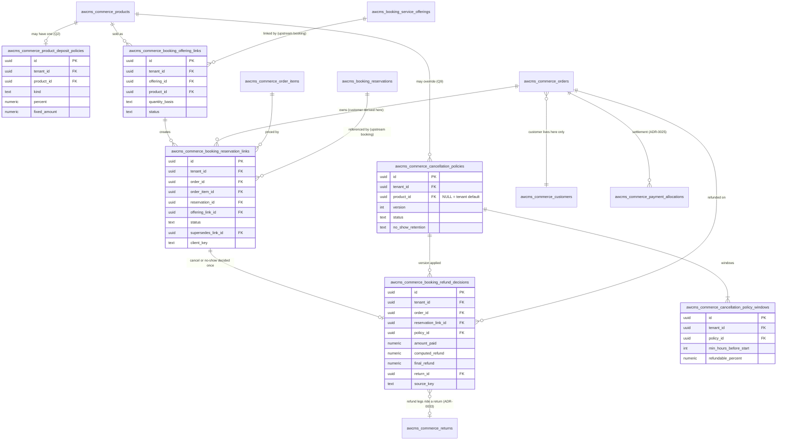

🇮🇩 Bahasa Indonesia · 🇬🇧 [English (source)](booking-commerce-adapter-data-model.md)

<!-- i18n-source-hash: sha256:ad543774cb202efdbe43dca869ec3a5cf1a0e3417bde94b921e44d5fea7f2d80 -->

# Adapter booking-commerce — usulan ERD dan kamus data

Artefak DoR 4 epic [#280](https://github.com/ahliweb/awcms-one/issues/280), item kerja W5 ([#356](https://github.com/ahliweb/awcms-one/issues/356)), dilacak di [`aw-business-platform-dor.md`](aw-business-platform-dor.id.md). Dokumen ini memperluas [`skema-basis-data.md`](skema-basis-data.id.md) dan [`kamus-data.md`](kamus-data.id.md) dengan tabel `awcms_commerce_*` yang akan ditambahkan adapter booking-commerce, dan menyelesaikan temuan lintas-spesifikasi X7: **pelanggan diturunkan melalui pesanan yang tertaut, tidak pernah disimpan di adapter.**

> **Hanya usulan. Tidak ada yang sudah ada.** Dokumen ini tidak menambahkan migrasi, tabel, rute, path OpenAPI, atau kode ([ADR-0040](adr/0040-aw-business-platform-capability-ownership-and-boundaries.id.md) D7). Nama tabel dan kolom adalah usulan yang boleh disesuaikan review migrasi, sebagaimana pack Booking upstream menyatakan tentang ERD-nya sendiri. Nomor migrasi **tidak dialokasikan di sini**: setiap tabel di bawah mengambil nomor commerce bebas berikutnya mulai `sql/1001` menurut [ADR-0037](adr/0037-the-commerce-migration-band-is-allocated-gap-first-and-widened-upstream.id.md), dialokasikan saat implementasi, berurutan menurut ketergantungan. Jangan membaca halaman ini sebagai gambaran skema saat ini; [`status.md`](status.id.md) dan berkas di `apps/cms/sql/` yang melakukannya.

## 1. Masukan dan aturan yang ditetapkannya

| Sumber                                                                                                                                                                                                                                                                                   | Yang ditetapkan untuk model data ini                                                                                                                                                                                                                                 |
| ---------------------------------------------------------------------------------------------------------------------------------------------------------------------------------------------------------------------------------------------------------------------------------------- | -------------------------------------------------------------------------------------------------------------------------------------------------------------------------------------------------------------------------------------------------------------------- |
| [ADR-0040](adr/0040-aw-business-platform-capability-ownership-and-boundaries.id.md) D3, D5                                                                                                                                                                                               | Booking tidak bergantung pada commerce; adapter satu-satunya tempat yang mengenal keduanya. Resource Booking bukan produk (tautkan, jangan gabung); deposit adalah alokasi buku pembayaran pada pesanan, bukan saldo Booking                                         |
| Pack Booking upstream ([`awcms/booking.md`](https://github.com/ahliweb/awcms/blob/main/docs/awcms/booking.md) bagian 4 dan bagian 10.2) dan [ADR-0135](../apps/cms/docs/adr/0135-day-granularity-stays-admitted-into-booking-v1.md)                                                      | Tabel Booking adalah `awcms_booking_*`, membawa `tenant_id`, tanpa uang dan tanpa id produk, menyimpan pelanggan sebagai `external_customer_ref` opak, dan menyatakan menginap sebagai interval tanggal setengah-terbuka. Adapter memiliki tautan offering-ke-produk |
| [ADR-0041](adr/0041-gateway-deposit-sessions-and-mixed-tenders-on-one-order.id.md) (D1, D4, D6, D8)                                                                                                                                                                                      | Kebijakan deposit per produk (persentase atau tetap, tidak diatur = bayar penuh, tanpa default tenant); pesanan memotret `dp_amount`; sesi gateway membawa `purpose` dan `expected_amount` (perubahan pada tabel sesi yang ada, ditentukan di sana)                  |
| [ADR-0025](adr/0025-payments-are-an-allocation-ledger-separate-from-order-status.id.md), [ADR-0026](adr/0026-loyalty-points-are-an-append-only-ledger.id.md), [ADR-0033](adr/0033-returns-refunds-and-exchanges-are-additive-records-that-compensate-through-the-existing-ledgers.id.md) | Penyelesaian diturunkan dari buku alokasi; refund adalah leg per pembayaran asal melalui sebuah `return`, dibatasi per pembayaran, dengan id baris refund sebagai kunci idempotensi penyedia; pembalikan loyalitas adalah kompensasi                                 |
| Jawaban pemilik 10 Oktober 2026 ([PRD](aw-business-platform-prd.id.md) bagian 9, [DoR](aw-business-platform-dor.id.md))                                                                                                                                                                  | Lihat bagian 2                                                                                                                                                                                                                                                       |
| [PRD](aw-business-platform-prd.id.md) bagian 6.3 (A1 sampai A9) dan [model ancaman](aw-business-platform-threat-model.id.md) (F2, F3, F7; kontrol C-07 sampai C-11)                                                                                                                      | Perilaku yang harus didukung setiap tabel, dan kontrol yang harus dapat diuji olehnya                                                                                                                                                                                |

## 2. Jawaban pemilik yang tercermin (10 Oktober 2026)

| Q   | Jawaban                                                                                                                                                   | Konsekuensi dalam model ini                                                                                                                                                                                                                      |
| --- | --------------------------------------------------------------------------------------------------------------------------------------------------------- | ------------------------------------------------------------------------------------------------------------------------------------------------------------------------------------------------------------------------------------------------ |
| Q1  | Malam adalah **kuantitas satu produk layanan per malam**                                                                                                  | Offering menginap ditautkan ke satu produk berharga per malam; `quantity` baris pesanan adalah jumlah malam. Tidak ada baris total-terhitung, tidak ada tabel harga per malam. Tautan mencatat `quantity_basis` agar adapter tahu arti kuantitas |
| Q2  | Deposit **per produk**, persentase atau tetap; tidak diatur = bayar penuh; **tanpa default tenant**                                                       | `awcms_commerce_product_deposit_policies` berkunci produk; tanpa baris berarti bayar penuh; sengaja tidak ada baris atau pengaturan tingkat tenant                                                                                               |
| Q3  | Deposit jaminan sewa **di luar v1**                                                                                                                       | Tidak ada jenis, label, atau tabel "dikembalikan, bukan pendapatan". Deposit yang dimodelkan di sini selalu bagian harga yang sudah menjadi pendapatan                                                                                           |
| Q4  | Selisih reschedule **dihargai oleh jalur pesanan commerce**                                                                                               | Booking tidak membawa aturan harga. Adapter tidak menyimpan jumlah selisih; ia hanya mengarahkan ulang tautan reservasi (bagian 5.2)                                                                                                             |
| Q9  | Jendela pembatalan **per produk, dengan default seluruh tenant**                                                                                          | Satu tabel kebijakan: `product_id IS NULL` adalah default tenant dan baris produk menimpanya (bagian 4.4)                                                                                                                                        |
| Q10 | Peran manajer atau finance boleh **menimpa** refund terhitung, dengan **step-up**, **alasan wajib**, **audit**, tidak pernah melebihi jumlah yang dibayar | Catatan keputusan refund membawa jumlah terhitung dan akhir, aktor/alasan/bukti step-up penimpaan, dan CHECK bahwa akhir tidak pernah melebihi yang dibayar (bagian 4.5)                                                                         |
| Q8  | Penukaran poin dan deposit pada satu pesanan **ditolak di v1**                                                                                            | Tidak ada tabel urutan-refund antara leg poin dan leg deposit. Penolakan adalah penjaga di checkout dan POS (ADR-0041 D8), bukan tabel. Bila kelak dicabut, catatan keputusan menambah kolom urutan leg; tidak dirancang sekarang                |

Q5 (poin hanya diperoleh pada pelunasan penuh di pesanan deposit) dan event pelunasan yang dibutuhkannya adalah ADR-0041 D7 dan issue [#355](https://github.com/ahliweb/awcms-one/issues/355); tidak menambah tabel di sini.

## 3. ERD

Kotak utuh adalah tabel adapter yang diusulkan. Kotak bertanda `(existing commerce)` sudah ada di tree. Kotak bertanda `(upstream booking)` adalah tabel Booking menurut pack-nya; hanya dirujuk, tidak pernah diubah, dan Booking tidak pernah merujuk balik.



Kardinalitas dalam kata: satu offering punya paling banyak satu tautan **aktif**, dan satu produk punya paling banyak satu tautan aktif (bagian 4.1); satu tautan reservasi menggabungkan tepat satu reservasi, satu pesanan, dan satu baris pesanan; satu reservasi punya paling banyak satu tautan **aktif**; satu tautan reservasi punya paling banyak satu keputusan refund; satu produk punya paling banyak satu kebijakan deposit, paling banyak satu kebijakan pembatalan aktif, dan tenant punya paling banyak satu kebijakan pembatalan default aktif.

## 4. Kamus data

Konvensi, diwarisi dari [`skema-basis-data.md`](skema-basis-data.id.md) dan tabel ADR-0033, berlaku untuk setiap tabel di bawah dan dinyatakan sekali:

- `id uuid PRIMARY KEY DEFAULT gen_random_uuid()`, `tenant_id uuid NOT NULL REFERENCES awcms_tenants (id)`, dan `UNIQUE (tenant_id, id)` agar tabel lain dapat merujuk baris dengan foreign key komposit `(tenant_id, …)`. Setiap rujukan, termasuk rujukan ke Booking upstream, adalah foreign key komposit aman-tenant.
- **RLS:** `ENABLE` dan `FORCE ROW LEVEL SECURITY` dengan satu kebijakan isolasi tenant `USING` dan `WITH CHECK (tenant_id = current_setting('app.current_tenant_id')::uuid)`, dibuktikan di bawah `awcms_app`; `REVOKE DELETE … FROM awcms_app` pada setiap tabel riwayat. Baris "RLS" tiap tabel di bawah hanya menambah yang khusus baginya. Tabel yang keluar dari turunan uji RLS generik adalah cacat.
- Uang adalah `numeric(14,2)`, dibandingkan dan dibagi dalam sen bulat, dibulatkan sekali ([ADR-0003](adr/0003-money-is-numeric-14-2-and-crosses-the-wire-as-a-string.id.md)). Stempel waktu `timestamptz`; `created_at`/`updated_at` adalah `NOT NULL DEFAULT now()`.
- Tanpa kolom stempel aktor yang berlebihan: kolom aktor muncul hanya bila fakta itu adalah aktornya (penimpaan, keputusan).
- Setiap tabel ikut `dataLifecycle` dan `unreachableBySubject` / `retain_under_obligation` seperti tabel commerce lain; tidak satu pun menyimpan nama, kontak, atau catatan teks bebas tentang seseorang (bagian 6).

### 4.1 `awcms_commerce_booking_offering_links` (usulan)

Tautan dari offering Booking ke produk commerce (PRD A1). Sebuah rujukan, bukan penggabungan: baris kedua sisi tidak diubah (ADR-0040 D5.8).

| Kolom                      | Tipe          | Null  | Batasan / catatan                                                                                                                                                                                                               |
| -------------------------- | ------------- | ----- | ------------------------------------------------------------------------------------------------------------------------------------------------------------------------------------------------------------------------------- |
| `id`                       | `uuid`        | tidak | PK                                                                                                                                                                                                                              |
| `tenant_id`                | `uuid`        | tidak | FK `awcms_tenants`                                                                                                                                                                                                              |
| `offering_id`              | `uuid`        | tidak | FK komposit `(tenant_id, offering_id)` ke tabel offering Booking (`awcms_booking_service_offerings`). Booking harus menyediakan `UNIQUE (tenant_id, id)`; diverifikasi terhadap skema Booking yang termigrasi                   |
| `product_id`               | `uuid`        | tidak | FK komposit ke `awcms_commerce_products`; produk harus `type = 'service'` (diperiksa di aplikasi: CHECK tidak dapat membaca tabel lain, trigger dapat)                                                                          |
| `quantity_basis`           | `text`        | tidak | `CHECK IN ('nights','booking')`. `nights` untuk offering menginap (kuantitas produk per malam = jumlah malam, Q1); `booking` untuk offering slot waktu (kuantitas 1). Harus sesuai granularitas offering, diperiksa saat insert |
| `status`                   | `text`        | tidak | `DEFAULT 'active'`, `CHECK IN ('active','unlinked')`                                                                                                                                                                            |
| `unlinked_at`              | `timestamptz` | ya    | Terisi tepat saat `status = 'unlinked'` (CHECK). Melepas tautan tidak pernah menyentuh pesanan atau tautan reservasi yang lalu                                                                                                  |
| `created_at`, `updated_at` | `timestamptz` | tidak | `DEFAULT now()`                                                                                                                                                                                                                 |

**Indeks dan keunikan:** unik parsial `(tenant_id, offering_id) WHERE status = 'active'` (satu produk aktif per offering, A1) dan unik parsial `(tenant_id, product_id) WHERE status = 'active'` (produk menjual satu offering sekali waktu; lihat bagian 7); `(tenant_id, status)`.
**RLS:** generik. Tanpa `DELETE` untuk peran aplikasi; melepas tautan adalah perubahan status, sehingga riwayat "dijual sebagai apa" tetap ada.
**Tidak di sini:** tanpa harga, tanpa deposit, tanpa kebijakan. Harga ada di produk (Q1), deposit di baris kebijakannya.

### 4.2 `awcms_commerce_booking_reservation_links` (usulan)

Pasangan rujukan reservasi-ke-pesanan (PRD A2, A3, A6, A8). Satu-satunya tempat kedua konteks bertemu dalam data. Ia memuat **pengenal dan penanda siklus hidup, tidak lebih**.

| Kolom                                   | Tipe          | Null  | Batasan / catatan                                                                                                                                                                                                              |
| --------------------------------------- | ------------- | ----- | ------------------------------------------------------------------------------------------------------------------------------------------------------------------------------------------------------------------------------ |
| `id`                                    | `uuid`        | tidak | PK                                                                                                                                                                                                                             |
| `tenant_id`                             | `uuid`        | tidak | FK `awcms_tenants`                                                                                                                                                                                                             |
| `order_id`                              | `uuid`        | tidak | FK komposit ke `awcms_commerce_orders`. **Pelanggan adalah `orders.customer_id`; tidak pernah disalin ke sini (bagian 5.1)**                                                                                                   |
| `order_item_id`                         | `uuid`        | tidak | FK komposit ke `awcms_commerce_order_items`, yang harus milik `order_id` (trigger); baris yang `quantity`-nya adalah jumlah malam (Q1)                                                                                         |
| `reservation_id`                        | `uuid`        | tidak | FK komposit ke reservasi Booking (`awcms_booking_reservations`). Booking menyimpan kebalikannya sebagai pasangan opak `external_ref_type`/`external_ref` (`commerce_order`, id pesanan); adapter menulisnya lewat port Booking |
| `offering_link_id`                      | `uuid`        | tidak | FK komposit ke `awcms_commerce_booking_offering_links`: pemetaan produk-ke-offering mana yang membuat ini                                                                                                                      |
| `status`                                | `text`        | tidak | `DEFAULT 'active'`, `CHECK IN ('active','superseded','released')`. `superseded` setelah reschedule (tautan lama), `released` setelah pembatalan, kedaluwarsa, atau no-show selesai                                             |
| `supersedes_link_id`                    | `uuid`        | ya    | Self-FK komposit: tautan yang digantikan pada reschedule (A6). NULL pada tautan pertama                                                                                                                                        |
| `client_key`                            | `text`        | tidak | Kunci idempotensi pembuatan hold-plus-pesanan (A2). `CHECK length BETWEEN 1 AND 300`; `UNIQUE (tenant_id, client_key)`: percobaan ulang mengembalikan tautan yang sama, tanpa reservasi kedua maupun pesanan kedua             |
| `attention_reason`                      | `text`        | ya    | `CHECK IN ('deposit_after_expiry','confirm_failed')`; diisi consumer yang mengamati deposit terlambat (A3, C-08) atau konfirmasi gagal, untuk operator. Dibersihkan hanya bersama `attention_resolved_at`                      |
| `attention_at`, `attention_resolved_at` | `timestamptz` | ya    | Keduanya NULL atau `attention_reason` terisi; `attention_resolved_at >= attention_at`                                                                                                                                          |
| `created_at`, `updated_at`              | `timestamptz` | tidak | `DEFAULT now()`                                                                                                                                                                                                                |

**Indeks dan keunikan:** unik parsial `(tenant_id, reservation_id) WHERE status = 'active'` (reservasi punya paling banyak satu tautan aktif; A6 "reservasi lama tidak pernah dibiarkan tertaut"); unik parsial `(tenant_id, order_item_id) WHERE status = 'active'`; `(tenant_id, order_id)` (reservasi suatu pesanan); `(tenant_id, status, attention_reason) WHERE attention_reason IS NOT NULL AND attention_resolved_at IS NULL` (antrean operator).
**Reschedule adalah satu transaksi (A6):** sisipkan tautan baru dengan `supersedes_link_id` terisi, ubah tautan lama menjadi `superseded`, dalam transaksi yang sama dengan pencatatan hasil panggilan port Booking. Tidak ada pesanan, baris, atau alokasi yang diubah.
**Dapat diubah:** hanya `status`, `attention_*`, dan `updated_at` yang berubah, lewat trigger; kolom lain adalah fakta beku.
**Yang sengaja dihilangkan:** harga, deposit, status pembayaran, saldo, id pelanggan, nama, kontak, ukuran rombongan, tanggal. Tanggal dan ukuran rombongan milik Booking; uang milik pesanan dan buku alokasi. Pembaca melakukan join; adapter tidak pernah menyalin (ADR-0040 D5.9, kontrol model ancaman C-09 merekonsiliasi keduanya).

### 4.3 `awcms_commerce_product_deposit_policies` (usulan)

Kebijakan deposit per produk (ADR-0041 D4, Q2). **Produk tanpa baris dibayar penuh. Tidak ada baris, pengaturan, atau cadangan default tenant.**

| Kolom                      | Tipe            | Null  | Batasan / catatan                                                                                                                                                                                   |
| -------------------------- | --------------- | ----- | --------------------------------------------------------------------------------------------------------------------------------------------------------------------------------------------------- |
| `id`                       | `uuid`          | tidak | PK                                                                                                                                                                                                  |
| `tenant_id`                | `uuid`          | tidak | FK `awcms_tenants`                                                                                                                                                                                  |
| `product_id`               | `uuid`          | tidak | FK komposit ke `awcms_commerce_products`; `UNIQUE (tenant_id, product_id)`: paling banyak satu kebijakan per produk                                                                                 |
| `kind`                     | `text`          | tidak | `CHECK IN ('percent','fixed')`                                                                                                                                                                      |
| `percent`                  | `numeric(5,2)`  | ya    | `CHECK (percent > 0 AND percent <= 100)`; berlaku pada total baris berpajak, dibulatkan setengah-naik dalam sen bulat (ADR-0041 D4). Terisi jika dan hanya jika `kind = 'percent'`                  |
| `fixed_amount`             | `numeric(14,2)` | ya    | `CHECK (fixed_amount > 0)`; **per satuan kuantitas** (per malam untuk produk per malam), dibatasi total baris dan minimal satu sen saat pesanan dibuat. Terisi jika dan hanya jika `kind = 'fixed'` |
| `created_at`, `updated_at` | `timestamptz`   | tidak | `DEFAULT now()`                                                                                                                                                                                     |

CHECK lintas-kolom mengikat `kind` ke tepat satu dari `percent`/`fixed_amount`. **Kebijakan dibaca saat pesanan dibuat dan hasilnya dipotret pada pesanan sebagai `dp_amount` yang sudah ada** (ambang rilis ADR-0025 D3); suntingan kebijakan kemudian tidak pernah mengubah pesanan yang ada, sehingga tabel tidak perlu versi dan `updated_at` plus log audit adalah riwayatnya. Produk dengan flag `allow_dp` (kolom yang ada) false tetapi punya baris kebijakan adalah kesalahan konfigurasi yang ditolak jalur tulis admin; merekonsiliasi `allow_dp` dengan tabel ini adalah pertanyaan implementasi (bagian 7).
**RLS:** generik.

### 4.4 `awcms_commerce_cancellation_policies` dan `awcms_commerce_cancellation_policy_windows` (usulan)

Kebijakan refund pembatalan (PRD A5, A7; Q9). Kebijakan **berversi dan tidak dapat diubah setelah aktif**: perubahan adalah versi baru, sehingga keputusan refund selalu dapat menyebut aturan persisnya.

`awcms_commerce_cancellation_policies`:

| Kolom                        | Tipe          | Null  | Batasan / catatan                                                                                                                                                                                                                                                         |
| ---------------------------- | ------------- | ----- | ------------------------------------------------------------------------------------------------------------------------------------------------------------------------------------------------------------------------------------------------------------------------- |
| `id`                         | `uuid`        | tidak | PK                                                                                                                                                                                                                                                                        |
| `tenant_id`                  | `uuid`        | tidak | FK `awcms_tenants`                                                                                                                                                                                                                                                        |
| `product_id`                 | `uuid`        | ya    | FK komposit ke `awcms_commerce_products`. **NULL berarti default seluruh tenant (Q9).** Baris produk menimpa default untuk produk itu                                                                                                                                     |
| `version`                    | `integer`     | tidak | `CHECK (version >= 1)`; `UNIQUE (tenant_id, product_id, version)` tidak cukup untuk id produk NULL, sehingga keunikan berupa dua indeks unik parsial: `(tenant_id, product_id, version) WHERE product_id IS NOT NULL` dan `(tenant_id, version) WHERE product_id IS NULL` |
| `status`                     | `text`        | tidak | `DEFAULT 'draft'`, `CHECK IN ('draft','active','retired')`. Indeks unik parsial mengizinkan satu baris `active` per produk dan satu default `active` per tenant                                                                                                           |
| `refund_basis`               | `text`        | tidak | `CHECK IN ('whole_stay','per_night')` (PRD A5): apakah bagian yang dapat di-refund berlaku pada jumlah yang dibayar untuk seluruh baris atau malam demi malam. Default `whole_stay`                                                                                       |
| `no_show_retention`          | `text`        | tidak | `CHECK IN ('retain_deposit','retain_all','refund_per_windows')` (PRD A7). Default `retain_deposit`: deposit yang sudah dibayar ditahan dan tidak ada yang di-refund                                                                                                       |
| `activated_at`, `retired_at` | `timestamptz` | ya    | `activated_at` terisi jika status `active` atau `retired`; `retired_at` jika `retired` (CHECK)                                                                                                                                                                            |
| `created_at`                 | `timestamptz` | tidak | `DEFAULT now()`                                                                                                                                                                                                                                                           |

`awcms_commerce_cancellation_policy_windows`:

| Kolom                    | Tipe           | Null  | Batasan / catatan                                                                                                                                                                            |
| ------------------------ | -------------- | ----- | -------------------------------------------------------------------------------------------------------------------------------------------------------------------------------------------- |
| `id`                     | `uuid`         | tidak | PK                                                                                                                                                                                           |
| `tenant_id`              | `uuid`         | tidak | FK `awcms_tenants`                                                                                                                                                                           |
| `policy_id`              | `uuid`         | tidak | FK komposit ke `awcms_commerce_cancellation_policies`                                                                                                                                        |
| `min_hours_before_start` | `integer`      | tidak | `CHECK (min_hours_before_start >= 0)`. Jendela berlaku bila pembatalan dilakukan sedikitnya sekian jam penuh sebelum saat kedatangan reservasi. `UNIQUE (policy_id, min_hours_before_start)` |
| `refundable_percent`     | `numeric(5,2)` | tidak | `CHECK (refundable_percent BETWEEN 0 AND 100)`; bagian dari jumlah yang dibayar yang boleh di-refund                                                                                         |

Jendela dievaluasi dari `min_hours_before_start` terbesar dan yang pertama cocok berlaku; pembatalan lebih dekat ke awal daripada jendela terkecil mendapat `0`. `refundable_percent` tidak boleh naik saat `min_hours_before_start` turun (trigger saat aktivasi induk). Baris jendela beku setelah kebijakannya keluar dari `draft` (trigger); kebijakan dan jendelanya tidak pernah dihapus, sehingga baris `retired` menjaga setiap keputusan lampau tetap dapat dijelaskan.
**Urutan resolusi** saat keputusan: kebijakan aktif produk, jika tidak ada kebijakan aktif default tenant, jika tidak ada **tidak ada**: bagian dapat di-refund 0 dan `policy_source = 'none'` pada keputusan, dengan penimpaan manajer (4.5) tersedia. Jam diukur terhadap saat kedatangan reservasi dari Booking (menginap: `checkInAt` turunan), dalam jam penuh dibulatkan ke bawah, sehingga kalender Asia/Jakarta tidak pernah masuk ke aritmetika.
**RLS:** generik pada kedua tabel. _Jumlah_ refund tidak pernah diambil dari request: ia dihitung di server dari baris ini dan buku alokasi (kontrol model ancaman C-10).

### 4.5 `awcms_commerce_booking_refund_decisions` (usulan)

Satu catatan per pembatalan atau no-show: refund terhitung kebijakan, penimpaan apa pun, dan tautan ke leg refund (PRD A5, A7; Q10; kontrol C-10, C-11). Ini bukti untuk "mengapa jumlah ini di-refund". Ia **tidak memindahkan uang**: uang hanya bergerak lewat leg return dan refund yang ada (ADR-0033) dan buku alokasi (ADR-0025).

| Kolom                           | Tipe            | Null  | Batasan / catatan                                                                                                                                                                                                                                       |
| ------------------------------- | --------------- | ----- | ------------------------------------------------------------------------------------------------------------------------------------------------------------------------------------------------------------------------------------------------------- |
| `id`                            | `uuid`          | tidak | PK                                                                                                                                                                                                                                                      |
| `tenant_id`                     | `uuid`          | tidak | FK `awcms_tenants`                                                                                                                                                                                                                                      |
| `order_id`                      | `uuid`          | tidak | FK komposit ke `awcms_commerce_orders`                                                                                                                                                                                                                  |
| `reservation_link_id`           | `uuid`          | tidak | FK komposit ke `awcms_commerce_booking_reservation_links`; **`UNIQUE (tenant_id, reservation_link_id)`**: reservasi dibatalkan atau ditandai no-show sekali, sehingga pemutaran ulang menemukan keputusan yang sama dan tidak pernah me-refund dua kali |
| `trigger_kind`                  | `text`          | tidak | `CHECK IN ('customer_cancel','staff_cancel','no_show')`                                                                                                                                                                                                 |
| `actor_kind`                    | `text`          | tidak | `CHECK IN ('customer','staff','system')`. Pembatalan pelanggan tidak membawa id staf; pelanggan adalah milik pesanan, diturunkan                                                                                                                        |
| `actor_tenant_user_id`          | `uuid`          | ya    | Staf yang bertindak; wajib jika dan hanya jika `actor_kind = 'staff'` (CHECK)                                                                                                                                                                           |
| `policy_id`                     | `uuid`          | ya    | FK komposit ke versi kebijakan yang diterapkan; NULL jika dan hanya jika `policy_source = 'none'`                                                                                                                                                       |
| `policy_source`                 | `text`          | tidak | `CHECK IN ('product','tenant_default','none')`                                                                                                                                                                                                          |
| `hours_before_start`            | `integer`       | tidak | Jam penuh, dibulatkan ke bawah, saat keputusan; dapat negatif untuk no-show                                                                                                                                                                             |
| `refundable_percent`            | `numeric(5,2)`  | tidak | Bagian yang diizinkan jendela yang cocok (atau aturan no-show); `0` bila tidak ada jendela cocok atau `policy_source = 'none'`                                                                                                                          |
| `amount_paid`                   | `numeric(14,2)` | tidak | Bersih terselesaikan pada pesanan saat keputusan (`Σ pembayaran berhasil − Σ reversal berhasil`, ADR-0025 D1): plafon refund apa pun                                                                                                                    |
| `computed_refund`               | `numeric(14,2)` | tidak | Jumlah terhitung kebijakan, tepat sen; `CHECK (computed_refund BETWEEN 0 AND amount_paid)`                                                                                                                                                              |
| `final_refund`                  | `numeric(14,2)` | tidak | Yang benar-benar di-refund; **`CHECK (final_refund BETWEEN 0 AND amount_paid)`**: penimpaan tidak pernah dapat melebihi yang dibayar                                                                                                                    |
| `override_reason`               | `text`          | ya    | `CHECK length BETWEEN 10 AND 500`; **wajib bila `final_refund <> computed_refund`**, selain itu NULL (CHECK). Teks bebas oleh staf berwenang tentang keputusan, bukan tentang kesehatan, identitas, atau kontak seseorang                               |
| `override_actor_tenant_user_id` | `uuid`          | ya    | Manajer atau pengguna finance yang menimpa; terisi jika dan hanya jika ditimpa (CHECK); izin Q10 wajib dan didefinisikan di matriks RBAC, [#357](https://github.com/ahliweb/awcms-one/issues/357)                                                       |
| `override_stepup_at`            | `timestamptz`   | ya    | Kapan bukti step-up diterima untuk penimpaan ini; terisi jika dan hanya jika ditimpa (CHECK); aplikasi menolak penimpaan yang step-up-nya lebih tua dari jendelanya. Hanya bukti: buktinya sendiri dipegang modul identitas                             |
| `return_id`                     | `uuid`          | ya    | FK komposit ke `awcms_commerce_returns`: return tempat leg refund dijalankan (bagian 7). NULL selama tidak ada uang bergerak (`final_refund = 0`, atau leg belum direncanakan); diisi sekali                                                            |
| `source_key`                    | `text`          | tidak | `CHECK length BETWEEN 1 AND 300`; `UNIQUE (tenant_id, source_key)`; misalnya `booking-cancel:<reservation_id>`; juga menjadi benih kunci sumber leg refund agar pemutaran ulang menurunkan kunci yang sama                                              |
| `created_at`                    | `timestamptz`   | tidak | `DEFAULT now()`                                                                                                                                                                                                                                         |

**Append-only:** trigger `BEFORE UPDATE` membekukan setiap kolom kecuali `return_id` (diisi sekali, NULL menjadi nilai). `DELETE` dicabut dari `awcms_app`; `awcms_worker` menyimpan `SELECT, DELETE` hanya untuk mesin siklus data, seperti tabel riwayat lain. Refund nol adalah baris normal (`final_refund = 0`) yang tidak membuat leg refund dan mencatat alasannya lewat `policy_source`, `hours_before_start`, dan `refundable_percent` (A5, "refund nol … mencatat alasannya").
**Audit:** penimpaan juga menulis entri audit platform (siapa, keputusan mana, terhitung versus akhir, kode alasan). Tabel adalah catatan tahan lama; log audit yang tahan-rekayasa.
**Tidak pernah di atas jumlah dibayar, secara mekanis:** CHECK adalah garis terakhir; aplikasi juga membatasi tiap leg per pembayaran asal (ADR-0033), sehingga keputusan yang sah di sini masih dapat ditolak bila pembayaran sudah sebagian dibalik sejak itu.
**RLS:** generik.

## 5. Pelanggan diturunkan melalui pesanan (temuan X7)

### 5.1 Aturannya

**Tidak ada tabel adapter yang menyimpan pelanggan.** Tidak ada `customer_id`, nama, e-mail, telepon, alamat, atau `profile_id` di tabel mana pun pada bagian 4. Pelanggan sebuah reservasi, menurut definisi, adalah pelanggan pesanan yang ditunjuk tautan reservasi aktifnya:

```
reservation → awcms_commerce_booking_reservation_links (status = 'active')
            → awcms_commerce_orders.customer_id   (atau kolom tamu pesanan untuk pesanan tamu)
```

Ini mengikuti tiga keputusan yang diterima: O12 (commerce tetap otoritas pelanggan, sehingga Booking tidak punya tautan `profile_identity` di v1), alur ancaman F7 (event membawa id dan enum, tanpa kontak), dan desain Booking sendiri, di mana `external_customer_ref` opak dan opsional. Konsekuensi, semuanya disengaja:

1. **Event dan baris Booking tidak membawa pelanggan.** Adapter tidak menaruh id pelanggan commerce ke `external_customer_ref` Booking; ia membiarkannya kosong (lihat bagian 7 untuk satu kasus yang mungkin mengubahnya). Kebutuhan Booking yang menghadap pelanggan (reservasi milik sendiri) dijawab adapter melalui pesanan.
2. **"Reservasi saya"** bagi pembeli yang masuk adalah pesanan milik pembeli itu yang di-join dengan tautan aktif, lewat keluarga rute sesi bearer yang ada ([ADR-0016](adr/0016-customer-accounts-are-otp-verified-commerce-accounts-with-bearer-sessions.id.md) D3); tamu memeriksa lewat mekanisme akses pesanan sendiri, bukan id pelanggan.
3. **Retensi dan aturan segmen turunan-booking** (metrik bagian 6, PRD 6.1) membaca pesanan yang di-join dengan tautan. Reservasi **tanpa tautan** (dibuat staf tanpa penjualan commerce) tidak punya pelanggan yang dapat diturunkan dan tampil sebagai "unlinked" di laporan itu; ia tidak masuk retensi atau segmen turunan-booking. Metrik Q7 sudah menyatakannya; apakah reservasi khusus-staf harus dihitung adalah keputusan pemilik yang tidak didahului model ini.
4. **Penghapusan dan anonimisasi mengikuti commerce.** Memutus pelanggan di otoritas commerce sudah cukup: tabel adapter tidak menyimpan apa pun untuk dihapus, dan Booking memutus rujukan opak dan catatannya sendiri menurut jawaban subjek datanya.
5. **Pelanggan berulang pada dua pesanan** adalah dua tautan ke dua pesanan; join lewat `customer_id` pesanan. Tidak ada kunci pelanggan sisi-booking untuk direkonsiliasi.

### 5.2 Invarian lain yang dijamin struktur

- **Booking tidak memegang harga, deposit, atau kolom pembayaran.** Harga per malam milik produk; deposit adalah `dp_amount` pada pesanan plus alokasi buku; refund adalah reversal buku. Booking tidak punya kolom untuk satu pun dan adapter tidak menambahnya (non-tujuan PRD, ADR-0040 D5.9).
- **Konfirmasi mengikuti buku.** Reservasi dikonfirmasi ketika penyelesaian mencapai ambang rilis pesanan (`order.paid`), diamati consumer; `attention_reason` tautan adalah satu-satunya tanda sisi-adapter bahwa itu tidak terjadi seperti diharapkan. Rekonsiliasi (kontrol C-09) membandingkan penyelesaian turunan pesanan dengan status reservasi; tabel di atas memberinya kedua join.
- **Reschedule mengarahkan ulang; tidak menyunting.** Tautan baru menggantikan yang lama; selisih harga lama dan baru adalah pembayaran atau refund baru di jalur pesanan (Q4, PRD A6). Adapter tidak menyimpan selisih. Apakah selisih itu pesanan tambahan atau baris baru pada pesanan belum dibayar adalah detail ADR adapter (bagian 7).
- **Poin dan deposit tidak pernah berbagi satu pesanan** (Q8): ditegakkan sebagai penjaga oleh ADR-0041 D8, sehingga tidak ada tabel yang membawa urutan refund kedua leg.
- **Pesanan total-penuh tidak tersentuh.** Produk tanpa baris kebijakan deposit, tanpa tautan offering, dan tanpa kebijakan pembatalan berperilaku seperti sekarang.

## 6. Catatan privasi dan retensi untuk tabel yang diusulkan

- Tidak satu pun dari enam tabel menyimpan data pribadi pelanggan. `override_reason` adalah teks bebas buatan staf dan `attention_reason` adalah kode tertutup; teks alasan dibatasi 500 karakter dan divalidasi terhadap pola data pribadi yang sudah ditolak modul commerce pada catatan pesanan. Retensi mengikuti jendela retensi pesanan pemiliknya, dan mesin purge generik tidak dapat menjangkau baris hidup (`cursorColumn: "deleted_at"` atau `"created_at"` untuk tabel keputusan append-only).
- Baris upstream ditautkan hanya lewat pengenal, sehingga ekspor Booking dan ekspor commerce tidak dapat digabung ulang tanpa konteks RLS kedua tenant.
- `awcms_worker` membutuhkan `SELECT, DELETE` pada tabel riwayat (keputusan, versi kebijakan) untuk mesin siklus data dan tidak lebih; tidak ada worker yang membutuhkan kolom penimpaan.

## 7. Titik terbuka: diselesaikan oleh ADR adapter

**Diselesaikan oleh [ADR-0045](adr/0045-booking-commerce-adapter.id.md) (11 Oktober 2026).** Halaman ini tetap usulan; jawaban di bawah mengubah usulan sebagaimana tertulis dan diterapkan oleh issue implementasi, bukan di sini.

| #   | Titik terbuka                               | Penyelesaian                                                                                                                                                                           |
| --- | ------------------------------------------- | -------------------------------------------------------------------------------------------------------------------------------------------------------------------------------------- |
| 1   | Tungkai refund dan `return_id NOT NULL`     | D4: `kind = 'cancellation'` baru pada retur (CHECK jenis dilebarkan); satu baris pada item layanan; tanpa jalur restok                                                                 |
| 2   | `allow_dp` versus kebijakan deposit         | D5: baris kebijakan satu-satunya otoritas; `allow_dp` cermin yang dijaga sejajar oleh penulisan yang sama; baris lama di-backfill sekali                                               |
| 3   | Kunci unik komposit Booking                 | D2: FK komposit dipertahankan; memverifikasi `UNIQUE (tenant_id, id)` pada skema Booking yang termigrasi adalah prasyarat #378                                                         |
| 4   | Wahana selisih reschedule                   | D7: pesanan tambahan untuk selisih positif; v1 hanya menerima reschedule berdurasi sama (selisih nol); kolom `role` pada tautan menyusul bersama tindak lanjut. Pemilik dapat merevisi |
| 5   | Urutan migrasi                              | Tidak berubah: urutan ketergantungan, nomor menurut ADR-0037 mulai `1001`, dialokasikan saat implementasi                                                                              |
| 6   | Bawaan refund "tanpa kebijakan aktif" (4.4) | D6: refund `0` dengan peringatan penyiapan dan kuotasi. Pemilik dapat merevisi                                                                                                         |
| 7   | Satu produk ke satu penawaran (4.1)         | D1: 1:1 selama aktif, kedua indeks unik parsial tetap                                                                                                                                  |
| 8   | Referensi pelanggan eksternal (5.1)         | D3: `external_customer_ref` Booking tetap kosong                                                                                                                                       |

## 8. Yang bukan dokumen ini

Bukan migrasi, bukan draf OpenAPI (itu W7, [#358](https://github.com/ahliweb/awcms-one/issues/358)), bukan matriks izin (W6, [#357](https://github.com/ahliweb/awcms-one/issues/357)), dan bukan spesifikasi UX (W8, [#359](https://github.com/ahliweb/awcms-one/issues/359)). Ia tidak mengubah [ADR-0041](adr/0041-gateway-deposit-sessions-and-mixed-tenders-on-one-order.id.md): kolom sesi `purpose` dan `expected_amount` serta trigger bekunya ditentukan di sana dan tidak diulang sebagai tabel adapter.
