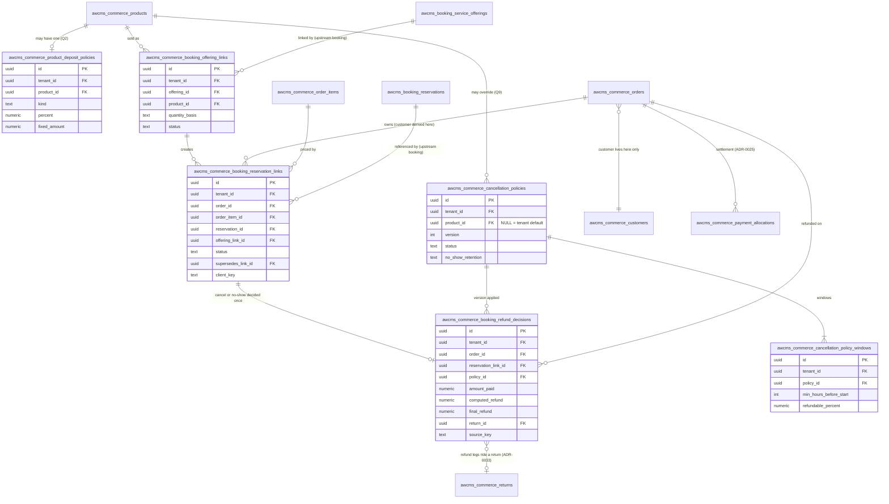

🇬🇧 English (source) · 🇮🇩 [Bahasa Indonesia](booking-commerce-adapter-data-model.id.md)

# Booking-commerce adapter — proposed ERD and data dictionary

DoR artifact 4 of epic [#280](https://github.com/ahliweb/awcms-one/issues/280), work item W5 ([#356](https://github.com/ahliweb/awcms-one/issues/356)), tracked in [`aw-business-platform-dor.md`](aw-business-platform-dor.md). It extends [`skema-basis-data.md`](skema-basis-data.md) and [`kamus-data.md`](kamus-data.md) with the `awcms_commerce_*` tables the booking-commerce adapter would add, and settles cross-spec finding X7: **the customer is derived through the linked order, never stored on the adapter.**

> **Proposals only. Nothing here exists.** No migration, table, route, OpenAPI path or code is added by this document ([ADR-0040](adr/0040-aw-business-platform-capability-ownership-and-boundaries.md) D7). Table and column names are proposals that a migration review may adjust, exactly as the upstream Booking pack says of its own ERD. Migration numbers are **not allocated here**: every table below takes the next free commerce number from `sql/1001` onward per [ADR-0037](adr/0037-the-commerce-migration-band-is-allocated-gap-first-and-widened-upstream.md), allocated at implementation, in dependency order. Do not read this page as describing the current schema; [`status.md`](status.md) and the files under `apps/cms/sql/` do that.

## 1. Inputs and the rules they fix

| Source                                                                                                                                                                                                                                                                          | What it fixes for this data model                                                                                                                                                                                                                |
| ------------------------------------------------------------------------------------------------------------------------------------------------------------------------------------------------------------------------------------------------------------------------------- | ------------------------------------------------------------------------------------------------------------------------------------------------------------------------------------------------------------------------------------------------ |
| [ADR-0040](adr/0040-aw-business-platform-capability-ownership-and-boundaries.md) D3, D5                                                                                                                                                                                         | Booking has no commerce dependency; the adapter is the only place that knows both. A Booking resource is not a product (link, do not merge); a deposit is a payment-ledger allocation on the order, never a Booking balance                      |
| Upstream Booking pack ([`awcms/booking.md`](https://github.com/ahliweb/awcms/blob/main/docs/awcms/booking.md) section 4 and section 10.2) and [ADR-0135](../apps/cms/docs/adr/0135-day-granularity-stays-admitted-into-booking-v1.md)                                           | Booking tables are `awcms_booking_*`, carry `tenant_id`, hold no money and no product id, keep the customer as an opaque `external_customer_ref`, and express a stay as a half-open date interval. The adapter owns the offering-to-product link |
| [ADR-0041](adr/0041-gateway-deposit-sessions-and-mixed-tenders-on-one-order.md) (D1, D4, D6, D8)                                                                                                                                                                                | Deposit policy is per product (percentage or fixed, unset = full payment, no tenant default); the order snapshots `dp_amount`; gateway sessions carry `purpose` and `expected_amount` (a change to the existing session table, specified there)  |
| [ADR-0025](adr/0025-payments-are-an-allocation-ledger-separate-from-order-status.md), [ADR-0026](adr/0026-loyalty-points-are-an-append-only-ledger.md), [ADR-0033](adr/0033-returns-refunds-and-exchanges-are-additive-records-that-compensate-through-the-existing-ledgers.md) | Settlement is derived from the allocation ledger; a refund is a leg per original payment through a `return`, capped per payment, with the refund row id as provider idempotency key; loyalty reversal is a compensation                          |
| Owner answers of 10 October 2026 ([PRD](aw-business-platform-prd.md) section 9, [DoR](aw-business-platform-dor.md))                                                                                                                                                             | See section 2                                                                                                                                                                                                                                    |
| [PRD](aw-business-platform-prd.md) section 6.3 (A1 to A9) and [threat model](aw-business-platform-threat-model.md) (F2, F3, F7; controls C-07 to C-11)                                                                                                                          | The behaviour each table must support, and the controls it must make testable                                                                                                                                                                    |

## 2. Owner answers reflected (10 October 2026)

| Q   | Answer                                                                                                                                           | Consequence in this model                                                                                                                                                                                                                 |
| --- | ------------------------------------------------------------------------------------------------------------------------------------------------ | ----------------------------------------------------------------------------------------------------------------------------------------------------------------------------------------------------------------------------------------- |
| Q1  | Nights are the **quantity of one nightly service product**                                                                                       | A stay offering links to one product priced per night; the order line `quantity` is the night count. No computed-total line, no per-night price table. The link records its `quantity_basis` so the adapter knows what the quantity means |
| Q2  | Deposit is **per product**, percentage or fixed; unset = full payment; **no tenant default**                                                     | `awcms_commerce_product_deposit_policies` is keyed by product; no row means full payment; there is deliberately no tenant-level row or setting                                                                                            |
| Q3  | Rental security deposit is **out of v1**                                                                                                         | No "returned, never revenue" kind, label or table. The deposit modelled here is always an earned part of the price                                                                                                                        |
| Q4  | A reschedule difference is **priced by the commerce order path**                                                                                 | Booking carries no price rule. The adapter stores no difference amount; it only re-points the reservation link (section 5.2)                                                                                                              |
| Q9  | Cancellation windows are **per product, with a tenant-wide default**                                                                             | One policy table where `product_id IS NULL` is the tenant default and a product row overrides it (section 4.4)                                                                                                                            |
| Q10 | A manager or finance role may **override** the computed refund, with **step-up**, a **mandatory reason**, **audit**, never above the amount paid | The refund decision record carries computed and final amounts, the override actor, reason and step-up evidence, and a CHECK that final never exceeds what was paid (section 4.5)                                                          |
| Q8  | Points redemption and a deposit on one order are **refused in v1**                                                                               | No refund-ordering table between a points leg and a deposit leg. The refusal is a guard at checkout and POS (ADR-0041 D8), not a table. If it is ever lifted, the decision record gains a leg-order column; it is not designed now        |

Q5 (points earn only at full settlement on a deposit order) and the settlement event it needs are ADR-0041 D7 and issue [#355](https://github.com/ahliweb/awcms-one/issues/355); they add no table here.

## 3. ERD

Solid boxes are proposed adapter tables. Boxes marked `(existing commerce)` are in the tree today. Boxes marked `(upstream booking)` are Booking's tables per its pack; they are referenced, never altered, and Booking never references back.



Cardinalities in words: one offering has at most one **active** link, and one product has at most one active link (section 4.1); one reservation link joins exactly one reservation, one order and one order line; a reservation has at most one **active** link; a reservation link has at most one refund decision; a product has at most one deposit policy, at most one active cancellation policy and the tenant has at most one active default cancellation policy.

## 4. Data dictionary

Conventions, inherited from [`skema-basis-data.md`](skema-basis-data.md) and the ADR-0033 tables, apply to every table below and are stated once:

- `id uuid PRIMARY KEY DEFAULT gen_random_uuid()`, `tenant_id uuid NOT NULL REFERENCES awcms_tenants (id)`, and `UNIQUE (tenant_id, id)` so other tables can reference the row with a composite `(tenant_id, …)` foreign key. Every reference, including the references into upstream Booking, is a composite tenant-safe foreign key.
- **RLS:** `ENABLE` and `FORCE ROW LEVEL SECURITY` with one tenant-isolation policy `USING` and `WITH CHECK (tenant_id = current_setting('app.current_tenant_id')::uuid)`, proven under `awcms_app`; `REVOKE DELETE … FROM awcms_app` on every history table. The "RLS" line of each table below only adds what is specific to it. A table that stays out of the generic RLS test derivation is a defect.
- Money is `numeric(14,2)`, compared and split in integer cents, rounded once ([ADR-0003](adr/0003-money-is-numeric-14-2-and-crosses-the-wire-as-a-string.md)). Timestamps are `timestamptz`; `created_at`/`updated_at` are `NOT NULL DEFAULT now()`.
- No actor-stamp noise: an actor column appears only where the fact is the actor (an override, a decision).
- Every table opts into `dataLifecycle` and is `unreachableBySubject` / `retain_under_obligation` like the other commerce tables; none stores a name, contact or free-text note about a person (section 6).

### 4.1 `awcms_commerce_booking_offering_links` (proposal)

The link from a Booking offering to a commerce product (PRD A1). A reference, not a merge: neither side's row is changed (ADR-0040 D5.8).

| Column                     | Type          | Null | Constraint / note                                                                                                                                                                                                            |
| -------------------------- | ------------- | ---- | ---------------------------------------------------------------------------------------------------------------------------------------------------------------------------------------------------------------------------- |
| `id`                       | `uuid`        | no   | PK                                                                                                                                                                                                                           |
| `tenant_id`                | `uuid`        | no   | FK `awcms_tenants`                                                                                                                                                                                                           |
| `offering_id`              | `uuid`        | no   | Composite FK `(tenant_id, offering_id)` to Booking's offerings table (`awcms_booking_service_offerings`). Booking must expose `UNIQUE (tenant_id, id)`; to verify against the migrated Booking schema                        |
| `product_id`               | `uuid`        | no   | Composite FK to `awcms_commerce_products`; the product must be `type = 'service'` (checked in the application: a CHECK cannot read another table, a trigger can)                                                             |
| `quantity_basis`           | `text`        | no   | `CHECK IN ('nights','booking')`. `nights` for a stay offering (quantity of the nightly product = nights, Q1); `booking` for a time-slot offering (quantity 1). Must agree with the offering's granularity, checked on insert |
| `status`                   | `text`        | no   | `DEFAULT 'active'`, `CHECK IN ('active','unlinked')`                                                                                                                                                                         |
| `unlinked_at`              | `timestamptz` | yes  | Set exactly when `status = 'unlinked'` (CHECK). Unlinking never touches past orders or reservation links                                                                                                                     |
| `created_at`, `updated_at` | `timestamptz` | no   | `DEFAULT now()`                                                                                                                                                                                                              |

**Indexes and uniqueness:** partial unique `(tenant_id, offering_id) WHERE status = 'active'` (one active product per offering, A1) and partial unique `(tenant_id, product_id) WHERE status = 'active'` (a product sells one offering at a time; section 7); `(tenant_id, status)`.
**RLS:** generic. No `DELETE` for the app role; an unlink is a status change, so the history of what was sold as what survives.
**Not here:** no price, no deposit, no policy. Price lives on the product (Q1), deposit on its policy row.

### 4.2 `awcms_commerce_booking_reservation_links` (proposal)

The reservation-to-order reference pair (PRD A2, A3, A6, A8). It is the only place the two contexts meet in data. It holds **identifiers and a lifecycle flag, nothing else**.

| Column                                  | Type          | Null | Constraint / note                                                                                                                                                                                                                        |
| --------------------------------------- | ------------- | ---- | ---------------------------------------------------------------------------------------------------------------------------------------------------------------------------------------------------------------------------------------- |
| `id`                                    | `uuid`        | no   | PK                                                                                                                                                                                                                                       |
| `tenant_id`                             | `uuid`        | no   | FK `awcms_tenants`                                                                                                                                                                                                                       |
| `order_id`                              | `uuid`        | no   | Composite FK to `awcms_commerce_orders`. **The customer is `orders.customer_id`; it is never copied here (section 5.1)**                                                                                                                 |
| `order_item_id`                         | `uuid`        | no   | Composite FK to `awcms_commerce_order_items`, which must belong to `order_id` (trigger); the line whose `quantity` is the night count (Q1)                                                                                               |
| `reservation_id`                        | `uuid`        | no   | Composite FK to Booking's reservations (`awcms_booking_reservations`). Booking stores the reverse as its opaque `external_ref_type`/`external_ref` pair (`commerce_order`, the order id); the adapter writes it through the Booking port |
| `offering_link_id`                      | `uuid`        | no   | Composite FK to `awcms_commerce_booking_offering_links`: which product-to-offering mapping created this                                                                                                                                  |
| `status`                                | `text`        | no   | `DEFAULT 'active'`, `CHECK IN ('active','superseded','released')`. `superseded` after a reschedule (the old link), `released` after a cancel, expiry or no-show completed                                                                |
| `supersedes_link_id`                    | `uuid`        | yes  | Composite self-FK: the link this one replaces on a reschedule (A6). NULL on a first link                                                                                                                                                 |
| `client_key`                            | `text`        | no   | Idempotency key of hold-plus-order creation (A2). `CHECK length BETWEEN 1 AND 300`; `UNIQUE (tenant_id, client_key)`: a retry returns the same link, creating neither a second reservation nor a second order                            |
| `attention_reason`                      | `text`        | yes  | `CHECK IN ('deposit_after_expiry','confirm_failed')`; set by the consumer that observes a late deposit (A3, C-08) or a failed confirmation, for an operator. Cleared only with `attention_resolved_at`                                   |
| `attention_at`, `attention_resolved_at` | `timestamptz` | yes  | Both NULL or `attention_reason` is set; `attention_resolved_at >= attention_at`                                                                                                                                                          |
| `created_at`, `updated_at`              | `timestamptz` | no   | `DEFAULT now()`                                                                                                                                                                                                                          |

**Indexes and uniqueness:** partial unique `(tenant_id, reservation_id) WHERE status = 'active'` (a reservation has at most one active link; A6 "the old reservation is never left linked"); partial unique `(tenant_id, order_item_id) WHERE status = 'active'`; `(tenant_id, order_id)` (an order's reservations); `(tenant_id, status, attention_reason) WHERE attention_reason IS NOT NULL AND attention_resolved_at IS NULL` (the operator queue).
**Reschedule is one transaction (A6):** insert the new link with `supersedes_link_id` set, flip the old link to `superseded`, in the same transaction as the Booking port call's outcome is recorded. No order, line or allocation is edited.
**Mutability:** only `status`, `attention_*` and `updated_at` change, by trigger; every other column is a frozen fact.
**What it deliberately omits:** price, deposit, payment status, balance, customer id, name, contact, party size, dates. Dates and party size are Booking's; money is the order's and the allocation ledger's. A reader joins; the adapter never copies (ADR-0040 D5.9, threat control C-09 reconciles the two).

### 4.3 `awcms_commerce_product_deposit_policies` (proposal)

Per-product deposit policy (ADR-0041 D4, Q2). **A product without a row is paid in full. There is no tenant default row, setting or fallback.**

| Column                     | Type            | Null | Constraint / note                                                                                                                                                                |
| -------------------------- | --------------- | ---- | -------------------------------------------------------------------------------------------------------------------------------------------------------------------------------- |
| `id`                       | `uuid`          | no   | PK                                                                                                                                                                               |
| `tenant_id`                | `uuid`          | no   | FK `awcms_tenants`                                                                                                                                                               |
| `product_id`               | `uuid`          | no   | Composite FK to `awcms_commerce_products`; `UNIQUE (tenant_id, product_id)`: at most one policy per product                                                                      |
| `kind`                     | `text`          | no   | `CHECK IN ('percent','fixed')`                                                                                                                                                   |
| `percent`                  | `numeric(5,2)`  | yes  | `CHECK (percent > 0 AND percent <= 100)`; applies to the line's taxed total, rounded half up in integer cents (ADR-0041 D4). Set iff `kind = 'percent'`                          |
| `fixed_amount`             | `numeric(14,2)` | yes  | `CHECK (fixed_amount > 0)`; **per unit of quantity** (per night for a nightly product), capped at the line total and floored at one cent at order time. Set iff `kind = 'fixed'` |
| `created_at`, `updated_at` | `timestamptz`   | no   | `DEFAULT now()`                                                                                                                                                                  |

A cross-field CHECK ties `kind` to exactly one of `percent`/`fixed_amount`. **The policy is read when an order is created and the result is snapshotted on the order as the existing `dp_amount`** (the release threshold of ADR-0025 D3); a later edit of this table never alters an existing order, so the table needs no versioning and `updated_at` plus the audit log are the history. A product whose `allow_dp` flag (existing column) is false but which has a policy row is a configuration error to be refused by the admin write path; reconciling `allow_dp` with this table is an implementation question (section 7).
**RLS:** generic.

### 4.4 `awcms_commerce_cancellation_policies` and `awcms_commerce_cancellation_policy_windows` (proposal)

Cancellation refund policy (PRD A5, A7; Q9). A policy is **versioned and immutable once active**: a change is a new version, so a refund decision can always name the exact rules it applied.

`awcms_commerce_cancellation_policies`:

| Column                       | Type          | Null | Constraint / note                                                                                                                                                                                                                                                      |
| ---------------------------- | ------------- | ---- | ---------------------------------------------------------------------------------------------------------------------------------------------------------------------------------------------------------------------------------------------------------------------- |
| `id`                         | `uuid`        | no   | PK                                                                                                                                                                                                                                                                     |
| `tenant_id`                  | `uuid`        | no   | FK `awcms_tenants`                                                                                                                                                                                                                                                     |
| `product_id`                 | `uuid`        | yes  | Composite FK to `awcms_commerce_products`. **NULL means the tenant-wide default (Q9).** A product row overrides the default for that product                                                                                                                           |
| `version`                    | `integer`     | no   | `CHECK (version >= 1)`; `UNIQUE (tenant_id, product_id, version)` is not enough for NULL product ids, so uniqueness is two partial unique indexes: `(tenant_id, product_id, version) WHERE product_id IS NOT NULL` and `(tenant_id, version) WHERE product_id IS NULL` |
| `status`                     | `text`        | no   | `DEFAULT 'draft'`, `CHECK IN ('draft','active','retired')`. Partial unique indexes allow one `active` row per product and one `active` default per tenant                                                                                                              |
| `refund_basis`               | `text`        | no   | `CHECK IN ('whole_stay','per_night')` (PRD A5): whether the refundable share applies to the amount paid for the whole line or night by night. Default `whole_stay`                                                                                                     |
| `no_show_retention`          | `text`        | no   | `CHECK IN ('retain_deposit','retain_all','refund_per_windows')` (PRD A7). Default `retain_deposit`: the deposit already paid is kept and nothing is refunded                                                                                                           |
| `activated_at`, `retired_at` | `timestamptz` | yes  | `activated_at` set iff status is `active` or `retired`; `retired_at` iff `retired` (CHECKs)                                                                                                                                                                            |
| `created_at`                 | `timestamptz` | no   | `DEFAULT now()`                                                                                                                                                                                                                                                        |

`awcms_commerce_cancellation_policy_windows`:

| Column                   | Type           | Null | Constraint / note                                                                                                                                                                                        |
| ------------------------ | -------------- | ---- | -------------------------------------------------------------------------------------------------------------------------------------------------------------------------------------------------------- |
| `id`                     | `uuid`         | no   | PK                                                                                                                                                                                                       |
| `tenant_id`              | `uuid`         | no   | FK `awcms_tenants`                                                                                                                                                                                       |
| `policy_id`              | `uuid`         | no   | Composite FK to `awcms_commerce_cancellation_policies`                                                                                                                                                   |
| `min_hours_before_start` | `integer`      | no   | `CHECK (min_hours_before_start >= 0)`. The window applies when the cancellation is at least this many whole hours before the reservation's arrival instant. `UNIQUE (policy_id, min_hours_before_start)` |
| `refundable_percent`     | `numeric(5,2)` | no   | `CHECK (refundable_percent BETWEEN 0 AND 100)`; the share of the amount paid that may be refunded                                                                                                        |

Windows are evaluated greatest `min_hours_before_start` first and the first match applies; a cancellation closer to the start than the smallest window gets `0`. `refundable_percent` must not increase as `min_hours_before_start` decreases (a trigger on the parent's activation). Window rows are frozen once their policy leaves `draft` (trigger); a policy and its windows are never deleted, so `retired` rows keep every past decision explainable.
**Resolution order** at decision time: the product's active policy, else the tenant default's active policy, else **none**: refundable share 0 and `policy_source = 'none'` on the decision, with a manager override (4.5) available. The hours are measured against the reservation's arrival instant from Booking (stay: the derived `checkInAt`), in whole hours floored, so the Asia/Jakarta calendar never enters the arithmetic.
**RLS:** generic on both tables. The refund _amount_ is never taken from the request: it is computed on the server from these rows and the allocation ledger (threat control C-10).

### 4.5 `awcms_commerce_booking_refund_decisions` (proposal)

One record per cancellation or no-show: the policy-computed refund, any override, and the link to the refund legs (PRD A5, A7; Q10; controls C-10, C-11). It is the evidence for "why was this amount refunded". It **does not move money**: money moves only through the existing return and refund legs (ADR-0033) and the allocation ledger (ADR-0025).

| Column                          | Type            | Null | Constraint / note                                                                                                                                                                                                             |
| ------------------------------- | --------------- | ---- | ----------------------------------------------------------------------------------------------------------------------------------------------------------------------------------------------------------------------------- |
| `id`                            | `uuid`          | no   | PK                                                                                                                                                                                                                            |
| `tenant_id`                     | `uuid`          | no   | FK `awcms_tenants`                                                                                                                                                                                                            |
| `order_id`                      | `uuid`          | no   | Composite FK to `awcms_commerce_orders`                                                                                                                                                                                       |
| `reservation_link_id`           | `uuid`          | no   | Composite FK to `awcms_commerce_booking_reservation_links`; **`UNIQUE (tenant_id, reservation_link_id)`**: a reservation is cancelled or marked no-show once, so a replay finds the same decision and never refunds twice     |
| `trigger_kind`                  | `text`          | no   | `CHECK IN ('customer_cancel','staff_cancel','no_show')`                                                                                                                                                                       |
| `actor_kind`                    | `text`          | no   | `CHECK IN ('customer','staff','system')`. A customer cancel carries no staff id; the customer is the order's, derived                                                                                                         |
| `actor_tenant_user_id`          | `uuid`          | yes  | The staff member who acted; required iff `actor_kind = 'staff'` (CHECK)                                                                                                                                                       |
| `policy_id`                     | `uuid`          | yes  | Composite FK to the policy version applied; NULL iff `policy_source = 'none'`                                                                                                                                                 |
| `policy_source`                 | `text`          | no   | `CHECK IN ('product','tenant_default','none')`                                                                                                                                                                                |
| `hours_before_start`            | `integer`       | no   | Whole hours, floored, at decision time; may be negative for a no-show                                                                                                                                                         |
| `refundable_percent`            | `numeric(5,2)`  | no   | The share the matched window (or the no-show rule) allowed; `0` when no window matched or `policy_source = 'none'`                                                                                                            |
| `amount_paid`                   | `numeric(14,2)` | no   | Net settled on the order at decision time (`Σ succeeded payments − Σ succeeded reversals`, ADR-0025 D1): the ceiling for any refund                                                                                           |
| `computed_refund`               | `numeric(14,2)` | no   | The policy-computed amount, cent-exact; `CHECK (computed_refund BETWEEN 0 AND amount_paid)`                                                                                                                                   |
| `final_refund`                  | `numeric(14,2)` | no   | What is actually refunded; **`CHECK (final_refund BETWEEN 0 AND amount_paid)`**: an override can never exceed what was paid                                                                                                   |
| `override_reason`               | `text`          | yes  | `CHECK length BETWEEN 10 AND 500`; **mandatory when `final_refund <> computed_refund`**, NULL otherwise (CHECK). Free text by an authorised staff member about a decision, never about a person's health, identity or contact |
| `override_actor_tenant_user_id` | `uuid`          | yes  | The manager or finance user who overrode; set iff overridden (CHECK); the Q10 permission is required and is defined in the RBAC matrix, [#357](https://github.com/ahliweb/awcms-one/issues/357)                               |
| `override_stepup_at`            | `timestamptz`   | yes  | When the step-up proof was accepted for this override; set iff overridden (CHECK); the application refuses an override whose step-up is older than its window. Evidence only: the proof itself is held by the identity module |
| `return_id`                     | `uuid`          | yes  | Composite FK to `awcms_commerce_returns`: the return under which the refund legs are executed (section 7). NULL while no money moves (`final_refund = 0`, or the legs are not yet planned); set once                          |
| `source_key`                    | `text`          | no   | `CHECK length BETWEEN 1 AND 300`; `UNIQUE (tenant_id, source_key)`; for example `booking-cancel:<reservation_id>`; also seeds the refund legs' own source keys so a replay re-derives the same ones                           |
| `created_at`                    | `timestamptz`   | no   | `DEFAULT now()`                                                                                                                                                                                                               |

**Append-only:** a `BEFORE UPDATE` trigger freezes every column except `return_id` (set once, NULL to a value). `DELETE` is revoked from `awcms_app`; `awcms_worker` keeps `SELECT, DELETE` for the data-lifecycle engine only, as for the other history tables. A zero refund is a normal row (`final_refund = 0`) that creates no refund legs and records why through `policy_source`, `hours_before_start` and `refundable_percent` (A5, "a zero refund … records why").
**Audit:** an override additionally writes the platform audit entry (who, which decision, computed versus final, reason code). The table is the durable record; the audit log is the tamper-evident one.
**Never above amount paid, mechanically:** the CHECK is the last line; the application also caps each leg per original payment (ADR-0033), so a decision that is valid here can still be refused if payments were already partly reversed since.
**RLS:** generic.

## 5. The customer is derived through the order (finding X7)

### 5.1 The rule

**No adapter table stores a customer.** There is no `customer_id`, name, e-mail, phone, address or `profile_id` on any table in section 4. A reservation's customer is, by definition, the customer of the order its active reservation link points to:

```
reservation → awcms_commerce_booking_reservation_links (status = 'active')
            → awcms_commerce_orders.customer_id   (or the order's guest fields for a guest order)
```

This follows from three accepted decisions: O12 (commerce stays the customer authority, so Booking holds no `profile_identity` link in v1), threat flow F7 (events carry ids and enums, no contact), and Booking's own design, where `external_customer_ref` is opaque and optional. Consequences, all intended:

1. **Booking events and rows carry no customer.** The adapter does not put a commerce customer id into Booking's `external_customer_ref`; it leaves it unset (section 7 for the one case where this might change). Booking's customer-facing needs (own reservations) are answered by the adapter through the order.
2. **"My reservations"** for a signed-in shopper is the shopper's own orders joined to active links, over the existing bearer-session route family ([ADR-0016](adr/0016-customer-accounts-are-otp-verified-commerce-accounts-with-bearer-sessions.md) D3); a guest checks by the order's own access mechanism, not by a customer id.
3. **Retention and booking-derived segment rules** (metrics section 6, PRD 6.1) read orders joined to links. A reservation with **no link** (created by staff with no commerce sale) has no derivable customer and shows as "unlinked" in those reports; it does not enter retention or booking-derived segments. Metrics Q7 already says this; whether staff-only reservations should count is an owner decision the model does not pre-empt.
4. **Erasure and anonymisation follow commerce.** Severing the customer at the commerce authority is sufficient: the adapter tables hold nothing to scrub, and Booking severs its own opaque reference and note per its data-subject answers.
5. **A repeat customer across two orders** is two links to two orders; the join is by the order's `customer_id`. There is no booking-side customer key to reconcile.

### 5.2 Other invariants the structure guarantees

- **Booking holds no price, deposit or payment field.** The nightly price is the product's; the deposit is `dp_amount` on the order plus ledger allocations; a refund is ledger reversals. Booking has no column for any of them and the adapter adds none (PRD non-goals, ADR-0040 D5.9).
- **Confirmation follows the ledger.** The reservation is confirmed when settlement reaches the order's release threshold (`order.paid`), observed by a consumer; the link's `attention_reason` is the only adapter-side mark that this did not happen as expected. Reconciliation (control C-09) compares the order's derived settlement with the reservation's state; the tables above give it both joins.
- **A reschedule re-points; it does not edit.** The new link supersedes the old one; the difference between the old and the new price is a new payment or refund on the order path (Q4, PRD A6). The adapter stores no difference. Whether that difference is a supplementary order or a new line on an unpaid order is an adapter-ADR detail (section 7).
- **Points and deposit never share an order** (Q8): enforced as a guard by ADR-0041 D8, so no table carries both legs' refund order.
- **Whole-total orders are untouched.** A product with no deposit policy row, no offering link and no cancellation policy behaves as today.

## 6. Privacy and retention notes for the proposed tables

- None of the six tables stores personal data of a customer. `override_reason` is staff-authored free text and `attention_reason` is a closed code; the reason text is limited to 500 characters and validated against the personal-data patterns the commerce module already rejects in order notes. Retention follows the owning order's retention window, and the generic purge engine cannot reach a live row (`cursorColumn: "deleted_at"` or `"created_at"` for the append-only decision table).
- The upstream rows are linked by identifiers only, so a Booking export and a commerce export cannot be re-joined without both tenants' RLS contexts.
- `awcms_worker` needs `SELECT, DELETE` on the history tables (decisions, policy versions) for the lifecycle engine and nothing else; no worker needs the override columns.

## 7. Open points: resolved by the adapter ADR

**Resolved by [ADR-0045](adr/0045-booking-commerce-adapter.md) (11 October 2026).** This page stays a proposal; the answers below change the proposal as stated and are applied by the implementation issues, not here.

| #   | Open point                              | Resolution                                                                                                                                                                               |
| --- | --------------------------------------- | ---------------------------------------------------------------------------------------------------------------------------------------------------------------------------------------- |
| 1   | Refund legs and `return_id NOT NULL`    | D4: a new returns `kind = 'cancellation'` (the kind CHECK widens); one line on the service item; no restock path                                                                         |
| 2   | `allow_dp` versus the deposit policy    | D5: the policy row is the only authority; `allow_dp` is a mirror kept in step by the same write; legacy rows are backfilled once                                                         |
| 3   | Booking's composite unique keys         | D2: composite FK is kept; verifying `UNIQUE (tenant_id, id)` in the migrated Booking schema is a precondition of #378                                                                    |
| 4   | The reschedule difference vehicle       | D7: a supplementary order for a positive difference; v1 admits only equal-duration reschedules (difference zero); a `role` column on the link comes with the follow-up. Owner may revise |
| 5   | Migration order                         | Unchanged: dependency order, numbers per ADR-0037 from `1001`, allocated at implementation                                                                                               |
| 6   | "No active policy" refund default (4.4) | D6: refund `0` with a setup warning and a quote. Owner may revise                                                                                                                        |
| 7   | One product to one offering (4.1)       | D1: 1:1 while active, both partial unique indexes stay                                                                                                                                   |
| 8   | External customer reference (5.1)       | D3: Booking's `external_customer_ref` stays unset                                                                                                                                        |

## 8. What this document is not

It is not a migration, an OpenAPI draft (that is W7, [#358](https://github.com/ahliweb/awcms-one/issues/358)), a permission matrix (W6, [#357](https://github.com/ahliweb/awcms-one/issues/357)), or a UX specification (W8, [#359](https://github.com/ahliweb/awcms-one/issues/359)). It does not change [ADR-0041](adr/0041-gateway-deposit-sessions-and-mixed-tenders-on-one-order.md): the session columns `purpose` and `expected_amount` and their freeze trigger are specified there and are not repeated as adapter tables.
