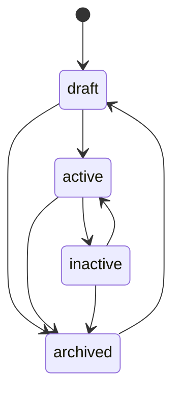
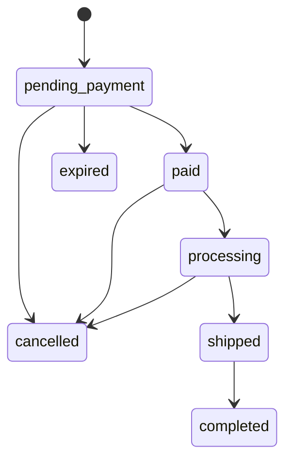

🇮🇩 Bahasa Indonesia · 🇬🇧 [English (source)](cms.md)

<!-- i18n-source-hash: sha256:dcdecd8c900fe3ea9c7c3e98e25ea1e3daa3eb93d52c2d844175ff70ee52dac1 -->

# CMS: authoring, publikasi, izin, audit, media, taksonomi

Bagaimana produk, pesanan, permukaan pemasaran, dan konten bergerak melewati siklus hidupnya di dalam `apps/cms`, dan apa yang akan — dan tidak akan — ditemukan pembaca yang mencari media, iklan, atau UI admin yang lebih lengkap di sini. Modulnya sendiri adalah [`apps/cms/src/modules/commerce/`](../apps/cms/src/modules/commerce/), didokumentasikan mendalam di [`README.md`](../apps/cms/src/modules/commerce/README.id.md) miliknya sendiri — halaman ini menautkan ke dokumen itu alih-alih menyatakannya ulang kolom demi kolom, dan berfokus pada alur kerja yang dilalui orang atau agen yang benar-benar menulis konten. Authoring berita/blog (`blog_content`) adalah modul milik `ahliweb/awcms` sendiri, dibawa oleh embed subtree; halaman ini hanya mendeskripsikan bagaimana `apps/storefront` mengonsumsinya, bukan alur kerja adminnya sendiri.

## Mesin status

### `status` produk: `draft` → `active`/`inactive`/`archived`

Dibaca langsung dari `LEGAL_TRANSITIONS` milik [`apps/cms/src/modules/commerce/domain/product-status.ts`](../apps/cms/src/modules/commerce/domain/product-status.ts):

Produk ditulis sebagai `draft`, dialihkan ke `active` untuk dijual, ditarik ke `inactive` untuk dikeluarkan dari penjualan tanpa kehilangan catatannya, dan dipindah ke `archived` untuk dipensiunkan — dari mana hanya `draft` yang membukanya kembali. `current === next` selalu legal (no-op, bukan error). `status` melintas lewat `PATCH /api/v1/commerce/products/{id}` yang sama seperti field lainnya, diperiksa terhadap `LEGAL_TRANSITIONS` **sebelum** tulisan apa pun berjalan.

### `status` pesanan: tujuh state, tiga aktor

Dibaca langsung dari [`apps/cms/src/modules/commerce/domain/order-status.ts`](../apps/cms/src/modules/commerce/domain/order-status.ts):

Setiap edge legal juga dibatasi oleh **siapa** yang boleh menerapkannya (`actorMayApplyOrderStatus`):

| Aktor | Boleh menerapkan |
| --- | --- |
| `admin` | Edge legal apa pun di atas |
| `customer` | Hanya `pending_payment → cancelled` (pesanannya sendiri, diperiksa lewat telepon) |
| `system` (job `commerce:orders:expire`) | Hanya `pending_payment → expired` |

Setiap transisi menulis satu baris ke `awcms_commerce_order_events` (append-only, `from_status`/`to_status`/`actor`/`note`/`created_at` — lihat [`docs/skema-basis-data.md`](skema-basis-data.id.md)), yang menjadi sumber timeline pelacakan-pesanan storefront. `completed`, `cancelled`, dan `expired` bersifat terminal. `paymentStatus` (`unpaid → dp_paid/paid → refunded`) adalah sumbu terpisah dari `status`, diset oleh `PATCH .../payment-confirmations/{cid}/review` (`decision: "accepted"` mengubahnya menjadi `paid`) atau, untuk uang muka, saat pembuatan pesanan.

### `status` flash sale: dua state editorial, dua state turunan-job

`draft`/`scheduled` diset oleh owner; `active`/`ended` **diturunkan dari jendela waktu** dan dipersist oleh job `commerce:flash-sales:tick` (jadwal `*/5 * * * *`), yang memicu `commerce.flash_sale.{started,ended}` tepat sekali per transisi — halaman yang membaca `GET /flash-sales/active` tidak pernah perlu menghitung jendelanya sendiri.

## Izin dan otorisasi: 39 kunci di tiga area

Setiap rute commerce dijaga pada satu kunci izin `commerce.*`, dikelompokkan ke dalam tiga area di bawah. (Jumlah baris tabel ini dijaga otomatis oleh penanda `hitung:` di [`cms.md`](cms.md), sumber Inggris dokumen ini — lihat berkas itu.)

| Area | Resource | Aksi |
| --- | --- | --- |
| Catalog | `categories`, `products` | `read`, `create`, `update`, `delete`, `restore` |
| Marketing | `flash_sales`, `vouchers`, `sliders`, `testimonials`, `popups` | `read`, `create`, `update`, `delete` |
| Pengaturan toko | `settings` | `read`, `update` |

Orders, customers, dan reviews adalah area keempat yang lebih sempit: `commerce.orders.{read,update}`, `commerce.customers.{read,update}`, `commerce.reviews.{read,update,delete}` — **sengaja tanpa `create`/`delete`** untuk orders atau customers, karena keduanya hanya dibuat lewat jalur storefront anonim, yang tidak punya identitas admin untuk diperiksa izinnya. Lihat [`docs/api.md`](api.id.md) untuk daftar 39-kunci lengkap dan [ADR-0009](adr/0009-guest-checkout-by-order-code-and-phone.id.md) untuk alasan jalur itu anonim sama sekali. Row-level security menguatkan batas yang sama di lapisan basis data — lihat [`docs/skema-basis-data.md`](skema-basis-data.id.md).

## E-mail OTP akun pelanggan (Issue #89, kontrak #86/ADR-0016 D2)

`POST /account/otp/request` mengirim kode 6 digitnya lewat outbox milik modul `email` sendiri (`awcms_email_messages`), diantre di dalam transaksi yang sama dengan baris OTP, di bawah kategori template turunan baru `derived.commerce_customer_otp` (`registerDerivedEmailTemplateCategory`, tiga variabel: `code`, `expiresInMinutes`, `storeName`). Migrasi `sql/919` men-seed salinan EN+ID template itu untuk setiap tenant yang sudah ada saat migrasi berjalan; tenant yang dibuat setelahnya butuh salinannya sendiri di-seed (alur provisioning-nya, atau operator, sama seperti `email:templates:seed-defaults` milik kategori dasar yang per-tenant dan eksplisit). Ketika `EMAIL_PROVIDER=log` atau `EMAIL_ENABLED` bukan `"true"`, pengiriman lewat adapter `log` sebagai gantinya — satu-satunya tempat di basis kode ini yang menulis kode OTP ke baris log, sehingga pengembangan lokal dan CI bisa menjalankan seluruh alurnya tanpa kredensial e-mail.

Dua pasangan batas laju yang bisa diatur lewat env mengatur permukaan ini: `COMMERCE_ACCOUNT_OTP_RATE_LIMIT_{MAX_PER_IP,WINDOW_SEC,MAX_PER_EMAIL}` (default 10/IP/jam, 5/e-mail/jam) untuk `otp/request`, dan `COMMERCE_ACCOUNT_OTP_VERIFY_RATE_LIMIT_{MAX_PER_IP,WINDOW_SEC}` (default 20/IP/jam) untuk `otp/verify` — lihat `.env.example` di `apps/cms`.

## OTP akun pelanggan lewat WhatsApp (Issue #108, kontrak #106 D5)

Tindak lanjut WhatsApp dari D2: `POST /account/otp/request` menerima `via?: "email"|"whatsapp"` (default `email`). `via: "whatsapp"` mewajibkan `phone` (dinormalisasi ke E.164), hanya pernah mendukung `purpose: "login"` (pendaftaran tetap hanya OTP e-mail — kombinasi `register` adalah `400 VALIDATION_ERROR`), dan menjawab `409 CHANNEL_UNAVAILABLE` — diperiksa dan dijawab SEBELUM baris OTP pernah diterbitkan — saat `COMMERCE_WHATSAPP_ENABLED` bukan `"true"` (fakta konfigurasi, bukan oracle enumerasi baru: tidak bergantung pada apakah telepon yang diberikan benar-benar punya akun). `POST /account/otp/verify` menerima `phone` sebagai alternatif `email` (saling eksklusif), menyelesaikan akun lewat telepon baris pelanggannya (`findAccountByPhone`), bukan lewat e-mail — "login lewat WhatsApp" hanya pernah mengautentikasi akun yang sudah ada.

Kode dikirim lewat outbox provider kedua yang dimodelkan persis seperti `email` (`awcms_commerce_whatsapp_messages`/`_delivery_attempts`, `sql/925`), didispatch oleh `bun run commerce:whatsapp:dispatch` (claim/send/finalize, lease, circuit breaker, backoff — bentuk sama seperti `email:dispatch`) terhadap `COMMERCE_WHATSAPP_PROVIDER` yang di-resolve (`fonnte`, `meta`, atau `log` untuk dev/CI — satu-satunya adapter yang menulis kode ke baris log). `GET /api/v1/commerce/whatsapp/messages` (`commerce.whatsapp.read`) dan `/admin/commerce-whatsapp` memberi operator diagnostik baca-saja atas outbox — telepon tersamar saja, tidak pernah nomor asli/isi pesan yang dirender/kode.

## Sumber daya akun pelanggan (Issue #91, kontrak #86/ADR-0016)

`/api/v1/commerce/storefront/account/{addresses,wishlist,orders,reviews}` — setiap rute dijaga bearer (`requireCustomerSession`), dibatasi laju per IP di bawah `COMMERCE_STOREFRONT_RATE_LIMIT_{MAX,WINDOW_SEC}` (default 60/menit, pasangan env yang sama yang sudah dipakai rute pelacakan anonim), dibatasi ukuran body, dan preflight CORS-nya menyertakan `authorization` bergabung dengan `content-type` di daftar header yang diizinkan (preflight permintaan bearer kalau tidak begitu tidak akan pernah sampai ke pemanggilan sungguhan peramban).

- **Alamat.** Maksimal 10 baris hidup per akun (`409 ADDRESS_LIMIT_REACHED`); alamat PERTAMA yang pernah disimpan otomatis menjadi default; `GET` mendaftar default lebih dulu. Persis satu default per pelanggan adalah invarian DATABASE, bukan sekadar invarian aplikasi — indeks unik parsial `sql/920` pada `(tenant_id, customer_id) WHERE is_default AND deleted_at IS NULL`. Menghapus default mempromosikan alamat yang paling baru dibuat di antara sisanya; `PATCH` tidak pernah menyentuh `isDefault` (hanya `POST .../default` yang menyentuhnya).
- **Wishlist.** `PUT {productIds}` menggabung-union ke apa pun yang sudah dimiliki akun, maksimal 200 baris hidup, dan mengembalikan daftar gabungan yang otoritatif; id yang tidak meresolusi ke produk hidup DI TENANT INI dilewati secara diam-diam — penjagaan "FK telanjang tidak bisa mengisolasi per tenant" yang sama yang sudah diikuti rujukan category/order-item modul ini, diperiksa di lapisan aplikasi di dalam transaksi berlingkup RLS. `GET` hanya menampilkan produk yang dipublikasikan (`status = 'active'`), belum dihapus; produk yang dimoderasi keluar dari status itu, atau dihapus lunak, langsung berhenti muncul — baris wishlist-nya sendiri tidak tersentuh. `DELETE /wishlist/{productId}` menghapus lunak dan selalu menjawab `204`, bahkan untuk produk yang belum pernah di-wishlist.
- **Order.** `GET /orders` berpaginasi keyset (`cursor`, `limit` ≤ 50, default 20), terbaru dulu, `created_at >= account.historyFrom` (ADR-0016 D4) ditegakkan DI DALAM query. `GET /orders/{orderCode}` tidak perlu nomor telepon — bearer sudah membuktikan kepemilikan — dan memeriksa KEDUANYA kepemilikan dan `historyFrom` di dalam query yang sama, sehingga kode yang tidak dikenal, order akun lain, dan yang lebih lama dari `historyFrom` semuanya menjawab `404` netral yang identik. Keduanya memakai ulang bentuk order yang sama yang dikembalikan `GET .../orders/{code}?phone=`.
- **Ulasan.** `GET /reviews` mendaftar setiap ulasan yang akun itu sendiri kirimkan, status moderasi apa pun, dengan nama produk dan kode order disematkan.

**Kedua rute anonim yang sudah ada kini menerima bearer opsional.** `POST /storefront/orders` dan `POST /storefront/reviews`: `Authorization: Bearer …` yang hadir dan valid membuat pelanggan order/ulasan menjadi baris pelanggan MILIK akun itu SENDIRI — `findOrCreateCustomerByPhone`/lookup kepemilikan yang dicocokkan telepon dilewati sepenuhnya dalam kasus itu, meski field telepon tetap divalidasi bentuknya dan tetap menjadi kunci rate limit per telepon. Bearer yang hadir tapi tidak valid/kedaluwarsa menjawab `401 UNAUTHENTICATED` secara eksplisit, bukan diam-diam jatuh kembali ke jalur tamu — storefront membaca ulang sesinya sendiri tepat sebelum submit dan perlu diberi tahu secara jelas bahwa sesi itu sudah basi. Tanpa header `Authorization` sama sekali, kedua rute tetap persis sama seperti sebelum issue ini. `POST /storefront/orders` juga menerima field `affiliateCode` — divalidasi bentuknya (string, maksimal 50 karakter) dan, sejak #92, diresolusi terhadap `awcms_commerce_affiliates.code` serta mencatat sebuah referral.

## Log audit

Setiap rute owner yang mengubah data — create, update, delete, restore, transisi status, review konfirmasi-pembayaran, moderasi ulasan — memanggil `recordAuditEvent` di dalam transaksi ber-RLS yang sama dengan tulisan yang dicatatnya, menamai modul (`commerce`), jenis resource, id resource, aksinya, dan (untuk delete) severity `warning`. Tidak satu pun tabel commerce membawa `created_by`/`updated_by`/`deleted_by`, jadi log audit adalah satu-satunya catatan kepelakuan untuk modul ini, bukan catatan tambahan. Jalur storefront anonim tidak menulis event audit apa pun untuk pembuatan pesanan itu sendiri (tidak ada aktor admin untuk diatributkan) — baris `order_events` milik pesanan itu sendiri adalah catatan setara jalur itu, ber-timestamp dan membawa alasan.

## Layar admin: sebelas, mencakup setiap izin

Sebelas layar di bawah `apps/cms/src/pages/admin/`, masing-masing dijaga pada izin `read` area-nya lewat `loadAdminScreen`, dengan pengecekan inline lebih lanjut untuk create/update/delete/restore. (Jumlah baris tabel ini dijaga otomatis oleh penanda `hitung:` di [`cms.md`](cms.md), sumber Inggris dokumen ini — lihat berkas itu.)

| Layar | Rute | Dijaga pada |
| --- | --- | --- |
| Produk | `/admin/commerce` | `commerce.products.read` |
| Kategori | `/admin/commerce-categories` | `commerce.categories.read` |
| Flash sale | `/admin/commerce-flash-sales` | `commerce.flash_sales.read` |
| Voucher | `/admin/commerce-vouchers` | `commerce.vouchers.read` |
| Slider | `/admin/commerce-sliders` | `commerce.sliders.read` |
| Testimoni | `/admin/commerce-testimonials` | `commerce.testimonials.read` |
| Popup | `/admin/commerce-popup` | `commerce.popups.read` |
| Pengaturan toko | `/admin/commerce-settings` | `commerce.settings.read` |
| Pesanan | `/admin/commerce-orders` | `commerce.orders.read` (tanpa form create) |
| Pelanggan | `/admin/commerce-customers` | `commerce.customers.read` (tanpa form create) |
| Ulasan | `/admin/commerce-reviews` | `commerce.reviews.read` |

Bersama-sama, sebelas layar ini mengklaim setiap satu dari 39 izin yang dideklarasikan modul ini — diverifikasi oleh gate `admin-screen-coverage-ledger.ts` milik `apps/cms` (`admin:screen-coverage:check`) dan dua berkas contract test (`apps/cms/tests/admin-commerce-page-contract.test.ts`, `apps/cms/tests/admin-commerce-marketing-page-contract.test.ts`). Layar Orders dan Customers sengaja tidak punya form create — lihat "Izin dan otorisasi" di atas.

## Media: gambar produk, slider, testimoni — di-resolve, belum di-upload lewat tooling repo ini sendiri

`dependencies` milik `commerce` mendapat `media_library` di increment ini (issue #23), dan setiap referensi gambar — `images[]` produk, `imageMediaObjectId` varian, `sizeChartMediaId` size chart, `mediaObjectId` slider/testimoni/popup — di-resolve lewat `MediaLibraryPort` menjadi URL publik. **Hanya `mediaObjectId` gambar produk yang diperiksa live** terhadap `MediaLibraryPort.isMediaReferenceSafe` sebelum insert; `imageMediaObjectId` varian dan `sizeChartMediaId` size chart hanya divalidasi berbentuk-UUID, tidak diperiksa keberadaan live/terverifikasi — id yang basi atau asing di situ hanya akan resolve menjadi tanpa URL publik saat render, dan RLS tetap menjaganya terisolasi-tenant (dicatat di README modul ini sendiri sebagai pengurangan cakupan yang diketahui dan disengaja).

Yang **tidak** dibangun increment ini: jalur upload nyata untuk gambar-gambar ini lewat tooling repositori ini sendiri. `tools/seed-borneojek-mart.ts` memakai SVG placeholder kecil yang dibuat sendiri (`tools/seed-assets/`) alih-alih mengunduh foto produk sungguhan, dan upload bukti-pembayaran milik storefront anonim sendiri (`POST .../orders/{code}/payment-proof/upload-sessions`) selalu menjawab `503 MEDIA_UNAVAILABLE` — alur upload-session `media_library` yang sudah ada membutuhkan `actorTenantUserId` terautentikasi, yang tidak dimiliki pemanggil checkout anonim mana pun; merancang seam auth anonim kedua yang paralel, terikat pada `(orderCode, phoneHash)`, dinilai di luar cakupan increment ini (dicatat di PR issue #29 sebagai desain sensitif-keamanan yang sengaja ditangguhkan, bukan diburu-buru). `payment.proofUpload: false` pada model baca store-settings publik memberi tahu storefront untuk menyembunyikan kontrolnya saat kondisi ini berlaku; konfirmasi pembayaran tanpa gambar bukti tetap diterima sepenuhnya.

## Lambang lembaga: di-resolve dan dirender (issue #59)

`awcms_blog_institutions` milik `blog_content` membawa `logo_media_id`/`logo_alt` sejak [awcms#806](https://github.com/ahliweb/awcms/pull/807) di upstream, yang masuk ke sini lewat subtree pull `apps/cms`. `apps/storefront` me-resolve id itu lewat `GET /api/v1/media/objects` seperti setiap rujukan media lain, lalu merender lambangnya di samping paragraf pembuka artikel dan di `/mitra/{slug}` — jawaban platform ini atas "Logo Instansi" per-artikel milik seputarborneo.com, dipindahkan ke lembaga yang memang sudah menaungi artikel itu sehingga satu unggahan melayani seluruh artikel kanal tersebut. Kedua field tidak wajib: lembaga tanpa lambang, dan `apps/cms` yang lebih tua dari subtree pull itu, sama-sama tidak merender apa pun.

## Manajemen logo dan favicon: masih di-resolve sebagai id media, belum di-render

Modul `site-profile` milik `apps/cms` mengekspos `logoMediaId`/`faviconMediaId` sebagai bagian dari site profile tenant, hanya bisa di-resolve lewat klien `media_library`. `apps/storefront` membaca site profile (`GET /api/v1/site-profile/composed`, issue #24) tapi tidak me-resolve id mana pun menjadi URL — brand mark storefront adalah nama toko dalam teks, dan `apps/storefront/public/favicon.svg` adalah ikon default yang di-bundle, bukan yang dikelola CMS. Ini adalah pengurangan cakupan yang dicatat dan disengaja (lihat `apps/storefront/README.md`), bukan kelalaian: membangun klien `media_library` di storefront dinilai di luar cakupan untuk pekerjaan chrome/fondasi.

## Taksonomi: kategori commerce, plus hierarki IA berita sendiri

"Taksonomi" mencakup dua tree yang dimiliki secara terpisah:

- **`awcms_commerce_categories`** — tree kategori-produk self-referencing yang dimiliki modul ini (lihat [`docs/skema-basis-data.md`](skema-basis-data.id.md)). `parentId` tak berubah setelah pembuatan, sejalan dengan pilihan `awcms_offices` sendiri untuk alasan yang identik (tidak ada deteksi-siklus yang dibangun untuk keduanya).
- **Hierarki rubrik/daerah/mitra milik `blog_content`** — modul milik `ahliweb/awcms` sendiri, dibawa oleh embed subtree. `/rubrik/{slug}` milik `apps/storefront` menyusuri tree rubrik (kategori) hierarkis di mana arsip rubrik induk mencakup post dari setiap rubrik turunan (issue #28); `/daerah/{slug}` adalah arsip wilayah yang dijangkau lewat `regionCode` sebuah institusi (post itu sendiri tidak membawa field wilayah); `/mitra/{slug}` adalah halaman landing institusi. Tidak satu pun dari ketiganya adalah kategori commerce — ketiganya adalah taksonomi milik `blog_content` sendiri, dirender oleh permukaan berita storefront. Lihat [`docs/routing.md`](routing.id.md) untuk peta URL lengkapnya.

## Iklan: penempatan iklan, sebagaimana `blog_content` merendernya

`AD_PLACEMENT_KEYS` milik `blog_content` mendefinisikan slot header, in-article, dan sidebar — sengaja tidak ada slot footer (diverifikasi terhadap set kunci yang benar-benar terdaftar, bukan asumsi). Halaman berita `apps/storefront` merender slot mana pun yang dikembalikan CMS; tidak ada UI manajemen penempatan-iklan yang didokumentasikan di sini karena itu milik `blog_content`, bukan `commerce` — lihat dokumentasi modul `apps/cms` sendiri untuk sisi admin.

Increment 3 membuat slot-slot itu nyata, bukan sekadar nominal. Kedua belas kunci kini dikonsumsi (`header_banner`, `below_headline`, `homepage_middle`, `homepage_bottom`, `article_top`/`_middle`/`_bottom`, `sidebar_top`/`_middle`/`_bottom`, `category_archive_top`, `search_result_top`), materinya dirender sebagai `` sungguhan lewat klien media ([ADR-0011](adr/0011-storefront-media-resolves-through-the-media-objects-endpoint.md)), dan mengkliknya membuka `<dialog>` native — perilaku popup milik seputarborneo sendiri (issue #53). **Masih tidak ada kunci footer**: leaderboard yang dirender seputarborneo di atas footer-nya adalah `homepage_bottom` aplikasi ini, ditempatkan di sana oleh `FooterBerita.astro` (keputusan 4 epic #46); menambahkan kunci `footer_leaderboard` tersendiri tetap perubahan upstream yang belum dibutuhkan siapa pun. Slot yang tidak terisi tidak merender apa pun — tidak pernah kotak placeholder kosong.

## Program afiliasi: sisi pembeli (issue #93); sisi admin/staf adalah issue #92, keduanya sudah diimplementasi

[ADR-0016](adr/0016-customer-accounts-are-otp-verified-commerce-accounts-with-bearer-sessions.id.md) milik `apps/cms` sendiri merancang program afiliasi dari nol, sesuai keputusan D5-nya: `awcms_commerce_affiliates` (satu baris per pelanggan yang bergabung, `code` unik per tenant, `commission_rate`, `status`) dan `awcms_commerce_affiliate_commissions` (satu baris per pesanan yang direferensikan, dibuat saat pesanan itu mencapai `completed`; `status` berkembang `pending` → `approved`/`void` → `paid`, digerakkan staf). Referral diri sendiri tidak menghasilkan komisi. Cakupan dokumen ini adalah apa yang dilakukan `apps/storefront` dengan kontrak itu, bukan layar admin yang mengelolanya — issue #92 membangun keduanya: owner API (`commerce.affiliates.read|update`, `commerce.affiliate_commissions.read|update`) dan layar `/admin/commerce-affiliates` (tabel afiliasi dengan suspend/aktifkan/ubah tarif; tabel komisi dapat difilter berdasarkan status dengan approve/pay/void, tiap mutasi membawa `Idempotency-Key`):

- Sebuah tenant menyalakan program dengan mengatur tarif komisi di `/admin/commerce-settings` (kolom nyata `awcms_commerce_store_settings.affiliate_commission_rate`, `null` = mati); storefront tidak pernah melihat tarif itu secara langsung — hanya boolean turunan `affiliateProgramEnabled` pada model baca store-settings PUBLIK, dibaca saat build. Instance awcms yang lebih lama dari fitur ini cukup mengabaikan field tersebut, dan storefront meng-default-kannya ke `false` alih-alih mengasumsikan program yang belum ada entah bagaimana sedang aktif.
- Penangkapan `?ref={code}`, `affiliateCode` saat checkout, dan UI gabung/tautan/statistik/komisi milik `/akun/afiliasi` sepenuhnya menjadi urusan `apps/storefront` — lihat README aplikasi itu sendiri dan [`docs/routing.md`](routing.id.md)/[`docs/seo.md`](seo.id.md) untuk mekanisme sisi-pembelinya. Kontrak CMS sendiri sengaja permisif di sini: `affiliateCode` yang tidak dikenal atau ditangguhkan yang dikirim bersama pesanan diabaikan begitu saja, tidak pernah ditolak — checkout seorang pembeli tidak boleh gagal hanya karena tautan referral basi atau salah ketik milik orang lain. Kode diresolusi terhadap `awcms_commerce_affiliates.code` dan statusnya pada saat PESANAN DIBUAT; `shouldEarnCommission` memeriksa ulang referral-diri-sendiri dan status TERKINI afiliasi tersebut lagi pada saat pesanan mencapai `completed`, karena kode yang valid saat checkout bisa saja milik afiliasi yang ditangguhkan sebelum pesanan selesai.
- `GET/POST /account/affiliate` dan `GET /account/affiliate/commissions` adalah rute berorientasi-pelanggan yang diautentikasi bearer (`/api/v1/commerce/storefront/account/affiliate*`) — permukaan autentikasi yang SAMA dengan `/account/me`/`/account/orders`, bukan owner API yang dipakai layar admin.

## Tarif kurir: RajaOngkir, ter-cache (issue #107, contract #106 D4)

`ShippingRateProvider` (`apps/cms/src/modules/commerce/domain/shipping-rate-provider.ts`) adalah sebuah port, bentuk yang sama dengan port provider `email`: `searchDestination(query)` dan `getRates({originId, destinationId, weightGrams, couriers})`, di-resolve di tepi dari `COMMERCE_SHIPPING_RATE_PROVIDER` (`rajaongkir` atau `log`) — lihat [`docs/deployment.md`](deployment.id.md) untuk variabel env-nya. Adapter RajaOngkir (Komerce API v2) dan saudaranya yang mengembalikan fixture `log` sama-sama mengimplementasikannya; tidak satu pun diimpor dengan namanya di luar adapter itu sendiri dan resolvernya.

- **Cache, dua tabel.** `awcms_commerce_courier_destinations` memetakan kode kecamatan `idn_admin_regions` milik tenant ke id tujuan milik provider (di-resolve sekali, lewat pencarian nama kecamatan+kota, tidak pernah di-resolve ulang setiap quote). `awcms_commerce_shipping_rates` meng-cache tarif per `(tenant, provider, asal, tujuan, bucket berat, kurir, layanan)`, TTL 6 jam; `commerce:shipping-rates:purge` menghapus baris kedaluwarsa setiap jam.
- **Pembulatan berat.** `domain/weight-bucket.ts`'s `computeWeightBucketGrams` membulatkan total berat keranjang ke atas ke kelipatan 100 g berikutnya, dengan lantai 1000 g — berat minimum tertagih RajaOngkir sendiri — sehingga dua keranjang dalam pita 100 g yang sama berbagi satu baris cache.
- **Provider tidak pernah dipanggil dari dalam transaksi database** (ADR-0006/0010): pembacaan cache adalah satu transaksi pendek, panggilan provider (bila cache meleset) terjadi tanpa transaksi terbuka sama sekali, dan penulisan-balik adalah transaksi pendek kedua dengan `ON CONFLICT ... DO UPDATE` — cache miss yang bersamaan pada key yang sama hanya berarti penulis terakhir yang menang, tidak pernah error.
- **Jalur quote.** `POST .../cart/quote` menerima `destination: {districtCode}` opsional; saat `shipping.courier.enabled` milik tenant DAN provider dikonfigurasi DAN sebuah destination dikirim, entri kurir pada `shippingOptions[]` adalah tarif langsung per layanan (`{method:"courier", serviceId:"jne:REG", name, cost, etd, available:true}`); jika tidak, satu placeholder `available:false` dengan `note` (tidak ada destination dikirim, atau kecamatannya tidak bisa dicocokkan ke kurir — `"Tujuan belum dikenali kurir"`).
- **Pembuatan pesanan memvalidasi hanya terhadap cache.** `shipping: {method:"courier", serviceId}` milik `POST .../orders` dicek terhadap baris `awcms_commerce_shipping_rates` yang belum kedaluwarsa, dikunci dari `districtCode` milik alamat pengiriman sendiri — tidak pernah panggilan provider langsung kedua dari dalam transaksi tulis pesanan. Pilihan yang basi/tidak dikenal menjawab `409 CART_CHANGED` yang sama (dengan quote baru) seperti setiap ketidakcocokan harga/stok/pengiriman lainnya.
- **Pengaturan toko.** `shipping.courier = {enabled, originDestinationId, couriers[]}` (owner, `PUT /store-settings`) adalah sakelar on/off-nya, asal RajaOngkir milik tenant sendiri, dan kode kurir mana yang di-quote. `GET /api/v1/commerce/shipping/destinations?search=` (hanya owner, `settings.update`) mendukung pemilih asal admin di bagian kurir `/admin/commerce-settings`. `shipping.courierEnabled` pada model baca publik bernilai `true` hanya saat `courier.enabled` DAN provider dikonfigurasi — tidak pernah salinan mentah dari flag yang tersimpan.

## Gerbang pembayaran: Midtrans Snap (issue #110, contract #106 D3) + intake webhook dan reconcile (issue #113, contract #106 D2)

`PaymentGatewayProvider` (`apps/cms/src/modules/commerce/domain/payment-gateway-provider.ts`) adalah sebuah port, bentuk yang sama seperti yang ditetapkan `ShippingRateProvider` untuk #107: `createSession(order)`, `fetchStatus(providerRef)`, `verifyWebhook(...)`, di-resolve di tepi dari `COMMERCE_PAYMENT_GATEWAY` (`midtrans` atau `log`) — lihat [`docs/deployment.md`](deployment.id.md) untuk variabel env-nya. Adapter Midtrans Snap dan saudaranya `log` yang mengembalikan fixture sama-sama mengimplementasikannya; `log` ditolak di luar deployment non-production.

- **Pembuatan sesi, dua transaksi.** `createGatewaySession` memvalidasi pesanan (harus `payment.method: "gateway"`, status `pending_payment`) dan mengecek sesi hidup yang sudah ada dalam satu transaksi pendek, memanggil provider tanpa transaksi terbuka, lalu menyimpan baris `awcms_commerce_payment_gateway_sessions` baru dalam transaksi pendek kedua — disiplin ADR-0006/0010 yang sama seperti `getCourierRates` milik #107.
- **Idempoten by design, bukan lewat `Idempotency-Key`.** Panggilan berulang untuk pesanan yang sama selagi sesinya masih hidup (`status IN ('created', 'pending')`) mengembalikan sesi ITU; `order_id` milik Midtrans sendiri (`${orderCode}-${attempt}`) unik per attempt, sehingga sesi tidak pernah dicetak dua kali di provider untuk attempt yang sama.
- **Auth: telepon atau bearer.** `POST .../orders/{orderCode}/payment-gateway/sessions` menerima `{phone}` di body atau bearer pelanggan, pola bearer opsional yang sama seperti `POST .../orders`. Pesanan tak dikenal, telepon salah, atau bearer hidup milik pemilik pesanan LAIN semuanya menjawab `404` netral yang sama seperti rute pelacakan pesanan — tidak pernah respons yang bisa dibedakan "ada tapi bukan milikmu".
- **Pemetaan status.** `domain/gateway-status-mapping.ts` memetakan `transaction_status`/`fraud_status` milik Midtrans ke kosakata `paid|pending|expired|failed|refunded` milik modul ini sendiri; `fetchStatus` maupun `verifyWebhook` berbagi pemetaan itu sehingga pengecekan status dan callback webhook tidak pernah bisa berselisih.
- **Jalur quote.** `paymentMethods[]` milik `POST .../cart/quote` mendapat `{method: "gateway", available}` — `true` hanya saat `payment.gateway.enabled` milik tenant DAN sebuah `PaymentGatewayProvider` dikonfigurasi untuk deployment ini.
- **Pengaturan toko / admin.** `payment.gateway = {enabled}` (owner, `PUT /store-settings`) adalah sakelar on/off-nya; `payment.gatewayEnabled` pada model baca publik bernilai `true` hanya saat `gateway.enabled` DAN provider dikonfigurasi — tidak pernah salinan mentah dari flag yang tersimpan. `/admin/commerce-settings` mendapat sakelar enable plus panel webhook-endpoint: owner `GET|POST /api/v1/commerce/webhook-endpoints` (daftar ter-mask; token mentah ditampilkan tepat sekali, saat pembuatan, di-hash saat disimpan) dan `DELETE .../webhook-endpoints/{id}` (cabut), digerbangi pada `commerce.webhook_endpoints.update`.
- **Lookup bootstrap webhook-endpoint.** `awcms_resolve_commerce_webhook_endpoint(token_hash)` adalah fungsi `SECURITY DEFINER` yang meniru pola `awcms_resolve_tenant_domain_lookup` persis (peran pemilik NOLOGIN khusus, policy baca yang dibatasi sempit, EXECUTE dibatasi ke `awcms_app`) — me-resolve `(tenant_id, provider)` dari token opak sebelum konteks tenant apa pun ada.

### Buku panduan operator — membuat webhook-endpoint dan mengarahkan Midtrans ke situ

1. Di panel webhook-endpoints pada `/admin/commerce-settings`, klik "create" untuk provider `midtrans`. Token plaintext (`awcmswh_…`) ditampilkan **tepat sekali** — salin sekarang; hanya hash SHA-256-nya yang disimpan (list/`GET` tidak pernah menampilkannya lagi).
2. Susun URL callback lengkap: `https://<domain-tenant-Anda>/api/v1/commerce/webhooks/midtrans/<token>`.
3. Tempelkan URL itu ke pengaturan **Payment Notification URL** di dashboard Midtrans (Settings → Configuration, untuk sandbox maupun production Merchant Portal, sesuai `COMMERCE_MIDTRANS_IS_PRODUCTION` deployment ini).
4. Atur variabel env deployment (lihat [`docs/deployment.md`](deployment.id.md)): `COMMERCE_PAYMENT_GATEWAY=midtrans`, `COMMERCE_MIDTRANS_SERVER_KEY`, `COMMERCE_MIDTRANS_IS_PRODUCTION`. `COMMERCE_MIDTRANS_SNAP_BASE_URL`/`COMMERCE_MIDTRANS_STATUS_BASE_URL`/`COMMERCE_MIDTRANS_TIMEOUT_MS` adalah override opsional.
5. Jika token bocor atau sebuah integrasi dipensiunkan, cabut (`DELETE .../webhook-endpoints/{id}`) dan buat yang baru — URL dashboard Midtrans diperbarui pada saat yang sama, karena token lama langsung berhenti ter-resolve.

### Rute intake webhook (issue #113)

`POST /api/v1/commerce/webhooks/{provider}/{endpointToken}` — publik, tanpa sesi (didaftarkan di daftar pengecualian `lib/security/api-body-auth-boundary.ts`, keluarga yang sama dengan entri berkredensial-HMAC `/api/v1/sync/push`). Urutan gerbang:

1. Pembacaan body, dibatasi ukurannya.
2. `(tenant_id, provider)` di-resolve dari hash token lewat fungsi bootstrap di atas. Token tak dikenal/dicabut, segmen path `{provider}` yang tidak cocok dengan hasil resolve token, atau tidak ada provider yang dikonfigurasi untuk deployment ini — semuanya menjawab `404` netral YANG SAMA, setelah respons dipadatkan ke sebuah latensi lantai (`NEUTRAL_404_MIN_LATENCY_MS`) sehingga kedua kasus tidak bisa dibedakan lewat timing.
3. `provider.verifyWebhook(...)` — signature yang buruk/hilang adalah `401`.
4. Di dalam satu transaksi `withTenantOrThrow`: `INSERT INTO awcms_commerce_payment_events (...) ON CONFLICT (tenant_id, provider, event_key) DO NOTHING` — nol baris terpengaruh berarti callback yang DIULANG (replay), dijawab `200` tanpa efek samping. Selain itu status yang sudah dipetakan diterapkan: `paid` → `markOrderPaidBySystem`; `expired` → `expireOrderBySystem` (hanya dari `pending_payment`, diserap diam-diam selain itu); `failed`/`refunded` → baris sesi gateway diperbarui, pesanan dibiarkan tidak tersentuh. Rute ini **tidak pernah** memanggil provider itu sendiri (tidak ada `fetchStatus`) — `fetchStatus` adalah urusan eksklusif job reconcile.

`markOrderPaidBySystem` (`application/order-directory.ts`) menyetel `paid_at`/`payment_status`, `gateway_provider`/`gateway_ref` pada pesanan, satu baris `order_events` dengan aktor `system`, dan satu entri audit-log — idempoten: pesanan yang sudah `paid` adalah no-op, dan pesanan dalam status apa pun selain `pending_payment`/`paid` (mis. sudah `cancelled`) juga no-op, bukan error.

**Mengapa `paid -> refunded` tidak pernah diterapkan otomatis.** Graf status `domain/order-status.ts` TIDAK memiliki status `refunded` sama sekali — refund yang dilaporkan gateway (Midtrans `refund`/`partial_refund`) dicatat sebagai peristiwa pembayaran (terlihat di panel peristiwa-pembayaran detail pesanan admin) tapi tidak pernah memindahkan pesanan secara otomatis. Alasannya: refund di gateway bisa dipicu oleh sesuatu di luar pengetahuan platform ini tentang MENGAPA (sengketa pembeli, tindakan tim fraud), dan pembatalan otomatis konsekuensi fulfilment (restock, pembatalan komisi afiliasi, notifikasi pelanggan) dari webhook tanpa pengawasan adalah radius ledakan yang lebih besar daripada mewajibkan owner membaca peristiwa itu dan menerapkan sendiri aksi admin manual `-> cancelled` yang SUDAH ADA. Lihat header `domain/order-status.ts` sendiri untuk alasan yang sama ditujukan ke developer.

### Job reconcile (issue #113)

`commerce:payments:reconcile` (`bun run commerce:payments:reconcile`, direkomendasikan tiap 1-2 menit lewat cron/systemd timer — webhook bisa hilang, job ini adalah cadangannya): untuk setiap tenant aktif, setiap sesi payment-gateway yang masih `pending` lebih dari 2 menit sejak dibuat mendapat satu panggilan `provider.fetchStatus`, dilakukan TANPA transaksi database terbuka, dibungkus `withTimeout` + circuit breaker DI DALAM adapter itu sendiri (`infrastructure/midtrans-provider.ts`) — hasil timeout/breaker-terbuka/error-provider dilewati untuk tick ini (tetap `pending`, dicoba lagi run berikutnya), tidak pernah dilempar sebagai error. Setiap sesi yang sudah lewat `expires_at`-nya sendiri di-expire terlepas dari apa yang dijawab `fetchStatus` (atau tanpa memanggilnya sama sekali, jika sudah lewat kedaluwarsa). Status `paid`/`expired` yang diambil berjalan lewat jalur `markOrderPaidBySystem`/`expireOrderBySystem` YANG SAMA yang dipakai rute webhook. No-op (keluar 0, tidak melakukan apa pun) saat `COMMERCE_PAYMENT_GATEWAY` tidak me-resolve ke provider yang dikonfigurasi.

Tombol "Cek status" pada layar detail pesanan admin (digerbangi pada `commerce.orders.update`, `Idempotency-Key` wajib) memanggil varian tercakup satu-pesanan dari logika yang sama (`POST /api/v1/commerce/orders/{id}/payment-gateway/reconcile`) — tidak pernah batch tenant penuh — untuk owner yang ingin mengecek satu pesanan sekarang juga tanpa menunggu tick terjadwal berikutnya.

## Permukaan SEO yang diumpankan CMS

`apps/cms` adalah sumber untuk semua yang dideskripsikan [`docs/seo.md`](seo.id.md) sebagai yang dipancarkan storefront: `awcms_seo_redirects` (peta redirect legacy yang dipanggang ke dalam build `apps/storefront` — lihat [`docs/routing.md`](routing.id.md)), konten yang menggerakkan JSON-LD `Product`/`NewsArticle`/`CollectionPage`/`BreadcrumbList` setiap halaman, dan data post/halaman yang dienumerasi sitemap dan feed. Dokumen ini tidak menyatakan ulang konten itu — lihat [`docs/seo.md`](seo.id.md) untuk apa yang benar-benar dipancarkan storefront per jenis halaman, diverifikasi terhadap sumbernya sendiri.

## Aksesibilitas dan responsif: hanya sisi admin CMS

[`docs/aksesibilitas.md`](aksesibilitas.id.md) dan [`docs/responsif.md`](responsif.id.md) mendeskripsikan perilaku `apps/storefront` sendiri secara mendalam; bagian ini hanya menyebut fakta sisi-admin yang spesifik untuk authoring konten commerce. Daftar produk (`/admin/commerce`) memakai `<caption>`, header tabel `scope="col"`, dan atribut `data-label` untuk layout stacked responsif di bawah breakpoint-nya sendiri — pola yang sama yang dipakai setiap tabel admin di `apps/cms`, bukan sesuatu yang diciptakan modul ini. Tidak ada layar admin yang ditambahkan increment ini yang mengubah konvensi itu.

## Sengaja tidak ada di sini

- **Tanpa ubah e-mail/telepon pada akun yang sudah ada, verifikasi telepon, atau harga bertingkat yang diterapkan saat quote** — [ADR-0016](adr/0016-customer-accounts-are-otp-verified-commerce-accounts-with-bearer-sessions.id.md) D6, ditangguhkan sebagai tambahan ketat atas kontrak wave-0 [issue #32](https://github.com/ahliweb/awcms-one/issues/32). Akun pelanggan, login OTP (e-mail dan WhatsApp — [issue #108](https://github.com/ahliweb/awcms-one/issues/108)), sesi bearer, dashboard akun (alamat/wishlist/pesanan/ulasan), dan program afiliasi sudah selesai — lihat bagian "Akun pelanggan …" di atas. WhatsApp adalah kanal login-saja untuk akun yang sudah ada; pendaftaran tetap hanya OTP e-mail, sehingga akun yang benar-benar hanya-telepon tetap terbuka (dicatat di catatan tindak lanjut ADR-0016 sendiri, tidak dibuka kembali sebagai keputusan baru di sini).
- **Tarif kurir RajaOngkir dan gerbang pembayaran Midtrans Snap, termasuk rute intake webhook dan job reconcile, semuanya sudah selesai** — lihat "Tarif kurir" (issue #107) dan "Gerbang pembayaran … issue #113" di atas.
- **`apps/cms/tests/integration/commerce-orders.integration.test.ts` ada** (`apps/cms/tests/integration/`) dan mencakup persis daftar penerimaan issue #29 — pengurangan stok, double-submit idempoten, pelacakan telepon-salah, expire-lalu-restock, dan isolasi RLS lintas-tenant — terhadap instans Postgres nyata yang sudah dimigrasikan. Suite itu di-commit setelah teks PR issue #29 sendiri ditulis (teks PR itu sendiri berkata suite "was not written as a formal automated test" — pohon yang sudah digabung tidak sependapat, dan dokumen ini mengikuti pohon itu; lihat [`docs/pengujian.md`](pengujian.id.md)).
- **Tanpa full-text ranked search** pada filter `q` daftar produk owner — hanya pencocokan substring/trigram (`pg_trgm`, `sql/907`), tanpa integrasi `site_search`.
- **Tanpa `restore`** untuk tabel marketing, orders, customers, atau reviews — hanya catalog (`categories`/`products`) yang punya endpoint dan izin restore di increment ini.
