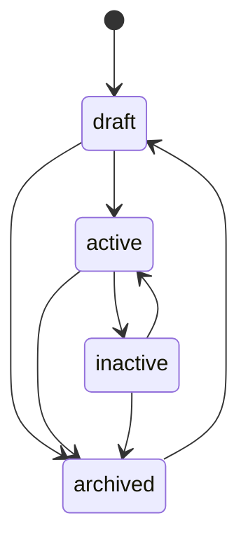
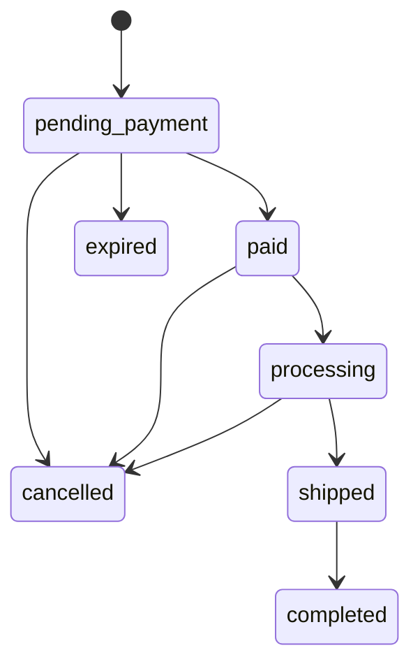

🇮🇩 Bahasa Indonesia · 🇬🇧 [English (source)](cms.md)

<!-- i18n-source-hash: sha256:c6991d6ed327450a421da27e307562416853892a5b297bd069327fb233c1b619 -->

# CMS: authoring, publikasi, izin, audit, media, taksonomi

Bagaimana produk, pesanan, permukaan pemasaran, dan konten bergerak melewati siklus hidupnya di dalam `apps/cms`, dan apa yang akan — dan tidak akan — ditemukan pembaca yang mencari media, iklan, atau UI admin yang lebih lengkap di sini. Modulnya sendiri adalah [`apps/cms/src/modules/commerce/`](../apps/cms/src/modules/commerce/), didokumentasikan mendalam di [`README.md`](../apps/cms/src/modules/commerce/README.id.md) miliknya sendiri — halaman ini menautkan ke dokumen itu alih-alih menyatakannya ulang kolom demi kolom, dan berfokus pada alur kerja yang dilalui orang atau agen yang benar-benar menulis konten. Authoring berita/blog (`blog_content`) adalah modul milik `ahliweb/awcms` sendiri, dibawa oleh embed subtree; halaman ini hanya mendeskripsikan bagaimana `apps/storefront` mengonsumsinya, bukan alur kerja adminnya sendiri.

## Mesin status

### `status` produk: `draft` → `active`/`inactive`/`archived`

Dibaca langsung dari `LEGAL_TRANSITIONS` milik [`apps/cms/src/modules/commerce/domain/product-status.ts`](../apps/cms/src/modules/commerce/domain/product-status.ts):

Produk ditulis sebagai `draft`, dialihkan ke `active` untuk dijual, ditarik ke `inactive` untuk dikeluarkan dari penjualan tanpa kehilangan catatannya, dan dipindah ke `archived` untuk dipensiunkan — dari mana hanya `draft` yang membukanya kembali. `current === next` selalu legal (no-op, bukan error). `status` melintas lewat `PATCH /api/v1/commerce/products/{id}` yang sama seperti field lainnya, diperiksa terhadap `LEGAL_TRANSITIONS` **sebelum** tulisan apa pun berjalan.

### `status` pesanan: tujuh state, tiga aktor

Dibaca langsung dari [`apps/cms/src/modules/commerce/domain/order-status.ts`](../apps/cms/src/modules/commerce/domain/order-status.ts):

Setiap edge legal juga dibatasi oleh **siapa** yang boleh menerapkannya (`actorMayApplyOrderStatus`):

| Aktor | Boleh menerapkan |
| --- | --- |
| `admin` | Edge legal apa pun di atas |
| `customer` | Hanya `pending_payment → cancelled` (pesanannya sendiri, diperiksa lewat telepon) |
| `system` (job `commerce:orders:expire`) | Hanya `pending_payment → expired` |

Setiap transisi menulis satu baris ke `awcms_commerce_order_events` (append-only, `from_status`/`to_status`/`actor`/`note`/`created_at` — lihat [`docs/skema-basis-data.md`](skema-basis-data.id.md)), yang menjadi sumber timeline pelacakan-pesanan storefront. Penjualan kasir POS (issue #116, di bawah) menempuh graf yang sama dalam satu transaksi — `[*] → pending_payment → paid`, kedua barisnya beraktor `admin` — sehingga tidak pernah menambah state atau sisi baru. `completed`, `cancelled`, dan `expired` bersifat terminal. `paymentStatus` (`unpaid → dp_paid/paid → refunded`) adalah sumbu terpisah dari `status`, diset oleh `PATCH .../payment-confirmations/{cid}/review` (`decision: "accepted"` mengubahnya menjadi `paid`) atau, untuk uang muka, saat pembuatan pesanan.

### `status` flash sale: dua state editorial, dua state turunan-job

`draft`/`scheduled` diset oleh owner; `active`/`ended` **diturunkan dari jendela waktu** dan dipersist oleh job `commerce:flash-sales:tick` (jadwal `*/5 * * * *`), yang memicu `commerce.flash_sale.{started,ended}` tepat sekali per transisi — halaman yang membaca `GET /flash-sales/active` tidak pernah perlu menghitung jendelanya sendiri.

## Izin dan otorisasi: 39 kunci di tiga area

Setiap rute commerce dijaga pada satu kunci izin `commerce.*`, dikelompokkan ke dalam tiga area di bawah. (Jumlah baris tabel ini dijaga otomatis oleh penanda `hitung:` di [`cms.md`](cms.md), sumber Inggris dokumen ini — lihat berkas itu.)

| Area | Resource | Aksi |
| --- | --- | --- |
| Catalog | `categories`, `products` | `read`, `create`, `update`, `delete`, `restore` |
| Marketing | `flash_sales`, `vouchers`, `sliders`, `testimonials`, `popups` | `read`, `create`, `update`, `delete` |
| Pengaturan toko | `settings` | `read`, `update` |

Orders, customers, dan reviews adalah area keempat yang lebih sempit: `commerce.orders.{read,update}`, `commerce.customers.{read,update}`, `commerce.reviews.{read,update,delete}` — **sengaja tanpa `create`/`delete`** untuk orders atau customers, karena keduanya hanya dibuat lewat jalur storefront anonim, yang tidak punya identitas admin untuk diperiksa izinnya. SATU-SATUNYA jalur pembuatan pesanan yang di-gate izin adalah penjualan kasir POS (issue #116): `commerce.pos.create` menjaga `POST /api/v1/commerce/pos/orders`, karena di sana anggota staf-lah aktornya; pembacaan riwayatnya memakai ulang `commerce.orders.read` alih-alih menyemai kunci baca kedua yang lebih sempit tanpa sesuatu yang berbeda untuk ditegakkan. Lihat [`docs/api.md`](api.id.md) untuk tabel izin lengkap dan terkini (39 kunci dasar plus setiap kunci yang ditambahkan tiap anak increment 5 — afiliasi, WhatsApp, percakapan, kampanye, webhook endpoint, POS) dan [ADR-0009](adr/0009-guest-checkout-by-order-code-and-phone.id.md) untuk alasan jalur itu anonim sama sekali. Row-level security menguatkan batas yang sama di lapisan basis data — lihat [`docs/skema-basis-data.md`](skema-basis-data.id.md).

## E-mail OTP akun pelanggan (Issue #89, kontrak #86/ADR-0016 D2)

`POST /account/otp/request` mengirim kode 6 digitnya lewat outbox milik modul `email` sendiri (`awcms_email_messages`), diantre di dalam transaksi yang sama dengan baris OTP, di bawah kategori template turunan baru `derived.commerce_customer_otp` (`registerDerivedEmailTemplateCategory`, tiga variabel: `code`, `expiresInMinutes`, `storeName`). Migrasi `sql/919` men-seed salinan EN+ID template itu untuk setiap tenant yang sudah ada saat migrasi berjalan; tenant yang dibuat setelahnya butuh salinannya sendiri di-seed (alur provisioning-nya, atau operator, sama seperti `email:templates:seed-defaults` milik kategori dasar yang per-tenant dan eksplisit). Ketika `EMAIL_PROVIDER=log` atau `EMAIL_ENABLED` bukan `"true"`, pengiriman lewat adapter `log` sebagai gantinya — satu-satunya tempat di basis kode ini yang menulis kode OTP ke baris log, sehingga pengembangan lokal dan CI bisa menjalankan seluruh alurnya tanpa kredensial e-mail.

Dua pasangan batas laju yang bisa diatur lewat env mengatur permukaan ini: `COMMERCE_ACCOUNT_OTP_RATE_LIMIT_{MAX_PER_IP,WINDOW_SEC,MAX_PER_EMAIL}` (default 10/IP/jam, 5/e-mail/jam) untuk `otp/request`, dan `COMMERCE_ACCOUNT_OTP_VERIFY_RATE_LIMIT_{MAX_PER_IP,WINDOW_SEC}` (default 20/IP/jam) untuk `otp/verify` — lihat `.env.example` di `apps/cms`.

## OTP akun pelanggan lewat WhatsApp (Issue #108, kontrak #106 D5)

Tindak lanjut WhatsApp dari D2: `POST /account/otp/request` menerima `via?: "email"|"whatsapp"` (default `email`). `via: "whatsapp"` mewajibkan `phone` (dinormalisasi ke E.164), hanya pernah mendukung `purpose: "login"` (pendaftaran tetap hanya OTP e-mail — kombinasi `register` adalah `400 VALIDATION_ERROR`), dan menjawab `409 CHANNEL_UNAVAILABLE` — diperiksa dan dijawab SEBELUM baris OTP pernah diterbitkan — saat `COMMERCE_WHATSAPP_ENABLED` bukan `"true"` (fakta konfigurasi, bukan oracle enumerasi baru: tidak bergantung pada apakah telepon yang diberikan benar-benar punya akun). `POST /account/otp/verify` menerima `phone` sebagai alternatif `email` (saling eksklusif), menyelesaikan akun lewat telepon baris pelanggannya (`findAccountByPhone`), bukan lewat e-mail — "login lewat WhatsApp" hanya pernah mengautentikasi akun yang sudah ada.

Kode dikirim lewat outbox provider kedua yang dimodelkan persis seperti `email` (`awcms_commerce_whatsapp_messages`/`_delivery_attempts`, `sql/925`), didispatch oleh `bun run commerce:whatsapp:dispatch` (claim/send/finalize, lease, circuit breaker, backoff — bentuk sama seperti `email:dispatch`) terhadap `COMMERCE_WHATSAPP_PROVIDER` yang di-resolve (`fonnte`, `meta`, atau `log` untuk dev/CI — satu-satunya adapter yang menulis kode ke baris log). `GET /api/v1/commerce/whatsapp/messages` (`commerce.whatsapp.read`) dan `/admin/commerce-whatsapp` memberi operator diagnostik baca-saja atas outbox — telepon tersamar saja, tidak pernah nomor asli/isi pesan yang dirender/kode.

## Sumber daya akun pelanggan (Issue #91, kontrak #86/ADR-0016)

`/api/v1/commerce/storefront/account/{addresses,wishlist,orders,reviews}` — setiap rute dijaga bearer (`requireCustomerSession`), dibatasi laju per IP di bawah `COMMERCE_STOREFRONT_RATE_LIMIT_{MAX,WINDOW_SEC}` (default 60/menit, pasangan env yang sama yang sudah dipakai rute pelacakan anonim), dibatasi ukuran body, dan preflight CORS-nya menyertakan `authorization` bergabung dengan `content-type` di daftar header yang diizinkan (preflight permintaan bearer kalau tidak begitu tidak akan pernah sampai ke pemanggilan sungguhan peramban).

- **Alamat.** Maksimal 10 baris hidup per akun (`409 ADDRESS_LIMIT_REACHED`); alamat PERTAMA yang pernah disimpan otomatis menjadi default; `GET` mendaftar default lebih dulu. Persis satu default per pelanggan adalah invarian DATABASE, bukan sekadar invarian aplikasi — indeks unik parsial `sql/920` pada `(tenant_id, customer_id) WHERE is_default AND deleted_at IS NULL`. Menghapus default mempromosikan alamat yang paling baru dibuat di antara sisanya; `PATCH` tidak pernah menyentuh `isDefault` (hanya `POST .../default` yang menyentuhnya).
- **Wishlist.** `PUT {productIds}` menggabung-union ke apa pun yang sudah dimiliki akun, maksimal 200 baris hidup, dan mengembalikan daftar gabungan yang otoritatif; id yang tidak meresolusi ke produk hidup DI TENANT INI dilewati secara diam-diam — penjagaan "FK telanjang tidak bisa mengisolasi per tenant" yang sama yang sudah diikuti rujukan category/order-item modul ini, diperiksa di lapisan aplikasi di dalam transaksi berlingkup RLS. `GET` hanya menampilkan produk yang dipublikasikan (`status = 'active'`), belum dihapus; produk yang dimoderasi keluar dari status itu, atau dihapus lunak, langsung berhenti muncul — baris wishlist-nya sendiri tidak tersentuh. `DELETE /wishlist/{productId}` menghapus lunak dan selalu menjawab `204`, bahkan untuk produk yang belum pernah di-wishlist.
- **Order.** `GET /orders` berpaginasi keyset (`cursor`, `limit` ≤ 50, default 20), terbaru dulu, `created_at >= account.historyFrom` (ADR-0016 D4) ditegakkan DI DALAM query. `GET /orders/{orderCode}` tidak perlu nomor telepon — bearer sudah membuktikan kepemilikan — dan memeriksa KEDUANYA kepemilikan dan `historyFrom` di dalam query yang sama, sehingga kode yang tidak dikenal, order akun lain, dan yang lebih lama dari `historyFrom` semuanya menjawab `404` netral yang identik. Keduanya memakai ulang bentuk order yang sama yang dikembalikan `GET .../orders/{code}?phone=`.
- **Ulasan.** `GET /reviews` mendaftar setiap ulasan yang akun itu sendiri kirimkan, status moderasi apa pun, dengan nama produk dan kode order disematkan.

**Kedua rute anonim yang sudah ada kini menerima bearer opsional.** `POST /storefront/orders` dan `POST /storefront/reviews`: `Authorization: Bearer …` yang hadir dan valid membuat pelanggan order/ulasan menjadi baris pelanggan MILIK akun itu SENDIRI — `findOrCreateCustomerByPhone`/lookup kepemilikan yang dicocokkan telepon dilewati sepenuhnya dalam kasus itu, meski field telepon tetap divalidasi bentuknya dan tetap menjadi kunci rate limit per telepon. Bearer yang hadir tapi tidak valid/kedaluwarsa menjawab `401 UNAUTHENTICATED` secara eksplisit, bukan diam-diam jatuh kembali ke jalur tamu — storefront membaca ulang sesinya sendiri tepat sebelum submit dan perlu diberi tahu secara jelas bahwa sesi itu sudah basi. Tanpa header `Authorization` sama sekali, kedua rute tetap persis sama seperti sebelum issue ini. `POST /storefront/orders` juga menerima field `affiliateCode` — divalidasi bentuknya (string, maksimal 50 karakter) dan, sejak #92, diresolusi terhadap `awcms_commerce_affiliates.code` serta mencatat sebuah referral.

## Log audit

Setiap rute owner yang mengubah data — create, update, delete, restore, transisi status, review konfirmasi-pembayaran, moderasi ulasan — memanggil `recordAuditEvent` di dalam transaksi ber-RLS yang sama dengan tulisan yang dicatatnya, menamai modul (`commerce`), jenis resource, id resource, aksinya, dan (untuk delete) severity `warning`. Tidak satu pun tabel commerce membawa `created_by`/`updated_by`/`deleted_by`, jadi log audit adalah satu-satunya catatan kepelakuan untuk modul ini, bukan catatan tambahan. Jalur storefront anonim tidak menulis event audit apa pun untuk pembuatan pesanan itu sendiri (tidak ada aktor admin untuk diatributkan) — baris `order_events` milik pesanan itu sendiri adalah catatan setara jalur itu, ber-timestamp dan membawa alasan.

## Layar admin: dua belas, mencakup setiap izin

Dua belas layar di bawah `apps/cms/src/pages/admin/`, masing-masing dijaga pada izin `read` area-nya lewat `loadAdminScreen`, dengan pengecekan inline lebih lanjut untuk create/update/delete/restore. (Jumlah baris tabel ini dijaga otomatis oleh penanda `hitung:` di [`cms.md`](cms.md), sumber Inggris dokumen ini — lihat berkas itu.)

| Layar | Rute | Dijaga pada |
| --- | --- | --- |
| Dashboard | `/admin/commerce-dashboard` | `commerce.orders.read` |
| Produk | `/admin/commerce` | `commerce.products.read` |
| Kategori | `/admin/commerce-categories` | `commerce.categories.read` |
| Flash sale | `/admin/commerce-flash-sales` | `commerce.flash_sales.read` |
| Voucher | `/admin/commerce-vouchers` | `commerce.vouchers.read` |
| Slider | `/admin/commerce-sliders` | `commerce.sliders.read` |
| Testimoni | `/admin/commerce-testimonials` | `commerce.testimonials.read` |
| Popup | `/admin/commerce-popup` | `commerce.popups.read` |
| Pengaturan toko | `/admin/commerce-settings` | `commerce.settings.read` |
| Pesanan | `/admin/commerce-orders` (daftar) dan `/admin/commerce-orders/{id}` (detail) | `commerce.orders.read` (tanpa form create) |
| Pelanggan | `/admin/commerce-customers` | `commerce.customers.read` (tanpa form create) |
| Ulasan | `/admin/commerce-reviews` | `commerce.reviews.read` |

Bersama-sama, dua belas layar ini mengklaim setiap satu dari 39 izin yang dideklarasikan modul ini — diverifikasi oleh gate `admin-screen-coverage-ledger.ts` milik `apps/cms` (`admin:screen-coverage:check`) dan dua berkas contract test (`apps/cms/tests/admin-commerce-page-contract.test.ts`, `apps/cms/tests/admin-commerce-marketing-page-contract.test.ts`). Layar Orders dan Customers sengaja tidak punya form create — lihat "Izin dan otorisasi" di atas. Halaman detail pesanan (`apps/cms/src/pages/admin/commerce-orders/[id].astro`, issue #171) adalah rute di bawah izin layar Orders sendiri, bukan layar yang dihitung terpisah untuk keperluan cakupan — ia merender baris pesanan, total, sebuah `.admin-timeline` yang dibangun dari `order_events`, dan panel gateway-session/payment-events yang sudah ada.

### Komposisi ulang admin-chrome 2026-09-21 (issue #171)

Setiap layar admin commerce di atas (kecuali layout dua-panel khusus POS — lihat di bawah) kini dibangun di atas primitive bersama yang ditambahkan restyle admin-chrome ke `admin.css` (issue #170 / awcms#813 upstream), bukan markup khusus per halaman:

- **Dashboard** (`/admin/commerce-dashboard`, baru) — ubin `.admin-stat-card` untuk pesanan hari ini, pendapatan hari ini, dan jumlah stok menipis (tanpa stat tingkat konversi: belum ada proyeksi funnel/kunjungan untuk menghitungnya, jadi dihilangkan alih-alih dikarang); tren pendapatan 14 hari yang dibaca dari proyeksi laporan penjualan yang sudah ada (issue #117); daftar "perlu tindakan" berisi pesanan menunggu konfirmasi, ulasan menunggu moderasi, thread kotak masuk belum dibaca, dan komisi afiliasi tertunda, masing-masing hanya tampil bila pelihat punya izin `read` untuk sumber daya itu dan, bila relevan, fiturnya menyala; serta tabel pesanan terbaru yang memakai ulang bentuk baris `commerce-orders.astro` dengan `.admin-status-pill`. Setiap angka berasal dari `fetchDashboardSummary` (`apps/cms/src/modules/commerce/application/admin-dashboard.ts`) yang membaca tabel nyata atau proyeksi laporan penjualan nyata — tak ada yang berupa placeholder di layar ini.
- **Produk** (`/admin/commerce`) — filter status `.admin-segmented` (Semua/Terbit/Draf) dan `.admin-bulk-bar` untuk aksi massal kategori/publish/archive yang sudah ada.
- **Pesanan** (`/admin/commerce-orders`) — filter tab status `.admin-segmented` dan `.admin-status-pill` per baris; halaman detail baru (`/admin/commerce-orders/{id}`) menambah `.admin-timeline` yang dibangun dari `order_events`, mempertahankan panel gateway-session/payment-events yang sudah ada.
- **POS** (`/admin/commerce-pos`) — tetap memakai grid dua-panel `.pos-layout` sendiri alih-alih primitive generik `.admin-two-pane`, karena sisi keranjang butuh kontrol khusus POS (stepper, jumlah dibayar/kembalian, blok resi `@media print`) yang tak dimodelkan primitive generik; angka uang memakai ulang `.admin-status-pill` untuk indikator kembalian/dibayar.
- **Laporan** (`/admin/commerce-reports`) — `.admin-stat-card` untuk pesanan-lunas/kotor/dsb. plus rentang `.admin-segmented` dan tab Per produk/Per kategori yang sudah ada.
- **Marketing** (flash sale, voucher, slider, popup, testimoni) — komponen `CommerceMarketingTabs.astro` baru yang dibagikan (`apps/cms/src/components/`) merender satu strip tab `.admin-segmented` dengan tautan navigasi `aria-current` di kelima layar, menggantikan lima header hasil tulis-tangan yang nyaris identik.
- **Kotak masuk** (`/admin/commerce-inbox`) — `.admin-two-pane` (daftar thread + percakapan), dengan filter status `.admin-segmented` dan state thread-tertutup yang sudah ada dipertahankan.
- **Afiliasi** (`/admin/commerce-affiliates`) — `.admin-stat-card` untuk jumlah afiliasi-aktif/komisi; tabel komisi approve/reject tidak berubah.
- **Pengaturan** (`/admin/commerce-settings`) — toggle fitur yang sudah ada kini dirender sebagai sakelar `.admin-toggle`, dan setiap provider integrasi (WhatsApp, Midtrans, RajaOngkir) mendapat `.admin-stat-card` dengan `.admin-status-pill` yang menunjukkan terkonfigurasi/tidak, diturunkan hanya dari keberadaan env — tak pernah nilai secret.

Tidak ada layar media commerce yang berubah pada issue ini: `apps/cms` belum punya layar galeri media commerce khusus hari ini (gambar dikelola inline per produk/slider/testimoni, bukan lewat galeri berdiri sendiri), sehingga `.admin-media-grid` tidak dipakai di sini — ia tetap tersedia sebagai primitive untuk layar mana pun yang mengadopsinya berikutnya.

## Media: gambar produk, slider, testimoni — di-resolve, belum di-upload lewat tooling repo ini sendiri

`dependencies` milik `commerce` mendapat `media_library` di increment ini (issue #23), dan setiap referensi gambar — `images[]` produk, `imageMediaObjectId` varian, `sizeChartMediaId` size chart, `mediaObjectId` slider/testimoni/popup — di-resolve lewat `MediaLibraryPort` menjadi URL publik. **Hanya `mediaObjectId` gambar produk yang diperiksa live** terhadap `MediaLibraryPort.isMediaReferenceSafe` sebelum insert; `imageMediaObjectId` varian dan `sizeChartMediaId` size chart hanya divalidasi berbentuk-UUID, tidak diperiksa keberadaan live/terverifikasi — id yang basi atau asing di situ hanya akan resolve menjadi tanpa URL publik saat render, dan RLS tetap menjaganya terisolasi-tenant (dicatat di README modul ini sendiri sebagai pengurangan cakupan yang diketahui dan disengaja).

Yang **tidak** dibangun increment ini: jalur upload nyata untuk gambar-gambar ini lewat tooling repositori ini sendiri. `tools/seed-borneojek-mart.ts` memakai SVG placeholder kecil yang dibuat sendiri (`tools/seed-assets/`) alih-alih mengunduh foto produk sungguhan, dan upload bukti-pembayaran milik storefront anonim sendiri (`POST .../orders/{code}/payment-proof/upload-sessions`) selalu menjawab `503 MEDIA_UNAVAILABLE` — alur upload-session `media_library` yang sudah ada membutuhkan `actorTenantUserId` terautentikasi, yang tidak dimiliki pemanggil checkout anonim mana pun; merancang seam auth anonim kedua yang paralel, terikat pada `(orderCode, phoneHash)`, dinilai di luar cakupan increment ini (dicatat di PR issue #29 sebagai desain sensitif-keamanan yang sengaja ditangguhkan, bukan diburu-buru). `payment.proofUpload: false` pada model baca store-settings publik memberi tahu storefront untuk menyembunyikan kontrolnya saat kondisi ini berlaku; konfirmasi pembayaran tanpa gambar bukti tetap diterima sepenuhnya.

## Lambang lembaga: di-resolve dan dirender (issue #59)

`awcms_blog_institutions` milik `blog_content` membawa `logo_media_id`/`logo_alt` sejak [awcms#806](https://github.com/ahliweb/awcms/pull/807) di upstream, yang masuk ke sini lewat subtree pull `apps/cms`. `apps/storefront` me-resolve id itu lewat `GET /api/v1/media/objects` seperti setiap rujukan media lain, lalu merender lambangnya di samping paragraf pembuka artikel dan di `/mitra/{slug}` — jawaban platform ini atas "Logo Instansi" per-artikel milik seputarborneo.com, dipindahkan ke lembaga yang memang sudah menaungi artikel itu sehingga satu unggahan melayani seluruh artikel kanal tersebut. Kedua field tidak wajib: lembaga tanpa lambang, dan `apps/cms` yang lebih tua dari subtree pull itu, sama-sama tidak merender apa pun.

## Manajemen logo dan favicon: masih di-resolve sebagai id media, belum di-render

Modul `site-profile` milik `apps/cms` mengekspos `logoMediaId`/`faviconMediaId` sebagai bagian dari site profile tenant, hanya bisa di-resolve lewat klien `media_library`. `apps/storefront` membaca site profile (`GET /api/v1/site-profile/composed`, issue #24) tapi tidak me-resolve id mana pun menjadi URL — brand mark storefront adalah nama toko dalam teks, dan `apps/storefront/public/favicon.svg` adalah ikon default yang di-bundle, bukan yang dikelola CMS. Ini adalah pengurangan cakupan yang dicatat dan disengaja (lihat `apps/storefront/README.md`), bukan kelalaian: membangun klien `media_library` di storefront dinilai di luar cakupan untuk pekerjaan chrome/fondasi.

## Taksonomi: kategori commerce, plus hierarki IA berita sendiri

"Taksonomi" mencakup dua tree yang dimiliki secara terpisah:

- **`awcms_commerce_categories`** — tree kategori-produk self-referencing yang dimiliki modul ini (lihat [`docs/skema-basis-data.md`](skema-basis-data.id.md)). `parentId` tak berubah setelah pembuatan, sejalan dengan pilihan `awcms_offices` sendiri untuk alasan yang identik (tidak ada deteksi-siklus yang dibangun untuk keduanya).
- **Hierarki rubrik/daerah/mitra milik `blog_content`** — modul milik `ahliweb/awcms` sendiri, dibawa oleh embed subtree. `/rubrik/{slug}` milik `apps/storefront` menyusuri tree rubrik (kategori) hierarkis di mana arsip rubrik induk mencakup post dari setiap rubrik turunan (issue #28); `/daerah/{slug}` adalah arsip wilayah yang dijangkau lewat `regionCode` sebuah institusi (post itu sendiri tidak membawa field wilayah); `/mitra/{slug}` adalah halaman landing institusi. Tidak satu pun dari ketiganya adalah kategori commerce — ketiganya adalah taksonomi milik `blog_content` sendiri, dirender oleh permukaan berita storefront. Lihat [`docs/routing.md`](routing.id.md) untuk peta URL lengkapnya.

## Iklan: penempatan iklan, sebagaimana `blog_content` merendernya

`AD_PLACEMENT_KEYS` milik `blog_content` mendefinisikan slot header, in-article, dan sidebar — sengaja tidak ada slot footer (diverifikasi terhadap set kunci yang benar-benar terdaftar, bukan asumsi). Halaman berita `apps/storefront` merender slot mana pun yang dikembalikan CMS; tidak ada UI manajemen penempatan-iklan yang didokumentasikan di sini karena itu milik `blog_content`, bukan `commerce` — lihat dokumentasi modul `apps/cms` sendiri untuk sisi admin.

Increment 3 membuat slot-slot itu nyata, bukan sekadar nominal. Kedua belas kunci kini dikonsumsi (`header_banner`, `below_headline`, `homepage_middle`, `homepage_bottom`, `article_top`/`_middle`/`_bottom`, `sidebar_top`/`_middle`/`_bottom`, `category_archive_top`, `search_result_top`), materinya dirender sebagai `` sungguhan lewat klien media ([ADR-0011](adr/0011-storefront-media-resolves-through-the-media-objects-endpoint.md)), dan mengkliknya membuka `<dialog>` native — perilaku popup milik seputarborneo sendiri (issue #53). **Masih tidak ada kunci footer**: leaderboard yang dirender seputarborneo di atas footer-nya adalah `homepage_bottom` aplikasi ini, ditempatkan di sana oleh `FooterBerita.astro` (keputusan 4 epic #46); menambahkan kunci `footer_leaderboard` tersendiri tetap perubahan upstream yang belum dibutuhkan siapa pun. Slot yang tidak terisi tidak merender apa pun — tidak pernah kotak placeholder kosong.

## Program afiliasi: sisi pembeli (issue #93); sisi admin/staf adalah issue #92, keduanya sudah diimplementasi

[ADR-0016](adr/0016-customer-accounts-are-otp-verified-commerce-accounts-with-bearer-sessions.id.md) milik `apps/cms` sendiri merancang program afiliasi dari nol, sesuai keputusan D5-nya: `awcms_commerce_affiliates` (satu baris per pelanggan yang bergabung, `code` unik per tenant, `commission_rate`, `status`) dan `awcms_commerce_affiliate_commissions` (satu baris per pesanan yang direferensikan, dibuat saat pesanan itu mencapai `completed`; `status` berkembang `pending` → `approved`/`void` → `paid`, digerakkan staf). Referral diri sendiri tidak menghasilkan komisi. Cakupan dokumen ini adalah apa yang dilakukan `apps/storefront` dengan kontrak itu, bukan layar admin yang mengelolanya — issue #92 membangun keduanya: owner API (`commerce.affiliates.read|update`, `commerce.affiliate_commissions.read|update`) dan layar `/admin/commerce-affiliates` (tabel afiliasi dengan suspend/aktifkan/ubah tarif; tabel komisi dapat difilter berdasarkan status dengan approve/pay/void, tiap mutasi membawa `Idempotency-Key`):

- Sebuah tenant menyalakan program dengan mengatur tarif komisi di `/admin/commerce-settings` (kolom nyata `awcms_commerce_store_settings.affiliate_commission_rate`, `null` = mati); storefront tidak pernah melihat tarif itu secara langsung — hanya boolean turunan `affiliateProgramEnabled` pada model baca store-settings PUBLIK, dibaca saat build. Instance awcms yang lebih lama dari fitur ini cukup mengabaikan field tersebut, dan storefront meng-default-kannya ke `false` alih-alih mengasumsikan program yang belum ada entah bagaimana sedang aktif.
- Penangkapan `?ref={code}`, `affiliateCode` saat checkout, dan UI gabung/tautan/statistik/komisi milik `/akun/afiliasi` sepenuhnya menjadi urusan `apps/storefront` — lihat README aplikasi itu sendiri dan [`docs/routing.md`](routing.id.md)/[`docs/seo.md`](seo.id.md) untuk mekanisme sisi-pembelinya. Kontrak CMS sendiri sengaja permisif di sini: `affiliateCode` yang tidak dikenal atau ditangguhkan yang dikirim bersama pesanan diabaikan begitu saja, tidak pernah ditolak — checkout seorang pembeli tidak boleh gagal hanya karena tautan referral basi atau salah ketik milik orang lain. Kode diresolusi terhadap `awcms_commerce_affiliates.code` dan statusnya pada saat PESANAN DIBUAT; `shouldEarnCommission` memeriksa ulang referral-diri-sendiri dan status TERKINI afiliasi tersebut lagi pada saat pesanan mencapai `completed`, karena kode yang valid saat checkout bisa saja milik afiliasi yang ditangguhkan sebelum pesanan selesai.
- `GET/POST /account/affiliate` dan `GET /account/affiliate/commissions` adalah rute berorientasi-pelanggan yang diautentikasi bearer (`/api/v1/commerce/storefront/account/affiliate*`) — permukaan autentikasi yang SAMA dengan `/account/me`/`/account/orders`, bukan owner API yang dipakai layar admin.

## Kotak masuk komersial (issue #111, kontrak #106 D8)

Thread milik akun pelanggan terverifikasi dengan toko — `awcms_commerce_conversations`/`awcms_commerce_messages` (`apps/cms/sql/927_awcms_commerce_conversations_schema.sql`), dimiliki tepat satu baris `awcms_commerce_customer_accounts` (ADR-0016). Pelanggan guest checkout tidak punya akun, sehingga tidak punya thread kotak masuk — persyaratan akun yang sama yang sudah dimiliki program afiliasi di atas.

- **Sisi storefront (bearer):** `GET/POST /account/conversations` (daftar, terbaru-aktivitas dulu, keyset; membuka thread dengan pesan pertamanya sendiri — subjek 1-150 karakter, isi 1-4000 karakter), `GET /account/conversations/{id}` (thread + pesan, menandai terbaca untuk pelanggan), `POST /account/conversations/{id}/messages` (kirim balasan). Mengirim ke thread yang sudah ditutup toko menjawab `409 CONVERSATION_CLOSED` — pelanggan tidak pernah bisa membuka kembali thread miliknya sendiri; hanya balasan toko yang melakukan itu. Kiriman pelanggan dibatasi laju 10/jam per AKUN (`COMMERCE_CONVERSATION_POST_RATE_LIMIT_MAX`), di atas pembatas per-IP biasa yang sudah dipakai setiap rute storefront.
- **Sisi owner:** `GET /api/v1/commerce/conversations?status=&unread=` (daftar staf, bisa difilter), `GET .../conversations/{id}` (menandai terbaca untuk toko), `PATCH .../conversations/{id}` (`{status: "open"|"closed"}` — tutup/buka kembali eksplisit), `POST .../conversations/{id}/messages` (balasan staf, `Idempotency-Key` wajib — inilah mutasi berisiko tinggi di permukaan ini, karena mengantre e-mail). Digerbangi `commerce.conversations.read|update`.
- **Flag belum-dibaca** adalah dua boolean independen pada baris percakapan — `unread_for_store` menyala pada pesan pelanggan dan mati saat staf membaca thread; `unread_for_customer` menyala pada balasan staf dan mati saat pelanggan membacanya. Keduanya denormalized dan dijaga selaras dengan `awcms_commerce_messages` di dalam TRANSAKSI YANG SAMA dengan penyisipan pesan, tidak pernah diturunkan lewat join saat baca. Field kontrak `Percakapan.unreadForCustomer` milik storefront sendiri (`akun-klien.ts`) melintas sebagai `0|1`, persis selaras dengan bentuk ini.
- **Balasan staf memberitahu pelanggan lewat e-mail** — satu pesan `derived.commerce_conversation_reply` diantre lewat outbox modul `email` yang sudah ada, dalam TRANSAKSI YANG SAMA dengan penyisipan balasan, men-seed templat default otomatis saat pertama kali tak ditemukan (`ensureConversationReplyTemplate`, pola identik yang sudah ditetapkan `ensureCustomerOtpTemplate` milik `customer-otp-channel-adapters.ts` untuk OTP e-mail). Variabel templat: `name`, `subject`, `storeName`, `link` (`COMMERCE_STOREFRONT_PUBLIC_URL` + `/akun/pesan?id=<conversationId>`). Tidak ada notifikasi WhatsApp di issue ini — outbox D5 milik toko sendiri tidak dipakai ulang di sini.
- **Layar admin** `/admin/commerce-inbox`: daftar percakapan dengan filter status/belum-dibaca dan lencana belum-dibaca, tampilan thread dibuka lewat `?id=`, formulir balasan (skrip klien mengirim `Idempotency-Key`), dan tombol tutup/buka kembali.
- **Data subjek:** kedua tabel `unreachableBySubject: true` — akun pelanggan pemilik tidak membawa id `tenant_user`/`identity`/`profile`/`principal` (ADR-0016 D1), celah identik yang sudah didokumentasikan `commerce.customer_addresses`/`commerce.wishlists`; pemilik akun mencapai thread miliknya sendiri lewat rute bearer di atas, yang berada di luar cakupan mesin ekspor/penghapusan otomatis per-subjek repo ini menurut konstruksinya (lihat array `subjectData` milik `module.ts`).

## Kampanye pelanggan: consent, e-mail/WhatsApp massal (issue #114, kontrak #106 D9)

Pengiriman massal bergerbang consent ke sebagian pelanggan tenant yang difilter — `awcms_commerce_campaigns`/`awcms_commerce_campaign_recipients` (`apps/cms/sql/929_awcms_commerce_campaigns_schema.sql`), memakai KEMBALI outbox e-mail/WhatsApp yang sama yang sudah dipakai OTP (D5) dan kotak masuk (D8) — tanpa mekanisme pengiriman ketiga, tanpa cerita rate-limit terpisah.

- **Consent itu penentu.** `awcms_commerce_customer_accounts.marketing_consent_at` adalah timestamp nullable: non-null berarti pemilik akun setuju pada saat itu, `NULL` berarti tidak pernah setuju (atau sudah dicabut). Hanya diubah oleh akun itu sendiri, lewat `PATCH /api/v1/commerce/storefront/account/me {marketingConsent: true|false}` — tidak pernah oleh staf, dan tidak ada rute admin yang mengaturnya untuk pelanggan. Karena consent hidup di baris AKUN, pelanggan guest checkout tanpa akun secara struktural tidak terjangkau kampanye apa pun, bentuk "tanpa akun, tanpa jangkauan" yang sama yang sudah ditetapkan kotak masuk (D8). Baik pemberian maupun pencabutan diaudit (tipe resource `customer_marketing_consent`).
- **Filter audiens.** `{levels: number[], hasAccount: boolean|null, lastOrderSince: string|null}` — setiap filter yang tak kosong mempersempit lebih lanjut (AND, bukan OR); `{}` menyasar setiap akun yang consent dan bisa dialamatkan. `hasAccount: false` diselesaikan menjadi himpunan KOSONG menurut definisi, karena consent sendiri mensyaratkan akun. Sebuah kanal tambahan mensyaratkan alamat: `email` butuh `email_normalized` tak kosong, `whatsapp` butuh `phone` pelanggan tak kosong.
- **CRUD + pratinjau.** `GET/POST /api/v1/commerce/campaigns` (daftar/buat `draft`), `GET/PATCH .../campaigns/{id}` (edit hanya selagi `draft` — `409 CAMPAIGN_NOT_EDITABLE` selainnya), `POST .../campaigns/{id}/preview` (menyelesaikan audiens jadi HITUNGAN penerima saja, tidak pernah daftar yang terselesaikan — anti-enumerasi, sesuai kontrak OpenAPI). Digerbangi `commerce.campaigns.read|update`.
- **Kirim/batalkan.** `POST .../campaigns/{id}/send` memindahkan kampanye `draft`/`scheduled` ke `scheduled` (`scheduled_at = now()` untuk kirim seketika); `POST .../campaigns/{id}/cancel` menghentikannya sebelum (atau selagi) terkirim — penerima yang sudah dienqueue tidak dibatalkan-kirim. Keduanya butuh `Idempotency-Key` (hash terikat pada id kampanye + string aksi literal) dan digerbangi permission terpisah `commerce.campaigns.send` — peran yang dipercaya menyusun/mengedit kampanye tidak otomatis dipercaya mengirim (atau membatalkan)-nya.
- **Dispatcher `commerce:campaigns:dispatch`** (skrip, `awcms_worker`, tiap 1-2 menit): meng-CLAIM kampanye yang jatuh tempo (`scheduled`, jatuh tempo sekarang) atau dilanjutkan (`sending`, proses sebelumnya crash) dengan `FOR UPDATE SKIP LOCKED`; untuk masing-masing, mengulang halaman 200 pelanggan yang belum tercatat, consent, dan bisa dialamatkan (`NOT EXISTS` terhadap `awcms_commerce_campaign_recipients` — inilah yang membuat loop bisa dilanjutkan tanpa kolom cursor terpisah), menyisipkan satu baris penerima per pelanggan (`UNIQUE (campaign_id, customer_id)`, `ON CONFLICT DO NOTHING`) dan mengantre ke outbox e-mail (templat pass-through `derived.commerce_campaign`, di-seed otomatis saat pertama tak ditemukan, pola `ensureConversationReplyTemplate` yang sama yang sudah ditetapkan D8) atau outbox WhatsApp (kunci templat `commerce.campaign` yang sudah dicadangkan sebelumnya). Loop memeriksa ulang `status` hidup kampanye sebelum tiap halaman — `cancel` di antara halaman menghentikan pengiriman lebih lanjut seketika. Halaman kosong menandai kampanye `sent`, dengan `recipient_count` = total baris penerima.
- **Rendering variabel templat.** `subject`/`body` milik kampanye sendiri boleh menyisipkan persis `{{name}}`/`{{storeName}}` (`domain/campaign-content.ts`) — placeholder yang tak dikenal dibiarkan sebagai literal, fail-closed, sikap yang sama yang diambil setiap renderer di kode ini. `subject` wajib untuk `channel: "email"`, opsional dan diabaikan untuk `channel: "whatsapp"`.
- **Layar admin** `/admin/commerce-campaigns`: daftar kampanye, formulir buat-draf (kanal, subjek, pesan, centang level pelanggan), dan panel detail/editor (`?id=`) dengan tombol pratinjau-audiens (hanya hitungan) dan aksi kirim/batalkan (keduanya digerbang `window.confirm`).
- **Data subjek:** `awcms_commerce_campaigns` adalah `unreachableBySubject: true` (dialamatkan ke sebuah filter, bukan ke pelanggan). `awcms_commerce_campaign_recipients` membawa `customer_id`, tetapi mewarisi celah kosakata `commerce.customers`/`commerce.orders` yang SAMA (ADR-0016 D1: tidak ada id `tenant_user`/`identity`/`profile`/`principal`) — `address_masked` sudah dimasking saat ditulis, jadi tidak ada lagi yang perlu diredaksi sekalipun terjangkau.

## Tarif kurir: RajaOngkir, ter-cache (issue #107, contract #106 D4)

`ShippingRateProvider` (`apps/cms/src/modules/commerce/domain/shipping-rate-provider.ts`) adalah sebuah port, bentuk yang sama dengan port provider `email`: `searchDestination(query)` dan `getRates({originId, destinationId, weightGrams, couriers})`, di-resolve di tepi dari `COMMERCE_SHIPPING_RATE_PROVIDER` (`rajaongkir` atau `log`) — lihat [`docs/deployment.md`](deployment.id.md) untuk variabel env-nya. Adapter RajaOngkir (Komerce API v2) dan saudaranya yang mengembalikan fixture `log` sama-sama mengimplementasikannya; tidak satu pun diimpor dengan namanya di luar adapter itu sendiri dan resolvernya.

- **Cache, dua tabel.** `awcms_commerce_courier_destinations` memetakan kode kecamatan `idn_admin_regions` milik tenant ke id tujuan milik provider (di-resolve sekali, lewat pencarian nama kecamatan+kota, tidak pernah di-resolve ulang setiap quote). `awcms_commerce_shipping_rates` meng-cache tarif per `(tenant, provider, asal, tujuan, bucket berat, kurir, layanan)`, TTL 6 jam; `commerce:shipping-rates:purge` menghapus baris kedaluwarsa setiap jam.
- **Pembulatan berat.** `domain/weight-bucket.ts`'s `computeWeightBucketGrams` membulatkan total berat keranjang ke atas ke kelipatan 100 g berikutnya, dengan lantai 1000 g — berat minimum tertagih RajaOngkir sendiri — sehingga dua keranjang dalam pita 100 g yang sama berbagi satu baris cache.
- **Provider tidak pernah dipanggil dari dalam transaksi database** (ADR-0006/0010): pembacaan cache adalah satu transaksi pendek, panggilan provider (bila cache meleset) terjadi tanpa transaksi terbuka sama sekali, dan penulisan-balik adalah transaksi pendek kedua dengan `ON CONFLICT ... DO UPDATE` — cache miss yang bersamaan pada key yang sama hanya berarti penulis terakhir yang menang, tidak pernah error.
- **Jalur quote.** `POST .../cart/quote` menerima `destination: {districtCode}` opsional; saat `shipping.courier.enabled` milik tenant DAN provider dikonfigurasi DAN sebuah destination dikirim, entri kurir pada `shippingOptions[]` adalah tarif langsung per layanan (`{method:"courier", serviceId:"jne:REG", name, cost, etd, available:true}`); jika tidak, satu placeholder `available:false` dengan `note` (tidak ada destination dikirim, atau kecamatannya tidak bisa dicocokkan ke kurir — `"Tujuan belum dikenali kurir"`).
- **Pembuatan pesanan memvalidasi hanya terhadap cache.** `shipping: {method:"courier", serviceId}` milik `POST .../orders` dicek terhadap baris `awcms_commerce_shipping_rates` yang belum kedaluwarsa, dikunci dari `districtCode` milik alamat pengiriman sendiri — tidak pernah panggilan provider langsung kedua dari dalam transaksi tulis pesanan. Pilihan yang basi/tidak dikenal menjawab `409 CART_CHANGED` yang sama (dengan quote baru) seperti setiap ketidakcocokan harga/stok/pengiriman lainnya.
- **Pengaturan toko.** `shipping.courier = {enabled, originDestinationId, couriers[]}` (owner, `PUT /store-settings`) adalah sakelar on/off-nya, asal RajaOngkir milik tenant sendiri, dan kode kurir mana yang di-quote. `GET /api/v1/commerce/shipping/destinations?search=` (hanya owner, `settings.update`) mendukung pemilih asal admin di bagian kurir `/admin/commerce-settings`. `shipping.courierEnabled` pada model baca publik bernilai `true` hanya saat `courier.enabled` DAN provider dikonfigurasi — tidak pernah salinan mentah dari flag yang tersimpan.

## Gerbang pembayaran: Midtrans Snap (issue #110, contract #106 D3) + intake webhook dan reconcile (issue #113, contract #106 D2)

`PaymentGatewayProvider` (`apps/cms/src/modules/commerce/domain/payment-gateway-provider.ts`) adalah sebuah port, bentuk yang sama seperti yang ditetapkan `ShippingRateProvider` untuk #107: `createSession(order)`, `fetchStatus(providerRef)`, `verifyWebhook(...)`, di-resolve di tepi dari `COMMERCE_PAYMENT_GATEWAY` (`midtrans` atau `log`) — lihat [`docs/deployment.md`](deployment.id.md) untuk variabel env-nya. Adapter Midtrans Snap dan saudaranya `log` yang mengembalikan fixture sama-sama mengimplementasikannya; `log` ditolak di luar deployment non-production.

- **Pembuatan sesi, dua transaksi.** `createGatewaySession` memvalidasi pesanan (harus `payment.method: "gateway"`, status `pending_payment`) dan mengecek sesi hidup yang sudah ada dalam satu transaksi pendek, memanggil provider tanpa transaksi terbuka, lalu menyimpan baris `awcms_commerce_payment_gateway_sessions` baru dalam transaksi pendek kedua — disiplin ADR-0006/0010 yang sama seperti `getCourierRates` milik #107.
- **Idempoten by design, bukan lewat `Idempotency-Key`.** Panggilan berulang untuk pesanan yang sama selagi sesinya masih hidup (`status IN ('created', 'pending')`) mengembalikan sesi ITU; `order_id` milik Midtrans sendiri (`${orderCode}-${attempt}`) unik per attempt, sehingga sesi tidak pernah dicetak dua kali di provider untuk attempt yang sama.
- **Auth: telepon atau bearer.** `POST .../orders/{orderCode}/payment-gateway/sessions` menerima `{phone}` di body atau bearer pelanggan, pola bearer opsional yang sama seperti `POST .../orders`. Pesanan tak dikenal, telepon salah, atau bearer hidup milik pemilik pesanan LAIN semuanya menjawab `404` netral yang sama seperti rute pelacakan pesanan — tidak pernah respons yang bisa dibedakan "ada tapi bukan milikmu".
- **Pemetaan status.** `domain/gateway-status-mapping.ts` memetakan `transaction_status`/`fraud_status` milik Midtrans ke kosakata `paid|pending|expired|failed|refunded` milik modul ini sendiri; `fetchStatus` maupun `verifyWebhook` berbagi pemetaan itu sehingga pengecekan status dan callback webhook tidak pernah bisa berselisih.
- **Jalur quote.** `paymentMethods[]` milik `POST .../cart/quote` mendapat `{method: "gateway", available}` — `true` hanya saat `payment.gateway.enabled` milik tenant DAN sebuah `PaymentGatewayProvider` dikonfigurasi untuk deployment ini.
- **Pengaturan toko / admin.** `payment.gateway = {enabled}` (owner, `PUT /store-settings`) adalah sakelar on/off-nya; `payment.gatewayEnabled` pada model baca publik bernilai `true` hanya saat `gateway.enabled` DAN provider dikonfigurasi — tidak pernah salinan mentah dari flag yang tersimpan. `/admin/commerce-settings` mendapat sakelar enable plus panel webhook-endpoint: owner `GET|POST /api/v1/commerce/webhook-endpoints` (daftar ter-mask; token mentah ditampilkan tepat sekali, saat pembuatan, di-hash saat disimpan) dan `DELETE .../webhook-endpoints/{id}` (cabut), digerbangi pada `commerce.webhook_endpoints.update`.
- **Lookup bootstrap webhook-endpoint.** `awcms_resolve_commerce_webhook_endpoint(token_hash)` adalah fungsi `SECURITY DEFINER` yang meniru pola `awcms_resolve_tenant_domain_lookup` persis (peran pemilik NOLOGIN khusus, policy baca yang dibatasi sempit, EXECUTE dibatasi ke `awcms_app`) — me-resolve `(tenant_id, provider)` dari token opak sebelum konteks tenant apa pun ada.

### Buku panduan operator — membuat webhook-endpoint dan mengarahkan Midtrans ke situ

1. Di panel webhook-endpoints pada `/admin/commerce-settings`, klik "create" untuk provider `midtrans`. Token plaintext (`awcmswh_…`) ditampilkan **tepat sekali** — salin sekarang; hanya hash SHA-256-nya yang disimpan (list/`GET` tidak pernah menampilkannya lagi).
2. Susun URL callback lengkap: `https://<domain-tenant-Anda>/api/v1/commerce/webhooks/midtrans/<token>`.
3. Tempelkan URL itu ke pengaturan **Payment Notification URL** di dashboard Midtrans (Settings → Configuration, untuk sandbox maupun production Merchant Portal, sesuai `COMMERCE_MIDTRANS_IS_PRODUCTION` deployment ini).
4. Atur variabel env deployment (lihat [`docs/deployment.md`](deployment.id.md)): `COMMERCE_PAYMENT_GATEWAY=midtrans`, `COMMERCE_MIDTRANS_SERVER_KEY`, `COMMERCE_MIDTRANS_IS_PRODUCTION`. `COMMERCE_MIDTRANS_SNAP_BASE_URL`/`COMMERCE_MIDTRANS_STATUS_BASE_URL`/`COMMERCE_MIDTRANS_TIMEOUT_MS` adalah override opsional.
5. Jika token bocor atau sebuah integrasi dipensiunkan, cabut (`DELETE .../webhook-endpoints/{id}`) dan buat yang baru — URL dashboard Midtrans diperbarui pada saat yang sama, karena token lama langsung berhenti ter-resolve.

### Rute intake webhook (issue #113)

`POST /api/v1/commerce/webhooks/{provider}/{endpointToken}` — publik, tanpa sesi (didaftarkan di daftar pengecualian `lib/security/api-body-auth-boundary.ts`, keluarga yang sama dengan entri berkredensial-HMAC `/api/v1/sync/push`). Urutan gerbang:

1. Pembacaan body, dibatasi ukurannya.
2. `(tenant_id, provider)` di-resolve dari hash token lewat fungsi bootstrap di atas. Token tak dikenal/dicabut, segmen path `{provider}` yang tidak cocok dengan hasil resolve token, atau tidak ada provider yang dikonfigurasi untuk deployment ini — semuanya menjawab `404` netral YANG SAMA, setelah respons dipadatkan ke sebuah latensi lantai (`NEUTRAL_404_MIN_LATENCY_MS`) sehingga kedua kasus tidak bisa dibedakan lewat timing.
3. `provider.verifyWebhook(...)` — signature yang buruk/hilang adalah `401`.
4. Di dalam satu transaksi `withTenantOrThrow`: `INSERT INTO awcms_commerce_payment_events (...) ON CONFLICT (tenant_id, provider, event_key) DO NOTHING` — nol baris terpengaruh berarti callback yang DIULANG (replay), dijawab `200` tanpa efek samping. Selain itu status yang sudah dipetakan diterapkan: `paid` → `markOrderPaidBySystem`; `expired` → `expireOrderBySystem` (hanya dari `pending_payment`, diserap diam-diam selain itu); `failed`/`refunded` → baris sesi gateway diperbarui, pesanan dibiarkan tidak tersentuh. Rute ini **tidak pernah** memanggil provider itu sendiri (tidak ada `fetchStatus`) — `fetchStatus` adalah urusan eksklusif job reconcile.

**Penjaga nominal (pertahanan berlapis).** Sebelum transisi pesanan apa pun, `gross_amount` yang dilaporkan provider dibandingkan dengan `total` pesanan sendiri dalam sen bulat (`domain/payment-amount-guard.ts`). Ketidakcocokan — atau nominal yang tak terbaca — tidak pernah menandai pesanan lunas: peristiwanya tetap dicatat (penjaga replay tetap berlaku) dengan `outcome = 'amount_mismatch'` (`sql/934` memperlebar CHECK-nya), satu entri audit-log ditulis terhadap pesanan itu, sesi gateway dipindah ke `failed` **hanya** jika status provider itu sendiri adalah kegagalan terminal (`failed`/`expired`) dan selain itu dibiarkan `pending`, dan rute tetap menjawab `200` agar Midtrans berhenti mencoba ulang. Callback berikutnya dengan nominal yang benar (`event_key` berbeda) melunasi pesanan secara normal. Job reconcile menerapkan penjaga identik pada `gross_amount` dari `fetchStatus`.

`markOrderPaidBySystem` (`application/order-directory.ts`) menyetel `paid_at`/`payment_status`, `gateway_provider`/`gateway_ref` pada pesanan, satu baris `order_events` dengan aktor `system`, dan satu entri audit-log — idempoten: pesanan yang sudah `paid` adalah no-op, dan pesanan dalam status apa pun selain `pending_payment`/`paid` (mis. sudah `cancelled`) juga no-op, bukan error.

**Mengapa `paid -> refunded` tidak pernah diterapkan otomatis.** Graf status `domain/order-status.ts` TIDAK memiliki status `refunded` sama sekali — refund yang dilaporkan gateway (Midtrans `refund`/`partial_refund`) dicatat sebagai peristiwa pembayaran (terlihat di panel peristiwa-pembayaran detail pesanan admin) tapi tidak pernah memindahkan pesanan secara otomatis. Alasannya: refund di gateway bisa dipicu oleh sesuatu di luar pengetahuan platform ini tentang MENGAPA (sengketa pembeli, tindakan tim fraud), dan pembatalan otomatis konsekuensi fulfilment (restock, pembatalan komisi afiliasi, notifikasi pelanggan) dari webhook tanpa pengawasan adalah radius ledakan yang lebih besar daripada mewajibkan owner membaca peristiwa itu dan menerapkan sendiri aksi admin manual `-> cancelled` yang SUDAH ADA. Lihat header `domain/order-status.ts` sendiri untuk alasan yang sama ditujukan ke developer.

### Job reconcile (issue #113)

`commerce:payments:reconcile` (`bun run commerce:payments:reconcile`, direkomendasikan tiap 1-2 menit lewat cron/systemd timer — webhook bisa hilang, job ini adalah cadangannya): untuk setiap tenant aktif, setiap sesi payment-gateway yang masih `pending` lebih dari 2 menit sejak dibuat mendapat satu panggilan `provider.fetchStatus`, dilakukan TANPA transaksi database terbuka, dibungkus `withTimeout` + circuit breaker DI DALAM adapter itu sendiri (`infrastructure/midtrans-provider.ts`) — hasil timeout/breaker-terbuka/error-provider dilewati untuk tick ini (tetap `pending`, dicoba lagi run berikutnya), tidak pernah dilempar sebagai error. Setiap sesi yang sudah lewat `expires_at`-nya sendiri di-expire terlepas dari apa yang dijawab `fetchStatus` (atau tanpa memanggilnya sama sekali, jika sudah lewat kedaluwarsa). Status `paid`/`expired` yang diambil berjalan lewat jalur `markOrderPaidBySystem`/`expireOrderBySystem` YANG SAMA yang dipakai rute webhook. No-op (keluar 0, tidak melakukan apa pun) saat `COMMERCE_PAYMENT_GATEWAY` tidak me-resolve ke provider yang dikonfigurasi.

Tombol "Cek status" pada layar detail pesanan admin (digerbangi pada `commerce.orders.update`, `Idempotency-Key` wajib) memanggil varian tercakup satu-pesanan dari logika yang sama (`POST /api/v1/commerce/orders/{id}/payment-gateway/reconcile`) — tidak pernah batch tenant penuh — untuk owner yang ingin mengecek satu pesanan sekarang juga tanpa menunggu tick terjadwal berikutnya.

## Laporan penjualan: tiga proyeksi reporting di atas log peristiwa pesanan (issue #117, kontrak #106 D7)

`commerce` menyumbangkan tiga proyeksi `cursor_table` ke mesin proyeksi generik modul `reporting` (Issue #753) dari `module.ts`-nya sendiri (`reportingProjections`) — `commerce.sales_daily`, `commerce.sales_by_product`, `commerce.sales_by_category` — semuanya di atas `awcms_commerce_order_events`, log transisi status yang append-only (satu-satunya jenis sumber yang benar untuk strategi itu). Mesin tidak pernah tahu bentuk tabelnya; `commerce` yang memasok deskriptor, aturan delta murni, dan sink-nya.

- **Aturan delta, murni.** `domain/sales-report-deltas.ts`: peristiwa `-> paid` dari status yang belum terbayar MENAMBAHKAN angka pesanan (bruto = subtotal pesanan, diskon = diskon pesanan + voucher, ongkir, neto = total pesanan, ditambah kuantitas dan total baris tiap item per produk dan per kategori produk); peristiwa `-> cancelled` atau `-> refunded` yang `from_status`-nya status terbayar (`paid|processing|shipped|completed`) MENGURANGKANNYA kembali; transisi lain (pembuatan, langkah pemenuhan, pembatalan/kedaluwarsa pesanan yang belum pernah dibayar, refund setelah pembatalan) tidak berkontribusi apa pun. Setiap angka diatribusikan ke hari `paid_at` pesanan dalam zona laporan tetap `Asia/Jakarta` (`SALES_REPORT_TIME_ZONE`), sehingga pembalikan mendarat di baris hari yang sama dengan pembayarannya dan `net` benar-benar neto per hari. Mengubah konstanta zona itu butuh rebuild.
- **Satu perluasan mesin, aditif** (`MODULE_CONTRACT_VERSION` 4.1.0 → 4.2.0): `ProjectionCursorStream.dimensional` (`selectColumns` tambahan + sink `applyBatch` yang dipanggil worker inkremental DAN rebuild pada setiap batch yang diambil, di dalam transaksi pass terbatas yang sama, sebelum kursor maju) dan `ProjectionDescriptor.dimensional` (`resetForTenant`, dipanggil reset rebuild dalam transaksi yang sama dengan reset kursor/metrik; `readProjectionTotals`/`computeSourceTotals`, digabungkan ke rekonsiliasi; `exportRows`, dipakai pembuatan ekspor). `reporting:projections:registry:check` menolak sink tanpa kontrak deskriptor dan sebaliknya. Counter skalar milik mesin (`paid_events`) tetap ada di samping tiap tabel, sehingga kartu proyeksi generik dan rekonsiliasi `COUNT(*)` mesin tetap bekerja tanpa perubahan.
- **Rebuild sama dengan live, rekonsiliasi sama dengan keduanya.** Rebuild menurunkan ulang ketiga tabel lewat `applyBatch` yang persis sama; rekonsiliasi menyusuri seluruh aliran peristiwa lewat fungsi delta yang sama di memori dan membandingkan jumlahnya (pesanan terbayar, sen bruto/diskon/ongkir/neto; kuantitas item dan sen bruto item) dengan `SUM()` atas tabel. `apps/cms/tests/integration/commerce-sales-reports.integration.test.ts` membuktikan keempat sifat itu terhadap Postgres nyata di bawah role tak-berhak-istimewa: paid → baris, batal-setelah-bayar → dikurangkan di hari yang sama, rebuild identik byte-per-byte dengan live, rekonsiliasi tanpa selisih (dan tabel yang diutak-atik MEMANG ditandai).
- **Rute baca** (`reporting.dashboard.read`, work class `reporting`, `defineTenantRoute`): `GET /api/v1/reports/commerce/sales-daily?from&to`, `sales-by-product?from&to&limit` (bawaan 20, maks 200, terlaris menurut bruto lebih dulu), `sales-by-category?from&to` (bucket tanpa kategori dikembalikan sebagai `categoryId: null`). `from`/`to` adalah hari zona-laporan `YYYY-MM-DD` inklusif, bawaan 30 hari terakhir, paling banyak 366 — divalidasi `domain/sales-report-query.ts`, yang juga dipakai `/admin/commerce-reports` sehingga layar dan API tak mungkin berbeda pendapat. Dimiliki `commerce` lewat `api.routes: ["/api/v1/reports/commerce"]` (prefiks terpanjang menang atas klaim `reporting`); didokumentasikan di `openapi/modules/commerce.openapi.yaml`.
- **Layar admin** `/admin/commerce-reports` (`commerce-reports.astro`, `loadAdminScreen`, pintu masuk `reporting.dashboard.read`): formulir rentang tanggal GET, tiga tabel (dengan footer total pada tabel harian), dan tiga panel opsional yang hanya muncul dengan izin milik modul reporting — kesegaran proyeksi (`reporting.projections.read`, menaut ke `/admin/reporting` untuk rebuild/rekonsiliasi), tombol **Ekspor CSV** per proyeksi (`reporting.exports.export`) yang mem-POST ke `/api/v1/reports/exports/trigger` yang sesungguhnya dengan `Idempotency-Key` baru, dan riwayat ekspor terbaru dengan tautan unduh terverifikasi checksum (`reporting.exports.read`). Uang dirender lewat `formatCurrency` dalam IDR; di kabel tetap string `numeric(14,2)`.
- **Ekspor membawa baris, bukan snapshot metrik.** Ekspor proyeksi berdimensi (manual atau `reporting:exports:dispatch`) menulis baris proyeksi itu sendiri (`day, product_id, product_name, qty, gross`, …) sebagai CSV/JSON lewat penulis artefak, checksum, manifes, dan endpoint unduh yang sama dengan ekspor skalar — nilai sel melewati netralisasi injeksi-formula yang sama, yang justru lebih penting di sini karena nama produk adalah teks yang diketik tenant.
- **Keterbatasan yang diketahui.** `awcms_commerce_order_items` menyimpan snapshot nama produk tetapi bukan kategorinya, sehingga atribusi per kategori membaca `products.category_id` saat pemrosesan; mengubah kategori produk tidak memindahkan penjualan lampau, dan rebuild akan mengatribusikannya ulang di bawah kategori baru. Total kontrol rekonsiliasi tidak bergantung kategori, jadi ini perbedaan jujur antara dua rebuild, bukan selisih rekonsiliasi.

## Kasir (point of sale): penjualan tunai di konter, lunas saat itu juga (issue #116, kontrak #106 D6, ADR-0017)

Layar kasir BjekMart, di-re-platform sebagai satu jalur pembuatan pesanan lagi di atas tabel pesanan, mesin quote, dan graf status yang SAMA — bukan buku penjualan kedua. Anggota staf yang memegang `commerce.pos.create` mencatat penjualan konter dari `/admin/commerce-pos`; pesanan dibuat SUDAH `paid`, dikaitkan ke pelanggan walk-in atau pelanggan yang teridentifikasi lewat telepon, dan distempel `channel = 'pos'` sehingga riwayat POS dan laporan penjualan dapat membedakannya dari storefront tanpa menyimpulkan apa pun dari metode pembayaran.

- **Skema** (`sql/931`, `sql/932`): `awcms_commerce_orders.channel text NOT NULL DEFAULT 'storefront' CHECK IN ('storefront','pos')` (setiap pesanan yang dibuat sebelum #116 adalah `storefront` lewat default kolom), `pos_cashier_tenant_user_id uuid` (stempel biasa seperti setiap `created_by`, sengaja BUKAN foreign key — pesanan adalah catatan fiskal yang harus hidup lebih lama daripada akun staf yang mencatatnya), CHECK `payment_method` diperlebar tepat satu nilai (`cash`), indeks `(tenant_id, channel, created_at DESC)` untuk pemindaian riwayat dan indeks parsial `(tenant_id, pos_cashier_tenant_user_id, created_at DESC) WHERE pos_cashier_tenant_user_id IS NOT NULL` untuk filter kasir, plus satu seed izin baru `commerce.pos.create`. Lihat [`docs/skema-basis-data.md`](skema-basis-data.id.md) dan [`docs/kamus-data.md`](kamus-data.id.md) (`channel`, `cash`, sentinel walk-in).
- **Domain.** `PaymentMethod` bertambah `"cash"` (di-re-export tanpa perubahan oleh `pesanan.ts` milik `packages/kontrak`, sehingga `apps/storefront` melihat union yang diperlebar saat kompilasi), tetapi allow-list checkout storefront sendiri (`domain/order-request-validation.ts`) sengaja TIDAK diperlebar — pembeli daring tidak pernah menyerahkan uang tunai fisik, sehingga `payment.method: "cash"` pada `POST .../storefront/orders` adalah `400 VALIDATION_ERROR`, dan bahkan body yang sampai ke lapisan aplikasi tidak akan menemukan metode `cash` yang tersedia di quote (`cart_changed`). `domain/pos-order-validation.ts` adalah validator khusus POS: `lines[] {productId, variantId?, quantity 1..10000}`, `customer {name?, phone?}` opsional, `payment {method: cash|manual_qris, amountTendered}` — `amountTendered` WAJIB untuk tunai sebagai STRING `numeric(14,2)` (angka JSON ditolak), diabaikan untuk QRIS — dan `computeChange(amountTendered, total)`, yang mengurangkan dalam sen `bigint` dan mengembalikan string ([ADR-0003](adr/0003-money-is-numeric-14-2-and-crosses-the-wire-as-a-string.id.md): `"0.30" − "0.10"` tepat `"0.20"`, dan nominal Rupiah dua belas digit tetap eksak). Pembayaran kurang adalah `InsufficientTenderError`, bukan kembalian negatif.
- **Aplikasi** (`application/pos-directory.ts`). `createPosOrder` me-resolve pelanggan lebih dulu — tanpa telepon → satu baris pelanggan WALK-IN per tenant (`findOrCreateCustomerByPhone` dengan sentinel terdokumentasi `POS_WALK_IN_CUSTOMER_SENTINEL_PHONE` = `+620000000000`, nama `Pelanggan Walk-in`, dibuat sekali dan dipakai ulang untuk setiap penjualan tanpa telepon); dengan telepon → cari-atau-buat berdasarkan nomor E.164 yang dinormalisasi persis seperti guest checkout storefront, dan `level` pelanggan itu memberi harga penjualan (mitra level 2 membayar `price_level_2` di konter, issue #118); telepon yang tidak dapat dinormalisasi adalah `400`, bukan diam-diam jatuh ke walk-in. Lalu ia me-re-quote lewat `buildCartQuote` yang SAMA yang dipakai storefront (`shipping: self_pickup`, tanpa voucher/asuransi/alamat; hanya `canCheckout` — setiap baris `ok` soal harga dan stok — yang memutuskan, bukan ketersediaan pengiriman/pembayaran storefront; pengaturan pajak toko TETAP berlaku), menyisipkan pesanan (`status pending_payment`, `payment_status unpaid`, `channel pos`, id tenant user kasir) dan item-itemnya, mengurangi stok produk/varian dan kuota flash sale mana pun, menulis baris `order_events` awal (aktor `admin`), mencatat peristiwa audit `commerce.pos.sale` (atribut: kode pesanan, uang, metode, flag walk-in — tidak pernah nama atau telepon pelanggan), menambahkan `commerce.order.created` (`payload.channel = "pos"`), dan segera menerapkan `pending_payment → paid` lewat `transitionOrderStatus` bersama (`applyPosOrderPaidTransition`: `paid_at`, `payment_status paid`, baris `order_events` kedua beraktor `admin`, baris audit `update` biasa, dan `commerce.order.paid` — persis yang dikonsumsi proyeksi penjualan issue #117, sehingga penjualan konter masuk ke laporan harian/produk/kategori seperti pesanan lunas lainnya). `listPosOrders` adalah riwayatnya: keyset, terbaru dulu, hanya `channel = 'pos'`, filter opsional `dateFrom`/`dateTo` inklusif dan `cashierTenantUserId`, 50 per halaman.
- **Idempotensi.** `Idempotency-Key` adalah header WAJIB (`400 IDEMPOTENCY_REQUIRED` tanpanya), scope `commerce.pos.create` di `awcms_idempotency_keys` bersama; hash permintaan mengikat tenant user yang bertindak (dua kasir yang memakai ulang satu nilai kunci tidak pernah bisa me-replay penjualan satu sama lain). Kunci sama + payload sama me-replay 201 yang tersimpan; kunci sama + payload beda adalah `409 IDEMPOTENCY_CONFLICT`; race konkuren ditangani terpusat oleh `withTenant` seperti setiap mutasi berisiko tinggi lainnya.
- **Rute** (`pages/api/v1/commerce/pos/orders/index.ts`, `defineTenantRoute`, keduanya di belakang flag fitur `pos` → `409 FEATURE_DISABLED`): `GET` (`commerce.orders.read`) — ringkasan daftar pesanan admin plus `paymentMethod`/`cashierTenantUserId`, `?cursor&dateFrom&dateTo&cashier`; `POST` (`commerce.pos.create`) — `201` dengan record pesanan admin plus `change`, `amountTendered`, `cashierTenantUserId`; `409 CART_CHANGED` (dengan quote segar di `details.quote`) atau `409 INSUFFICIENT_TENDER` (`details.shortfall`). Pencarian produk di layar memakai ulang `GET /api/v1/commerce/products?q=&status=active` milik pemilik yang sudah ada (sehingga kasir juga memerlukan `commerce.products.read`).
- **Storefront tidak pernah melayani pesanan POS.** Pencarian pelacakan anonim (`GET .../storefront/orders/{code}?phone=`) dan riwayat akun bearer (`GET .../account/orders`, `/{code}`) memfilter `channel = 'storefront'`: telepon sentinel walk-in terdokumentasi, sehingga pencarian pelacakan yang menghormatinya akan membiarkan siapa pun yang memegang kode pesanan membaca setiap struk walk-in tenant; dan struk POS adalah catatan kasir, bukan pesanan storefront yang bisa dibatalkan, dikonfirmasi pembayarannya, atau diulas pembeli. Checkout storefront juga menolak telepon sentinel itu sendiri sebagai identitas pelanggan. Daftar pesanan admin (`GET /api/v1/commerce/orders`, `/admin/commerce-orders`) tetap tidak membedakan channel — pesanan POS tetap pesanan yang dikelola toko.
- **Layar admin** `/admin/commerce-pos` (`commerce-pos.astro`, `loadAdminScreen`, entri salah-satu-dari `commerce.pos.create` / `commerce.orders.read`): panel **Penjualan baru** — pencarian produk (debounced, `?q=`, varian ditampilkan satu per satu, opsi stok habis dinonaktifkan), keranjang dengan kuantitas yang dapat diedit dan pratinjau subtotal dalam sen `bigint`, nama/telepon pelanggan opsional, pemilih tunai/QRIS dengan jumlah dibayar dan pratinjau kembalian langsung, catatan, dan tombol kirim yang mengirim `Idempotency-Key` — dan tab **Riwayat** (`?tab=history`) dengan filter rentang tanggal/kasir dan tautan "halaman berikutnya" keyset. Penjualan yang selesai merender **struk** (nama toko, kode pesanan, tanggal, pelanggan, baris, subtotal/pajak/total, metode, dibayar, kembalian) yang diisolasi `@media print` menjadi blok monospace selebar 58 mm; `change` milik server-lah yang dicetak, bukan pratinjau klien. Setiap string, termasuk milik skrip klien, lewat `t()` (skrip membacanya dari atribut `data-*`); data katalog mencapai DOM hanya lewat `textContent`. Dengan fitur `pos` nonaktif halaman menampilkan satu pemberitahuan yang menautkan ke pengaturan toko.
- **Alur kerja, ujung ke ujung.** Kasir membuka `/admin/commerce-pos` → mencari → mengetuk produk/varian ke keranjang → menyesuaikan kuantitas → opsional mengetik nama/telepon pelanggan → memilih Tunai (memasukkan jumlah yang diserahkan; pratinjau kembalian diperbarui) atau QRIS → **Selesaikan penjualan** → server menghitung ulang harga dan memeriksa ulang stok dalam satu transaksi, membuat pesanan lunas, mengembalikan struk → **Cetak struk** → **Mulai penjualan lain**. Jika harga atau stok berubah di bawah keranjang, penjualan ditolak dengan `CART_CHANGED` dan kasir mencari ulang; jika uang tunai kurang, ditolak dengan `INSUFFICIENT_TENDER` dan tidak ada yang ditulis.
- **Pengujian.** `apps/cms/tests/commerce-pos-domain.test.ts` (bentuk validasi, aritmetika kembalian berbasis string termasuk kasus gagal floating-point, penolakan `cash` oleh storefront, round-trip sentinel) dan `apps/cms/tests/integration/commerce-pos.integration.test.ts` terhadap Postgres nyata (lunas seketika + stok berkurang + peristiwa/audit, riwayat vs. pengecualian jalur storefront, pemakaian ulang walk-in dan harga per level, `cash` storefront ditolak, replay idempoten/konflik/pembayaran kurang, `409 FEATURE_DISABLED`).
- **Sengaja tidak ada di sini.** Tidak ada antrean offline/`SyncIndicator` (bentuk POS LAN-first dok 14/15 — POS ini online-saja, sikap yang sama dengan setiap rute lain di repo ini), tidak ada rekonsiliasi laci kas/shift, tidak ada refund dari layar POS (admin membatalkan/me-refund lewat `/admin/commerce-orders` seperti pesanan mana pun), tidak ada diskon per-baris di konter (voucher tetap konsep storefront), tidak ada struk e-mail/WhatsApp.

## Toggle fitur dan harga bertingkat (issue #118, epik #33 C9, kontrak #106 D10, ADR-0016 D6)

Layar "Fitur" BjekMart adalah `settings.defaults.features` milik `module.ts` `commerce` sendiri — `{pos, inbox, campaigns, gateway, courier}`, setiap flag `true` secara default (sehingga merilis dokumen pengaturan ini tidak mengubah apa pun untuk tenant yang sudah ada). Ini membaca dan menulis lewat layanan pengaturan-tenant generik milik `module_management` (`fetchModuleSettingsView`/`updateModuleSettings`, `awcms_module_settings`), mekanisme yang sama yang sudah dipakai `legacyTenantRouteEnabled` milik `blog_content` dan pengaturan `visitor_analytics` sendiri — `commerce` sekadar modul pertama yang memakainya untuk lebih dari satu flag. `resolveCommerceFeatures` milik `domain/commerce-features.ts` mengisi kunci yang hilang terhadap default yang terdokumentasi, sehingga flag keenam di masa depan tidak memerlukan migrasi untuk tenant yang sudah menyimpan baris pengaturan.

- **Aturan 409-vs-404.** Fitur yang nonaktif menjawab `409 FEATURE_DISABLED` pada setiap rute pemilik (staf) yang TERAUTENTIKASI (`requireCommerceFeatureForOwnerRoute` milik `application/commerce-feature-gate.ts`) — pemanggil sudah membuktikan siapa dirinya; konfigurasi tenant sendirilah yang menghalanginya, dan mereka perlu melihat alasannya. Fitur nonaktif yang SAMA menjawab `404` netral (atau, pada satu rute yang sudah punya kode "tidak dapat dipakai sekarang" tersendiri, `503 GATEWAY_UNAVAILABLE` yang sudah ada) pada setiap rute PUBLIK/anonim — tidak pernah `409`, yang akan memberitahu pemanggil anonim bahwa sebuah rute memang ada, melanggar aturan anti-oracle yang sama yang sudah ditegakkan `public-commerce-tenant.ts` untuk tenant yang tak ter-resolve.
- **Rute yang di-gate.** Kotak masuk (percakapan): pemilik `GET/PATCH /api/v1/commerce/conversations(/{id}, /{id}/messages)` dan etalase `.../storefront/account/conversations(/{id}, /{id}/messages)` (bearer). Kampanye: pemilik `/api/v1/commerce/campaigns*`. Gerbang: pemilik `/api/v1/commerce/webhook-endpoints*`, etalase `POST .../orders/{code}/payment-gateway/sessions` (dilipat ke `503 GATEWAY_UNAVAILABLE` yang sudah ada), dan rute intake webhook PUBLIK `POST /api/v1/commerce/webhooks/{provider}/{endpointToken}` (gerbang nonaktif menjawab 404 netral yang sama seperti token tak dikenal). Kurir: pemilik `GET /api/v1/commerce/shipping/destinations`. POS (issue #116): pemilik `GET|POST /api/v1/commerce/pos/orders`, dan `/admin/commerce-pos` merender satu pemberitahuan "dimatikan" yang menunjuk ke layar pengaturan.
- **Navigasi admin** menyembunyikan entri sidebar Kotak Masuk/Kampanye/POS begitu fiturnya nonaktif (`ModuleNavigationEntry.requiredFeature`, di-resolve per-request di `AdminLayout.astro` dari panggilan `fetchCommerceFeatures` yang SAMA yang dipakai rute) — caveat "tautan tersembunyi tidak melindungi apa pun, rute sudah menjaga dirinya sendiri" yang sama yang sudah dibawa `requiredPermission`.
- **Pengaturan toko publik** (`GET /api/v1/commerce/store-settings/public`) mengekspos `shipping.courierEnabled`/`payment.gatewayEnabled` tak berubah NAMA-nya tapi kini JUGA mensyaratkan `features.courier`/`features.gateway` (di atas toggle pengaturan-toko yang sudah ada dan pemeriksaan provider-terkonfigurasi), plus dua flag tingkat-atas baru: `inboxEnabled`/`campaignsEnabled` (flag fitur mentah, karena keduanya tidak punya toggle pengaturan-toko tersendiri untuk di-AND-kan) dan `whatsappOtpEnabled` (kanal Issue #108, di-gate hanya pada `isWhatsappProviderConfigured()` — bukan flag `features.*` sama sekali). `masuk.astro`/`daftar.astro` milik `apps/storefront` sudah membaca `whatsappOtpEnabled` pada kunci persis ini.
- **Formulir pengaturan**: bagian "Fitur" baru di `/admin/commerce-settings` menulis lewat rute generik `PATCH /api/v1/tenant/modules/commerce/settings` (yaitu `updateModuleSettings`, diaudit di bawah `module_management.settings_updated` dengan diff aman berupa nama-kunci saja) — izin yang BERBEDA (`module_management.settings.update`) dari `commerce.settings.update` milik layar ini sendiri, perbedaan yang sama yang sudah ditarik bagian webhook-endpoints terhadap `commerce.webhook_endpoints.update`. Klien selalu mengirim SELURUH objek `features` (setiap checkbox, bukan hanya yang baru diubah): merge `updateModuleSettings` bersifat dangkal dan tingkat-atas, sehingga patch parsial akan diam-diam menonaktifkan setiap flag yang belum baru saja disentuh tenant.
- **Harga bertingkat** (ADR-0016 D6, menutup catatan yang ditangguhkan di bawah): `quoteCart` milik `domain/cart-quote.ts` menerima `customerLevel` opsional (1–4) dan, untuk baris tanpa flash sale aktif dan tanpa override harga varian, memberi harga pada `price_level_{n}` tingkat itu — jatuh kembali ke `price` biasa saat merchant tidak pernah mengatur tingkat itu, atau saat levelnya 1/tidak ada. `POST /api/v1/commerce/storefront/cart/quote` me-resolve level dari `Authorization: Bearer` OPSIONAL (`requireCustomerSession`; sesi yang hilang/tidak valid tidak pernah menggagalkan quote, itu hanya berarti "quote pada level 1"). `POST .../orders` me-resolve level akun yang SAMA SEBELUM re-quote-nya sendiri (bukan sesudah, urutan yang dulu dipakai pencarian level dan quote), sehingga quote pelanggan bearer dan pesanan yang menjadi hasilnya selalu sepakat soal harga. Level di-snapshot pada pesanan hanya secara IMPLISIT, lewat harga satuan yang dipanggang ke `order_items.unit_price` saat pembuatan — tidak ada kolom `orders.customer_level` terpisah (issue #118 tidak perlu migrasi); perubahan level pelanggan di kemudian hari tidak pernah mengubah harga pesanan lampau secara retroaktif.
- **Layar admin pelanggan** (`/admin/commerce-customers`) sudah punya edit `level` (milik Issue #29 sendiri, `PATCH /api/v1/commerce/customers/{id}`, `commerce.customers.update`, diaudit) — issue #118 tidak menambah permukaan pengeditan pelanggan baru, hanya konsumen sisi quote/pesanan atas kolom yang sama itu.

## Permukaan SEO yang diumpankan CMS

`apps/cms` adalah sumber untuk semua yang dideskripsikan [`docs/seo.md`](seo.id.md) sebagai yang dipancarkan storefront: `awcms_seo_redirects` (peta redirect legacy yang dipanggang ke dalam build `apps/storefront` — lihat [`docs/routing.md`](routing.id.md)), konten yang menggerakkan JSON-LD `Product`/`NewsArticle`/`CollectionPage`/`BreadcrumbList` setiap halaman, dan data post/halaman yang dienumerasi sitemap dan feed. Dokumen ini tidak menyatakan ulang konten itu — lihat [`docs/seo.md`](seo.id.md) untuk apa yang benar-benar dipancarkan storefront per jenis halaman, diverifikasi terhadap sumbernya sendiri.

## Aksesibilitas dan responsif: hanya sisi admin CMS

[`docs/aksesibilitas.md`](aksesibilitas.id.md) dan [`docs/responsif.md`](responsif.id.md) mendeskripsikan perilaku `apps/storefront` sendiri secara mendalam; bagian ini hanya menyebut fakta sisi-admin yang spesifik untuk authoring konten commerce. Daftar produk (`/admin/commerce`) memakai `<caption>`, header tabel `scope="col"`, dan atribut `data-label` untuk layout stacked responsif di bawah breakpoint-nya sendiri — pola yang sama yang dipakai setiap tabel admin di `apps/cms`, bukan sesuatu yang diciptakan modul ini. Tidak ada layar admin yang ditambahkan increment ini yang mengubah konvensi itu.

## Sengaja tidak ada di sini

- **Tanpa ubah e-mail/telepon pada akun yang sudah ada, atau verifikasi telepon** — [ADR-0016](adr/0016-customer-accounts-are-otp-verified-commerce-accounts-with-bearer-sessions.id.md) D6, ditangguhkan sebagai tambahan ketat atas kontrak wave-0 [issue #32](https://github.com/ahliweb/awcms-one/issues/32). Akun pelanggan, login OTP (e-mail dan WhatsApp — [issue #108](https://github.com/ahliweb/awcms-one/issues/108)), sesi bearer, dashboard akun (alamat/wishlist/pesanan/ulasan), program afiliasi, toggle fitur dan harga bertingkat saat quote (issue #118, lihat di atas) sudah selesai. WhatsApp adalah kanal login-saja untuk akun yang sudah ada; pendaftaran tetap hanya OTP e-mail, sehingga akun yang benar-benar hanya-telepon tetap terbuka (dicatat di catatan tindak lanjut ADR-0016 sendiri, tidak dibuka kembali sebagai keputusan baru di sini).
- **Tarif kurir RajaOngkir, gerbang pembayaran Midtrans Snap (termasuk rute intake webhook dan job reconcile), dan laporan penjualan sudah semuanya selesai** — lihat "Tarif kurir" (issue #107), "Gerbang pembayaran … issue #113" dan "Laporan penjualan" (issue #117) di atas.
- **`apps/cms/tests/integration/commerce-orders.integration.test.ts` ada** (`apps/cms/tests/integration/`) dan mencakup persis daftar penerimaan issue #29 — pengurangan stok, double-submit idempoten, pelacakan telepon-salah, expire-lalu-restock, dan isolasi RLS lintas-tenant — terhadap instans Postgres nyata yang sudah dimigrasikan. Suite itu di-commit setelah teks PR issue #29 sendiri ditulis (teks PR itu sendiri berkata suite "was not written as a formal automated test" — pohon yang sudah digabung tidak sependapat, dan dokumen ini mengikuti pohon itu; lihat [`docs/pengujian.md`](pengujian.id.md)).
- **Tanpa full-text ranked search** pada filter `q` daftar produk owner — hanya pencocokan substring/trigram (`pg_trgm`, `sql/907`), tanpa integrasi `site_search`.
- **Tanpa `restore`** untuk tabel marketing, orders, customers, atau reviews — hanya catalog (`categories`/`products`) yang punya endpoint dan izin restore di increment ini.
