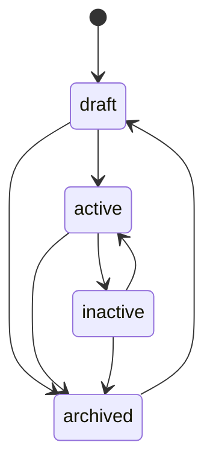

🇮🇩 Bahasa Indonesia · 🇬🇧 [English (source)](cms.md)

<!-- i18n-source-hash: sha256:de5fbd346b9f3a74cf264b3b78ae2f776b0ddca9816ff54fdcfe5f9eb80578b4 -->

# CMS: authoring, publikasi, izin, audit, media, taksonomi

Bagaimana produk dan kategori ditulis dan digerakkan melewati siklus hidupnya di dalam `apps/cms`, dan apa yang akan — dan tidak akan — ditemukan pembaca yang mencari media, iklan, atau UI admin yang lebih lengkap di sini. Modulnya sendiri adalah [`apps/cms/src/modules/commerce/`](../apps/cms/src/modules/commerce/), didokumentasikan mendalam di [`README.md`](../apps/cms/src/modules/commerce/README.md) miliknya sendiri — halaman ini menautkan ke dokumen itu alih-alih menyatakannya ulang kolom demi kolom, dan berfokus pada alur kerja yang dilalui orang atau agen yang benar-benar menulis konten.

## Mesin status produk

`status` produk adalah salah satu dari `draft`, `active`, `inactive`, `archived`. Transisi legalnya, dibaca langsung dari `LEGAL_TRANSITIONS` milik [`apps/cms/src/modules/commerce/domain/product-status.ts`](../apps/cms/src/modules/commerce/domain/product-status.ts):

Produk ditulis sebagai `draft`, dialihkan ke `active` untuk dijual, ditarik ke `inactive` untuk dikeluarkan dari penjualan tanpa kehilangan catatannya (stok habis, musiman), dan dipindah ke `archived` untuk dipensiunkan — dari mana hanya `draft` yang membukanya kembali, sehingga produk yang dipensiunkan kembali lewat authoring alih-alih langsung dijual lagi. `current === next` selalu legal (`PATCH` yang mengulang status produk sendiri adalah no-op, bukan error). Tidak ada endpoint transisi-status khusus: `status` melintas lewat `PATCH /api/v1/commerce/products/{id}` yang sama seperti field lainnya, diperiksa terhadap `LEGAL_TRANSITIONS` **sebelum** tulisan apa pun berjalan, dan transisi ilegal ditolak dengan 400 yang menamai status yang benar-benar bisa dijangkau dari status produk saat ini.

Kategori sama sekali **tidak membawa status** — kategori ada atau soft-delete, tanpa apa pun di antaranya — dan `parentId` **tak berubah setelah pembuatan**: `UpdateCategoryInput` tidak menerimanya, sehingga me-reparent kategori adalah "hapus dan buat ulang," tidak pernah sebuah edit. Analog struktural terdekat di basis kode ini, `awcms_offices`, mengambil pilihan identik untuk alasan identik: posisi hierarki yang diset sekali menghindari perlu membangun deteksi-siklus yang tidak dibangun basis kode ini bahkan untuk offices.

## Izin dan otorisasi

Setiap rute dijaga pada salah satu dari delapan kunci izin `commerce.{categories,products}.{read,create,update,delete}` — lihat [`docs/api.md`](api.md) untuk tabel lengkapnya dan [`docs/skema-basis-data.md`](skema-basis-data.md) untuk bagaimana row-level security menguatkan batas yang sama di lapisan basis data. Tidak ada izin `restore`, sejalan dengan tidak adanya endpoint restore (di bawah).

## Log audit

Setiap rute yang mengubah data — create, update, delete, untuk kedua resource — memanggil `recordAuditEvent` di dalam transaksi ber-RLS yang sama dengan tulisan yang dicatatnya, menamai modul (`commerce`), jenis resource (`product`/`category`), id resource, aksinya, dan (untuk delete) severity `warning`. Ini juga **satu-satunya** tempat SIAPA yang melakukan perubahan dicatat: tidak satu pun tabel membawa kolom `created_by`/`updated_by`/`deleted_by` (lihat [`docs/skema-basis-data.md`](skema-basis-data.md)), jadi log audit bukan catatan tambahan di sini — ia satu-satunya catatan kepelakuan untuk modul ini.

## Layar admin: satu, read-only

`/admin/commerce` ([`apps/cms/src/pages/admin/commerce.astro`](../apps/cms/src/pages/admin/commerce.astro)) mendaftar produk — SKU, nama, jenis, harga, stok, status — dijaga pada `commerce.products.read`. **Ia ada karena gate cakupan layar-admin milik `apps/cms` mensyaratkan setiap modul aktif punya setidaknya satu layar, tanpa pengecualian — bukan karena irisan ini butuh UI authoring.** Tidak ada form create/edit jenis apa pun: setiap produk dan kategori di irisan ini ditulis langsung lewat API (atau, untuk migrasi, sebuah skrip — lihat [`docs/deployment.md`](deployment.md)). Kategori sama sekali belum punya layar admin, dan setiap izin `products.*` selain `read` tetap di daftar `NOT_YET_SCREENED` milik `apps/cms/scripts/admin-screen-coverage-ledger.ts` sampai layar CRUD yang lebih lengkap dibangun.

## Media: belum dibangun

Tidak ada tabel `product_images`, tidak ada field media pada `CommerceProduct`, dan tidak ada dependensi `media_library` dideklarasikan di `commerce/module.ts` — dengan sengaja: `product_images` adalah salah satu tabel yang ditunda irisan ini (lihat [`docs/skema-basis-data.md`](skema-basis-data.md)), jadi belum ada apa pun di sini untuk diresolve referensi media. Storefront **tidak me-render gambar produk jenis apa pun** — setiap kartu produk dan halaman detail produk hanya teks dan lencana warna (lihat [`docs/ui-ux.md`](ui-ux.md)).

## Taksonomi: hierarki kategori, dan tidak lebih luas

"Taksonomi" di modul ini berarti pohon `awcms_commerce_categories` yang self-referencing — tidak lebih luas (tanpa tag, tanpa facet, tanpa klasifikasi lintas-potong). Lihat [`docs/skema-basis-data.md`](skema-basis-data.md) untuk bentuknya dan [`docs/routing.md`](routing.md) untuk mengapa rute category-browse belum dibangun meski model data mendukungnya.

## Iklan dan manajemen logo: belum dibangun

Keduanya tidak ada di mana pun di irisan ini — tidak ada penempatan iklan jenis apa pun, dan tidak ada kapabilitas manajemen-logo untuk branding storefront tenant. Disebutkan di sini terus terang karena pembaca yang tiba di dokumen ini mencari salah satu keduanya kalau tidak harus menyimpulkan ketiadaannya dari keheningan.

## Sengaja tidak ada di sini

- **Tanpa pemfilteran atau pencarian pada endpoint daftar.** `GET .../products` dan `GET .../categories` hanya menerima `cursor` — tanpa `?categoryId=`, tanpa `?status=`, mengikuti bentuk yang sudah dipakai `GET /api/v1/offices` di basis kode ini. Lihat [`docs/api.md`](api.md) untuk mengapa filter `status` di sisi server adalah tindak lanjut yang masuk akal dan belum dibangun, bukan celah di irisan ini.
- **Tanpa endpoint atau izin restore**, untuk resource mana pun — baris yang soft-delete dipertahankan demi integritas referensial tapi tidak bisa dipulihkan lewat API di irisan ini.
- **Tanpa pembacaan stok saat runtime.** `stock` adalah snapshot saat-build yang diambil storefront sekali, pada build terakhir — lihat [ADR-0002](adr/0002-static-output-with-build-time-fetch-for-the-storefront.md). Tidak ada apa pun di `apps/cms` yang dipanggil lagi setelah build itu selesai.
- **Tanpa keranjang, checkout, pembayaran, pesanan, pengiriman, varian, flash sale, atau tautan afiliasi** — permukaan komersial yang lebih luas, disebutkan [issue #1](https://github.com/ahliweb/awcms-one/issues/1) sebagai di luar cakupan increment 1, seluruhnya.
