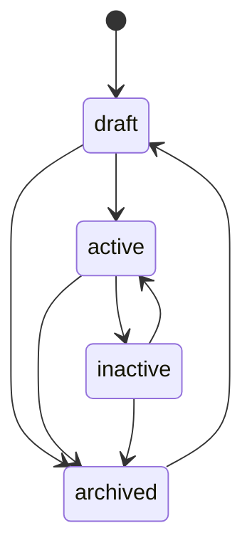
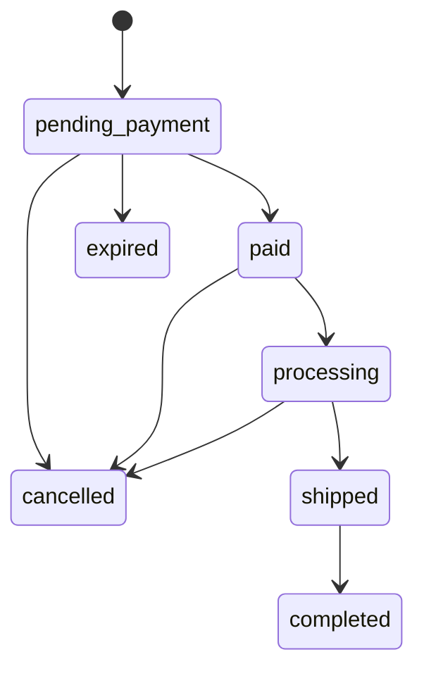

🇮🇩 Bahasa Indonesia · 🇬🇧 [English (source)](cms.md)

<!-- i18n-source-hash: sha256:0c4e7b12f6b2d91a0e5365f26b1123221e1e1ee945255694c4a6313dc0bf104d -->

# CMS: authoring, publikasi, izin, audit, media, taksonomi

Bagaimana produk, pesanan, permukaan pemasaran, dan konten bergerak melewati siklus hidupnya di dalam `apps/cms`, dan apa yang akan — dan tidak akan — ditemukan pembaca yang mencari media, iklan, atau UI admin yang lebih lengkap di sini. Modulnya sendiri adalah [`apps/cms/src/modules/commerce/`](../apps/cms/src/modules/commerce/), didokumentasikan mendalam di [`README.md`](../apps/cms/src/modules/commerce/README.id.md) miliknya sendiri — halaman ini menautkan ke dokumen itu alih-alih menyatakannya ulang kolom demi kolom, dan berfokus pada alur kerja yang dilalui orang atau agen yang benar-benar menulis konten. Authoring berita/blog (`blog_content`) adalah modul milik `ahliweb/awcms` sendiri, dibawa oleh embed subtree; halaman ini hanya mendeskripsikan bagaimana `apps/storefront` mengonsumsinya, bukan alur kerja adminnya sendiri.

## Mesin status

### `status` produk: `draft` → `active`/`inactive`/`archived`

Dibaca langsung dari `LEGAL_TRANSITIONS` milik [`apps/cms/src/modules/commerce/domain/product-status.ts`](../apps/cms/src/modules/commerce/domain/product-status.ts):

Produk ditulis sebagai `draft`, dialihkan ke `active` untuk dijual, ditarik ke `inactive` untuk dikeluarkan dari penjualan tanpa kehilangan catatannya, dan dipindah ke `archived` untuk dipensiunkan — dari mana hanya `draft` yang membukanya kembali. `current === next` selalu legal (no-op, bukan error). `status` melintas lewat `PATCH /api/v1/commerce/products/{id}` yang sama seperti field lainnya, diperiksa terhadap `LEGAL_TRANSITIONS` **sebelum** tulisan apa pun berjalan.

### `status` pesanan: tujuh state, tiga aktor

Dibaca langsung dari [`apps/cms/src/modules/commerce/domain/order-status.ts`](../apps/cms/src/modules/commerce/domain/order-status.ts):

Setiap edge legal juga dibatasi oleh **siapa** yang boleh menerapkannya (`actorMayApplyOrderStatus`):

| Aktor | Boleh menerapkan |
| --- | --- |
| `admin` | Edge legal apa pun di atas |
| `customer` | Hanya `pending_payment → cancelled` (pesanannya sendiri, diperiksa lewat telepon) |
| `system` (job `commerce:orders:expire`) | Hanya `pending_payment → expired` |

Setiap transisi menulis satu baris ke `awcms_commerce_order_events` (append-only, `from_status`/`to_status`/`actor`/`note`/`created_at` — lihat [`docs/skema-basis-data.md`](skema-basis-data.id.md)), yang menjadi sumber timeline pelacakan-pesanan storefront. `completed`, `cancelled`, dan `expired` bersifat terminal. `paymentStatus` (`unpaid → dp_paid/paid → refunded`) adalah sumbu terpisah dari `status`, diset oleh `PATCH .../payment-confirmations/{cid}/review` (`decision: "accepted"` mengubahnya menjadi `paid`) atau, untuk uang muka, saat pembuatan pesanan.

### `status` flash sale: dua state editorial, dua state turunan-job

`draft`/`scheduled` diset oleh owner; `active`/`ended` **diturunkan dari jendela waktu** dan dipersist oleh job `commerce:flash-sales:tick` (jadwal `*/5 * * * *`), yang memicu `commerce.flash_sale.{started,ended}` tepat sekali per transisi — halaman yang membaca `GET /flash-sales/active` tidak pernah perlu menghitung jendelanya sendiri.

## Izin dan otorisasi: 39 kunci di tiga area

Setiap rute commerce dijaga pada satu kunci izin `commerce.*`, dikelompokkan ke dalam tiga area di bawah. (Jumlah baris tabel ini dijaga otomatis oleh penanda `hitung:` di [`cms.md`](cms.md), sumber Inggris dokumen ini — lihat berkas itu.)

| Area | Resource | Aksi |
| --- | --- | --- |
| Catalog | `categories`, `products` | `read`, `create`, `update`, `delete`, `restore` |
| Marketing | `flash_sales`, `vouchers`, `sliders`, `testimonials`, `popups` | `read`, `create`, `update`, `delete` |
| Pengaturan toko | `settings` | `read`, `update` |

Orders, customers, dan reviews adalah area keempat yang lebih sempit: `commerce.orders.{read,update}`, `commerce.customers.{read,update}`, `commerce.reviews.{read,update,delete}` — **sengaja tanpa `create`/`delete`** untuk orders atau customers, karena keduanya hanya dibuat lewat jalur storefront anonim, yang tidak punya identitas admin untuk diperiksa izinnya. Lihat [`docs/api.md`](api.id.md) untuk daftar 39-kunci lengkap dan [ADR-0009](adr/0009-guest-checkout-by-order-code-and-phone.id.md) untuk alasan jalur itu anonim sama sekali. Row-level security menguatkan batas yang sama di lapisan basis data — lihat [`docs/skema-basis-data.md`](skema-basis-data.id.md).

## Log audit

Setiap rute owner yang mengubah data — create, update, delete, restore, transisi status, review konfirmasi-pembayaran, moderasi ulasan — memanggil `recordAuditEvent` di dalam transaksi ber-RLS yang sama dengan tulisan yang dicatatnya, menamai modul (`commerce`), jenis resource, id resource, aksinya, dan (untuk delete) severity `warning`. Tidak satu pun tabel commerce membawa `created_by`/`updated_by`/`deleted_by`, jadi log audit adalah satu-satunya catatan kepelakuan untuk modul ini, bukan catatan tambahan. Jalur storefront anonim tidak menulis event audit apa pun untuk pembuatan pesanan itu sendiri (tidak ada aktor admin untuk diatributkan) — baris `order_events` milik pesanan itu sendiri adalah catatan setara jalur itu, ber-timestamp dan membawa alasan.

## Layar admin: sebelas, mencakup setiap izin

Sebelas layar di bawah `apps/cms/src/pages/admin/`, masing-masing dijaga pada izin `read` area-nya lewat `loadAdminScreen`, dengan pengecekan inline lebih lanjut untuk create/update/delete/restore. (Jumlah baris tabel ini dijaga otomatis oleh penanda `hitung:` di [`cms.md`](cms.md), sumber Inggris dokumen ini — lihat berkas itu.)

| Layar | Rute | Dijaga pada |
| --- | --- | --- |
| Produk | `/admin/commerce` | `commerce.products.read` |
| Kategori | `/admin/commerce-categories` | `commerce.categories.read` |
| Flash sale | `/admin/commerce-flash-sales` | `commerce.flash_sales.read` |
| Voucher | `/admin/commerce-vouchers` | `commerce.vouchers.read` |
| Slider | `/admin/commerce-sliders` | `commerce.sliders.read` |
| Testimoni | `/admin/commerce-testimonials` | `commerce.testimonials.read` |
| Popup | `/admin/commerce-popup` | `commerce.popups.read` |
| Pengaturan toko | `/admin/commerce-settings` | `commerce.settings.read` |
| Pesanan | `/admin/commerce-orders` | `commerce.orders.read` (tanpa form create) |
| Pelanggan | `/admin/commerce-customers` | `commerce.customers.read` (tanpa form create) |
| Ulasan | `/admin/commerce-reviews` | `commerce.reviews.read` |

Bersama-sama, sebelas layar ini mengklaim setiap satu dari 39 izin yang dideklarasikan modul ini — diverifikasi oleh gate `admin-screen-coverage-ledger.ts` milik `apps/cms` (`admin:screen-coverage:check`) dan dua berkas contract test (`apps/cms/tests/admin-commerce-page-contract.test.ts`, `apps/cms/tests/admin-commerce-marketing-page-contract.test.ts`). Layar Orders dan Customers sengaja tidak punya form create — lihat "Izin dan otorisasi" di atas.

## Media: gambar produk, slider, testimoni — di-resolve, belum di-upload lewat tooling repo ini sendiri

`dependencies` milik `commerce` mendapat `media_library` di increment ini (issue #23), dan setiap referensi gambar — `images[]` produk, `imageMediaObjectId` varian, `sizeChartMediaId` size chart, `mediaObjectId` slider/testimoni/popup — di-resolve lewat `MediaLibraryPort` menjadi URL publik. **Hanya `mediaObjectId` gambar produk yang diperiksa live** terhadap `MediaLibraryPort.isMediaReferenceSafe` sebelum insert; `imageMediaObjectId` varian dan `sizeChartMediaId` size chart hanya divalidasi berbentuk-UUID, tidak diperiksa keberadaan live/terverifikasi — id yang basi atau asing di situ hanya akan resolve menjadi tanpa URL publik saat render, dan RLS tetap menjaganya terisolasi-tenant (dicatat di README modul ini sendiri sebagai pengurangan cakupan yang diketahui dan disengaja).

Yang **tidak** dibangun increment ini: jalur upload nyata untuk gambar-gambar ini lewat tooling repositori ini sendiri. `tools/seed-borneojek-mart.ts` memakai SVG placeholder kecil yang dibuat sendiri (`tools/seed-assets/`) alih-alih mengunduh foto produk sungguhan, dan upload bukti-pembayaran milik storefront anonim sendiri (`POST .../orders/{code}/payment-proof/upload-sessions`) selalu menjawab `503 MEDIA_UNAVAILABLE` — alur upload-session `media_library` yang sudah ada membutuhkan `actorTenantUserId` terautentikasi, yang tidak dimiliki pemanggil checkout anonim mana pun; merancang seam auth anonim kedua yang paralel, terikat pada `(orderCode, phoneHash)`, dinilai di luar cakupan increment ini (dicatat di PR issue #29 sebagai desain sensitif-keamanan yang sengaja ditangguhkan, bukan diburu-buru). `payment.proofUpload: false` pada model baca store-settings publik memberi tahu storefront untuk menyembunyikan kontrolnya saat kondisi ini berlaku; konfirmasi pembayaran tanpa gambar bukti tetap diterima sepenuhnya.

## Lambang lembaga: di-resolve dan dirender (issue #59)

`awcms_blog_institutions` milik `blog_content` membawa `logo_media_id`/`logo_alt` sejak [awcms#806](https://github.com/ahliweb/awcms/pull/807) di upstream, yang masuk ke sini lewat subtree pull `apps/cms`. `apps/storefront` me-resolve id itu lewat `GET /api/v1/media/objects` seperti setiap rujukan media lain, lalu merender lambangnya di samping paragraf pembuka artikel dan di `/mitra/{slug}` — jawaban platform ini atas "Logo Instansi" per-artikel milik seputarborneo.com, dipindahkan ke lembaga yang memang sudah menaungi artikel itu sehingga satu unggahan melayani seluruh artikel kanal tersebut. Kedua field tidak wajib: lembaga tanpa lambang, dan `apps/cms` yang lebih tua dari subtree pull itu, sama-sama tidak merender apa pun.

## Manajemen logo dan favicon: masih di-resolve sebagai id media, belum di-render

Modul `site-profile` milik `apps/cms` mengekspos `logoMediaId`/`faviconMediaId` sebagai bagian dari site profile tenant, hanya bisa di-resolve lewat klien `media_library`. `apps/storefront` membaca site profile (`GET /api/v1/site-profile/composed`, issue #24) tapi tidak me-resolve id mana pun menjadi URL — brand mark storefront adalah nama toko dalam teks, dan `apps/storefront/public/favicon.svg` adalah ikon default yang di-bundle, bukan yang dikelola CMS. Ini adalah pengurangan cakupan yang dicatat dan disengaja (lihat `apps/storefront/README.md`), bukan kelalaian: membangun klien `media_library` di storefront dinilai di luar cakupan untuk pekerjaan chrome/fondasi.

## Taksonomi: kategori commerce, plus hierarki IA berita sendiri

"Taksonomi" mencakup dua tree yang dimiliki secara terpisah:

- **`awcms_commerce_categories`** — tree kategori-produk self-referencing yang dimiliki modul ini (lihat [`docs/skema-basis-data.md`](skema-basis-data.id.md)). `parentId` tak berubah setelah pembuatan, sejalan dengan pilihan `awcms_offices` sendiri untuk alasan yang identik (tidak ada deteksi-siklus yang dibangun untuk keduanya).
- **Hierarki rubrik/daerah/mitra milik `blog_content`** — modul milik `ahliweb/awcms` sendiri, dibawa oleh embed subtree. `/rubrik/{slug}` milik `apps/storefront` menyusuri tree rubrik (kategori) hierarkis di mana arsip rubrik induk mencakup post dari setiap rubrik turunan (issue #28); `/daerah/{slug}` adalah arsip wilayah yang dijangkau lewat `regionCode` sebuah institusi (post itu sendiri tidak membawa field wilayah); `/mitra/{slug}` adalah halaman landing institusi. Tidak satu pun dari ketiganya adalah kategori commerce — ketiganya adalah taksonomi milik `blog_content` sendiri, dirender oleh permukaan berita storefront. Lihat [`docs/routing.md`](routing.id.md) untuk peta URL lengkapnya.

## Iklan: penempatan iklan, sebagaimana `blog_content` merendernya

`AD_PLACEMENT_KEYS` milik `blog_content` mendefinisikan slot header, in-article, dan sidebar — sengaja tidak ada slot footer (diverifikasi terhadap set kunci yang benar-benar terdaftar, bukan asumsi). Halaman berita `apps/storefront` merender slot mana pun yang dikembalikan CMS; tidak ada UI manajemen penempatan-iklan yang didokumentasikan di sini karena itu milik `blog_content`, bukan `commerce` — lihat dokumentasi modul `apps/cms` sendiri untuk sisi admin.

## Permukaan SEO yang diumpankan CMS

`apps/cms` adalah sumber untuk semua yang dideskripsikan [`docs/seo.md`](seo.id.md) sebagai yang dipancarkan storefront: `awcms_seo_redirects` (peta redirect legacy yang dipanggang ke dalam build `apps/storefront` — lihat [`docs/routing.md`](routing.id.md)), konten yang menggerakkan JSON-LD `Product`/`NewsArticle`/`CollectionPage`/`BreadcrumbList` setiap halaman, dan data post/halaman yang dienumerasi sitemap dan feed. Dokumen ini tidak menyatakan ulang konten itu — lihat [`docs/seo.md`](seo.id.md) untuk apa yang benar-benar dipancarkan storefront per jenis halaman, diverifikasi terhadap sumbernya sendiri.

## Aksesibilitas dan responsif: hanya sisi admin CMS

[`docs/aksesibilitas.md`](aksesibilitas.id.md) dan [`docs/responsif.md`](responsif.id.md) mendeskripsikan perilaku `apps/storefront` sendiri secara mendalam; bagian ini hanya menyebut fakta sisi-admin yang spesifik untuk authoring konten commerce. Daftar produk (`/admin/commerce`) memakai `<caption>`, header tabel `scope="col"`, dan atribut `data-label` untuk layout stacked responsif di bawah breakpoint-nya sendiri — pola yang sama yang dipakai setiap tabel admin di `apps/cms`, bukan sesuatu yang diciptakan modul ini. Tidak ada layar admin yang ditambahkan increment ini yang mengubah konvensi itu.

## Sengaja tidak ada di sini

- **Tanpa akun pelanggan, login, atau endpoint storefront terautentikasi** — [issue #32](https://github.com/ahliweb/awcms-one/issues/32). Wishlist tetap browser-local; `awcms_commerce_wishlists` ada sebagai tabel tanpa rute API di depannya untuk saat ini.
- **Tanpa integrasi tarif-kurir RajaOngkir atau payment gateway** — keduanya harus dipanggil lewat outbox begitu mendarat ([ADR-0010](adr/0010-manual-payment-and-alternative-courier-first-gateways-via-outbox.md), [issue #33](https://github.com/ahliweb/awcms-one/issues/33)); `payment_method` sudah menerima nilai enum `gateway`, secara aditif, tanpa kode implementasi di baliknya untuk saat ini.
- **Tanpa test suite integrasi yang di-gate `DATABASE_URL` untuk pembuatan pesanan** — pengurangan stok, double-submit idempoten, pelacakan telepon-salah, expire-lalu-restock, dan isolasi RLS lintas-tenant semuanya dibuktikan dengan tangan terhadap instans Postgres nyata yang sudah dimigrasikan selama pengembangan issue #29 (dua bug nyata ditemukan dan diperbaiki lewat cara ini), tapi tidak dikodekan sebagai `apps/cms/tests/integration/commerce-orders.integration.test.ts` yang di-commit — celah nyata dalam durabilitas test suite, bukan yang diam-diam dijatuhkan (lihat [`docs/pengujian.md`](pengujian.id.md)).
- **Tanpa full-text ranked search** pada filter `q` daftar produk owner — hanya pencocokan substring/trigram (`pg_trgm`, `sql/159`), tanpa integrasi `site_search`.
- **Tanpa `restore`** untuk tabel marketing, orders, customers, atau reviews — hanya catalog (`categories`/`products`) yang punya endpoint dan izin restore di increment ini.
