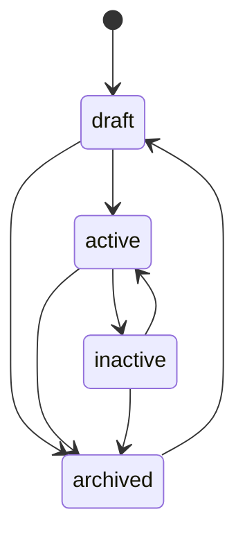
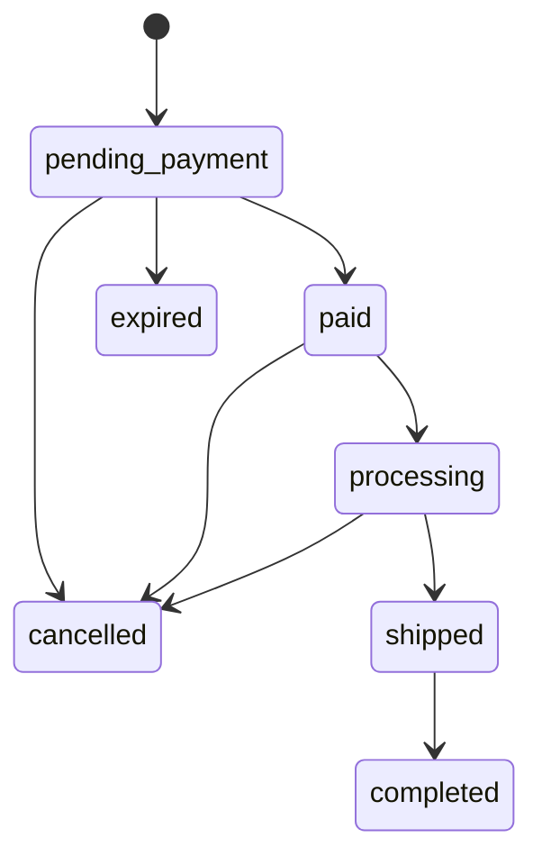

🇬🇧 English (source) · 🇮🇩 [Bahasa Indonesia](cms.id.md)

# CMS: authoring, publishing, permissions, audit, media, taxonomy

How products, orders, marketing surfaces, and content move through their lifecycle inside `apps/cms`, and what a reader looking for media, advertising, or a fuller admin UI will and will not find here. The module itself is [`apps/cms/src/modules/commerce/`](../apps/cms/src/modules/commerce/), documented in depth in its own [`README.md`](../apps/cms/src/modules/commerce/README.md) — this page links to that document rather than restating it column by column, and focuses on the workflow a person or agent actually authoring content goes through. News/blog authoring (`blog_content`) is `ahliweb/awcms`'s own module, carried by the subtree embed; this page describes only how `apps/storefront` consumes it, not its own admin workflow.

## State machines

### Product `status`: `draft` → `active`/`inactive`/`archived`

Read directly from [`apps/cms/src/modules/commerce/domain/product-status.ts`](../apps/cms/src/modules/commerce/domain/product-status.ts)'s `LEGAL_TRANSITIONS`:

A product is authored `draft`, switched to `active` to sell, pulled to `inactive` to take it off sale without losing the record, and moved to `archived` to retire it — from which only `draft` re-opens it. `current === next` is always legal (a no-op, not an error). `status` travels through the same `PATCH /api/v1/commerce/products/{id}` as every other field, checked against `LEGAL_TRANSITIONS` **before** any write runs.

### Order `status`: seven states, three actors

Read directly from [`apps/cms/src/modules/commerce/domain/order-status.ts`](../apps/cms/src/modules/commerce/domain/order-status.ts):

Every legal edge is also restricted by **who** may apply it (`actorMayApplyOrderStatus`):

| Actor | May apply |
| --- | --- |
| `admin` | Any legal edge above |
| `customer` | `pending_payment → cancelled` only (their own order, checked by phone) |
| `system` (the `commerce:orders:expire` job) | `pending_payment → expired` only |

Every transition writes a row to `awcms_commerce_order_events` (append-only, `from_status`/`to_status`/`actor`/`note`/`created_at` — see [`docs/skema-basis-data.md`](skema-basis-data.md)), which is what the storefront's order-tracking timeline renders. `completed`, `cancelled`, and `expired` are terminal. `paymentStatus` (`unpaid → dp_paid/paid → refunded`) is a separate axis from `status`, set by `PATCH .../payment-confirmations/{cid}/review` (`decision: "accepted"` moves it to `paid`) or, for down-payment, at order creation.

### Flash-sale `status`: two editorial states, two job-derived states

`draft`/`scheduled` are set by an owner; `active`/`ended` are **derived from the time window** and persisted by the `commerce:flash-sales:tick` job (schedule `*/5 * * * *`), which fires `commerce.flash_sale.{started,ended}` exactly once per transition — a page that reads `GET /flash-sales/active` never has to compute the window itself.

## Permissions and authorization: 39 keys across three areas

<!-- hitung:mulai key=commerce-areas source=table-rows -->

Every commerce route is gated on a `commerce.*` permission key, grouped into three areas below.

| Area | Resources | Actions |
| --- | --- | --- |
| Catalog | `categories`, `products` | `read`, `create`, `update`, `delete`, `restore` |
| Marketing | `flash_sales`, `vouchers`, `sliders`, `testimonials`, `popups` | `read`, `create`, `update`, `delete` |
| Store settings | `settings` | `read`, `update` |

<!-- hitung:selesai -->

Orders, customers, and reviews are a fourth, narrower area: `commerce.orders.{read,update}`, `commerce.customers.{read,update}`, `commerce.reviews.{read,update,delete}` — **deliberately no `create`/`delete`** for orders or customers, since both are created only through the anonymous storefront path, which has no admin identity to check a permission against. See [`docs/api.md`](api.md) for the full 39-key list and [ADR-0009](adr/0009-guest-checkout-by-order-code-and-phone.md) for why that path is anonymous at all. Row-level security backs the same boundary at the database layer — see [`docs/skema-basis-data.md`](skema-basis-data.md).

## Audit logging

Every mutating owner route — create, update, delete, restore, status transition, payment-confirmation review, review moderation — calls `recordAuditEvent` inside the same RLS-scoped transaction as the write it records, naming the module (`commerce`), the resource type, the resource id, the action, and (for a delete) a `warning` severity. Neither commerce table carries `created_by`/`updated_by`/`deleted_by`, so the audit log is the sole record of actorship for this module, not a supplementary one. The anonymous storefront path writes no audit event for order creation itself (there is no admin actor to attribute it to) — the order's own `order_events` row is that path's equivalent record, timestamped and reason-carrying.

## Admin screens: eleven, covering every permission

<!-- hitung:mulai key=commerce-admin-screens source=table-rows -->

Eleven screens under `apps/cms/src/pages/admin/`, each gated on its area's `read` permission via `loadAdminScreen`, with further inline checks for create/update/delete/restore:

| Screen | Route | Gated on |
| --- | --- | --- |
| Products | `/admin/commerce` | `commerce.products.read` |
| Categories | `/admin/commerce-categories` | `commerce.categories.read` |
| Flash sales | `/admin/commerce-flash-sales` | `commerce.flash_sales.read` |
| Vouchers | `/admin/commerce-vouchers` | `commerce.vouchers.read` |
| Sliders | `/admin/commerce-sliders` | `commerce.sliders.read` |
| Testimonials | `/admin/commerce-testimonials` | `commerce.testimonials.read` |
| Popup | `/admin/commerce-popup` | `commerce.popups.read` |
| Store settings | `/admin/commerce-settings` | `commerce.settings.read` |
| Orders | `/admin/commerce-orders` | `commerce.orders.read` (no create form) |
| Customers | `/admin/commerce-customers` | `commerce.customers.read` (no create form) |
| Reviews | `/admin/commerce-reviews` | `commerce.reviews.read` |

<!-- hitung:selesai -->

Between them, these eleven screens claim every one of the module's 39 declared permissions — verified by `apps/cms`'s `admin-screen-coverage-ledger.ts` gate (`admin:screen-coverage:check`) and two contract test files (`apps/cms/tests/admin-commerce-page-contract.test.ts`, `apps/cms/tests/admin-commerce-marketing-page-contract.test.ts`). The Orders and Customers screens have no create form by design — see "Permissions" above.

## Media: product images, sliders, testimonials — resolved, not yet uploaded through this repo's own tooling

`commerce`'s `dependencies` gained `media_library` in this increment (issue #23), and every image reference — a product's `images[]`, a variant's `imageMediaObjectId`, a size chart's `sizeChartMediaId`, a slider's/testimonial's/popup's `mediaObjectId` — resolves through `MediaLibraryPort` to a public URL. **Only a product image's `mediaObjectId` is checked live** against `MediaLibraryPort.isMediaReferenceSafe` before insert; a variant's `imageMediaObjectId` and a size chart's `sizeChartMediaId` are validated UUID-shaped only, not checked for live/verified existence — a stale or foreign id there simply resolves to no public URL at render time, and RLS still keeps it tenant-isolated (recorded in the module's own README as a known, deliberate scope trim).

What this increment does **not** build: a real upload path for any of these images through this repository's own tooling. `tools/seed-borneojek-mart.ts` uses small, self-generated placeholder SVGs (`tools/seed-assets/`) rather than downloading real product photos, and the anonymous storefront's own payment-proof upload (`POST .../orders/{code}/payment-proof/upload-sessions`) always answers `503 MEDIA_UNAVAILABLE` — the existing `media_library` upload-session flow needs an authenticated `actorTenantUserId`, which no anonymous checkout caller has; designing a second, parallel anonymous auth seam bound to `(orderCode, phoneHash)` was judged out of scope for this increment (recorded in issue #29's PR as a deliberate, security-sensitive design deferred rather than rushed). `payment.proofUpload: false` on the public store-settings read model tells the storefront to hide the control when this is the case; a payment confirmation without a proof image is still fully accepted.

## Institution emblems: resolved and rendered (issue #59)

`blog_content`'s `awcms_blog_institutions` carries `logo_media_id`/`logo_alt` since upstream [awcms#806](https://github.com/ahliweb/awcms/pull/807), received here through the `apps/cms` subtree pull. `apps/storefront` resolves that id through `GET /api/v1/media/objects` like every other media reference and renders the emblem beside an article's opening paragraph and on `/mitra/{slug}` — the platform's answer to seputarborneo.com's per-article "Logo Instansi", moved onto the institution the article is already filed under so one upload serves every article of that channel. Neither field is required: an institution without an emblem, and a `apps/cms` older than that pull, both render nothing.

## Logo and favicon management: still resolved as media ids, not rendered

`apps/cms`'s `site-profile` module exposes `logoMediaId`/`faviconMediaId` as part of the tenant's site profile, resolvable only through a `media_library` client. `apps/storefront` reads the site profile (`GET /api/v1/site-profile/composed`, issue #24) but does not resolve either id to a URL — the storefront's brand mark is the store name in text, and `apps/storefront/public/favicon.svg` is a bundled default icon, not a CMS-managed one. This is a recorded, deliberate scope trim (see `apps/storefront/README.md`), not an oversight: building a `media_library` client in the storefront was judged out of scope for chrome/foundation work.

## Taxonomy: commerce categories, plus the news IA's own hierarchy

"Taxonomy" spans two, separately owned trees:

- **`awcms_commerce_categories`** — the self-referencing product-category tree this module owns (see [`docs/skema-basis-data.md`](skema-basis-data.md)). `parentId` is immutable after creation, matching `awcms_offices`' own choice for the identical reason (no cycle-detection built for either).
- **`blog_content`'s rubrik/daerah/mitra hierarchy** — `ahliweb/awcms`'s own module, carried by the subtree embed. `apps/storefront`'s `/rubrik/{slug}` walks a hierarchical rubrik (category) tree where a parent rubrik's archive includes every descendant rubrik's posts (issue #28); `/daerah/{slug}` is a region archive reached via an institution's `regionCode` (a post itself carries no region field); `/mitra/{slug}` is an institution landing page. None of these three are commerce categories — they are `blog_content`'s own taxonomy, rendered by the storefront's news surface. See [`docs/routing.md`](routing.md) for the full URL map.

## Advertising: ad placements, as `blog_content` renders them

`blog_content`'s `AD_PLACEMENT_KEYS` define header, in-article, and sidebar slots — there is deliberately no footer slot (verified against the actual registered key set, not assumed). `apps/storefront`'s news pages render whichever slots the CMS returns; there is no ad-placement management UI documented here because it belongs to `blog_content`, not `commerce` — see `apps/cms`'s own module documentation for the admin side.

Increment 3 made those slots real rather than nominal. All twelve keys are now consumed (`header_banner`, `below_headline`, `homepage_middle`, `homepage_bottom`, `article_top`/`_middle`/`_bottom`, `sidebar_top`/`_middle`/`_bottom`, `category_archive_top`, `search_result_top`), the creative renders as an actual `` through the media client ([ADR-0011](adr/0011-storefront-media-resolves-through-the-media-objects-endpoint.md)), and clicking one opens a native `<dialog>` — seputarborneo's own popup behaviour (issue #53). **There is still no footer key**: the leaderboard seputarborneo renders above its footer is this app's `homepage_bottom`, placed there by `FooterBerita.astro` (epic #46's decision 4); adding a dedicated `footer_leaderboard` key remains an upstream change nobody has needed yet. A slot with nothing booked renders nothing at all — never an empty placeholder box.

## SEO surface the CMS feeds

`apps/cms` is the source for everything [`docs/seo.md`](seo.md) describes the storefront emitting: `awcms_seo_redirects` (the legacy-redirect map baked into `apps/storefront`'s build — see [`docs/routing.md`](routing.md)), the content driving each page's `Product`/`NewsArticle`/`CollectionPage`/`BreadcrumbList` JSON-LD, and the post/page data the sitemap and feeds enumerate. This document does not restate that content — see [`docs/seo.md`](seo.md) for what the storefront actually emits per page type, verified against its own source.

## Accessibility and responsive: the CMS admin side only

[`docs/aksesibilitas.md`](aksesibilitas.md) and [`docs/responsif.md`](responsif.md) describe `apps/storefront`'s own behaviour in depth; this section names only the admin-side facts specific to authoring commerce content. The product list (`/admin/commerce`) uses `<caption>`, `scope="col"` table headers, and `data-label` attributes for a responsive stacked layout below its own breakpoint — the same pattern every admin table in `apps/cms` uses, not something this module invented. No admin screen added by this increment changes that convention.

## Deliberately not here

- **No customer accounts, login, or authenticated storefront endpoint** — [issue #32](https://github.com/ahliweb/awcms-one/issues/32). Wishlist stays browser-local; `awcms_commerce_wishlists` exists as a table with no API route in front of it yet.
- **No RajaOngkir courier-rate integration or payment gateway** — both must be called through the outbox when they land ([ADR-0010](adr/0010-manual-payment-and-alternative-courier-first-gateways-via-outbox.md), [issue #33](https://github.com/ahliweb/awcms-one/issues/33)); `payment_method` already accepts a `gateway` enum value, additively, with no implementing code behind it yet.
- **`apps/cms/tests/integration/commerce-orders.integration.test.ts` exists** (`apps/cms/tests/integration/`) and covers exactly issue #29's acceptance list — stock decrement, idempotent double-submit, wrong-phone tracking, expire-then-restock, and cross-tenant RLS isolation — against a real, migrated Postgres instance. It was committed after issue #29's own PR body was written (that PR's own text says the suite "was not written as a formal automated test" — the merged tree disagrees, and this document follows the tree; see [`docs/pengujian.md`](pengujian.md)).
- **No full-text ranked search** on the owner product list's `q` filter — substring/trigram matching only (`pg_trgm`, `sql/159`), no `site_search` integration.
- **No restore** for marketing tables, orders, customers, or reviews — only catalog (`categories`/`products`) has a restore endpoint and permission in this increment.
