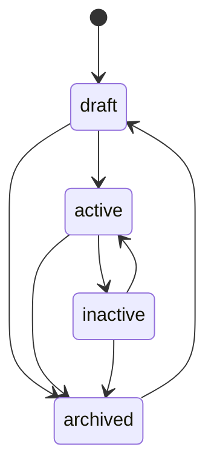

🇬🇧 English (source) · 🇮🇩 [Bahasa Indonesia](cms.id.md)

# CMS: authoring, publishing, permissions, audit, media, taxonomy

How products and categories are authored and moved through their lifecycle inside `apps/cms`, and what a reader looking for media, advertising, or a fuller admin UI will and will not find here. The module itself is [`apps/cms/src/modules/commerce/`](../apps/cms/src/modules/commerce/), documented in depth in its own [`README.md`](../apps/cms/src/modules/commerce/README.md) — this page links to that document rather than restating it column by column, and focuses on the workflow a person or agent actually authoring content goes through.

## The product state machine

A product's `status` is one of `draft`, `active`, `inactive`, `archived`. The legal transitions, read directly from [`apps/cms/src/modules/commerce/domain/product-status.ts`](../apps/cms/src/modules/commerce/domain/product-status.ts)'s `LEGAL_TRANSITIONS`:

A product is authored `draft`, switched to `active` to sell, pulled to `inactive` to take it off sale without losing the record (out of stock, seasonal), and moved to `archived` to retire it — from which only `draft` re-opens it, so a retired product goes back through authoring rather than straight back on sale. `current === next` is always legal (a `PATCH` that repeats the product's own status is a no-op, not an error). There is no dedicated status-transition endpoint: `status` travels through the same `PATCH /api/v1/commerce/products/{id}` as every other field, checked against `LEGAL_TRANSITIONS` **before** any write runs, and an illegal transition is rejected with 400 naming the states actually reachable from the product's current one.

Categories carry **no status at all** — a category exists or is soft-deleted, with nothing in between — and `parentId` is **immutable after creation**: `UpdateCategoryInput` does not accept it, so re-parenting a category is "delete and recreate," never an edit. The closest structural analog in this codebase, `awcms_offices`, makes the identical choice for the identical reason: a hierarchy position set once avoids building cycle-detection this codebase does not build even for offices.

## Permissions and authorization

Every route is gated on one of the eight `commerce.{categories,products}.{read,create,update,delete}` permission keys — see [`docs/api.md`](api.md) for the full table and [`docs/skema-basis-data.md`](skema-basis-data.md) for how row-level security backs the same boundary at the database layer. There is no `restore` permission, matching the absence of a restore endpoint (below).

## Audit logging

Every mutating route — create, update, delete, for both resources — calls `recordAuditEvent` inside the same RLS-scoped transaction as the write it records, naming the module (`commerce`), the resource type (`product`/`category`), the resource id, the action, and (for a delete) a `warning` severity. This is also the **only** place WHO performed a change is recorded: neither table carries a `created_by`/`updated_by`/`deleted_by` column (see [`docs/skema-basis-data.md`](skema-basis-data.md)), so the audit log is not a supplementary record here — it is the sole record of actorship for this module.

## The admin screen: one, read-only

`/admin/commerce` ([`apps/cms/src/pages/admin/commerce.astro`](../apps/cms/src/pages/admin/commerce.astro)) lists products — SKU, name, type, price, stock, status — gated on `commerce.products.read`. **It exists because `apps/cms`'s admin-screen coverage gate requires every active module to have at least one screen, with zero exceptions — not because this slice needed an authoring UI.** There is no create/edit form of any kind: every product and category in this slice is authored through the API directly (or, for the migration, a script — see [`docs/deployment.md`](deployment.md)). Categories have no admin screen at all yet, and every `products.*` permission other than `read` stays on `apps/cms/scripts/admin-screen-coverage-ledger.ts`'s `NOT_YET_SCREENED` list until a fuller CRUD screen is built.

## Media: not built

There is no `product_images` table, no media field on `CommerceProduct`, and no `media_library` dependency declared in `commerce/module.ts` — deliberately: `product_images` is one of the tables this slice defers (see [`docs/skema-basis-data.md`](skema-basis-data.md)), so there is nothing here yet for a media reference to resolve against. The storefront renders **no product imagery of any kind** — every product card and product-detail page is text and a color badge only (see [`docs/ui-ux.md`](ui-ux.md)).

## Taxonomy: the category hierarchy, and nothing wider

"Taxonomy" in this module means the self-referencing `awcms_commerce_categories` tree — nothing broader (no tags, no facets, no cross-cutting classification). See [`docs/skema-basis-data.md`](skema-basis-data.md) for its shape and [`docs/routing.md`](routing.md) for why a category-browse route is not built even though the data model supports one.

## Advertising and logo management: not built

Neither exists anywhere in this slice — no advertising placement of any kind, and no logo-management capability for a tenant's storefront branding. Named here plainly because a reader arriving at this document looking for either would otherwise have to conclude their absence from silence.

## Deliberately not here

- **No filtering or search on the list endpoints.** `GET .../products` and `GET .../categories` accept only `cursor` — no `?categoryId=`, no `?status=`, matching the shape `GET /api/v1/offices` already uses in this codebase. See [`docs/api.md`](api.md) for why a server-side `status` filter is a reasonable, un-built follow-up rather than a gap in this slice.
- **No restore endpoint or permission**, for either resource — a soft-deleted row is retained for referential integrity but not recoverable through the API in this slice.
- **No runtime stock read.** `stock` is a build-time snapshot the storefront fetched once, at the last build — see [ADR-0002](adr/0002-static-output-with-build-time-fetch-for-the-storefront.md). Nothing in `apps/cms` is called again after that build finishes.
- **No cart, checkout, payment, orders, shipping, variants, flash sales, or affiliate links** — the wider commerce surface named in [issue #1](https://github.com/ahliweb/awcms-one/issues/1) as out of scope for increment 1, in full.
