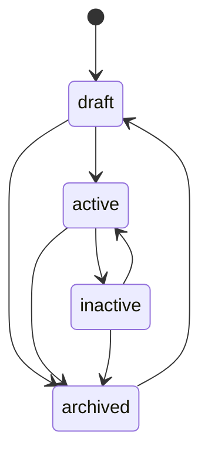
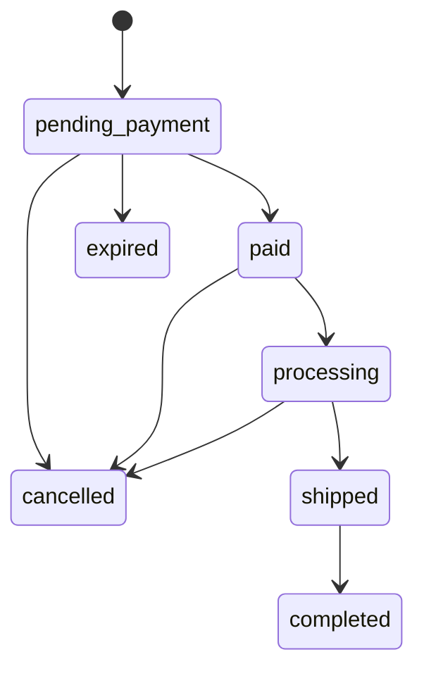

🇬🇧 English (source) · 🇮🇩 [Bahasa Indonesia](cms.id.md)

# CMS: authoring, publishing, permissions, audit, media, taxonomy

How products, orders, marketing surfaces, and content move through their lifecycle inside `apps/cms`, and what a reader looking for media, advertising, or a fuller admin UI will and will not find here. The module itself is [`apps/cms/src/modules/commerce/`](../apps/cms/src/modules/commerce/), documented in depth in its own [`README.md`](../apps/cms/src/modules/commerce/README.md) — this page links to that document rather than restating it column by column, and focuses on the workflow a person or agent actually authoring content goes through. News/blog authoring (`blog_content`) is `ahliweb/awcms`'s own module, carried by the subtree embed; this page describes only how `apps/storefront` consumes it, not its own admin workflow.

## State machines

### Product `status`: `draft` → `active`/`inactive`/`archived`

Read directly from [`apps/cms/src/modules/commerce/domain/product-status.ts`](../apps/cms/src/modules/commerce/domain/product-status.ts)'s `LEGAL_TRANSITIONS`:

A product is authored `draft`, switched to `active` to sell, pulled to `inactive` to take it off sale without losing the record, and moved to `archived` to retire it — from which only `draft` re-opens it. `current === next` is always legal (a no-op, not an error). `status` travels through the same `PATCH /api/v1/commerce/products/{id}` as every other field, checked against `LEGAL_TRANSITIONS` **before** any write runs.

### Order `status`: seven states, three actors

Read directly from [`apps/cms/src/modules/commerce/domain/order-status.ts`](../apps/cms/src/modules/commerce/domain/order-status.ts):

Every legal edge is also restricted by **who** may apply it (`actorMayApplyOrderStatus`):

| Actor | May apply |
| --- | --- |
| `admin` | Any legal edge above |
| `customer` | `pending_payment → cancelled` only (their own order, checked by phone) |
| `system` (the `commerce:orders:expire` job) | `pending_payment → expired` only |

Every transition writes a row to `awcms_commerce_order_events` (append-only, `from_status`/`to_status`/`actor`/`note`/`created_at` — see [`docs/skema-basis-data.md`](skema-basis-data.md)), which is what the storefront's order-tracking timeline renders. `completed`, `cancelled`, and `expired` are terminal. `paymentStatus` (`unpaid → dp_paid/paid → refunded`) is a separate axis from `status`, set by `PATCH .../payment-confirmations/{cid}/review` (`decision: "accepted"` moves it to `paid`) or, for down-payment, at order creation.

### Flash-sale `status`: two editorial states, two job-derived states

`draft`/`scheduled` are set by an owner; `active`/`ended` are **derived from the time window** and persisted by the `commerce:flash-sales:tick` job (schedule `*/5 * * * *`), which fires `commerce.flash_sale.{started,ended}` exactly once per transition — a page that reads `GET /flash-sales/active` never has to compute the window itself.

## Permissions and authorization: 39 keys across three areas

<!-- hitung:mulai key=commerce-areas source=table-rows -->

Every commerce route is gated on a `commerce.*` permission key, grouped into three areas below.

| Area | Resources | Actions |
| --- | --- | --- |
| Catalog | `categories`, `products` | `read`, `create`, `update`, `delete`, `restore` |
| Marketing | `flash_sales`, `vouchers`, `sliders`, `testimonials`, `popups` | `read`, `create`, `update`, `delete` |
| Store settings | `settings` | `read`, `update` |

<!-- hitung:selesai -->

Orders, customers, and reviews are a fourth, narrower area: `commerce.orders.{read,update}`, `commerce.customers.{read,update}`, `commerce.reviews.{read,update,delete}` — **deliberately no `create`/`delete`** for orders or customers, since both are created only through the anonymous storefront path, which has no admin identity to check a permission against. See [`docs/api.md`](api.md) for the full 39-key list and [ADR-0009](adr/0009-guest-checkout-by-order-code-and-phone.md) for why that path is anonymous at all. Row-level security backs the same boundary at the database layer — see [`docs/skema-basis-data.md`](skema-basis-data.md).

## Customer account OTP e-mail (Issue #89, contract #86/ADR-0016 D2)

`POST /account/otp/request` delivers its 6-digit code through the `email` module's own outbox (`awcms_email_messages`), enqueued inside the same transaction as the OTP row, under a new derived template category `derived.commerce_customer_otp` (`registerDerivedEmailTemplateCategory`, three variables: `code`, `expiresInMinutes`, `storeName`). Migration `sql/919` seeds an EN+ID copy of that template for every tenant that already exists at migration time; a tenant created afterwards needs its own copy seeded (its provisioning flow, or an operator, the same way the base categories' own `email:templates:seed-defaults` is per-tenant and explicit). When `EMAIL_PROVIDER=log` or `EMAIL_ENABLED` is not `"true"`, delivery goes through a `log` adapter instead — the only place in this codebase that writes an OTP code to a log line, so local development and CI can exercise the whole flow without mail credentials.

Two env-tunable rate-limit pairs govern this surface: `COMMERCE_ACCOUNT_OTP_RATE_LIMIT_{MAX_PER_IP,WINDOW_SEC,MAX_PER_EMAIL}` (10/IP/h, 5/e-mail/h by default) for `otp/request`, and `COMMERCE_ACCOUNT_OTP_VERIFY_RATE_LIMIT_{MAX_PER_IP,WINDOW_SEC}` (20/IP/h by default) for `otp/verify` — see `.env.example` in `apps/cms`.

## Customer account OTP via WhatsApp (Issue #108, contract #106 D5)

D2's WhatsApp follow-up: `POST /account/otp/request` accepts `via?: "email"|"whatsapp"` (default `email`). `via: "whatsapp"` requires `phone` (normalised to E.164), only ever supports `purpose: "login"` (registration stays e-mail OTP only — a `register` combination is a `400 VALIDATION_ERROR`), and answers `409 CHANNEL_UNAVAILABLE` — checked and answered BEFORE an OTP row is ever issued — when `COMMERCE_WHATSAPP_ENABLED` is not `"true"` (a configuration fact, not a new enumeration oracle: it is independent of whether the phone supplied actually has an account). `POST /account/otp/verify` accepts `phone` as an alternative to `email` (mutually exclusive), resolving the account via its customer row's phone (`findAccountByPhone`) rather than by e-mail — "login by WhatsApp" only ever authenticates an account that already exists.

The code is delivered through a second provider outbox modelled on `email` exactly (`awcms_commerce_whatsapp_messages`/`_delivery_attempts`, `sql/925`), dispatched by `bun run commerce:whatsapp:dispatch` (claim/send/finalize, lease, circuit breaker, backoff — same shape as `email:dispatch`) against the resolved `COMMERCE_WHATSAPP_PROVIDER` (`fonnte`, `meta`, or `log` for dev/CI — the only adapter that writes the code to a log line). `GET /api/v1/commerce/whatsapp/messages` (`commerce.whatsapp.read`) and `/admin/commerce-whatsapp` give an operator read-only diagnostics over the outbox — masked phone only, never the raw number/rendered body/code.

## Customer account resources (Issue #91, contract #86/ADR-0016)

`/api/v1/commerce/storefront/account/{addresses,wishlist,orders,reviews}` — every route bearer-secured (`requireCustomerSession`), rate-limited per IP under `COMMERCE_STOREFRONT_RATE_LIMIT_{MAX,WINDOW_SEC}` (60/min by default, the same env pair the anonymous tracking route already uses), body-limited, and CORS-preflighted with `authorization` joining `content-type` in the allowed-headers list (a bearer request's preflight would otherwise never reach the browser's actual call).

- **Addresses.** Max 10 live rows per account (`409 ADDRESS_LIMIT_REACHED`); the FIRST address ever saved becomes the default automatically; `GET` lists default first. Exactly one default per customer is a DATABASE invariant, not merely an application one — `sql/920`'s partial unique index on `(tenant_id, customer_id) WHERE is_default AND deleted_at IS NULL`. Deleting the default promotes the most-recently-created remaining address; `PATCH` never touches `isDefault` (only `POST .../default` does).
- **Wishlist.** `PUT {productIds}` union-merges into whatever the account already has, max 200 live rows, and returns the merged, authoritative list; an id that does not resolve to a live product IN THIS TENANT is silently skipped — the same "a bare FK cannot isolate by tenant" guard the module's category/order-item references already follow, checked in the application layer inside the RLS-scoped transaction. `GET` shows published (`status = 'active'`), non-deleted products only; a product moderated back out of that status, or soft-deleted, simply stops appearing — the wishlist row itself is untouched. `DELETE /wishlist/{productId}` soft-deletes and always answers `204`, even for a product never wishlisted.
- **Orders.** `GET /orders` is keyset-paginated (`cursor`, `limit` ≤ 50, default 20), newest first, `created_at >= account.historyFrom` (ADR-0016 D4) enforced INSIDE the query. `GET /orders/{orderCode}` needs no phone — the bearer already proves ownership — and checks BOTH ownership and `historyFrom` inside that same query, so an unknown code, another account's order, and one that predates `historyFrom` all answer the identical neutral `404`. Both reuse the same order shape `GET .../orders/{code}?phone=` returns.
- **Reviews.** `GET /reviews` lists every review the account itself submitted, any moderation status, with the product name and order code inlined.

**The two existing anonymous routes accept an optional bearer now.** `POST /storefront/orders` and `POST /storefront/reviews`: a present, valid `Authorization: Bearer …` makes the order/review's customer the account's OWN customer row — `findOrCreateCustomerByPhone`/the phone-matched ownership lookup is skipped entirely in that case, though the phone field is still shape-validated and still the per-phone rate limit's key. A present but invalid/expired bearer answers `401 UNAUTHENTICATED` explicitly, rather than silently falling back to the guest path — the storefront re-reads its own session immediately before submit and needs to be told plainly that it went stale. No `Authorization` header at all leaves both routes byte-for-byte unchanged from before this issue. `POST /storefront/orders` also accepts an `affiliateCode` field now — shape-validated (a string, at most 50 characters) and otherwise ignored; [issue #92](https://github.com/ahliweb/awcms-one/issues/92) is what resolves it against `awcms_commerce_affiliates.code` and records a referral.

## Audit logging

Every mutating owner route — create, update, delete, restore, status transition, payment-confirmation review, review moderation — calls `recordAuditEvent` inside the same RLS-scoped transaction as the write it records, naming the module (`commerce`), the resource type, the resource id, the action, and (for a delete) a `warning` severity. Neither commerce table carries `created_by`/`updated_by`/`deleted_by`, so the audit log is the sole record of actorship for this module, not a supplementary one. The anonymous storefront path writes no audit event for order creation itself (there is no admin actor to attribute it to) — the order's own `order_events` row is that path's equivalent record, timestamped and reason-carrying.

## Admin screens: eleven, covering every permission

<!-- hitung:mulai key=commerce-admin-screens source=table-rows -->

Eleven screens under `apps/cms/src/pages/admin/`, each gated on its area's `read` permission via `loadAdminScreen`, with further inline checks for create/update/delete/restore:

| Screen | Route | Gated on |
| --- | --- | --- |
| Products | `/admin/commerce` | `commerce.products.read` |
| Categories | `/admin/commerce-categories` | `commerce.categories.read` |
| Flash sales | `/admin/commerce-flash-sales` | `commerce.flash_sales.read` |
| Vouchers | `/admin/commerce-vouchers` | `commerce.vouchers.read` |
| Sliders | `/admin/commerce-sliders` | `commerce.sliders.read` |
| Testimonials | `/admin/commerce-testimonials` | `commerce.testimonials.read` |
| Popup | `/admin/commerce-popup` | `commerce.popups.read` |
| Store settings | `/admin/commerce-settings` | `commerce.settings.read` |
| Orders | `/admin/commerce-orders` | `commerce.orders.read` (no create form) |
| Customers | `/admin/commerce-customers` | `commerce.customers.read` (no create form) |
| Reviews | `/admin/commerce-reviews` | `commerce.reviews.read` |

<!-- hitung:selesai -->

Between them, these eleven screens claim every one of the module's 39 declared permissions — verified by `apps/cms`'s `admin-screen-coverage-ledger.ts` gate (`admin:screen-coverage:check`) and two contract test files (`apps/cms/tests/admin-commerce-page-contract.test.ts`, `apps/cms/tests/admin-commerce-marketing-page-contract.test.ts`). The Orders and Customers screens have no create form by design — see "Permissions" above.

## Media: product images, sliders, testimonials — resolved, not yet uploaded through this repo's own tooling

`commerce`'s `dependencies` gained `media_library` in this increment (issue #23), and every image reference — a product's `images[]`, a variant's `imageMediaObjectId`, a size chart's `sizeChartMediaId`, a slider's/testimonial's/popup's `mediaObjectId` — resolves through `MediaLibraryPort` to a public URL. **Only a product image's `mediaObjectId` is checked live** against `MediaLibraryPort.isMediaReferenceSafe` before insert; a variant's `imageMediaObjectId` and a size chart's `sizeChartMediaId` are validated UUID-shaped only, not checked for live/verified existence — a stale or foreign id there simply resolves to no public URL at render time, and RLS still keeps it tenant-isolated (recorded in the module's own README as a known, deliberate scope trim).

What this increment does **not** build: a real upload path for any of these images through this repository's own tooling. `tools/seed-borneojek-mart.ts` uses small, self-generated placeholder SVGs (`tools/seed-assets/`) rather than downloading real product photos, and the anonymous storefront's own payment-proof upload (`POST .../orders/{code}/payment-proof/upload-sessions`) always answers `503 MEDIA_UNAVAILABLE` — the existing `media_library` upload-session flow needs an authenticated `actorTenantUserId`, which no anonymous checkout caller has; designing a second, parallel anonymous auth seam bound to `(orderCode, phoneHash)` was judged out of scope for this increment (recorded in issue #29's PR as a deliberate, security-sensitive design deferred rather than rushed). `payment.proofUpload: false` on the public store-settings read model tells the storefront to hide the control when this is the case; a payment confirmation without a proof image is still fully accepted.

## Institution emblems: resolved and rendered (issue #59)

`blog_content`'s `awcms_blog_institutions` carries `logo_media_id`/`logo_alt` since upstream [awcms#806](https://github.com/ahliweb/awcms/pull/807), received here through the `apps/cms` subtree pull. `apps/storefront` resolves that id through `GET /api/v1/media/objects` like every other media reference and renders the emblem beside an article's opening paragraph and on `/mitra/{slug}` — the platform's answer to seputarborneo.com's per-article "Logo Instansi", moved onto the institution the article is already filed under so one upload serves every article of that channel. Neither field is required: an institution without an emblem, and a `apps/cms` older than that pull, both render nothing.

## Logo and favicon management: still resolved as media ids, not rendered

`apps/cms`'s `site-profile` module exposes `logoMediaId`/`faviconMediaId` as part of the tenant's site profile, resolvable only through a `media_library` client. `apps/storefront` reads the site profile (`GET /api/v1/site-profile/composed`, issue #24) but does not resolve either id to a URL — the storefront's brand mark is the store name in text, and `apps/storefront/public/favicon.svg` is a bundled default icon, not a CMS-managed one. This is a recorded, deliberate scope trim (see `apps/storefront/README.md`), not an oversight: building a `media_library` client in the storefront was judged out of scope for chrome/foundation work.

## Taxonomy: commerce categories, plus the news IA's own hierarchy

"Taxonomy" spans two, separately owned trees:

- **`awcms_commerce_categories`** — the self-referencing product-category tree this module owns (see [`docs/skema-basis-data.md`](skema-basis-data.md)). `parentId` is immutable after creation, matching `awcms_offices`' own choice for the identical reason (no cycle-detection built for either).
- **`blog_content`'s rubrik/daerah/mitra hierarchy** — `ahliweb/awcms`'s own module, carried by the subtree embed. `apps/storefront`'s `/rubrik/{slug}` walks a hierarchical rubrik (category) tree where a parent rubrik's archive includes every descendant rubrik's posts (issue #28); `/daerah/{slug}` is a region archive reached via an institution's `regionCode` (a post itself carries no region field); `/mitra/{slug}` is an institution landing page. None of these three are commerce categories — they are `blog_content`'s own taxonomy, rendered by the storefront's news surface. See [`docs/routing.md`](routing.md) for the full URL map.

## Advertising: ad placements, as `blog_content` renders them

`blog_content`'s `AD_PLACEMENT_KEYS` define header, in-article, and sidebar slots — there is deliberately no footer slot (verified against the actual registered key set, not assumed). `apps/storefront`'s news pages render whichever slots the CMS returns; there is no ad-placement management UI documented here because it belongs to `blog_content`, not `commerce` — see `apps/cms`'s own module documentation for the admin side.

Increment 3 made those slots real rather than nominal. All twelve keys are now consumed (`header_banner`, `below_headline`, `homepage_middle`, `homepage_bottom`, `article_top`/`_middle`/`_bottom`, `sidebar_top`/`_middle`/`_bottom`, `category_archive_top`, `search_result_top`), the creative renders as an actual `` through the media client ([ADR-0011](adr/0011-storefront-media-resolves-through-the-media-objects-endpoint.md)), and clicking one opens a native `<dialog>` — seputarborneo's own popup behaviour (issue #53). **There is still no footer key**: the leaderboard seputarborneo renders above its footer is this app's `homepage_bottom`, placed there by `FooterBerita.astro` (epic #46's decision 4); adding a dedicated `footer_leaderboard` key remains an upstream change nobody has needed yet. A slot with nothing booked renders nothing at all — never an empty placeholder box.

## Affiliate program: the shopper's side (issue #93); the admin/staff side is issue #92, both implemented

`apps/cms`'s own [ADR-0016](adr/0016-customer-accounts-are-otp-verified-commerce-accounts-with-bearer-sessions.md) designs the affiliate program fresh, per its D5 decision: `awcms_commerce_affiliates` (one row per enrolled customer, `code` unique per tenant, `commission_rate`, `status`) and `awcms_commerce_affiliate_commissions` (one row per referred order, created when that order reaches `completed`; `status` progresses `pending` → `approved`/`void` → `paid`, staff-driven). Self-referral yields no commission. This document's own scope is what `apps/storefront` does with that contract, not the admin screens that manage it — issue #92 built both the owner API (`commerce.affiliates.read|update`, `commerce.affiliate_commissions.read|update`) and the `/admin/commerce-affiliates` screen (affiliates table with suspend/activate/edit-rate; commissions table filterable by status with approve/pay/void, each mutation carrying an `Idempotency-Key`):

- A tenant turns the program on by setting a commission rate on `/admin/commerce-settings` (a real `awcms_commerce_store_settings.affiliate_commission_rate` column, `null` = off); the storefront never sees that rate directly — only the derived `affiliateProgramEnabled` boolean on the PUBLIC store-settings read model, read at build time. An awcms instance older than this feature simply omits the field, and the storefront defaults it to `false` rather than assuming a program that does not exist yet is somehow on.
- `?ref={code}` capture, the checkout-time `affiliateCode`, and `/akun/afiliasi`'s own enrol/link/stats/commissions UI are entirely `apps/storefront`'s concern — see that app's own README and [`docs/routing.md`](routing.md)/[`docs/seo.md`](seo.md) for the shopper-facing mechanics. The CMS's own contract is deliberately permissive here: an unknown or suspended `affiliateCode` sent with an order is silently ignored, never rejected — a shopper's checkout must never fail because of someone else's stale or mistyped referral link. The code is resolved against `awcms_commerce_affiliates.code` and status at ORDER-CREATION time; `shouldEarnCommission` re-checks self-referral and the affiliate's CURRENT status again at the moment the order reaches `completed`, since a code valid at checkout may belong to an affiliate suspended before the order completes.
- `GET/POST /account/affiliate` and `GET /account/affiliate/commissions` are bearer-authenticated, customer-facing routes (`/api/v1/commerce/storefront/account/affiliate*`) — the SAME authentication surface as `/account/me`/`/account/orders`, not the owner API the admin screens use.

## Courier rates: RajaOngkir, cached (issue #107, contract #106 D4)

`ShippingRateProvider` (`apps/cms/src/modules/commerce/domain/shipping-rate-provider.ts`) is a port, same shape as `email`'s provider port: `searchDestination(query)` and `getRates({originId, destinationId, weightGrams, couriers})`, resolved at the edge from `COMMERCE_SHIPPING_RATE_PROVIDER` (`rajaongkir` or `log`) — see [`docs/deployment.md`](deployment.md) for the env vars. The RajaOngkir (Komerce API v2) adapter and its `log` fixture-returning sibling both implement it; neither is imported by name outside the adapter and its resolver.

- **Caching, two tables.** `awcms_commerce_courier_destinations` maps a tenant's own `idn_admin_regions` district code to the provider's own destination id (resolved once, by a district+city name search, never re-resolved on every quote). `awcms_commerce_shipping_rates` caches a rate per `(tenant, provider, origin, destination, weight bucket, courier, service)`, TTL 6 hours; `commerce:shipping-rates:purge` deletes expired rows hourly.
- **Weight bucketing.** `domain/weight-bucket.ts`'s `computeWeightBucketGrams` rounds the cart's total weight up to the next 100 g, floored at 1000 g — RajaOngkir's own minimum billable weight — so two carts within the same 100 g band share one cache row.
- **The provider is never called from inside a database transaction** (ADR-0006/0010): a cache read is one short transaction, the provider call (if the cache missed) happens with no transaction open, and the write-back is a second short transaction with `ON CONFLICT ... DO UPDATE` — a concurrent cache miss on the same key just means the last writer wins, never an error.
- **The quote path.** `POST .../cart/quote` accepts an optional `destination: {districtCode}`; when the tenant's `shipping.courier.enabled` AND a provider is configured AND a destination was sent, `shippingOptions[]`'s courier entries are live, per-service rates (`{method:"courier", serviceId:"jne:REG", name, cost, etd, available:true}`); otherwise a single `available:false` placeholder with a `note` (no destination sent, or the district could not be matched to a courier — `"Tujuan belum dikenali kurir"`).
- **Order creation validates against the cache only.** `POST .../orders`'s `shipping: {method:"courier", serviceId}` is checked against a non-expired `awcms_commerce_shipping_rates` row keyed off the delivery address's own `districtCode` — never a second live provider call from inside the order's write transaction. A stale/unknown selection answers the same `409 CART_CHANGED` (with a fresh quote) every other price/stock/shipping mismatch does.
- **Store settings.** `shipping.courier = {enabled, originDestinationId, couriers[]}` (owner, `PUT /store-settings`) is the on/off switch, the tenant's own RajaOngkir origin, and which courier codes to quote. `GET /api/v1/commerce/shipping/destinations?search=` (owner-only, `settings.update`) backs the admin origin picker in `/admin/commerce-settings`'s courier section. The public read model's `shipping.courierEnabled` is `true` only when `courier.enabled` AND a provider is configured — never a raw copy of the stored flag.

## SEO surface the CMS feeds

`apps/cms` is the source for everything [`docs/seo.md`](seo.md) describes the storefront emitting: `awcms_seo_redirects` (the legacy-redirect map baked into `apps/storefront`'s build — see [`docs/routing.md`](routing.md)), the content driving each page's `Product`/`NewsArticle`/`CollectionPage`/`BreadcrumbList` JSON-LD, and the post/page data the sitemap and feeds enumerate. This document does not restate that content — see [`docs/seo.md`](seo.md) for what the storefront actually emits per page type, verified against its own source.

## Accessibility and responsive: the CMS admin side only

[`docs/aksesibilitas.md`](aksesibilitas.md) and [`docs/responsif.md`](responsif.md) describe `apps/storefront`'s own behaviour in depth; this section names only the admin-side facts specific to authoring commerce content. The product list (`/admin/commerce`) uses `<caption>`, `scope="col"` table headers, and `data-label` attributes for a responsive stacked layout below its own breakpoint — the same pattern every admin table in `apps/cms` uses, not something this module invented. No admin screen added by this increment changes that convention.

## Deliberately not here

- **No e-mail/phone change on an existing account, phone verification, or tiered pricing applied at quote time** — [ADR-0016](adr/0016-customer-accounts-are-otp-verified-commerce-accounts-with-bearer-sessions.md) D6, deferred as strict additions to [issue #32](https://github.com/ahliweb/awcms-one/issues/32)'s wave-0 contract. Customer accounts, OTP login (e-mail and WhatsApp — [issue #108](https://github.com/ahliweb/awcms-one/issues/108)), bearer sessions, the account dashboard (addresses/wishlist/orders/reviews), and the affiliate program are done — see "Customer account …" sections above. WhatsApp is a login-only channel for an account that already exists; registration stays e-mail OTP only, so a genuinely phone-only account remains open (tracked in ADR-0016's own follow-up note, not reopened as a new decision here).
- **No payment gateway** — must be called through the outbox when it lands ([ADR-0010](adr/0010-manual-payment-and-alternative-courier-first-gateways-via-outbox.md), [issue #33](https://github.com/ahliweb/awcms-one/issues/33)); `payment_method` already accepts a `gateway` enum value, additively, with no implementing code behind it yet. **RajaOngkir courier rates are done** — see "Courier rates" above (issue #107).
- **`apps/cms/tests/integration/commerce-orders.integration.test.ts` exists** (`apps/cms/tests/integration/`) and covers exactly issue #29's acceptance list — stock decrement, idempotent double-submit, wrong-phone tracking, expire-then-restock, and cross-tenant RLS isolation — against a real, migrated Postgres instance. It was committed after issue #29's own PR body was written (that PR's own text says the suite "was not written as a formal automated test" — the merged tree disagrees, and this document follows the tree; see [`docs/pengujian.md`](pengujian.md)).
- **No full-text ranked search** on the owner product list's `q` filter — substring/trigram matching only (`pg_trgm`, `sql/907`), no `site_search` integration.
- **No restore** for marketing tables, orders, customers, or reviews — only catalog (`categories`/`products`) has a restore endpoint and permission in this increment.
