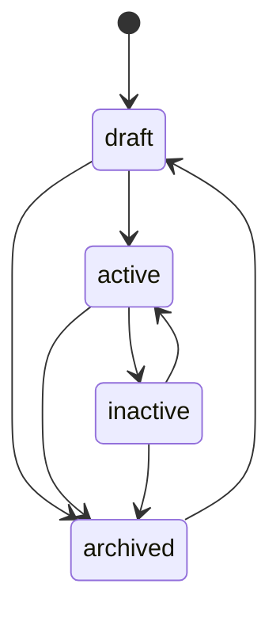
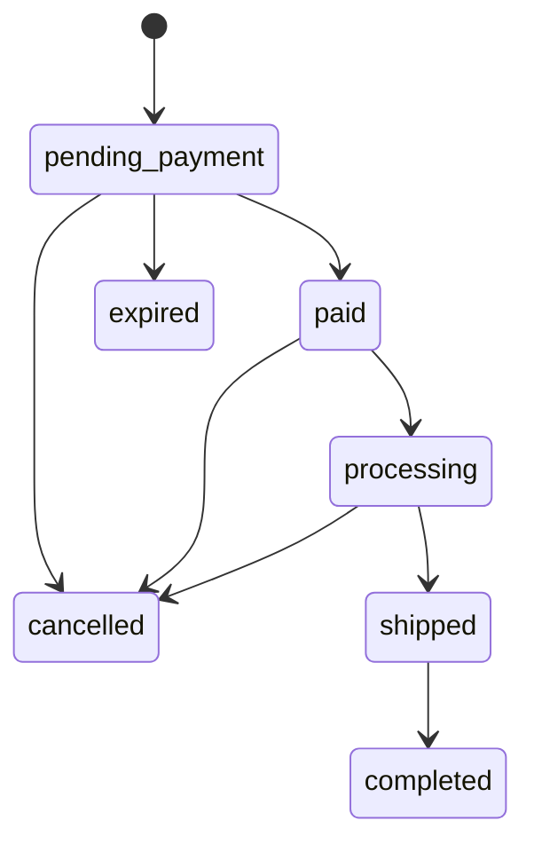

🇬🇧 English (source) · 🇮🇩 [Bahasa Indonesia](cms.id.md)

# CMS: authoring, publishing, permissions, audit, media, taxonomy

How products, orders, marketing surfaces, and content move through their lifecycle inside `apps/cms`, and what a reader looking for media, advertising, or a fuller admin UI will and will not find here. The module itself is [`apps/cms/src/modules/commerce/`](../apps/cms/src/modules/commerce/), documented in depth in its own [`README.md`](../apps/cms/src/modules/commerce/README.md) — this page links to that document rather than restating it column by column, and focuses on the workflow a person or agent actually authoring content goes through. News/blog authoring (`blog_content`) is `ahliweb/awcms`'s own module, carried by the subtree embed; this page describes only how `apps/storefront` consumes it, not its own admin workflow.

## State machines

### Product `status`: `draft` → `active`/`inactive`/`archived`

Read directly from [`apps/cms/src/modules/commerce/domain/product-status.ts`](../apps/cms/src/modules/commerce/domain/product-status.ts)'s `LEGAL_TRANSITIONS`:

A product is authored `draft`, switched to `active` to sell, pulled to `inactive` to take it off sale without losing the record, and moved to `archived` to retire it — from which only `draft` re-opens it. `current === next` is always legal (a no-op, not an error). `status` travels through the same `PATCH /api/v1/commerce/products/{id}` as every other field, checked against `LEGAL_TRANSITIONS` **before** any write runs.

### Order `status`: seven states, three actors

Read directly from [`apps/cms/src/modules/commerce/domain/order-status.ts`](../apps/cms/src/modules/commerce/domain/order-status.ts):

Every legal edge is also restricted by **who** may apply it (`actorMayApplyOrderStatus`):

| Actor | May apply |
| --- | --- |
| `admin` | Any legal edge above |
| `customer` | `pending_payment → cancelled` only (their own order, checked by phone) |
| `system` (the `commerce:orders:expire` job) | `pending_payment → expired` only |

Every transition writes a row to `awcms_commerce_order_events` (append-only, `from_status`/`to_status`/`actor`/`note`/`created_at` — see [`docs/skema-basis-data.md`](skema-basis-data.md)), which is what the storefront's order-tracking timeline renders. A POS counter sale (issue #116, below) walks the same graph in one transaction — `[*] → pending_payment → paid`, both rows actor `admin` — so it never introduces a state or an edge of its own. `completed`, `cancelled`, and `expired` are terminal. `paymentStatus` (`unpaid → dp_paid/paid → refunded`) is a separate axis from `status`, set by `PATCH .../payment-confirmations/{cid}/review` (`decision: "accepted"` moves it to `paid`) or, for down-payment, at order creation.

### Flash-sale `status`: two editorial states, two job-derived states

`draft`/`scheduled` are set by an owner; `active`/`ended` are **derived from the time window** and persisted by the `commerce:flash-sales:tick` job (schedule `*/5 * * * *`), which fires `commerce.flash_sale.{started,ended}` exactly once per transition — a page that reads `GET /flash-sales/active` never has to compute the window itself.

## Permissions and authorization: 39 keys across three areas

<!-- hitung:mulai key=commerce-areas source=table-rows -->

Every commerce route is gated on a `commerce.*` permission key, grouped into three areas below.

| Area | Resources | Actions |
| --- | --- | --- |
| Catalog | `categories`, `products` | `read`, `create`, `update`, `delete`, `restore` |
| Marketing | `flash_sales`, `vouchers`, `sliders`, `testimonials`, `popups` | `read`, `create`, `update`, `delete` |
| Store settings | `settings` | `read`, `update` |

<!-- hitung:selesai -->

Orders, customers, and reviews are a fourth, narrower area: `commerce.orders.{read,update}`, `commerce.customers.{read,update}`, `commerce.reviews.{read,update,delete}` — **deliberately no `create`/`delete`** for orders or customers, since both are created only through the anonymous storefront path, which has no admin identity to check a permission against. The ONE permission-gated order-creation path is the POS counter sale (issue #116): `commerce.pos.create` gates `POST /api/v1/commerce/pos/orders`, because there a staff member IS the actor; its history read reuses `commerce.orders.read` rather than seeding a second, narrower read key with nothing distinct to enforce. See [`docs/api.md`](api.md) for the full, current permission table (39 base keys plus every key each increment-5 child added — affiliates, WhatsApp, conversations, campaigns, webhook endpoints, POS) and [ADR-0009](adr/0009-guest-checkout-by-order-code-and-phone.md) for why that path is anonymous at all. Row-level security backs the same boundary at the database layer — see [`docs/skema-basis-data.md`](skema-basis-data.md).

## Customer account OTP e-mail (Issue #89, contract #86/ADR-0016 D2)

`POST /account/otp/request` delivers its 6-digit code through the `email` module's own outbox (`awcms_email_messages`), enqueued inside the same transaction as the OTP row, under a new derived template category `derived.commerce_customer_otp` (`registerDerivedEmailTemplateCategory`, three variables: `code`, `expiresInMinutes`, `storeName`). Migration `sql/919` seeds an EN+ID copy of that template for every tenant that already exists at migration time; a tenant created afterwards needs its own copy seeded (its provisioning flow, or an operator, the same way the base categories' own `email:templates:seed-defaults` is per-tenant and explicit). When `EMAIL_PROVIDER=log` or `EMAIL_ENABLED` is not `"true"`, delivery goes through a `log` adapter instead — the only place in this codebase that writes an OTP code to a log line, so local development and CI can exercise the whole flow without mail credentials.

Two env-tunable rate-limit pairs govern this surface: `COMMERCE_ACCOUNT_OTP_RATE_LIMIT_{MAX_PER_IP,WINDOW_SEC,MAX_PER_EMAIL}` (10/IP/h, 5/e-mail/h by default) for `otp/request`, and `COMMERCE_ACCOUNT_OTP_VERIFY_RATE_LIMIT_{MAX_PER_IP,WINDOW_SEC}` (20/IP/h by default) for `otp/verify` — see `.env.example` in `apps/cms`.

## Customer account OTP via WhatsApp (Issue #108, contract #106 D5)

D2's WhatsApp follow-up: `POST /account/otp/request` accepts `via?: "email"|"whatsapp"` (default `email`). `via: "whatsapp"` requires `phone` (normalised to E.164), only ever supports `purpose: "login"` (registration stays e-mail OTP only — a `register` combination is a `400 VALIDATION_ERROR`), and answers `409 CHANNEL_UNAVAILABLE` — checked and answered BEFORE an OTP row is ever issued — when `COMMERCE_WHATSAPP_ENABLED` is not `"true"` (a configuration fact, not a new enumeration oracle: it is independent of whether the phone supplied actually has an account). `POST /account/otp/verify` accepts `phone` as an alternative to `email` (mutually exclusive), resolving the account via its customer row's phone (`findAccountByPhone`) rather than by e-mail — "login by WhatsApp" only ever authenticates an account that already exists.

The code is delivered through a second provider outbox modelled on `email` exactly (`awcms_commerce_whatsapp_messages`/`_delivery_attempts`, `sql/925`), dispatched by `bun run commerce:whatsapp:dispatch` (claim/send/finalize, lease, circuit breaker, backoff — same shape as `email:dispatch`) against the resolved `COMMERCE_WHATSAPP_PROVIDER` (`fonnte`, `meta`, or `log` for dev/CI — the only adapter that writes the code to a log line). `GET /api/v1/commerce/whatsapp/messages` (`commerce.whatsapp.read`) and `/admin/commerce-whatsapp` give an operator read-only diagnostics over the outbox — masked phone only, never the raw number/rendered body/code.

## Customer account resources (Issue #91, contract #86/ADR-0016)

`/api/v1/commerce/storefront/account/{addresses,wishlist,orders,reviews}` — every route bearer-secured (`requireCustomerSession`), rate-limited per IP under `COMMERCE_STOREFRONT_RATE_LIMIT_{MAX,WINDOW_SEC}` (60/min by default, the same env pair the anonymous tracking route already uses), body-limited, and CORS-preflighted with `authorization` joining `content-type` in the allowed-headers list (a bearer request's preflight would otherwise never reach the browser's actual call).

- **Addresses.** Max 10 live rows per account (`409 ADDRESS_LIMIT_REACHED`); the FIRST address ever saved becomes the default automatically; `GET` lists default first. Exactly one default per customer is a DATABASE invariant, not merely an application one — `sql/920`'s partial unique index on `(tenant_id, customer_id) WHERE is_default AND deleted_at IS NULL`. Deleting the default promotes the most-recently-created remaining address; `PATCH` never touches `isDefault` (only `POST .../default` does).
- **Wishlist.** `PUT {productIds}` union-merges into whatever the account already has, max 200 live rows, and returns the merged, authoritative list; an id that does not resolve to a live product IN THIS TENANT is silently skipped — the same "a bare FK cannot isolate by tenant" guard the module's category/order-item references already follow, checked in the application layer inside the RLS-scoped transaction. `GET` shows published (`status = 'active'`), non-deleted products only; a product moderated back out of that status, or soft-deleted, simply stops appearing — the wishlist row itself is untouched. `DELETE /wishlist/{productId}` soft-deletes and always answers `204`, even for a product never wishlisted.
- **Orders.** `GET /orders` is keyset-paginated (`cursor`, `limit` ≤ 50, default 20), newest first, `created_at >= account.historyFrom` (ADR-0016 D4) enforced INSIDE the query. `GET /orders/{orderCode}` needs no phone — the bearer already proves ownership — and checks BOTH ownership and `historyFrom` inside that same query, so an unknown code, another account's order, and one that predates `historyFrom` all answer the identical neutral `404`. Both reuse the same order shape `GET .../orders/{code}?phone=` returns.
- **Reviews.** `GET /reviews` lists every review the account itself submitted, any moderation status, with the product name and order code inlined.

**The two existing anonymous routes accept an optional bearer now.** `POST /storefront/orders` and `POST /storefront/reviews`: a present, valid `Authorization: Bearer …` makes the order/review's customer the account's OWN customer row — `findOrCreateCustomerByPhone`/the phone-matched ownership lookup is skipped entirely in that case, though the phone field is still shape-validated and still the per-phone rate limit's key. A present but invalid/expired bearer answers `401 UNAUTHENTICATED` explicitly, rather than silently falling back to the guest path — the storefront re-reads its own session immediately before submit and needs to be told plainly that it went stale. No `Authorization` header at all leaves both routes byte-for-byte unchanged from before this issue. `POST /storefront/orders` also accepts an `affiliateCode` field now — shape-validated (a string, at most 50 characters) and otherwise ignored; [issue #92](https://github.com/ahliweb/awcms-one/issues/92) is what resolves it against `awcms_commerce_affiliates.code` and records a referral.

## Audit logging

Every mutating owner route — create, update, delete, restore, status transition, payment-confirmation review, review moderation — calls `recordAuditEvent` inside the same RLS-scoped transaction as the write it records, naming the module (`commerce`), the resource type, the resource id, the action, and (for a delete) a `warning` severity. Neither commerce table carries `created_by`/`updated_by`/`deleted_by`, so the audit log is the sole record of actorship for this module, not a supplementary one. The anonymous storefront path writes no audit event for order creation itself (there is no admin actor to attribute it to) — the order's own `order_events` row is that path's equivalent record, timestamped and reason-carrying.

## Admin screens: eleven, covering every permission

<!-- hitung:mulai key=commerce-admin-screens source=table-rows -->

Eleven screens under `apps/cms/src/pages/admin/`, each gated on its area's `read` permission via `loadAdminScreen`, with further inline checks for create/update/delete/restore:

| Screen | Route | Gated on |
| --- | --- | --- |
| Products | `/admin/commerce` | `commerce.products.read` |
| Categories | `/admin/commerce-categories` | `commerce.categories.read` |
| Flash sales | `/admin/commerce-flash-sales` | `commerce.flash_sales.read` |
| Vouchers | `/admin/commerce-vouchers` | `commerce.vouchers.read` |
| Sliders | `/admin/commerce-sliders` | `commerce.sliders.read` |
| Testimonials | `/admin/commerce-testimonials` | `commerce.testimonials.read` |
| Popup | `/admin/commerce-popup` | `commerce.popups.read` |
| Store settings | `/admin/commerce-settings` | `commerce.settings.read` |
| Orders | `/admin/commerce-orders` | `commerce.orders.read` (no create form) |
| Customers | `/admin/commerce-customers` | `commerce.customers.read` (no create form) |
| Reviews | `/admin/commerce-reviews` | `commerce.reviews.read` |

<!-- hitung:selesai -->

Between them, these eleven screens claim every one of the module's 39 declared permissions — verified by `apps/cms`'s `admin-screen-coverage-ledger.ts` gate (`admin:screen-coverage:check`) and two contract test files (`apps/cms/tests/admin-commerce-page-contract.test.ts`, `apps/cms/tests/admin-commerce-marketing-page-contract.test.ts`). The Orders and Customers screens have no create form by design — see "Permissions" above.

## Media: product images, sliders, testimonials — resolved, not yet uploaded through this repo's own tooling

`commerce`'s `dependencies` gained `media_library` in this increment (issue #23), and every image reference — a product's `images[]`, a variant's `imageMediaObjectId`, a size chart's `sizeChartMediaId`, a slider's/testimonial's/popup's `mediaObjectId` — resolves through `MediaLibraryPort` to a public URL. **Only a product image's `mediaObjectId` is checked live** against `MediaLibraryPort.isMediaReferenceSafe` before insert; a variant's `imageMediaObjectId` and a size chart's `sizeChartMediaId` are validated UUID-shaped only, not checked for live/verified existence — a stale or foreign id there simply resolves to no public URL at render time, and RLS still keeps it tenant-isolated (recorded in the module's own README as a known, deliberate scope trim).

What this increment does **not** build: a real upload path for any of these images through this repository's own tooling. `tools/seed-borneojek-mart.ts` uses small, self-generated placeholder SVGs (`tools/seed-assets/`) rather than downloading real product photos, and the anonymous storefront's own payment-proof upload (`POST .../orders/{code}/payment-proof/upload-sessions`) always answers `503 MEDIA_UNAVAILABLE` — the existing `media_library` upload-session flow needs an authenticated `actorTenantUserId`, which no anonymous checkout caller has; designing a second, parallel anonymous auth seam bound to `(orderCode, phoneHash)` was judged out of scope for this increment (recorded in issue #29's PR as a deliberate, security-sensitive design deferred rather than rushed). `payment.proofUpload: false` on the public store-settings read model tells the storefront to hide the control when this is the case; a payment confirmation without a proof image is still fully accepted.

## Institution emblems: resolved and rendered (issue #59)

`blog_content`'s `awcms_blog_institutions` carries `logo_media_id`/`logo_alt` since upstream [awcms#806](https://github.com/ahliweb/awcms/pull/807), received here through the `apps/cms` subtree pull. `apps/storefront` resolves that id through `GET /api/v1/media/objects` like every other media reference and renders the emblem beside an article's opening paragraph and on `/mitra/{slug}` — the platform's answer to seputarborneo.com's per-article "Logo Instansi", moved onto the institution the article is already filed under so one upload serves every article of that channel. Neither field is required: an institution without an emblem, and a `apps/cms` older than that pull, both render nothing.

## Logo and favicon management: still resolved as media ids, not rendered

`apps/cms`'s `site-profile` module exposes `logoMediaId`/`faviconMediaId` as part of the tenant's site profile, resolvable only through a `media_library` client. `apps/storefront` reads the site profile (`GET /api/v1/site-profile/composed`, issue #24) but does not resolve either id to a URL — the storefront's brand mark is the store name in text, and `apps/storefront/public/favicon.svg` is a bundled default icon, not a CMS-managed one. This is a recorded, deliberate scope trim (see `apps/storefront/README.md`), not an oversight: building a `media_library` client in the storefront was judged out of scope for chrome/foundation work.

## Taxonomy: commerce categories, plus the news IA's own hierarchy

"Taxonomy" spans two, separately owned trees:

- **`awcms_commerce_categories`** — the self-referencing product-category tree this module owns (see [`docs/skema-basis-data.md`](skema-basis-data.md)). `parentId` is immutable after creation, matching `awcms_offices`' own choice for the identical reason (no cycle-detection built for either).
- **`blog_content`'s rubrik/daerah/mitra hierarchy** — `ahliweb/awcms`'s own module, carried by the subtree embed. `apps/storefront`'s `/rubrik/{slug}` walks a hierarchical rubrik (category) tree where a parent rubrik's archive includes every descendant rubrik's posts (issue #28); `/daerah/{slug}` is a region archive reached via an institution's `regionCode` (a post itself carries no region field); `/mitra/{slug}` is an institution landing page. None of these three are commerce categories — they are `blog_content`'s own taxonomy, rendered by the storefront's news surface. See [`docs/routing.md`](routing.md) for the full URL map.

## Advertising: ad placements, as `blog_content` renders them

`blog_content`'s `AD_PLACEMENT_KEYS` define header, in-article, and sidebar slots — there is deliberately no footer slot (verified against the actual registered key set, not assumed). `apps/storefront`'s news pages render whichever slots the CMS returns; there is no ad-placement management UI documented here because it belongs to `blog_content`, not `commerce` — see `apps/cms`'s own module documentation for the admin side.

Increment 3 made those slots real rather than nominal. All twelve keys are now consumed (`header_banner`, `below_headline`, `homepage_middle`, `homepage_bottom`, `article_top`/`_middle`/`_bottom`, `sidebar_top`/`_middle`/`_bottom`, `category_archive_top`, `search_result_top`), the creative renders as an actual `` through the media client ([ADR-0011](adr/0011-storefront-media-resolves-through-the-media-objects-endpoint.md)), and clicking one opens a native `<dialog>` — seputarborneo's own popup behaviour (issue #53). **There is still no footer key**: the leaderboard seputarborneo renders above its footer is this app's `homepage_bottom`, placed there by `FooterBerita.astro` (epic #46's decision 4); adding a dedicated `footer_leaderboard` key remains an upstream change nobody has needed yet. A slot with nothing booked renders nothing at all — never an empty placeholder box.

## Affiliate program: the shopper's side (issue #93); the admin/staff side is issue #92, both implemented

`apps/cms`'s own [ADR-0016](adr/0016-customer-accounts-are-otp-verified-commerce-accounts-with-bearer-sessions.md) designs the affiliate program fresh, per its D5 decision: `awcms_commerce_affiliates` (one row per enrolled customer, `code` unique per tenant, `commission_rate`, `status`) and `awcms_commerce_affiliate_commissions` (one row per referred order, created when that order reaches `completed`; `status` progresses `pending` → `approved`/`void` → `paid`, staff-driven). Self-referral yields no commission. This document's own scope is what `apps/storefront` does with that contract, not the admin screens that manage it — issue #92 built both the owner API (`commerce.affiliates.read|update`, `commerce.affiliate_commissions.read|update`) and the `/admin/commerce-affiliates` screen (affiliates table with suspend/activate/edit-rate; commissions table filterable by status with approve/pay/void, each mutation carrying an `Idempotency-Key`):

- A tenant turns the program on by setting a commission rate on `/admin/commerce-settings` (a real `awcms_commerce_store_settings.affiliate_commission_rate` column, `null` = off); the storefront never sees that rate directly — only the derived `affiliateProgramEnabled` boolean on the PUBLIC store-settings read model, read at build time. An awcms instance older than this feature simply omits the field, and the storefront defaults it to `false` rather than assuming a program that does not exist yet is somehow on.
- `?ref={code}` capture, the checkout-time `affiliateCode`, and `/akun/afiliasi`'s own enrol/link/stats/commissions UI are entirely `apps/storefront`'s concern — see that app's own README and [`docs/routing.md`](routing.md)/[`docs/seo.md`](seo.md) for the shopper-facing mechanics. The CMS's own contract is deliberately permissive here: an unknown or suspended `affiliateCode` sent with an order is silently ignored, never rejected — a shopper's checkout must never fail because of someone else's stale or mistyped referral link. The code is resolved against `awcms_commerce_affiliates.code` and status at ORDER-CREATION time; `shouldEarnCommission` re-checks self-referral and the affiliate's CURRENT status again at the moment the order reaches `completed`, since a code valid at checkout may belong to an affiliate suspended before the order completes.
- `GET/POST /account/affiliate` and `GET /account/affiliate/commissions` are bearer-authenticated, customer-facing routes (`/api/v1/commerce/storefront/account/affiliate*`) — the SAME authentication surface as `/account/me`/`/account/orders`, not the owner API the admin screens use.

## Commerce inbox (issue #111, contract #106 D8)

A verified customer account's own thread with the store — `awcms_commerce_conversations`/`awcms_commerce_messages` (`apps/cms/sql/927_awcms_commerce_conversations_schema.sql`), owned by exactly one `awcms_commerce_customer_accounts` row (ADR-0016). A guest checkout customer has no account and therefore no inbox thread — the same account requirement the affiliate program above already has.

- **Storefront side (bearer):** `GET/POST /account/conversations` (list, newest-activity-first, keyset; open a thread with its own first message — subject 1-150 chars, body 1-4000 chars), `GET /account/conversations/{id}` (thread + messages, marks it read for the customer), `POST /account/conversations/{id}/messages` (post a reply). Posting to a thread the store has closed answers `409 CONVERSATION_CLOSED` — a customer can never reopen their own thread; only a store reply does that. Customer posts are rate-limited 10/hour per ACCOUNT (`COMMERCE_CONVERSATION_POST_RATE_LIMIT_MAX`), on top of the ordinary per-IP limiter every storefront route already applies.
- **Owner side:** `GET /api/v1/commerce/conversations?status=&unread=` (staff list, filterable), `GET .../conversations/{id}` (marks it read for the store), `PATCH .../conversations/{id}` (`{status: "open"|"closed"}` — explicit close/reopen), `POST .../conversations/{id}/messages` (staff reply, `Idempotency-Key` required — this is the high-risk mutation in this surface, since it enqueues an e-mail). Gated on `commerce.conversations.read|update`.
- **Unread flags** are two independent booleans on the conversation row — `unread_for_store` flips true on a customer message and clears when staff reads the thread; `unread_for_customer` flips true on a staff reply and clears when the customer reads it. Both are denormalized and kept in step with `awcms_commerce_messages` inside the SAME transaction as the message insert, never derived by a join at read time. The storefront's own `Percakapan.unreadForCustomer` contract field (`akun-klien.ts`) travels as `0|1`, matching this shape exactly.
- **A staff reply notifies the customer by e-mail** — one `derived.commerce_conversation_reply` message enqueued through the existing `email` module's outbox, in the SAME transaction as the reply insert, auto-seeding its default template on first miss (`ensureConversationReplyTemplate`, the identical pattern `customer-otp-channel-adapters.ts`'s `ensureCustomerOtpTemplate` already established for OTP e-mail). Template variables: `name`, `subject`, `storeName`, `link` (`COMMERCE_STOREFRONT_PUBLIC_URL` + `/akun/pesan?id=<conversationId>`). No WhatsApp notification in this issue — the store's own D5 outbox is not reused here.
- **Admin screen** `/admin/commerce-inbox`: a conversation list with status/unread filters and an unread badge, a thread view opened via `?id=`, a reply form (client script sends `Idempotency-Key`), and close/reopen buttons.
- **Subject data:** both tables are `unreachableBySubject: true` — the owning customer account carries no `tenant_user`/`identity`/`profile`/`principal` id (ADR-0016 D1), the identical gap `commerce.customer_addresses`/`commerce.wishlists` already document; an account holder reaches their own threads through the bearer routes above, which is outside this repo's automated per-subject export/erasure engine by construction (see `module.ts`'s `subjectData` array).

## Customer campaigns: consent, mass e-mail/WhatsApp (issue #114, contract #106 D9)

A consent-gated mass send to a filtered slice of a tenant's customer accounts — `awcms_commerce_campaigns`/`awcms_commerce_campaign_recipients` (`apps/cms/sql/929_awcms_commerce_campaigns_schema.sql`), reusing the SAME e-mail/WhatsApp outboxes the OTP (D5) and inbox (D8) surfaces already dispatch from — no third delivery mechanism, no separate rate-limit story.

- **Consent is load-bearing.** `awcms_commerce_customer_accounts.marketing_consent_at` is a nullable timestamp: non-null means the account holder opted in at that instant, `NULL` means never opted in (or withdrawn). It is toggled ONLY by the account itself, via `PATCH /api/v1/commerce/storefront/account/me {marketingConsent: true|false}` — never by staff, and there is no admin route that sets it for a customer. Because consent lives on the ACCOUNT row, an account-less guest checkout customer is structurally unreachable by any campaign, the same "no account, no reach" shape the inbox (D8) already established. Both a grant and a revoke are audited (`customer_marketing_consent` resource type).
- **Audience filter.** `{levels: number[], hasAccount: boolean|null, lastOrderSince: string|null}` — every non-empty filter narrows further (AND, not OR); `{}` targets every consented, addressable account. `hasAccount: false` resolves to an EMPTY set by definition, since consent itself requires an account. A channel additionally requires an address: `email` needs a non-empty `email_normalized`, `whatsapp` needs a non-empty customer `phone`.
- **CRUD + preview.** `GET/POST /api/v1/commerce/campaigns` (list/create a `draft`), `GET/PATCH .../campaigns/{id}` (edit only while `draft` — `409 CAMPAIGN_NOT_EDITABLE` otherwise), `POST .../campaigns/{id}/preview` (resolves the audience into a recipient COUNT only, never a resolved list — anti-enumeration, matching the OpenAPI contract). Gated on `commerce.campaigns.read|update`.
- **Send/cancel.** `POST .../campaigns/{id}/send` moves a `draft`/`scheduled` campaign to `scheduled` (`scheduled_at = now()` for an immediate send); `POST .../campaigns/{id}/cancel` stops it before (or while) it sends — already-dispatched recipient rows are not un-sent. Both require `Idempotency-Key` (hash bound to the campaign id + the literal action string) and are gated on the separate `commerce.campaigns.send` permission — a role trusted to draft/edit a campaign is not automatically trusted to fire (or cancel) it.
- **Dispatcher `commerce:campaigns:dispatch`** (script, `awcms_worker`, every 1-2 minutes): CLAIMs due (`scheduled`, due now) or resumed (`sending`, a prior run crashed) campaigns with `FOR UPDATE SKIP LOCKED`; for each, loops pages of 200 not-yet-recorded, consented, addressable customers (`NOT EXISTS` against `awcms_commerce_campaign_recipients` — this alone makes the loop resumable without a separate cursor column), inserting one recipient row per customer (`UNIQUE (campaign_id, customer_id)`, `ON CONFLICT DO NOTHING`) and enqueuing into the e-mail outbox (a pass-through `derived.commerce_campaign` template, auto-seeded on first miss, the same `ensureConversationReplyTemplate` pattern D8 established) or the WhatsApp outbox (the pre-reserved `commerce.campaign` template key). The loop re-checks the campaign's live `status` before every page — a `cancel` between pages stops further dispatch immediately. An empty page marks the campaign `sent`, with `recipient_count` = the total recipient rows.
- **Template variable rendering.** A campaign's own `subject`/`body` may interpolate exactly `{{name}}`/`{{storeName}}` (`domain/campaign-content.ts`) — an unknown placeholder is left as a literal, fail-closed, the same posture every renderer in this codebase takes. `subject` is required for `channel: "email"`, optional and ignored for `channel: "whatsapp"`.
- **Admin screen** `/admin/commerce-campaigns`: a campaign list, a create-draft form (channel, subject, message, customer-level checkboxes), and a detail/editor panel (`?id=`) with an audience-preview button (count only) and send/cancel actions (both `window.confirm`-gated).
- **Subject data:** `awcms_commerce_campaigns` is `unreachableBySubject: true` (addressed to a filter, not a customer). `awcms_commerce_campaign_recipients` names `customer_id`, but inherits the SAME `commerce.customers`/`commerce.orders` vocabulary gap (ADR-0016 D1: no `tenant_user`/`identity`/`profile`/`principal` id) — `address_masked` is already masked at write time, so there is nothing further to redact even if it were reachable.

## Courier rates: RajaOngkir, cached (issue #107, contract #106 D4)

`ShippingRateProvider` (`apps/cms/src/modules/commerce/domain/shipping-rate-provider.ts`) is a port, same shape as `email`'s provider port: `searchDestination(query)` and `getRates({originId, destinationId, weightGrams, couriers})`, resolved at the edge from `COMMERCE_SHIPPING_RATE_PROVIDER` (`rajaongkir` or `log`) — see [`docs/deployment.md`](deployment.md) for the env vars. The RajaOngkir (Komerce API v2) adapter and its `log` fixture-returning sibling both implement it; neither is imported by name outside the adapter and its resolver.

- **Caching, two tables.** `awcms_commerce_courier_destinations` maps a tenant's own `idn_admin_regions` district code to the provider's own destination id (resolved once, by a district+city name search, never re-resolved on every quote). `awcms_commerce_shipping_rates` caches a rate per `(tenant, provider, origin, destination, weight bucket, courier, service)`, TTL 6 hours; `commerce:shipping-rates:purge` deletes expired rows hourly.
- **Weight bucketing.** `domain/weight-bucket.ts`'s `computeWeightBucketGrams` rounds the cart's total weight up to the next 100 g, floored at 1000 g — RajaOngkir's own minimum billable weight — so two carts within the same 100 g band share one cache row.
- **The provider is never called from inside a database transaction** (ADR-0006/0010): a cache read is one short transaction, the provider call (if the cache missed) happens with no transaction open, and the write-back is a second short transaction with `ON CONFLICT ... DO UPDATE` — a concurrent cache miss on the same key just means the last writer wins, never an error.
- **The quote path.** `POST .../cart/quote` accepts an optional `destination: {districtCode}`; when the tenant's `shipping.courier.enabled` AND a provider is configured AND a destination was sent, `shippingOptions[]`'s courier entries are live, per-service rates (`{method:"courier", serviceId:"jne:REG", name, cost, etd, available:true}`); otherwise a single `available:false` placeholder with a `note` (no destination sent, or the district could not be matched to a courier — `"Tujuan belum dikenali kurir"`).
- **Order creation validates against the cache only.** `POST .../orders`'s `shipping: {method:"courier", serviceId}` is checked against a non-expired `awcms_commerce_shipping_rates` row keyed off the delivery address's own `districtCode` — never a second live provider call from inside the order's write transaction. A stale/unknown selection answers the same `409 CART_CHANGED` (with a fresh quote) every other price/stock/shipping mismatch does.
- **Store settings.** `shipping.courier = {enabled, originDestinationId, couriers[]}` (owner, `PUT /store-settings`) is the on/off switch, the tenant's own RajaOngkir origin, and which courier codes to quote. `GET /api/v1/commerce/shipping/destinations?search=` (owner-only, `settings.update`) backs the admin origin picker in `/admin/commerce-settings`'s courier section. The public read model's `shipping.courierEnabled` is `true` only when `courier.enabled` AND a provider is configured — never a raw copy of the stored flag.

## Payment gateway: Midtrans Snap (issue #110, contract #106 D3) + webhook intake and reconcile (issue #113, contract #106 D2)

`PaymentGatewayProvider` (`apps/cms/src/modules/commerce/domain/payment-gateway-provider.ts`) is a port, the same shape `ShippingRateProvider` established for #107: `createSession(order)`, `fetchStatus(providerRef)`, `verifyWebhook(...)`, resolved at the edge from `COMMERCE_PAYMENT_GATEWAY` (`midtrans` or `log`) — see [`docs/deployment.md`](deployment.md) for the env vars. The Midtrans Snap adapter and its `log` fixture-returning sibling both implement it; `log` is refused outside a non-production deployment.

- **Session creation, two transactions.** `createGatewaySession` validates the order (must be `payment.method: "gateway"`, status `pending_payment`) and checks for an existing live session in one short transaction, calls the provider with NONE open, then persists the new `awcms_commerce_payment_gateway_sessions` row in a second short transaction — the same ADR-0006/0010 discipline #107's `getCourierRates` established. A genuinely concurrent double-create is caught by the `UNIQUE (provider, provider_ref)` constraint and re-fetches the winning row rather than erroring.
- **Idempotent by design, not by an `Idempotency-Key`.** A repeat call for the same order while a session is still live (`status IN ('created', 'pending')`) returns THAT session; Midtrans's own `order_id` (`${orderCode}-${attempt}`) is unique per attempt, so a session is never minted twice at the provider for the same attempt.
- **Auth: phone or bearer.** `POST .../orders/{orderCode}/payment-gateway/sessions` accepts `{phone}` in the body or a customer bearer, the same optional-bearer pattern `POST .../orders` already uses. An unknown order, a wrong phone, or a live bearer belonging to a DIFFERENT order's owner all answer the same neutral `404` the order-tracking route uses — never a distinguishable "exists but not yours" response.
- **Status mapping.** `domain/gateway-status-mapping.ts` maps Midtrans's `transaction_status`/`fraud_status` to this module's own `paid|pending|expired|failed|refunded` vocabulary; both `fetchStatus` and `verifyWebhook` share it so a status check and a webhook callback can never disagree.
- **The quote path.** `POST .../cart/quote`'s `paymentMethods[]` gains `{method: "gateway", available}` — `true` only when the tenant's `payment.gateway.enabled` AND a `PaymentGatewayProvider` is configured for this deployment.
- **Store settings / admin.** `payment.gateway = {enabled}` (owner, `PUT /store-settings`) is the on/off switch; the public read model's `payment.gatewayEnabled` is `true` only when `gateway.enabled` AND a provider is configured — never a raw copy of the stored flag. `/admin/commerce-settings` gains the enable toggle plus a webhook-endpoints panel: owner `GET|POST /api/v1/commerce/webhook-endpoints` (masked list; the raw token is shown exactly once, at creation, hashed at rest) and `DELETE .../webhook-endpoints/{id}` (revoke), gated on `commerce.webhook_endpoints.update`.
- **The webhook-endpoint bootstrap lookup.** `awcms_resolve_commerce_webhook_endpoint(token_hash)` is a `SECURITY DEFINER` function mirroring `awcms_resolve_tenant_domain_lookup`'s pattern exactly (a dedicated NOLOGIN owner role, a narrowly scoped read policy, EXECUTE restricted to `awcms_app`) — resolves `(tenant_id, provider)` from an opaque token before any tenant context exists.

### Operator runbook — creating a webhook endpoint and pointing Midtrans at it

1. In `/admin/commerce-settings`'s webhook-endpoints panel, click "create" for provider `midtrans`. The plaintext token (`awcmswh_…`) is shown **exactly once** — copy it now; only its SHA-256 hash is stored (`GET`/list never returns it again).
2. Build the full callback URL: `https://<your-tenant-domain>/api/v1/commerce/webhooks/midtrans/<token>`.
3. Paste that URL into the Midtrans dashboard's **Payment Notification URL** setting (Settings → Configuration, for both the sandbox and production Merchant Portal, matching whichever `COMMERCE_MIDTRANS_IS_PRODUCTION` this deployment runs).
4. Set the deployment's env vars (see [`docs/deployment.md`](deployment.md)): `COMMERCE_PAYMENT_GATEWAY=midtrans`, `COMMERCE_MIDTRANS_SERVER_KEY`, `COMMERCE_MIDTRANS_IS_PRODUCTION`. `COMMERCE_MIDTRANS_SNAP_BASE_URL`/`COMMERCE_MIDTRANS_STATUS_BASE_URL`/`COMMERCE_MIDTRANS_TIMEOUT_MS` are optional overrides.
5. If a token leaks or an integration is retired, revoke it (`DELETE .../webhook-endpoints/{id}`) and create a fresh one — Midtrans's dashboard URL is updated at the same time, since the old token stops resolving immediately.

### Webhook intake route (issue #113)

`POST /api/v1/commerce/webhooks/{provider}/{endpointToken}` — public, no session (registered in `lib/security/api-body-auth-boundary.ts`'s exemption list, same family as `/api/v1/sync/push`'s HMAC-credentialed entries). Gate order:

1. Body read, size-capped.
2. `(tenant_id, provider)` resolved from the token's hash via the bootstrap function above. Unknown/revoked token, a `{provider}` path segment that does not match what the token resolves to, or no provider configured for this deployment all answer the SAME neutral `404`, after padding the response to a floor latency (`NEUTRAL_404_MIN_LATENCY_MS`) so the two cases cannot be told apart by timing.
3. `provider.verifyWebhook(...)` — a bad/missing signature is `401`.
4. Inside one `withTenantOrThrow` transaction: `INSERT INTO awcms_commerce_payment_events (...) ON CONFLICT (tenant_id, provider, event_key) DO NOTHING` — zero rows affected means a REPLAYED callback, answered `200` with no side effect. Otherwise the mapped status is applied: `paid` → `markOrderPaidBySystem`; `expired` → `expireOrderBySystem` (only from `pending_payment`, silently absorbed otherwise); `failed`/`refunded` → the gateway session row is updated, the order is left untouched. This route **never** calls the provider itself (no `fetchStatus`) — `fetchStatus` is the reconcile job's own exclusive concern.

**Amount guard (defense in depth).** Before any order transition, the provider-reported `gross_amount` is compared with the order's own `total` in integer cents (`domain/payment-amount-guard.ts`). A mismatch — or an unparseable amount — never marks the order paid: the event is still recorded (replay guard intact) with `outcome = 'amount_mismatch'` (`sql/934` widens the CHECK), an audit-log entry is written against the order, the gateway session is moved to `failed` **only** if the provider status itself is a terminal failure (`failed`/`expired`) and otherwise left `pending`, and the route still answers `200` so Midtrans stops retrying. A later callback with the correct amount (a different `event_key`) settles the order normally. The reconcile job applies the identical guard to `fetchStatus`'s `gross_amount`.

`markOrderPaidBySystem` (`application/order-directory.ts`) sets `paid_at`/`payment_status`, `gateway_provider`/`gateway_ref` on the order, an `order_events` row with actor `system`, and an audit-log entry — idempotent: an order already `paid` is a no-op, and an order in any status other than `pending_payment`/`paid` (e.g. already `cancelled`) is also a no-op rather than an error.

**Why `paid -> refunded` is never auto-applied.** `domain/order-status.ts`'s status graph has NO `refunded` state at all — a gateway-reported refund (Midtrans `refund`/`partial_refund`) is recorded as a payment event (visible in the admin order detail's payment-events panel) but never moves the order automatically. Rationale: a refund at the gateway can be triggered by something outside this platform's own knowledge of WHY (a shopper dispute, a fraud team action), and auto-cancelling fulfilment consequences (restock, affiliate commission void, customer notification) from an unattended webhook is a bigger blast radius than requiring an owner to read the event and apply the EXISTING manual admin `-> cancelled` action themselves. See `domain/order-status.ts`'s own header for the same reasoning aimed at a developer.

### Reconcile job (issue #113)

`commerce:payments:reconcile` (`bun run commerce:payments:reconcile`, recommended every 1-2 minutes via cron/systemd timer — webhooks get lost, this job is the backstop): for every active tenant, every payment-gateway session still `pending` more than 2 minutes after creation gets one `provider.fetchStatus` call, made with **no** database transaction open, wrapped in `withTimeout` + a circuit breaker INSIDE the adapter itself (`infrastructure/midtrans-provider.ts`) — a timeout/breaker-open/provider-error result is skipped for this tick (still `pending`, retried next run), never thrown. Every session past its own `expires_at` is expired regardless of what `fetchStatus` answers (or without calling it at all, if already past expiry). A fetched `paid`/`expired` status runs through the SAME `markOrderPaidBySystem`/`expireOrderBySystem` path the webhook route uses. No-op (exits 0, does nothing) when `COMMERCE_PAYMENT_GATEWAY` does not resolve to a configured provider.

The admin order detail screen's "Cek status" button (gated on `commerce.orders.update`, `Idempotency-Key` required) calls a SCOPED single-order variant of the same logic (`POST /api/v1/commerce/orders/{id}/payment-gateway/reconcile`) — never the full tenant batch — for an owner who wants to check one order right now rather than wait for the next scheduled tick.

## Sales reports: three reporting projections over the order-event log (issue #117, contract #106 D7)

`commerce` contributes three `cursor_table` projections to the `reporting` module's generic projection engine (Issue #753) from its own `module.ts` (`reportingProjections`) — `commerce.sales_daily`, `commerce.sales_by_product`, `commerce.sales_by_category` — all over `awcms_commerce_order_events`, the append-only status-transition log (the only kind of source that strategy is correct for). The engine never learns the tables' shape; `commerce` supplies the descriptor, the pure delta rules and the sinks.

- **Delta rules, pure.** `domain/sales-report-deltas.ts`: an event `-> paid` from a not-yet-paid state ADDS the order's figures (gross = order subtotal, discount = order + voucher discount, shipping, net = order total, plus each line's quantity and line total per product and per product category); an event `-> cancelled` or `-> refunded` whose `from_status` is a paid state (`paid|processing|shipped|completed`) SUBTRACTS them; every other transition (creation, fulfilment steps, a cancellation or expiry of a never-paid order, a refund after a cancellation) contributes nothing. Every figure is attributed to the day of the order's `paid_at` in the fixed report zone `Asia/Jakarta` (`SALES_REPORT_TIME_ZONE`), so a reversal lands on the same day row its payment did and `net` is a true per-day net. Changing the zone constant needs a rebuild.
- **One extension to the engine, additive** (`MODULE_CONTRACT_VERSION` 4.1.0 → 4.2.0): `ProjectionCursorStream.dimensional` (extra `selectColumns` + an `applyBatch` sink the incremental worker AND the rebuild call on every fetched batch, inside the same bounded pass transaction, before the cursor advance) and `ProjectionDescriptor.dimensional` (`resetForTenant`, called by the rebuild reset in the same transaction as the cursor/metric reset; `readProjectionTotals`/`computeSourceTotals`, merged into reconciliation; `exportRows`, used by export generation). `reporting:projections:registry:check` refuses a sink without the descriptor contract and vice versa. The engine's own scalar counter (`paid_events`) stays beside each table, so the generic projection card and the engine's `COUNT(*)` reconciliation keep working unchanged.
- **Rebuild equals live, reconcile equals both.** The rebuild re-derives the three tables through exactly the same `applyBatch`; reconciliation walks the whole event stream through the same delta functions in memory and compares the sums (orders paid, gross/discount/shipping/net cents; item quantity and gross cents) with `SUM()` over the tables. `apps/cms/tests/integration/commerce-sales-reports.integration.test.ts` proves all four properties against a real Postgres under the unprivileged role: paid → rows, cancel-after-paid → subtracted on the same day, rebuild byte-equal to live, reconcile with no mismatch (and a tampered table IS flagged).
- **Read routes** (`reporting.dashboard.read`, `reporting` work class, `defineTenantRoute`): `GET /api/v1/reports/commerce/sales-daily?from&to`, `sales-by-product?from&to&limit` (default 20, max 200, best-selling by gross first), `sales-by-category?from&to` (the uncategorised bucket returns `categoryId: null`). `from`/`to` are inclusive `YYYY-MM-DD` report-zone days, default the last 30 days, at most 366 — validated by `domain/sales-report-query.ts`, which `/admin/commerce-reports` uses too so the screen and the API can never disagree. Owned by `commerce` via `api.routes: ["/api/v1/reports/commerce"]` (longest prefix wins over `reporting`'s claim); documented in `openapi/modules/commerce.openapi.yaml`.
- **Admin screen** `/admin/commerce-reports` (`commerce-reports.astro`, `loadAdminScreen`, entry `reporting.dashboard.read`): a GET date-range form, the three tables (with a totals footer on the daily one), and three optional panels that appear only with the reporting module's own permissions — projection freshness (`reporting.projections.read`, linking to `/admin/reporting` for rebuild/reconcile), an **Export CSV** button per projection (`reporting.exports.export`) that POSTs to the real `/api/v1/reports/exports/trigger` with a fresh `Idempotency-Key`, and the recent export runs with checksum-verified download links (`reporting.exports.read`). Money renders through `formatCurrency` in IDR; the wire keeps `numeric(14,2)` strings.
- **Exports carry the rows, not a metric snapshot.** A dimensional projection's export (manual or `reporting:exports:dispatch`) writes the projection's own rows (`day, product_id, product_name, qty, gross`, …) as CSV/JSON through the same artifact writer, checksum, manifest and download endpoint the scalar exports use — cell values go through the same formula-injection neutralisation, which matters more here because a product name is tenant-typed text.
- **Known limitation.** `awcms_commerce_order_items` snapshots the product name but not its category, so by-category attribution reads `products.category_id` at processing time; recategorising a product does not move past sales, and a rebuild re-attributes them under the new category. The reconciliation control totals are category-agnostic, so this is an honest difference between two rebuilds, never a reconcile mismatch.

## Point of sale: cash counter sales, paid on the spot (issue #116, contract #106 D6, ADR-0017)

BjekMart's kasir screen, re-platformed as one more order-creation path over the SAME order tables, quote engine and status graph — not a second sales ledger. A staff member holding `commerce.pos.create` rings up a counter sale from `/admin/commerce-pos`; the order is created ALREADY `paid`, attributed to a walk-in or phone-identified customer, and stamped `channel = 'pos'` so POS history and sales reporting can tell it apart from the storefront without inferring anything from the payment method.

- **Schema** (`sql/931`, `sql/932`): `awcms_commerce_orders.channel text NOT NULL DEFAULT 'storefront' CHECK IN ('storefront','pos')` (every order created before #116 is `storefront` by the column default), `pos_cashier_tenant_user_id uuid` (a plain stamp like every `created_by`, deliberately NOT a foreign key — an order is a fiscal record that outlives the staff account that rang it up), the `payment_method` CHECK widened by exactly one value (`cash`), an index `(tenant_id, channel, created_at DESC)` for the history scan and a partial `(tenant_id, pos_cashier_tenant_user_id, created_at DESC) WHERE pos_cashier_tenant_user_id IS NOT NULL` for the cashier filter, plus the one new permission seed `commerce.pos.create`. See [`docs/skema-basis-data.md`](skema-basis-data.md) and [`docs/kamus-data.md`](kamus-data.md) (`channel`, `cash`, the walk-in sentinel).
- **Domain.** `PaymentMethod` gains `"cash"` (re-exported unchanged by `packages/kontrak`'s `pesanan.ts`, so `apps/storefront` sees the widened union at compile time), but the storefront checkout's own allow-list (`domain/order-request-validation.ts`) deliberately does NOT widen — a shopper online never hands over physical cash, so `payment.method: "cash"` on `POST .../storefront/orders` is a `400 VALIDATION_ERROR`, and even a body that reached the application layer would find no available `cash` method in the quote (`cart_changed`). `domain/pos-order-validation.ts` is the POS-only validator: `lines[] {productId, variantId?, quantity 1..10000}`, optional `customer {name?, phone?}`, `payment {method: cash|manual_qris, amountTendered}` — `amountTendered` REQUIRED for cash as a `numeric(14,2)` STRING (a JSON number is refused), ignored for QRIS — and `computeChange(amountTendered, total)`, which subtracts in `bigint` cents and returns a string ([ADR-0003](adr/0003-money-is-numeric-14-2-and-crosses-the-wire-as-a-string.md): `"0.30" − "0.10"` is exactly `"0.20"`, and a twelve-digit Rupiah amount is still exact). A short tender is `InsufficientTenderError`, never a negative change.
- **Application** (`application/pos-directory.ts`). `createPosOrder` resolves the customer first — no phone → the tenant's single WALK-IN customer row (`findOrCreateCustomerByPhone` with the documented sentinel `POS_WALK_IN_CUSTOMER_SENTINEL_PHONE` = `+620000000000`, name `Pelanggan Walk-in`, created once and reused for every no-phone sale); a phone → find-or-create by the normalised E.164 number exactly like a storefront guest checkout, and that customer's `level` prices the sale (a level-2 partner pays `price_level_2` at the counter, issue #118); a phone that does not normalise is a `400`, never a silent fall-back to walk-in. It then re-quotes through the SAME `buildCartQuote` the storefront uses (`shipping: self_pickup`, no voucher/insurance/address; only `canCheckout` — every line `ok` on price and stock — decides, never the storefront's shipping/payment availability; the store's tax setting DOES apply), inserts the order (`status pending_payment`, `payment_status unpaid`, `channel pos`, the cashier's tenant user id) and its items, decrements product/variant stock and any flash-sale quota, writes the initial `order_events` row (actor `admin`), records the audit event `commerce.pos.sale` (attributes: order code, money, method, walk-in flag — never the customer's name or phone), appends `commerce.order.created` (`payload.channel = "pos"`), and immediately applies `pending_payment → paid` through the shared `transitionOrderStatus` (`applyPosOrderPaidTransition`: `paid_at`, `payment_status paid`, a second `order_events` row actor `admin`, the usual `update` audit row, and `commerce.order.paid` — which is exactly what the sales projections of issue #117 consume, so a counter sale lands in the daily/product/category reports like any other paid order). `listPosOrders` is the history: keyset, newest first, `channel = 'pos'` only, optional inclusive `dateFrom`/`dateTo` and `cashierTenantUserId` filters, 50 per page.
- **Idempotency.** `Idempotency-Key` is a REQUIRED header (`400 IDEMPOTENCY_REQUIRED` without it), scope `commerce.pos.create` in the shared `awcms_idempotency_keys`; the request hash binds the acting tenant user (two cashiers reusing one key value can never replay each other's sale). Same key + same payload replays the stored 201; same key + different payload is `409 IDEMPOTENCY_CONFLICT`; the concurrent race is handled centrally by `withTenant` like every other high-risk mutation.
- **Routes** (`pages/api/v1/commerce/pos/orders/index.ts`, `defineTenantRoute`, both behind the `pos` feature flag → `409 FEATURE_DISABLED`): `GET` (`commerce.orders.read`) — the admin order-list summary plus `paymentMethod`/`cashierTenantUserId`, `?cursor&dateFrom&dateTo&cashier`; `POST` (`commerce.pos.create`) — `201` with the admin order record plus `change`, `amountTendered`, `cashierTenantUserId`; `409 CART_CHANGED` (with the fresh quote in `details.quote`) or `409 INSUFFICIENT_TENDER` (`details.shortfall`). Product search on the screen reuses the existing owner `GET /api/v1/commerce/products?q=&status=active` (so a cashier also needs `commerce.products.read`).
- **The storefront never serves a POS order.** The anonymous tracking lookup (`GET .../storefront/orders/{code}?phone=`) and the bearer account history (`GET .../account/orders`, `/{code}`) filter `channel = 'storefront'`: the walk-in sentinel phone is documented, so a tracking lookup that honoured it would let anyone holding an order code read every walk-in receipt of the tenant; and a POS receipt is the cashier's record, not a storefront order a shopper can cancel, confirm payment on, or review. The storefront checkout also refuses the sentinel phone itself as a customer identity. The admin order list (`GET /api/v1/commerce/orders`, `/admin/commerce-orders`) stays channel-agnostic — a POS order is still an order the store manages.
- **Admin screen** `/admin/commerce-pos` (`commerce-pos.astro`, `loadAdminScreen`, entry any-of `commerce.pos.create` / `commerce.orders.read`): a **New sale** panel — product search (debounced, `?q=`, variants listed individually, out-of-stock options disabled), a cart with editable quantities and a `bigint`-cents subtotal preview, optional customer name/phone, a cash/QRIS selector with tendered amount and live change preview, notes, and a submit that sends the `Idempotency-Key` — and a **History** tab (`?tab=history`) with date-range/cashier filters and keyset "next page" links. A completed sale renders a **receipt** (store name, order code, date, customer, lines, subtotal/tax/total, method, tendered, change) that `@media print` isolates to a 58 mm-wide monospace block; the server's own `change` is what prints, never the client preview. Every string, including the client script's, goes through `t()` (the script reads them from `data-*` attributes); catalog data reaches the DOM through `textContent` only. With the `pos` feature off the page shows one notice linking to the store settings.
- **Workflow, end to end.** Cashier opens `/admin/commerce-pos` → searches → taps products/variants into the cart → adjusts quantities → optionally types the customer's name/phone → picks Cash (enters the amount handed over; the change preview updates) or QRIS → **Complete sale** → the server re-prices and re-checks stock inside one transaction, creates the paid order, returns the receipt → **Print receipt** → **Start another sale**. If a price or stock changed under the cart the sale is refused with `CART_CHANGED` and the cashier re-searches; if the cash is short it is refused with `INSUFFICIENT_TENDER` and nothing is written.
- **Tests.** `apps/cms/tests/commerce-pos-domain.test.ts` (validation shapes, the string change arithmetic including the floating-point failure cases, the storefront's refusal of `cash`, the sentinel's round-trip) and `apps/cms/tests/integration/commerce-pos.integration.test.ts` against a real Postgres (paid immediately + stock decremented + events/audit, history vs. storefront-path exclusion, walk-in reuse and level pricing, storefront `cash` refused, idempotent replay/conflict/short tender, `409 FEATURE_DISABLED`).
- **Deliberately not here.** No offline queue/`SyncIndicator` (doc 14/15's LAN-first POS shape — this POS is online-only, the same posture every other route in this repo takes), no cash-drawer/shift reconciliation, no refunds from the POS screen (an admin cancels/refunds through `/admin/commerce-orders` like any order), no per-line discount at the counter (vouchers stay a storefront concept), no receipt e-mail/WhatsApp.

## Feature toggles and tiered pricing (issue #118, epic #33 C9, contract #106 D10, ADR-0016 D6)

BjekMart's "Features" screen is `commerce`'s own `module.ts` `settings.defaults.features` — `{pos, inbox, campaigns, gateway, courier}`, every flag `true` by default (so shipping this settings document changed nothing for an existing tenant). It reads and writes through `module_management`'s generic tenant-settings service (`fetchModuleSettingsView`/`updateModuleSettings`, `awcms_module_settings`), the same mechanism `blog_content`'s `legacyTenantRouteEnabled` and `visitor_analytics`'s own settings already use — `commerce` is simply the first module to use it for more than one flag. `domain/commerce-features.ts`'s `resolveCommerceFeatures` fills in any missing key against the documented defaults, so a future sixth flag needs no migration for a tenant who already saved a settings row.

- **The 409-vs-404 rule.** A disabled feature answers `409 FEATURE_DISABLED` on every AUTHENTICATED owner (staff) route (`application/commerce-feature-gate.ts`'s `requireCommerceFeatureForOwnerRoute`) — the caller already proved who they are; the tenant's own configuration is what is blocking them, and they need to see why. The SAME disabled feature answers a neutral `404` (or, on the one route that already had a dedicated "not usable right now" code, the pre-existing `503 GATEWAY_UNAVAILABLE`) on every ANONYMOUS/public route — never a `409`, which would tell an anonymous caller a route exists at all, breaking the same anti-oracle rule `public-commerce-tenant.ts` already enforces for an unresolved tenant.
- **Gated routes.** Inbox (conversations): owner `GET/PATCH /api/v1/commerce/conversations(/{id}, /{id}/messages)` and storefront `.../storefront/account/conversations(/{id}, /{id}/messages)` (bearer). Campaigns: owner `/api/v1/commerce/campaigns*`. Gateway: owner `/api/v1/commerce/webhook-endpoints*`, the storefront `POST .../orders/{code}/payment-gateway/sessions` (folded into its existing `503 GATEWAY_UNAVAILABLE`), and the PUBLIC webhook intake route `POST /api/v1/commerce/webhooks/{provider}/{endpointToken}` (a disabled gateway answers the same neutral 404 as an unknown token). Courier: owner `GET /api/v1/commerce/shipping/destinations`. POS (issue #116): owner `GET|POST /api/v1/commerce/pos/orders`, and `/admin/commerce-pos` renders a single "turned off" notice pointing at the settings screen.
- **Admin navigation** hides the Inbox/Campaigns/POS sidebar entries the moment their feature is off (`ModuleNavigationEntry.requiredFeature`, resolved per-request in `AdminLayout.astro` from the SAME `fetchCommerceFeatures` call the routes use) — the same "a hidden link protects nothing, the route already guards itself" caveat `requiredPermission` already carries.
- **Public store settings** (`GET /api/v1/commerce/store-settings/public`) expose `shipping.courierEnabled`/`payment.gatewayEnabled` unchanged in NAME but now ALSO require `features.courier`/`features.gateway` respectively (on top of the existing store-setting toggle and configured-provider checks), plus two new top-level flags: `inboxEnabled`/`campaignsEnabled` (the raw feature flag, since neither has a separate store-setting toggle to AND against) and `whatsappOtpEnabled` (Issue #108's channel, gated on `isWhatsappProviderConfigured()` alone — not a `features.*` flag at all). `apps/storefront`'s `masuk.astro`/`daftar.astro` already read `whatsappOtpEnabled` at this exact key.
- **Settings form**: `/admin/commerce-settings`'s new "Fitur" section writes through the generic `PATCH /api/v1/tenant/modules/commerce/settings` route (i.e. `updateModuleSettings`, audited under `module_management.settings_updated` with a safe key-only diff) — a DIFFERENT permission (`module_management.settings.update`) from this screen's own `commerce.settings.update`, the same distinction the webhook-endpoints section already draws against `commerce.webhook_endpoints.update`. The client always submits the WHOLE `features` object (every checkbox, not only the one that changed): `updateModuleSettings`'s merge is shallow and top-level, so a partial patch would silently disable every flag the tenant did not just touch.
- **Tiered pricing** (ADR-0016 D6, closing the deferred note below): `domain/cart-quote.ts`'s `quoteCart` accepts an optional `customerLevel` (1–4) and, for a line with no active flash sale and no variant price override, prices it at that tier's `price_level_{n}` — falling back to the ordinary `price` when the merchant never set that tier, or when the level is 1/absent. `POST /api/v1/commerce/storefront/cart/quote` resolves the level from an OPTIONAL `Authorization: Bearer` (`requireCustomerSession`; a missing/invalid session never fails the quote, it just means "quote at level 1"). `POST .../orders` resolves the SAME account's level BEFORE its own re-quote (not after, the order the level lookup and quote used to run in), so a bearer customer's quote and the order it becomes always agree on price. The level is snapshotted on the order only IMPLICITLY, through the unit price baked into `order_items.unit_price` at creation time — there is no separate `orders.customer_level` column (issue #118 needs no migration); a later change to the customer's own level never retroactively re-prices a past order.
- **Customers admin screen** (`/admin/commerce-customers`) already had `level` edit (Issue #29's own `PATCH /api/v1/commerce/customers/{id}`, `commerce.customers.update`, audited) — issue #118 adds no new customer-editing surface, only the quote/order-side consumer of that same column.

## SEO surface the CMS feeds

`apps/cms` is the source for everything [`docs/seo.md`](seo.md) describes the storefront emitting: `awcms_seo_redirects` (the legacy-redirect map baked into `apps/storefront`'s build — see [`docs/routing.md`](routing.md)), the content driving each page's `Product`/`NewsArticle`/`CollectionPage`/`BreadcrumbList` JSON-LD, and the post/page data the sitemap and feeds enumerate. This document does not restate that content — see [`docs/seo.md`](seo.md) for what the storefront actually emits per page type, verified against its own source.

## Accessibility and responsive: the CMS admin side only

[`docs/aksesibilitas.md`](aksesibilitas.md) and [`docs/responsif.md`](responsif.md) describe `apps/storefront`'s own behaviour in depth; this section names only the admin-side facts specific to authoring commerce content. The product list (`/admin/commerce`) uses `<caption>`, `scope="col"` table headers, and `data-label` attributes for a responsive stacked layout below its own breakpoint — the same pattern every admin table in `apps/cms` uses, not something this module invented. No admin screen added by this increment changes that convention.

## Deliberately not here

- **No e-mail/phone change on an existing account or phone verification** — [ADR-0016](adr/0016-customer-accounts-are-otp-verified-commerce-accounts-with-bearer-sessions.md) D6, deferred as strict additions to [issue #32](https://github.com/ahliweb/awcms-one/issues/32)'s wave-0 contract. Customer accounts, OTP login (e-mail and WhatsApp — [issue #108](https://github.com/ahliweb/awcms-one/issues/108)), bearer sessions, the account dashboard (addresses/wishlist/orders/reviews), the affiliate program, feature toggles and tiered pricing at quote time (issue #118, see above) are done. WhatsApp is a login-only channel for an account that already exists; registration stays e-mail OTP only, so a genuinely phone-only account remains open (tracked in ADR-0016's own follow-up note, not reopened as a new decision here).
- **RajaOngkir courier rates, the Midtrans Snap payment gateway (including the webhook intake route and reconcile job), and the sales reports are all done** — see "Courier rates" (issue #107), "Payment gateway … issue #113" and "Sales reports" (issue #117) above.
- **`apps/cms/tests/integration/commerce-orders.integration.test.ts` exists** (`apps/cms/tests/integration/`) and covers exactly issue #29's acceptance list — stock decrement, idempotent double-submit, wrong-phone tracking, expire-then-restock, and cross-tenant RLS isolation — against a real, migrated Postgres instance. It was committed after issue #29's own PR body was written (that PR's own text says the suite "was not written as a formal automated test" — the merged tree disagrees, and this document follows the tree; see [`docs/pengujian.md`](pengujian.md)).
- **No full-text ranked search** on the owner product list's `q` filter — substring/trigram matching only (`pg_trgm`, `sql/907`), no `site_search` integration.
- **No restore** for marketing tables, orders, customers, or reviews — only catalog (`categories`/`products`) has a restore endpoint and permission in this increment.
