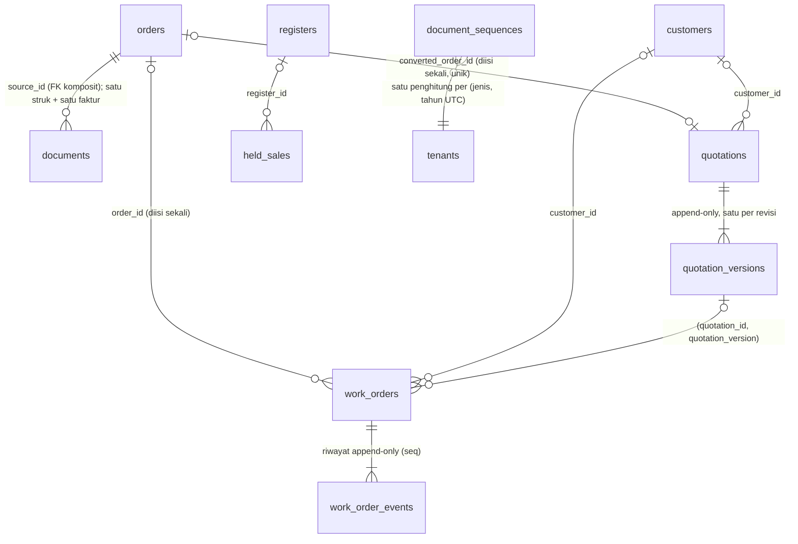
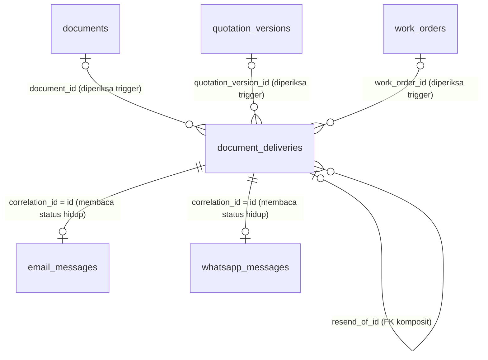

🇮🇩 Bahasa Indonesia · 🇬🇧 [English (source)](skema-basis-data.md)

<!-- i18n-source-hash: sha256:f0a1382b801b24ad2ac1779610843a24a318792323cd8fe12e057731dc2f57ad -->

# Skema basis data

Setiap tabel `awcms_commerce_*`: kolom, tipe, constraint, indeks, dan row-level security yang membatasi setiap query ke satu tenant. Sumber kebenaran adalah `apps/cms/sql/901_awcms_commerce_schema.sql` sampai `apps/cms/sql/934_awcms_commerce_payment_events_amount_mismatch.sql` — tiga puluh empat migrasi, satu modul `commerce` (lihat [ADR-0008](adr/0008-one-commerce-module-carries-the-whole-store-not-three.id.md)) — plus [`apps/cms/src/modules/commerce/README.md`](../apps/cms/src/modules/commerce/README.id.md); dokumen ini menjelaskannya, tidak menggantikan membacanya.

## Katalog: `awcms_commerce_categories`, `awcms_commerce_products`, `_product_images`, `_product_variants`

### `awcms_commerce_categories` (`sql/901`, `+restored_at` di `sql/904`)

Hierarkis, self-referencing.

| Kolom                     | Tipe                                 | Catatan                                                                                                                             |
| ------------------------- | ------------------------------------ | ----------------------------------------------------------------------------------------------------------------------------------- |
| `id`                      | `uuid`                               | PK, `DEFAULT gen_random_uuid()`                                                                                                     |
| `tenant_id`               | `uuid NOT NULL`                      | `REFERENCES awcms_tenants (id)`                                                                                                     |
| `parent_id`               | `uuid`                               | `REFERENCES awcms_commerce_categories (id)`, nullable; diset hanya saat pembuatan — lihat [`docs/cms.md`](cms.id.md)                |
| `name`                    | `text NOT NULL`                      |                                                                                                                                     |
| `slug`                    | `text NOT NULL`                      | Unik per tenant di antara baris hidup                                                                                               |
| `icon`                    | `text`                               | Nullable                                                                                                                            |
| `created_at`/`updated_at` | `timestamptz NOT NULL DEFAULT now()` |                                                                                                                                     |
| `deleted_at`              | `timestamptz`                        | Nullable — soft delete                                                                                                              |
| `restored_at`             | `timestamptz`                        | Nullable, ditambahkan di `sql/904` — fakta "kapan" yang dibutuhkan `restore`, mengikuti preseden yang sudah dipakai `awcms_offices` |

**Indeks:** unik `(tenant_id, slug) WHERE deleted_at IS NULL`; `(tenant_id)`; `(tenant_id, deleted_at)`; `(parent_id)`; `(tenant_id, parent_id) WHERE deleted_at IS NULL` (`sql/907`).

### `awcms_commerce_products` (inti `sql/901` + kolom paritas BjekMart `sql/904`)

| Kolom                                             | Tipe                                 | Catatan                                                                                                                                                                                                                               |
| ------------------------------------------------- | ------------------------------------ | ------------------------------------------------------------------------------------------------------------------------------------------------------------------------------------------------------------------------------------- |
| `id`                                              | `uuid`                               | PK                                                                                                                                                                                                                                    |
| `tenant_id`                                       | `uuid NOT NULL`                      | FK `awcms_tenants`                                                                                                                                                                                                                    |
| `category_id`                                     | `uuid`                               | FK `awcms_commerce_categories`, nullable                                                                                                                                                                                              |
| `type`                                            | `text NOT NULL DEFAULT 'physical'`   | `CHECK IN ('physical','digital','service','subscription')`                                                                                                                                                                            |
| `sku`                                             | `text NOT NULL`                      | Unik per tenant di antara baris hidup                                                                                                                                                                                                 |
| `name`, `slug`                                    | `text NOT NULL`                      | `slug` unik per tenant di antara baris hidup                                                                                                                                                                                          |
| `description`, `digital_note`                     | `text`                               | Nullable                                                                                                                                                                                                                              |
| `price`                                           | `numeric(14,2) NOT NULL`             | `CHECK (price >= 0)` — lihat [ADR-0003](adr/0003-money-is-numeric-14-2-and-crosses-the-wire-as-a-string.id.md)                                                                                                                        |
| `price_level_2`, `price_level_3`, `price_level_4` | `numeric(14,2)`                      | Nullable — harga bertingkat berdasarkan level pelanggan (`sql/904`)                                                                                                                                                                   |
| `cost_price`                                      | `numeric(14,2)`                      | Nullable, khusus admin — tidak pernah ada di model baca publik                                                                                                                                                                        |
| `discount_percent`                                | `integer NOT NULL DEFAULT 0`         | `CHECK BETWEEN 0 AND 100`                                                                                                                                                                                                             |
| `stock`                                           | `integer NOT NULL DEFAULT 0`         | `CHECK (stock >= 0)`; pada mode inventori `ledger` ia adalah **cache write-through** saldo ledger, `max(0, floor(on-hand))` ([ADR-0038](adr/0038-commerce-stock-is-a-write-through-cache-of-the-inventory-ledger.md)) |
| `status`                                          | `text NOT NULL DEFAULT 'draft'`      | `CHECK IN ('draft','active','inactive','archived')` — lihat [`docs/cms.md`](cms.id.md)                                                                                                                                                |
| `label`, `label_color`                            | `text`                               | Nullable, lencana merchandising                                                                                                                                                                                                       |
| `min_purchase`                                    | `integer NOT NULL DEFAULT 1`         | `CHECK (>= 1)`                                                                                                                                                                                                                        |
| `weight_grams`                                    | `integer NOT NULL DEFAULT 0`         | `CHECK (>= 0)`                                                                                                                                                                                                                        |
| `manual_rating`                                   | `numeric(2,1)`                       | `CHECK BETWEEN 0 AND 5`, nullable                                                                                                                                                                                                     |
| `manual_sold_count`                               | `integer NOT NULL DEFAULT 0`         | `CHECK (>= 0)`                                                                                                                                                                                                                        |
| `with_insurance`, `insurance_required`            | `boolean NOT NULL DEFAULT false`     |                                                                                                                                                                                                                                       |
| `insurance_fee`                                   | `numeric(14,2)`                      | Nullable                                                                                                                                                                                                                              |
| `promo_banner_show`                               | `boolean NOT NULL DEFAULT false`     |                                                                                                                                                                                                                                       |
| `promo_banner_{title,subtitle,badge,icon,color}`  | `text`                               | Nullable                                                                                                                                                                                                                              |
| `size_chart_type`                                 | `text NOT NULL DEFAULT 'none'`       | `CHECK IN ('none','image','table')`, plus CHECK lintas-kolom yang menyelaraskannya dengan dua kolom berikutnya                                                                                                                        |
| `size_chart_media_id`                             | `uuid`                               | `REFERENCES awcms_news_media_objects` — nama tabel asli registry media, dipertahankan melewati penggabungan `news_portal`→`blog_content`; hanya divalidasi berbentuk UUID, tidak dicek secara live (lihat [`docs/cms.md`](cms.id.md)) |
| `size_chart_details`                              | `jsonb`                              | Nullable                                                                                                                                                                                                                              |
| `service_form`                                    | `jsonb`                              | Nullable — daftar field formulir intake produk jasa                                                                                                                                                                                   |
| `subscription_period`                             | `text`                               | `CHECK IN ('day','week','month','year')`, nullable                                                                                                                                                                                    |
| `download_link`                                   | `text`                               | Nullable — aset berbayar produk digital; sengaja dikecualikan dari setiap model baca publik (lihat [`docs/cms.md`](cms.id.md))                                                                                                        |
| `allow_dp`                                        | `boolean NOT NULL DEFAULT false`     |                                                                                                                                                                                                                                       |
| `allow_free_shipping`                             | `boolean NOT NULL DEFAULT true`      |                                                                                                                                                                                                                                       |
| `variant_attributes`                              | `jsonb`                              | Nullable                                                                                                                                                                                                                              |
| `is_featured`, `is_recommended`                   | `boolean NOT NULL DEFAULT false`     |                                                                                                                                                                                                                                       |
| `created_at`/`updated_at`                         | `timestamptz NOT NULL DEFAULT now()` |                                                                                                                                                                                                                                       |
| `deleted_at`, `restored_at`                       | `timestamptz`                        | Nullable                                                                                                                                                                                                                              |

**Indeks:** unik `(tenant_id, slug)`/`(tenant_id, sku)` keduanya `WHERE deleted_at IS NULL`; `(tenant_id)`; `(tenant_id, deleted_at)`; `(category_id)`; `(size_chart_media_id)`; indeks GIN trigram pada `name`/`sku` (`pg_trgm`, `sql/907`, mendukung filter substring `q` milik daftar owner); parsial `(tenant_id) WHERE deleted_at IS NULL AND is_featured/is_recommended = true`; `(tenant_id, price)`/`(tenant_id, name)` keduanya `WHERE deleted_at IS NULL`; `(tenant_id, status) WHERE deleted_at IS NULL`.

### `awcms_commerce_product_images` / `awcms_commerce_product_variants` (`sql/905`)

| Tabel               | Kolom kunci                                                                                                                                                                                                                                                                                                                                                                         |
| ------------------- | ----------------------------------------------------------------------------------------------------------------------------------------------------------------------------------------------------------------------------------------------------------------------------------------------------------------------------------------------------------------------------------- |
| `_product_images`   | `product_id` (FK products), `media_object_id NOT NULL` (FK `awcms_news_media_objects`, dicek secara live lewat `MediaLibraryPort.isMediaReferenceSafe` sebelum insert), `sort_order`, `alt_text`                                                                                                                                                                                    |
| `_product_variants` | `product_id` (FK products), `name NOT NULL`, `value NOT NULL`, `color_hex`, `image_media_object_id` (FK, validasi hanya-berbentuk-UUID), `sku` (unik per tenant di antara baris hidup, **dicek terhadap tabel ini maupun `awcms_commerce_products` itu sendiri** — indeks satu-tabel tidak bisa menyatakan itu), `price`/`price_level_2/3/4`, `stock`, `weight_grams`, `sort_order` |

Keduanya: `id`/`tenant_id`/`created_at`/`updated_at`/`deleted_at` seperti biasa; RLS `ENABLE`+`FORCE`, kebijakan isolasi-tenant; indeks FK pada setiap kolom referensi.

## Marketing: lima keluarga, plus pengaturan toko (`sql/909`–`sql/910`)

| Tabel                                | Kolom kunci                                                                                                                                                                                                                                                                                                                                                                   |
| ------------------------------------ | ----------------------------------------------------------------------------------------------------------------------------------------------------------------------------------------------------------------------------------------------------------------------------------------------------------------------------------------------------------------------------- |
| `awcms_commerce_flash_sales`         | `name`, `slug` (unik per tenant, baris hidup), `starts_at`/`ends_at NOT NULL` (`CHECK ends_at > starts_at`), `status` (`CHECK IN ('draft','scheduled','active','ended')` — `active`/`ended` diturunkan oleh job, tidak pernah diset owner secara langsung)                                                                                                                    |
| `awcms_commerce_flash_sale_products` | `flash_sale_id`, `product_id`, `variant_id` (nullable), `sale_price NOT NULL` (`CHECK >= 0`), `quota`/`sold integer NOT NULL DEFAULT 0`; unik `(flash_sale_id, product_id, variant_id) NULLS NOT DISTINCT WHERE deleted_at IS NULL`                                                                                                                                           |
| `awcms_commerce_vouchers`            | `code` (unik per tenant, baris hidup), `type` (`CHECK IN ('percentage','nominal','free_shipping')`), `value NOT NULL` (`CHECK >= 0`), `min_order`, `max_discount`, `quota`/`used_count`, `is_public`, `status` (`CHECK IN ('active','inactive')`), `starts_at`/`ends_at NOT NULL`                                                                                             |
| `awcms_commerce_sliders`             | `title NOT NULL`, `subtitle`, `media_object_id NOT NULL` (FK), `link_url`, `button_text`, `sort_order`, `is_active`, `starts_at`/`ends_at` (nullable, berjendela)                                                                                                                                                                                                             |
| `awcms_commerce_testimonials`        | `author_name NOT NULL`, `author_role`, `body NOT NULL`, `rating integer NOT NULL DEFAULT 5` (`CHECK BETWEEN 1 AND 5`), `avatar_media_object_id` (FK, nullable), `is_active`, `sort_order`                                                                                                                                                                                     |
| `awcms_commerce_popups`              | `title NOT NULL`, `body`, `media_object_id` (FK, nullable), `link_url`, `button_text`, `frequency` (`CHECK IN ('once_per_session','once_per_day','always')`), `is_active`, `starts_at`/`ends_at`; **indeks parsial unik `(tenant_id) WHERE deleted_at IS NULL AND is_active = true`** — paling banyak satu popup aktif per tenant, ditegakkan oleh skema, bukan kode aplikasi |
| `awcms_commerce_store_settings`      | `tenant_id uuid PRIMARY KEY` (satu baris per tenant — singleton, bukan daftar), `settings jsonb NOT NULL DEFAULT '{}'` (`CHECK jsonb_typeof(settings) = 'object'`), `deleted_at` (di sini berarti "reset ke default", bukan penghapusan tenant — lihat [`docs/api.md`](api.id.md)); ditambah, sejak Issue #282 ([ADR-0038](adr/0038-commerce-stock-is-a-write-through-cache-of-the-inventory-ledger.md), `sql/947`), otoritas stok di **kolom di luar blob**: `inventory_mode text NOT NULL DEFAULT 'counter'` (`CHECK IN ('counter','ledger')`), `inventory_location_id uuid` dengan **FK komposit** `(tenant_id, inventory_location_id)` → `awcms_inventory_locations (tenant_id, id)` (`CHECK inventory_mode = 'counter' OR inventory_location_id IS NOT NULL`), `inventory_mode_changed_at`; baris tidak pernah diberi cap `deleted_at` pada mode `ledger`, sehingga purge retensi tidak dapat mereset mode |

Keenamnya: `id`/`created_at`/`updated_at`/`deleted_at` standar, RLS `ENABLE`+`FORCE`, kebijakan isolasi-tenant, indeks FK.

## Orders: delapan tabel (`sql/913`)

| Tabel                                  | Kolom kunci                                                                                                                                                                                                                                                                                                                                                                                                                                                                                                                                                                                                                                                                                                                                                                                                                                                                                                                                                                                                                                                                                                                                                                                                                                           | Catatan                                                                                                                                                                                                                                                                                                                                                                                                                                                                                                                                                                                                                |
| -------------------------------------- | ----------------------------------------------------------------------------------------------------------------------------------------------------------------------------------------------------------------------------------------------------------------------------------------------------------------------------------------------------------------------------------------------------------------------------------------------------------------------------------------------------------------------------------------------------------------------------------------------------------------------------------------------------------------------------------------------------------------------------------------------------------------------------------------------------------------------------------------------------------------------------------------------------------------------------------------------------------------------------------------------------------------------------------------------------------------------------------------------------------------------------------------------------------------------------------------------------------------------------------------------------- | ---------------------------------------------------------------------------------------------------------------------------------------------------------------------------------------------------------------------------------------------------------------------------------------------------------------------------------------------------------------------------------------------------------------------------------------------------------------------------------------------------------------------------------------------------------------------------------------------------------------------- |
| `awcms_commerce_customers`             | `name NOT NULL`, `phone NOT NULL` (unik per tenant, baris hidup), `email`, `level integer NOT NULL DEFAULT 1` (`CHECK BETWEEN 1 AND 4`), `status` (`CHECK IN ('active','blocked')`)                                                                                                                                                                                                                                                                                                                                                                                                                                                                                                                                                                                                                                                                                                                                                                                                                                                                                                                                                                                                                                                                   | Tanpa `password_hash`/`identity_id` di tabel ini sendiri — pelanggan tetap terjangkau lewat kode order + telepon sebagai tamu ([ADR-0009](adr/0009-guest-checkout-by-order-code-and-phone.id.md)); identitas akun/OTP/sesi yang dibangun di atasnya hidup di `awcms_commerce_customer_accounts`/`_customer_otps`/`_customer_sessions` di bawah (ADR-0016)                                                                                                                                                                                                                                                              |
| `awcms_commerce_customer_addresses`    | `customer_id` (FK), `label`, `recipient_name NOT NULL`, `phone NOT NULL`, `province_code`/`name`, `city_code`/`name`, `district_code`/`name` (semuanya `text NOT NULL` **snapshot**, bukan FK live ke `idn_admin_regions`), `postal_code`, `street NOT NULL`, `latitude numeric(9,6)`, `longitude numeric(9,6)`, `is_default`                                                                                                                                                                                                                                                                                                                                                                                                                                                                                                                                                                                                                                                                                                                                                                                                                                                                                                                         | Di-snapshot sehingga perubahan data-induk wilayah di kemudian hari tidak pernah menulis ulang alamat terkirim milik pelanggan sendiri. Persis satu `is_default` per `(tenant_id, customer_id)` di antara baris hidup ditegakkan oleh indeks unik parsial `sql/920` (`WHERE is_default AND deleted_at IS NULL`), ditambahkan untuk rute alamat akun Issue #91 — duplikat default mana pun yang mungkin ditinggalkan era checkout tamu diturunkan menjadi penyintas yang paling baru dibuat oleh migrasi yang sama, sebelum indeks dibuat                                                                                |
| `awcms_commerce_orders`                | `order_code NOT NULL` (unik per tenant — **selamanya**, tidak dibatasi ke baris hidup, karena order tidak pernah benar-benar dihapus), `customer_id` (FK), `status` (CHECK 7-nilai, lihat [`docs/cms.md`](cms.id.md)), `payment_method` (`CHECK IN ('manual_bank','manual_qris','dp','gateway','cash')` — `gateway` sejak [ADR-0010](adr/0010-manual-payment-and-alternative-courier-first-gateways-via-outbox.id.md)/issue #110, `cash` ditambahkan `sql/931` hanya untuk penjualan kasir POS, issue #116), `payment_status` (`CHECK IN ('unpaid','partially_paid','dp_paid','paid','refunded')` — `partially_paid` ditambahkan `sql/940`; CACHE dari turunan ledger alokasi pembayaran, issue #285), `shipping_method` (`CHECK IN ('alternative','self_pickup','courier')`), `shipping_service_name`, `shipping_cost`, `address jsonb` (snapshot, nullable untuk self-pickup), `subtotal`/`discount`/`voucher_code`/`voucher_discount`/`insurance_fee`/`tax`/`total`/`dp_amount`, `notes`, `paid_at`/`shipped_at`/`completed_at`/`cancelled_at`/`expires_at`, **`channel text NOT NULL DEFAULT 'storefront'` (`CHECK IN ('storefront','pos')`, `sql/931`)**, **`pos_cashier_tenant_user_id uuid`** (`sql/931`; NULL pada setiap pesanan storefront) | Indeks mencakup bentuk-scan milik job expiry sendiri, `(tenant_id, status, expires_at) WHERE status = 'pending_payment'`, milik daftar admin `(tenant_id, status, created_at DESC)`, milik riwayat POS `(tenant_id, channel, created_at DESC)` dan indeks parsial filter kasir `(tenant_id, pos_cashier_tenant_user_id, created_at DESC) WHERE pos_cashier_tenant_user_id IS NOT NULL` (keduanya `sql/931`). CHECK `payment_method` adalah constraint `text` biasa, di-drop dan dibuat ulang berdasarkan nama untuk memperlebarnya — alasan setiap kolom enumerasi commerce adalah `text + CHECK`, bukan `ENUM` native |
| `awcms_commerce_order_items`           | `order_id`, `product_id`, `variant_id` (nullable), `flash_sale_id` (FK nullable — diset saat baris dibeli dengan harga flash-sale), `name`/`variant_name`/`sku` (snapshot), `unit_price NOT NULL`, `quantity integer NOT NULL CHECK (> 0)`, `weight_grams`, `service_form_values jsonb`, `line_total NOT NULL`                                                                                                                                                                                                                                                                                                                                                                                                                                                                                                                                                                                                                                                                                                                                                                                                                                                                                                                                        |                                                                                                                                                                                                                                                                                                                                                                                                                                                                                                                                                                                                                        |
| `awcms_commerce_order_events`          | `order_id`, `from_status` (nullable — null pada baris pembuatan), `to_status NOT NULL`, `actor` (`CHECK IN ('customer','admin','system')`), `note`, `created_at`                                                                                                                                                                                                                                                                                                                                                                                                                                                                                                                                                                                                                                                                                                                                                                                                                                                                                                                                                                                                                                                                                      | **Append-only — sama sekali tanpa `deleted_at`**, satu-satunya pengecualian dari bentuk soft-delete setiap tabel lain; sumber asli timeline order-tracking                                                                                                                                                                                                                                                                                                                                                                                                                                                             |
| `awcms_commerce_payment_confirmations` | `order_id`, `method` (`CHECK IN ('manual_bank','manual_qris')`), `amount NOT NULL`, `bank_name`, `account_name`, `transferred_at`, `proof_media_object_id` (**tanpa constraint FK, tanpa indeks** — kolom stub, sejalan dengan jalur upload yang selalu-`503`, lihat [`docs/cms.md`](cms.id.md)), `status` (`CHECK IN ('submitted','accepted','rejected')`), `reviewed_by` (**tanpa constraint FK**), `reviewed_at`                                                                                                                                                                                                                                                                                                                                                                                                                                                                                                                                                                                                                                                                                                                                                                                                                                   |                                                                                                                                                                                                                                                                                                                                                                                                                                                                                                                                                                                                                        |
| `awcms_commerce_reviews`               | `product_id`, `customer_id`, `order_id` (semuanya FK `NOT NULL`), `rating integer NOT NULL CHECK BETWEEN 1 AND 5`, `body NOT NULL`, `status` (`CHECK IN ('pending','published','rejected')`)                                                                                                                                                                                                                                                                                                                                                                                                                                                                                                                                                                                                                                                                                                                                                                                                                                                                                                                                                                                                                                                          | Unik `(customer_id, product_id, order_id) WHERE deleted_at IS NULL` — satu review per pelanggan, per produk, per order                                                                                                                                                                                                                                                                                                                                                                                                                                                                                                 |
| `awcms_commerce_wishlists`             | `customer_id`, `product_id` (keduanya FK `NOT NULL`)                                                                                                                                                                                                                                                                                                                                                                                                                                                                                                                                                                                                                                                                                                                                                                                                                                                                                                                                                                                                                                                                                                                                                                                                  | Unik `(customer_id, product_id) WHERE deleted_at IS NULL`; dikirim mendahului sistem akun yang dibutuhkannya, kini terjangkau lewat `GET`/`PUT /api/v1/commerce/storefront/account/wishlist` dan `DELETE .../wishlist/{productId}` (Issue #91)                                                                                                                                                                                                                                                                                                                                                                         |
| Tabel                                  | Kolom kunci                                                                                                                                                                                                                                                                                                                                                                                                                                                                                                                                                                                                                                                                                                                                                                                                                                                                                                                                                                                                                                                                                                                                                                                                                                           | Catatan                                                                                                                                                                                                                                                                                                                                                                                                                                                                                                                                                                                                                |
| -------------------------------------- | ---------------------------------------------------------------------------------------------------------------------------------------------------------------------------------------------------------------------------------------------------------------------------------------------------------------------------------------------------------------------------------------------------------------------------------------------------------------------------------------------------------------------------------------------------------------------------------------------------------------------------------------------------------------------------------------------------------------------------------------------------------------------------------------------------------------------------------------------------------------------------------------------------------------------------------------------------------------------------------------------------------------------------------------------------------------------------------------------------------------------------------                                                                                                                     | ---------------------------------------------------------------------------------------------------------------------------------------------------------------------------------------------------------------------------------------------------------------------------------------------------------------------------------------------------------------------------------------------------------------------------------------------------------------------------------------------------------------------------------------------------------------------------------------------------------------------- |
| `awcms_commerce_customers`             | `name NOT NULL`, `phone NOT NULL` (unik per tenant, baris hidup), `email`, `level integer NOT NULL DEFAULT 1` (`CHECK BETWEEN 1 AND 4`), `status` (`CHECK IN ('active','blocked')`)                                                                                                                                                                                                                                                                                                                                                                                                                                                                                                                                                                                                                                                                                                                                                                                                                                                                                                                                                                                                                                                                   | Tanpa `password_hash`/`identity_id` di tabel ini sendiri — pelanggan tetap terjangkau lewat kode order + telepon sebagai tamu ([ADR-0009](adr/0009-guest-checkout-by-order-code-and-phone.id.md)); identitas akun/OTP/sesi yang dibangun di atasnya hidup di `awcms_commerce_customer_accounts`/`_customer_otps`/`_customer_sessions` di bawah (ADR-0016)                                                                                                                                                                                                                                                              |
| `awcms_commerce_customer_addresses`    | `customer_id` (FK), `label`, `recipient_name NOT NULL`, `phone NOT NULL`, `province_code`/`name`, `city_code`/`name`, `district_code`/`name` (semuanya `text NOT NULL` **snapshot**, bukan FK live ke `idn_admin_regions`), `postal_code`, `street NOT NULL`, `latitude numeric(9,6)`, `longitude numeric(9,6)`, `is_default`                                                                                                                                                                                                                                                                                                                                                                                                                                                                                                                                                                                                                                                                                                                                                                                                                                                                                                                         | Di-snapshot sehingga perubahan data-induk wilayah di kemudian hari tidak pernah menulis ulang alamat terkirim milik pelanggan sendiri. Persis satu `is_default` per `(tenant_id, customer_id)` di antara baris hidup ditegakkan oleh indeks unik parsial `sql/920` (`WHERE is_default AND deleted_at IS NULL`), ditambahkan untuk rute alamat akun Issue #91 — duplikat default mana pun yang mungkin ditinggalkan era checkout tamu diturunkan menjadi penyintas yang paling baru dibuat oleh migrasi yang sama, sebelum indeks dibuat                                                                                |
| `awcms_commerce_orders`                | `order_code NOT NULL` (unik per tenant — **selamanya**, tidak dibatasi ke baris hidup, karena order tidak pernah benar-benar dihapus), `customer_id` (FK), `status` (CHECK 7-nilai, lihat [`docs/cms.md`](cms.id.md)), `payment_method` (`CHECK IN ('manual_bank','manual_qris','dp','gateway','cash')` — `gateway` sejak [ADR-0010](adr/0010-manual-payment-and-alternative-courier-first-gateways-via-outbox.id.md)/issue #110, `cash` ditambahkan `sql/931` hanya untuk penjualan kasir POS, issue #116), `payment_status` (`CHECK IN ('unpaid','dp_paid','paid','refunded')`), `shipping_method` (`CHECK IN ('alternative','self_pickup','courier')`), `shipping_service_name`, `shipping_cost`, `address jsonb` (snapshot, nullable untuk self-pickup), `subtotal`/`discount`/`voucher_code`/`voucher_discount`/`insurance_fee`/`tax`/`total`/`dp_amount`, `notes`, `paid_at`/`shipped_at`/`completed_at`/`cancelled_at`/`expires_at`, **`channel text NOT NULL DEFAULT 'storefront'` (`CHECK IN ('storefront','pos')`, `sql/931`)**, **`pos_cashier_tenant_user_id uuid`** (`sql/931`; NULL pada setiap pesanan storefront)                                                                                                                     | Indeks mencakup bentuk-scan milik job expiry sendiri, `(tenant_id, status, expires_at) WHERE status = 'pending_payment'`, milik daftar admin `(tenant_id, status, created_at DESC)`, milik riwayat POS `(tenant_id, channel, created_at DESC)` dan indeks parsial filter kasir `(tenant_id, pos_cashier_tenant_user_id, created_at DESC) WHERE pos_cashier_tenant_user_id IS NOT NULL` (keduanya `sql/931`). CHECK `payment_method` adalah constraint `text` biasa, di-drop dan dibuat ulang berdasarkan nama untuk memperlebarnya — alasan setiap kolom enumerasi commerce adalah `text + CHECK`, bukan `ENUM` native |
| `awcms_commerce_order_items`           | `order_id`, `product_id`, `variant_id` (nullable), `flash_sale_id` (FK nullable — diset saat baris dibeli dengan harga flash-sale), `name`/`variant_name`/`sku` (snapshot), `unit_price NOT NULL`, `quantity integer NOT NULL CHECK (> 0)`, `weight_grams`, `service_form_values jsonb`, `line_total NOT NULL`                                                                                                                                                                                                                                                                                                                                                                                                                                                                                                                                                                                                                                                                                                                                                                                                                                                                                                                                        |                                                                                                                                                                                                                                                                                                                                                                                                                                                                                                                                                                                                                        |
| `awcms_commerce_order_events`          | `order_id`, `from_status` (nullable — null pada baris pembuatan), `to_status NOT NULL`, `actor` (`CHECK IN ('customer','admin','system')`), `note`, `created_at`                                                                                                                                                                                                                                                                                                                                                                                                                                                                                                                                                                                                                                                                                                                                                                                                                                                                                                                                                                                                                                                                                      | **Append-only — sama sekali tanpa `deleted_at`**, satu-satunya pengecualian dari bentuk soft-delete setiap tabel lain; sumber asli timeline order-tracking                                                                                                                                                                                                                                                                                                                                                                                                                                                             |
| `awcms_commerce_payment_confirmations` | `order_id`, `method` (`CHECK IN ('manual_bank','manual_qris')`), `amount NOT NULL`, `bank_name`, `account_name`, `transferred_at`, `proof_media_object_id` (**tanpa constraint FK, tanpa indeks** — kolom stub, sejalan dengan jalur upload yang selalu-`503`, lihat [`docs/cms.md`](cms.id.md)), `status` (`CHECK IN ('submitted','accepted','rejected')`), `reviewed_by` (**tanpa constraint FK**), `reviewed_at`                                                                                                                                                                                                                                                                                                                                                                                                                                                                                                                                                                                                                                                                                                                                                                                                                                   |                                                                                                                                                                                                                                                                                                                                                                                                                                                                                                                                                                                                                        |
| `awcms_commerce_reviews`               | `product_id`, `customer_id`, `order_id` (semuanya FK `NOT NULL`), `rating integer NOT NULL CHECK BETWEEN 1 AND 5`, `body NOT NULL`, `status` (`CHECK IN ('pending','published','rejected')`)                                                                                                                                                                                                                                                                                                                                                                                                                                                                                                                                                                                                                                                                                                                                                                                                                                                                                                                                                                                                                                                          | Unik `(customer_id, product_id, order_id) WHERE deleted_at IS NULL` — satu review per pelanggan, per produk, per order                                                                                                                                                                                                                                                                                                                                                                                                                                                                                                 |
| `awcms_commerce_wishlists`             | `customer_id`, `product_id` (keduanya FK `NOT NULL`)                                                                                                                                                                                                                                                                                                                                                                                                                                                                                                                                                                                                                                                                                                                                                                                                                                                                                                                                                                                                                                                                                                                                                                                                  | Unik `(customer_id, product_id) WHERE deleted_at IS NULL`; dikirim mendahului sistem akun yang dibutuhkannya, kini terjangkau lewat `GET`/`PUT /api/v1/commerce/storefront/account/wishlist` dan `DELETE .../wishlist/{productId}` (Issue #91)                                                                                                                                                                                                                                                                                                                                                                         |

Kedelapannya: RLS `ENABLE`+`FORCE`, kebijakan isolasi-tenant. `deleted_at` ada pada tujuh dari delapan (setiap tabel kecuali `order_events`) murni sebagai kursor purge data-lifecycle yang seragam — order, item order, pelanggan, dan konfirmasi pembayaran tidak pernah benar-benar di-soft-delete oleh kode modul ini sendiri.

## Akun pelanggan, OTP, sesi: tiga tabel (`sql/917`-`918`)

Issue #87 (C1, kontrak #86/[ADR-0016](adr/0016-customer-accounts-are-otp-verified-commerce-accounts-with-bearer-sessions.id.md)). Tanpa kata sandi sama sekali — autentikasi adalah OTP e-mail 6 digit; sesi adalah token bearer opak, hanya hash `sha256:`-nya yang disimpan.

| Tabel                              | Kolom kunci                                                                                                                                                                                                                                                                       | Catatan                                                                                                                                                                                                                                                                                                                                                                                                                                                                                                                                                                 |
| ---------------------------------- | --------------------------------------------------------------------------------------------------------------------------------------------------------------------------------------------------------------------------------------------------------------------------------- | ----------------------------------------------------------------------------------------------------------------------------------------------------------------------------------------------------------------------------------------------------------------------------------------------------------------------------------------------------------------------------------------------------------------------------------------------------------------------------------------------------------------------------------------------------------------------- |
| `awcms_commerce_customer_accounts` | `customer_id` (FK, `UNIQUE (tenant_id, customer_id)` — 1:1 dengan `awcms_commerce_customers`), `email_normalized` (`UNIQUE (tenant_id, email_normalized)`), `status` (`CHECK IN ('active','blocked')`), `email_verified_at`, `history_from timestamptz NOT NULL`, `last_login_at` | Tanpa `password_hash`, tanpa `identity_id`/`principal_id` — ADR-0016 D1 (kontrak issue #86). Membawa kolom `deleted_at` yang tidak pernah diset oleh kode modul ini sendiri — diblokir berarti `status = 'blocked'`, tidak pernah dihapus; kolom ini ada hanya sebagai kursor yang selalu-`NULL` dan jujur untuk deskriptor `dataLifecycle` (`module.ts`), trik yang sama yang sudah dipakai `awcms_commerce_orders`. `history_from` adalah titik-awal riwayat order hasil resolusi ADR-0016 D4, dihitung sekali saat registrasi oleh fungsi murni `resolveHistoryFrom` |
| `awcms_commerce_customer_otps`     | `email_normalized NOT NULL`, `purpose` (`CHECK IN ('login','register')`), `code_hash NOT NULL` (bukan kode mentah), `registration jsonb` (name/phone tertunda untuk `register`), `attempts integer NOT NULL DEFAULT 0`, `expires_at NOT NULL`, `consumed_at`                      | TTL 10 menit, 5 percobaan, sekali pakai — ADR-0016 D2. `consumeOtp` memverifikasi + mengonsumsi dalam satu `UPDATE ... RETURNING`, tidak pernah read-then-write                                                                                                                                                                                                                                                                                                                                                                                                         |
| `awcms_commerce_customer_sessions` | `account_id` (FK), `token_hash text NOT NULL UNIQUE` (berawalan `sha256:` — namespace BARU, bukan hash sesi admin milik `apps/cms/src/lib/auth`), `issued_at`, `expires_at`, `last_seen_at`, `revoked_at`, `client_ip_hash`, `user_agent_summary`                                 | TTL sliding 30 hari (`touchSession` hanya menulis saat `last_seen_at` sudah basi 5+ menit); token bearer `cs_` + 32 byte acak base64url — ADR-0016 D3                                                                                                                                                                                                                                                                                                                                                                                                                   |

Ketiganya: RLS `ENABLE`+`FORCE`, kebijakan isolasi-tenant, indeks FK. `commerce:customer-auth:purge` (role worker, hibah `sql/918`) menghapus OTP kedaluwarsa dan sesi kedaluwarsa/dicabut-7-hari-lalu secara terjadwal; tabel akun tidak punya perilaku purge sama sekali (lihat komentar `dataLifecycle` di `module.ts`).

## Program afiliasi: dua tabel (`sql/921`)

Issue #92, keputusan D5 kontrak #86 — rancangan baru, tidak ada kolom lawas `affiliate_*` atau baris `product_affiliate_links` yang dibawa (lihat [`docs/kamus-data.md`](kamus-data.id.md)).

| Tabel                                  | Kolom kunci                                                                                                                                                                                                                                                                                                                                                                                                                                                      | Catatan                                                                                                                                                                                                                                                                                                                |
| -------------------------------------- | ---------------------------------------------------------------------------------------------------------------------------------------------------------------------------------------------------------------------------------------------------------------------------------------------------------------------------------------------------------------------------------------------------------------------------------------------------------------- | ---------------------------------------------------------------------------------------------------------------------------------------------------------------------------------------------------------------------------------------------------------------------------------------------------------------------- |
| `awcms_commerce_affiliates`            | `customer_id NOT NULL` (FK, `UNIQUE (tenant_id, customer_id) WHERE deleted_at IS NULL` — 1:1 dengan `awcms_commerce_customers`), `code NOT NULL` (`UNIQUE (tenant_id, code) WHERE deleted_at IS NULL`, alfabet 8 karakter tanpa ambiguitas — `domain/affiliate-code.ts`), `commission_rate numeric(5,2) NOT NULL` (`CHECK BETWEEN 0 AND 100`), `status` (`CHECK IN ('active','suspended')`, default `active`)                                                    | `commission_rate` adalah SNAPSHOT yang disalin dari `store_settings.affiliate_commission_rate` saat pendaftaran — perubahan tarif toko-lebar berikutnya tidak pernah menetapkan ulang harga afiliasi yang sudah terdaftar; hanya `PATCH /api/v1/commerce/affiliates/{id}` yang mengubah tarif satu afiliasi setelahnya |
| `awcms_commerce_affiliate_commissions` | `affiliate_id NOT NULL` (FK), `order_id NOT NULL` (FK, `UNIQUE` — **tidak dibatasi ke baris hidup**, satu komisi per pesanan selamanya, bentuk "unik untuk seumur hidup target FK" yang sama dengan `awcms_commerce_orders.order_code`), `base_amount numeric(14,2) NOT NULL`, `rate numeric(5,2) NOT NULL`, `amount numeric(14,2) NOT NULL`, `status` (`CHECK IN ('pending','approved','paid','void')`, default `pending`), `approved_at`/`paid_at`/`voided_at` | `base_amount`/`rate`/`amount` semuanya SNAPSHOT yang diambil saat pesanan yang direferensikan mencapai `completed` (`domain/affiliate-commission.ts`); `base = subtotal − discount − voucher_discount` dibatasi minimum nol, `amount = round(base × rate / 100, 2)`                                                    |

Ditambah satu kolom pada masing-masing dari dua tabel yang sudah ada: `awcms_commerce_orders.affiliate_id` (FK nullable, terindeks `WHERE affiliate_id IS NOT NULL`) — diatur sekali saat pesanan dibuat oleh `resolveAffiliateForOrder` (kode tak dikenal/ditangguhkan → `NULL`, tidak pernah error validasi) dan tidak pernah diubah setelahnya; `awcms_commerce_store_settings.affiliate_commission_rate numeric(5,2)` (nullable, `CHECK BETWEEN 0 AND 100` saat diisi) — kolom nyata di luar blob jsonb `settings` (lihat entri tabel itu sendiri di atas untuk alasan jsonb menjadi pilihan default; kolom ini dibaca oleh jalur panas `resolveAffiliateForOrder`/pemeriksaan pendaftaran dan tidak pernah membutuhkan versi skema jsonb itu sendiri), `NULL` berarti program afiliasi MATI untuk tenant tersebut.

## Tarif kurir: dua tabel cache (`sql/924`)

Issue #107, D4 kontrak #106 — cache kode-kecamatan→id-tujuan-provider dan cache tarif per (asal, tujuan, bucket berat, kurir, layanan), keduanya murni cache aditif tanpa `deleted_at` (baris basi dihapus langsung, tidak pernah dihapus lunak — tidak ada apa pun untuk dipulihkan dari harga ter-cache).

| Tabel                                 | Kolom kunci                                                                                                                                                                                                                                                                                                                                                                     | Catatan                                                                                                                                                                                                                                                                                                                                                                                                                                                                                                                               |
| ------------------------------------- | ------------------------------------------------------------------------------------------------------------------------------------------------------------------------------------------------------------------------------------------------------------------------------------------------------------------------------------------------------------------------------- | ------------------------------------------------------------------------------------------------------------------------------------------------------------------------------------------------------------------------------------------------------------------------------------------------------------------------------------------------------------------------------------------------------------------------------------------------------------------------------------------------------------------------------------- |
| `awcms_commerce_courier_destinations` | `district_code NOT NULL`, `provider NOT NULL`, `destination_id NOT NULL`, `label NOT NULL`, `resolved_at NOT NULL DEFAULT now()`, `UNIQUE (tenant_id, provider, district_code)`                                                                                                                                                                                                 | Tanpa TTL — id tujuan provider milik sebuah kecamatan nyaris tidak pernah berubah. Di-resolve sekali per (tenant, provider, kecamatan) lewat pencarian nama terhadap `idn_admin_regions`, lalu di-cache selamanya (kecuali sapuan penyegaran di masa depan)                                                                                                                                                                                                                                                                           |
| `awcms_commerce_shipping_rates`       | `provider NOT NULL`, `origin_id NOT NULL`, `destination_id NOT NULL`, `weight_bucket integer NOT NULL` (`CHECK >= 1000`), `courier NOT NULL`, `service NOT NULL`, `name NOT NULL`, `cost numeric(14,2) NOT NULL`, `etd`, `fetched_at NOT NULL DEFAULT now()`, `expires_at NOT NULL`, `UNIQUE (tenant_id, provider, origin_id, destination_id, weight_bucket, courier, service)` | TTL 6 jam (`expires_at`); `weight_bucket` selalu keluaran `computeWeightBucketGrams` milik `domain/weight-bucket.ts` (dibulatkan ke atas ke kelipatan 100 g berikutnya, dilantaikan di 1000 g — berat minimum tertagih RajaOngkir sendiri), tidak pernah berat mentah keranjang, sehingga dua keranjang dalam pita 100 g yang sama berbagi satu baris. `commerce:shipping-rates:purge` (setiap jam) meng-`DELETE` setiap baris yang lewat `expires_at`, lintas tenant, di-GRANT ke `awcms_worker` seperti job purge lain di modul ini |

Kedua tabel mengikuti konvensi `sql/901` (`ENABLE`/`FORCE ROW LEVEL SECURITY`, satu kebijakan isolasi tenant, indeks FK pada `tenant_id`) tapi tidak pernah ditulis langsung oleh transaksi tulis `application/order-directory.ts` untuk tarif BARU — `getCourierRates`/`resolveDestination` milik `application/shipping-rate-directory.ts` selalu membaca cache dalam satu transaksi pendek, memanggil `ShippingRateProvider` (API v2 RajaOngkir Komerce, atau adapter fixture `log`) tanpa transaksi terbuka sama sekali, lalu menulis-balik hasilnya dalam transaksi pendek kedua (aturan "jangan pernah memanggil provider di dalam transaksi database" ADR-0006/0010, diterapkan di sini sama seperti outbox `email` sudah menerapkannya). Pembuatan pesanan memvalidasi `{courier, service, cost}` yang dipilih HANYA terhadap `awcms_commerce_shipping_rates` — `SELECT ... WHERE expires_at > now()` biasa yang aman-transaksi, tidak pernah panggilan provider langsung kedua dari dalam transaksi tulis pesanan itu sendiri.

Kedua tabel baru: RLS `ENABLE`+`FORCE`, kebijakan isolasi-tenant, indeks FK. Tak satu pun pernah di-soft-delete oleh kode modul ini sendiri dalam praktiknya — `deleted_at` ada murni sebagai kursor purge data-lifecycle yang seragam, bentuk "kursor selalu-`NULL`" yang sama dengan yang sudah dipakai `awcms_commerce_orders` dan `awcms_commerce_customer_accounts`.

## Kotak masuk komersial: dua tabel (`sql/927`)

Issue #111, D8 kontrak #106 — thread milik akun pelanggan sendiri dengan toko.

| Tabel                          | Kolom kunci                                                                                                                                                                                                                                                                                                                                                                                                                           | Catatan                                                                                                                                                                                                                                                                                                                                                                                                                                                   |
| ------------------------------ | ------------------------------------------------------------------------------------------------------------------------------------------------------------------------------------------------------------------------------------------------------------------------------------------------------------------------------------------------------------------------------------------------------------------------------------- | --------------------------------------------------------------------------------------------------------------------------------------------------------------------------------------------------------------------------------------------------------------------------------------------------------------------------------------------------------------------------------------------------------------------------------------------------------- |
| `awcms_commerce_conversations` | `account_id NOT NULL` (FK ke `awcms_commerce_customer_accounts` — thread kotak masuk mensyaratkan akun terverifikasi, tidak seperti checkout tamu), `subject NOT NULL` (`CHECK char_length BETWEEN 1 AND 150`), `status` (`CHECK IN ('open','closed')`, default `open`), `last_message_at timestamptz NOT NULL DEFAULT now()`, `unread_for_store boolean NOT NULL DEFAULT true`, `unread_for_customer boolean NOT NULL DEFAULT false` | `last_message_at`/kedua flag `unread_for_*` DIDENORMALISASI dan dijaga selaras dengan `awcms_commerce_messages` di dalam transaksi yang SAMA dengan setiap insert pesan — tidak pernah nilai turunan join saat baca. `deleted_at` ada murni sebagai kursor purge data-lifecycle yang seragam (kode modul ini sendiri tidak pernah men-set-nya), bentuk "kursor selalu-`NULL`" yang sama dengan `awcms_commerce_orders`/`awcms_commerce_customer_accounts` |
| `awcms_commerce_messages`      | `conversation_id NOT NULL` (FK), `sender NOT NULL` (`CHECK IN ('customer','store')`), `sender_tenant_user_id` (nullable; sebuah `CHECK` mewajibkannya terisi untuk `sender='store'` dan NULL untuk `sender='customer'`), `body NOT NULL` (`CHECK char_length BETWEEN 1 AND 4000`)                                                                                                                                                     | Append-only, seperti `awcms_commerce_order_events` — tanpa `deleted_at`, tanpa `updated_at`; pesan yang terkirim tidak pernah diedit atau ditarik                                                                                                                                                                                                                                                                                                         |

Kedua tabel baru: RLS `ENABLE`+`FORCE`, kebijakan isolasi-tenant, indeks FK. Deskriptor `dataLifecycle` milik `commerce.conversations` memakai kursor `deleted_at` biasa; `commerce.messages`, karena append-only, memakai `created_at` — satu pengecualian yang sudah ditetapkan `commerce.order_events` untuk bentuk persis ini.

## Kampanye pelanggan: dua tabel + satu kolom (`sql/929`)

Issue #114, D9 kontrak #106 — pengiriman massal e-mail/WhatsApp bergerbang consent.

| Tabel                                                                                  | Kolom kunci                                                                                                                                                                                                                                                                                                                                                                                                                                                                                                                 | Catatan                                                                                                                                                                                                                                                                                                                                                                                                                 |
| -------------------------------------------------------------------------------------- | --------------------------------------------------------------------------------------------------------------------------------------------------------------------------------------------------------------------------------------------------------------------------------------------------------------------------------------------------------------------------------------------------------------------------------------------------------------------------------------------------------------------------- | ----------------------------------------------------------------------------------------------------------------------------------------------------------------------------------------------------------------------------------------------------------------------------------------------------------------------------------------------------------------------------------------------------------------------- |
| `awcms_commerce_customer_accounts.marketing_consent_at` (kolom baru, bukan tabel baru) | `timestamptz`, nullable                                                                                                                                                                                                                                                                                                                                                                                                                                                                                                     | Non-null berarti akun setuju menerima komunikasi pemasaran pada saat itu; `NULL` berarti tidak pernah setuju (atau sudah dicabut). Hanya diubah oleh akun itu sendiri lewat `PATCH .../account/me {marketingConsent}` — tidak pernah oleh staf                                                                                                                                                                          |
| `awcms_commerce_campaigns`                                                             | `channel NOT NULL` (`CHECK IN ('email','whatsapp')`), `subject` (nullable — wajib untuk `email`, diabaikan untuk `whatsapp` di batas aplikasi), `body NOT NULL` (`CHECK char_length BETWEEN 1 AND 4000`), `audience jsonb NOT NULL DEFAULT '{}'` (divalidasi di batas aplikasi, bukan oleh CHECK database — bentuk filter kecil yang terus berevolusi), `status NOT NULL` (`CHECK IN ('draft','scheduled','sending','sent','cancelled')`, default `draft`), `scheduled_at`/`sent_at timestamptz`, `recipient_count integer` | `recipient_count`/`sent_at` dimulai `NULL` pada `draft` baru, terisi hanya setelah kampanye benar-benar dikirim (fase FINALIZE milik `commerce:campaigns:dispatch`)                                                                                                                                                                                                                                                     |
| `awcms_commerce_campaign_recipients`                                                   | `campaign_id NOT NULL` (FK), `customer_id NOT NULL` (FK), `address_masked NOT NULL` (alamat e-mail/telepon tersamar SAJA, tidak pernah alamat mentah), `status NOT NULL` (`CHECK IN ('queued','enqueued','skipped')`, default `queued`), `outbox_ref` (nullable), `UNIQUE (campaign_id, customer_id)`                                                                                                                                                                                                                       | Satu baris per penerima yang terselesaikan — buku besar keteresumeannya/audit yang diandalkan pengiriman parsial. Constraint `UNIQUE` plus `ON CONFLICT DO NOTHING` saat penyisipan inilah yang membuat pemulihan-dari-crash dispatcher aman diulang; `NOT EXISTS` milik `resolveCampaignAudiencePage` sendiri terhadap tabel ini yang membuat cursor lanjutannya benar tanpa kolom cursor terpisah pada baris kampanye |

Kedua tabel baru: RLS `ENABLE`+`FORCE`, kebijakan isolasi-tenant, indeks FK. Deskriptor `dataLifecycle` milik `commerce.campaigns` memakai kursor `deleted_at` yang biasa; `commerce.campaign_recipients`, karena append-only per kampanye, memakai `created_at` — bentuk yang sama dengan `commerce.messages` di atas. Seed katalog permission: `sql/930` (`commerce.campaigns.{read,update,send}`).

## Payment gateway: sesi, buku besar event, token webhook-endpoint (`sql/926`)

Issue #110, D2/D3 kontrak #106 — tabel sesi hosted-checkout, buku besar anti-replay untuk webhook provider masuk, dan token webhook-endpoint milik tenant yang di-resolve lookup bootstrap D2. Rute INTAKE webhook yang menulis `payment_events` (`POST /api/v1/commerce/webhooks/{provider}/{endpointToken}`) dan job `commerce:payments:reconcile` mendarat di issue #113; `sql/934` lalu memperlebar CHECK `outcome` untuk menambah `amount_mismatch` (lihat di bawah).

| Tabel                                     | Kolom kunci                                                                                                                                                                                                                                                                                                                                   | Catatan                                                                                                                                                                                                                                                                                                                                                                                                                                                                           |
| ----------------------------------------- | --------------------------------------------------------------------------------------------------------------------------------------------------------------------------------------------------------------------------------------------------------------------------------------------------------------------------------------------- | --------------------------------------------------------------------------------------------------------------------------------------------------------------------------------------------------------------------------------------------------------------------------------------------------------------------------------------------------------------------------------------------------------------------------------------------------------------------------------- |
| `awcms_commerce_payment_gateway_sessions` | `order_id NOT NULL` (FK), `provider NOT NULL` (`CHECK IN ('midtrans','log')`), `provider_ref NOT NULL`, `redirect_url NOT NULL`, `status NOT NULL DEFAULT 'created'` (`CHECK IN ('created','pending','paid','expired','failed','refunded')`), `expires_at NOT NULL`, `last_checked_at`, `raw_status jsonb`, `UNIQUE (provider, provider_ref)` | Satu baris per percobaan hosted-checkout. `createGatewaySession` milik `application/payment-gateway-directory.ts` adalah satu-satunya penulis: memvalidasi pesanan dan mengecek sesi yang masih hidup dalam satu transaksi pendek, memanggil provider tanpa transaksi terbuka, menyimpan dalam transaksi pendek kedua. Pembuatan ganda yang benar-benar bersamaan mengenai constraint `UNIQUE (provider, provider_ref)` (`23505`) dan mengambil-ulang baris pemenang, bukan error |
| `awcms_commerce_payment_events`           | `provider NOT NULL` (`CHECK IN ('midtrans','log')`), `event_key NOT NULL`, `provider_ref NOT NULL`, `order_id` (FK, nullable), `payload jsonb NOT NULL`, `received_at NOT NULL DEFAULT now()`, `outcome NOT NULL` (`CHECK IN ('applied','ignored','replay')`), `UNIQUE (tenant_id, provider, event_key)`                                      | Buku besar anti-replay D2 — belum ada apa pun di cakupan issue ini yang menulis ke sana; rute INTAKE webhook (#113) adalah penulis pertamanya                                                                                                                                                                                                                                                                                                                                     |
| `awcms_commerce_webhook_endpoints`        | `provider NOT NULL` (`CHECK IN ('midtrans')`), `token_hash NOT NULL` (`UNIQUE`), `label`, `created_by` (FK ke `awcms_tenant_users`, nullable), `revoked_at`                                                                                                                                                                                   | SATU baris per endpoint (tenant, provider) yang dicetak owner. Hanya hash SHA-256 dari token mentah yang pernah disimpan — `createWebhookEndpoint` milik `application/webhook-endpoint-directory.ts` mengembalikan token mentah tepat sekali dan tidak pernah menyimpannya, disiplin yang sama seperti yang sudah diterapkan `awcms_machine_credentials` pada rahasia yang struktural identik                                                                                     |

Plus dua kolom nullable pada `awcms_commerce_orders` yang sudah ada: `gateway_provider text`, `gateway_ref text` — gateway/referensi mana yang membayar pesanan ini, jika ada (ditambahkan `ADD COLUMN IF NOT EXISTS`, sehingga migration tetap aditif terhadap tabel `orders` yang sudah terisi).

Ketiga tabel baru: RLS `ENABLE`+`FORCE`, kebijakan isolasi-tenant, indeks FK (termasuk indeks komposit `(tenant_id, <kolom kursor>)` di masing-masing, mengikuti konvensi `data-lifecycle:table-coverage:check` milik repo ini sendiri). Satu objek keempat, `awcms_resolve_commerce_webhook_endpoint(token_hash)`, adalah fungsi `SECURITY DEFINER` yang meniru pola bootstrap-read `awcms_resolve_tenant_domain_lookup` milik `sql/048` persis — peran pemilik `NOLOGIN` khusus (`awcms_webhook_endpoint_bootstrap`), kebijakan `FOR SELECT` eksplisit yang dibatasi hanya untuk peran itu, bentuk balikan tetap yang tidak sensitif (`tenant_id`, `provider` — tidak pernah `token_hash`/`label`/`created_by`), dan `EXECUTE` dibatasi ke `awcms_app`. Fungsi ini me-resolve `(tenant_id, provider)` dari token opak yang di-hash sebelum konteks tenant apa pun ada, celah bootstrap yang sama yang ditutup fungsi tenant-domain untuk sebuah hostname.

## Kasir (POS): dua kolom dan satu CHECK yang diperlebar pada `awcms_commerce_orders` (`sql/931`, seed izin `sql/932`)

Issue #116, D6 kontrak #106 — tanpa tabel baru. `channel` mencatat DI MANA pesanan dibuat (`storefront` untuk setiap checkout anonim/bearer, dan untuk setiap pesanan yang sudah ada sebelum migrasi, lewat default kolom; `pos` untuk penjualan konter yang dibuat lewat `POST /api/v1/commerce/pos/orders`), terlepas dari `payment_method`, yang mencatat BAGAIMANA ia dibayar — hari ini tidak ada apa pun di codebase ini yang membuat pesanan `cash` di luar POS, tetapi keduanya adalah fakta terpisah dan query riwayat menginginkan indeks `(tenant_id, channel, created_at DESC)` biasa alih-alih ekspresi atas metode pembayaran. `pos_cashier_tenant_user_id` adalah satu tempat modul ini mencatat anggota staf MANA yang melakukan sesuatu pada baris itu sendiri (lihat "Tanpa kolom stempel-pelaku" di bawah untuk nuansanya): stempel `uuid` biasa, sengaja **bukan** foreign key ke `awcms_tenant_users` — pesanan adalah catatan fiskal yang harus hidup lebih lama daripada akun staf yang mencatatnya, dan FK akan memblokir penghapusan user itu atau memaksa `ON DELETE SET NULL` menulis ulang catatan tenant sendiri tentang siapa yang menerima uangnya. `order_events.actor` tetap hanya mencatat PERAN (`admin`) untuk penjualan POS, persis seperti setiap transisi admin lainnya; log audit (`commerce.pos.sale`) membawa id tenant user yang sama sebagai `actor_tenant_user_id`. Tanpa grant `awcms_worker` baru: grant job `sql/908`/`sql/916` bersifat per tabel dan sudah mencakup kolom-kolom ini. `sql/932` menyemai satu izin baru, `commerce.pos.create` (`INSERT ... ON CONFLICT DO NOTHING`).

Pelanggan walk-in BUKAN konstruksi skema — ia baris `awcms_commerce_customers` biasa per tenant, dicari atau dibuat oleh `createPosOrder` di bawah telepon sentinel terdokumentasi `+620000000000` (`POS_WALK_IN_CUSTOMER_SENTINEL_PHONE`, [`docs/kamus-data.md`](kamus-data.id.md)); `customers.phone` tetap `NOT NULL` dan unik per tenant, dan itulah yang membuat baris tersebut unik.

## Ledger alokasi pembayaran: `awcms_commerce_payment_allocations` (`sql/940`–`943`, issue #285, [ADR-0025](adr/0025-payments-are-an-allocation-ledger-separate-from-order-status.md))

Ledger append-only ber-RLS FORCE: satu baris per leg tender atau pembalikan kompensasi sebuah pesanan. `kind` (`payment` | `reversal`), `reverses_allocation_id` (terisi pada pembalikan, dan hanya pembalikan), `tender_type` (`CHECK IN ('cash','manual_qris','manual_bank_transfer','gateway')` — `store_credit`/`gift_card` sengaja tidak ada sampai ledger-nya ada), `amount numeric(14,2) CHECK (amount > 0)` (jumlah yang DITERAPKAN ke pesanan), `status` (`pending` | `succeeded` | `failed`; hanya leg `gateway` yang boleh pending, dan `settled_at` terisi tepat ketika ia berhenti pending), `provider`/`provider_reference` (leg gateway selalu menyebut provider-nya), `tendered_amount`/`change_amount` (hanya leg pembayaran tunai, dengan `tendered = amount + change` ditegakkan CHECK), `note`, `source` (`pos`, `admin`, `storefront_manual`, `gateway_checkout`, `gateway_webhook`, `gateway_reconcile`, `backfill`), `source_key` (`UNIQUE (tenant_id, source_key)` — kunci idempotensi tingkat baris: `gateway:{provider}:{ref}`, `confirmation:{id}`, `api:{key}`, `reversal:{key}`, `pos:{key}:{n}`, `backfill:{order id}`), `actor_kind`/`actor_tenant_user_id` (stempel uuid biasa, bukan FK — catatan fiskal hidup lebih lama dari akun staf), `created_at`, `settled_at`, `entry_seq` (`bigint GENERATED ALWAYS AS IDENTITY` — urutan penyisipan, pemecah seri setelah `created_at` agar leg-leg satu penjualan, yang ditulis dalam satu transaksi dengan `created_at` yang sama, selalu terdaftar sesuai urutan dimasukkan).

- **Penyelesaian diturunkan, tidak pernah disimpan:** `settled = Σ pembayaran berhasil − Σ pembalikan berhasil`; `outstanding = max(0, total − settled)`. `awcms_commerce_orders.payment_status` ditulis ulang sebagai cache dalam transaksi yang sama dengan setiap penulisan ledger.
- **Append-only, secara mekanis:** `awcms_app` dicabut `DELETE`-nya (`sql/019` memberi keempat verb secara default; `security-readiness.ts` menegaskan himpunan persisnya di kedua arah) dan trigger `BEFORE UPDATE` membekukan setiap kolom kecuali `pending → succeeded|failed` (+ `settled_at`). `awcms_worker` mempertahankan `SELECT, DELETE` (`sql/942`) hanya untuk mesin data-lifecycle (`commerce.payment_allocations`, `cursorColumn: created_at`, batas bawah lima tahun, batas atas sepuluh tahun).
- **Referensi aman-tenant:** FK komposit `(tenant_id, order_id) → awcms_commerce_orders (tenant_id, id)` dan `(tenant_id, reverses_allocation_id) → (tenant_id, id)`, ditopang indeks `UNIQUE (tenant_id, id)` (yang pada `awcms_commerce_orders` ditambahkan `sql/940`), plus kebijakan isolasi tenant dengan `WITH CHECK`.
- **Indeks:** `(tenant_id, order_id, created_at)` (ledger sebuah pesanan), `(tenant_id, created_at)` (pindaian tender-mix dan kursor purge), source key unik, `(order_id)`, `(tenant_id, reverses_allocation_id)` parsial, dan pada `awcms_commerce_orders` indeks parsial `(tenant_id, created_at DESC) WHERE payment_status IN ('unpaid','partially_paid','dp_paid') AND status NOT IN ('cancelled','expired') AND deleted_at IS NULL` untuk pindaian saldo terutang.
- **`sql/941`** menyemai `commerce.payments.{read,create,revoke}` dan `commerce.pos_due.create`; **`sql/943`** adalah expand→backfill: satu leg `backfill` deterministik per pesanan yang sudah lunas (`ON CONFLICT DO NOTHING`, dilewati untuk pesanan yang sudah punya baris ledger, timestamp = `paid_at` pesanan itu sendiri), dengan jumlah pesanan uang muka direkonstruksi dari konfirmasi yang diterima (dibatasi pada total) dan status cache-nya dikoreksi menjadi `dp_paid`.

## Register POS dan tutup kas: enam tabel dan dua kolom stempel (`sql/970`–`973`, issue #284, [ADR-0028](adr/0028-pos-register-sessions-and-cash-up.md))

Enam tabel FORCE-RLS (kebijakan isolasi tenant dengan `WITH CHECK`, FK komposit `(tenant_id, …)` yang ditopang `UNIQUE (tenant_id, id)`, setiap kolom FK diindeks, uang `numeric(14,2)`), dan satu `register_session_id` nullable pada masing-masing `awcms_commerce_orders` dan `awcms_commerce_payment_allocations`.

| Tabel                                    | Isinya                                                                                                                                                                                                                                                                                 | Constraint penting                                                                                                                                                                                                                                                                                                     |
| ---------------------------------------- | -------------------------------------------------------------------------------------------------------------------------------------------------------------------------------------------------------------------------------------------------------------------------------------- | ---------------------------------------------------------------------------------------------------------------------------------------------------------------------------------------------------------------------------------------------------------------------------------------------------------------------- |
| `awcms_commerce_registers`               | Kasir bernama: `code`, `name`, `location_label`, `active`, stempel pembuat/pengubah, `deleted_at` (tidak pernah diset — kursor retensi, bentuk `commerce.orders`)                                                                                                                      | `UNIQUE (tenant_id, lower(code))`; CHECK panjang                                                                                                                                                                                                                                                                       |
| `awcms_commerce_register_sessions`       | Satu shift: `register_id`, `status` (`open \| closing \| closed \| corrected`), `opened_at`/`opened_by`, `opening_float >= 0`, `current_cashier_tenant_user_id`, `closed_at`/`closed_by`                                                                                               | **UNIQUE parsial `(tenant_id, register_id) WHERE status IN ('open','closing')`** — satu sesi aktif per register; `closed_at`/`closed_by` terisi persis saat `closed`/`corrected`; trigger penjaga selalu membekukan kolom identitas dan setiap kolom sesi yang sudah ditutup kecuali `closed → corrected`              |
| `awcms_commerce_register_movements`      | Mutasi laci tunai append-only: `movement_type` (`cash_in \| cash_out \| safe_drop \| expense \| transfer \| correction`), `direction`, `amount > 0`, `reference`, `note`, stempel pelaku, `source_key`                                                                                 | tipe menetapkan arah tiga tipe satu arah; `expense`/`transfer` butuh `reference`, `correction` butuh `note`; `reference_kind CHECK IN ('free_text')` adalah kait bertipe untuk domain pengeluaran (#294); BEFORE INSERT mensyaratkan sesi `open`; UPDATE ditolak trigger dan dicabut; `UNIQUE (tenant_id, source_key)` |
| `awcms_commerce_register_close_requests` | Satu baris per percobaan penutupan: `attempt`, pemohon, `variance_total` (bersih, bertanda), `variance_gross` (Σ mutlak), `approval_threshold` yang berlaku, `approval_required`, `variance_reason`, `decision` (`auto \| pending \| approved \| rejected`), pemutus + waktu + catatan | alasan wajib setiap kali `variance_gross > 0`; CHECK bentuk-keputusan mengikat pemutus/waktu ke keputusan; `UNIQUE (tenant_id, session_id, attempt)`; BEFORE INSERT mensyaratkan sesi `open`; satu-satunya UPDATE sah adalah `pending → approved \| rejected`                                                          |
| `awcms_commerce_register_close_lines`    | Snapshot per tender satu permintaan: `tender_type`, `expected` (bertanda), `counted >= 0`, `variance`                                                                                                                                                                                  | `variance = counted - expected` adalah CHECK; `ON DELETE CASCADE` ke permintaannya (retensi); append-only                                                                                                                                                                                                              |
| `awcms_commerce_register_corrections`    | Baris kompensasi pasca-penutupan: `correction_id` (mengelompokkan baris satu koreksi), `tender_type`, `adjustment <> 0` (bertanda), `reason`, pelaku                                                                                                                                   | BEFORE INSERT mensyaratkan sesi `closed`/`corrected`; append-only; `UNIQUE (tenant_id, correction_id, tender_type)`                                                                                                                                                                                                    |

- **Kolom stempel (`sql/971`).** `awcms_commerce_orders.register_session_id` (CHECK: hanya `channel = 'pos'`; trigger mengisinya sekali saat INSERT, hanya terhadap sesi `open`, dan menolak perubahan berikutnya) dan `awcms_commerce_payment_allocations.register_session_id` (trigger mensyaratkannya sama dengan sesi pesanan leg itu sendiri dan sesi itu `open`; penjaga append-only ledger, yang diganti `sql/971`, membekukannya). Keduanya NULL untuk setiap baris yang dicatat di luar sesi terbuka — langkah expand, tidak ada yang perlu di-backfill.
- **Hak istimewa.** `awcms_app` kehilangan `DELETE` pada keenamnya; tiga tabel murni-tambah (mutasi, baris penutupan, koreksi) juga kehilangan `UPDATE`. `awcms_worker` mempertahankan `SELECT, DELETE` (`sql/973`) untuk mesin retensi (`commerce.register_*`, batas bawah lima tahun, batas atas sepuluh tahun; dua induk berkursor `deleted_at` yang tidak pernah diset, empat anak berkursor `created_at`). `security-readiness.ts` menegaskan himpunan yang persis di kedua arah.
- **`sql/972`** men-seed sepuluh kunci izin; `sql/974` ditahan dan tidak dipakai.

## Kartu hadiah dan kredit toko: tiga tabel, satu kolom pada ledger pembayaran (`sql/985`–`988`, issue #288, [ADR-0030](adr/0030-stored-value-is-a-closed-loop-liability-ledger.md))

Tiga tabel FORCE-RLS (kebijakan isolasi tenant dengan `WITH CHECK`, foreign key komposit `(tenant_id, …)` yang didukung `UNIQUE (tenant_id, id)`, setiap kolom FK diindeks, uang `numeric(14,2)`), ditambah `awcms_commerce_payment_allocations.stored_value_account_id`.

| Tabel                                  | Isinya                                                                                                                                                                                                                                                                         | Constraint penting                                                                                                                                                                                                                                                                                                                                                                                                                                                                                                                                                                                                                                                                                                                                           |
| -------------------------------------- | ------------------------------------------------------------------------------------------------------------------------------------------------------------------------------------------------------------------------------------------------------------------------------ | ------------------------------------------------------------------------------------------------------------------------------------------------------------------------------------------------------------------------------------------------------------------------------------------------------------------------------------------------------------------------------------------------------------------------------------------------------------------------------------------------------------------------------------------------------------------------------------------------------------------------------------------------------------------------------------------------------------------------------------------------------------ |
| `awcms_commerce_stored_value_programs` | Konfigurasi per tenant per jenis: `enabled`, `expiry_days` (1–3650 atau NULL), `allow_refund_to_account`, `max_balance` (> 0 atau NULL), stempel pengubah, `deleted_at` (tidak pernah diisi — kursor retensi)                                                                  | `UNIQUE (tenant_id, kind)` dan `UNIQUE (tenant_id, id, kind)`; trigger penjaga mengunci `kind` dan `deleted_at`; `awcms_app` tidak punya `DELETE`                                                                                                                                                                                                                                                                                                                                                                                                                                                                                                                                                                                                            |
| `awcms_commerce_stored_value_accounts` | Satu kartu/kredit: `kind`, `code_hash` (`sha256:`+64 hex) dan `code_last4`, `customer_id` opsional, `status` (`active \| disabled \| expired`), `balance >= 0`, `version`, `expires_at`, stempel penerbit, `last_activity_at`, `deleted_at` (tidak pernah diisi)               | FK komposit `(tenant_id, program_id, kind)` mengunci jenis ke program; **`UNIQUE (tenant_id, code_hash)`**; `version > 0 OR balance = 0`; penjaga insert (dibuat kosong dan aktif); **trigger constraint tertangguh** mewajibkan entri ledger `issue` saat COMMIT; penjaga update membekukan kolom identitas dan membiarkan `balance`/`version`/`status` berubah hanya dari dalam trigger ledger (`pg_trigger_depth() >= 2`) atau, untuk `balance`/`version`, bila nilai barunya persis sebesar jumlah ledger                                                                                                                                                                                                                                                |
| `awcms_commerce_stored_value_ledger`   | Fakta append-only: `kind` (`issue \| load \| redeem \| refund \| adjust \| expire \| disable \| enable`), `amount` bertanda, `account_seq`, `balance_after`, `allocation_id`, `reason`, `source_key`, stempel pelaku, `created_at` (`clock_timestamp()`), identity `entry_seq` | CHECK tanda per jenis; `allocation_id` jika dan hanya jika `redeem`/`refund`; alasan untuk `adjust`/`disable`; `UNIQUE (tenant_id, source_key)`, `UNIQUE (account_id, account_seq)`, satu `issue` per akun, satu entri per alokasi; FK komposit ke akun dan alokasi pembayaran; **trigger `BEFORE INSERT` `awcms_commerce_stored_value_ledger_apply` adalah satu-satunya penulis proyeksi akun** (mengunci akun `FOR NO KEY UPDATE`, menerapkan aturan status/kedaluwarsa, menolak saldo negatif atau yang melewati batas, menetapkan `account_seq`/`balance_after`, memeriksa `redeem`/`refund` mencerminkan alokasi berhasil dengan akun, tender, dan jumlah yang sama); trigger menolak setiap `UPDATE`, `awcms_app` tidak punya `UPDATE` maupun `DELETE` |

- **`sql/986`** melebarkan ledger pembayaran: `tender_type` mendapat `gift_card`/`store_credit`; `stored_value_account_id` (FK komposit, dibekukan penjaga append-only yang diganti) diisi tepat untuk kedua tender itu (CHECK) dan tidak pernah bersama `provider_reference`; **trigger constraint tertangguh** menolak leg nilai tersimpan yang mencapai COMMIT tanpa entri ledger cerminannya; CHECK `awcms_commerce_orders.payment_method` di-drop dan ditambahkan lagi dengan kedua nilai (petunjuk ringkasan lama).
- **`sql/985`** juga membuat `awcms_commerce_customers (tenant_id, id)` sebagai target FK komposit (`IF NOT EXISTS`, indeks sama yang dibuat skema loyalti).
- **Hak akses.** `awcms_app` kehilangan `DELETE` pada ketiganya dan `UPDATE` pada ledger; `awcms_worker` mempertahankan `SELECT, DELETE` (`sql/988`) untuk mesin retensi (`commerce.stored_value_*`, lantai lima tahun, batas atas sepuluh tahun; kedua induk berkursor `deleted_at` yang tidak pernah diisi, ledger berkursor `created_at`). `security-readiness.ts` menegaskan himpunan persisnya di kedua arah.
- **`sql/987`** menyemai tujuh kunci izin; `sql/989` ditahan dan tidak dipakai.

## Pengembalian barang, pengembalian dana, dan penukaran: empat tabel dan empat integrasi (`sql/994`–`997`, issue #287, [ADR-0033](adr/0033-returns-refunds-and-exchanges-are-additive-records-that-compensate-through-the-existing-ledgers.md))

Empat tabel FORCE-RLS (kebijakan isolasi tenant dengan `WITH CHECK`, foreign key komposit `(tenant_id, …)`, uang `numeric(14,2)`):

| Tabel                                 | Tujuan                                                                                                                                                                                                                                                                                                                                                                                                                                                                         |
| ------------------------------------- | ------------------------------------------------------------------------------------------------------------------------------------------------------------------------------------------------------------------------------------------------------------------------------------------------------------------------------------------------------------------------------------------------------------------------------------------------------------------------------ |
| `awcms_commerce_returns`              | Satu pengembalian atau penukaran barang yang dijual pada satu pesanan: `kind` (`return \| exchange`), `status` (`open \| completed`), pemisahan tepat sen `goods_gross`, `discount_share`, `shipping_refund`, `refund_total` (diikat CHECK), `exchange_order_id` sekali-set, `source_key` (unik per tenant). Hanya berubah `open → completed` dan tautan penukaran.                                                                                                            |
| `awcms_commerce_return_lines`         | Append-only: `order_item_id`, snapshot produk/varian, `quantity`, `reason`, `disposition` (`restock \| damaged \| quarantine`), `stock_effect` (CHECK = quantity untuk `restock`, selain itu 0), `goods_gross` / `discount_share` / `refund_amount` baris itu. Trigger `BEFORE INSERT` mengunci item pesanan dan menolak Σ jumlah di atas jumlah terjual.                                                                                                                      |
| `awcms_commerce_refunds`              | Satu bagian pengembalian dana pada satu alokasi pembayaran yang berhasil: `tender_type`, `amount`, `destination` (`original_tender \| store_credit`), `status` (`pending \| processing \| succeeded \| failed`), `settled_via`, `attempts`, `failure_code`, `reversal_allocation_id`, `store_credit_account_id`, `offline_reason` / `offline_by_tenant_user_id` untuk offline. Trigger membatasi bagian aktif + reversal pada pembayaran dan mengurung update ke mesin status. |
| `awcms_commerce_refund_compensations` | Append-only, unik per `(refund, kind)`: `loyalty_reversal` (poin), `affiliate_adjustment`, `store_credit_issue` / `store_credit_load` (uang), `ref_id`.                                                                                                                                                                                                                                                                                                                        |

- **`sql/995`** menambahkan `awcms_commerce_order_events.return_id` (FK komposit nullable, `ON DELETE SET NULL (return_id)`) agar event `returned` dapat menamai pengembaliannya untuk proyeksi penjualan; trigger pada `awcms_commerce_payment_allocations` yang membatasi Σ reversal berhasil pada pembayaran (batas ADR-0025, kini juga sifat tabel); `source_type = 'refund'` pada ledger loyalitas dan indeks unik satu-reversal-per-earn dipersempit untuk reversal non-refund; `awcms_commerce_affiliate_commissions.adjusted_amount` (`0 ≤ adjusted ≤ amount`).
- `sql/994` juga membuat `UNIQUE (tenant_id, id)` pada `awcms_commerce_order_items` sebagai target foreign key komposit.
- **Hak akses.** `awcms_app` kehilangan `DELETE` pada keempatnya dan `UPDATE` pada dua tabel append-only; `awcms_worker` mempertahankan `SELECT, DELETE` (`sql/997`) untuk mesin retensi (batas atas sepuluh tahun). Baris refund ikut terhapus bersama alokasi yang dikembalikannya.
- **`sql/996`** menyemai lima kunci izin.

## Dokumen commerce: tujuh tabel (`sql/980`–`982`, issue #286, [ADR-0029](adr/0029-commerce-documents-are-separate-records-and-numbered-documents-are-immutable-order-snapshots.md))

Tujuh tabel FORCE-RLS (kebijakan isolasi tenant dengan `WITH CHECK`, foreign key komposit `(tenant_id, …)` yang ditopang `UNIQUE (tenant_id, id)`, setiap kolom FK diindeks, uang `numeric(14,2)`), ditambah satu indeks `UNIQUE (tenant_id, id)` pada `awcms_commerce_customers` sebagai jangkar FK komposit. Tidak ada tabel yang sudah ada mendapat kolom.

| Tabel                               | Isinya                                                                                                                                                                                                                                                                                                                                    | Batasan penting                                                                                                                                                                                                                                                                                                                                                  |
| ----------------------------------- | ----------------------------------------------------------------------------------------------------------------------------------------------------------------------------------------------------------------------------------------------------------------------------------------------------------------------------------------- | ---------------------------------------------------------------------------------------------------------------------------------------------------------------------------------------------------------------------------------------------------------------------------------------------------------------------------------------------------------------- |
| `awcms_commerce_document_sequences` | Satu penghitung per `(tenant_id, doc_type, period)` — `doc_type` `quotation \| work_order \| receipt \| invoice`, `period` tahun UTC empat digit, `last_number`                                                                                                                                                                           | `UNIQUE (tenant_id, doc_type, period)`; trigger penjaga hanya mengizinkan `last_number + 1` per pembaruan dan membekukan sisanya; `awcms_app` tidak dapat `DELETE`; kursor retensi `updated_at` dengan batas bawah 366 hari — aman karena alokasi hanya menyentuh baris tahun UTC saat ini                                                                       |
| `awcms_commerce_held_sales`         | Keranjang yang diparkir: `owner_tenant_user_id`, `register_id` opsional (FK komposit), `label`, `cart` jsonb (baris, pelanggan, catatan — tanpa harga), `line_count 1..100`, `status` (`held \| resumed \| discarded \| expired`), `held_at`, `expires_at > held_at`                                                                      | `CHECK` mengunci baris non-`held` pada `cart = '{}'` (keranjang dihapus saat penjualan meninggalkan `held`); trigger penjaga membekukan pemilik, register, kedaluwarsa, dan ukuran; kursor retensi `held_at`                                                                                                                                                     |
| `awcms_commerce_quotations`         | Header: `number`, `customer_id` (FK komposit), `status`, `current_version`, `accepted_version`/`accepted_at`/`accepted_by`, `decision_note`, `converted_order_id` (FK komposit ke pesanan), `deleted_at` (tidak pernah diisi — kursor retensi)                                                                                            | `UNIQUE (tenant_id, number)`; **`UNIQUE (tenant_id, converted_order_id)` parsial** — satu pesanan per penawaran; `CHECK` status/terima/konversi; trigger penjaga menegakkan sisi yang sah, revisi (`current_version + 1`, kembali ke `draft`, hanya dari draft/sent/expired), versi diterima yang tersemat, dan konversi yang diisi sekali                       |
| `awcms_commerce_quotation_versions` | Snapshot berharga append-only: `version`, `valid_until > created_at`, `lines` jsonb (1..100), `subtotal`/`discount`/`tax`/`total`, `customer` jsonb, `pricing_context` jsonb, `notes`, `content_hash` (64 hex)                                                                                                                            | `UNIQUE (tenant_id, quotation_id, version)`; trigger append-only dan `UPDATE`/`DELETE` dicabut                                                                                                                                                                                                                                                                   |
| `awcms_commerce_work_orders`        | Pekerjaan operasional: `number`, `title`, `description`, `status`, `priority`, `customer_id` (FK komposit), `quotation_id` + `quotation_version` (FK komposit ke baris versi yang nyata), `order_id` (FK komposit), `assignee_tenant_user_id`, `due_at`, `completed_at`/`cancelled_at`, `deleted_at` (tidak pernah diisi)                 | `UNIQUE (tenant_id, number)`; `quotation_id` dan `quotation_version` diisi bersamaan; `completed_at`/`cancelled_at` terisi tepat bersama statusnya; trigger penjaga menegakkan mesin status, membekukan asal-usul dan nomor, dan membiarkan `order_id` dipasang sekali; **tidak memuat uang**                                                                    |
| `awcms_commerce_work_order_events`  | Riwayat append-only: `seq` (identity — urutan event), `from_status` (NULL untuk yang pertama), `to_status`, `note`, cap aktor                                                                                                                                                                                                             | trigger append-only dan `UPDATE`/`DELETE` dicabut; dibaca menurut urutan `seq`                                                                                                                                                                                                                                                                                   |
| `awcms_commerce_documents`          | Snapshot bernomor yang tidak dapat diubah: `doc_type` (`receipt \| invoice`), `number`, tripel asal-usul `source_type` (`order`) / `source_id` (FK komposit) / `source_version` (1), salinan uang (`subtotal`, `discount`, `shipping_cost`, `insurance_fee`, `tax`, `total`), `snapshot` jsonb, `content_hash`, cap penerbit, `issued_at` | `UNIQUE (tenant_id, number)` dan **`UNIQUE (tenant_id, doc_type, source_type, source_id)`** — satu struk dan satu faktur per pesanan; trigger `BEFORE INSERT` memverifikasi uang sama dengan pesanan (diskon = pesanan + voucher), menolak pesanan dibatalkan/kedaluwarsa dan struk untuk pesanan belum lunas; trigger append-only dan `UPDATE`/`DELETE` dicabut |

- **Hak akses.** `awcms_app` kehilangan `DELETE` pada ketujuhnya (dan `UPDATE` pada versi, event, dan dokumen); `awcms_worker` mempertahankan `SELECT, DELETE` pada ketujuhnya (`sql/982`) untuk mesin retensi. `security-readiness.ts` menegaskan himpunan persisnya di kedua arah.
- **Retensi.** Dokumen `financial_tax` (batas bawah lima tahun, batas atas sepuluh tahun); penawaran, versi, perintah kerja, dan event batas bawah satu tahun / batas atas sepuluh tahun (tiga yang ditunjuk baris lain dikunci pada `deleted_at` yang tidak pernah diisi, sehingga pembersihan tidak dapat membuat yatim foreign key); penjualan tertahan jendela 7–90 hari.
- **`sql/981`** menanam tiga belas kunci izin; `sql/983`–`984` ditahan dan tidak dipakai.



`document_sequences` sengaja tidak punya foreign key ke baris bernomor: ia adalah penghitung tempat nomor mereka berasal, dinaikkan dalam transaksi yang sama, dan baris penghitung hidup lebih lama dari dokumennya selama tahunnya masih berjalan. Tidak ada kolom yang ditambahkan ke `orders`: ia tidak pernah tahu tentang penawaran, perintah kerja, atau dokumen yang menunjuk kepadanya.

## Pengeluaran: dua tabel dan referensi mutasi bertipe (`sql/990`–`993`, issue #294, [ADR-0031](adr/0031-expenses-are-commerce-local-register-linked-petty-cash.md))

Dua tabel FORCE-RLS (kebijakan isolasi tenant dengan `WITH CHECK`, foreign key komposit `(tenant_id, …)` yang didukung `UNIQUE (tenant_id, id)`, setiap kolom FK diindeks, uang `numeric(14,2)`), ditambah `expense_id` pada mutasi register yang append-only.

| Tabel                                                             | Isinya                                                                                                                                                                                                                                                                                                                                                                                                                                                                                                   | Constraint penting                                                                                                                                                                                                                                                                                                                                                                                                                                                                                                                        |
| ----------------------------------------------------------------- | -------------------------------------------------------------------------------------------------------------------------------------------------------------------------------------------------------------------------------------------------------------------------------------------------------------------------------------------------------------------------------------------------------------------------------------------------------------------------------------------------------- | ----------------------------------------------------------------------------------------------------------------------------------------------------------------------------------------------------------------------------------------------------------------------------------------------------------------------------------------------------------------------------------------------------------------------------------------------------------------------------------------------------------------------------------------- |
| `awcms_commerce_expense_categories`                               | `code`, `name`, `active`, stempel pembuat/pengubah, `deleted_at` (tidak pernah diisi — kursor retensi)                                                                                                                                                                                                                                                                                                                                                                                                   | `UNIQUE (tenant_id, lower(code))`; CHECK panjang                                                                                                                                                                                                                                                                                                                                                                                                                                                                                          |
| `awcms_commerce_expenses`                                         | `category_id`, `status` (`draft \| pending_approval \| posted \| reversed \| cancelled`), `amount > 0`, `tender_type` (`cash \| manual_qris \| manual_bank_transfer`), `occurred_on date`, `description`, `payee_name`, `register_session_id`, `receipt_media_object_id`, stempel pembuat / pengaju / pemutus / pemosting / pembalik / pembuang beserta waktunya, `approval_threshold`, `decision` (`auto \| approved \| rejected`), `posted_movement_id`, `reversal_session_id`, `reversal_movement_id` | `register_session_id` ⇒ `tender_type = 'cash'`; pengeluaran yang diposting menyebut pemostingnya dan persetujuannya, dan memiliki mutasi tepat ketika dibayar dari laci; **`approver_check`: pemutus `approved` tidak pernah pembuatnya**; trigger siklus hidup menolak transisi tidak sah dan membekukan isi di luar `draft` (struk boleh ditambahkan sekali pada pengeluaran yang diposting/dibalik); **UNIQUE** parsial pada `receipt_media_object_id` (satu objek privat melayani satu pengeluaran); tanpa `DELETE` untuk `awcms_app` |
| `awcms_commerce_register_movements` (kolom ditambahkan `sql/991`) | `reference_kind` kini `free_text \| expense`; `expense_id` (FK komposit)                                                                                                                                                                                                                                                                                                                                                                                                                                 | `expense_shape_check`: jenis `expense` ⇔ `expense_id`, dan hanya `expense`/`out` (posting) atau `correction`/`in` (pembaliknya); **UNIQUE** parsial `(tenant_id, expense_id, direction)` — paling banyak satu mutasi keluar dan satu masuk per pengeluaran; tetap append-only                                                                                                                                                                                                                                                             |

- **Hak akses.** `awcms_app` kehilangan `DELETE` pada kedua tabel baru (tetap `SELECT, INSERT, UPDATE`; trigger siklus hidup, bukan hak akses, yang membekukan baris yang diposting). `awcms_worker` tetap `SELECT, DELETE` (`sql/993`) untuk mesin retensi (`commerce.expense_categories`, `commerce.expenses`, lantai lima tahun, batas sepuluh tahun, dikunci pada `deleted_at` yang tidak pernah diisi). `security-readiness.ts` menegaskan himpunan persisnya dua arah.
- **`sql/992`** menyemai dua belas kunci izin.

## Barcode: dua kolom, dua indeks, satu trigger (`sql/975`–`976`, issue #292, [ADR-0032](adr/0032-barcodes-are-a-derived-identifier-and-the-cashier-keyboard-layer-is-chord-only.md))

Tanpa tabel baru. `barcode text` (nullable) pada `awcms_commerce_products` dan `awcms_commerce_product_variants`, dengan `CHECK (barcode ~ '^[!-~]{1,48}$')` (ASCII yang dapat dicetak, tanpa spasi). Simbologi **tidak disimpan** — ia adalah fungsi murni dari kodenya (`domain/barcode.ts`).

| Objek                                                                                              | Yang ditegakkan                                                                                                                                                                                                                                                                                                                                                                                                                                                                                                                                                     |
| -------------------------------------------------------------------------------------------------- | ------------------------------------------------------------------------------------------------------------------------------------------------------------------------------------------------------------------------------------------------------------------------------------------------------------------------------------------------------------------------------------------------------------------------------------------------------------------------------------------------------------------------------------------------------------------- |
| `awcms_commerce_products_tenant_barcode_key`, `awcms_commerce_product_variants_tenant_barcode_key` | `UNIQUE (tenant_id, barcode) WHERE deleted_at IS NULL AND barcode IS NOT NULL` parsial — separuh aturan pada satu tabel, **sekaligus indeks pencarian** (pindaian diselesaikan dengan satu probe kesetaraan; terverifikasi sebagai index scan pada 20.000 baris)                                                                                                                                                                                                                                                                                                    |
| `awcms_commerce_barcode_cross_guard()` + trigger `BEFORE INSERT OR UPDATE` pada tiap tabel         | separuh lintas tabel: kode yang dipegang baris hidup di tabel lainnya ditolak (`unique_violation`, constraint `awcms_commerce_barcode_cross_table_key`), di bawah `pg_advisory_xact_lock(918292, hash & 255)` — **256 strip, bukan satu lock per kode**, karena advisory lock menempati satu slot tabel kunci bersama sampai commit dan pemuatan massal 20.000 baris gagal dengan `out of shared memory` pada lock per kode. Baris terhapus lunak membebaskan kodenya; **memulihkan** baris yang kodenya dipakai ulang kembali dengan `barcode = NULL`, bukan gagal |

Dua tenant boleh memegang kode yang sama. Row-level security, filter tenant, hapus lunak, dan deskriptor retensi adalah milik baris tempat kolom itu berada; tidak ada entri `dataLifecycle`/`subjectData`, hak worker, atau FK komposit yang ditambahkan karena tidak ada tabel baru. Izin: `commerce.barcodes.{read,update}` (`sql/976`).

## Proyeksi laporan penjualan: tiga tabel turunan (`sql/933`)

Issue #117, D7 kontrak #106 — read model dari tiga proyeksi reporting `cursor_table` yang disumbangkan `commerce` (`commerce.sales_daily`, `commerce.sales_by_product`, `commerce.sales_by_category`), dipelihara oleh worker milik mesin `reporting` dari `awcms_commerce_order_events` (lihat [`docs/cms.md`](cms.id.md) "Laporan penjualan" untuk aturan deltanya). Turunan dan sepenuhnya dapat dibangun ulang — tidak pernah ditulis jalur request, tidak pernah menjadi sumber kebenaran.

| Tabel                              | Kolom kunci                                                                                                          | Catatan                                                                                                                                                                                                                                                                                                                                        |
| ---------------------------------- | -------------------------------------------------------------------------------------------------------------------- | ---------------------------------------------------------------------------------------------------------------------------------------------------------------------------------------------------------------------------------------------------------------------------------------------------------------------------------------------- | --------------------------------------------------------------------------------------------------------------------------------------------------------------- |
| `awcms_commerce_sales_daily`       | `PRIMARY KEY (tenant_id, day)`, `day date`, `orders_paid integer`, `gross`/`discount`/`shipping`/`net numeric(14,2)` | Satu baris per hari zona-laporan (`Asia/Jakarta`) yang memiliki pesanan terbayar. `orders_paid` dan empat kolom uang adalah delta aditif: `+` saat `-> paid`, `-` saat `-> cancelled                                                                                                                                                           | refunded`setelah status terbayar, pada baris hari yang SAMA (diatribusikan ke`paid_at`pesanan). Hari yang terjual lalu di-refund penuh terbaca`0`, bukan hilang |
| `awcms_commerce_sales_by_product`  | `PRIMARY KEY (tenant_id, day, product_id)`, `product_name text` (snapshot), `qty integer`, `gross numeric(14,2)`     | Per hari dan produk; `gross` adalah jumlah total baris. Sengaja tanpa FK ke `awcms_commerce_products` — namanya snapshot (sikap yang sama dengan `awcms_commerce_order_items.name`) dan produk yang sudah dipurge tidak boleh membuat riwayat penjualannya tak bisa dibangun ulang. Indeks `(tenant_id, product_id)` untuk pembacaan tergabung |
| `awcms_commerce_sales_by_category` | `PRIMARY KEY (tenant_id, day, category_id)`, `category_name text` (snapshot), `qty integer`, `gross numeric(14,2)`   | Per hari dan kategori produk, diatribusikan lewat `products.category_id` saat pemrosesan. `category_id` `NOT NULL` karena bagian dari kunci: produk tanpa kategori mendarat di uuid sentinel serba-nol, yang oleh rute baca dipetakan kembali menjadi `categoryId: null`. Indeks `(tenant_id, category_id)`                                    |

Ketiganya: RLS `ENABLE`+`FORCE`, policy isolasi tenant, `updated_at`, uang sebagai `numeric(14,2)` yang ditulis dari sen bilangan bulat sebagai string desimal (tak pernah float). Baris di-upsert menurut primary key dengan `INSERT ... ON CONFLICT DO UPDATE SET x = x + EXCLUDED.x` di dalam transaksi pass terbatas milik mesin, setelah advisory lock (tenant, proyeksi) dan sebelum kursor maju; rebuild men-`DELETE` baris tenant dalam transaksi yang sama dengan reset kursor. `awcms_worker` diberi `SELECT, INSERT, UPDATE, DELETE` (`bun run reporting:projections:refresh` meng-upsert; purge data-lifecycle generik menghapus; delete milik reset rebuild sendiri berjalan sebagai `awcms_app` dalam transaksi rute API) — dicerminkan di `WORKER_ROLE_GRANTS`. Retensi: tiga deskriptor `dataLifecycle` di `commerce/module.ts` (`commerce.sales_daily`/`_by_product`/`_by_category`, kursor `day`, jendela 365–3650 hari yang sama dengan `commerce.order_events` — baris yang lebih tua dari retensi sumbernya tak pernah bisa dibangun ulang dan aman dipurge). Data subjek: `NO_SUBJECT_DATA` di ledger skrip (angka per hari/produk/kategori adalah fakta tentang tidak seorang pun).

## Proyeksi laporan operasional POS: lima tabel turunan dan empat view sumber (`sql/998`–`999`, issue #296, [ADR-0035](adr/0035-pos-operational-reports-are-commerce-projections-over-the-existing-ledgers-on-the-reporting-engine.md))

Model baca dari lima proyeksi `cursor_table` yang disumbangkan `commerce` di samping proyeksi penjualan, dipelihara (dan di-rebuild) worker mesin `reporting` — tidak pernah ditulis oleh permintaan. Uang adalah `numeric(14,2)` yang ditulis dari sen bulat, poin adalah `bigint`; setiap tabel punya FK tenant, RLS `ENABLE`+`FORCE` dengan kebijakan `WITH CHECK`, `updated_at`, dan di-upsert secara aditif (`x = x + EXCLUDED.x`), sehingga dua aliran yang mengisi satu tabel bersifat komutatif.

| Tabel                                      | Kunci utama                                              | Kolom                                                                                             | Catatan                                                                                                                                                                                                                                                                                                                                                                                                                                                                                                 |
| ------------------------------------------ | -------------------------------------------------------- | ------------------------------------------------------------------------------------------------- | ------------------------------------------------------------------------------------------------------------------------------------------------------------------------------------------------------------------------------------------------------------------------------------------------------------------------------------------------------------------------------------------------------------------------------------------------------------------------------------------------------- |
| `awcms_commerce_report_tender_daily`       | `(tenant_id, day, register_id, tender_type)`             | `payment_count`, `payments`, `reversal_count`, `reversals`                                        | `day` adalah hari leg **selesai** di `Asia/Jakarta`; `register_id` adalah uuid nol semua untuk leg yang tidak diambil di kasir. Bersih diturunkan saat dibaca                                                                                                                                                                                                                                                                                                                                           |
| `awcms_commerce_report_cash_up_tenders`    | `(tenant_id, session_id, tender_type)`                   | `register_id`, `cashier_tenant_user_id`, `day`, `line_count`, `expected`, `counted`, `adjustment` | Satu baris per shift tertutup dan metode; `day` adalah hari sesi **ditutup**. `adjustment` adalah jumlah bertanda koreksi; selisih = `counted + adjustment − expected`. Indeks `(tenant_id, day)`                                                                                                                                                                                                                                                                                                       |
| `awcms_commerce_report_expense_daily`      | `(tenant_id, day, category_id, tender_type)`             | `category_name` (snapshot), `posted_count`, `posted`, `reversed_count`, `reversed`                | `day` adalah tanggal `occurred_on` pengeluaran yang diketik (tanpa konversi zona waktu); pembalikan ditambahkan ke kolom `reversed*` baris yang sama                                                                                                                                                                                                                                                                                                                                                    |
| `awcms_commerce_report_loyalty_daily`      | `(tenant_id, day, bucket)`                               | `entries`, `points bigint`                                                                        | `bucket` ∈ `earn`, `redeem`, `expire`, `adjustment_up/down`, `reversal_up/down` (CHECK). Poin beredar = jumlah berjalan                                                                                                                                                                                                                                                                                                                                                                                 |
| `awcms_commerce_report_stored_value_daily` | `(tenant_id, day, account_kind, bucket)`                 | `entries`, `amount`                                                                               | `account_kind` ∈ `gift_card`, `store_credit`; `bucket` ∈ `issue`, `load`, `redeem`, `refund`, `expire`, `adjust_up/down` (CHECK). Kewajiban beredar = jumlah berjalan per jenis                                                                                                                                                                                                                                                                                                                         |
| `awcms_commerce_report_returns_daily`      | `(tenant_id, day, register_id, section, bucket, detail)` | `entry_count`, `units`, `amount`                                                                  | Issue #316 (`sql/945`, izin `sql/946`). `section` ∈ `return` (bucket `return`/`exchange`), `disposition` (bucket `restock`/`damaged`/`quarantine`, dengan `units`) dan `refund` (bucket metode pembayaran, `detail` `original_tender`/`store_credit`) — CHECK menetapkan kombinasi yang diizinkan; `detail` adalah `''` bila tak dipakai. Retur dan baris: hari pencatatan, register penjualan asal; leg refund: hari selesai. Tanpa rujukan ke depan, sehingga berurutan sebelum tabel retur `sql/994` |

`register_id`, `category_id` dan kasir adalah **snapshot tanpa kunci asing** (sikap proyeksi penjualan): baris laporan adalah fakta historis dan pembersihan retensi sepuluh tahun atas kasir atau kategori tidak boleh terhalang oleh atau membatalkannya. Empat view `security_invoker` — `awcms_commerce_report_src_allocations`, `…_close_decisions`, `…_expenses_posted`, `…_expenses_reversed` — hanya menampilkan id, tenant, kursor dan satu kolom pencocok dari baris yang kursornya terisi, karena pindaian rebuild mesin tidak punya predikat `IS NOT NULL` (ADR-0035 D3); empat indeks kursor parsial pada tabel sumber melayaninya. `awcms_worker` memegang `SELECT, INSERT, UPDATE, DELETE` pada lima tabel dan `SELECT` pada view (dicerminkan di `WORKER_ROLE_GRANTS`). Retensi (batas atas 3650 hari, kursor `day`) dan data subjek (hanya uuid kasir) dideklarasikan di `domain/operational-report-lifecycle.ts`. `sql/999` menyemai sepuluh izin `commerce.report_*.read|export`.

## Buku besar poin loyalitas: tiga tabel (`sql/950`, grant worker `sql/951`, seed izin `sql/952`)

Issue #289 ([ADR-0026](adr/0026-loyalty-points-are-an-append-only-ledger.md)). Poin adalah bilangan bulat (`bigint`, `CHECK` dalam ±10¹²) — bukan float, bukan uang.

| Tabel                             | Kolom kunci                                                                                                                                                                                                                                                                                                                                                                 | Catatan                                                                                                                                                                                                                                                                                                                                                                                                                                                                                                                                                                                                    |
| --------------------------------- | --------------------------------------------------------------------------------------------------------------------------------------------------------------------------------------------------------------------------------------------------------------------------------------------------------------------------------------------------------------------------- | ---------------------------------------------------------------------------------------------------------------------------------------------------------------------------------------------------------------------------------------------------------------------------------------------------------------------------------------------------------------------------------------------------------------------------------------------------------------------------------------------------------------------------------------------------------------------------------------------------------- |
| `awcms_commerce_loyalty_programs` | `version integer` (unik per tenant), `status` (`draft`/`active`/`retired`), `effective_from`/`effective_to timestamptz`, `earn_unit_amount numeric(14,2) > 0`, `earn_points_per_unit integer`, `earn_rounding = 'floor'`, `min_order_amount`, `max_points_per_order`, `expiry_days`                                                                                         | Satu baris adalah satu VERSI aturan. Tidak dapat diubah setelah aktif (baris ledger menyebut versi tempat poin diperoleh). "Paling banyak satu versi terbuka" ditegakkan oleh transaksi aktivasi di bawah advisory lock per tenant, bukan exclusion constraint                                                                                                                                                                                                                                                                                                                                             |
| `awcms_commerce_loyalty_accounts` | `customer_id` (unik per tenant), `balance bigint`, `version bigint`                                                                                                                                                                                                                                                                                                         | PROYEKSI dari ledger (`balance = SUM(points)`), diperbarui dalam transaksi yang sama dengan setiap insert ledger di bawah `FOR UPDATE`. Bisa negatif hanya setelah pembatalan mengambil kembali poin yang sudah dipakai. FK komposit `(tenant_id, customer_id)` ke pelanggan, yang mendapat indeks unik `(tenant_id, id)` untuk itu                                                                                                                                                                                                                                                                        |
| `awcms_commerce_loyalty_ledger`   | `account_id`, `account_seq` (1,2,3… per akun, ditetapkan di bawah kunci), `kind` (`earn`/`redeem`/`expire`/`adjustment`/`reversal`), `points bigint` (bertanda), `balance_after`, `program_id`, `source_type`/`source_id`, `idempotency_key` (unik per tenant), `reverses_entry_id`, `expires_at`, `actor_tenant_user_id`, `reason`, `created_at default clock_timestamp()` | Append-only: `awcms_app` dicabut `UPDATE`/`DELETE` dan trigger menolak setiap `UPDATE`. CHECK: tanda per jenis (earn > 0, redeem < 0, expire <= 0, adjustment/reversal <> 0), reversal menyebut targetnya, hanya earn yang membawa `expires_at`, adjustment punya aktor dan alasan tidak kosong. Indeks unik parsial: satu `reversal` per entri asal, satu penanda `expire` per lot perolehan (`source_id`). FK komposit `(tenant_id, id)` ke accounts/programs/dirinya sendiri (`reverses_entry_id`, `ON DELETE CASCADE`). `source_id` sengaja tanpa FK — ledger hidup lebih lama dari order yang dipurge |

Ketiganya: RLS `ENABLE`+`FORCE` dengan kebijakan isolasi tenant standar. `awcms_worker` (dispatcher, job kedaluwarsa, purge generik) memegang programs `SELECT, DELETE`, accounts `SELECT, INSERT, UPDATE, DELETE`, ledger `SELECT, INSERT, DELETE` (tidak pernah `UPDATE`), dan — baru untuk worker — `SELECT` pada `awcms_module_settings`, karena consumer perolehan membaca `features.loyalty`. Retensi: tiga deskriptor `dataLifecycle` (batas bawah 5 tahun, default dan batas atas 10) yang cursor-nya (`created_at`, `updated_at`, `effective_to`) hanya menjangkau baris yang sudah mati; ketiganya `unreachableBySubject`/`retain_under_obligation`.

## Atribut katalog: definisi, nilai, batch impor (`sql/960`–`sql/964`)

Atribut kustom bertipe ([ADR-0027](adr/0027-catalog-custom-attributes-are-typed-and-allowlisted.md)). Ketiga tabel `ENABLE` + `FORCE` row level security dengan satu kebijakan isolasi tenant, dan membawa `tenant_id` yang mereferensikan `awcms_tenants`. `sql/960` juga menambah `UNIQUE (tenant_id, id)` pada `awcms_commerce_products` dan `UNIQUE (id, product_id)` pada `awcms_commerce_product_variants` — sisi yang dirujuk FK komposit di bawah (bukan constraint baru yang bisa dilanggar baris: `id` sudah PK).

### `awcms_commerce_attribute_definitions` (`sql/960`)

| Kolom                                  | Tipe                                            | Catatan                                                                                             |
| -------------------------------------- | ----------------------------------------------- | --------------------------------------------------------------------------------------------------- |
| `id`                                   | `uuid`                                          | PK                                                                                                  |
| `key`                                  | `text NOT NULL`                                 | `CHECK (key ~ '^[a-z][a-z0-9_]{0,62}$')`; unik per tenant di antara baris aktif; tidak dapat diubah |
| `label` / `labels`                     | `text NOT NULL` / `jsonb NOT NULL DEFAULT '{}'` | `labels` adalah objek locale → label (`CHECK jsonb_typeof = 'object'`)                              |
| `value_type`                           | `text NOT NULL`                                 | `CHECK IN ('text','integer','decimal','boolean','date','enum')`; tidak dapat diubah                 |
| `constraints`                          | `jsonb NOT NULL DEFAULT '{}'`                   | dokumen tertutup per tipe, divalidasi di `domain/attribute-definition.ts`                           |
| `applies_to`                           | `text NOT NULL DEFAULT 'product'`               | `CHECK IN ('product','variant','both')`                                                             |
| `is_searchable`, `is_filterable`       | `boolean NOT NULL DEFAULT false`                | `searchable` hanya untuk `text`/`enum` (`CHECK`)                                                    |
| `visible_admin` / `visible_public`     | `boolean NOT NULL DEFAULT true` / `false`       | `visible_public` adalah yang boleh ditampilkan API katalog                                          |
| `sort_order`                           | `integer NOT NULL DEFAULT 0`                    | `CHECK BETWEEN 0 AND 10000`                                                                         |
| `created_at`/`updated_at`/`deleted_at` | `timestamptz`                                   | soft delete; kuncinya dibebaskan untuk dipakai ulang                                                |

**Indeks:** unik `(tenant_id, key) WHERE deleted_at IS NULL`; unik `(tenant_id, id)` (target FK komposit); `(tenant_id)`; `(tenant_id, deleted_at)` (kursor purge).

### `awcms_commerce_product_attribute_values` (`sql/960`, indeks `sql/963`)

| Kolom                                       | Tipe                      | Catatan                                                                                                                                                         |
| ------------------------------------------- | ------------------------- | --------------------------------------------------------------------------------------------------------------------------------------------------------------- |
| `id`                                        | `uuid`                    | PK                                                                                                                                                              |
| `definition_id`                             | `uuid NOT NULL`           | FK `(tenant_id, definition_id)` → definisi `(tenant_id, id)`, `ON DELETE CASCADE`                                                                               |
| `product_id`                                | `uuid NOT NULL`           | FK `(tenant_id, product_id)` → produk `(tenant_id, id)`, `ON DELETE CASCADE`                                                                                    |
| `variant_id`                                | `uuid`                    | nullable; FK `(variant_id, product_id)` → varian `(id, product_id)`, `ON DELETE CASCADE` — nilai varian tidak dapat menyebut varian produk lain                 |
| `value_text`, `value_boolean`, `value_date` | `text`, `boolean`, `date` | tepat satu dari empat kolom bertipe non-null (`CHECK num_nonnulls(...) = 1`)                                                                                    |
| `value_scaled`                              | `bigint`                  | integer/desimal sebagai `nilai × 10^6` — eksak, dan operator `int8` leakproof sehingga filter rentang dapat memakai b-tree di bawah RLS (milik `numeric` tidak) |
| `value_search`                              | `text`                    | nilai teks/enum NFKC + huruf kecil: yang dibaca kesetaraan teks/enum, `contains`, dan pencarian teks bebas                                                      |
| `created_at`/`updated_at`/`deleted_at`      | `timestamptz`             | menghapus nilai memberi cap `deleted_at`; baris aktif bernilai `NULL`                                                                                           |

**Indeks:** unik `(tenant_id, definition_id, product_id) WHERE variant_id IS NULL AND deleted_at IS NULL` dan unik `(tenant_id, definition_id, variant_id) WHERE variant_id IS NOT NULL AND deleted_at IS NULL` (satu nilai aktif per entitas dan definisi); komposit FK/baca `(tenant_id)`, `(tenant_id, product_id)`, `(variant_id)`, `(tenant_id, definition_id)`; kursor purge `(tenant_id, deleted_at)`; dan — dipilih dari rencana terukur — parsial `(tenant_id, definition_id, value_scaled)`, `(…, value_date)`, dan `(…, value_search)`, masing-masing `WHERE <kolom> IS NOT NULL AND deleted_at IS NULL` (`sql/963`; pengukuran, dan dua indeks yang ditolak, ada di ADR-0027 D6).

### `awcms_commerce_catalog_import_batches` (`sql/964`)

Satu baris per impor CSV katalog yang **diterapkan** (dry-run tidak menulis apa pun; apply semua-atau-tidak-sama-sekali yang gagal tidak meninggalkan baris): `file_sha256` (`CHECK ~ '^[0-9a-f]{64}$'`), `idempotency_key_hash` (SHA-256 dari `Idempotency-Key`, bukan kuncinya), `row_count`/`created_count`/`updated_count`/`unchanged_count` (`CHECK` bahwa ketiganya berjumlah `row_count`), `actor_tenant_user_id`, `created_at`. **Indeks:** unik `(tenant_id, idempotency_key_hash)` — penjaga struktural kedua terhadap penerapan satu kunci dua kali — `(tenant_id)`, `(tenant_id, created_at)` (kursor purge).

Migrasi `961` menyemai `commerce.attributes.{read,manage}` dan `commerce.products.{export,import}`; `962` memberi `awcms_worker` `SELECT, DELETE` pada definisi dan nilai untuk mesin purge, dan `964` hal yang sama pada tabel batch.

## Adaptor pajak: tiga kolom, tanpa tabel baru (`sql/948`, isu #293, [ADR-0039](adr/0039-commerce-tax-is-computed-by-the-tax-module-behind-a-per-tenant-mode.md))

| Tabel                           | Kolom                                                                                                                                                                                                                                            | Catatan                                                                                                                                                                                                                                                                                                                                                                                                                                          |
| ------------------------------- | ------------------------------------------------------------------------------------------------------------------------------------------------------------------------------------------------------------------------------------------------ | ------------------------------------------------------------------------------------------------------------------------------------------------------------------------------------------------------------------------------------------------------------------------------------------------------------------------------------------------------------------------------------------------------------------------------------------------ |
| `awcms_commerce_store_settings` | `tax_mode text NOT NULL DEFAULT 'flat'` (`CHECK IN ('flat','engine')`), `tax_profile_code text NOT NULL DEFAULT 'store-default'` (bentuk kode modul pajak)                                                                                       | Kolom nyata, **bukan** bagian jsonb `settings`: `PUT` ganti-penuh tidak dapat membalik atau menimpanya. Hanya ditulis oleh perkakas cut-over yang diaudit. `resetStoreSettings` mereset baris engine di tempat alih-alih menandainya untuk purge, sehingga retensi tidak dapat menghapus mode                                                                                                                                                    |
| `awcms_commerce_products`       | `tax_category_code text` (nullable; bentuk kode `^[a-z0-9][a-z0-9_.-]{0,62}$`)                                                                                                                                                                   | Kelas pajak produk, kode kategori aturan pajak; `NULL` = standar (aturan cadangan versi). Hanya tingkat produk — tidak pernah per varian                                                                                                                                                                                                                                                                                                         |
| `awcms_commerce_orders`         | `tax_snapshot_id uuid` (nullable) — FK komposit `(tenant_id, tax_snapshot_id)` -> `awcms_tax_snapshots (tenant_id, id)`, `ON DELETE SET NULL (tax_snapshot_id)`; `UNIQUE (tenant_id, tax_snapshot_id) WHERE tax_snapshot_id IS NOT NULL` parsial | Snapshot yang difinalkan untuk pesanan pada mode engine; `NULL` untuk pesanan mode flat dan sebelum cut-over. Satu snapshot milik paling banyak satu pesanan. Pembalikan (retur, pembatalan, kedaluwarsa) adalah snapshot `reversal` di buku besar pajak yang dikunci oleh id retur/pesanan, sehingga **tidak ada kolom pada retur atau refund** yang diperlukan (migration-numbering ADR 0037 D2: migrasi ini tidak menyebut tabel `994`–`999`) |

`sql/948` juga memberi `awcms_worker` `INSERT, UPDATE` pada `awcms_tax_snapshots` (job kedaluwarsa membalik pajak pesanan yang kedaluwarsa; `UPDATE` hanya memungkinkan `SELECT ... FOR UPDATE` mengunci yang asli — pemicu append-only tetap menolak setiap pembaruan sungguhan), ditegaskan di `security-readiness.ts`.

## Bundel: tiga kolom, dua tabel, empat trigger (`sql/953`–`955`, issue #290, [ADR-0036](adr/0036-bundles-are-component-stocked-products-sold-as-one-line.md))

| Objek | Bentuk | Catatan |
| --- | --- | --- |
| `awcms_commerce_products` | `kind text NOT NULL DEFAULT 'standard'` (`CHECK IN ('standard','bundle')`), `bundle_pricing text NOT NULL DEFAULT 'fixed'` (`CHECK IN ('fixed','derived')`), `bundle_discount_percent numeric(5,2)` (0–100, hanya derived) | Satu `CHECK` mengikatnya: bundel punya `stock = 0` dan tanpa `service_form`; produk standar membawa nilai bawaan. Dua indeks target FK komposit `(tenant_id, id)` pada produk dan `(id, product_id)` pada varian dibuat di sini dengan nama yang juga dipakai `sql/960` (`IF NOT EXISTS`), sehingga berkas ini tidak bergantung pada apa pun di atas 948 |
| `awcms_commerce_bundle_components` | `(id, tenant_id, bundle_product_id, position smallint 1–20, component_product_id, component_variant_id?, quantity 1–10000, created_at, updated_at, actor_tenant_user_id?, deleted_at?)` | RLS `FORCE` + kebijakan tenant; FK komposit `(tenant_id, bundle_product_id)` dan `(tenant_id, component_product_id)` -> produk, `(component_variant_id, component_product_id)` -> varian; `UNIQUE (tenant, bundel, position)` parsial dan `UNIQUE (tenant, bundel, produk komponen, COALESCE(varian, nil))`, keduanya `WHERE deleted_at IS NULL`; bundel tidak bisa menyebut dirinya (`CHECK`). Edit men-soft-delete baris yang diganti (`deleted_at`, kursor mesin purge; baris hidup tidak pernah menjadi kandidat purge); deskriptor `dataLifecycle` dan `subjectData` terdaftar |
| `awcms_commerce_order_item_components` | `(id, tenant_id, order_item_id, position, component_product_id, component_variant_id?, sku?, name, variant_name?, quantity_per_bundle, quantity_total, allocated_value numeric(14,2), created_at)` (`sql/954`) | RLS `FORCE`; FK komposit `(tenant_id, order_item_id)` -> item pesanan `ON DELETE CASCADE` (kunci `(tenant_id, id)` yang juga dibuat sql/994 dibuat di sini lebih dulu); `UNIQUE (tenant, item pesanan, position)`; `UPDATE`/`DELETE` dicabut dari `awcms_app` dan trigger menolak update. Deskriptor `dataLifecycle` (kursor `created_at`, sepuluh tahun) dan `subjectData` terdaftar |
| trigger `awcms_commerce_bundle_components_guard` | `BEFORE INSERT OR UPDATE` pada komponen | Baris bundel harus berupa bundel (dikunci `FOR NO KEY UPDATE`); baris komponen dikunci `FOR SHARE` dan harus hidup serta **bukan bundel** (tanpa nesting); produk dengan varian aktif harus menyebut varian, dan varian harus hidup; paling banyak 20 baris |
| trigger `awcms_commerce_products_kind_guard` | `BEFORE UPDATE OF kind` pada produk | Menolak produk dengan varian aktif, produk yang dipakai sebagai komponen, atau produk di flash sale menjadi bundel; dan bundel yang masih punya komponen menjadi standar |
| trigger `awcms_commerce_bundle_no_variants_guard` / `awcms_commerce_bundle_no_flash_sale_guard` | `BEFORE INSERT` pada varian / produk flash sale | Bundel tidak bisa punya varian dan tidak bisa disebut flash sale |

`sql/955` memberi `awcms_worker` `SELECT, DELETE` pada kedua tabel (restock kedaluwarsa membaca snapshot; mesin retensi memurge keduanya); `security-readiness.ts` mencatat `SELECT, INSERT` role aplikasi pada snapshot dan `SELECT, DELETE` worker pada keduanya.

## Row-level security: `ENABLE` dan `FORCE`, terbukti di bawah role tak-berhak-istimewa

Setiap tabel di atas membawa `ALTER TABLE ... ENABLE ROW LEVEL SECURITY` **dan** `ALTER TABLE ... FORCE ROW LEVEL SECURITY`, masing-masing dengan satu kebijakan isolasi-tenant:

```sql
CREATE POLICY awcms_commerce_products_tenant_isolation
  ON awcms_commerce_products
  USING (tenant_id = current_setting('app.current_tenant_id')::uuid);
```

`FORCE` penting justru karena pemilik tabel jika tidak akan melewati RLS sepenuhnya. Aplikasi terhubung sebagai `awcms_app`, role tak-berhak-istimewa, non-superuser — tidak pernah sebagai pemilik — jadi kebijakan ini adalah batas tenant nyata dan mengikat untuk setiap query commerce. Suite tes RLS generik milik `apps/cms` menurunkan daftar tabelnya dari pernyataan `ENABLE`/`FORCE` setiap tabel `awcms_%` sendiri di seluruh `sql/`, alih-alih menamai tabel dengan tangan, jadi setiap tabel di atas tercakup otomatis, dengan cara yang sama seperti setiap tabel RLS lain di basis kode ini — tidak ada tes RLS khusus-commerce yang dibutuhkan atau ditulis. **Resolusi tenant milik API storefront anonim sendiri adalah batas kedua, lebih awal**, bukan pengganti RLS: `application/public-commerce-tenant.ts` meresolusi tenant dari `Origin`/`Host` request terhadap `awcms_tenant_domains` sebelum transaksi bahkan dibuka; RLS kemudian tetap membatasi setiap query di dalam transaksi itu ke tenant yang ditemukan resolver. Pencarian `orders/{code}?phone=` lintas-tenant dan request origin-tak-teresolusi keduanya menjawab dengan `404` netral yang identik.

**`category_id` yang melintasi tenant ditutup di lapisan aplikasi, bukan oleh foreign key** — FK PostgreSQL hanya membuktikan `category_id` menamai _suatu_ baris, bukan satu yang milik tenant si pemanggil sendiri. `commerce/application/product-directory.ts` memanggil `fetchCategoryById(tx, tenantId, categoryId)` di dalam transaksi ber-RLS yang sama dan menolak request (400) jika itu tidak mengembalikan apa-apa — id yang tidak dikenal, sudah soft-delete, atau lintas-tenant ditolak secara identik, dengan sengaja (bentuk existence-oracle GHSA-r7cx-c4jh-cvvw). Pola yang sama menjaga setiap referensi lintas-tabel lain yang ditulis modul ini (`category_id` milik produk, `product_id`/`variant_id`/`flash_sale_id` milik item order, `product_id`/`customer_id`/`order_id` milik review).

## `status`/`payment_status` dan `deleted_at`: dua sumbu independen

`status` milik produk, `status`/`payment_status` milik order, dan apakah barisnya soft-delete (`deleted_at`) menjawab pertanyaan yang berbeda dan tidak pernah dicampur — lihat [`docs/cms.md`](cms.id.md) untuk kedua state machine secara lengkap. Hanya `order_events` yang tidak membawa `deleted_at`: ia append-only by design, satu-satunya catatan riwayat order yang tahan lama dan tak-bisa-diedit.

## Tanpa kolom stempel-pelaku di mana pun dalam modul ini

Tidak satu pun tabel commerce membawa `created_by`/`updated_by`/`deleted_by`. SIAPA yang membuat, mengubah, atau soft-delete baris sisi-owner hanya ada di log audit; SIAPA yang mendorong perubahan status order sendiri ada di kolom `actor` milik `order_events` (`customer`/`admin`/`system`) — lihat [`docs/cms.md`](cms.id.md). Satu pengecualian yang disengaja sejak issue #116 adalah `awcms_commerce_orders.pos_cashier_tenant_user_id` — fakta bisnis (kasir mana yang mencatat penjualan konter, sumbu filter riwayat POS sendiri), bukan stempel housekeeping; ia `uuid` biasa, tidak pernah foreign key, dengan alasan yang diberikan di bagian "Kasir (POS)" di atas.

## `dataLifecycle` dan `subjectData`: mesin purge tidak pernah bisa menjangkau baris hidup, dan setiap tabel adalah `unreachableBySubject`

Ketiga puluh delapan tabel commerce, masing-masing, opt-in ke mesin purge data-lifecycle generik milik `apps/cms` (array `dataLifecycle` milik `commerce/module.ts`), dengan `cursorColumn: "deleted_at"` untuk setiap tabel kecuali yang append-only (`order_events`, `messages`, `campaign_recipients`), yang memakai `"created_at"` sebagai gantinya — `NULL < $2` bukan benar maupun salah di SQL, jadi baris hidup tidak pernah bisa cocok dengan predikat purge; hanya baris yang sudah soft-delete, melewati jendela retensinya, yang menjadi memenuhi-syarat. `orders`/`order_items`/`payment_confirmations` memakai jendela retensi fiskal (`retentionMinDays: 365`, `defaultRetentionDays: 3650`); sisanya memakai `30`/`3650`/`365`.

Ketiga puluh delapan tabel itu juga `unreachableBySubject: true` dalam deskriptor `subjectData` milik modul, `exportable: false`, `erasure: "retain_under_obligation"` — **termasuk tabel customer/address/order yang memegang PII tamu sungguhan** — dengan satu penyempitan sejak issue #116: `commerce.orders` kini mendeklarasikan `subjectColumns: [{column: "pos_cashier_tenant_user_id", references: "tenant_user"}]` (sehingga rencana subjek seorang STAF menjangkau penjualan konter yang ia catat), sementara erasure-nya tetap `retain_under_obligation` (barisnya catatan fiskal; stempelnya me-resolve ke tidak siapa pun begitu `identity_access.identities` dianonimkan) dan sisi PELANGGAN pada baris yang sama tetap tak terjangkau dengan alasan berikut. Ini adalah pembacaan yang disengaja atas kosakata subject-data milik `apps/cms` (`SubjectDataColumn.references` adalah `"tenant_user" | "identity" | "profile" | "principal"` — semuanya konsep identitas sisi-staf), bukan kelalaian: tamu yang diidentifikasi hanya lewat nomor telepon yang diketik ke formulir checkout tidak punya satu pun dari itu. Permintaan erasure/export yang sungguhan ditangani sebagai lookup admin biasa (`GET`/`PATCH /api/v1/commerce/customers/{id}`), di luar cakupan mesin otomatis itu by construction — lihat [ADR-0009](adr/0009-guest-checkout-by-order-code-and-phone.id.md). Sejak Issue #91, `customer_addresses` dan `wishlists` tambahan terjangkau oleh SUBJEK secara langsung, lewat rute `/api/v1/commerce/storefront/account/{addresses,wishlist}` miliknya sendiri yang dijaga bearer — jalur swalayan sungguhan yang kosakata tetap registry ini masih tidak bisa deskripsikan, sehingga keduanya tetap `unreachableBySubject: true`, tetapi rationale `module.ts` kini mencatat bahwa celah itu tertutup untuk orangnya sendiri, hanya bukan untuk mesin otomatis ini.

## Izin (`sql/902`, `sql/906`, `sql/911`, `sql/914`, …, `sql/932`)

39 kunci total di empat area per inkremen 2, bertambah sejak itu oleh tiap anak inkremen 5 (`sql/922` afiliasi, `sql/928` percakapan, `sql/930` kampanye, `sql/932` `commerce.pos.create`) — lihat [`docs/cms.md`](cms.id.md) dan [`docs/api.md`](api.id.md) untuk tabel lengkapnya. Grant worker untuk `SELECT, DELETE` generik milik mesin purge data-lifecycle di-seed per tabel di `sql/903`/`908`/`912`/`915`; `sql/916` memberi privilese tulis tambahan yang lebih sempit (`UPDATE`/`INSERT` pada tabel tertentu) yang dibutuhkan `commerce:orders:expire` dan `commerce:flash-sales:tick` agar bisa berjalan sama sekali sebagai role `awcms_worker` yang least-privilege.

## Sengaja tidak ada di skema ini

Pelacakan (tracking) kurir live (rate sudah selesai — `awcms_commerce_shipping_rates`/`_courier_destinations`, `sql/924` — tapi melacak status paket yang sudah dikirim belum; tercatat sebagai follow-up di [ADR-0017](adr/0017-external-providers-are-commerce-owned-ports-with-env-credentials-and-token-addressed-webhooks.id.md)); adapter payment-gateway Xendit (port `PaymentGatewayProvider` dan CHECK `awcms_commerce_payment_gateway_sessions.provider` hari ini hanya mengizinkan `midtrans`/`log` — Xendit adalah follow-up di belakang port yang sama, ADR-0017); kolom `password_hash` di mana pun — akun pelanggan hanya-OTP by design ([ADR-0016](adr/0016-customer-accounts-are-otp-verified-commerce-accounts-with-bearer-sessions.id.md) D1), tidak pernah ada kata sandi untuk disimpan atau di-reset; kolom/endpoint `restore` untuk tabel marketing, order, customer, atau review mana pun.

## Pengiriman dokumen: satu tabel (`sql/965`–`967`, issue #295, [ADR-0034](adr/0034-commercial-documents-are-delivered-through-the-existing-outboxes-as-transactional-messages-built-from-immutable-sources.md))

Satu tabel FORCE-RLS yang **append-only**, `awcms_commerce_document_deliveries`: _permintaan_ untuk memasukkan satu dokumen komersial yang tidak dapat diubah ke outbox e-mail atau WhatsApp yang sudah ada. Ini bukan antrean dan tidak menyimpan isi pesan, nama pelanggan, atau penerima tak-tersamar.

| Kelompok kolom | Bentuk                                                                                                                                                  | Catatan                                                                                                                                                                                                                      |
| -------------- | ------------------------------------------------------------------------------------------------------------------------------------------------------- | ---------------------------------------------------------------------------------------------------------------------------------------------------------------------------------------------------------------------------- |
| identitas      | `id` (juga `correlation_id` baris outbox), `tenant_id`, `created_at`                                                                                    | `UNIQUE (tenant_id, id)`; referensi-diri `resend_of_id` adalah foreign key komposit `(tenant_id, …)` yang menyebut pengiriman yang diulang oleh kirim-ulang                                                                  |
| sumber         | `target_type` (`document \| quotation_version \| work_order`) dan tepat satu dari `document_id`, `quotation_version_id`, `work_order_id`; `doc_number`  | sebuah `CHECK` memastikan kolom terisi sesuai `target_type`; trigger `BEFORE INSERT` memeriksa sumber ada **di tenant penulis** dan `doc_number` adalah nomor aslinya (lihat catatan di bawah mengapa ini bukan foreign key) |
| pesan          | `channel` (`email \| whatsapp`), `purpose` (`CHECK (purpose = 'transactional')`), `locale`, `template_key`, `template_version`, `content_hash` (64 hex) | `content_hash` adalah SHA-256 dari variabel persis yang diserahkan ke outbox                                                                                                                                                 |
| penerima       | `recipient_source` (`source_customer \| override`), `recipient_masked`                                                                                  | hanya bentuk tersamar yang disimpan; alamat lengkap ada di baris outbox yang dibaca penyedia                                                                                                                                 |
| serah-terima   | `status` (`queued \| not_enqueued`), `failure_reason` (`RECIPIENT_SUPPRESSED \| TEMPLATE_UNAVAILABLE`, terisi tepat saat `not_enqueued`)                | apa yang terjadi setelah serah-terima **dibaca dari outbox**, tidak pernah disalin                                                                                                                                           |
| tautan pribadi | `link_token_hash` (`sha256:` + 64 hex, `UNIQUE` parsial), `link_expires_at`                                                                             | keduanya null atau keduanya terisi; kedaluwarsa setelah `created_at` dan paling lama 168 jam; hanya untuk `target_type = 'document'`                                                                                         |
| pelaku         | `requested_by_tenant_user_id`                                                                                                                           | cap staf                                                                                                                                                                                                                     |

- **Hak akses.** `awcms_app` hanya `SELECT, INSERT` (`UPDATE`/`DELETE` dicabut, dan trigger menolak penulisan ulang); `awcms_worker` punya `SELECT, DELETE` (`sql/967`) untuk mesin retensi. `security-readiness.ts` menegaskan kedua himpunan itu.
- **Retensi.** Descriptor `system_event`: batas bawah sembilan puluh hari, batas atas tiga tahun, bawaan satu tahun.
- **Join yang dibuat riwayat.** `awcms_email_messages` lewat `correlation_id = id::text` (dijangkau melalui indeks `(tenant_id, category, …)` yang sudah ada, kategorinya `derived.transactional`), dan `awcms_commerce_whatsapp_messages` lewat kunci yang sama, yang untuknya `sql/965` menambahkan indeks parsial `(tenant_id, correlation_id)`. Tidak ada tabel outbox yang mendapat kolom baru.
- **Mengapa ketiga kolom sumber berupa trigger, bukan foreign key.** Tabel-tabelnya dibuat oleh `sql/980` ([ADR-0029](adr/0029-commerce-documents-are-separate-records-and-numbered-documents-are-immutable-order-snapshots.md)); rentang yang dicadangkan issue ini (965–969) terurut sebelum itu, sehingga pada basis data baru `FOREIGN KEY` tidak dapat dideklarasikan. Isi plpgsql diselesaikan saat dijalankan, jadi `awcms_commerce_document_deliveries_check_target()` menegakkan keberadaan sumber di tenant yang sama dan kebenaran nomor saat insert. Ia tidak dapat mencegah penghapusan sumber di kemudian hari, yang tidak dapat dilakukan peran runtime mana pun. Menggantinya dengan tiga foreign key komposit adalah perubahan satu migrasi bila rentang kelak dipotong ulang ([ADR-0034](adr/0034-commercial-documents-are-delivered-through-the-existing-outboxes-as-transactional-messages-built-from-immutable-sources.md) D8).
- **`sql/966`** menanam ketiga kunci izin; `sql/968`–`969` ditahan dan tidak terpakai.


