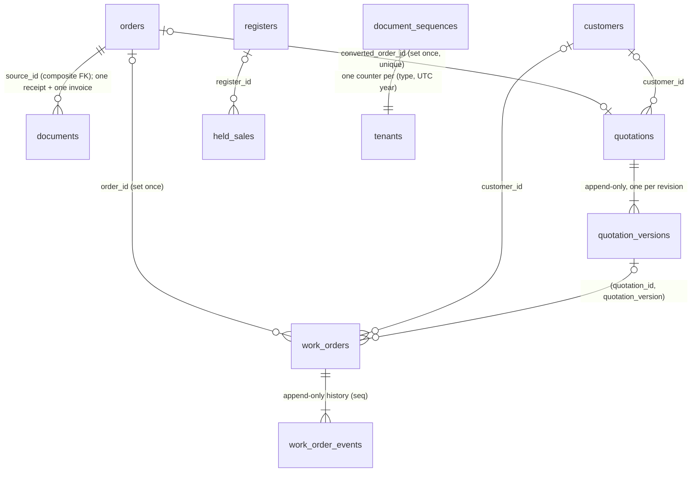

🇬🇧 English (source) · 🇮🇩 [Bahasa Indonesia](skema-basis-data.id.md)

# Database schema

Every `awcms_commerce_*` table: columns, types, constraints, indexes, and the row-level security that scopes each query to one tenant. Source of truth is `apps/cms/sql/901_awcms_commerce_schema.sql` through `apps/cms/sql/934_awcms_commerce_payment_events_amount_mismatch.sql` — thirty-four migrations, one `commerce` module (see [ADR-0008](adr/0008-one-commerce-module-carries-the-whole-store-not-three.md)) — plus [`apps/cms/src/modules/commerce/README.md`](../apps/cms/src/modules/commerce/README.md); this document explains them, it does not replace reading them.

## Catalog: `awcms_commerce_categories`, `awcms_commerce_products`, `_product_images`, `_product_variants`

### `awcms_commerce_categories` (`sql/901`, `+restored_at` in `sql/904`)

Hierarchical, self-referencing.

| Column | Type | Notes |
| --- | --- | --- |
| `id` | `uuid` | PK, `DEFAULT gen_random_uuid()` |
| `tenant_id` | `uuid NOT NULL` | `REFERENCES awcms_tenants (id)` |
| `parent_id` | `uuid` | `REFERENCES awcms_commerce_categories (id)`, nullable; set only at creation — see [`docs/cms.md`](cms.md) |
| `name` | `text NOT NULL` | |
| `slug` | `text NOT NULL` | Unique per tenant among live rows |
| `icon` | `text` | Nullable |
| `created_at`/`updated_at` | `timestamptz NOT NULL DEFAULT now()` | |
| `deleted_at` | `timestamptz` | Nullable — soft delete |
| `restored_at` | `timestamptz` | Nullable, added `sql/904` — the "when" fact `restore` needs, on the same precedent `awcms_offices` already uses |

**Indexes:** unique `(tenant_id, slug) WHERE deleted_at IS NULL`; `(tenant_id)`; `(tenant_id, deleted_at)`; `(parent_id)`; `(tenant_id, parent_id) WHERE deleted_at IS NULL` (`sql/907`).

### `awcms_commerce_products` (`sql/901` core + `sql/904` BjekMart parity columns)

| Column | Type | Notes |
| --- | --- | --- |
| `id` | `uuid` | PK |
| `tenant_id` | `uuid NOT NULL` | FK `awcms_tenants` |
| `category_id` | `uuid` | FK `awcms_commerce_categories`, nullable |
| `type` | `text NOT NULL DEFAULT 'physical'` | `CHECK IN ('physical','digital','service','subscription')` |
| `sku` | `text NOT NULL` | Unique per tenant among live rows |
| `name`, `slug` | `text NOT NULL` | `slug` unique per tenant among live rows |
| `description`, `digital_note` | `text` | Nullable |
| `price` | `numeric(14,2) NOT NULL` | `CHECK (price >= 0)` — see [ADR-0003](adr/0003-money-is-numeric-14-2-and-crosses-the-wire-as-a-string.md) |
| `price_level_2`, `price_level_3`, `price_level_4` | `numeric(14,2)` | Nullable — tiered pricing by customer level (`sql/904`) |
| `cost_price` | `numeric(14,2)` | Nullable, admin-only — never on a public read model |
| `discount_percent` | `integer NOT NULL DEFAULT 0` | `CHECK BETWEEN 0 AND 100` |
| `stock` | `integer NOT NULL DEFAULT 0` | `CHECK (stock >= 0)` |
| `status` | `text NOT NULL DEFAULT 'draft'` | `CHECK IN ('draft','active','inactive','archived')` — see [`docs/cms.md`](cms.md) |
| `label`, `label_color` | `text` | Nullable, merchandising badge |
| `min_purchase` | `integer NOT NULL DEFAULT 1` | `CHECK (>= 1)` |
| `weight_grams` | `integer NOT NULL DEFAULT 0` | `CHECK (>= 0)` |
| `manual_rating` | `numeric(2,1)` | `CHECK BETWEEN 0 AND 5`, nullable |
| `manual_sold_count` | `integer NOT NULL DEFAULT 0` | `CHECK (>= 0)` |
| `with_insurance`, `insurance_required` | `boolean NOT NULL DEFAULT false` | |
| `insurance_fee` | `numeric(14,2)` | Nullable |
| `promo_banner_show` | `boolean NOT NULL DEFAULT false` | |
| `promo_banner_{title,subtitle,badge,icon,color}` | `text` | Nullable |
| `size_chart_type` | `text NOT NULL DEFAULT 'none'` | `CHECK IN ('none','image','table')`, plus a cross-field CHECK reconciling it with the next two columns |
| `size_chart_media_id` | `uuid` | `REFERENCES awcms_news_media_objects` — the media registry's real table name, kept across the `news_portal`→`blog_content` merge; validated UUID-shaped only, not checked live (see [`docs/cms.md`](cms.md)) |
| `size_chart_details` | `jsonb` | Nullable |
| `service_form` | `jsonb` | Nullable — a service product's intake-form field list |
| `subscription_period` | `text` | `CHECK IN ('day','week','month','year')`, nullable |
| `download_link` | `text` | Nullable — a digital product's paid asset; deliberately excluded from every public read model (see [`docs/cms.md`](cms.md)) |
| `allow_dp` | `boolean NOT NULL DEFAULT false` | |
| `allow_free_shipping` | `boolean NOT NULL DEFAULT true` | |
| `variant_attributes` | `jsonb` | Nullable |
| `is_featured`, `is_recommended` | `boolean NOT NULL DEFAULT false` | |
| `created_at`/`updated_at` | `timestamptz NOT NULL DEFAULT now()` | |
| `deleted_at`, `restored_at` | `timestamptz` | Nullable |

**Indexes:** unique `(tenant_id, slug)`/`(tenant_id, sku)` both `WHERE deleted_at IS NULL`; `(tenant_id)`; `(tenant_id, deleted_at)`; `(category_id)`; `(size_chart_media_id)`; GIN trigram indexes on `name`/`sku` (`pg_trgm`, `sql/907`, backing the owner list's `q` substring filter); partial `(tenant_id) WHERE deleted_at IS NULL AND is_featured/is_recommended = true`; `(tenant_id, price)`/`(tenant_id, name)` both `WHERE deleted_at IS NULL`; `(tenant_id, status) WHERE deleted_at IS NULL`.

### `awcms_commerce_product_images` / `awcms_commerce_product_variants` (`sql/905`)

| Table | Key columns |
| --- | --- |
| `_product_images` | `product_id` (FK products), `media_object_id NOT NULL` (FK `awcms_news_media_objects`, checked live via `MediaLibraryPort.isMediaReferenceSafe` before insert), `sort_order`, `alt_text` |
| `_product_variants` | `product_id` (FK products), `name NOT NULL`, `value NOT NULL`, `color_hex`, `image_media_object_id` (FK, UUID-shaped-only validation), `sku` (unique per tenant among live rows, **checked against both this table and `awcms_commerce_products` itself** — a single-table index cannot express that), `price`/`price_level_2/3/4`, `stock`, `weight_grams`, `sort_order` |

Both: `id`/`tenant_id`/`created_at`/`updated_at`/`deleted_at` as usual; RLS `ENABLE`+`FORCE`, tenant-isolation policy; FK indexes on every reference column.

## Marketing: five families, plus store settings (`sql/909`–`sql/910`)

| Table | Key columns |
| --- | --- |
| `awcms_commerce_flash_sales` | `name`, `slug` (unique per tenant, live), `starts_at`/`ends_at NOT NULL` (`CHECK ends_at > starts_at`), `status` (`CHECK IN ('draft','scheduled','active','ended')` — `active`/`ended` are job-derived, never set by an owner directly) |
| `awcms_commerce_flash_sale_products` | `flash_sale_id`, `product_id`, `variant_id` (nullable), `sale_price NOT NULL` (`CHECK >= 0`), `quota`/`sold integer NOT NULL DEFAULT 0`; unique `(flash_sale_id, product_id, variant_id) NULLS NOT DISTINCT WHERE deleted_at IS NULL` |
| `awcms_commerce_vouchers` | `code` (unique per tenant, live), `type` (`CHECK IN ('percentage','nominal','free_shipping')`), `value NOT NULL` (`CHECK >= 0`), `min_order`, `max_discount`, `quota`/`used_count`, `is_public`, `status` (`CHECK IN ('active','inactive')`), `starts_at`/`ends_at NOT NULL` |
| `awcms_commerce_sliders` | `title NOT NULL`, `subtitle`, `media_object_id NOT NULL` (FK), `link_url`, `button_text`, `sort_order`, `is_active`, `starts_at`/`ends_at` (nullable, windowed) |
| `awcms_commerce_testimonials` | `author_name NOT NULL`, `author_role`, `body NOT NULL`, `rating integer NOT NULL DEFAULT 5` (`CHECK BETWEEN 1 AND 5`), `avatar_media_object_id` (FK, nullable), `is_active`, `sort_order` |
| `awcms_commerce_popups` | `title NOT NULL`, `body`, `media_object_id` (FK, nullable), `link_url`, `button_text`, `frequency` (`CHECK IN ('once_per_session','once_per_day','always')`), `is_active`, `starts_at`/`ends_at`; **unique partial index `(tenant_id) WHERE deleted_at IS NULL AND is_active = true`** — at most one active popup per tenant, enforced by the schema, not application code |
| `awcms_commerce_store_settings` | `tenant_id uuid PRIMARY KEY` (one row per tenant — a singleton, not a list), `settings jsonb NOT NULL DEFAULT '{}'` (`CHECK jsonb_typeof(settings) = 'object'`), `deleted_at` (here meaning "reset to defaults", not tenant removal — see [`docs/api.md`](api.md)) |

All six: standard `id`/`created_at`/`updated_at`/`deleted_at`, RLS `ENABLE`+`FORCE`, tenant-isolation policy, FK indexes.

## Orders: eight tables (`sql/913`)

| Table | Key columns | Notes |
| --- | --- | --- |
| `awcms_commerce_customers` | `name NOT NULL`, `phone NOT NULL` (unique per tenant, live), `email`, `level integer NOT NULL DEFAULT 1` (`CHECK BETWEEN 1 AND 4`), `status` (`CHECK IN ('active','blocked')`) | No `password_hash`/`identity_id` on this table itself — a customer stays reachable by order code + phone as a guest ([ADR-0009](adr/0009-guest-checkout-by-order-code-and-phone.md)); the account/OTP/session identity built on top of it lives in `awcms_commerce_customer_accounts`/`_customer_otps`/`_customer_sessions` below (ADR-0016) |
| `awcms_commerce_customer_addresses` | `customer_id` (FK), `label`, `recipient_name NOT NULL`, `phone NOT NULL`, `province_code`/`name`, `city_code`/`name`, `district_code`/`name` (all `text NOT NULL` **snapshots**, not a live FK to `idn_admin_regions`), `postal_code`, `street NOT NULL`, `latitude numeric(9,6)`, `longitude numeric(9,6)`, `is_default` | Snapshotted so a later region-master-data change never rewrites a customer's own delivered address. Exactly one `is_default` per `(tenant_id, customer_id)` among live rows is enforced by `sql/920`'s partial unique index (`WHERE is_default AND deleted_at IS NULL`), added for Issue #91's account address routes — any duplicate default the guest-checkout era may have left is demoted to the most-recently-created survivor by that same migration, before the index is created |
| `awcms_commerce_orders` | `order_code NOT NULL` (unique per tenant — **forever**, not scoped to live rows, since an order is never actually deleted), `customer_id` (FK), `status` (7-value CHECK, see [`docs/cms.md`](cms.md)), `payment_method` (`CHECK IN ('manual_bank','manual_qris','dp','gateway','cash')` — `gateway` since [ADR-0010](adr/0010-manual-payment-and-alternative-courier-first-gateways-via-outbox.md)/issue #110, `cash` added by `sql/931` for the POS counter sale only, issue #116), `payment_status` (`CHECK IN ('unpaid','partially_paid','dp_paid','paid','refunded')` — `partially_paid` added by `sql/940`; a CACHE of the payment-allocation ledger's derivation, issue #285), `shipping_method` (`CHECK IN ('alternative','self_pickup','courier')`), `shipping_service_name`, `shipping_cost`, `address jsonb` (snapshot, nullable for self-pickup), `subtotal`/`discount`/`voucher_code`/`voucher_discount`/`insurance_fee`/`tax`/`total`/`dp_amount`, `notes`, `paid_at`/`shipped_at`/`completed_at`/`cancelled_at`/`expires_at`, **`channel text NOT NULL DEFAULT 'storefront'` (`CHECK IN ('storefront','pos')`, `sql/931`)**, **`pos_cashier_tenant_user_id uuid`** (`sql/931`; NULL on every storefront order) | Indexes include the expiry job's own scan shape, `(tenant_id, status, expires_at) WHERE status = 'pending_payment'`, the admin list's `(tenant_id, status, created_at DESC)`, the POS history's `(tenant_id, channel, created_at DESC)` and the cashier filter's partial `(tenant_id, pos_cashier_tenant_user_id, created_at DESC) WHERE pos_cashier_tenant_user_id IS NOT NULL` (both `sql/931`). `payment_method`'s CHECK is a plain `text` constraint, dropped and re-created by name to widen it — the reason every enumerated commerce column is `text + CHECK` rather than a native `ENUM` |
| `awcms_commerce_order_items` | `order_id`, `product_id`, `variant_id` (nullable), `flash_sale_id` (nullable FK — set when the line was bought at a flash-sale price), `name`/`variant_name`/`sku` (snapshots), `unit_price NOT NULL`, `quantity integer NOT NULL CHECK (> 0)`, `weight_grams`, `service_form_values jsonb`, `line_total NOT NULL` | |
| `awcms_commerce_order_events` | `order_id`, `from_status` (nullable — null on the creation row), `to_status NOT NULL`, `actor` (`CHECK IN ('customer','admin','system')`), `note`, `created_at` | **Append-only — no `deleted_at` at all**, the one exception to every other table's soft-delete shape; the order-tracking timeline's own source |
| `awcms_commerce_payment_confirmations` | `order_id`, `method` (`CHECK IN ('manual_bank','manual_qris')`), `amount NOT NULL`, `bank_name`, `account_name`, `transferred_at`, `proof_media_object_id` (**no FK constraint, no index** — a stub column, matching the always-`503` upload path, see [`docs/cms.md`](cms.md)), `status` (`CHECK IN ('submitted','accepted','rejected')`), `reviewed_by` (**no FK constraint**), `reviewed_at` | |
| `awcms_commerce_reviews` | `product_id`, `customer_id`, `order_id` (all `NOT NULL` FKs), `rating integer NOT NULL CHECK BETWEEN 1 AND 5`, `body NOT NULL`, `status` (`CHECK IN ('pending','published','rejected')`) | Unique `(customer_id, product_id, order_id) WHERE deleted_at IS NULL` — one review per customer, per product, per order |
| `awcms_commerce_wishlists` | `customer_id`, `product_id` (both `NOT NULL` FKs) | Unique `(customer_id, product_id) WHERE deleted_at IS NULL`; shipped ahead of the account system it needed, now reachable through `GET`/`PUT /api/v1/commerce/storefront/account/wishlist` and `DELETE .../wishlist/{productId}` (Issue #91) |

All eight: RLS `ENABLE`+`FORCE`, tenant-isolation policy. `deleted_at` exists on seven of eight (every table but `order_events`) purely as a uniform data-lifecycle purge cursor — orders, order items, customers, and payment confirmations are never actually soft-deleted by this module's own code.

## Customer accounts, OTP, sessions: three tables (`sql/917`-`918`)

Issue #87 (C1, contract #86 — see [ADR-0016](adr/0016-customer-accounts-are-otp-verified-commerce-accounts-with-bearer-sessions.md), this repo's own ADR). No password anywhere — authentication is a 6-digit e-mail OTP; a session is an opaque bearer token, only its `sha256:` hash stored.

| Table | Key columns | Notes |
| --- | --- | --- |
| `awcms_commerce_customer_accounts` | `customer_id` (FK, `UNIQUE (tenant_id, customer_id)` — 1:1 with `awcms_commerce_customers`), `email_normalized` (`UNIQUE (tenant_id, email_normalized)`), `status` (`CHECK IN ('active','blocked')`), `email_verified_at`, `history_from timestamptz NOT NULL`, `last_login_at` | No `password_hash`, no `identity_id`/`principal_id` — ADR-0016 D1 (contract issue #86). Carries a `deleted_at` column that this module's own code never actually sets — blocked is `status = 'blocked'`, never deleted; the column exists only as an honest, always-`NULL` cursor for the `dataLifecycle` descriptor (`module.ts`), the same trick `awcms_commerce_orders` already uses. `history_from` is ADR-0016 D4's resolved starting point for order history, computed once at registration by the pure `resolveHistoryFrom` function |
| `awcms_commerce_customer_otps` | `email_normalized NOT NULL`, `purpose` (`CHECK IN ('login','register')`), `code_hash NOT NULL` (never the raw code), `registration jsonb` (pending name/phone for `register`), `attempts integer NOT NULL DEFAULT 0`, `expires_at NOT NULL`, `consumed_at` | 10-minute TTL, 5 attempts, single use — ADR-0016 D2. `consumeOtp` verifies + consumes in one `UPDATE ... RETURNING`, never read-then-write |
| `awcms_commerce_customer_sessions` | `account_id` (FK), `token_hash text NOT NULL UNIQUE` (`sha256:` prefixed — a FRESH namespace, not `apps/cms/src/lib/auth`'s admin session hash), `issued_at`, `expires_at`, `last_seen_at`, `revoked_at`, `client_ip_hash`, `user_agent_summary` | 30-day sliding TTL (`touchSession` only writes when `last_seen_at` is 5+ minutes stale); `cs_` + 32 random bytes base64url bearer token — ADR-0016 D3 |

All three: RLS `ENABLE`+`FORCE`, tenant-isolation policy, FK indexes. `commerce:customer-auth:purge` (worker role, `sql/918`'s grants) deletes expired OTPs and expired/revoked-7-days-ago sessions on a schedule; the accounts table has no purge behaviour at all (see `module.ts`'s `dataLifecycle` comment).

## Affiliate program: two tables (`sql/921`)

Issue #92, contract #86's D5 — a fresh design, no legacy `affiliate_*` column or `product_affiliate_links` row carried over (see [`docs/kamus-data.md`](kamus-data.md)).

| Table | Key columns | Notes |
| --- | --- | --- |
| `awcms_commerce_affiliates` | `customer_id NOT NULL` (FK, `UNIQUE (tenant_id, customer_id) WHERE deleted_at IS NULL` — 1:1 with `awcms_commerce_customers`), `code NOT NULL` (`UNIQUE (tenant_id, code) WHERE deleted_at IS NULL`, 8-char unambiguous alphabet — `domain/affiliate-code.ts`), `commission_rate numeric(5,2) NOT NULL` (`CHECK BETWEEN 0 AND 100`), `status` (`CHECK IN ('active','suspended')`, default `active`) | `commission_rate` is a SNAPSHOT copied from `store_settings.affiliate_commission_rate` at enrolment time — a later store-wide rate change never reprices an already-enrolled affiliate; only `PATCH /api/v1/commerce/affiliates/{id}` changes one affiliate's own rate afterwards |
| `awcms_commerce_affiliate_commissions` | `affiliate_id NOT NULL` (FK), `order_id NOT NULL` (FK, `UNIQUE` — **not scoped to live rows**, one commission per order forever, the same "unique for the FK target's own lifetime" shape `awcms_commerce_orders.order_code` uses), `base_amount numeric(14,2) NOT NULL`, `rate numeric(5,2) NOT NULL`, `amount numeric(14,2) NOT NULL`, `status` (`CHECK IN ('pending','approved','paid','void')`, default `pending`), `approved_at`/`paid_at`/`voided_at` | `base_amount`/`rate`/`amount` are all SNAPSHOTS taken when the referenced order reached `completed` (`domain/affiliate-commission.ts`); `base = subtotal − discount − voucher_discount` floored at zero, `amount = round(base × rate / 100, 2)` |

Plus one column on each of two existing tables: `awcms_commerce_orders.affiliate_id` (nullable FK, indexed `WHERE affiliate_id IS NOT NULL`) — set once at order-creation time by `resolveAffiliateForOrder` (unknown/suspended code → `NULL`, never a validation error) and never changed afterwards; `awcms_commerce_store_settings.affiliate_commission_rate numeric(5,2)` (nullable, `CHECK BETWEEN 0 AND 100` when set) — a real column outside the `settings` jsonb blob (see that table's own entry above for why jsonb is the default choice; this column is read by the hot `resolveAffiliateForOrder`/enrolment-check path and never needed the jsonb schema's own versioning), `NULL` meaning the affiliate program is OFF for the tenant.

## Courier rates: two cache tables (`sql/924`)

Issue #107, contract #106's D4 — a district-code→provider-destination-id cache and a per-(origin, destination, weight bucket, courier, service) rate cache, both purely additive caches with no `deleted_at` (a stale row is deleted outright, never soft-deleted — there is nothing to restore about a cached price).

| Table | Key columns | Notes |
| --- | --- | --- |
| `awcms_commerce_courier_destinations` | `district_code NOT NULL`, `provider NOT NULL`, `destination_id NOT NULL`, `label NOT NULL`, `resolved_at NOT NULL DEFAULT now()`, `UNIQUE (tenant_id, provider, district_code)` | No TTL — a district's provider destination id essentially never changes. Resolved once per (tenant, provider, district) by a name search against `idn_admin_regions`, then cached forever (barring a future refresh sweep) |
| `awcms_commerce_shipping_rates` | `provider NOT NULL`, `origin_id NOT NULL`, `destination_id NOT NULL`, `weight_bucket integer NOT NULL` (`CHECK >= 1000`), `courier NOT NULL`, `service NOT NULL`, `name NOT NULL`, `cost numeric(14,2) NOT NULL`, `etd`, `fetched_at NOT NULL DEFAULT now()`, `expires_at NOT NULL`, `UNIQUE (tenant_id, provider, origin_id, destination_id, weight_bucket, courier, service)` | TTL 6 hours (`expires_at`); `weight_bucket` is always `domain/weight-bucket.ts`'s `computeWeightBucketGrams` output (rounded up to the next 100 g, floored at 1000 g — RajaOngkir's own minimum billable weight), never the cart's raw weight, so two carts within the same 100 g band share one row. `commerce:shipping-rates:purge` (hourly) `DELETE`s every row past `expires_at`, across tenants, `awcms_worker`-granted like every other purge job in this module |

Both tables follow `sql/901`'s conventions (`ENABLE`/`FORCE ROW LEVEL SECURITY`, one tenant-isolation policy, an FK index on `tenant_id`) but are never written to by `application/order-directory.ts`'s write transaction directly for a NEW rate — `application/shipping-rate-directory.ts`'s `getCourierRates`/`resolveDestination` always read the cache in one short transaction, call the `ShippingRateProvider` (Komerce RajaOngkir API v2, or the `log` fixture adapter) with NO transaction open at all, then write the result back in a second short transaction (ADR-0006/0010's "never call a provider inside a DB transaction", applied here the same way `email`'s outbox already applies it). Order creation validates a chosen `{courier, service, cost}` against `awcms_commerce_shipping_rates` ONLY — a plain, transaction-safe `SELECT ... WHERE expires_at > now()`, never a second live provider call from inside the order's own write transaction.

Both new tables: RLS `ENABLE`+`FORCE`, tenant-isolation policy, FK indexes. Neither is ever soft-deleted by this module's own code in practice — `deleted_at` exists purely as the uniform data-lifecycle purge cursor, the same "always-`NULL` cursor" shape `awcms_commerce_orders` and `awcms_commerce_customer_accounts` already use.

## Commerce inbox: two tables (`sql/927`)

Issue #111, contract #106's D8 — a customer account's own thread with the store.

| Table | Key columns | Notes |
| --- | --- | --- |
| `awcms_commerce_conversations` | `account_id NOT NULL` (FK to `awcms_commerce_customer_accounts` — an inbox thread requires a verified account, unlike guest checkout), `subject NOT NULL` (`CHECK char_length BETWEEN 1 AND 150`), `status` (`CHECK IN ('open','closed')`, default `open`), `last_message_at timestamptz NOT NULL DEFAULT now()`, `unread_for_store boolean NOT NULL DEFAULT true`, `unread_for_customer boolean NOT NULL DEFAULT false` | `last_message_at`/both `unread_for_*` flags are DENORMALIZED and kept in step with `awcms_commerce_messages` inside the SAME transaction as every message insert — never a join-derived value at read time. `deleted_at` exists purely as the uniform data-lifecycle purge cursor (this module's own code never sets it), the same "always-`NULL` cursor" shape `awcms_commerce_orders`/`awcms_commerce_customer_accounts` already use |
| `awcms_commerce_messages` | `conversation_id NOT NULL` (FK), `sender NOT NULL` (`CHECK IN ('customer','store')`), `sender_tenant_user_id` (nullable; a `CHECK` requires it set for `sender='store'` and NULL for `sender='customer'`), `body NOT NULL` (`CHECK char_length BETWEEN 1 AND 4000`) | Append-only, like `awcms_commerce_order_events` — no `deleted_at`, no `updated_at`; a sent message is never edited or retracted |

Both new tables: RLS `ENABLE`+`FORCE`, tenant-isolation policy, FK indexes. `commerce.conversations`'s `dataLifecycle` descriptor uses the usual `deleted_at` cursor; `commerce.messages`, being append-only, uses `created_at` instead — the one exception `commerce.order_events` already established for exactly this shape.

## Customer campaigns: two tables + one column (`sql/929`)

Issue #114, contract #106's D9 — a consent-gated mass e-mail/WhatsApp send.

| Table | Key columns | Notes |
| --- | --- | --- |
| `awcms_commerce_customer_accounts.marketing_consent_at` (new column, not a new table) | `timestamptz`, nullable | Non-null means the account opted into marketing communication at that instant; `NULL` means never opted in (or withdrawn). Toggled ONLY by the account itself via `PATCH .../account/me {marketingConsent}` — never by staff |
| `awcms_commerce_campaigns` | `channel NOT NULL` (`CHECK IN ('email','whatsapp')`), `subject` (nullable — required for `email`, ignored for `whatsapp` at the application boundary), `body NOT NULL` (`CHECK char_length BETWEEN 1 AND 4000`), `audience jsonb NOT NULL DEFAULT '{}'` (validated at the application boundary, not by a database CHECK — a small, evolving filter shape), `status NOT NULL` (`CHECK IN ('draft','scheduled','sending','sent','cancelled')`, default `draft`), `scheduled_at`/`sent_at timestamptz`, `recipient_count integer` | `recipient_count`/`sent_at` start `NULL` on a fresh `draft`, populated only once the campaign has actually been dispatched (`commerce:campaigns:dispatch`'s FINALIZE phase) |
| `awcms_commerce_campaign_recipients` | `campaign_id NOT NULL` (FK), `customer_id NOT NULL` (FK), `address_masked NOT NULL` (masked e-mail/phone ONLY, never a raw address), `status NOT NULL` (`CHECK IN ('queued','enqueued','skipped')`, default `queued`), `outbox_ref` (nullable), `UNIQUE (campaign_id, customer_id)` | One row per resolved recipient — the resumability/audit ledger a partial send relies on. The `UNIQUE` constraint plus `ON CONFLICT DO NOTHING` at insert time is what makes the dispatcher's crash-recovery safe to retry; `resolveCampaignAudiencePage`'s own `NOT EXISTS` against this table is what makes its resume cursor correct without a separate cursor column on the campaign row |

Both new tables: RLS `ENABLE`+`FORCE`, tenant-isolation policy, FK indexes. `commerce.campaigns`'s `dataLifecycle` descriptor uses the usual `deleted_at` cursor; `commerce.campaign_recipients`, being append-only per campaign, uses `created_at` instead — the same `commerce.messages` shape just above. Permission catalog seed: `sql/930` (`commerce.campaigns.{read,update,send}`).

## Payment gateway: sessions, event ledger, webhook-endpoint tokens (`sql/926`)

Issue #110, contract #106's D2/D3 — a hosted-checkout session table, a replay-protection ledger for inbound provider webhooks, and the tenant-scoped webhook-endpoint tokens D2's bootstrap lookup resolves. The webhook INTAKE route that writes `payment_events` (`POST /api/v1/commerce/webhooks/{provider}/{endpointToken}`) and the `commerce:payments:reconcile` job landed in issue #113; `sql/934` then widened `outcome`'s CHECK to add `amount_mismatch` (see below).

| Table | Key columns | Notes |
| --- | --- | --- |
| `awcms_commerce_payment_gateway_sessions` | `order_id NOT NULL` (FK), `provider NOT NULL` (`CHECK IN ('midtrans','log')`), `provider_ref NOT NULL`, `redirect_url NOT NULL`, `status NOT NULL DEFAULT 'created'` (`CHECK IN ('created','pending','paid','expired','failed','refunded')`), `expires_at NOT NULL`, `last_checked_at`, `raw_status jsonb`, `UNIQUE (provider, provider_ref)` | One row per hosted-checkout attempt. `application/payment-gateway-directory.ts`'s `createGatewaySession` is the only writer: validates the order and checks for a still-live session in one short transaction, calls the provider with NO transaction open, persists in a second short transaction. A genuinely concurrent double-create hits the `UNIQUE (provider, provider_ref)` constraint (`23505`) and re-fetches the winning row rather than erroring. `commerce:payments:reconcile` (`*/2m`) polls every still-`created`/`pending` session's `fetchStatus`, for the webhooks that never arrive |
| `awcms_commerce_payment_events` | `provider NOT NULL` (`CHECK IN ('midtrans','log')`), `event_key NOT NULL`, `provider_ref NOT NULL`, `order_id` (FK, nullable), `payload jsonb NOT NULL`, `received_at NOT NULL DEFAULT now()`, `outcome NOT NULL` (`CHECK IN ('applied','ignored','replay','amount_mismatch')` — `amount_mismatch` added by `sql/934`, issue #113), `UNIQUE (tenant_id, provider, event_key)` | The D2 replay-protection ledger. The webhook intake route (issue #113) is its writer: a verified, new `event_key` inserts and applies (`markOrderPaidBySystem`); a replayed `event_key` hits `ON CONFLICT DO NOTHING` and the route still answers `200`; a verified event whose `payload.gross_amount` disagrees with the order's own `total` is recorded as `amount_mismatch` and never marks the order paid |
| `awcms_commerce_webhook_endpoints` | `provider NOT NULL` (`CHECK IN ('midtrans')`), `token_hash NOT NULL` (`UNIQUE`), `label`, `created_by` (FK to `awcms_tenant_users`, nullable), `revoked_at` | ONE row per (tenant, provider) endpoint an owner minted. Only the SHA-256 hash of the plaintext token is ever stored — `application/webhook-endpoint-directory.ts`'s `createWebhookEndpoint` returns the plaintext exactly once and never persists it, the same discipline `awcms_machine_credentials` already applies to a structurally identical secret |

Plus two nullable columns on the existing `awcms_commerce_orders`: `gateway_provider text`, `gateway_ref text` — which gateway/reference paid this order, if any (added `ADD COLUMN IF NOT EXISTS`, so the migration stays additive against an already-populated `orders` table).

All three new tables: RLS `ENABLE`+`FORCE`, tenant-isolation policy, FK indexes (including a composite `(tenant_id, <cursor column>)` index on each, per this repo's own `data-lifecycle:table-coverage:check` convention). A fourth object, `awcms_resolve_commerce_webhook_endpoint(token_hash)`, is a `SECURITY DEFINER` function mirroring `sql/048`'s `awcms_resolve_tenant_domain_lookup` bootstrap-read pattern exactly — a dedicated `NOLOGIN` owner role (`awcms_webhook_endpoint_bootstrap`), an explicit `FOR SELECT` policy scoped to that role only, a fixed non-sensitive return shape (`tenant_id`, `provider` — never `token_hash`/`label`/`created_by`), and `EXECUTE` restricted to `awcms_app`. It resolves `(tenant_id, provider)` from a hashed, opaque token before any tenant context exists, the same bootstrap gap the tenant-domain function closes for a hostname.

## Point of sale: two columns and one widened CHECK on `awcms_commerce_orders` (`sql/931`, permission seed `sql/932`)

Issue #116, contract #106's D6 — no new table. `channel` records WHERE an order was placed (`storefront` for every anonymous/bearer checkout, and for every order that existed before the migration, via the column default; `pos` for a counter sale created through `POST /api/v1/commerce/pos/orders`), independently of `payment_method`, which records HOW it was paid — nothing in this codebase creates a `cash` order outside POS today, but the two are separate facts and the history query wants a plain `(tenant_id, channel, created_at DESC)` index rather than an expression over the payment method. `pos_cashier_tenant_user_id` is the one place this module records WHICH staff member did something on the row itself (see "No actor-stamp columns" below for the nuance): a plain `uuid` stamp, deliberately **not** a foreign key to `awcms_tenant_users` — an order is a fiscal record that must outlive the staff account that rang it up, and a FK would either block removing that user or force `ON DELETE SET NULL` to rewrite the tenant's own record of who took the cash. `order_events.actor` keeps recording only the ROLE (`admin`) for a POS sale, exactly as for every other admin transition; the audit log (`commerce.pos.sale`) carries the same tenant user id as `actor_tenant_user_id`. No new `awcms_worker` grant: the job grants of `sql/908`/`sql/916` are per table and already cover these columns. `sql/932` seeds the one new permission, `commerce.pos.create` (`INSERT ... ON CONFLICT DO NOTHING`).

The walk-in customer is NOT a schema construct — it is an ordinary `awcms_commerce_customers` row per tenant, found or created by `createPosOrder` under the documented sentinel phone `+620000000000` (`POS_WALK_IN_CUSTOMER_SENTINEL_PHONE`, [`docs/kamus-data.md`](kamus-data.md)); `customers.phone` stays `NOT NULL` and unique per tenant, which is exactly what makes that row unique.

## Payment-allocation ledger: `awcms_commerce_payment_allocations` (`sql/940`–`943`, issue #285, [ADR-0025](adr/0025-payments-are-an-allocation-ledger-separate-from-order-status.md))

An append-only, FORCE-RLS ledger: one row per tender leg or compensating reversal of an order. `kind` (`payment` | `reversal`), `reverses_allocation_id` (set on a reversal, and only a reversal), `tender_type` (`CHECK IN ('cash','manual_qris','manual_bank_transfer','gateway')` — `store_credit`/`gift_card` deliberately absent until their ledgers exist), `amount numeric(14,2) CHECK (amount > 0)` (the amount APPLIED to the order), `status` (`pending` | `succeeded` | `failed`; only a `gateway` leg may be pending, and `settled_at` is stamped exactly when it stops being pending), `provider`/`provider_reference` (a gateway leg always names its provider), `tendered_amount`/`change_amount` (cash payment legs only, with `tendered = amount + change` enforced by CHECK), `note`, `source` (`pos`, `admin`, `storefront_manual`, `gateway_checkout`, `gateway_webhook`, `gateway_reconcile`, `backfill`), `source_key` (`UNIQUE (tenant_id, source_key)` — the row-level idempotency key: `gateway:{provider}:{ref}`, `confirmation:{id}`, `api:{key}`, `reversal:{key}`, `pos:{key}:{n}`, `backfill:{order id}`), `actor_kind`/`actor_tenant_user_id` (a plain uuid stamp, never a FK — a fiscal record outlives the staff account), `created_at`, `settled_at`, `entry_seq` (`bigint GENERATED ALWAYS AS IDENTITY` — insertion order, the tie-breaker after `created_at` so the legs of one sale, written in one transaction with the same `created_at`, always list in the order they were entered).

- **Settlement is derived, never stored:** `settled = Σ succeeded payments − Σ succeeded reversals`; `outstanding = max(0, total − settled)`. `awcms_commerce_orders.payment_status` is rewritten as a cache in the same transaction as every ledger write.
- **Append-only, mechanically:** `awcms_app` has `DELETE` revoked (`sql/019` grants all four verbs by default; `security-readiness.ts` asserts the exact set both ways) and a `BEFORE UPDATE` trigger freezes every column except `pending → succeeded|failed` (+ `settled_at`). `awcms_worker` keeps `SELECT, DELETE` (`sql/942`) for the data-lifecycle engine only (`commerce.payment_allocations`, `cursorColumn: created_at`, five-year floor, ten-year ceiling).
- **Tenant-safe references:** composite FKs `(tenant_id, order_id) → awcms_commerce_orders (tenant_id, id)` and `(tenant_id, reverses_allocation_id) → (tenant_id, id)`, backed by `UNIQUE (tenant_id, id)` indexes (the one on `awcms_commerce_orders` is added by `sql/940`), plus a tenant-isolation policy with `WITH CHECK`.
- **Indexes:** `(tenant_id, order_id, created_at)` (an order's ledger), `(tenant_id, created_at)` (the tender-mix scan and the purge cursor), the unique source key, `(order_id)`, a partial `(tenant_id, reverses_allocation_id)`, and on `awcms_commerce_orders` a partial `(tenant_id, created_at DESC) WHERE payment_status IN ('unpaid','partially_paid','dp_paid') AND status NOT IN ('cancelled','expired') AND deleted_at IS NULL` for the outstanding-balances scan.
- **`sql/941`** seeds `commerce.payments.{read,create,revoke}` and `commerce.pos_due.create`; **`sql/943`** is the expand→backfill: one deterministic `backfill` leg per already-paid order (`ON CONFLICT DO NOTHING`, skipped for any order that already has a ledger row, timestamp = the order's own `paid_at`), with a down-payment order's amount reconstructed from its accepted confirmations (capped at the total) and its cached status corrected to `dp_paid`.

## POS registers and cash-up: six tables and two stamp columns (`sql/970`–`973`, issue #284, [ADR-0028](adr/0028-pos-register-sessions-and-cash-up.md))

Six FORCE-RLS tables (tenant-isolation policy with `WITH CHECK`, composite `(tenant_id, …)` foreign keys backed by `UNIQUE (tenant_id, id)`, every FK column indexed, money `numeric(14,2)`), and one nullable `register_session_id` on each of `awcms_commerce_orders` and `awcms_commerce_payment_allocations`.

| Table | What it holds | Notable constraints |
| --- | --- | --- |
| `awcms_commerce_registers` | A named till: `code`, `name`, `location_label`, `active`, creator/updater stamps, `deleted_at` (never set — the retention cursor, the `commerce.orders` shape) | `UNIQUE (tenant_id, lower(code))`; length CHECKs |
| `awcms_commerce_register_sessions` | One shift: `register_id`, `status` (`open \| closing \| closed \| corrected`), `opened_at`/`opened_by`, `opening_float >= 0`, `current_cashier_tenant_user_id`, `closed_at`/`closed_by` | **partial UNIQUE `(tenant_id, register_id) WHERE status IN ('open','closing')`** — one active session per register; `closed_at`/`closed_by` set exactly when `closed`/`corrected`; a guard trigger freezes identity columns always and every column of a closed session except `closed → corrected` |
| `awcms_commerce_register_movements` | Append-only cash drawer movements: `movement_type` (`cash_in \| cash_out \| safe_drop \| expense \| transfer \| correction`), `direction`, `amount > 0`, `reference`, `note`, actor stamp, `source_key` | the type fixes the direction of the three one-way types; `expense`/`transfer` need a `reference`, `correction` a `note`; `reference_kind CHECK IN ('free_text')` is the typed hook for the expenses domain (#294); BEFORE INSERT requires an `open` session; UPDATE refused by trigger and revoked; `UNIQUE (tenant_id, source_key)` |
| `awcms_commerce_register_close_requests` | One row per close attempt: `attempt`, requester, `variance_total` (net, signed), `variance_gross` (Σ absolute), the `approval_threshold` in force, `approval_required`, `variance_reason`, `decision` (`auto \| pending \| approved \| rejected`), decider + time + note | a reason is required whenever `variance_gross > 0`; the decision-shape CHECK ties decider/time to the decision; `UNIQUE (tenant_id, session_id, attempt)`; BEFORE INSERT requires an `open` session; the only legal UPDATE is `pending → approved \| rejected` |
| `awcms_commerce_register_close_lines` | The per-tender snapshot of one request: `tender_type`, `expected` (signed), `counted >= 0`, `variance` | `variance = counted - expected` is a CHECK; `ON DELETE CASCADE` to its request (retention); append-only |
| `awcms_commerce_register_corrections` | Compensating post-close rows: `correction_id` (groups the lines of one correction), `tender_type`, `adjustment <> 0` (signed), `reason`, actor | BEFORE INSERT requires a `closed`/`corrected` session; append-only; `UNIQUE (tenant_id, correction_id, tender_type)` |

- **Stamp columns (`sql/971`).** `awcms_commerce_orders.register_session_id` (CHECK: only `channel = 'pos'`; a trigger sets it once at INSERT, only against an `open` session, and refuses any later change) and `awcms_commerce_payment_allocations.register_session_id` (a trigger requires it to equal the leg's own order's session and that session to be `open`; the ledger's append-only guard, replaced by `sql/971`, freezes it). Both are NULL for every row recorded outside an open session — the expand step, nothing to backfill.
- **Privileges.** `awcms_app` loses `DELETE` on all six; the three pure-append tables (movements, close lines, corrections) also lose `UPDATE`. `awcms_worker` keeps `SELECT, DELETE` (`sql/973`) for the retention engine (`commerce.register_*`, five-year floor, ten-year ceiling; the two parents key on a never-set `deleted_at`, the four children on `created_at`). `security-readiness.ts` asserts the exact sets both ways.
- **`sql/972`** seeds the ten permission keys; `sql/974` is held and unused.

## Commerce documents: seven tables (`sql/980`–`982`, issue #286, [ADR-0029](adr/0029-commerce-documents-are-separate-records-and-numbered-documents-are-immutable-order-snapshots.md))

Seven FORCE-RLS tables (tenant-isolation policy with `WITH CHECK`, composite `(tenant_id, …)` foreign keys backed by `UNIQUE (tenant_id, id)`, every FK column indexed, money `numeric(14,2)`), plus one `UNIQUE (tenant_id, id)` index on `awcms_commerce_customers` to anchor a composite FK. No existing table gained a column.

| Table | What it holds | Notable constraints |
| --- | --- | --- |
| `awcms_commerce_document_sequences` | One counter per `(tenant_id, doc_type, period)` — `doc_type` `quotation \| work_order \| receipt \| invoice`, `period` a four-digit UTC year, `last_number` | `UNIQUE (tenant_id, doc_type, period)`; a guard trigger allows only `last_number + 1` per update and freezes everything else; `awcms_app` cannot `DELETE`; retention cursor `updated_at` with a 366-day floor — safe because allocation only touches the current UTC year's row |
| `awcms_commerce_held_sales` | A parked cart: `owner_tenant_user_id`, optional composite-FK `register_id`, `label`, `cart` jsonb (lines, customer, notes — no prices), `line_count 1..100`, `status` (`held \| resumed \| discarded \| expired`), `held_at`, `expires_at > held_at` | a `CHECK` pins a non-`held` row to `cart = '{}'` (the cart is wiped when the sale leaves `held`); a guard trigger freezes owner, register, expiry and size; retention cursor `held_at` |
| `awcms_commerce_quotations` | The header: `number`, `customer_id` (composite FK), `status`, `current_version`, `accepted_version`/`accepted_at`/`accepted_by`, `decision_note`, `converted_order_id` (composite FK to orders), `deleted_at` (never set — the retention cursor) | `UNIQUE (tenant_id, number)`; **partial `UNIQUE (tenant_id, converted_order_id)`** — one order per quotation; the status/accept/converted `CHECK`s; a guard trigger enforces the legal edges, a revision (`current_version + 1`, back to `draft`, only from draft/sent/expired), the pinned accepted version and the set-once conversion |
| `awcms_commerce_quotation_versions` | An append-only priced snapshot: `version`, `valid_until > created_at`, `lines` jsonb (1..100), `subtotal`/`discount`/`tax`/`total`, `customer` jsonb, `pricing_context` jsonb, `notes`, `content_hash` (64 hex) | `UNIQUE (tenant_id, quotation_id, version)`; append-only trigger and revoked `UPDATE`/`DELETE` |
| `awcms_commerce_work_orders` | An operational job: `number`, `title`, `description`, `status`, `priority`, composite-FK `customer_id`, `quotation_id` + `quotation_version` (a composite FK to the real version row), `order_id` (composite FK), `assignee_tenant_user_id`, `due_at`, `completed_at`/`cancelled_at`, `deleted_at` (never set) | `UNIQUE (tenant_id, number)`; `quotation_id` and `quotation_version` set together; `completed_at`/`cancelled_at` set exactly with their status; a guard trigger enforces the status machine, freezes provenance and the number, and lets `order_id` be attached once; holds **no money** |
| `awcms_commerce_work_order_events` | The append-only history: `seq` (identity — the order of events), `from_status` (NULL for the first), `to_status`, `note`, actor stamp | append-only trigger and revoked `UPDATE`/`DELETE`; read back in `seq` order |
| `awcms_commerce_documents` | An immutable numbered snapshot: `doc_type` (`receipt \| invoice`), `number`, the provenance triple `source_type` (`order`) / `source_id` (composite FK) / `source_version` (1), the money copy (`subtotal`, `discount`, `shipping_cost`, `insurance_fee`, `tax`, `total`), `snapshot` jsonb, `content_hash`, issuer stamp, `issued_at` | `UNIQUE (tenant_id, number)` and **`UNIQUE (tenant_id, doc_type, source_type, source_id)`** — one receipt and one invoice per order; a `BEFORE INSERT` trigger verifies the money equals the order's (discount = order + voucher), refuses a cancelled/expired order and a receipt for an unpaid one; append-only trigger and revoked `UPDATE`/`DELETE` |

- **Privileges.** `awcms_app` loses `DELETE` on all seven (and `UPDATE` on versions, events and documents); `awcms_worker` keeps `SELECT, DELETE` on all seven (`sql/982`) for the retention engine. `security-readiness.ts` asserts the exact sets both ways.
- **Retention.** Documents `financial_tax` (five-year floor, ten-year ceiling); quotations, versions, work orders and events one-year floor / ten-year ceiling (the three that other rows point at keyed on the never-set `deleted_at`, so a purge cannot orphan a foreign key); held sales a 7–90 day window.
- **`sql/981`** seeds the thirteen permission keys; `sql/983`–`984` are held and unused.



`document_sequences` has no foreign key to the numbered rows on purpose: it is the counter their numbers come from, bumped in the same transaction, and a counter row outlives its documents for as long as its year is current. No column was added to `orders`: it never learns about the quotations, work orders or documents that point at it.

## Barcodes: two columns, two indexes, one trigger (`sql/975`–`976`, issue #292, [ADR-0032](adr/0032-barcodes-are-a-derived-identifier-and-the-cashier-keyboard-layer-is-chord-only.md))

No new table. `barcode text` (nullable) on `awcms_commerce_products` and `awcms_commerce_product_variants`, with `CHECK (barcode ~ '^[!-~]{1,48}$')` (printable ASCII, no spaces). The symbology is **not stored** — it is a pure function of the code (`domain/barcode.ts`).

| Object | What it enforces |
| --- | --- |
| `awcms_commerce_products_tenant_barcode_key`, `awcms_commerce_product_variants_tenant_barcode_key` | partial `UNIQUE (tenant_id, barcode) WHERE deleted_at IS NULL AND barcode IS NOT NULL` — the same-table half of the rule, **and the lookup index** (a scan resolves with one equality probe; verified an index scan at 20,000 rows) |
| `awcms_commerce_barcode_cross_guard()` + a `BEFORE INSERT OR UPDATE` trigger on each table | the cross-table half: a code held by a live row of the other table is refused (`unique_violation`, constraint `awcms_commerce_barcode_cross_table_key`), under `pg_advisory_xact_lock(918292, hash & 255)` — **256 stripes, not one lock per code**, because an advisory lock holds a slot of the shared lock table until commit and a 20,000-row bulk load died with `out of shared memory` under per-code locks. A soft-deleted row frees its code; **restoring** a row whose code was reused meanwhile comes back with `barcode = NULL` instead of failing |

Two tenants may hold the same code. Row-level security, the tenant filter, soft delete and the retention descriptors are those of the rows the column lives on; no `dataLifecycle`/`subjectData` entry, worker grant or composite FK is added because no table is. Permissions: `commerce.barcodes.{read,update}` (`sql/976`).

## Sales-report projections: three derived tables (`sql/933`)

Issue #117, contract #106's D7 — the read models of the three `cursor_table` reporting projections `commerce` contributes (`commerce.sales_daily`, `commerce.sales_by_product`, `commerce.sales_by_category`), maintained by the `reporting` engine's own worker from `awcms_commerce_order_events` (see [`docs/cms.md`](cms.md) "Sales reports" for the delta rules). Derived and fully rebuildable — never written by a request path, never a source of truth.

| Table | Key columns | Notes |
| --- | --- | --- |
| `awcms_commerce_sales_daily` | `PRIMARY KEY (tenant_id, day)`, `day date`, `orders_paid integer`, `gross`/`discount`/`shipping`/`net numeric(14,2)` | One row per report-zone day (`Asia/Jakarta`) that had a paid order. `orders_paid` and the four money columns are additive deltas: `+` on `-> paid`, `-` on `-> cancelled|refunded` after a paid state, on the SAME day row (attributed to the order's `paid_at`). A day that sold and fully refunded reads `0`, not absent |
| `awcms_commerce_sales_by_product` | `PRIMARY KEY (tenant_id, day, product_id)`, `product_name text` (snapshot), `qty integer`, `gross numeric(14,2)` | Per day and product; `gross` is the sum of line totals. No FK to `awcms_commerce_products` on purpose — the name is a snapshot (the same posture `awcms_commerce_order_items.name` takes) and a purged product must not make its sales history unrebuildable. `(tenant_id, product_id)` index for the grouped read |
| `awcms_commerce_sales_by_category` | `PRIMARY KEY (tenant_id, day, category_id)`, `category_name text` (snapshot), `qty integer`, `gross numeric(14,2)` | Per day and product category, attributed through `products.category_id` at processing time. `category_id` is `NOT NULL` because it is part of the key: a product without a category lands on the all-zero sentinel uuid, which the read routes map back to `categoryId: null`. `(tenant_id, category_id)` index |

All three: RLS `ENABLE`+`FORCE`, tenant-isolation policy, `updated_at`, money as `numeric(14,2)` written from integer cents as decimal strings (never a float). Rows are upserted by primary key with `INSERT ... ON CONFLICT DO UPDATE SET x = x + EXCLUDED.x` inside the engine's bounded pass transaction, after the (tenant, projection) advisory lock and before the cursor advance; a rebuild `DELETE`s the tenant's rows in the same transaction that resets the cursor. `awcms_worker` is granted `SELECT, INSERT, UPDATE, DELETE` (`bun run reporting:projections:refresh` upserts; the generic data-lifecycle purge deletes; the rebuild reset's own delete runs as `awcms_app` in the API route's transaction) — mirrored in `WORKER_ROLE_GRANTS`. Retention: three `dataLifecycle` descriptors in `commerce/module.ts` (`commerce.sales_daily`/`_by_product`/`_by_category`, cursor `day`, the same 365–3650-day window as `commerce.order_events` — a row older than its source's retention can never be rebuilt and is safe to purge). Subject data: `NO_SUBJECT_DATA` in the script ledger (a day/product/category figure is a fact about nobody).

## Row-level security: `ENABLE` and `FORCE`, proven under the unprivileged role

Every table above carries `ALTER TABLE ... ENABLE ROW LEVEL SECURITY` **and** `ALTER TABLE ... FORCE ROW LEVEL SECURITY`, with one tenant-isolation policy each:

```sql
CREATE POLICY awcms_commerce_products_tenant_isolation
  ON awcms_commerce_products
  USING (tenant_id = current_setting('app.current_tenant_id')::uuid);
```

`FORCE` matters specifically because the table owner would otherwise bypass RLS entirely. The application connects as `awcms_app`, an unprivileged, non-superuser role — never the owner — so this policy is the actual, load-bearing tenant boundary for every commerce query. `apps/cms`'s generic RLS test suite derives its table list from every `awcms_%` table's own `ENABLE`/`FORCE` statements across `sql/`, rather than naming tables by hand, so every table above is covered automatically, the same way every other RLS table in this codebase is — no commerce-specific RLS test is needed or written. **The anonymous storefront API's own tenant resolution is a second, earlier boundary**, not a substitute for RLS: `application/public-commerce-tenant.ts` resolves a tenant from the request's `Origin`/`Host` against `awcms_tenant_domains` before a transaction even opens; RLS then still scopes every query inside that transaction to the tenant the resolver found. A cross-tenant `orders/{code}?phone=` lookup and an unresolvable-origin request both answer with the identical neutral `404`.

**`category_id` crossing tenants is closed at the application layer, not by the foreign key** — a PostgreSQL FK only proves a `category_id` names *some* row, not one belonging to the caller's own tenant. `commerce/application/product-directory.ts` calls `fetchCategoryById(tx, tenantId, categoryId)` inside the same RLS-scoped transaction and rejects the request (400) if it returns nothing — an unknown, soft-deleted, or cross-tenant id are rejected identically, on purpose (the GHSA-r7cx-c4jh-cvvw existence-oracle shape). The same pattern guards every other cross-table reference this module writes (a product's `category_id`, an order item's `product_id`/`variant_id`/`flash_sale_id`, a review's `product_id`/`customer_id`/`order_id`).

## `status`/`payment_status` and `deleted_at`: independent axes

A product's `status`, an order's `status`/`payment_status`, and whether a row is soft-deleted (`deleted_at`) answer different questions and are never conflated — see [`docs/cms.md`](cms.md) for both state machines in full. `order_events` alone carries no `deleted_at`: it is append-only by design, the one durable, un-editable record of an order's history.

## No actor-stamp columns anywhere in this module

No commerce table carries `created_by`/`updated_by`/`deleted_by`. WHO created, changed, or soft-deleted an owner-side row lives only in the audit log; WHO drove an order's own status changes lives in `order_events`' `actor` column (`customer`/`admin`/`system`) — see [`docs/cms.md`](cms.md). The one deliberate exception since issue #116 is `awcms_commerce_orders.pos_cashier_tenant_user_id` — a business fact (which cashier rang up a counter sale, the POS history's own filter axis), not a housekeeping stamp; it is a plain `uuid`, never a foreign key, for the reasons given under "Point of sale" above.

## `dataLifecycle` and `subjectData`: the purge engine can never reach a live row, and every table is `unreachableBySubject`

Every one of the thirty-eight commerce tables opts into `apps/cms`'s generic data-lifecycle purge engine (`commerce/module.ts`'s `dataLifecycle` array), `cursorColumn: "deleted_at"` for every table but the append-only ones (`order_events`, `messages`, `campaign_recipients`), which use `"created_at"` instead — `NULL < $2` is neither true nor false in SQL, so a live row can never match the purge predicate; only a row already soft-deleted, past its retention window, becomes eligible. `orders`/`order_items`/`payment_confirmations` use a fiscal retention window (`retentionMinDays: 365`, `defaultRetentionDays: 3650`); the rest use `30`/`3650`/`365`.

Every one of the thirty-eight tables is also `unreachableBySubject: true` in the module's `subjectData` descriptors, `exportable: false`, `erasure: "retain_under_obligation"` — **including the customer/address/order tables that hold real guest PII** — with one narrowing since issue #116: `commerce.orders` now declares `subjectColumns: [{column: "pos_cashier_tenant_user_id", references: "tenant_user"}]` (so a STAFF subject's plan reaches the counter sales they rang up), while its erasure stays `retain_under_obligation` (the row is a fiscal record; the stamp resolves to nobody once `identity_access.identities` anonymises) and the CUSTOMER side of the same row stays unreachable for the reason that follows. This is a deliberate reading of `apps/cms`'s subject-data vocabulary (`SubjectDataColumn.references` is `"tenant_user" | "identity" | "profile" | "principal"` — every one a staff-side identity concept), not an oversight: a guest identified only by a phone number typed into a checkout form has none of those. A genuine erasure/export request is handled as an ordinary admin lookup (`GET`/`PATCH /api/v1/commerce/customers/{id}`), outside the automated engine's scope by construction — see [ADR-0009](adr/0009-guest-checkout-by-order-code-and-phone.md). Since Issue #91, `customer_addresses` and `wishlists` are additionally reachable by the SUBJECT directly, through their own bearer-secured `/api/v1/commerce/storefront/account/{addresses,wishlist}` routes — a genuine self-service path this registry's fixed vocabulary still cannot describe, so both stay `unreachableBySubject: true`, but the `module.ts` rationale now records that the gap is closed for the person themselves, just not for this automated engine.

## Permissions (`sql/902`, `sql/906`, `sql/911`, `sql/914`, …, `sql/932`)

39 keys in total across four areas as of increment 2, grown since by each increment-5 child (`sql/922` affiliates, `sql/928` conversations, `sql/930` campaigns, `sql/932` `commerce.pos.create`) — see [`docs/cms.md`](cms.md) and [`docs/api.md`](api.md) for the full table. Worker grants for the data-lifecycle purge engine's generic `SELECT, DELETE` are seeded per table in `sql/903`/`908`/`912`/`915`; `sql/916` grants the additional, narrower write privileges (`UPDATE`/`INSERT` on specific tables) that `commerce:orders:expire` and `commerce:flash-sales:tick` need to run at all as the least-privilege `awcms_worker` role.

## Deliberately not in this schema

Live courier TRACKING (rate quoting is done — `awcms_commerce_shipping_rates`/`_courier_destinations`, `sql/924` — but tracking a shipped parcel's own status is not; named as a follow-up in [ADR-0017](adr/0017-external-providers-are-commerce-owned-ports-with-env-credentials-and-token-addressed-webhooks.md)); a Xendit payment-gateway adapter (the `PaymentGatewayProvider` port and `awcms_commerce_payment_gateway_sessions.provider` CHECK admit only `midtrans`/`log` today — Xendit is a follow-up behind the same port, ADR-0017); a `password_hash` column anywhere — customer accounts are OTP-only by design ([ADR-0016](adr/0016-customer-accounts-are-otp-verified-commerce-accounts-with-bearer-sessions.md) D1), never a password to store or reset; a `restore` column/endpoint for any marketing, order, customer, or review table.
